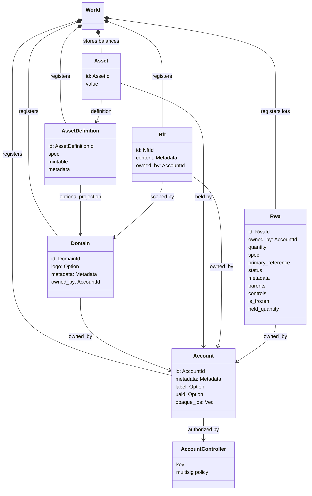
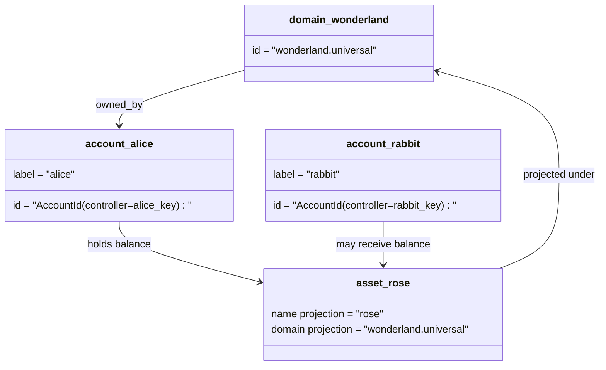

# データモデル {#data-model}

Iroha は `World` にブロックチェーン台帳の状態を保存します。初回リリースのデータモデルでは、以下の標準的な識別子とエンティティを使用します:

- ドメインはデータスペースで区別されます。例えば `payments.universal`
- アカウントは正準かつドメインレスであり、アカウントIDはアカウントコントローラーから派生します
- アセット定義はドメイン/名前のプロジェクションを保持できますが、それらの標準的なテキストアドレスは不透明なBase58識別子です
- 資産は、特定の資産定義のために口座によって保有される残高です
- NFTs は、ドメインで指定されたIDとメタデータ内容を持つ、唯一所有されるレコードです
- RWAs は、現所有者、数量、出所、メタデータ、保持、凍結、およびライフサイクル管理を持つオフチェーン資産を表す生成されたIDロットです

## 例 {#example}

Iroha 3 ネットワークでは、`wonderland.universal`は`universal`データスペース内のドメインです。この例の標準アカウントは、キーまたはポリシーによって管理され、ドメインなしの I105 アカウントIDとしてエンコードされます。`alice@wonderland.universal`のような読みやすいラベルは、それらのIDに結び付けられた別のエイリアスです。ドメインと名前（例えば `rose` in `wonderland.universal`）から、投影資産定義を構築することは依然として可能ですが、プロトコル伝送で使用される標準的な資産定義アドレスは、生成されたBase58アドレスです。

## 別名 {#aliases}

エイリアスは、標準のブロックチェーン台帳識別子に重ねられた人間向けの名前です。これらは API、CLI、ウォレット、およびエクスプローラーの境界で役立ちますが、標準IDは厳格なブロックチェーン台帳フィールドに保存される安定した識別子のままです。

|ターゲット|標準的なターゲット|別名リテラル|バックアップモデル|
| -------------- | --------------------------------------------------- | ------------------------------------------------------ | ----------------------------------------------------------------------------- |
|ユーザーアカウント|ドメインなし `AccountId` が I105 アドレスとしてエンコードされる| `name@domain.dataspace` または `name@dataspace`            | `AccountAlias`; 主なエイリアスは `Account.label`、追加のエイリアスは bindings |
|資産の定義|正規の `AssetDefinitionId` Base58 アドレス| `name#domain.dataspace` または `name#dataspace`            | `AssetDefinitionAlias` 資産定義に紐付けられています |
|契約|標準的な Bech32m `ContractAddress`| `name::domain.dataspace` または `name::dataspace`          |`ContractAlias` 配備済みコントラクトアドレスにバインド|
|ドメイン名| `DomainId` を `domain.dataspace` 形式で| `domain.dataspace`                                    | SNS `domain` ネームスペース記録 |
|データスペース名|アクティブな Nexus カタログからの数値 `DataSpaceId`| `universal`、`paynet`、または`zk`のようなデータスペースエイリアス| SNS `dataspace` 名前空間レコードとアクティブデータスペースカタログ|

アカウントのエイリアスは、ユーザーが目にするアカウント名です。エイリアスは、ワールドステートインデックスとアカウント再キー記録を通じてアクティブなアカウントIDを指すため、アカウントの再キー設定後も維持されます。アカウントの主要ラベルには `SetPrimaryAccountAlias` を使用し、追加の非主要エイリアスには `SetAccountAliasBinding` を使用し、読み取りには `FindAccountByAlias` または `FindAliasesByAccountId` を使用します。アカウントエイリアスには通常、`AcquireAccountAliasLease` で取得し、`RenewAccountAliasLease` で更新するアクティブな SNS アカウントエイリアスリースが必要です。

アセットのエイリアスは、個々のアカウント残高ではなく、アセットの定義に名前を付けます。アセットのエイリアスと契約のエイリアスは、読みやすい名前から既存の正規のターゲットへの直接的な結びつきです。資産のエイリアスは`SetAssetDefinitionAlias`で設定されます。エイリアス名のセグメントは、資産定義の表示名または投影定義名と一致する必要があります。契約のエイリアスは`SetContractAlias`で設定されます。エイリアスデータスペースは、契約アドレスにエンコードされたデータスペースと一致する必要があります。両方のバインディングは `lease_expiry_ms` を保持できます。期限切れの後、猶予期間が経過すると解決を停止し、ワールドステートインデックスから掃除されます。

ドメインには別の `DomainAlias` オブジェクトはありません。ドメイン識別子はすでに `payments.universal` のようなデータスペースで特定された名前です。SNS はリースの所有権を追跡します`domain` 名前空間のドメイン名および `dataspace` 名前空間のデータスペース別名について。`universal` の予約されたデータスペース別名は定義されたままである必要があります。

## 関連ドキュメント {#related-docs}

|トピック|どこに行くか|
| -------------------------------------- | ------------------------------------------- |
|ドメイン| [ドメイン](/ja/blockchain/domains.md)           |
|アカウント|[アカウント](/ja/blockchain/accounts.md)|
|資産| [資産](/ja/blockchain/assets.md)             |
|NFTs| [NFTs](/ja/blockchain/nfts.md)                 |
|実物資産| [実物資産](/ja/blockchain/rwas.md)    |
|メタデータ|[メタデータ](/ja/blockchain/metadata.md)|
|登録および譲渡の指示| [指示](/ja/blockchain/instructions.md) |
|ソフトウェアの実行時権限| [権限](/ja/blockchain/permissions.md)   |
|命名規則| [命名規則](/ja/reference/naming.md)        |
