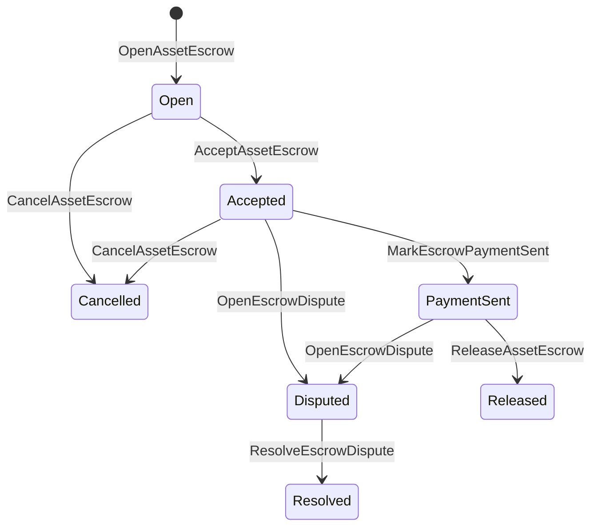

# ネイティブ資産エスクロー {#native-asset-escrow}

ネイティブエスクローは、数値資産のためのブロックチェーン台帳による管理されたカストディ機構です。資産をアプリケーション所有のアカウントに送信し、依存する代わりにそのアカウントを保護するためのアプリケーションコード、エスクロー ISIs の値を決定論的プロトコル管理アカウントに移動し、エスクローのライフサイクルをワールドステートに記録します。

マーケットプレイスの金融取引決済にはネイティブエスクローを使用し、Aitaiスタイルのオフチェーン支払い調整、マイルストーンロック、ブロックチェーン台帳のライフサイクル状態で可視化が必要なシールド付きエスクローワークフローを使用します。

## 概念 {#concepts}

|コンセプト|説明|
| --- | --- |
| `EscrowId` |暗号化ハッシュをカプセル化するクライアント選択の識別子を要求しています。それは、透過的および匿名のエスクロー全体で一意でなければなりません。|
| `AssetEscrowRecord` |透明な数値資産のエスクローまたはロック記録。|
| `AnonymousAssetEscrowRecord` |無効化子、暗号化コミットメント値、および証明添付ファイルによって裏付けられた保護付きエスクロー記録。|
|カストディ口座|チェーンID、エスクローID、資産定義から派生した決定論的プロトコルアカウント。|
|証拠の暗号ハッシュ|証拠としての暗号ハッシュは、請求書、判決、メッセージ、ストレージ技術マニフェスト、またはその他のオフチェーン証拠を識別できる。証拠のペイロード自体は、エスクロー記録には保存されない。|

透明な記録には、売り手、任意の買い手、資産の定義、合計額、カストディアカウント、ライフサイクルステータス、行動の種類、残高、任意の解放権限者、任意の有効期限タイムスタンプ、証拠の暗号ハッシュ、タイムスタンプ、および任意の解決詳細が含まれます。

エスクロー金額は正の数値資産量でなければならず、資産定義の数値仕様と一致している必要があります。エスクローやロックが有効な間、汎用資産の転送はカストディ口座を消費することはできません。カストディ口座からの退出の経路は、下記に示すエスクロー ISIs です。

## マーケットプレイス エスクロー {#marketplace-escrow}

マーケットプレイスのエスクローは、オフチェーンの支払いまたは配送ワークフローとオンチェーンの資産リリースを調整します。



| ISI |誰がそれを提出しますか|効果|
| --- | --- | --- |
| `OpenAssetEscrow` |販売者|売り手の数値資産をプロトコルのカストディにロックし、`Open` マーケットプレイスの記録を作成します。|
| `AcceptAssetEscrow` |購入者|購入者を記録し、`Open` を `Accepted` に移動します。売り手は自分自身のエスクローを受け入れることはできません。|
| `MarkEscrowPaymentSent` |承認済みの購入者|購入者がオフチェーンでの支払いを送信した後、`Accepted` を `PaymentSent` に移動します。|
| `ReleaseAssetEscrow` |販売者|`PaymentSent` を `Released` に移動し、エスクローに預けられた全額を購入者に転送します。|
| `CancelAssetEscrow` |販売者|支払いがマークされる前に、`Open` または `Accepted` を `Cancelled` に移動し、販売者に返金します。|
| `OpenEscrowDispute` |売り手または受諾された買い手|`Accepted` または `PaymentSent` を `Disputed` に移動し、証拠の暗号化ハッシュを追加します。|
| `ResolveEscrowDispute` |`CanResolveEscrowDispute` の口座|`Disputed` を `Resolved` に移動し、金額を買い手と売り手の間で分割します。|

紛争解決金額は非負でなければならず、`buyer_amount + seller_amount` はエスクロー金額と等しくなければなりません。値がゼロの金融転送部分は許可されますが、全体の分割はロックされた残高を考慮しなければなりません。

### Rust 例 {#rust-example}

この例では、売り手と買い手のアカウントがすでに存在し、資産の定義が数値として登録されており、売り手が十分な残高を持っていることを前提としています。

```rust
use iroha::{
    client::Client,
    data_model::{
        isi::escrow::{
            AcceptAssetEscrow, MarkEscrowPaymentSent, OpenAssetEscrow,
            ReleaseAssetEscrow,
        },
        prelude::*,
    },
};
use iroha_crypto::Hash;

fn release_marketplace_escrow(
    seller_client: &Client,
    buyer_client: &Client,
    asset_definition_id: AssetDefinitionId,
) -> eyre::Result<()> {
    let escrow_id = EscrowId::new(Hash::new("docs-marketplace-escrow-001"));

    seller_client.submit_blocking(OpenAssetEscrow::with_evidence_hashes(
        escrow_id,
        asset_definition_id,
        Numeric::from(40_u64),
        vec![Hash::new("invoice:2026-001")],
    ))?;

    buyer_client.submit_blocking(AcceptAssetEscrow::new(escrow_id))?;
    buyer_client.submit_blocking(MarkEscrowPaymentSent::new(escrow_id))?;
    seller_client.submit_blocking(ReleaseAssetEscrow::new(escrow_id))?;

    let record = seller_client.query_single(FindAssetEscrowById::new(escrow_id))?;
    assert_eq!(record.status, AssetEscrowStatus::Released);
    assert_eq!(record.remaining_amount, Numeric::zero());

    Ok(())
}
```

## ジェネリック資産ロック {#generic-asset-locks}

資産ロックは同じカストディ記録タイプを使用しますが、買い手と売り手のオファーではありません。これらは資金を送金先アカウントにロックし、任意で資金を引き出すために別のリリース承認主体を必要とする場合があります。

| ISI |誰がそれを提出しますか|効果|
| --- | --- | --- |
| `OpenAssetLock` |送金元アカウント|正の金額をロックし、宛先を記録として購入者として記録し、ステータスを`Locked`に設定します。|
| `DrawdownAssetLock` |リリース承認の責任者、またはリリース承認の責任者が設定されていない場合の宛先|残りの管理権の一部または全部を目的地に譲渡します。|
| `CancelAssetLock` |鍵開け器|アクティブなロックをキャンセルし、残りの金額を開設者に返金します。|
| `ExpireAssetLock` |期限後のすべての取引承認の原則|過去に `expires_at_ms` のロックを期限切れにし、残りの金額を開設者に返金します。|

`DrawdownAssetLock`は、残高がある間、`Locked`に記録を保持します。残高がゼロになると、ステータスは`DrawnDown`になり、記録はクローズされます。

```rust
use iroha::{
    client::Client,
    data_model::{
        isi::escrow::{CancelAssetLock, DrawdownAssetLock, ExpireAssetLock, OpenAssetLock},
        prelude::*,
    },
};
use iroha_crypto::Hash;

fn drawdown_and_close_asset_locks(
    opener_client: &Client,
    destination_client: &Client,
    release_authority_client: &Client,
    asset_definition_id: AssetDefinitionId,
    destination: AccountId,
    release_authority: AccountId,
) -> eyre::Result<()> {
    let trusted_lock_id = EscrowId::new(Hash::new("docs-asset-lock-trusted"));

    opener_client.submit_blocking(OpenAssetLock::with_options(
        trusted_lock_id,
        asset_definition_id.clone(),
        destination.clone(),
        Numeric::from(40_u64),
        Some(release_authority),
        None,
        vec![Hash::new("milestone-plan-v1")],
    ))?;

    release_authority_client.submit_blocking(DrawdownAssetLock::new(
        trusted_lock_id,
        Numeric::from(15_u64),
    ))?;

    let partially_drawn =
        opener_client.query_single(FindAssetEscrowById::new(trusted_lock_id))?;
    assert_eq!(partially_drawn.status, AssetEscrowStatus::Locked);
    assert_eq!(partially_drawn.remaining_amount, Numeric::from(25_u64));

    opener_client.submit_blocking(CancelAssetLock::new(trusted_lock_id))?;
    let cancelled = opener_client.query_single(FindAssetEscrowById::new(trusted_lock_id))?;
    assert_eq!(cancelled.status, AssetEscrowStatus::Cancelled);

    let expiring_lock_id = EscrowId::new(Hash::new("docs-asset-lock-expiring"));
    opener_client.submit_blocking(OpenAssetLock::with_options(
        expiring_lock_id,
        asset_definition_id,
        destination,
        Numeric::from(10_u64),
        None,
        Some(0),
        Vec::new(),
    ))?;

    destination_client.submit_blocking(ExpireAssetLock::new(expiring_lock_id))?;
    let expired = opener_client.query_single(FindAssetEscrowById::new(expiring_lock_id))?;
    assert_eq!(expired.status, AssetEscrowStatus::Expired);

    Ok(())
}
```

Python は現在、汎用ロック用の高レベルヘルパーを公開しています：`open_asset_lock`、`drawdown_asset_lock`、`cancel_asset_lock`、および `expire_asset_lock`。マーケットプレイスおよび匿名エスクロー用の Python、SDK の JSON 脱出ハッチを通じて正規の`InstructionBox`JSON を使用するか、ファーストクラスのエスクロービルダーを公開している SDK を通じて提出してください。

## 紛争 {#disputes}

マーケットプレイスのエスクローは`Accepted`または`PaymentSent`から紛争を開始できます。紛争を開くことができるのは記録された販売者または購入者のみです。解決には`CanResolveEscrowDispute`が必要であり、直接解決者アカウントに付与されるか、ロールを通じて継承されます。

```rust
use iroha::{
    client::Client,
    data_model::{
        isi::escrow::{OpenEscrowDispute, ResolveEscrowDispute},
        prelude::*,
    },
};
use iroha_crypto::Hash;
use iroha_executor_data_model::permission::escrow::CanResolveEscrowDispute;

fn resolve_disputed_escrow(
    admin_client: &Client,
    buyer_client: &Client,
    court_client: &Client,
    court: AccountId,
    escrow_id: EscrowId,
) -> eyre::Result<()> {
    admin_client.submit_blocking(Grant::account_permission(
        Permission::from(CanResolveEscrowDispute),
        court,
    ))?;

    buyer_client.submit_blocking(OpenEscrowDispute::with_evidence_hashes(
        escrow_id,
        vec![Hash::new("buyer-payment-receipt")],
    ))?;

    court_client.submit_blocking(ResolveEscrowDispute::with_evidence_hashes(
        escrow_id,
        Numeric::from(30_u64),
        Numeric::from(10_u64),
        vec![Hash::new("court-judgement-001")],
    ))?;

    let record = admin_client.query_single(FindAssetEscrowById::new(escrow_id))?;
    assert_eq!(record.status, AssetEscrowStatus::Resolved);
    assert_eq!(
        record.resolution.as_ref().map(|resolution| resolution.buyer_amount.clone()),
        Some(Numeric::from(30_u64)),
    );

    Ok(())
}
```

## 匿名エスクロー {#anonymous-escrow}

匿名のエスクローは同じマーケットプレイスライフサイクルを使用しますが、資金の移動と契約完了時の資産移動は保護されます。公開記録には依然として売り手、買い手、ステータスが保存されます、証拠として暗号化ハッシュ、タイムスタンプ、証明にリンクされた移動記録がある。シールドノート内の金額と受取人は、暗号的コミットメント値、ヌリファイア、および証明添付によって表される。

|透明 ISI|匿名 ISI|
| --- | --- |
| `OpenAssetEscrow` | `OpenAnonymousAssetEscrow` |
| `AcceptAssetEscrow` | `AcceptAnonymousAssetEscrow` |
| `MarkEscrowPaymentSent` | `MarkAnonymousEscrowPaymentSent` |
| `ReleaseAssetEscrow` | `ReleaseAnonymousAssetEscrow` |
| `CancelAssetEscrow` | `CancelAnonymousAssetEscrow` |
| `OpenEscrowDispute` | `OpenAnonymousEscrowDispute` |
| `ResolveEscrowDispute` | `ResolveAnonymousEscrowDispute` |

ウォレットまたは証明者ツールは、証明の添付ファイルと公開入力を作成する必要があります。オープンは1つのエスクロー暗号コミットメント値を作成します。リリース、キャンセル、そして、匿名の紛争解決は、正確に1つのエスクロ暗号化コミットメント値を費やし、アクションで要求される買い手、売り手、または分割出力の暗号化コミットメント値を作成しなければなりません。

```rust
use iroha::{
    client::Client,
    data_model::{
        isi::escrow::{
            AcceptAnonymousAssetEscrow, MarkAnonymousEscrowPaymentSent,
            OpenAnonymousAssetEscrow,
        },
        prelude::*,
        proof::ProofAttachment,
    },
};
use iroha_crypto::Hash;

fn open_anonymous_escrow(
    seller_client: &Client,
    buyer_client: &Client,
    escrow_id: EscrowId,
    asset_definition_id: AssetDefinitionId,
    funding_nullifiers: Vec<[u8; 32]>,
    escrow_commitment: [u8; 32],
    proof: ProofAttachment,
    root_hint: Option<[u8; 32]>,
) -> eyre::Result<()> {
    seller_client.submit_blocking(OpenAnonymousAssetEscrow::with_evidence_hashes(
        escrow_id,
        asset_definition_id,
        funding_nullifiers,
        escrow_commitment,
        proof,
        root_hint,
        vec![Hash::new("shielded-invoice")],
    ))?;

    buyer_client.submit_blocking(AcceptAnonymousAssetEscrow::new(escrow_id))?;
    buyer_client.submit_blocking(MarkAnonymousEscrowPaymentSent::new(escrow_id))?;

    Ok(())
}
```

基礎となるシールド取引モデルについては、[匿名取引](/ja/blockchain/anonymous-transactions.md)を参照してください。

## SDK 使用方法 {#sdk-usage}

エスクローサポートは、SDKs によって異なる方法で公開されています。Rust は標準的な型付きデータモデルを持っています。Python は現在、汎用の資産ロックヘルパーを公開しています。JavaScript と TypeScript は Kotodama エスクロー ホスト機能呼び出しを使用します。 Kotlin/JVM と Swift は、マーケットプレイスおよび匿名エスクロー用の型指定ペイロードビルダーを提供します。

| SDK |この面を使用してください|範囲|
| --- | --- | --- |
| [Rust](#rust-sdk) | `iroha::data_model::isi::escrow` |マーケットプレイスのエスクロー、一般的なロック、匿名エスクロー、クエリ、そしてイベント。|
| [Python](#python-asset-locks) | `Instruction.open_asset_lock`、`TransactionDraft.open_asset_lock`、およびクライアント `*_and_wait` のヘルパー |汎用資産ロック。マーケットプレイスおよび匿名エスクローヘルパーは、まだファーストクラスの Python メソッドではありません。|
| [JavaScript / TypeScript](#javascript-and-typescript-kotodama) | `compileKotodamaProgram` から `@iroha/iroha-js/kotodama-compiler` |Kotodama コントラクト内のエスクロー ホスト関数の呼び出し。|
| [Kotlin / JVM](#kotlin-and-jvm) |`org.hyperledger.iroha.sdk.core.model.instructions`の`InstructionTemplate`クラス|マーケットプレイスおよび匿名エスクローのカスタム指示テンプレート。|
| [Swift / iOS](#swift-and-ios) |`NativeEscrowInstructionBuilders` と `IrohaSDK.build*Escrow*` ヘルパー|マーケットプレイスおよび匿名エスクロー Norito JSON 指示ペイロード。|

以下の例は指示の作成に焦点を当てています。口座資金の提供、署名管理、および取引の送信は、それぞれの SDK の通常の手順に従います。

### Rust SDK {#rust-sdk}

完全なネイティブのカバレッジやクエリ／イベントサポートが必要な場合は、Rust SDK を使用してください。上記の例は、マーケットプレイスのリリース、一般的なロックの引き下げ、紛争解決、および `iroha::data_model::isi::escrow` を使用した匿名エスクローの構築を示しています。

```rust
use iroha::{
    client::Client,
    data_model::{isi::escrow::OpenAssetEscrow, prelude::*},
};
use iroha_crypto::Hash;

fn open_and_read(
    client: &Client,
    asset_definition_id: AssetDefinitionId,
) -> eyre::Result<AssetEscrowRecord> {
    let escrow_id = EscrowId::new(Hash::new("docs-rust-sdk-escrow"));

    client.submit_blocking(OpenAssetEscrow::new(
        escrow_id,
        asset_definition_id,
        Numeric::from(10_u64),
    ))?;

    client.query_single(FindAssetEscrowById::new(escrow_id))
}
```

### Python 資産ロック {#python-asset-locks}

Python SDK は、汎用資産ロックのための一流のヘルパーを提供します。これらは、マイルストーン支払い、リリース承認者による支払いの引き出し、開設者によるキャンセル、および期限切れの払い戻しに使用できます。

```python
client.open_asset_lock_and_wait(
    chain_id="dev-chain",
    authority="<source-account-id>",
    private_key_hex="<source-private-key-hex>",
    escrow_id="merchant-lock-001",
    asset_definition_id="<asset-definition-base58>",
    destination="<destination-account-id>",
    amount="2500",
    release_authority="<trusted-release-account-id>",
    expires_at_ms=1_704_000_000_000,
)

client.drawdown_asset_lock_and_wait(
    chain_id="dev-chain",
    authority="<trusted-release-account-id>",
    private_key_hex="<trusted-release-private-key-hex>",
    escrow_id="merchant-lock-001",
    amount="1000",
)

client.expire_asset_lock_and_wait(
    chain_id="dev-chain",
    authority="<any-account-id>",
    private_key_hex="<any-private-key-hex>",
    escrow_id="merchant-lock-001",
)
```

二者間ロックの場合、`release_authority`を省略してください。その後、宛先アカウントは`drawdown_asset_lock`を提出できます。

### JavaScript と TypeScript Kotodama {#javascript-and-typescript-kotodama}

現在、JavaScript SDK は直接的なネイティブエスクロートランザクションビルダーを公開していません。Kotodama コントラクトをデプロイする JavaScript または TypeScript アプリケーションの場合、Kotodama コンパイラーを使用してエスクローのホスト関数呼び出しをコンパイルしてください。

ネイティブのエスクロー・ホスト呼び出しでは、不透明なエスクロー ISIs からコンパイラーがより狭いアクセス集合を導出できないため、明示的なアクセスヒントが必要です。`escrow_*` ビルトインを呼び出す公開エントリーポイントには、ワイルドカードのヒントを使用してください。

```js
import { compileKotodamaProgram } from "@iroha/iroha-js/kotodama-compiler";

const source = `
seiyaku MarketplaceEscrow {
  meta { abi_version: 1; }

  #[access(read="*", write="*")]
  kotoage fn run() permission(Admin) {
    let asset = asset_definition("62Fk4FPcMuLvW5QjDGNF2a4jAmjM");
    let offer = name("aitai_offer");
    let evidence = norito_bytes("00");

    call escrow_open_offer(offer, asset, 10, evidence);
    call escrow_accept(offer);
    call escrow_mark_payment_sent(offer);
    call escrow_release(offer);
  }
}
`;

const compiled = compileKotodamaProgram(source, {
  sourceName: "escrow.ko",
});

if (compiled.diagnostics.length > 0) {
  throw new Error(compiled.diagnostics.map((item) => item.message).join("\n"));
}
```

紛争の場合は、`escrow_open_dispute(offer, evidence)` および `escrow_resolve_dispute(offer, buyer_amount, seller_amount, evidence)` を使用してください。匿名のエスクローホスト機能の呼び出しは Norito リクエストペイロードのバイトを受け入れます。例えば `anonymous_escrow_open_offer(request)` です。

### Kotlin と JVM {#kotlin-and-jvm}

Kotlin/JVM SDK は、ネイティブエスクローをカスタム指示テンプレートとしてモデル化します。各テンプレートは必須フィールドを検証し、トランザクションビルダーで使用される標準引数マップを公開します。

```kotlin
import org.hyperledger.iroha.sdk.core.model.escrow.NativeEscrowPermissions
import org.hyperledger.iroha.sdk.core.model.instructions.AcceptAssetEscrowInstruction
import org.hyperledger.iroha.sdk.core.model.instructions.MarkEscrowPaymentSentInstruction
import org.hyperledger.iroha.sdk.core.model.instructions.OpenAssetEscrowInstruction
import org.hyperledger.iroha.sdk.core.model.instructions.ReleaseAssetEscrowInstruction
import org.hyperledger.iroha.sdk.core.model.instructions.ResolveEscrowDisputeInstruction

val open = OpenAssetEscrowInstruction(
    escrowId = "escrow-hash",
    assetDefinition = "xor#wonderland",
    amount = "42.5",
    evidenceHashes = listOf("invoice-hash"),
)
val accept = AcceptAssetEscrowInstruction("escrow-hash")
val paid = MarkEscrowPaymentSentInstruction("escrow-hash")
val release = ReleaseAssetEscrowInstruction("escrow-hash")
val resolve = ResolveEscrowDisputeInstruction(
    escrowId = "escrow-hash",
    buyerAmount = "30",
    sellerAmount = "12.5",
    evidenceHashes = listOf("judgement-hash"),
)

println(open.arguments)
println(NativeEscrowPermissions.CAN_RESOLVE_ESCROW_DISPUTE)
```

匿名テンプレートは `OpenAnonymousAssetEscrowInstruction`、`AcceptAnonymousAssetEscrowInstruction`、`MarkAnonymousEscrowPaymentSentInstruction`、`ReleaseAnonymousAssetEscrowInstruction`、`CancelAnonymousAssetEscrowInstruction`、`OpenAnonymousEscrowDisputeInstruction`、および `ResolveAnonymousEscrowDisputeInstruction` として利用可能です。Android Java クライアントは、Android アーティファクトから対応する `NativeEscrowInstructions.*` ビルダーを使用できます。

### Swift と iOS {#swift-and-ios}

Swift SDK は、Norito JSON ペイロードとしてエスクローの指示を構築します。`NativeEscrowInstructionBuilders` を直接使用するか、アプリがすでに `IrohaSDK` のインスタンスを保持している場合は、同等の `IrohaSDK.build*Escrow*` ヘルパーを呼び出してください。

```swift
import IrohaSwift

let open = try NativeEscrowInstructionBuilders.openAssetEscrow(
    escrowId: "escrow-hash",
    assetDefinition: "xor#wonderland",
    amount: "42.5",
    evidenceHashes: ["invoice-hash"]
)
let accept = try NativeEscrowInstructionBuilders.acceptAssetEscrow(
    escrowId: "escrow-hash"
)
let paid = try NativeEscrowInstructionBuilders.markEscrowPaymentSent(
    escrowId: "escrow-hash"
)
let release = try NativeEscrowInstructionBuilders.releaseAssetEscrow(
    escrowId: "escrow-hash"
)
let resolve = try NativeEscrowInstructionBuilders.resolveEscrowDispute(
    escrowId: "escrow-hash",
    buyerAmount: "30",
    sellerAmount: "12.5",
    evidenceHashes: ["judgement-hash"]
)
```

匿名の Swift ビルダーは、無効化リスト、暗号化コミットメント値リスト、証明辞書、およびオプションの `rootHint` 値を取得します。紛争解決者の許可トークンは `NativeEscrowPermissions.canResolveEscrowDispute` として利用可能です。

## クエリとイベント {#queries-and-events}

ステータスページ、照合ジョブ、サポートツールにはエスクロークエリを使用してください:

|クエリ|目的|
| --- | --- |
| `FindAssetEscrowById` |`EscrowId`によって、透過型のエスクローまたはロックを1つ読む。|
| `FindAssetEscrows` |透明なエスクローとロックの記録を一覧表示します。|
| `FindAssetEscrowsBySeller` |販売者またはロック開閉者によって開かれた記録を一覧表示します。|
| `FindAssetEscrowsByBuyer` |購入者に受け入れられるマーケットプレイスのエスクローや、目的地をターゲットにしたロックの一覧。|
| `FindAssetEscrowsByStatus` |`AssetEscrowStatus`でレコードを一覧表示する。|
| `FindAnonymousAssetEscrowById` | `EscrowId`による匿名のエスクローを1つ読む。|
| `FindAnonymousAssetEscrows*` |すべての記録、売り手、買い手、または状態別に匿名エスクローを一覧表示します。|

`EscrowEventFilter` 透明なネイティブエスクローおよびエスクローIDによるロックイベントに購読できます, 販売者、購入者、ステータス、そしてイベントセットマスク。イベントファミリーには含まれます `Opened`, `Accepted`, `PaymentSent`, `Released`, `Cancelled`, `Expired`, `Disputed`, そして `Resolved`. 匿名のエスクロー記録は、匿名のエスクロー照会を通じて確認されます。

## 運用ノート {#operational-notes}

- 大きな請求書、チャットログ、判決、または監査バンドルをエスクロー記録の外に保存し、それらの暗号ハッシュを証拠として添付します。
- アプリケーションで安定した`EscrowId`導出を使用して、再試行によって同じオファーに対して重複したエスクローが作成されないようにします。
- 紛争プロセスを操作するアカウントまたはロールにのみ `CanResolveEscrowDispute` を付与します。
- オフチェーンの支払い確認はアプリケーションの方針として扱ってください。Iroha は保管およびライフサイクルの移行を記録しますが、それ自体で法定通貨や外部の支払い経路を検証するものではありません。
