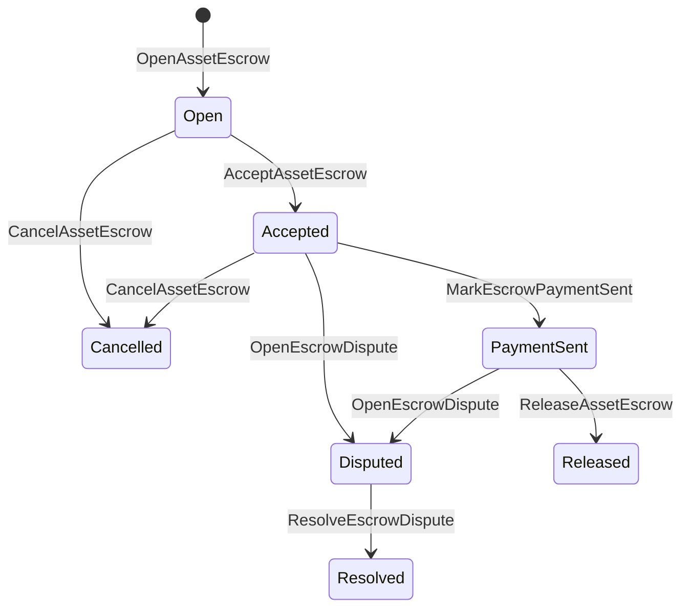

# 国産資産のエスクロー {#native-asset-escrow}

Native escrow は,数値資産の保管メカニズムです. アプリケーションが所有するアカウントに資産を送信し,そのアカウントを保護するためにアプリケーションコードに頼る代わりに,エスクロー ISIs は,価値を決定的なプロトコル保管口座に移動し,世界状態でエスクローのライフサイクルを記録する.

市場決済のためにネイティブエスクローを使用し,Aitai様式のオフチェーンの支払い調整,マイルストーンロックおよびレジスタに可視生命周期状態を必要とする保護されたエスクローワークフローを使用します.

## 概念 {#concepts}

|概念|記述|
| --- | --- |
|`EscrowId`|呼び出し者によって選択された識別子はハッシュを包み込みます.透明で匿名なエスクロー間でユニークである必要があります.|
|`AssetEscrowRecord`|透明な数値資産保管またはロック記録. |
|`AnonymousAssetEscrowRecord`|破棄者,コミットメント,証明書による保証記録が保護されています.|
|保管口座|チェーン ID,エスクロー ID,および資産定義から派生した決定的プロトコル口座. |
|証拠はハッシュだ|証拠ハッシュは,請求書,判定,メッセージ,保管マニフェスト,または他のチェーン外の証拠を特定することができます.証拠用荷物はエスクロー記録に保存されません. |

透明な記録には売り手,オプション購入者,資産定義,総額,保管口座,ライフサイクルの状態,行動種類,残る金額,オプションのリリース権限,オプションの有効期限スタンプ,証拠ハッシュ,タイムスタンプ,およびオプションの解決詳細が含まれています.

エスクローの金額は正数的な資産量であり,資産定義の数値仕様に対応しなければならない.エスクローまたはロックが有効である間は,一般的な資産転送は保管口座を枯渇させることはできません;保管出口経路は以下のescrow ISIs です.

## 市場エスクロー {#marketplace-escrow}

市場のエスクローは,チェーン上の資産のリリースとオフ・チェーンの支払いまたは配達ワークフローを調整します.



|ISI|誰が提出する?|影響|
| --- | --- | --- |
|`OpenAssetEscrow`|販売者|販売者の数値資産をプロトコル保管にロックし, `Open`市場記録を作成する. |
|`AcceptAssetEscrow`|購入者|購入者を記録し, `Open` を `Accepted` に移動する.売り手は自分の保証書を受け入れることはできません. |
|`MarkEscrowPaymentSent`|受け入れられた買い手|`Accepted` を `PaymentSent` に移動する 購入者が無鎖の支払いを送信した後. |
|`ReleaseAssetEscrow`|販売者|`PaymentSent` を `Released` に移動し,全額の保証金を買い手に譲渡する. |
|`CancelAssetEscrow`|販売者|`Open`または`Accepted`を `Cancelled`に移動し,支払いがマークされる前に売り者に返済します. |
|`OpenEscrowDispute`|販売者または受付された買い手|`Accepted`または`PaymentSent`を `Disputed`に移動し,証拠ハッシュを追加する. |
|`ResolveEscrowDispute`|`CanResolveEscrowDispute`の口座|`Disputed` から `Resolved` に移動し,購入者と販売者間で金額を分割する. |

紛争解決金額は負でないもので, `buyer_amount + seller_amount` は保証金額に等しくなければならない.ゼロ価値の足が許容されているが,全体の分割はロックされた余分を考慮しなければならない.

### Rust 例 {#rust-example}

この例では,売り手と買い手の口座が既に存在し,資産定義は数値として登録され,売り手は十分な余分を有すると仮定する.

```rust
use iroha::{
    client::Client,
    data_model::{
        isi::escrow::{
            AcceptAssetEscrow, MarkEscrowPaymentSent, OpenAssetEscrow,
            ReleaseAssetEscrow,
        },
        prelude::*,
    },
};
use iroha_crypto::Hash;

fn release_marketplace_escrow(
    seller_client: &Client,
    buyer_client: &Client,
    asset_definition_id: AssetDefinitionId,
) -> eyre::Result<()> {
    let escrow_id = EscrowId::new(Hash::new("docs-marketplace-escrow-001"));

    seller_client.submit_blocking(OpenAssetEscrow::with_evidence_hashes(
        escrow_id,
        asset_definition_id,
        Numeric::from(40_u64),
        vec![Hash::new("invoice:2026-001")],
    ))?;

    buyer_client.submit_blocking(AcceptAssetEscrow::new(escrow_id))?;
    buyer_client.submit_blocking(MarkEscrowPaymentSent::new(escrow_id))?;
    seller_client.submit_blocking(ReleaseAssetEscrow::new(escrow_id))?;

    let record = seller_client.query_single(FindAssetEscrowById::new(escrow_id))?;
    assert_eq!(record.status, AssetEscrowStatus::Released);
    assert_eq!(record.remaining_amount, Numeric::zero());

    Ok(())
}
```

## 汎用資産ロック {#generic-asset-locks}

アセットロックは同じ保管記録タイプを使用しますが,買い手-売り手のオファーではありません. 目的地アカウントのための資金をロックし,オプションとして資金を引き出すために別々のリリース当局を必要とします.

|ISI|誰が提出する?|影響|
| --- | --- | --- |
|`OpenAssetLock`|ソースアカウント|ポジティブな金額をロックし,目的地を記録購入者として記録し,状態を `Locked` に設定します. |
|`DrawdownAssetLock`|放出権限が設定されていない場合,放出権限または目的地|残りの保管の一部または全部を目的地に転送する. |
|`CancelAssetLock`|鍵開機|アクティブロックを取り消し,残る金額を開機者に返します.|
|`ExpireAssetLock`|期限を過ぎたすべての取引当局|過去の `expires_at_ms` のロックが終了し,残りの金額を開機者に返還します. |

`DrawdownAssetLock`は,いくつかの金額が残っている間,記録を`Locked`で保持する.残りの額がゼロに達すると,状態は `DrawnDown`となり,記録は終了します.

```rust
use iroha::{
    client::Client,
    data_model::{
        isi::escrow::{CancelAssetLock, DrawdownAssetLock, ExpireAssetLock, OpenAssetLock},
        prelude::*,
    },
};
use iroha_crypto::Hash;

fn drawdown_and_close_asset_locks(
    opener_client: &Client,
    destination_client: &Client,
    release_authority_client: &Client,
    asset_definition_id: AssetDefinitionId,
    destination: AccountId,
    release_authority: AccountId,
) -> eyre::Result<()> {
    let trusted_lock_id = EscrowId::new(Hash::new("docs-asset-lock-trusted"));

    opener_client.submit_blocking(OpenAssetLock::with_options(
        trusted_lock_id,
        asset_definition_id.clone(),
        destination.clone(),
        Numeric::from(40_u64),
        Some(release_authority),
        None,
        vec![Hash::new("milestone-plan-v1")],
    ))?;

    release_authority_client.submit_blocking(DrawdownAssetLock::new(
        trusted_lock_id,
        Numeric::from(15_u64),
    ))?;

    let partially_drawn =
        opener_client.query_single(FindAssetEscrowById::new(trusted_lock_id))?;
    assert_eq!(partially_drawn.status, AssetEscrowStatus::Locked);
    assert_eq!(partially_drawn.remaining_amount, Numeric::from(25_u64));

    opener_client.submit_blocking(CancelAssetLock::new(
        trusted_lock_id,
        partially_drawn.remaining_amount.clone(),
    ))?;
    let cancelled = opener_client.query_single(FindAssetEscrowById::new(trusted_lock_id))?;
    assert_eq!(cancelled.status, AssetEscrowStatus::Cancelled);

    let expiring_lock_id = EscrowId::new(Hash::new("docs-asset-lock-expiring"));
    opener_client.submit_blocking(OpenAssetLock::with_options(
        expiring_lock_id,
        asset_definition_id,
        destination,
        Numeric::from(10_u64),
        None,
        Some(0),
        Vec::new(),
    ))?;

    destination_client.submit_blocking(ExpireAssetLock::new(expiring_lock_id))?;
    let expired = opener_client.query_single(FindAssetEscrowById::new(expiring_lock_id))?;
    assert_eq!(expired.status, AssetEscrowStatus::Expired);

    Ok(())
}
```

Python 現在,ジェネリックロック用のハイレベルヘルパーを暴露している. `open_asset_lock`, `drawdown_asset_lock`, `cancel_asset_lock`, そして `expire_asset_lock`. 市場および匿名保証人向け Python, 使う法典 `InstructionBox` JSON 経由で SDK やってる JSON エスケープ・ラッチか, SDK ファーストクラスのエスクロービルダーを暴露する

## 論争 {#disputes}

`Accepted`または `PaymentSent`から紛争を入力することができる.登録された売り手または購入者だけが争いを開くことができる.解決は,直接決済口座に譲渡されるか,役割を通じて継承されるかを要求する`CanResolveEscrowDispute`.

```rust
use iroha::{
    client::Client,
    data_model::{
        isi::escrow::{OpenEscrowDispute, ResolveEscrowDispute},
        prelude::*,
    },
};
use iroha_crypto::Hash;
use iroha_executor_data_model::permission::escrow::CanResolveEscrowDispute;

fn resolve_disputed_escrow(
    admin_client: &Client,
    buyer_client: &Client,
    court_client: &Client,
    court: AccountId,
    escrow_id: EscrowId,
) -> eyre::Result<()> {
    admin_client.submit_blocking(Grant::account_permission(
        Permission::from(CanResolveEscrowDispute),
        court,
    ))?;

    buyer_client.submit_blocking(OpenEscrowDispute::with_evidence_hashes(
        escrow_id,
        vec![Hash::new("buyer-payment-receipt")],
    ))?;

    court_client.submit_blocking(ResolveEscrowDispute::with_evidence_hashes(
        escrow_id,
        Numeric::from(30_u64),
        Numeric::from(10_u64),
        vec![Hash::new("court-judgement-001")],
    ))?;

    let record = admin_client.query_single(FindAssetEscrowById::new(escrow_id))?;
    assert_eq!(record.status, AssetEscrowStatus::Resolved);
    assert_eq!(
        record.resolution.as_ref().map(|resolution| resolution.buyer_amount.clone()),
        Some(Numeric::from(30_u64)),
    );

    Ok(())
}
```

## アノニマス・エスクロー {#anonymous-escrow}

アノニマス・エスクローは同じ市場ライフサイクルを使用しますが,資金調達と閉鎖資産の動きは保護されています.公開記録ではまだ売り手,購入者,ステータス,証拠ハッシュ,タイムスタンプ,証明リンクされた移動記録が保存されます.封印された紙幣の内にある金額と受領者は,約束書,無効化書,証明書添付書で表記されています.

|透明性 ISI|匿名 ISI|
| --- | --- |
|`OpenAssetEscrow`|`OpenAnonymousAssetEscrow`|
|`AcceptAssetEscrow`|`AcceptAnonymousAssetEscrow`|
|`MarkEscrowPaymentSent`|`MarkAnonymousEscrowPaymentSent`|
|`ReleaseAssetEscrow`|`ReleaseAnonymousAssetEscrow`|
|`CancelAssetEscrow`|`CancelAnonymousAssetEscrow`|
|`OpenEscrowDispute`|`OpenAnonymousEscrowDispute`|
|`ResolveEscrowDispute`|`ResolveAnonymousEscrowDispute`|

ウォレットまたはプロバーツリングは証明付属と公開入力を構築する必要があります.開設はエスクローコミットメントを作成します.解放,キャンセル,および匿名紛争解決はエスクロコミットメントを正確に1つ費やし,購入者,売り手,またはアクションによって要求される分割輸出コミットメントを作成する必要があります.

```rust
use iroha::{
    client::Client,
    data_model::{
        isi::escrow::{
            AcceptAnonymousAssetEscrow, MarkAnonymousEscrowPaymentSent,
            OpenAnonymousAssetEscrow,
        },
        prelude::*,
        proof::ProofAttachment,
    },
};
use iroha_crypto::Hash;

fn open_anonymous_escrow(
    seller_client: &Client,
    buyer_client: &Client,
    escrow_id: EscrowId,
    asset_definition_id: AssetDefinitionId,
    funding_nullifiers: Vec<[u8; 32]>,
    escrow_commitment: [u8; 32],
    proof: ProofAttachment,
    root_hint: Option<[u8; 32]>,
) -> eyre::Result<()> {
    seller_client.submit_blocking(OpenAnonymousAssetEscrow::with_evidence_hashes(
        escrow_id,
        asset_definition_id,
        funding_nullifiers,
        escrow_commitment,
        proof,
        root_hint,
        vec![Hash::new("shielded-invoice")],
    ))?;

    buyer_client.submit_blocking(AcceptAnonymousAssetEscrow::new(escrow_id))?;
    buyer_client.submit_blocking(MarkAnonymousEscrowPaymentSent::new(escrow_id))?;

    Ok(())
}
```

基礎となる保護された取引モデルについては, [匿名取引](/ja/blockchain/anonymous-transactions.md)を参照してください.

## SDK 使用 {#sdk-usage}

エスクローサポートは SDKs 全体で異なる形で暴露されています. Rust にはカノニカル型データモデルがあります. Python は現在,一般的な資産ロックヘルパーを暴露しています. JavaScript と TypeScript は Kotodama エスクローホスト電話を使用します.Kotlin/JVM と Swift は,市場向けにタイプされた有用な荷物の構築者および匿名の保証人を提供している.

|SDK|この表面を使う|範囲|
| --- | --- | --- |
| [Rust](#rust-sdk) |`iroha::data_model::isi::escrow`|市場エスクロー,通用ロック,匿名のエスクロー 查询,イベント|
| [Python](#python-asset-locks) |`Instruction.open_asset_lock`,`TransactionDraft.open_asset_lock`,およびクライアント `*_and_wait`の支援者 |市場や匿名のエスクロー助手はまだファーストクラス Python の方法ではない. |
| [JavaScript / TypeScript](#javascript-and-typescript-kotodama) |`compileKotodamaProgram` から `@iroha/iroha-js/kotodama-compiler` |Kotodama 契約内のエスクローホストの電話です. |
| [Kotlin / JVM](#kotlin-and-jvm) |`InstructionTemplate`クラスで `org.hyperledger.iroha.sdk.core.model.instructions` |市場と匿名のエスクローのカスタム指示テンプレート|
| [Swift /iOS](#swift-and-ios) |`NativeEscrowInstructionBuilders` と `IrohaSDK.build*Escrow*` の助手 |市場および匿名のエスクロー Norito JSON の指示用荷物. |

下記の例は,指示の構築に焦点を当てています.口座資金提供,署名管理,取引提出は各 SDK の通常の流れに従います.

### Rust SDK {#rust-sdk}

Rust SDK を使用する場合は,完全なネイティブ・カバーやクエリ/イベントサポートが必要になります.上記の例では,市場公開,通用ロック引き下げ,紛争解決,および匿名のエスクロー構築が `iroha::data_model::isi::escrow` で示されています.

```rust
use iroha::{
    client::Client,
    data_model::{isi::escrow::OpenAssetEscrow, prelude::*},
};
use iroha_crypto::Hash;

fn open_and_read(
    client: &Client,
    asset_definition_id: AssetDefinitionId,
) -> eyre::Result<AssetEscrowRecord> {
    let escrow_id = EscrowId::new(Hash::new("docs-rust-sdk-escrow"));

    client.submit_blocking(OpenAssetEscrow::new(
        escrow_id,
        asset_definition_id,
        Numeric::from(10_u64),
    ))?;

    client.query_single(FindAssetEscrowById::new(escrow_id))
}
```

### Python アセットロック {#python-asset-locks}

Python SDK は,ジェネリック・アセットロックに対するファーストクラスヘルパーを暴露します. 里程碑式の支払い,リリース当局による引き出物,開設者によるキャンセル,および期限後払い戻しのためにそれらを使用します.

```python
client.open_asset_lock_and_wait(
    chain_id="dev-chain",
    authority="<source-account-id>",
    private_key_hex="<source-private-key-hex>",
    escrow_id="merchant-lock-001",
    asset_definition_id="<asset-definition-base58>",
    destination="<destination-account-id>",
    amount="2500",
    release_authority="<trusted-release-account-id>",
    expires_at_ms=1_704_000_000_000,
)

client.drawdown_asset_lock_and_wait(
    chain_id="dev-chain",
    authority="<trusted-release-account-id>",
    private_key_hex="<trusted-release-private-key-hex>",
    escrow_id="merchant-lock-001",
    amount="1000",
)

client.expire_asset_lock_and_wait(
    chain_id="dev-chain",
    authority="<any-account-id>",
    private_key_hex="<any-private-key-hex>",
    escrow_id="merchant-lock-001",
)
```

双方のロックの場合, `release_authority` を省略する.その後,目的地アカウントは `drawdown_asset_lock` を提出することができます.

### JavaScript と TypeScript Kotodama {#javascript-and-typescript-kotodama}

労働組合 JavaScript SDK 現在,直接のネイティブ エスクロー取引構築者を暴露していない. JavaScript または TypeScript 展開するアプリケーション Kotodama 契約,エスクローホストの呼び出しを Kotodama 編集者

Native escrow host の呼び出しは,コンパイラが不透明な escrow に対してより狭いアクセスセットを導き出すことができないため,明示的なアクセスヒントを必要とします. ISIs. 呼び出しする輸出入口にワイルドカードヒントを使用します `escrow_*` 建築物だ

```js
import { compileKotodamaProgram } from "@iroha/iroha-js/kotodama-compiler";

const source = `
seiyaku MarketplaceEscrow {
  meta { abi_version: 1; }

  #[access(read="*", write="*")]
  kotoage fn run() permission(Admin) {
    let asset = asset_definition("62Fk4FPcMuLvW5QjDGNF2a4jAmjM");
    let offer = name("aitai_offer");
    let evidence = norito_bytes("00");

    call escrow_open_offer(offer, asset, 10, evidence);
    call escrow_accept(offer);
    call escrow_mark_payment_sent(offer);
    call escrow_release(offer);
  }
}
`;

const compiled = compileKotodamaProgram(source, {
  sourceName: "escrow.ko",
});

if (compiled.diagnostics.length > 0) {
  throw new Error(compiled.diagnostics.map((item) => item.message).join("\n"));
}
```

紛争の場合, `escrow_open_dispute(offer, evidence)` と `escrow_resolve_dispute(offer, buyer_amount, seller_amount, evidence)` を使用する.匿名のエスクローホスト呼び出しは,例えば `anonymous_escrow_open_offer(request)` の役に立たない負荷バイトを Norito に受け入れます.

### Kotlin と JVM {#kotlin-and-jvm}

Kotlin/JVM SDK は,ネイティブ・エスクローをカスタム指示テンプレートとしてモデル化します.各テンプレートは必要なフィールドを検証し,トランザクションビルダーが使用するカノニカルアグメントマップを公開します.

```kotlin
import org.hyperledger.iroha.sdk.core.model.escrow.NativeEscrowPermissions
import org.hyperledger.iroha.sdk.core.model.instructions.AcceptAssetEscrowInstruction
import org.hyperledger.iroha.sdk.core.model.instructions.MarkEscrowPaymentSentInstruction
import org.hyperledger.iroha.sdk.core.model.instructions.OpenAssetEscrowInstruction
import org.hyperledger.iroha.sdk.core.model.instructions.ReleaseAssetEscrowInstruction
import org.hyperledger.iroha.sdk.core.model.instructions.ResolveEscrowDisputeInstruction

val open = OpenAssetEscrowInstruction(
    escrowId = "escrow-hash",
    assetDefinition = "xor#wonderland",
    amount = "42.5",
    evidenceHashes = listOf("invoice-hash"),
)
val accept = AcceptAssetEscrowInstruction("escrow-hash")
val paid = MarkEscrowPaymentSentInstruction("escrow-hash")
val release = ReleaseAssetEscrowInstruction("escrow-hash")
val resolve = ResolveEscrowDisputeInstruction(
    escrowId = "escrow-hash",
    buyerAmount = "30",
    sellerAmount = "12.5",
    evidenceHashes = listOf("judgement-hash"),
)

println(open.arguments)
println(NativeEscrowPermissions.CAN_RESOLVE_ESCROW_DISPUTE)
```

匿名テンプレートは, `OpenAnonymousAssetEscrowInstruction`, `AcceptAnonymousAssetEscrowInstruction`, `MarkAnonymousEscrowPaymentSentInstruction`, `ReleaseAnonymousAssetEscrowInstruction`, `CancelAnonymousAssetEscrowInstruction`, `OpenAnonymousEscrowDisputeInstruction`, そして `ResolveAnonymousEscrowDisputeInstruction`. Android Java の 呼び出し は,マッチング を 使用 する `NativeEscrowInstructions.*` 建設業者は Android 芸術品だ

### Swift およびiOS {#swift-and-ios}

Swift SDK は,エスクロー指示を Norito JSON の役に立たない負荷として構築します. `NativeEscrowInstructionBuilders` を直接使用するか,アプリケーションが既に `IrohaSDK` インスタンスを保有している場合,対応する `IrohaSDK.build*Escrow*` 支援者を呼びましょう.

```swift
import IrohaSwift

let open = try NativeEscrowInstructionBuilders.openAssetEscrow(
    escrowId: "escrow-hash",
    assetDefinition: "xor#wonderland",
    amount: "42.5",
    evidenceHashes: ["invoice-hash"]
)
let accept = try NativeEscrowInstructionBuilders.acceptAssetEscrow(
    escrowId: "escrow-hash"
)
let paid = try NativeEscrowInstructionBuilders.markEscrowPaymentSent(
    escrowId: "escrow-hash"
)
let release = try NativeEscrowInstructionBuilders.releaseAssetEscrow(
    escrowId: "escrow-hash"
)
let resolve = try NativeEscrowInstructionBuilders.resolveEscrowDispute(
    escrowId: "escrow-hash",
    buyerAmount: "30",
    sellerAmount: "12.5",
    evidenceHashes: ["judgement-hash"]
)
```

匿名の Swift 構築者は無効化リスト,出力コミットメントリスト,証明辞書,およびオプションの `rootHint` 値を取り出す.紛争解決許可トークンは `NativeEscrowPermissions.canResolveEscrowDispute` として利用可能である.

## 疑問と出来事 {#queries-and-events}

ステータスページ,和解作業およびサポートツールのためのエスクロークエリを使用します:

|疑問です|目的|
| --- | --- |
|`FindAssetEscrowById`|`EscrowId`で透明なエスクローまたはロックを読み取る. |
|`FindAssetEscrows`|透明なエスクロー・ロック記録をリストする.|
|`FindAssetEscrowsBySeller`|売り手やロック開く者が開いた記録をリストする.|
|`FindAssetEscrowsByBuyer`|購入者によって受け入れられた市場エスクローをリストし,目的地に向けたロック. |
|`FindAssetEscrowsByStatus`|`AssetEscrowStatus`までの記録をリストする|
|`FindAnonymousAssetEscrowById`|`EscrowId` で 1 つの匿名の保証書を読み取ってください.|
|`FindAnonymousAssetEscrows*`|すべての記録,売り手,購入者,またはステータスによって匿名の保証人をリストする. |

`EscrowEventFilter` 透明なネイティブ・エスクローとエスクローによるロックイベントを登録できます ID, 販売者,買い手,状態,イベントセットマスク. イベントファミリーには `Opened`, `Accepted`, `PaymentSent`, `Released`, `Cancelled`, `Expired`, `Disputed`, そして `Resolved`. アノニマス・エスクロー記録は,匿名 エスクローの問い合わせを通して検査されます.

## 運用記号 {#operational-notes}

- 大きな請求書,チャットログ,判断,または監査バンドをエスクロー記録の外に保管し,証拠としてハッシュを添付します.
- アプリケーションでは安定した `EscrowId` 派生を使用するので,リトープで同じオファーのデュピート・エスクローを作成することはできません.
- `CanResolveEscrowDispute`は,紛争手続きを運営する口座や役割のみに与えられる.
- 申請方針としてオフチェーン決済検証を扱う. Iroha は保管とライフサイクルの移行を記録し,フィアットまたは外部決済ラインを単独で検証しません.
