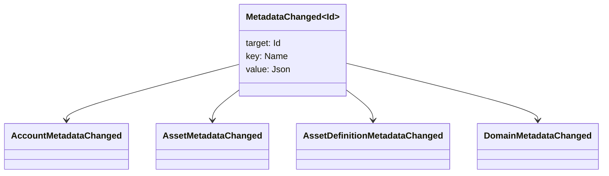

# メタデータ {#metadata}

メタデータは、ブロックチェーン台帳オブジェクトに添付されたチェック済みのキーと値のマップです。キーは`Name`の値で、値は JSON（`Json`）のペイロードです。

次のオブジェクトはメタデータを保持できます:

- ドメイン
- アカウント
- 資産
- 資産の定義
- NFTs
- RWAs
- トリガー
- 取引

ブロックチェーンの台帳状態に属する小さな説明的または索引用フィールドにはメタデータを使用してください。大きなペイロードは WSV の外部に保存し、暗号学的ダイジェスト値、URI、または SoraFS パスで参照する必要があります。

メタデータ、アセット、NFTs、RWAs、またはオフチェーンストレージの選択に関するガイドについては、[メタデータとブロックチェーン台帳の保存の選択肢](/ja/guide/configure/metadata-and-store-assets.md)を参照してください。

## Taira でこのワークフローを実行してください {#try-it-on-taira}

メタデータは通常のリソース読み取りを通じて表示されます。このコマンドは、現在メタデータを持っている Taira 資産定義を一覧表示します:

```bash
curl -fsS 'https://taira.sora.org/v1/assets/definitions?limit=100' \
  | jq '.items[]
    | select((.metadata | length) > 0)
    | {id, name, metadata}'
```

ドメインとアカウントにも同じパターンを使用してください:

```bash
curl -fsS 'https://taira.sora.org/v1/domains?limit=20' \
  | jq '.items[] | select((.metadata // {} | length) > 0)'

curl -fsS 'https://taira.sora.org/v1/accounts?limit=20' \
  | jq '.items[] | select((.metadata // {} | length) > 0)'
```

空の出力を有効な結果として扱います。これは、Taira オブジェクトの現在のページにメタデータが含まれていないことを意味し、API エンドポイントが失敗したことを意味するわけではありません。

## メタデータを更新中 {#updating-metadata}

メタデータは Iroha 命令操作で変更されます：

- [`SetKeyValue`](/ja/blockchain/instructions.md#setkeyvalue-removekeyvalue) キーを挿入または置き換えます
- [`RemoveKeyValue`](/ja/blockchain/instructions.md#setkeyvalue-removekeyvalue) キーを取り除く

取引を提出する認可主体は、アクティブなソフトウェアランタイムバリデータによって要求される権限を持っている必要があります。デフォルトの権限範囲については、[許可トークン](/ja/reference/permissions.md) を参照してください。

## イベント {#events}

メタデータが変更されると、データイベントが発生します。一般的なイベントペイロードは `MetadataChanged<Id>` です:



統合に重要なエンティティタイプまたはオブジェクトIDのメタデータイベントのみに登録するには、[データイベントフィルター](/ja/blockchain/filters.md#data-event-filters) を使用してください。

## クエリ {#queries}

メタデータは、クエリされたオブジェクトの一部として返されます。例えば、使用します [`FindAccountById`](/ja/reference/queries.md#accounts-and-permissions), [`FindDomainById`](/ja/reference/queries.md#domains-and-peers), または [`FindAssetDefinitionById`](/ja/reference/queries.md#assets-nfts-and-rwas). 使う [`FindNfts`](/ja/reference/queries.md#assets-nfts-and-rwas) または [`FindNftsByAccountId`](/ja/reference/queries.md#assets-nfts-and-rwas) のために NFTs, そして [`FindRwas`](/ja/reference/queries.md#assets-nfts-and-rwas) 〜のために RWA たくさん。それからオブジェクトのメタデータフィールドを読みます。 NFT クエリの応答は〜をさらけ出す NFT `content` レコードのメタデータとしてマップする。

メタデータキーはブロックチェーン台帳の状態の一部であるため、安定させ、JSON の値がそのバージョンを明示的に持てる場合には、アプリケーション固有のバージョン変更をキー名にエンコードすることを避けてください。
