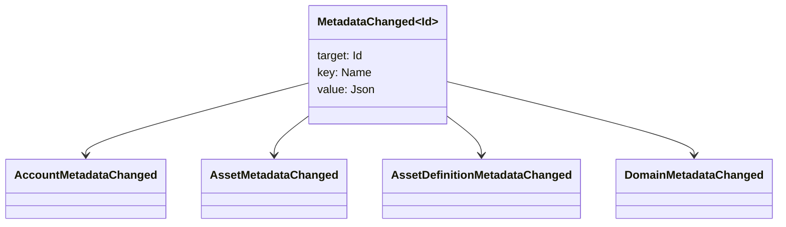

# メタデータ {#metadata}

メタデータは,レジャーオブジェクトに添付したチェックされたキー値マップである.鍵は `Name` 値であり,値は JSON (`Json`) の役に立たない負荷です.

次のオブジェクトはメタデータを持ち込むことができる.

- 域名
- 口座
- 資産
- 資産の定義
- NFTs
- RWAs
- トリガー
- 取引

レジャー状態に属する小さな記述またはインデックスフィールドのメタデータを使用します.大きな役に立たない負荷は WSV の外に保存され,ダイジェスト, URI または SoraFS 経路で参照されるべきである.

メタデータ,資産 NFTs, RWAs,またはチェーン外のストレージの選択に関するガイドラインについては, [メタデータおよびレジャーストレージの選択肢](/ja/guide/configure/metadata-and-store-assets.md)を参照してください.

## Taira で試してみてください {#try-it-on-taira}

メタデータは通常のリソース読み込みで可視です.このコマンドは,現在メタデータを保有している資産定義 Taira をリストします:

```bash
curl -fsS 'https://taira.sora.org/v1/assets/definitions?limit=100' \
  | jq '.items[]
    | select((.metadata | length) > 0)
    | {id, name, metadata}'
```

ドメインとアカウントには同じパターンを使用します.

```bash
curl -fsS 'https://taira.sora.org/v1/domains?limit=20' \
  | jq '.items[] | select((.metadata // {} | length) > 0)'

curl -fsS 'https://taira.sora.org/v1/accounts?limit=20' \
  | jq '.items[] | select((.metadata // {} | length) > 0)'
```

Taira オブジェクトの現在のページにはメタデータがないことを意味し,エンドポイントが失敗したわけではない.

## メタデータを更新する {#updating-metadata}

メタデータは Iroha の特殊指示で変更される.

- [`SetKeyValue`](/ja/blockchain/instructions.md#setkeyvalue-removekeyvalue)が鍵を挿入または交換する
- [`RemoveKeyValue`](/ja/blockchain/instructions.md#setkeyvalue-removekeyvalue) は鍵を削除します

トランザクションを提出する当局は,アクティブ・ランタイム・バリダーターが要求している許可を持っている必要があります.デフォルトの許可面については [Permission Tokens](/ja/reference/permissions.md)を参照してください.

## 出来事 {#events}

データ イベントは,メタデータ変更時に送信されます.通用イベントの役に立たない負荷は `MetadataChanged<Id>`:



[データイベントフィルター](/ja/blockchain/filters.md#data-event-filters) を使用して,統合に重要なエンティティタイプまたはオブジェクト ID のメタデータイベントのみを登録します.

## 質問 {#queries}

メタデータはクエリされたオブジェクトの一部として返されます.例えば, [`FindAccountById`](/ja/reference/queries.md#accounts-and-permissions), [`FindDomainById`](/ja/reference/queries.md#domains-and-peers),または [`FindAssetDefinitionById`](/ja/reference/queries.md#assets-nfts-and-rwas)を使用します.[`FindNfts`](/ja/reference/queries.md#assets-nfts-and-rwas) または [`FindNftsByAccountId`](/ja/reference/queries.md#assets-nfts-and-rwas) を使用して NFTs,および [`FindRwas`](/ja/reference/queries.md#assets-nfts-and-rwas) を RWA パートで使用します. その後,オブジェクトのメタデータフィールドを読み取ります. NFT 查询応答では, NFT `content` マップが記録メタデータとして表示されます.

メタデータキーは,レジャー状態の一部であるため,そのバージョンを明示的に JSON 値に載せることができる場合,アプリケーション専用のバージョンのコードをキー名に入れないようにして保持します.
