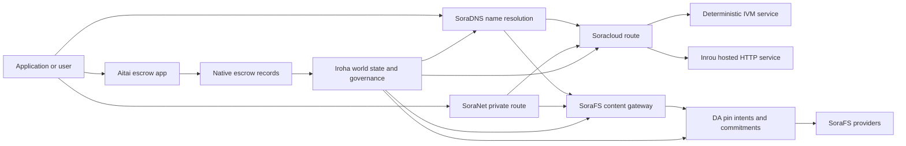

# SORA Nexus サービス {#sora-nexus-services}

SORA Nexus は, Iroha 3 に関するアプリ面のサービス飛行機を追加します.これらのサービスは別々のレジャーではありません.それらは Iroha 世界国家, Norito マニフェスト,ガバナンス記録,および Torii ルートファミリーによって固定されています.

利用可能性は,ノードビルドとネットワークプロフィールに依存する.対象ノードで有効な経路の権威的なリストとして [`/openapi`](/ja/reference/torii-endpoints.md#app-and-sora-route-families) を使用します.

## 構成要素の地図 {#component-map}

|構成要素|役割|主な表面|
| ---------------------- | ------------------------------------------------------------------------------------------------------------------------------------------- | ---------------------------------------------------------------------------------------- |
|Soracloud|アプリケーション部署,ホストされたサービス,プライベートモデル/ランタイム状態,およびサービスのライフサイクル制御. |`/v1/soracloud/`, `/api/`, `iroha app soracloud ...` |
|入り口|Soracloud は,ライブ HTTP 飛行機を必要とするサービス修正のための実行時間をホストした HTTP. |Soracloud ランタイム設定,ホスト能力広告,レプリカのランタイム状態|
|SoraNet|サーキット,リレートラフィック, VPN,コネクトセッション,ストリーミングルートのためのプライバシーと輸送の重なり. |`/v1/connect/`,`/v1/vpn/`, SoraNet ルートメタデータ |
|データの利用可能性 (DA)|Nexus レーン, SoraFS マニフェスト,および証明フローで参照されている役に立たない負荷のための利用可能性証拠,コミットメント,ピン意図層. |`/v1/da/`, `FindDaPinIntent`, `[sumeragi.da]` |
|SoraFS|マニフェスト, CAR 役に立たない負荷,固定されたコンテンツ,ゲートウェイの取出し,復元性の証明の流れのための内容アドレスストレージ布. |`/v1/sorafs/`, `/sorafs/`, `FindSorafsProviderOwner` |
|SoraDNS|SORA ホストされたサービスおよびコンテンツの決定的な命名と解析者認証層. |`/v1/soradns/`, `/soradns/`, resolver ディレクトリ イベント|
|アイタイ|アップレベルのフィアットおよび資産決済走廊は,別々のレジスタンスではなくネイティブエスクロー記録によって裏付けられています. |`OpenAssetEscrow`,`FindAssetEscrow*`, `EscrowEventFilter`, Kotodama `escrow_*`の建物 |



## 一般的な流れ {#common-flows}

### ホストされた Split アプリケーション {#hosted-split-application}

一般的な混合式アプリでは,すべての部品を一緒に使用します.

1. 静的なフロントエンド資産は, SoraFS でパッケージ化され,固定されます.
2. 公共のホストは `<app>.sora`, 登録されている SoraDNS.
3. Soracloud ルート `/api/v1/search`または `/api/v1/stream`からインルー HTTP サービスへ.
4. Soracloud 経路は `/api/auth`と `/api/v1/user`で,決定的な IVM 処理者に.
5. プライバシーを必要とするクライアントは,同じコンテンツまたは API 経路を SoraNet 回路を通じてアクセスできます.

|経路|支援機|なぜ?|
| ----------------- | --------------------- | ------------------------------------------------- |
| `/`               |SoraFS 静態含量 |複製可能なコンテンツのルーツとゲートウェイキャッシュ|
|`/assets/*`|SoraFS 静態含量 |内容を対象とした資産と明示証明書|
|`/api/auth*`|Soracloud IVM|リプレイ・セーフ・オートとウォレットチャレンジ状態 |
|`/api/v1/user*`|Soracloud IVM|統治に敏感な状態変異|
|`/api/v1/search*`|Soracloud インルー |ライブ HTTP サービス,キャッシュ, SSE,またはコレクター状態|

### コンテンツ出版 {#content-publication}

SoraFS 出版物は,名称が指す前に耐久性のある文物を生成する.

1. パイロードやディレクトリを作ります
2. CAR のアーカイブに詰め込み パーツプランを
3. ピンポリシーとガバナンスデータを備えた Norito マニフィストを作成する.
4. Torii に明示書を提出する.
5. ターゲットプロフィールに明示的な証拠を必要とする場合, DA ピンの意図または利用可能性のコミットメントを記録する.
6. マニフェストを SoraDNS 名前または Soracloud 静止前端ルートに結合する.

### プライベート・フリッチまたはストリーミングルート {#private-fetch-or-streaming-route}

SoraNet は, SoraFS または Soracloud の前に座ることができる.

1. クライアントは名前やマニフェストを解決します.
2. 警備ディレクトリまたはルートマニストは,入口と出口リレーを選択します.
3. SoraNet サーキットを通って交通が詰め込まれます.
4. 出口リレーは SoraFS ゲートウェイ, Torii ストリーム,または Soracloud ルートに到達します.

## アイタイ {#aitai}

Aitai は SORA 市場型決済のためのアプリ廊下で,買い手と売り手はチェーン外での支払いを協調する一方, Iroha が取引を制御する.チェーン上の資産保管.新しい数値資産保管流のために契約所有のエスクローアカウントではなく,ネイティブエスクロー指示ファミリーを使用すべきである.

Native escrow は本簿に保管する.売り手は `OpenAssetEscrow` でオファーを開設し,購入者は `AcceptAssetEscrow` と `MarkEscrowPaymentSent` でオフチェーン支払いを受け入れ,マークします.`ReleaseAssetEscrow`で開示し,支払いがマークされる前にキャンセルする.購入者と販売者が意見が異なった場合,当事者は紛争を開くことができ, `CanResolveEscrowDispute` で解決者はロックされた金額を分割できます.

全ライフサイクル,ジェネリック・アセットロック,匿名・エスクロー,クエリ,イベント,および Rust の例については, [ネイティブ・アセット エスクロー](/ja/blockchain/escrow.md)を参照してください.

|Aitai表面|使うよ|
| ------------------------------------------------------------------------------------------------------------------------------------------------------------- | ----------------------------------------------------------------------------------------- |
| `OpenAssetEscrow`, `AcceptAssetEscrow`, `MarkEscrowPaymentSent`, `ReleaseAssetEscrow`, `CancelAssetEscrow`                                                    |XOR に表記された決済流を含む透明な数値資産の提供. |
| `OpenAnonymousAssetEscrow`, `AcceptAnonymousAssetEscrow`, `MarkAnonymousEscrowPaymentSent`, `ReleaseAnonymousAssetEscrow`, `CancelAnonymousAssetEscrow`       |保護されたオファーは,資金調達と閉鎖の動きに証拠添付を使用します. |
|`OpenEscrowDispute`, `ResolveEscrowDispute`,`OpenAnonymousEscrowDispute`, `ResolveAnonymousEscrowDispute` |紛争の解決と法廷による解決|
|`FindAssetEscrowById`, `FindAssetEscrowsBySeller`,`FindAssetEscrowsByBuyer`, `FindAssetEscrowsByStatus` |アプリのステータスページ,和解作業,サポートツール. |
|`EscrowEventFilter`|エスクローID,セールス,買い手,ステータス,イベントの種類によって透明なエスクローサブスクリプションをライブします. |
| Kotodama `escrow_open_offer`, `escrow_accept`, `escrow_mark_payment_sent`, `escrow_release`, `escrow_cancel`, `escrow_open_dispute`, `escrow_resolve_dispute` |Kotodama 契約電話は, V1 エスクローシステムによってサポートされています. |

Taira または Minamoto の公共利用のために,オフチェーン決済レイルおよびサポートまたは裁判所ワークフローをアプリケーションポリシーとして扱います. Iroha は保管状態,ライフサイクルイベント,証拠ハッシュ,最終資産移動を記録します;それだけではフィアット決済を確認しません.

## ターゲットノードをチェック {#check-a-target-node}

このページからの例を使用する前に,ターゲットとするノードにルートファミリーが存在していることを確認してください.

```bash
export TORII_URL=https://taira.sora.org

curl -fsS "$TORII_URL/openapi.json" \
  | jq '.paths | keys[] | select(test("^/v1/(soracloud|sorafs|soradns|connect|vpn|da)/"))'

curl -fsS "$TORII_URL/status" | jq .
```

`/openapi.json`がプロフィールで暴露されていない場合は, `/openapi` を試してみてください.正確なルート利用可能性はビルド機能とネットワーク構成に依存します.

### Taira 読み込みのみの喫煙チェック {#taira-read-only-smoke-checks}

公開 Taira エンドポイントは読み方チェックに有用ですが,認証されたアカウントを運営し,ライブ状態を変更するつもりがない限り,変異例に使用しないでください.

```bash
export TORII_URL=https://taira.sora.org

curl -fsS "$TORII_URL/status" \
  | jq '{version: .build.version, peers, blocks, lanes: (.teu_lane_commit | length)}'

curl -fsS "$TORII_URL/v1/connect/status" | jq '{enabled, sessions_active}'

curl -fsS "$TORII_URL/v1/vpn/profile" \
  | jq '{available, relay_endpoint, supported_exit_classes}'

curl -fsS "$TORII_URL/v1/sorafs/storage/state" \
  | jq '{bytes_capacity, bytes_used, pin_queue_depth, por_inflight}'

curl -fsS -H 'Accept: application/json' "$TORII_URL/v1/soracloud/status" \
  | jq '.control_plane | {service_count, services: [.services[] | {service_name, current_version}]}'
```

Taira は,展開特有の制御平面路線を OpenAPI 経路地図に記載されていないことを暴露することができる. `/openapi` を主要な生成された API 契約として扱って,それをライブとして文書化する前に,直接任意の展開特別のルートを確認してください.

## Soracloud {#soracloud}

Soracloud は SORA アプリケーション制御平面です. 展開バンドル,サービス修正,ルーティング,ロールアウト状態,権限のある設定エントリ,暗号化されたサービスの秘密,モデルレジストリ記録,プライベート推論セッション,実行時の領収を追跡します.

Soracloud は2つの実行機を使用する.

|執行機|実行時間|使うよ|
| ---------------------- | ------- | -------------------------------------------------------------------------------------------- |
|`DeterministicService`|`Ivm`|作成者,保管庫状態,認証された読み取り,注文された郵便箱の管理者,統治に敏感な変異|
|`HttpService`|`Inrou`|ライブ HTTP APIs,コレクター重労働,キャッシュバックのサービス, SSE,ブラウザ支援フロー |

制御平面は権威ある.部署,アップグレード,ロールバック,コンフィギュレーション,秘密,モデル,およびステータスコマンドは Torii を介して送信され,コミットされた世界状態を読み取ります;彼らは別々の CLI-ローカル鏡に依存しません.パブリックルーティングは,最も長いプレフィックスに基づいているため,登録されたホストがホストされている HTTP ルートと決定的な API ルートの間でトラフィックを分けることができる.

### スプリットアプリを配置する {#scaffold-a-split-app}

スプリット・アプリのテンプレートは,静的なフロントエンドとホストされたライブ API とデターミニスティック・ヴォルト/API サービスを作成します.

```bash
iroha app soracloud app init \
  --template split-app \
  --app-name solswap_indexer \
  --app-version 0.1.0 \
  --public-host solswap-indexer.sora \
  --output-dir ./apps/solswap-indexer

iroha app soracloud app local-plan \
  --manifest ./apps/solswap-indexer/app_manifest.json

iroha app soracloud app doctor \
  --manifest ./apps/solswap-indexer/app_manifest.json
```

`local-plan`はルート分割,児童サービスマニフェスト,ワークスペーススクリプト経路,および予想されるフロントエンド出版モードを印刷します. `doctor`は,あなたが Torii に関与する前にローカルリリース契約を有効化します.

### 部署・検査アプリの状態 {#deploy-and-inspect-app-state}

```bash
export SORACLOUD_TORII_URL=https://<soracloud-enabled-torii>

iroha app soracloud app deploy \
  --manifest ./apps/solswap-indexer/app_manifest.json \
  --torii-url "$SORACLOUD_TORII_URL"

iroha app soracloud app status \
  --manifest ./apps/solswap-indexer/app_manifest.json \
  --torii-url "$SORACLOUD_TORII_URL"
```

すでに展開されたサービスでは,サービススケープのコマンドを使用します:

```bash
iroha app soracloud status \
  --service-name solswap_indexer_live \
  --torii-url "$SORACLOUD_TORII_URL"

iroha app soracloud rollback \
  --service-name solswap_indexer_live \
  --target-version 0.1.0 \
  --torii-url "$SORACLOUD_TORII_URL"
```

### 機密 な 資料 {#config-and-secret-material}

Soracloud コンフィギュレーションおよび秘密入力は,権限のある展開状態の一部です.必要なコンフィギュランスまたは秘密結合が欠けている場合やアクティブマニフェストと不一致する場合は,デプロイ,アップグレード,ロールバックが終了します.

```bash
iroha app soracloud config-set \
  --service-name solswap_indexer_live \
  --config-name indexer/public_config \
  --value-file ./config/public-config.json \
  --torii-url "$SORACLOUD_TORII_URL"

iroha app soracloud secret-set \
  --service-name solswap_indexer_live \
  --secret-name indexer/api_key \
  --secret-file ./secrets/api-key.envelope.json \
  --torii-url "$SORACLOUD_TORII_URL"
```

CLI のサポートを使用して,あなたのプロフィールで要求される正確な認証標識を表示します.

```bash
iroha app soracloud config-set --help
iroha app soracloud secret-set --help
```

## インルー {#inrou}

Inrou は Soracloud が使用するホストされた HTTP 実行時間である. 埋め込まれた Soracloud 実行時間のプロジェクトが Soracloud 状態に認められた Iroha ノードです ロックバックサービスとして割り当てられたホストサービスのレプリカを起動し,リプリカランタイム状態を権威あるモデルに戻します.

APIs,SSE ストリーム,キャッシュバックド・ハンドラー,またはブラウザ支援サービスなどのライブ HTTP 表面を必要とするワークロードで Inrou を使用します.

### 実行時間の要件 {#runtime-requirements}

- コンテナマニストの実行時間は `Inrou` でなければならない.
- サービスマニストの実行平面は `HttpService` でなければならない.
- `HttpService + Inrou`は,正確に `PersistentRootLeaseVolume` を `/` に組み込む必要がある.
- 複製された Inrou サービスは,変化可能な共有状態を維持している場合,共有サービスまたは機密レンタルストレージも必要である.
- プロダクションホスティングノードは,プロキシとしてのみ動作する代わりに,実際の Inrou 容量を宣伝すべきです.

### 明らか な 断片 {#manifest-fragment}

下記例では2つのマニフェストの形状を示しています. これは完全な展開バンドではなく断片です.

```jsonc
// container_manifest.json
{
  "schema_version": 1,
  "runtime": { "runtime": "Inrou", "value": null },
  "bundle_path": "/bundles/solswap-indexer.inrou",
  "entrypoint": "/app/bin/launch-indexer.sh",
  "args": [],
  "env": {
    "RUST_LOG": "info",
  },
  "inrou": {
    "schema_version": 1,
    "guest_os": { "guest_os": "DebianSlim", "value": null },
    "guest_images": {
      "x86_64": {
        "kernel_image_path": "/inrou/x86_64/vmlinux",
        "rootfs_image_path": "/inrou/x86_64/rootfs.ext4",
        "initrd_image_path": null,
      },
      "aarch64": {
        "kernel_image_path": "/inrou/aarch64/vmlinux",
        "rootfs_image_path": "/inrou/aarch64/rootfs.ext4",
        "initrd_image_path": null,
      },
    },
  },
  "lifecycle": {
    "start_grace_secs": 60,
    "stop_grace_secs": 30,
    "healthcheck_path": "/api/indexer/v1/health",
  },
}
```

```jsonc
// service_manifest.json
{
  "schema_version": 1,
  "service_name": "solswap_indexer_live",
  "service_version": "0.1.0",
  "execution_plane": { "execution_plane": "HttpService", "value": null },
  "replicas": 2,
  "route": {
    "host": "solswap-indexer.sora",
    "path_prefix": "/api/v1/search",
    "service_port": 8080,
    "visibility": { "visibility": "Public", "value": null },
    "tls_mode": { "tls": "Required", "value": null },
  },
  "lease_volumes": [
    {
      "volume_name": "root_disk",
      "kind": {
        "lease_volume": "PersistentRootLeaseVolume",
        "value": null,
      },
      "storage_class": { "storage_class": "Warm", "value": null },
      "mount_path": "/",
      "max_total_bytes": 8589934592,
    },
    {
      "volume_name": "index_state",
      "kind": { "lease_volume": "ServiceLeaseVolume", "value": null },
      "storage_class": { "storage_class": "Warm", "value": null },
      "mount_path": "/var/lib/solswap-indexer",
      "max_total_bytes": 1073741824,
    },
  ],
}
```

実行時に,マウントされたリースボリュームは,ボリュムの名前から導き出された環境変数によって暴露されます.

```text
SORACLOUD_LEASE_VOLUME_ROOT_DISK_DIR
SORACLOUD_LEASE_VOLUME_ROOT_DISK_MOUNT_PATH
SORACLOUD_LEASE_VOLUME_INDEX_STATE_DIR
SORACLOUD_LEASE_VOLUME_INDEX_STATE_MOUNT_PATH
```

## SoraNet {#soranet}

SoraNet はプライバシーと輸送の重なりである.これは,ターゲットゲートウェイまたはサービスに直接接続すべきでないトラフィックのためのリレーベースのルートを提供する.トランスポートデザインは,エントリー・ミドル・エグゼットリレーの役割, QUIC 輸送,ノイズベースのハイブリッドハンドシェイク,能力交渉,リレーディレクトリのメタデータ,固定尺寸のパッシングセルを使用しています.

Nexus 部署では,SoraNet はコンテンツの取出し,ゲートウェイトラフィック, VPN またはConnectセッション,および Norito ストリーミングルートを運ぶことができます.ディレクトリエントリは `norito-stream`をサポートするリレーをマークすることができます.これはクライアントが Torii RPC またはストリーミングトラフィックに適した経路を選びます.

### ストリーミング設定 {#streaming-configuration}

Nexus プロフィールにより,ストリーミングルートに SoraNet の供給が可能になります.

```toml
[streaming]
feature_bits = 0b11

[streaming.soranet]
enabled = true
exit_multiaddr = "/dns/torii/udp/9443/quic"
padding_budget_ms = 25
access_kind = "authenticated"
provision_spool_dir = "./storage/streaming/soranet_routes"
provision_spool_max_bytes = 0
provision_window_segments = 4
provision_queue_capacity = 256
```

視聴者認証を必要としないコンテンツルートでは `access_kind = "read-only"` を使用する. 出口リレーが Torii またはホストサービスへの橋渡し前にチケットまたは視聴者のアイデンティティを強制しなければならない場合, `authenticated` を使用します.

### SoraNet - 意識する SoraFS 引き寄せ {#soranet-aware-sorafs-fetch}

SoraFS リッチ CLI は,ブラウザ拡張子または SDK アダプタのためのローカルプロキシマニストおよびスループ SoraNet 経路メタデータを発行できます.

```bash
sorafs_cli fetch \
  --plan artifacts/payload_plan.json \
  --manifest-id 7bb2...9d31 \
  --provider name=alpha,provider-id=9f5c...73aa,base-url=https://gw-alpha.example.org/,stream-token="$(cat alpha.token)" \
  --output artifacts/payload.bin \
  --json-out artifacts/fetch_summary.json \
  --local-proxy-manifest-out artifacts/proxy_manifest.json \
  --local-proxy-mode bridge \
  --local-proxy-norito-spool storage/streaming/soranet_routes \
  --local-proxy-kaigi-spool storage/streaming/soranet_routes \
  --local-proxy-kaigi-policy authenticated \
  --max-peers=2 \
  --retry-budget=4
```

概要記録プロバイダの報告,断片領収書,地元の代理メタデータ,そして取得のために使用された有効なルート設定.

## データ利用可能性 (DA) {#data-availability-da}

DA は,世界状態に直接配置するには大きすぎたり,プライバシーに敏感すぎたり,サービスに特化した過ぎる役に立たない負荷の可用性証拠層です.決定的なコミットメントと回収義務を記録するため,検証者,ゲートウェイ,クライアントがどのバイトが約束されたか,どのようなポリシーが適用され,どの証拠が観察されているかを合意することができます.

DA は, Kura または SoraFS を置き換えることはありません.

- Kura は最終的なブロックストリームとコンセンサスの復元データを保存します.
- SoraFS は,コンテンツアドレスバイト, CAR の役に立たない負荷,およびマニフェストを保存し,提供します.
- DA は,これらのバイトをスケジュール,監査し,レジャー状態にリンクすることを可能にするコミットメント,証明方針,証明開示およびピン意図を記録します.

DA を使用する,アプリケーションまたは Nexus レーンが本簿に可視で,チェーン外でのデータが取得可能であることを約束する必要がある場合.一般的な例としては,決済流のレーン用負荷コミットメント,公開されたコンテンツのための SoraFS ピン意図などがあります.後に確認するために保存しなければならない証明パネル,および公開状態が完全な使用負荷ではなく消化であるべきアプリケーションアーテファクト.

### ライフサイクル {#lifecycle}

|ステージ|記録されていること|
| ---------- | ----------------------------------------------------------------------------------------------------------------------------------------------------- |
|意図|チケット,マニフェスト参照,仮名,レーン/エポーク/シーケンス参照,保存ポリシー,または複製目標. |
|コミットメント|マニフェスト,レーン用荷,証明バンドル,またはコンテンツルーツを レジで可視の記録に結合する素材を消化します. |
|証拠|対象ネットワークが承認した可用性投票,証拠開示,プロバイダー証明書,または他のプロフィール特定の証拠. |
|疑問です|`FindDaPinIntentByTicket`,`FindDaPinIntentByManifest`, `FindDaPinIntentByAlias`,または `FindDaPinIntentByLaneEpochSequence`を通じてピン意図の検索. |

DA のサポートを受けた典型的な出版流は:

1. 製造または受領する用荷 WSV, 例えば, SoraFS CAR ファイルまたは Nexus レーン用荷物
2. Norito マネスティックまたはルート専用のコミットメント記録で有用な負荷をハッシュして記述する.
3. そのルートファミリーが有効になったとき,またはネットワークの署名されたトランザクションパスを通じて `/v1/da/*` を介してマニフェスト,ピン意図,またはコミットメントを提出する.
4. 検証者または可用性提供者は,アクティブ証明ポリシーで要求される証拠を収集させてください.
5. 代名詞,決済証明書,またはゲートウェイ経路をプロモーションする前に 結果のピン意図またはコミットメントを尋ねる.

### アルゴリズムモデル {#algorithmic-model}

DA は,有用な負荷を署名され,再生によって保護され,ブロックインデックスされたコミットメントに変換します.重要なアルゴリズムは決定的なため,検証者とゲートウェイは同じバイトから同じダイジェストを再計算することができます.

1. 送信された用荷をキャノニカル化する Torii 摂取の要請を承認する `(lane_id, epoch, sequence)`, パイロードバイト,圧縮メタデータ,パーツサイズ,削除プロフィール,保持ポリシー,送信者の署名.ノードは要求されたときに gzip, deflate,または Zstandard の有用な負荷を解圧し,その後,カノニカルバイトの長さが等しいことを確認します `total_size`.
2. Nexus レーンのカタログに存在しなければならない. `chunk_size` は,少なくとも2バイトの非ゼロパワーでなければならない.設定された最大限度を超えない.削除プロフィールには,データ・ショートと少なくとも2つのパリティ・ショットが含まれなければならない.レーンのカタログでは,証明式 `merkle_sha256` または `kzg_bls12_381` を選択する.
3. ネットワークポリシーを適用する.ノードは,blobクラスのための構成された複製および保持ベースラインを強制します.公共のメタデータは素文に留まなければなりません.ガバナンスのみのメタデータがマニフェストに書き込まれる前にノードの設定したガバナンスのメタデータキーで暗号化されます.
4. `chunk_size`から得られる固定サイズプロフィールでカノニカル用荷が割れられ, Torii は用荷消化,復元性証明の樹根,およびパーチャックによるコミットメントを計算する.データブロックはバイトにわたって BLAKE3 のコミットメントを持ちます.
5. 切除約束を追加する. 切片は `data_shards`. 最後のストライプの欠落した細胞は平価計算のために0で詰められています. RS(16) parity は row/global parity shards を作成する. `row_parity_stripes` 列式のストライプ・パリティをマトリックス全体に追加する. パリティスクラッシュコミットメントは BLAKE3 小の消化物 `u16` シンボルです
6. `DaManifestV1`はレーン,時代,ブロッククラス,コデック,ペイロードダイジェスト,チャックルーツ,チャックサイズ,削除プロフィール,保持方針,賃貸配当,チャックコミットメント,オプションの IPA コミットメント,メタデータ,発行時間を記録します.ストレージチケットは決定性です:ノードは最初に空きチケットでマニフェスト・テンプレートをハッシュし,その後その指紋を最終的な `storage_ticket` として書き戻します.
7. `(lane_id, epoch, sequence, manifest_fingerprint)`です.同じ指紋を持つ重複は無効です.古いシーケンスまたは異なる指紋を持つ同じシーケンスが拒否されます.
8. Torii は PDP のコミットメントを計算し, `DaIngestReceipt` を署名し, `DaCommitmentRecord` を作成し,マニフェストのためのスループ・アーティファクトを作成します.PDP コミットメント,コミットメント記録,コミットメントスケジュール,ピン意図,領収書ファイル,領収書のログ.領収書カーサーは`(lane_id, epoch)`ごとに単調に進みます.

コミットメントの記録はブロックが持てるものです

- レーン,時代,順序
- ID とカノニカル マネスティックハッシュ
- レーン防備制度
- 断片根
- KZG レーンでのオプションの KZG コミットメント
- PDP/証明の消化
- 収納クラスと保管券
- Torii DA 承認署名

ブロックが DA の記録を埋め込む前に,ブロックの組み立て経路はバンドルを検証する.

- `(lane_id, epoch, sequence)`はバネルの内側にユニークでなければならない.
- マネフィスト・ハッシュは,バンドルの内側でゼロではなくユニークでなければならない.
- コミットメント証明制度は,設定されたレーンポリシーに一致しなければならない.
- メークルレーン 拒否 KZG コミットメント KZG レーンはゼロでない値が必要 KZG コミットメント
- ピン意図はレーン,マニフェストハッシュ,ストレージチケット,所有者アカウント,およびエイリアス衝突規則によって カノニック化され,分類され,フィルタリングされます

ブロックヘッダは DA 証明ポリシー,コミットメント,ピン意図のためのハッシュを保存します.会員資格証明のために,コミットメントバンドルはまたメークルルーツを暴露します.Norito でコードされた `DaCommitmentRecord` 値のハッシュである.親ノードは左と右の子どもの連鎖をハッシュする;奇数葉が変更なく次の層に昇進する.

### 証拠検証 {#proof-verification}

`/v1/da/commitments/prove` はブロック内の1つのコミットメントの証明を作成できます.証明にはコミットメント,ブロック高度,バンドルのインデックス,バンドルハッシュ,バンドルが長さ,メルケルルーツ,そして兄弟姉妹経路が含まれます.検証チェック:

1. 証明バンドルのハッシュは,ブロックヘッダの DA コミットメントハッシュに一致する.
2. 証明ブロックの高さは参照されたブロックヘッダーに一致する.
3. 索引は制限で,コミットメントはその指数におけるバンドエントリに等しい.
4. レーン防護政策は 約束を受け入れます
5. コミットメントの葉から兄弟道を折り畳むことは 提供された根を再構築します
6. 復元された根は束の根に等しい.

これは,特定のブロックの有用な負荷に特定の利用性コミットメントが含まれていたことを証明する;それは現在すべての複製がオンラインであることを証明するものではありません.SoraFS プロバイダの採取, PDP/PoTR チェック,またはプロフィール特有の可用性証拠によってライブ取得が別途確認されます.

### 合意による相互作用 {#consensus-interaction}

DA は信頼性の高い放送 (RBC) によって Sumeragi に接続されているが,それは第二の最終的なプロトコルではない. RBC は提案用荷物を拡散し回収する:提案者は `(height, view, payload_hash)`,同級交換ブロックのセッションを発表し,同等の有効な負荷を十分な検証者が観察したかどうかを追跡する `READY`/`DELIVER`信号です.

Iroha 3 では,ペアが次のいずれかの場合,待機中のブロック用荷を利用可能とする.

- ローカル・ペンディングブロックは,予想される使用負荷のハッシュにハッシュするバイトまたは
- RBC はブロックハッシュ,高度,ビュー,および有用荷ハッシュに一致する 役に立たない負荷を回収しました

条件の2つも成立しない場合, 同級記録 `missing_local_data`, 荷物を取り戻そうとする RBC または シンクロをブロックし, DA ステータスとテレメトリーのゲートです. DA 信号は最終性に関する助言です ブロックはまだ最終的な契約証明書と一致する本地用荷物,別途からではなく DA クォーラム証明書

DA タイムリングは復元ウィンドウを拡大します.有効な DA クォーラムタイムアウトは,構成されたブロックとコミットタイムリングから導き出され,その後 `sumeragi.advanced.da.quorum_timeout_multiplier` に倍増されます.利用可能タイムアウトは `max(quorum_timeout, availability_timeout_floor_ms) * availability_timeout_multiplier`.その可用性タイムアウトが終了する前に,ノードは役に立たない負荷の復元を好むし,早期に再スケジュールすることを避けます.この期限が終わった後,通常の復旧とビュー変更経路が進むことができます.

### オペレーターノート {#operator-notes}

Iroha 3 のコンセンサスプロフィールには, RBC がサポートする有用な負荷の拡散,マニフェスト・ガード,DA バンドル検証,および復元テレメトリが含まれています.同級型は `[sumeragi.da]`の限界を明らかにします ブロックごとにコミットメントと証明開設,および `[sumeragi.advanced.da]` クォーラムと可用性行動のためのタイムアウト倍数.これらの設定をネットワークプロフィール内の検証者間で一貫して保持します.

経路発見については,ノードの OpenAPI ドキュメントから開始します:

```bash
curl -fsS "$TORII_URL/openapi.json" \
  | jq '.paths | keys[] | select(startswith("/v1/da/"))'
```

現在の DA 問い合わせの名前には[クエリ参照](/ja/reference/queries.md#nexus-data-availability-and-packages) を使用し,ビルドで暴露されたローカル `[sumeragi.da]` ボタンのために [ ピア構成テンプレート](/ja/reference/peer-config/) を使用します.

## SoraFS {#sorafs}

SoraFS は,分散型コンテンツアドレッシングのストレージタスクです. それはバイトを決定的なブロックにパッケージし, CAR アーカイブ,および Norito マネスティックでコンテンツルーツを結びつける.ストレージプロバイダは容量とコンテンツの可用性を宣伝し,ゲートウェイはコンテンツを配信する前にマニフェストとチャックコミットメントを確認します.

典型的な SoraFS ステティックアプリケーション資産,ドキュメンテーションビルド,ゾーンを含む.モデルやアーテファクトの参照,およびガバナンス証拠の束. Iroha データモデルの暴露 SoraFS ゲートウェイイベントと [`FindSorafsProviderOwner`](/ja/reference/queries.md#nexus-data-availability-and-packages) 提供者の所有権解決に関する問い合わせ

### 梱包 し,宣言 し,署名 し,提出 する {#pack-manifest-sign-and-submit}

```bash
cargo run -p sorafs_car --features cli --bin sorafs_cli -- \
  car pack \
  --input ./dist \
  --car-out artifacts/site.car \
  --plan-out artifacts/site.chunk-plan.json \
  --summary-out artifacts/site.car-summary.json

cargo run -p sorafs_car --features cli --bin sorafs_cli -- \
  manifest build \
  --summary artifacts/site.car-summary.json \
  --manifest-out artifacts/site.manifest.to \
  --manifest-json-out artifacts/site.manifest.json \
  --pin-min-replicas=3 \
  --pin-storage-class=warm \
  --pin-retention-epoch=42

SIGSTORE_ID_TOKEN=$(oidc-client fetch-token) \
cargo run -p sorafs_car --features cli --bin sorafs_cli -- \
  manifest sign \
  --manifest artifacts/site.manifest.to \
  --bundle-out artifacts/site.manifest.bundle.json \
  --signature-out artifacts/site.manifest.sig

cargo run -p sorafs_car --features cli --bin sorafs_cli -- \
  manifest submit \
  --manifest artifacts/site.manifest.to \
  --chunk-plan artifacts/site.chunk-plan.json \
  --torii-url "$TORII_URL" \
  --resolve-submitted-epoch=true \
  --authority=<i105-account-id> \
  --private-key-file ./secrets/authority.ed25519 \
  --summary-out artifacts/site.manifest.submit.json \
  --response-out artifacts/site.manifest.submit.body
```

`/v1/sorafs/pin/register`がターゲットノードにルーティングされていない場合, CLI は署名された `/transaction` 送信に戻り,端末パイプラインの状態を待つことができます.

### 確認し,持ち帰る {#verify-and-fetch}

```bash
cargo run -p sorafs_car --features cli --bin sorafs_cli -- \
  proof verify \
  --manifest artifacts/site.manifest.to \
  --car artifacts/site.car \
  --chunk-plan artifacts/site.chunk-plan.json \
  --summary-out artifacts/site.verify.json

sorafs_cli fetch \
  --plan artifacts/site.chunk-plan.json \
  --manifest-id <manifest-digest-hex> \
  --provider name=primary,provider-id=<provider-id-hex>,base-url=https://gateway.example.org/,stream-token="$(cat provider.token)" \
  --output artifacts/site.fetch.tar \
  --json-out artifacts/site.fetch.json
```

### 復元性の証明のチェック {#proof-of-retrievability-checks}

運行者は,貯蔵庫提供者について検査を行い,検証を誘発することができる.

```bash
sorafs_cli por status \
  --torii-url "$TORII_URL" \
  --manifest <manifest-digest-hex> \
  --status=failed \
  --limit=20

sorafs_cli por trigger \
  --torii-url "$TORII_URL" \
  --manifest <manifest-digest-hex> \
  --provider <provider-id-hex> \
  --reason=latency_probe \
  --samples=48 \
  --auth-token artifacts/challenge_token.to
```

## SoraDNS {#soradns}

SoraDNS は, SORA サービスとコンテンツの決定的な命名層である. Iroha の名称を正常化し, resolver ディレクトリ更新をアンカーする.SoraFS を通じて署名されたゾーンまたはリズルバウンドを配布します. リズルバースとゲートウェイは,発見メタデータを信頼する前に,リズルバー認証文書を確認します.

ブラウザアクセスについては, SoraDNS は登録された FQDN からゲートウェイ ホストを抽出する.登録したバニティ ホストは定例的なアプリケーションの起源であり,実装されたゲートウェイ プロフィールではその起源のためのブラウザーと Torii バックバックルートが暴露されます.

### ホストフォーム {#host-forms}

|フォーム|例|目的|
| --- | --- | --- |
|虚栄な起源|`https://<fqdn>/<path>`|マニフェストとリリースノートに記録された Canonical app URL |
|Taira ブラウザゲートウェイ|`https://<fqdn>.mon.taira.sora.net/<path>`|アクティブ・アライス用の公開ブラウザゲートウェイ |
|Torii 逆転経路|`https://taira.sora.org/soradns/<fqdn>/<path>`|Torii アクティブ・アリスのデバッグとフォールバックルート |
|Canonicalハッシュゲートウェイ |`<base32(blake3(name))>.gw.sora.id`|決定性ゲートウェイのアイデンティティと GAR 検証 |

`/soradns/<alias>/...` フォールバックは公共の好ましい URL でありません.ツール設定,アプリマニフェストおよびフロントエンド構成はバニティホストそのものを好むべきです.Taira でアリスがアクティブでない場合,ブラウザゲートウェイまたはフォールバックパスがアプリケーションルーティングを開始する前に `404` を返還するか, TLS を失敗させることができます.

### 誘導ゲートウェイ ホスト {#derive-gateway-hosts}

```ts
import {
  deriveSoradnsGatewayHosts,
  hostPatternsCoverDerivedHosts,
} from '@iroha/iroha-js'

const derived = deriveSoradnsGatewayHosts('docs.sora')
console.log(derived.canonicalHost)
console.log(derived.prettyHost)

const taira = deriveSoradnsGatewayHosts('solswap-indexer.sora', {
  prettySuffix: 'mon.taira.sora.net',
})
console.log(taira.prettyHost)

const patterns = [
  derived.canonicalHost,
  derived.canonicalWildcard,
  derived.prettyHost,
]
console.log(hostPatternsCoverDerivedHosts(patterns, derived))
```

GAR 役に立たない負荷は カノニカルハッシュホスト,カノニカルワイルドカード,そして選択した可愛いホストをカバーする.

### Resolver Directory スナップショットを取得する {#fetch-a-resolver-directory-snapshot}

```bash
curl -i "$TORII_URL/v1/soradns/directory/latest"

soradns_resolver directory fetch \
  --record-url "$TORII_URL/v1/soradns/directory/latest" \
  --directory-url https://gateway.example.org/soradns/directory/latest.car \
  --output ./state/soradns-directory

soradns_resolver rad verify \
  --rad ./state/soradns-directory/rad/resolver-a.norito
```

ゲートウェイは,解体証明書が欠けている,期限切れ,署名されていない解析者を拒否すべきです.ネットワークでまだ resolver ディレクトリが公開されていない場合, `/v1/soradns/directory/latest` 戻れる `404` 経路が有効であるにもかかわらず

### DNS 公共の代表団 {#public-dns-delegation}

SoraDNS ホストデリエーションは,通常のインターネット DNS デレグレーションを置き換えない.公共の DNS 名前が SoraDNS ゲートウェイを指す場合は:

- CNAME を選択した美しいホストに公開する.
- アピックス名称については,ゲートウェイの任意cast IPs に ALIAS/ANAME または A/AAAA の記録を使用する.
- カノニカルハッシュホストを SoraDNS ゲートウェイドメイン GAR チェック

## FHE と UAID {#fhe-and-uaid}

FHE 関連で, Nexus サービスに利用可能な表面は,次のとおりである.

- `iroha_crypto::fhe_bfv`は,スケラー暗号文字の評価のための決定的な BFV サポートを実装する.識別子解像度では, `BfvIdentifierPublicParameters` と `BfvIdentifierCiphertext` を使用し,スロット 0 は入力バイト長さを保存し,後にスロットがそれぞれ1 つの暗号化されたバイトを保存します.
- Soracloud 状態と雇用計画モデル FHE 管理管理管理のパラメータセット,実行方針,暗号文字コミットメント,クエリエンベルや公開要求を含む暗号テキストワークロード.

BFV 識別子経路は,プライバシーを守る登録に使用されます.クライアントは Torii 解析者に暗号化された識別子を提出できます.解析者は評価します アクティブ識別子ポリシーに基づき, `OpaqueAccountId` を取得し,領収書を発行します. `ClaimIdentifier`は,その領収書を目標口座に付属した UAID に結合します.

UAID は,そのフローの周りのアイデンティティと能力のアンカーである.データモデルでは,`UniversalAccountId`はハッシュバックされ,`uaid:<hash>`として表示される.解析器は,`uaid:<hash>`または原始64ヘックスダイジェストの両方を受け入れます. `Account`および `NewAccount`にはオプションの `uaid`および `opaque_ids`フィールドが含まれています.ランタイム登録は, UAID に関するアカウントインデックスを1対1で強制し,複製または衝突した不透明識別子を拒絶し,UAID のない不透明識別子も拒否します. UAID アカウントの結合が変更されるたびに,ランタイムは,その UAID に対してスペースディレクトリデータスペスの結合を再構築します.

スペースディレクトリは, UAID に添付する機能を示します. `AssetPermissionManifest` は UAID,データスペース,アクティベーションおよびオプションの有効期限期間を指定し,データ空間,プログラム,方法,資産,および AMX の役割によってスケープされた許可/拒否エントリーを順序付けます.評価は拒否・勝利である:最初の一致する否定が要求を拒否し,そうでない場合,最新の一致する許可候補者は任意の金額制限に対してチェックされます.これらのマニフェストを公開し,期限切れし,撤回することは `CanPublishSpaceDirectoryManifest` によって保護されています.

Soracloud FHE 状態については,実施された制度は:

|計画|制御するもの|
| ----------------------------------------- | --------------------------------------------------------------------------------------------------------------------------- |
|`SoraStateBindingV1` と `FheCiphertext` |ステートキープレフィックスの下の値は FHE 暗号文字であることを宣言する. |
|`FheParamSetV1`|システム名,バックエンド,モジュールチェーン,多項式度,スロット数,セキュリティターゲット,ライフサイクル,パラメータ消化. |
|`FheExecutionPolicyV1`|暗号文字サイズ,平文サイズ,入力/出力数,倍感深さ,回転,ブートストラップ,丸化モードを制限する. |
|`FheGovernanceBundleV1`|1 つのパラメータを1 つの実行ポリシーで設定し,入学認証を行う. |
|`FheJobSpecV1`| 決定的な記述 `Add`, `Multiply`, `RotateLeft`, または `Bootstrap` 暗号文字の状態キーとコミットメントについて研究する.    |
|`CiphertextQuerySpecV1`|クエリは暗号文字のみで サービス,バインド,キープレフィックス,結果制限,メタデータレベル,オプションのインクルージョン証明によって記述されます. |
|`DecryptionRequestV1`|暗号化権限政策に基づく暗号文字のコミットメントの一つの公開を要求する. |

`FheJobSpecV1::validate_for_execution`は,採用前に仕事,実行方針,パラメータセットが一致していることを確認する.また,操作特有の規則を強制する:少なくとも2つの入力が必要です.ローテーションとブートストラップはちょうど1つの入力が必要であり,要求された深さ,ローテーションカウント,ブートストラスカウント,インプットカウント,ペイロードバイト,および決定的な出力サイズがポリシー制限内に留まなければなりません.暗号文字クエリ結果は素文列を返却することはできません.

UAID は暗号文字ではなく, FHE ポリシー自体ではありません. これはアカウント,不透明な識別子クレーム,およびサービスまたはデータスペースフローを許可するスペースディレクトリ結合を見つけるために使用される安定したアカウント能力アンカーです.FHE スキームは,パラメータセット,実行ポリシー,暗号文字のコミットメント,および解読権限政策を通じて暗号化された有用荷の受信と実行を別々に管理します.

関連する Torii 表面には,次のものがある.

- `/v1/identifier-policies`
- `/v1/identifiers/resolve`
- `/v1/accounts/{account_id}/identifiers/claim-receipt`
- `/v1/identifiers/receipts/{receipt_hash}`
- `/v1/accounts/{uaid}/portfolio`
- `/v1/space-directory/uaids/{uaid}`
- `/v1/space-directory/uaids/{uaid}/manifests`
- `/v1/soracloud/model/run-private`
- `/v1/soracloud/model/run-private/finalize`
- `/v1/soracloud/model/decrypt-output`

公的なメタデータ境界線は, UAID 結合,不透明な識別記録,マニストライフサイクルで明確に示されています.ステートキーダイジェスト,暗号文字サイズ,暗号文字コミットメント,ポリシー名稱,パラメータセットバージョン,作業操作,出力ステートキーと開示要求のメタデータが表示される. 識別文字,解読状態,モデルの入力および出力 FHE の秘密鍵は,これらの公開查詢記録の外にある.

## 運用チェックリスト {#operational-checklist}

- 目標 Torii ノードに `/openapi` を搭載した有効サービスファミリーを確認する.
- Soracloud デプロイメント・マニフェスト, SoraFS マニフェスト,SoraDNS リスルバーディレクトリ記録, SoraNet リレーディレクトリレコード,および DA ピン意図または可用性コミットメントを管理に敏感なアーテファクトとして扱います.
- 同じ SORA Nexus プロフィールをネットワーク内の検証器間で一貫して使用する.
- Ad hoc node-local pathsに頼る代わりに,Inrou rootと共有リースボリュームをマニフェストに保持する.
- SoraFS 証拠検証を活用して,コンテンツの偽名を発信する前に.
- モニター SoraNet 握手失敗 DA クォーラムや可用性タイムアウト SoraFS ゲートウェイの拒否 SoraDNS RAD 新鮮さ,および Soracloud 部署健康について
- 公共の Taira または Minamoto の使用については, [で開始します SORA Nexus データダースに接続する ](/ja/get-started/sora-nexus-dataspaces.md).

参照:

- [Torii エンドポイント](/ja/reference/torii-endpoints.md)
- [データのイベントフィルター](/ja/blockchain/filters.md#data-event-filters)
- [問い合わせの参照](/ja/reference/queries.md#nexus-data-availability-and-packages)
