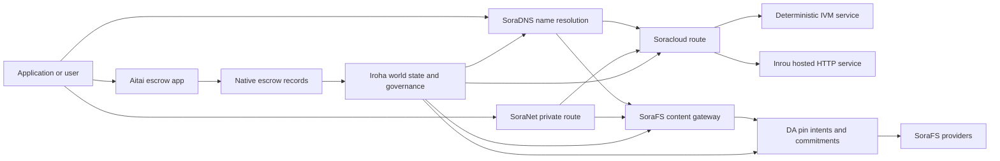

# SORA Nexus サービス {#sora-nexus-services}

SORA Nexus は Iroha 3 の周りにアプリ向けのサービスプレーンを追加します。これらのサービスは別個のブロックチェーン台帳ではありません。それらは Iroha ワールドステート、Norito 技術マニフェスト、ガバナンス記録、および Torii ルートファミリーによって固定されています。

利用可能性はノードのビルドとネットワークプロファイルによって異なります。使用してください [`/openapi.json`](/ja/reference/torii-endpoints.md#app-and-sora-route-families) 生成されたアプリを発見するために API ターゲットノード上のルート。パブリックローカル SoraFS CID そして、よく知られたルートは生成されたドキュメントの外に配置されているので、デプロイメントを確認する際にはそれらのルートを直接調べてください。

## コンポーネントマップ {#component-map}

|コンポーネント|役割|主な表面|
| ---------------------- | ------------------------------------------------------------------------------------------------------------------------------------------- | ---------------------------------------------------------------------------------------- |
|Soracloud|アプリケーションのデプロイ、ホストされたサービス、プライベートモデル/ランタイム状態、およびサービスのライフサイクル管理。| `/v1/soracloud/*`, `/api/*`, `iroha soracloud service ...` |
|印籠|Soracloud は、ライブの HTTP プレーンを必要とするサービス改訂のために HTTP ソフトウェアランタイムをホストしました。| Soracloud ソフトウェア実行時設定、ホスト機能広告、レプリカソフトウェア実行時状態|
| SoraNet                |回路、リレートラフィック、VPN、接続セッション、およびストリーミングルートのためのプライバシーおよびトランスポートオーバーレイ。| `/v1/connect/*`、`/v1/vpn/*`、SoraNet ルートメタデータ|
|データの利用可能性 (DA)|利用可能性の証拠、暗号コミットメント値、およびペイロードに対するピンインテントレイヤーは、Nexus 実行レーン、SoraFS 技術マニフェスト、および証明フローによって参照されます。| `/v1/da/*`, `FindDaPinIntent*`, `[nexus.da]`                                             |
| SoraFS                 |技術マニフェスト、CAR ペイロード、固定コンテンツ、ゲートウェイフェッチ、および取得可能性証明フローのためのコンテンツアドレス型ストレージファブリック。| `/v1/sorafs/*`, `/sorafs/*`, `FindSorafsProviderOwner` |
| SoraDNS                |SORA ホストサービスおよびコンテンツのための決定論的ネーミングおよびリゾルバー証明レイヤー。|`/v1/soradns/*`、`/soradns/*`、リゾルバディレクトリのイベント|
|会いたい|ネイティブのエスクローレコードに裏付けられたアプリレベルの法定通貨および資産の金融取引決済経路であり、別のブロックチェーン台帳によってではありません。| `OpenAssetEscrow`, `FindAssetEscrow*`, `EscrowEventFilter`, Kotodama `escrow_*` ビルトイン |



## 共通のフロー {#common-flows}

### ホストされた分割アプリケーション {#hosted-split-application}

典型的な混合プレーンアプリは、すべての要素を一緒に使用します：

1. 静的フロントエンド資産は、SoraFS を通じてパッケージ化され固定されます。
2. 例えば、パブリックホスト`<app>.sora`は SoraDNS を通じて登録されています。
3. Soracloud は `/api/v1/search` または `/api/v1/stream` を Inrou HTTP サービスにルーティングします。
4. Soracloud ルート `/api/auth` と `/api/v1/user` を決定論的な IVM ハンドラーにルーティングします。
5. プライバシーを必要とするクライアントは、SoraNet 回線を通じて同じコンテンツまたは API ルートにアクセスできます。

|パス|バックプレーン|なぜ|
| ----------------- | --------------------- | ------------------------------------------------- |
| `/`               | SoraFS 静的コンテンツ |再現可能なコンテンツルートおよびゲートウェイキャッシュ|
|`/assets/*`| SoraFS 静的コンテンツ |コンテンツ指向のアセットと技術的マニフェストの証明|
| `/api/auth*`      | Soracloud IVM         |リプレイ安全な認証およびウォレットチャレンジの状態|
| `/api/v1/user*`   | Soracloud IVM         |ガバナンスに敏感な州の変異|
| `/api/v1/search*` | Soracloud 印籠|ライブ HTTP サービス、キャッシュ、SSE、またはコレクタの状態|

### コンテンツ公開 {#content-publication}

SoraFS 公表は、名前がそれを指す前に耐久性のある成果物を生成する:

1. ペイロードまたはディレクトリを作成する。
2. CAR アーカイブにまとめて、チャンクプランにしてください。
3. Norito の技術マニフェストを、ピンポリシーおよびガバナンスデータと共に作成する。
4. 技術マニフェストを Torii に提出してください。
5. ターゲットプロファイルが明示的な証拠を要求する場合、DA ピン意図または利用可能性の暗号化コミットメント値を記録します。
6. 技術マニフェストを SoraDNS 名または Soracloud 静的フロントエンドルートにバインドします。

### プライベートフェッチまたはストリーミングルート {#private-fetch-or-streaming-route}

SoraNet は SoraFS や Soracloud の前に座ることができます：

1. クライアントは名前または技術的マニフェストを解決します。
2. ガードディレクトリまたはルート技術マニフェストは、エントリーおよび出口リレーを選択します。
3. トラフィックはパディングされ、SoraNet 回線を通じて送信されます。
4. 出口リレーは SoraFS ゲートウェイ、Torii ストリーム、または Soracloud ルートに到達します。

## 会いたい {#aitai}

Aitaiは、購入者と販売者がオフチェーンでの支払いを調整するマーケットプレイス型金融取引決済用の SORA アプリコリドールであり、Iroha の際に使用されますオンチェーン資産の管理を制御します。新しい数値資産の管理フローには、契約が所有するエスクローアカウントの代わりに、ネイティブのエスクロー指示ファミリーを使用する必要があります。

ネイティブエスクローは、ブロックチェーン台帳でカストディを保持します。売り手は `OpenAssetEscrow` でオファーを開き、買い手はそれを受け入れ、`AcceptAssetEscrow` と `MarkEscrowPaymentSent` でオフチェーン支払いをマークします。そして、売り手は `ReleaseAssetEscrow` でのリリース、または支払いが記録される前にキャンセルします。購入者と売り手が意見の不一致の場合、どちらの当事者も紛争を開始でき、`CanResolveEscrowDispute` とともに紛争解決者がロックされた金額を分割することができます。

フルライフサイクル、汎用資産ロック、匿名エスクロー、クエリ、イベント、および Rust の例については、[ネイティブ資産エスクロー](/ja/blockchain/escrow.md) を参照してください。

|会いたい表面|それに使用してください|
| ------------------------------------------------------------------------------------------------------------------------------------------------------------- | ----------------------------------------------------------------------------------------- |
| `OpenAssetEscrow`, `AcceptAssetEscrow`, `MarkEscrowPaymentSent`, `ReleaseAssetEscrow`, `CancelAssetEscrow`                                                    |透過的な数値資産の提供、XOR 建ての金融取引決済フローを含む。|
| `OpenAnonymousAssetEscrow`, `AcceptAnonymousAssetEscrow`, `MarkAnonymousEscrowPaymentSent`, `ReleaseAnonymousAssetEscrow`, `CancelAnonymousAssetEscrow`       |シールド付きのオファーは、資金提供およびクロージングの動きに対して証明書添付を使用します。|
| `OpenEscrowDispute`, `ResolveEscrowDispute`, `OpenAnonymousEscrowDispute`, `ResolveAnonymousEscrowDispute`                                                    |紛争の登録と裁判方式の解決。|
| `FindAssetEscrowById`, `FindAssetEscrowsBySeller`, `FindAssetEscrowsByBuyer`, `FindAssetEscrowsByStatus` |アプリのステータスページ、照合ジョブ、サポートツール。|
| `EscrowEventFilter` |エスクローID、販売者、購入者、ステータス、またはイベントの種類によって、透明なエスクローサブスクリプションをライブで確認できます。|
|Kotodama `escrow_open_offer`、`escrow_accept`、`escrow_mark_payment_sent`、`escrow_release`、`escrow_cancel`、`escrow_open_dispute`、`escrow_resolve_dispute`| Kotodama コントラクト呼び出しは V1 エスクロー syscall によってサポートされます。|

公開 Taira または Minamoto を使用する場合は、オフチェーンの支払いレールと、サポートや裁定のワークフローをアプリケーションポリシーとして扱ってください。Iroha が記録するのは、エスクローの状態、ライフサイクルイベント、証拠の暗号ハッシュ、最終的な資産移動です。法定通貨の決済そのものを確認するわけではありません。

## ターゲットノードを確認する {#check-a-target-node}

このページの例を使用する前に、対象のノードにルートファミリーが存在することを確認してください:

```bash
export TORII_URL=https://taira.sora.org

curl -fsS "$TORII_URL/openapi.json" \
  | jq '.paths | keys[] | select(test("^/v1/(soracloud|sorafs|soradns|connect|vpn|da)/"))'

curl -fsS -H 'Accept: application/json' "$TORII_URL/status" | jq .
```

`/openapi.json` は標準的な OpenAPI API エンドポイントです。正確なルートの可用性は、ビルド機能とネットワーク構成によります。本書では公開されているローカル SoraFS CID およびよく知られたルートを列挙していません。以下に記載されているように、それらの API エンドポイントを直接確認してください。

### Taira 読み取り専用スモークチェック {#taira-read-only-smoke-checks}

パブリック Taira API エンドポイントは読み取り側のチェックに便利ですが、認可されたアカウントを操作しており、パブリックテストネットの状態を変更するつもりがない限り、変更を伴う例には使用しないでください。

```bash
export TORII_URL=https://taira.sora.org

curl -fsS -H 'Accept: application/json' "$TORII_URL/status" \
  | jq '{version: .build.version, peers, blocks, lanes: (.teu_lane_commit | length)}'

curl -fsS "$TORII_URL/v1/vpn/profile" \
  | jq '{available, relay_endpoint, supported_exit_classes}'

curl -fsS "$TORII_URL/v1/sorafs/storage/peers?limit=4" \
  | jq '{gateway_base_url, pin_torii_urls}'

curl -fsS -H 'Accept: application/json' "$TORII_URL/v1/soracloud/status" \
  | jq '.control_plane | {service_count, services: [.services[] | {service_name, current_version}]}'
```

Taira は、OpenAPI パスマップに記載されていないデプロイメント固有のコントロールプレーン経路を公開する可能性があります。`/openapi.json` を含まれる経路の生成された契約として扱い、その後、利用可能として文書化する前にデプロイメント固有のローカル SoraFS 経路とパブリック経路を直接確認してください。

## Soracloud {#soracloud}

Soracloud は SORA アプリケーション制御プレーンです。これは、デプロイメントバンドル、サービスリビジョン、ルーティング、ロールアウトの状態、権限のある設定エントリ、暗号化されたサービスシークレット、モデルレジストリレコード、プライベート推論セッション、およびソフトウェアランタイムプロトコル結果レコードを追跡します。

Soracloud は2つの実行プレーンを使用します：

|実行プレーン|ソフトウェア実行環境|それに使ってください|
| ---------------------- | ------- | -------------------------------------------------------------------------------------------- |
| `DeterministicService` | `Ivm`   |認証、ボールトの状態、認定済み読み取り、順序付けられたメールボックスハンドラー、ガバナンスに敏感な変更|
| `HttpService`          | `Inrou` |ライブ HTTP APIs、コレクター多めの作業、キャッシュ対応サービス、SSE、ブラウザ支援フロー|

コントロールプレーンが権威を持っています。デプロイ、アップグレード、ロールバック、設定、シークレット、モデル、およびステータスのコマンドはすべて Torii を通じて送信され、最終化されたワールドステートを読み取ります; これらは別の CLI-ローカルミラーに依存しません。パブリックルーティングは最長プレフィックスベースなので、1つの登録されたホストがホストされた HTTP ルートと決定論的な API ルートの間でトラフィックを分割できます。

### Split App の生成されたスタータ構造 {#scaffold-a-split-app}

スプリットアプリテンプレートは、静的フロントエンドと、ホストされるライブ API および決定論的ボルト/API サービスを1つずつ作成します:

```bash
iroha soracloud app init \
  --template split-app \
  --app-name solswap_indexer \
  --app-version 0.1.0 \
  --public-host solswap-indexer.sora \
  --output-dir ./apps/solswap-indexer

iroha soracloud app plan \
  --manifest ./apps/solswap-indexer/app_manifest.json

iroha soracloud app doctor \
  --manifest ./apps/solswap-indexer/app_manifest.json
```

`plan` はルートの分割、子サービスの技術マニフェスト、ワークスペースのスクリプトパス、そして予想されるフロントエンドの公開モードを出力します。`doctor` は、Torii を関与させる前にローカルリリース契約を検証します。

### アプリの状態をデプロイして確認する {#deploy-and-inspect-app-state}

リリースのリトライごとに、1つの将来の SoraFS 保持エポックを再利用します。スプリットアプリテンプレートにはInrouサービスが含まれているため、オンラインの変更を行う前に、選択したオフラインプロバイダーストアでその正確なアーティファクトを確認してください:

```bash
export SORACLOUD_TORII_URL=https://<soracloud-enabled-torii>
export SORAFS_RETENTION_EPOCH=<future-unix-seconds>

iroha soracloud app preseed \
  --manifest ./apps/solswap-indexer/app_manifest.json \
  --sorafs-retention-epoch "$SORAFS_RETENTION_EPOCH" \
  --inrou-preseed-target <validator-account,peer-id,absolute-store-path> \
  --inrou-preseed-max-capacity-bytes <bytes> \
  --inrou-preseed-helper /absolute/path/to/sorafs-node \
  --inrou-preseed-helper-sha256 <lowercase-sha256> \
  --receipt-out /absolute/path/to/solswap-inrou-preseed.json

iroha soracloud app release \
  --manifest ./apps/solswap-indexer/app_manifest.json \
  --sorafs-retention-epoch "$SORAFS_RETENTION_EPOCH" \
  --inrou-preseed-receipt /absolute/path/to/solswap-inrou-preseed.json \
  --torii-url "$SORACLOUD_TORII_URL"

iroha soracloud app status \
  --manifest ./apps/solswap-indexer/app_manifest.json \
  --torii-url "$SORACLOUD_TORII_URL"
```

展開ポリシーで必要なすべてのプロバイダーストアについて `--inrou-preseed-target` を繰り返します。`release` は技術マニフェストを構築して同期し、アプリドクターを実行します、1つの標準的なアプリインフラストラクチャ変異を提出し、正式なステータスを調整し、宣言されたライブターゲットを検証します。アプリにInrouアーティファクトが含まれている場合、プリシードプロトコルの結果記録は任意ではありません。

すでにデプロイされているサービスの場合は、サービス限定のコマンドを使用してください：

```bash
iroha soracloud service status \
  --service-name solswap_indexer_live \
  --torii-url "$SORACLOUD_TORII_URL"

iroha soracloud service rollback \
  --service-name solswap_indexer_live \
  --target-version 0.1.0 \
  --torii-url "$SORACLOUD_TORII_URL"
```

### 設定と秘密の資料 {#config-and-secret-material}

Soracloud コンフィグおよびシークレットのエントリは、正式なデプロイメント状態の一部です。必要なコンフィグまたはシークレットのバインディングが欠落しているか、アクティブな技術マニフェストと一致しない場合、デプロイ、アップグレード、およびロールバックは失敗します。

```bash
iroha soracloud service config-set \
  --service-name solswap_indexer_live \
  --config-name indexer/public_config \
  --value-file ./config/public-config.json \
  --torii-url "$SORACLOUD_TORII_URL"

iroha soracloud service secret-set \
  --service-name solswap_indexer_live \
  --secret-name indexer/api_key \
  --secret-file ./secrets/api-key.envelope.json \
  --torii-url "$SORACLOUD_TORII_URL"
```

プロフィールに必要な正確な認証フラグについては、CLI ヘルプを使用してください：

```bash
iroha soracloud service config-set --help
iroha soracloud service secret-set --help
```

## 印籠 {#inrou}

Inrouは、Soracloud で使用されるホストされた HTTP ソフトウェアランタイムです。Soracloud ソフトウェアランタイムを組み込んだ Iroha ノードは、承認された Soracloud 状態を投影しますローカルの具現化計画に組み込み、割り当てられたホスト型サービスのレプリカをループバックサービスとして開始し、レプリカのソフトウェア実行状態を権威あるモデルに報告します。

ライブの HTTP サーフェスが必要なワークロードには Inrou を使用してください。例えば、コレクタが多い APIs、SSE ストリーム、キャッシュ対応のハンドラー、またはブラウザ支援サービスなどです。

### ソフトウェア実行時要件 {#runtime-requirements}

- コンテナ技術マニフェストソフトウェアランタイムは `Inrou` でなければなりません。
- サービス技術マニフェスト実行プレーンは `HttpService` でなければなりません。
- `HttpService + Inrou` には、正確に1つの `PersistentRootLeaseVolume` が `/` に取り付けられている必要があります。
- レプリケートされた Inrou サービスも、可変の共有状態を保持する場合は、共有サービスまたは機密リースストレージが必要です。
- 本番ホスティングノードは、プロキシとしてのみ動作するのではなく、実際のInrou容量を広告するべきです。

### 技術的マニフェストフラグメント {#manifest-fragment}

以下の例は、2つの技術マニフェストの形状を示しています。これは断片であり、完全なデプロイメントバンドルではありません。

```jsonc
// container_manifest.json
{
  "schema_version": 1,
  "runtime": { "runtime": "Inrou", "value": null },
  "bundle_path": "/bundles/solswap-indexer.inrou",
  "entrypoint": "/app/bin/launch-indexer.sh",
  "args": [],
  "env": {
    "RUST_LOG": "info",
  },
  "inrou": {
    "schema_version": 1,
    "guest_os": { "guest_os": "DebianSlim", "value": null },
    "guest_images": {
      "x86_64": {
        "kernel_image_path": "/inrou/x86_64/vmlinux",
        "rootfs_image_path": "/inrou/x86_64/rootfs.ext4",
        "initrd_image_path": null,
      },
      "aarch64": {
        "kernel_image_path": "/inrou/aarch64/vmlinux",
        "rootfs_image_path": "/inrou/aarch64/rootfs.ext4",
        "initrd_image_path": null,
      },
    },
  },
  "lifecycle": {
    "start_grace_secs": 60,
    "stop_grace_secs": 30,
    "healthcheck_path": "/api/indexer/v1/health",
  },
}
```

```jsonc
// service_manifest.json
{
  "schema_version": 1,
  "service_name": "solswap_indexer_live",
  "service_version": "0.1.0",
  "execution_plane": { "execution_plane": "HttpService", "value": null },
  "replicas": 2,
  "route": {
    "host": "solswap-indexer.sora",
    "path_prefix": "/api/v1/search",
    "service_port": 8080,
    "visibility": { "visibility": "Public", "value": null },
    "tls_mode": { "tls": "Required", "value": null },
  },
  "lease_volumes": [
    {
      "volume_name": "root_disk",
      "kind": {
        "lease_volume": "PersistentRootLeaseVolume",
        "value": null,
      },
      "storage_class": { "storage_class": "Warm", "value": null },
      "mount_path": "/",
      "max_total_bytes": 8589934592,
    },
    {
      "volume_name": "index_state",
      "kind": { "lease_volume": "ServiceLeaseVolume", "value": null },
      "storage_class": { "storage_class": "Warm", "value": null },
      "mount_path": "/var/lib/solswap-indexer",
      "max_total_bytes": 1073741824,
    },
  ],
}
```

ソフトウェアの実行時には、マウントされた各リースボリュームが、ボリューム名に由来する環境変数を通じて公開されます:

```text
SORACLOUD_LEASE_VOLUME_ROOT_DISK_DIR
SORACLOUD_LEASE_VOLUME_ROOT_DISK_MOUNT_PATH
SORACLOUD_LEASE_VOLUME_INDEX_STATE_DIR
SORACLOUD_LEASE_VOLUME_INDEX_STATE_MOUNT_PATH
```

## SoraNet {#soranet}

SoraNet はプライバシーおよびトランスポートオーバーレイです。これは、ターゲットゲートウェイやサービスに直接接続すべきでないトラフィックのために、リレーベースの経路を提供します。このトランスポート設計は、エントリー、中間、および出口リレーロール、QUIC トランスポート、ノイズベースのハイブリッドハンドシェイク、能力ネゴシエーション、リレーディレクトリのメタデータ、および固定サイズのパディングセルを使用します。

Nexus のデプロイメントでは、SoraNet はコンテンツの取得、ゲートウェイトラフィック、VPN または Connect セッション、および Norito ストリーミングルートを運ぶことができます。ディレクトリエントリは、`norito-stream` をサポートするリレーを示すことができ、これによりクライアントは Torii RPC またはストリーミングトラフィックに適したルートを優先することができます。

### ストリーミング設定 {#streaming-configuration}

Nexus プロファイルは、ストリーミングルートに対して SoraNet プロビジョニングを有効にします:

```toml
[streaming]
feature_bits = 0b11

[streaming.soranet]
enabled = true
exit_multiaddr = "/dns/torii/udp/9443/quic"
padding_budget_ms = 25
access_kind = "authenticated"
provision_spool_dir = "./storage/streaming/soranet_routes"
provision_spool_max_bytes = 0
provision_window_segments = 4
provision_queue_capacity = 256
```

視聴者認証を必要としないコンテンツルートには `access_kind = "read-only"` を使用してください。Torii またはホストサービスに接続する前に、出口リレーがチケットや視聴者の身元を強制する必要がある場合は `authenticated` を使用してください。

### SoraNet-対応 SoraFS 取得 {#soranet-aware-sorafs-fetch}

その SoraFS 取ってくる CLI ローカルプロキシの技術的マニフェストを出力してスプールすることができる SoraNet ブラウザ拡張機能用のルートメタデータまたは SDK アダプター。オーケストレーター JSON 定義しなければならない `local_proxy` 〜と一緒に `"emit_browser_manifest": true`, そしてその CLI で構築されなければならない `local-quic-proxy` サポート。オン Taira, パブリックテストネットのルートで、認定プロバイダカタログを確認する 次に、そのプロバイダーに発行された保護されたプロバイダータプルを入力します:

```bash
export TAIRA_ROOT=https://taira.sora.org
curl -fsS "$TAIRA_ROOT/v1/sorafs/providers?limit=20" | jq '.providers'

: "${TAIRA_SORAFS_PROVIDER_ID:?set the admitted provider ID from Taira discovery}"
: "${TAIRA_SORAFS_GATEWAY_KEY:?set the provider gateway key}"
: "${TAIRA_SORAFS_PROVIDER_URL:?set the advertised provider base URL}"
: "${TAIRA_SORAFS_STREAM_TOKEN_FILE:?set the issued stream-token file}"

cargo run -p sorafs_orchestrator --features=local-quic-proxy --bin=sorafs_cli -- \
  fetch \
  --plan=artifacts/payload_plan.json \
  --manifest-id=<manifest-digest-hex> \
  --orchestrator-config=artifacts/orchestrator.json \
  --provider=name=taira,provider-id="$TAIRA_SORAFS_PROVIDER_ID",gateway-key="$TAIRA_SORAFS_GATEWAY_KEY",base-url="$TAIRA_SORAFS_PROVIDER_URL",stream-token="$(cat "$TAIRA_SORAFS_STREAM_TOKEN_FILE")" \
  --output=artifacts/payload.bin \
  --json-out=artifacts/fetch_summary.json \
  --local-proxy-manifest-out=artifacts/proxy_manifest.json \
  --local-proxy-mode=bridge \
  --local-proxy-norito-spool=storage/streaming/soranet_routes \
  --local-proxy-kaigi-spool=storage/streaming/soranet_routes \
  --local-proxy-kaigi-policy=authenticated \
  --max-peers=2 \
  --retry-budget=4
```

サマリ記録プロバイダーのレポート、チャンクプロトコルの結果記録、ローカルプロキシのメタデータ、およびフェッチに使用された有効なルート設定。

### リレーインセンティブ検証者名簿 {#relay-incentive-verifier-roster}

リレーインセンティブの取り込みは失敗時閉鎖です。`incentives.enable`がtrueの場合、`incentives.trusted_verifier_ids`には少なくとも1つの正規アカウントIDを含める必要があります。名簿は64を超えてはいけませんインセンティブが無効になっている間でもエントリ。ソフトウェアのランタイムはこれを決定論的な順序付きセットとして保存し、リレーの起動中に無効な名簿の構造を拒否します。

各 `RelayBandwidthProofV1` は固定フレーム／割り当て予算の下でデコードされ、フレーム全体を消費する必要があります。証明の検証者アカウントは設定された名簿に存在する必要があり、`RelayBandwidthProofV1::verify_signature()` が成功する必要があり、それが行われた後でリレーはパフォーマンス蓄積器をロックまたは変更します。したがって、信頼されていない暗号署名者や署名が無効／改ざんされた証明は、測定に寄与せず、インセンティブスナップショットを生成することもできません。

## データの利用可能性（DA） {#data-availability-da}

DA は、ペイロードが大きすぎる、プライバシーに敏感すぎる、またはサービス固有すぎてワールドステートに直接配置できない場合の可用性証拠レイヤーです。それは決定論的な暗号コミットメント値と取得義務を記録し、検証者、ゲートウェイ、クライアントがどのバイトが約束されたか、どのポリシーが適用されるか、どの証拠が観測されたかについて合意できるようにします。

DA は Kura または SoraFS の代わりにはなりません:

- Kura は、最終的なブロックストリームとコンセンサスリカバリデータを保存します。
- SoraFS はコンテンツアドレス指定されたバイト、CAR ペイロード、および技術的マニフェストを保存および提供します。
- DA は、暗号コミットメント値、証明ポリシー、証明の開示、およびそれらのバイトをスケジュール、監査、ブロックチェーン台帳の状態にリンクできるピン意図を記録します。

アプリケーションまたは Nexus の実行レーンが、オフチェーンデータが取得可能なままであることをブロックチェーン台帳上で保証する必要がある場合、DA を使用してください。一般的な例には、金融取引清算フローのための実行レーンペイロード暗号化コミットメント値や、公表されたコンテンツのための SoraFS ピン意図が含まれます。後で検証するために保持する必要がある証明バンドル、および公開状態が完全なペイロードではなく暗号学的ダイジェスト値であるべきアプリケーションアーティファクト。

### ライフサイクル {#lifecycle}

|ステージ|記録されているものは何ですか|
| ---------- | ----------------------------------------------------------------------------------------------------------------------------------------------------- |
|意図|チケット、技術マニフェスト参照、エイリアス、レーン／エポック／シーケンス参照、保持ポリシー、または複製ターゲット。|
|暗号学的コミットメント値|暗号学的ダイジェスト値の素材であり、技術マニフェスト、実行レーンペイロード、証明バンドル、またはコンテンツルートをブロックチェーン台帳の記録に表示されるものに結びつけるもの。|
|証拠|可用性投票、証明の公開、プロバイダーの証明、またはターゲットネットワークで受け入れられるその他のプロフィール固有の証拠。|
|クエリ| `FindDaPinIntentByTicket`、`FindDaPinIntentByManifest`、`FindDaPinIntentByAlias`、または`FindDaPinIntentByLaneEpochSequence`を通じたピン意図の検索。|

典型的な DA 支援の出版フローは次の通りです:

1. WSV の外でペイロードを作成するか受け取ってください。例えば、SoraFS CAR ファイルや Nexus 実行レーンペイロードなどです。
2. 暗号ハッシュを作成し、ペイロードを Norito 技術マニフェストまたはルート固有の暗号コミットメント値記録に記述する。
3. そのルートファミリーが有効になっている場合は`/v1/da/*`を通じて、またはネットワークの署名済みトランザクション経路を通じて、技術マニフェスト、ピン意図、または暗号化コミットメント値を提出してください。
4. バリデーターや可用性提供者に、アクティブな証明ポリシーで必要とされる証拠を収集させてください。
5. ペイロードに依存するエイリアス、金融取引決済証明、またはゲートウェイルートを昇格させる前に、生成されたピンインテントまたは暗号的コミットメント値を照会してください。

### アルゴリズムモデル {#algorithmic-model}

DA はペイロードを署名済みでリプレイ防止、ブロックインデックス付きの暗号学的コミットメント値に変換します。重要なアルゴリズムは決定論的であるため、バリデーターやゲートウェイは同じバイトから同じ暗号学的ダイジェストを再計算することができます。

1. 送信されたペイロードを正規化します。Torii は `(lane_id, epoch, sequence)`、ペイロードバイト、圧縮メタデータ、チャンクサイズ、消去プロファイルを含むインジェストリクエストを受け入れます。保持ポリシー、および提出者の署名。ノードは要求があった場合にgzip、deflate、またはZstandardのペイロードを解凍し、その後、標準化されたバイト長が`total_size`と等しいことを確認します。
2. 実行レーンおよびチャンクパラメータを検証します。実行レーンは Nexus 実行レーンカタログに存在する必要があります。`chunk_size`はゼロでない2のべき乗で、少なくとも2バイトでなければなりません。そして、設定された最大値を超えないこと。消去プロファイルにはデータシャードと少なくとも2つのパリティシャードを含める必要があります。実行レーンカタログは、`merkle_sha256` または `kzg_bls12_381` のいずれかの証明方式を選択します。
3. ネットワークポリシーを適用します。ノードは、ブロブクラスに対して設定されたレプリケーションおよび保持の基準を適用します。公開メタデータは平文のままでなければなりません。ガバナンス専用メタデータは、技術マニフェストに書き込まれる前に、ノードに設定されたガバナンスメタデータキーで暗号化されます。
4. チャンクとプロトコルの最終化。標準ペイロードは`chunk_size`から導出された固定サイズプロファイルでチャンク化されます。Torii はペイロードの暗号学的ダイジェストを計算します値、回収可能性証明のツリールート、および各チャンクの暗号コミットメント値。データチャンクはそのバイトにわたって BLAKE3 の暗号コミットメント値を持つ。
5. 消去暗号化コミットメント値を追加します。チャンクは`data_shards`のストライプにまとめられます。最終ストライプの欠落しているセルは、パリティ計算のためにゼロで埋められます。RS(16) パリティは行/グローバルパリティシャードを作成します。オプションで `row_parity_stripes` はマトリックス全体に列スタイルのストライプパリティを追加します。パリティシャードの暗号化コミットメント値は、リトルエンディアンの `u16` シンボルの BLAKE3 暗号化ダイジェストです。
6. 技術マニフェストを作成します。`DaManifestV1` は実行レーン、エポック、ブロブクラス、コーデック、ペイロード暗号ダイジェスト値、チャンクルート、チャンクサイズ、消失保護プロファイル、保持ポリシー、レンタル見積もり、チャンク暗号コミットメント値、オプションの IPA 暗号コミットメント値を記録します。メタデータおよび発行時刻。ストレージチケットは決定論的です：ノードは最初に空のチケットで技術的マニフェストテンプレートを暗号的にハッシュし、その指紋を最終的な `storage_ticket` として書き戻します。
7. リプレイの競合を拒否します。リプレイキーは `(lane_id, epoch, sequence, manifest_fingerprint)` です。同じフィンガープリントを持つ重複は冪等です。古いシーケンスや異なるフィンガープリントを持つ同じシーケンスは拒否されます。
8. 署名済みアーティファクトを発行します。Torii は PDP 暗号コミットメント値を計算し、`DaIngestReceipt` に署名して、`DaCommitmentRecord` を構築し、技術マニフェスト、PDP 暗号コミットメント値、暗号コミットメント値レコードのスプールアーティファクトを書き込みます。暗号コミットメント値スケジュール、PIN意図、プロトコル結果記録ファイル、およびプロトコル結果記録ログ。`(lane_id, epoch)`に従って、プロトコル結果記録カーソルは単調に進みます。

暗号コミットメント値の記録は、ブロックが運ぶものです。記録は以下を結び付けます:

- 実行レーン、エポック、シーケンス
- コーラーブロブIDおよび標準技術マニフェスト暗号ハッシュ
- 実行レーン証明スキーム
- チャンクルート
- オプションの KZG 暗号コミットメント値、KZG 実行レーン用
- PDP/証明暗号ダイジェスト値
- 保持クラスおよび保管チケット
- Torii DA 承認署名

ブロックが DA レコードを埋め込む前に、ブロック組立パスはバンドルを検証します:

- `(lane_id, epoch, sequence)` はバンドル内で一意でなければなりません。
- 技術マニフェストの暗号ハッシュはゼロでなく、バンドル内で一意である必要があります。
- 暗号コミットメント値の証明スキームは、設定された実行レーンポリシーと一致する必要があります。
- マークル実行レーンは KZG 暗号コミットメント値を拒否します; KZG 実行レーンはゼロでない KZG 暗号コミットメント値を必要とします。
- ピンインテントは正規化され、実行レーン、技術マニフェストの暗号ハッシュ、ストレージチケット、所有者アカウント、およびエイリアス衝突ルールによってソートされ、フィルタリングされます。

ブロックヘッダーは、DA 証明ポリシー、暗号化コミットメント値、およびピン意図の暗号ハッシュを格納します。メンバーシップ証明の場合、暗号化コミットメント値のバンドルはメルクルルートも公開します。その葉は標準的な Norito でエンコードされた`DaCommitmentRecord`値の暗号ハッシュである。親ノードは左右の子ノードの連結を暗号的にハッシュする。奇数の葉は、そのまま次の層に昇格される。

### 証明の検証 {#proof-verification}

`/v1/da/commitments/prove` は、ブロック内の1つの暗号化コミットメント値に対する証明を生成できます。証明には、暗号化コミットメント値、ブロックの高さ、バンドル内のインデックス、バンドルの暗号ハッシュ、バンドルの長さ、マークルルート、および兄弟パスが含まれます。検証は以下をチェックします:

1. 証明バンドルの暗号ハッシュは、バインディング値のブロックヘッダーの DA 暗号ハッシュと一致します。
2. 証明ブロックの高さは、参照されたブロックヘッダーと一致します。
3. インデックスは範囲内であり、暗号学的コミットメント値はそのインデックスのバンドルエントリと等しい。
4. 実行レーン証明ポリシーは、暗号化コミットメント値を受け入れます。
5. 暗号化コミットメント値のリーフから兄弟のパスを折りたたすことで、提供されたルートが再構築される。
6. 再構築されたルートはバンドルルートと等しい。

これは、特定の可用性暗号化コミットメント値が特定のブロックペイロードに含まれていたことを証明するものであり、すべてのレプリカが現在オンラインであることを証明するものではありません。ライブでの取得可能性は、SoraFS プロバイダーフェッチ、PDP/PoTR チェック、またはプロファイル固有の可用性証拠を通じて個別に確認されます。

### コンセンサス相互作用 {#consensus-interaction}

コンセンサスペイロードの可用性は必須ですが、これは二次確定プロトコルではありません。リーダーは署名済みの`PayloadManifest`を完全な`3f + 1`委員会にブロードキャストします。最初のボディと RS16 チャンクの出現はセットAを対象とし、その`2f + 1`メンバーにはリーダーとプロキシテイルが含まれます。制限された同一ビュー再送信により、ボディとチャンクのサービスが委員会全体に拡張されます。

技術的なマニフェストや部分的なシャードセットだけでは投票することはできません。Prepareの前に、各バリデーターはチャンクを認証し、完全な正規の本体を再構築し、その長さを検証する必要があります。チャンクルートとボディの暗号ハッシュを持ち、そのボディを保持し、決定論的ブロック検証を完了します。バリデータは CommitQC アプリケーションまたは認定回復を通じて正確なボディを保持します。

ネットワークピアが本文を持つ前に証明書を取得すると、まず証明書の暗号署名者から認証済みチャンクまたは標準的な本文を要求し、その後、回復を凍結された委員会に拡張します。すべての応答は、正確な高さのコンテキスト、提案ラウンド、技術マニフェスト、および本文の主題に拘束されます。ブロックは、ローカルで再構築された本文が証明書と一致した後にのみ適用されます。

### オペレーターのメモ {#operator-notes}

Iroha 3 コンセンサスプロファイルには常に署名済みの技術マニフェストと RS16 ペイロード配布、Prepare前の全身バリデーション、DA バンドル検証、および制限付き回復テレメトリが含まれます。レイアウトとプロトコルの制限は署名済みのハイトコンテキストに固定されており、ローカルのスイッチやタイムアウトプロファイルで無効化したり再定義することはできません。ノードローカルのブロックおよびキューの制限は、それでもデプロイメントの署名済みレイアウトとワークロードに適合する必要があります。

ルート探索のために、ノードの OpenAPI ドキュメントから始めてください：

```bash
curl -fsS "$TORII_URL/openapi.json" \
  | jq '.paths | keys[] | select(startswith("/v1/da/"))'
```

現在の DA クエリ名には[問い合わせ参照](/ja/reference/queries.md#nexus-data-availability-and-packages)を使用し、アプリケーションレベルの`[nexus.da]`取り込み、サンプリング、監査、およびリカバリ範囲には[ネットワークピア構成テンプレート](/ja/reference/peer-config/)を使用し、さらにローカルの Sumeragi ブロックおよびキューの制限を使用します。

## SoraFS {#sorafs}

SoraFS は分散型コンテンツアドレス指定ストレージファブリックです。それはバイトを決定論的なチャンク、CAR アーカイブ、およびコンテンツルート、チャンクプロファイル、ピンポリシー、ガバナンス証明を結びつける Norito 技術マニフェストにパッケージ化します。ストレージプロバイダーは容量とコンテンツの利用可能性を宣伝し、ゲートウェイはコンテンツを提供する前に技術的なマニフェストとチャンクの暗号化コミットメント値を検証します。

典型的 SoraFS 使用例には、静的アプリケーション資産、ドキュメントビルド、ゾーンが含まれます バンドル、モデルまたはアーティファクトの参照、およびガバナンス証拠バンドル。 Iroha データモデルは公開する SoraFS ゲートウェイイベントおよび [`FindSorafsProviderOwner`](/ja/reference/queries.md#nexus-data-availability-and-packages) プロバイダー所有権解決のためのクエリ。

### Taira テストネットプロフィール {#taira-testnet-profile}

Taira は標準的な公開 SoraFS テストネットです。チェックインされたバリデータプロファイルはチェーン `fc56984b-2be7-431d-840e-21514d1883f0` とチェーン区別子 `369` を使用しています。以下の `NetworkId` は、現在固定されている Taira ブロックチェーンのジェネシスの正確な識別です。 Taira のリセットは、チェーンラベルを保持したまま、その暗号化ハッシュを変更できます。そのため、現在の署名付きデプロイメントプロファイルからリフレッシュして、チェーン UUID から派生させないでください。Taira の有効な SoraFS 設定は次のとおりです:

- ネットワークID: `hash:82531CE8EAE8BFF6BEECA4698BFD13A3BC8BEC5F0EE0D23D428C97FC17AB0F3B#3E94`
- ゲートウェイ基地 URL: `https://taira.sora.org`
- ピン Torii URLs： `https://taira-validator-1.sora.org` から `https://taira-validator-4.sora.org` まで
- 発見機能: `torii_gateway`、`chunk_range_fetch`、および`potr_mldsa`
- 孤立したコンテンツの出所: `https://{cid}.sorafs.taira.sora.org/{path}`
- 公開ピンポリシー：許可不要で手数料制限付き、`require_council_signatures = false`付き

```toml
[sorafs.storage]
enabled = false
max_capacity_bytes = 13743895347

[sorafs.discovery]
discovery_enabled = true
known_capabilities = ["torii_gateway", "chunk_range_fetch", "potr_mldsa"]

[sorafs.discovery.admission]
envelopes_dir = "configs/soranexus/taira/sorafs_admission"
trusted_council_keys = ["REPLACE_WITH_TAIRA_SORAFS_COUNCIL_PUBLIC_KEY"]
signature_threshold = "REPLACE_WITH_TAIRA_SORAFS_COUNCIL_SIGNATURE_THRESHOLD"

[sorafs.discovery.publish]
gateway_base_url = "https://taira.sora.org"
pin_torii_urls = [
  "https://taira-validator-1.sora.org",
  "https://taira-validator-2.sora.org",
  "https://taira-validator-3.sora.org",
  "https://taira-validator-4.sora.org",
]

[sorafs.gateway]
require_manifest_envelope = true
enforce_admission = true
enforce_capabilities = true

[sorafs.gateway.untrusted_hosting]
enabled = true
path_gateway_redirect = true
redirect_html_only = true

[sorafs.gateway.untrusted_hosting.cid_host_suffixes]
live = "sorafs.sora.org"
taira = "sorafs.taira.sora.org"

[sorafs.repair]
enabled = false
claim_ttl_secs = 900
heartbeat_interval_secs = 60
max_attempts = 3
worker_concurrency = 4

[sorafs.gc]
enabled = false
interval_secs = 900
max_deletions_per_run = 500
retention_grace_secs = 86400

[gov.sorafs_pin_policy]
require_council_signatures = false
```

三つのトップレベルゲートウェイ値は、継承されたフェイルクローズのデフォルトです。それ以外のすべての値は、Taira のチェックイン済みプロファイルで明示されています。オペレーターは、ディスカバリー・アドミッションのプレースホルダーを署名済みのデプロイメント資料に置き換えなければなりません。提供されるすべてのリクエストは、技術的マニフェストデータコンテナを含み、プロバイダーのアドミッションを通過し、広告された機能を使用する必要があります。

Taira バリデーターには組み込みの SoraFS ストレージ、修復、およびガベージコレクションが無効になっています。設定された容量は依然としてバリデーターの一部として残りますディスク予算のチェック; これはバリデーターがストレージプロバイダーであることを意味するものではありません。テストの前に現在設定されているゲートウェイとピン先を読むには `GET /v1/sorafs/storage/peers?limit=4` を使用してください。

Taira のスキーマ設定は、`live` と `taira` の CID-host サフィックスキーの両方を受け入れます。パブリックテストネットの技術マニフェスト、オリジンチェック、およびブラウザテストは、オリジンが Taira に明示的に結び付けられるように `sorafs.taira.sora.org` を使用する必要があります。承認された`live`キーを、テストネットのコンテンツを本番環境のようなオリジンの下で公開するための推奨事項として扱わないでください。その他のデプロイメントでは、それぞれ独自のネットワークID、ガバナンスキー、プロバイダー認可資料、ピン API エンドポイント、容量／修復ポリシーを使用する必要があります。

### パブリック ローカル CID およびサイト ゲートウェイ {#public-local-cid-and-site-gateways}

オプションのアプリ API がビルドされていない場合でも、すべての SoraFS 対応の Torii ノードはこれらの匿名のパブリックルートをマウントします:

|方法および API エンドポイント|目的|
| ---------------------------------- | -------------------------------------------------------------------- |
| `GET /.well-known/sorafs/manifest` |標準リクエストホストによって選択された技術マニフェストを返します|
| `GET /v1/sorafs/cid/{cid}`         |1つの CID の制限付きローカル技術マニフェストメタデータおよびファイルエントリを返します|
| `GET /sorafs/cid/{cid}`            |1つのローカルコンテンツアドレス指定サイトのルートドキュメントを提供する|
| `GET /sorafs/cid/{cid}/{*path}`    |その CID の下で、1つの正規化されたパス、または1つの制限されたバイト範囲を提供します|

これらのルートは `x-sorafs-stream-token` または `x-sorafs-token-id` を決して受け入れません。どちらかのヘッダーが存在する場合、リクエストは不正です。正準の技術マニフェストはすでにノードの権威あるローカルストアに存在していますこれは公開読み取り機能です；キャッシュミスはリモートプロバイダーのハイドレーションを許可しません。保護されたプロバイダー CAR とチャンクルートは、引き続き別個の認証済みプロトコルサーフェスとして存在します。

バイトを読む前に、Torii はローカル技術マニフェストの正規のエンコーディング、セマンティック制約、暗号学的ダイジェスト値、およびルート CID を検証します。それから、技術的マニフェスト、CID、およびプロバイダーに対して、権限のあるローカルプロバイダーの身元、ガバナンス承認、および統制されたコンプライアンスが必要です。ゲートウェイレート／禁止ポリシーは、設定された信頼済みプロキシを通じてのみ転送されたアドレスを尊重し、有効なクライアントアドレスを使用します。ポリシー、コンプライアンス、認証、またはアクセス状態が欠落している場合は閉鎖状態になります。

1つのリクエストはエンドツーエンドのパブリックゲートウェイ許可を保持しています。プロセス全体の制限は64の同時読み取りであり、これを超えるリクエストは`503 Service Unavailable`および`Retry-After: 1`を返します。技術マニフェストのレスポンスは16に制限されています MiB。ファイルリストはデフォルトで50エントリで、最大500エントリまで返されます。また、完全なファイルまたは単一バイト範囲は8に制限されています MiB。クエリ解析はビルドに依存します。出荷用の `app_api` ビルドはデコードされた符号なし 32 ビット `limit` を受け入れ、他のクエリキーを無視し、最後に繰り返された `limit` を勝たせ、その値を `1..=500` に制限します。機能が最小限のビルドでは、`app_api` を含まず、1つの標準的な `limit=1..500` ペアのみを受け入れ、未知のもの、重複しているもの、パーセントエンコードされたもの、または標準でない形式は拒否します。ポータブルに動作させるには、正確に1つの `limit=<1..500>` ペアを送信してください。 CIDs、ホスト、パス、およびレンジヘッダーは、両方のビルドで標準形式かつ単一値のままです。アクティブな HTML、CSS、JavaScript、SVG、XML、PDF、または Wasm コンテンツは、構成された CID 派生の分離されたオリジンからのみ提供され（またはそこにリダイレクトされ）、共有のパスゲートウェイオリジンが信頼できないコンテンツを実行するのを防ぎます。

### パック、ビルド、提出 {#pack-build-and-submit}

次の変異例では、現在固定されている Taira `NetworkId`、ピン API エンドポイント、レプリケーションフロア、およびガバナンスポリシーを使用します。資金提供されたものを使用してくださいテストネットアカウントと使い捨てのオーナー専用キー ファイル。Taira は理事会の署名なしで許可不要のピンを認めますが、それでも規定された料金を請求します。

```bash
cargo run -p sorafs_orchestrator --bin sorafs_cli -- \
  car pack \
  --input=./dist \
  --car-out=artifacts/site.car \
  --plan-out=artifacts/site.chunk-plan.json \
  --summary-out=artifacts/site.car-summary.json

: "${TAIRA_AUTHORITY:?set a funded Taira I105 account}"
export TAIRA_NETWORK_ID='hash:82531CE8EAE8BFF6BEECA4698BFD13A3BC8BEC5F0EE0D23D428C97FC17AB0F3B#3E94'
export TAIRA_PIN_TORII_URL=https://taira-validator-1.sora.org
export TAIRA_PRIVATE_KEY_FILE="${TAIRA_PRIVATE_KEY_FILE:-./secrets/taira-authority.ed25519}"
export TAIRA_RETENTION_EPOCH=$(( $(date -u +%s) + 86400 ))

cargo run -p sorafs_orchestrator --bin sorafs_cli -- \
  manifest build \
  --summary=artifacts/site.car-summary.json \
  --manifest-out=artifacts/site.manifest.to \
  --manifest-json-out=artifacts/site.manifest.json \
  --pin-min-replicas=1 \
  --pin-storage-class=warm \
  --pin-retention-epoch="$TAIRA_RETENTION_EPOCH"

cargo run -p sorafs_orchestrator --bin sorafs_cli -- \
  manifest submit \
  --manifest=artifacts/site.manifest.to \
  --chunk-plan=artifacts/site.chunk-plan.json \
  --torii-url="$TAIRA_PIN_TORII_URL" \
  --network-id="$TAIRA_NETWORK_ID" \
  --authority="$TAIRA_AUTHORITY" \
  --private-key-file="$TAIRA_PRIVATE_KEY_FILE" \
  --summary-out=artifacts/site.manifest.submit.json \
  --response-out=artifacts/site.manifest.submit.body
```

`manifest submit` は `/v1/sorafs/pin/register` を必要とします。ターゲットノードがそれをルーティングしない場合、コマンドは失敗します。初回リリースの CLI は、汎用の `/transaction` API エンドポイントにフォールバックしません。

### 確認して取得 {#verify-and-fetch}

保護されたフェッチタプルはプロバイダー固有です。Taira のプロバイダーカタログからそのプロバイダーIDと広告されているベース URL を取得し、そのプロバイダーを通じてゲートウェイキーとストリームトークンを取得してください。入場フロー。これらの値はバリデータストレージの設定ではありません。チェックイン済みの Taira バリデータは組み込みストレージが無効になっているため、プロバイダー URL に対してバリデータ PIN URL を代用しないでください。

```bash
export TAIRA_ROOT=https://taira.sora.org
curl -fsS "$TAIRA_ROOT/v1/sorafs/providers?limit=20" | jq '.providers'

: "${TAIRA_SORAFS_PROVIDER_ID:?set the admitted provider ID from Taira discovery}"
: "${TAIRA_SORAFS_GATEWAY_KEY:?set the provider gateway key}"
: "${TAIRA_SORAFS_PROVIDER_URL:?set the advertised provider base URL}"
: "${TAIRA_SORAFS_STREAM_TOKEN_FILE:?set the issued stream-token file}"

cargo run -p sorafs_orchestrator --bin sorafs_cli -- \
  proof verify \
  --manifest=artifacts/site.manifest.to \
  --car=artifacts/site.car \
  --chunk-plan=artifacts/site.chunk-plan.json \
  --summary-out=artifacts/site.verify.json

cargo run -p sorafs_orchestrator --bin sorafs_cli -- \
  fetch \
  --plan=artifacts/site.chunk-plan.json \
  --manifest-id=<manifest-digest-hex> \
  --provider=name=taira,provider-id="$TAIRA_SORAFS_PROVIDER_ID",gateway-key="$TAIRA_SORAFS_GATEWAY_KEY",base-url="$TAIRA_SORAFS_PROVIDER_URL",stream-token="$(cat "$TAIRA_SORAFS_STREAM_TOKEN_FILE")" \
  --output=artifacts/site.fetch.tar \
  --json-out=artifacts/site.fetch.json
```

### 回収可能性確認 {#proof-of-retrievability-checks}

オペレーターは、取得証明の結果を検査、エクスポート、報告することができます。チャレンジはネットワークの証明ソフトウェア処理ワークフローによってスケジュールされます。CLI がその結果を表示します。

```bash
cargo run -p sorafs_orchestrator --bin sorafs_cli -- \
  por status \
  --torii-url="$TAIRA_PIN_TORII_URL" \
  --manifest=<manifest-digest-hex> \
  --status=failed \
  --limit=20

cargo run -p sorafs_orchestrator --bin sorafs_cli -- \
  por report \
  --torii-url="$TAIRA_PIN_TORII_URL" \
  --week=<YYYY-Www> \
  --format=json
```

## SoraDNS {#soradns}

SoraDNS は SORA サービスおよびコンテンツのための決定論的なネーミング層です。名前を正規化し、リゾルバディレクトリの更新を Iroha に固定します。そして、署名されたゾーンまたはリゾルババンドルを SoraFS を通じて配布します。リゾルバとゲートウェイは、ディスカバリメタデータを信頼する前にリゾルバの認証文書を検証します。

ブラウザアクセスの場合、SoraDNS は登録済みの FQDN からゲートウェイホストを取得します。登録されたバニティホストは標準のアプリケーションオリジンとして残り、展開されたゲートウェイプロファイルはそのオリジンに対するブラウザおよび Torii フォールバックルートを公開します。

### ホストフォーム {#host-forms}

|フォーム|例|目的|
| ---------------------- | ---------------------------------------------- | --------------------------------------------------------- |
|虚栄の起源|`https://<fqdn>/<path>`|技術マニフェストおよびリリースノートに記録されたカノニカルアプリ URL|
| Taira ブラウザゲートウェイ | `https://<fqdn>.mon.taira.sora.net/<path>`     |アクティブなエイリアスのための公開ブラウザゲートウェイ|
| Torii フォールバックパス | `https://taira.sora.org/soradns/<fqdn>/<path>` |Torii アクティブなエイリアスのデバッグおよびフォールバックルート|
|標準的な暗号学的ハッシュゲートウェイ|`<base32(blake3(name))>.gw.sora.id`            |決定論的ゲートウェイの識別と GAR の確認|

`/soradns/<alias>/...` フォールバックは推奨されるパブリック URL ではありません。ツール、アプリの技術マニフェスト、およびフロントエンドの設定では、バニティホスト自体を優先する必要があります。もしエイリアスが Taira でアクティブでない場合、ブラウザゲートウェイまたはフォールバックパスは、アプリケーションルーティングが始まる前に `404` を返すか、TLS で失敗することがあります。

### ゲートウェイホストを導出する {#derive-gateway-hosts}

```ts
import {
  deriveSoradnsGatewayHosts,
  hostPatternsCoverDerivedHosts,
} from '@iroha/iroha-js'

const derived = deriveSoradnsGatewayHosts('docs.sora')
console.log(derived.canonicalHost)
console.log(derived.prettyHost)

const taira = deriveSoradnsGatewayHosts('solswap-indexer.sora', {
  prettySuffix: 'mon.taira.sora.net',
})
console.log(taira.prettyHost)

const patterns = [
  derived.canonicalHost,
  derived.canonicalWildcard,
  derived.prettyHost,
]
console.log(hostPatternsCoverDerivedHosts(patterns, derived))
```

GAR のペイロードは、標準的な暗号ハッシュホスト、標準的なワイルドカード、および選択されたきれいなホストをカバーする必要があります。

### リゾルバーディレクトリのデータスナップショットを取得する {#fetch-a-resolver-directory-snapshot}

```bash
curl -i "$TORII_URL/v1/soradns/directory/latest"

soradns_resolver directory fetch \
  --record-url "$TORII_URL/v1/soradns/directory/latest" \
  --directory-url https://gateway.example.org/soradns/directory/latest.car \
  --output ./state/soradns-directory

soradns_resolver rad verify \
  --rad ./state/soradns-directory/rad/resolver-a.norito
```

ゲートウェイは、リゾルバの証明書ドキュメントが欠落している、期限切れである、署名されていない、または最新のディレクトリMerkleルートにアンカーされていないリゾルバを拒否する必要があります。まだリゾルバディレクトリが公開されていないネットワークでは、ルートが有効になっていても、`/v1/soradns/directory/latest` が `404` を返すことがあります。

### 公共 DNS 代表団 {#public-dns-delegation}

SoraDNS ホストの導出は通常のインターネット DNS 委任を置き換えるものではありません。もし公開 DNS 名が SoraDNS ゲートウェイを指すべき場合:

- サブドメインの場合、選択したプリティホストに CNAME を公開します
- アペックスの名前については、ゲートウェイAnycast IPs に ALIAS/ANAME または A/AAAA レコードを使用してください
- GAR チェックのため、正規ハッシュホストを SoraDNS ゲートウェイドメイン配下に維持します

## FHE と UAID {#fhe-and-uaid}

FHE に関連する Nexus サービスで利用可能な表面には、以下が含まれます:

- `iroha_crypto::fhe_bfv` は、スカラー暗号文評価の決定論的な BFV サポートを実装します。識別子の解決には `BfvIdentifierPublicParameters` と `BfvIdentifierCiphertext` を使用し、スロット 0 には入力バイト長が格納され、後続のスロットにはそれぞれ 1 バイトの暗号化されたデータが格納されます。
- Soracloud の状態およびジョブスキーマは、ガバナンス管理されたパラメータセット、実行ポリシー、暗号文の暗号コミットメント値、クエリデータコンテナ、および開示要求を用いて FHE の暗号文ワークロードをモデル化する。

BFV 識別子パスは、プライバシーを保護する登録に使用されます。クライアントは暗号化された識別子を Torii リゾルバーに送信できます。リゾルバーはそれを評価します。アクティブ識別子ポリシーは、`OpaqueAccountId` を派生させ、プロトコル結果レコードを発行します。次に `ClaimIdentifier` が、そのプロトコル結果レコードをターゲットアカウントに関連付けられた UAID にバインドします。

UAID はそのフローの周りのアイデンティティおよび能力のアンカーです。データモデルでは、`UniversalAccountId` はハッシュでバックされ、`uaid:<hash>` として表示されます。パーサーは `uaid:<hash>` または生の64桁の16進暗号ダイジェスト値のいずれかを受け入れます。`Account` と `NewAccount` には、オプションの `uaid` および `opaque_ids` フィールドが含まれています。ソフトウェアのランタイム登録は、1対1の UAID-対アカウントのインデックスを強制し、重複または衝突する不透明な識別子を拒否し、不透明なものを拒否します識別子は UAID なしで。 UAID アカウントのバインディングが変更されるたびに、ソフトウェア実行時はその UAID のSpace Directoryデータスペースバインディングを再構築します。

スペースディレクトリの技術マニフェストは、UAID に機能を添付します。`AssetPermissionManifest` は、UAID、データスペース、アクティベーションおよびオプションの有効期限エポック、そしてデータスペース、プログラム、メソッド、資産、AMX ロールによってスコープされた順序付きの許可/拒否エントリを指定します。評価は拒否優先です：最初に一致する拒否がリクエストを拒否し、そうでなければ最新の一致する許可候補が任意の量の制限と照合されます。これらの技術的マニフェストの公開、失効、および取り消しは `CanPublishSpaceDirectoryManifest` によって保護されています。

Soracloud FHE の状態について、実装されているスキーマは次の通りです：

|スキーマ|制御するもの|
| ----------------------------------------- | --------------------------------------------------------------------------------------------------------------------------- |
| `SoraStateBindingV1` と `FheCiphertext` |状態キーのプレフィックスの下の値が FHE 暗号文であることを宣言します。|
| `FheParamSetV1`                           |スキーム、バックエンド、モジュラスチェーン、多項式の次数、スロット数、セキュリティ目標、ライフサイクル、およびパラメータの暗号学的ダイジェスト値を指定します。|
| `FheExecutionPolicyV1`                    |暗号文のサイズ、平文のサイズ、入出力の数、乗算の深さ、回転、ブートストラップ、および丸めモードを制限します。|
| `FheGovernanceBundleV1`                   |カップルは、入場検証のために一つのパラメータセットと一つの実行ポリシーを組み合わせます。|
| `FheJobSpecV1`                            |暗号化された状態キーおよび暗号コミットメント値に対する決定論的な `Add`、`Multiply`、`RotateLeft`、または `Bootstrap` の操作について説明します。|
| `CiphertextQuerySpecV1`                   |サービス、バインディング、キー接頭辞、結果の上限、メタデータレベル、およびオプションの包含証明によって暗号文のみの状態を照会します。|
| `DecryptionRequestV1`                     |復号権限ポリシーの下で、1つの暗号文暗号化コミットメント値の開示を要求します。|

`FheJobSpecV1::validate_for_execution` は、ジョブ、実行ポリシー、およびパラメータセットが受付前に一致していることを確認します。また、操作固有のルールも適用します: add（加算）と multiply（乗算）には少なくとも2つの入力が必要です。rotate と bootstrap は正確に1つの入力が必要であり、要求された深さ、回転回数、ブートストラップ回数、入力数、ペイロードバイト、および決定論的出力サイズはポリシーの範囲内に収める必要があります。暗号文クエリの結果は平文の行を返してはいけません。

UAID は暗号文ではなく、FHE ポリシーそのものでもありません。これは、アカウントを見つけるために使用される安定したアカウント機能アンカーであり、サービスやデータスペースのフローを認可するための不透明な識別子クレームおよびスペースディレクトリのバインディングです。FHE スキーマは、パラメータセット、実行ポリシー、暗号文の暗号学的コミットメント値、および復号許可主体ポリシーを通じて、暗号化ペイロードの受け入れと実行を個別に管理します。

関連する Torii 表面には以下が含まれます:

- `/v1/identifier-policies`
- `/v1/identifiers/resolve`
- `/v1/accounts/{account_id}/identifiers/claim-receipt`
- `/v1/identifiers/receipts/{receipt_hash}`
- `/v1/accounts/{uaid}/portfolio`
- `/v1/space-directory/uaids/{uaid}`
- `/v1/space-directory/uaids/{uaid}/manifests`
- `/v1/soracloud/fhe/job/run`
- `/v1/soracloud/ciphertext/query`
- `/v1/soracloud/decrypt/request`

公開メタデータの境界はスキーマに明示されています: UAID バインディング、不透明識別子レコード、技術マニフェストのライフサイクル、状態キー暗号ダイジェスト、暗号文のサイズ、暗号文暗号化コミットメント値、ポリシー名、パラメータセットのバージョン、ジョブ操作、出力状態キーや開示要求メタデータは表示される場合があります。識別子のプレーンテキスト、復号された状態、モデルの入力と出力、そして FHE の秘密鍵は、これらの公開クエリ記録の外にあります。

## 運用チェックリスト {#operational-checklist}

- Torii ノード上で `/openapi.json` と生成されたサービスファミリーを確認し、パブリックローカルの SoraFS CID およびよく知られたルートを直接プローブします。
- Soracloud デプロイメント技術マニフェスト、SoraFS 技術マニフェスト、SoraDNS リゾルバーディレクトリ記録、SoraNet リレーディレクトリ記録、および DA ピン意図または可用性暗号コミットメント値をガバナンスに敏感なアーティファクトとして扱う。
- 1つのネットワーク内のバリデーターで、一貫して同じ SORA Nexus プロファイルを使用してください。
- アドホックなノードローカルのパスに依存するのではなく、技術マニフェストにInrouルートと共有リースボリュームを保持してください。
- コンテンツエイリアスを昇格させる前に、SoraFS の証明確認を使用してください。
- モニター SoraNet ハンドシェイクの失敗、Sumeragi ボディ状態およびペイロード欠落の回復、SoraFS ゲートウェイの拒否、SoraDNS RAD フレッシュネス、そして Soracloud ロールアウトの健全性。
- 公共テストネットの使用には、Taira プロファイルを使用し、[SORA Nexus データスペースに接続する](/ja/get-started/sora-nexus-dataspaces.md) から始めてください。

参照：

- [Torii API エンドポイント](/ja/reference/torii-endpoints.md)
- [データイベントフィルター](/ja/blockchain/filters.md#data-event-filters)
- [問い合わせ参照](/ja/reference/queries.md#nexus-data-availability-and-packages)
- [ピン留めされたソースコードのリビジョンでの正規の Taira バリデータ構成](https://github.com/hyperledger-iroha/iroha/blob/0010c5a70039eac101a4846499ba9ceaf43eb65c/configs/soranexus/taira/config.toml)
