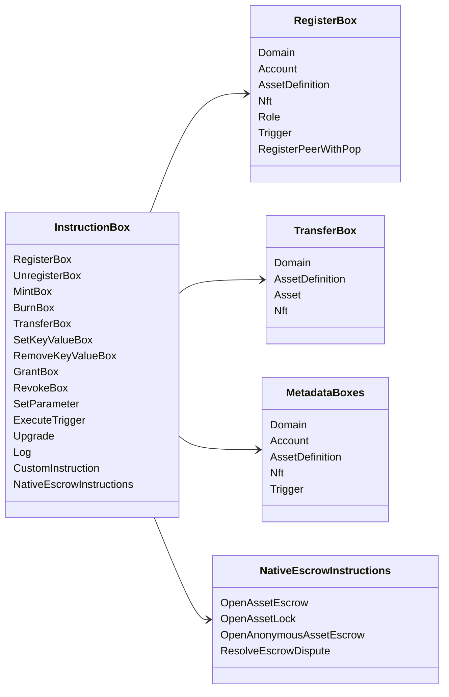

# Iroha 命令操作 {#iroha-special-instructions}

現在のデータモデルは、これらの組み込み指示ファミリーを公開しています：

|指示|バリアント|
| --- | --- |
| [`RegisterBox`](/ja/blockchain/instructions.md#un-register) | `Domain`、`Account`、`AssetDefinition`、`Nft`、`Role`、`Trigger`、`RegisterPeerWithPop` |
| [`UnregisterBox`](/ja/blockchain/instructions.md#un-register) | `Peer`、`Domain`、`Account`、`AssetDefinition`、`Nft`、`Role`、`Trigger` |
| [`MintBox`](/ja/blockchain/instructions.md#mint-burn) |数値 `Asset`、トリガーの繰り返し|
| [`BurnBox`](/ja/blockchain/instructions.md#mint-burn) |数値 `Asset`、反復をトリガーする|
| [`TransferBox`](/ja/blockchain/instructions.md#transfer) | `Domain`、`AssetDefinition`、数値 `Asset`、`Nft` |
| [`SetKeyValueBox`](/ja/blockchain/instructions.md#setkeyvalue-removekeyvalue) | `Domain`, `Account`, `AssetDefinition`, `Nft`, `Trigger` メタデータ |
| [`RemoveKeyValueBox`](/ja/blockchain/instructions.md#setkeyvalue-removekeyvalue) | `Domain`, `Account`, `AssetDefinition`, `Nft`, `Trigger` メタデータ |
| [`GrantBox`](/ja/blockchain/instructions.md#grant-revoke) | `Permission` (`Grant<Permission, Account>`), `Role` (`Grant<RoleId, Account>`), `RolePermission` (`Grant<Permission, Role>`) |
| [`RevokeBox`](/ja/blockchain/instructions.md#grant-revoke) | `Permission` (`Revoke<Permission, Account>`), `Role` (`Revoke<RoleId, Account>`), `RolePermission` (`Revoke<Permission, Role>`) |
| [`SetParameter`](/ja/blockchain/instructions.md#setparameter) |チェーンパラメータの更新|
| [`ExecuteTrigger`](/ja/blockchain/instructions.md#executetrigger) |トリガー実行|
| [`Upgrade`](/ja/blockchain/instructions.md#other-instructions) |実行者のアップグレード|
| [`Log`](/ja/blockchain/instructions.md#other-instructions) |実行者ログエントリ|
| [`CustomInstruction`](/ja/blockchain/instructions.md#other-instructions) |実行者固有の JSON ペイロード|
| [ネイティブ資産エスクロー](/ja/blockchain/escrow.md) | `OpenAssetEscrow`、`AcceptAssetEscrow`、`MarkEscrowPaymentSent`、`ReleaseAssetEscrow`、`CancelAssetEscrow`、`OpenEscrowDispute`、`ResolveEscrowDispute` |
| [汎用資産ロック](/ja/blockchain/escrow.md#generic-asset-locks) | `OpenAssetLock`, `DrawdownAssetLock`, `CancelAssetLock`, `ExpireAssetLock` |
| [匿名資産エスクロー](/ja/blockchain/escrow.md#anonymous-escrow) | `OpenAnonymousAssetEscrow`、`AcceptAnonymousAssetEscrow`、`MarkAnonymousEscrowPaymentSent`、`ReleaseAnonymousAssetEscrow`、`CancelAnonymousAssetEscrow`、`OpenAnonymousEscrowDispute`、`ResolveAnonymousEscrowDispute` |
| [アトミックなプライベート金融取引決済](/ja/blockchain/instructions.md#atomic-private-settlement) | `ActivatePrivateSettlementPoolV1`, `RotatePrivateSettlementPoolPolicyV1`, `FinalizeAtomicPrivateSettlementV1`, `AbortAtomicPrivateSettlementV1` |

追加の Iroha 3 モジュールは、インストラクションレジストリを通じてドメイン固有のインストラクションタイプを登録できます。ノード認証スキーマとそれをキャプチャするコマンドについては、[データモデルスキーマ](./data-model-schema.md)を参照してください。

::: details 図：コア命令ファミリ

:::
