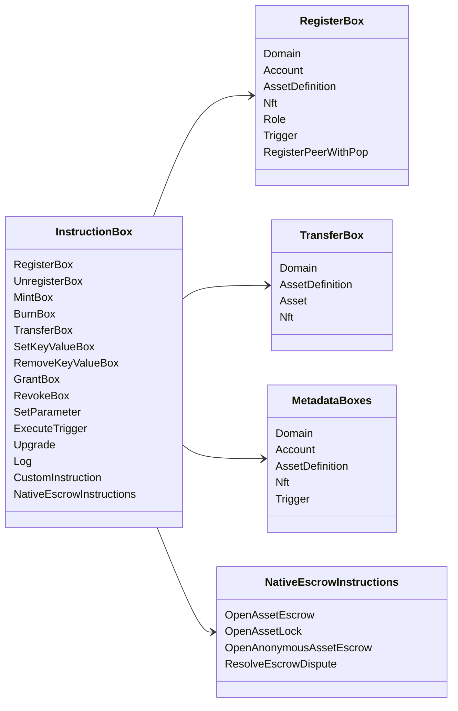

# Iroha 特別指示 {#iroha-special-instructions}

現在のデータモデルは,これらの内蔵の指示ファミリーを暴露しています.

|指示|変異型|
| --- | --- |
| [`RegisterBox`](/ja/blockchain/instructions.md#un-register) | `Domain`, `Account`, `AssetDefinition`, `Nft`, `Role`, `Trigger`, `RegisterPeerWithPop` |
| [`UnregisterBox`](/ja/blockchain/instructions.md#un-register) | `Peer`, `Domain`, `Account`, `AssetDefinition`, `Nft`, `Role`, `Trigger` |
| [`MintBox`](/ja/blockchain/instructions.md#mint-burn) |番号 `Asset`,触発重複|
| [`BurnBox`](/ja/blockchain/instructions.md#mint-burn) |番号 `Asset`,触発重複|
| [`TransferBox`](/ja/blockchain/instructions.md#transfer) |`Domain`, `AssetDefinition`,数値 `Asset`, `Nft` |
| [`SetKeyValueBox`](/ja/blockchain/instructions.md#setkeyvalue-removekeyvalue) |`Domain`,`Account`, `AssetDefinition`, `Nft`, `Trigger` メタデータ |
| [`RemoveKeyValueBox`](/ja/blockchain/instructions.md#setkeyvalue-removekeyvalue) |`Domain`,`Account`, `AssetDefinition`, `Nft`, `Trigger` メタデータ |
| [`GrantBox`](/ja/blockchain/instructions.md#grant-revoke) |アカウントの許可, アカウントの役割, ロールの許可|
| [`RevokeBox`](/ja/blockchain/instructions.md#grant-revoke) |アカウントから許可,アカウントから役割,役割から許可 |
| [`SetParameter`](/ja/blockchain/instructions.md#setparameter) |チェーンパラメータの更新|
| [`ExecuteTrigger`](/ja/blockchain/instructions.md#executetrigger) |実行を誘発する|
| [`Upgrade`](/ja/blockchain/instructions.md#other-instructions) |実行器のアップグレード|
| [`Log`](/ja/blockchain/instructions.md#other-instructions) |執行者ログ入力|
| [`CustomInstruction`](/ja/blockchain/instructions.md#other-instructions) |JSON 実行業者専用用荷物|
| [国産資産のエスクロー](/ja/blockchain/escrow.md) | `OpenAssetEscrow`, `AcceptAssetEscrow`, `MarkEscrowPaymentSent`, `ReleaseAssetEscrow`, `CancelAssetEscrow`, `OpenEscrowDispute`, `ResolveEscrowDispute` |
| [一般的な資産ロック](/ja/blockchain/escrow.md#generic-asset-locks) |`OpenAssetLock`, `DrawdownAssetLock`,`CancelAssetLock`, `ExpireAssetLock` |
| [匿名資産保証人](/ja/blockchain/escrow.md#anonymous-escrow) | `OpenAnonymousAssetEscrow`, `AcceptAnonymousAssetEscrow`, `MarkAnonymousEscrowPaymentSent`, `ReleaseAnonymousAssetEscrow`, `CancelAnonymousAssetEscrow`, `OpenAnonymousEscrowDispute`, `ResolveAnonymousEscrowDispute` |

追加の Iroha 3 モジュールは,指示レジストリを通じてドメイン特定の命令タイプを登録することができる.現在のソースツリーから生成されたスケーマレベルリストについては, [データモデルスケーマ](./data-model-schema.md)を参照してください.

::: details 図: 家庭 の 主要 教訓

:::
