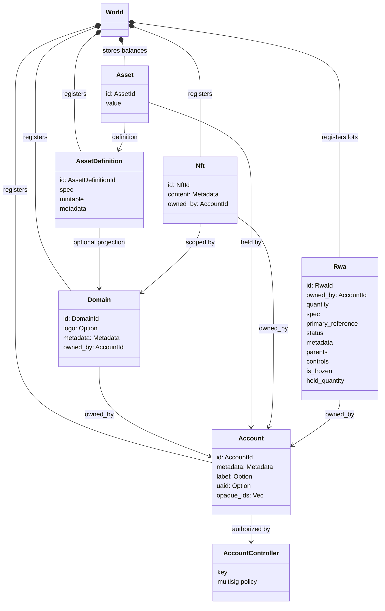
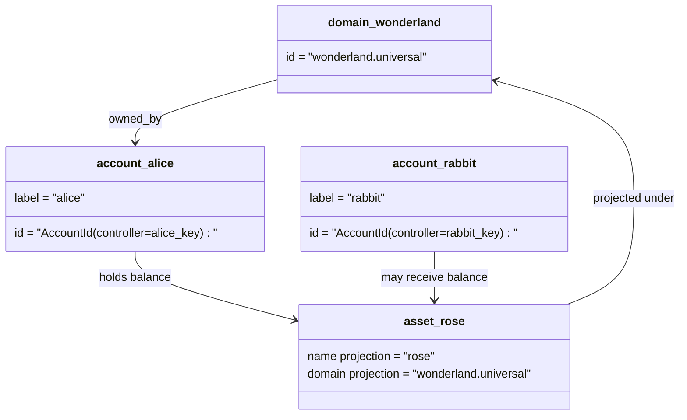

# მონაცემთა მოდელი {#data-model}

Iroha ინახავს მთავარ წიგნს `World`. მისი პირველი გამოშვების მონაცემთა მოდელი იყენებს შემდეგ კანონიკურ იდენტობებსა და სუბიექტებს:

- დომენები არის მონაცემთა სივრცე-კვალიფიცირებული, მაგალითად `payments.universal`
- ანგარიშები კანონიკური და დომენის გარეშეა; ანგარიში ID მოდის ანგარიშის კონტროლისგან.
- აქტივების დეფინიციებს შეუძლიათ შეინარჩუნონ დომენი/სახელების პროექცია, მაგრამ მათი კანონიკური ტექსტური მისამართი არის opaque Base58 იდენტიფიკატორი.
- აქტივები არის საფონდო ანგარიშები კონკრეტული აქტივების განსაზღვრისთვის.
- NFTs არის ექსკლუზიური საკუთრებაში არსებული მონაცემები, რომლებსაც აქვთ დომენის კვალიფიკაცია IDs და მეტადატანილი შინაარსი
- RWAs წარმოქმნილია-ID პარტიები, რომლებიც წარმოადგენენ არაკეტო აქტივებს მიმდინარე მფლობელის, რაოდენობის, წარმომავლობის, მეტა მონაცემების, შენახვის, გაყინვის და სიცოცხლის ციკლის კონტროლით.

## მაგალითი {#example}

Iroha 3 ქსელში, `wonderland.universal` არის დომენი `universal` მონაცემთა სივრცეში. ამ მაგალითის კანონიკური ანგარიშები კონტროლდება მათი გასაღებებით ან პოლიტიკით და კოდირებულია როგორც დომენის გარეშე I105 ანგარიში IDs. წაკითხადი ეტიკეტები, როგორიცაა `alice@wonderland.universal` ცალკე საიდუმლოებებია დაკავშირებული იმ IDs. პროგნოზირებული აქტივის განსაზღვრა კვლავ შეიძლება შეიქმნას დომენის და სახელის მიხედვით, როგორიცაა `rose` `wonderland.universal`-ში, ხოლო საკანონიკური აქტივების განსაზღვრის მისამართი, რომელიც გამოიყენება ტელეფონზე, არის გენერირებული Base58-ის მისამართი.

## ბარათები {#aliases}

ალტერნატიული სახელები არის ადამიანთან დაკავშირებული სახელები, რომლებიც განლაგებულია კანონიკური ლიდერის იდენტიფიკატორებზე. ისინი სასარგებლოა API, CLI, საფულე და ექსპლუატორის საზღვრებში, მაგრამ კანონიკური IDs რჩება სტაბილური იდენტიფექციები, რომლებიც შენახულია მკაცრი ლიდერების ველებში.

|მიზანი |კანონიკური სამიზნე |ალიას ლიტერალური |მხარდამჭერი მოდელი |
| -------------- | --------------------------------------------------- | ------------------------------------------------------ | ----------------------------------------------------------------------------- |
|მომხმარებლის ანგარიში |დომენის გარეშე `AccountId` კოდირებული, როგორც I105 მისამართი |`name@domain.dataspace` ან `name@dataspace` |`AccountAlias`; პირველადი საიდუმლო სახელია `Account.label`, დამატებითი საიდუმლოს სახელია დამაკავშირებელი |
|აქტივების განსაზღვრა |კანონიკური `AssetDefinitionId` Base58. მისამართი |`name#domain.dataspace` ან `name#dataspace` |`AssetDefinitionAlias` ვალდებული იყოს აქტივების განსაზღვრაზე |
|კონტრაქტი |კანონიკური Bech32m `ContractAddress` |`name::domain.dataspace` ან `name::dataspace` |`ContractAlias` დაკავებულია განთავსებული ხელშეკრულების მისამართით |
|დომენის სახელი |`DomainId` ფორმაში `domain.dataspace` |`domain.dataspace` |SNS `domain` სახელების სივრცის ჩანაწერი |
|მონაცემთა სივრცის სახელი |ციფრული `DataSpaceId` აქტიური Nexus კატალოგიდან |მონაცემთა სივრცის ანალიზი, როგორიცაა `universal`, `paynet` ან `zk` |SNS `dataspace` დასახელების სივრცის ჩანაწერი და აქტიური მონაცემთა სივრცე კატალოგი |

ანგარიშის ანალიზი არის მომხმარებლისთვის განკუთვნილი ანგარიშის სახელები. ისინი გადარჩებიან ანგარიშის რეიკინგზე, რადგან ანალიზი მიუთითებს აქტიურ ანგარიშზე. ID მსოფლიო სახელმწიფოების ინდექსებისა და ანგარიშის რეკეის ჩანაწერების საშუალებით. `SetPrimaryAccountAlias` ანგარიშის პირველადი ეტიკეტისათვის, `SetAccountAliasBinding` დამატებითი არაპრემიერული საიდუმლოებისათვის; და `FindAccountByAlias` ან `FindAliasesByAccountId` წაკითხვისთვის. ანგარიშის საიდუმლოები ჩვეულებრივ საჭიროებს აქტიურ SNS საანგარიშო ანალოგიური გაქირავება `AcquireAccountAliasLease` და განახლებულია: `RenewAccountAliasLease`.

აქტივების ანალიზი სახელწოდების აქტივთა განსაზღვრები, არა ინდივიდუალური ანგარიშის ბალანსი. აქტივების ანალიზები და ხელშეკრულების ანალიზი პირდაპირი კავშირებია წაკითხული სახელისაგან არსებული კანონიკური სამიზნეზე. აქტივების საიდუმლოები განისაზღვრება `SetAssetDefinitionAlias`; საიდუმლოს სახელის სეგმენტი უნდა შეესაბამებოდეს აქტივის განსაზღვრის ჩვენების სახელს ან პროგნოზირებული განსაზღვრების სახელს. ხელშეკრულების საიდუმლოები განისაწყობა `SetContractAlias`; საიდუმლის მონაცემთა სივრცე უნდა ემთხვეოდეს კონტრაქტის მისამართში კოდირებულ მონაცემთა სიფართს. ორივე კავშირს შეუძლია ატაროს `lease_expiry_ms`; ამოწურვის შემდეგ ისინი შეწყვეტენ რეზოლუციას მადის ფანჯრის გასვლისთანავე და მოიშორებენ მსოფლიო სახელმწიფოების ინდექსებიდან.

დომენებს არ გააჩნიათ ცალკე `DomainAlias` ობიექტი. დომენის იდენტიფიკატორი უკვე არის მონაცემთა სივრცე-კვალიფიციური სახელი, როგორიცაა `payments.universal`. SNS ადევნებს ბირჟის საკუთრებას დომენის სახელებისათვის `domain` სახელების სივრცეში და სათადარიგოთი მონაცემთა სიბნისთვის `dataspace` სახელების სიბანეში. განკუთვნილი `universal` მონაცემთა სივრცის alias უნდა დარჩეს განსაზღვრული.

## დაკავშირებული დოკუმენტები {#related-docs}

|თემა |სადა უნდა წავიდეთ?|
| -------------------------------------- | ------------------------------------------- |
|დომენები | [დომენები](/ka/blockchain/domains.md) |
|ანგარიშები | [ანგარიშები](/ka/blockchain/accounts.md) |
|აქტივები | [აქტივები](/ka/blockchain/assets.md) |
|NFTs | [NFTs](/ka/blockchain/nfts.md) |
|რეალურ სამყაროში აქტივები | [რეალური სამყაროს აქტივები](/ka/blockchain/rwas.md) |
|მეტა მონაცემები | [მეტა მონაცემები](/ka/blockchain/metadata.md) |
|რეგისტრაციისა და გადარიცხვის ინსტრუქციები | [ინსტრუქციები](/ka/blockchain/instructions.md) |
|გაშვების დროის ნებართვები | [ნებართვა](/ka/blockchain/permissions.md) |
|დასახელების წესები | [დასახელების წესები](/ka/reference/naming.md) |
