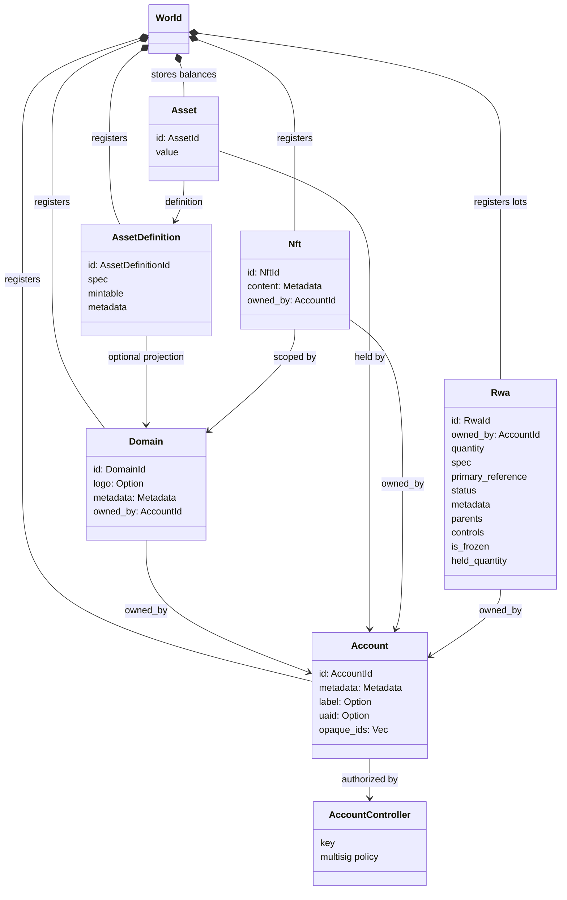
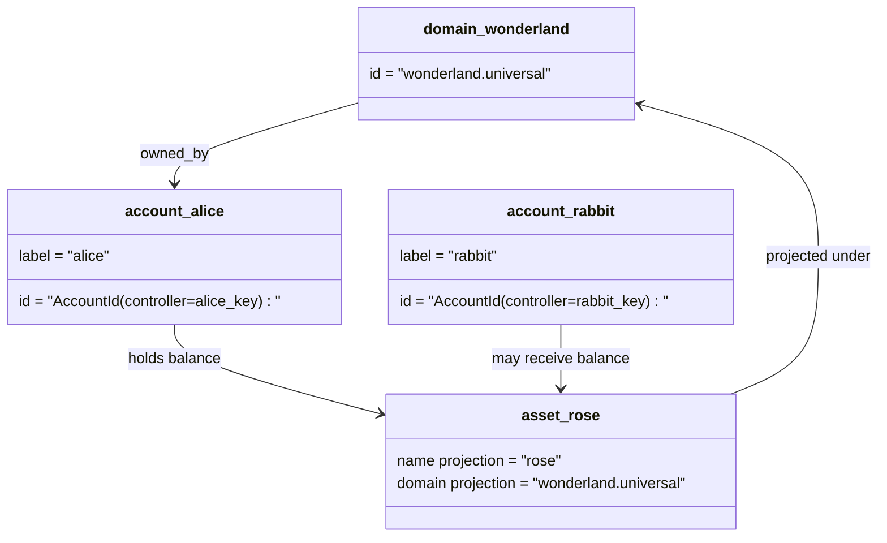

# მონაცემთა მოდელი {#data-model}

Iroha რეესტრის მდგომარეობას `World`-ში ინახავს. პირველი გამოშვების მონაცემთა მოდელი შემდეგ კანონიკურ იდენტობებსა და ერთეულებს იყენებს:

- დომენები მონაცემთა სივრცით კვალიფიცირდება, მაგალითად `payments.universal`
- ანგარიშები კანონიკური და დომენის გარეშეა; ანგარიშის ID ანგარიშის კონტროლერისგან მიიღება
- აქტივის განსაზღვრას შეუძლია დომენისა და სახელის პროექცია შეინარჩუნოს, თუმცა მისი კანონიკური ტექსტური მისამართი გაუმჭვირვალე Base58 იდენტიფიკატორია
- აქტივი არის კონკრეტული აქტივის განსაზღვრის ნაშთი, რომელსაც ანგარიში ფლობს
- NFTs არის უნიკალური მფლობელის მქონე ჩანაწერები, დომენით კვალიფიცირებული ID-ებითა და მეტამონაცემების შიგთავსით
- RWAs არის გენერირებული ID-ის მქონე ლოტები, რომლებიც ქსელგარეშე აქტივებს წარმოადგენს და შეიცავს მიმდინარე მფლობელს, რაოდენობას, წარმომავლობას, მეტამონაცემებს, შეზღუდვებს, გაყინვისა და სიცოცხლის ციკლის მართვის მონაცემებს

## მაგალითი {#example}

Iroha 3-ის ქსელში `wonderland.universal` არის `universal` მონაცემთა სივრცის დომენი. მაგალითის კანონიკურ ანგარიშებს მათი გასაღებები ან პოლიტიკები აკონტროლებს და ისინი დომენის გარეშე I105 ანგარიშის ID-ებად იკოდება. კითხვადი წარწერები, მაგალითად `alice@wonderland.universal`, ამ ID-ებთან მიბმული ცალკე ალიასებია. აქტივის პროექციული განსაზღვრა კვლავ შეიძლება შეიქმნას სახელით `rose` დომენში `wonderland.universal`, ხოლო პროტოკოლის გადაცემაში აქტივის განსაზღვრის გენერირებული, კანონიკური Base58 მისამართი გამოიყენება.

## ალიასები {#aliases}

ალიასები მომხმარებლისთვის განკუთვნილი სახელებია, რომლებიც რეესტრის კანონიკურ იდენტიფიკატორებს ზემოდან ედება. ისინი სასარგებლოა API-ის, CLI-ის, საფულისა და მკვლევარის საზღვრებზე, თუმცა მკაცრ რეესტრის ველებში სტაბილურ იდენტიფიკატორებად კვლავ კანონიკური ID-ები ინახება.

|მიზანი |კანონიკური მიზანი |ალიას ლიტერალური |მხარდამჭერი მოდელი |
| -------------- | --------------------------------------------------- | ------------------------------------------------------ | ----------------------------------------------------------------------------- |
|მომხმარებლის ანგარიში |I105 მისამართად კოდირებული, დომენის გარეშე `AccountId` |`name@domain.dataspace` ან `name@dataspace` |`AccountAlias`; ძირითადი ალიასი არის `Account.label`, დამატებითი ალიასები კი ცალკე ბმულებია |
|აქტივის განსაზღვრა |კანონიკური `AssetDefinitionId` Base58 მისამართი |`name#domain.dataspace` ან `name#dataspace` |აქტივის განსაზღვრაზე მიბმული `AssetDefinitionAlias` |
|კონტრაქტი |კანონიკური Bech32m `ContractAddress` |`name::domain.dataspace` ან `name::dataspace` |განთავსებული კონტრაქტის მისამართზე მიბმული `ContractAlias` |
|დომენის სახელი |`DomainId` ფორმაში `domain.dataspace` |`domain.dataspace` |SNS `domain` სახელების სივრცის ჩანაწერი |
|მონაცემთა სივრცის სახელი |აქტიური Nexus კატალოგის რიცხვითი `DataSpaceId` |მონაცემთა სივრცის ალიასი, მაგალითად `universal`, `paynet` ან `zk` |SNS-ის `dataspace` სახელთა სივრცის ჩანაწერი და მონაცემთა სივრცეების აქტიური კატალოგი |

ანგარიშის ალიასები მომხმარებლისთვის განკუთვნილი ანგარიშის სახელებია. ანგარიშის გასაღების შეცვლის შემდეგაც ისინი ძალაში რჩება, რადგან ალიასი მსოფლიო მდგომარეობის ინდექსებისა და გასაღების შეცვლის ჩანაწერების მეშვეობით მოქმედ ანგარიშის ID-ზე მიუთითებს. ანგარიშის ძირითად წარწერად დასაყენებლად გამოიყენეთ `SetPrimaryAccountAlias`, დამატებითი ალიასებისთვის — `SetAccountAliasBinding`, ხოლო წასაკითხად — `FindAccountByAlias` ან `FindAliasesByAccountId`. ანგარიშის ალიასს, ჩვეულებრივ, სჭირდება მოქმედი SNS იჯარა, რომელიც `AcquireAccountAliasLease`-ით მიიღება და `RenewAccountAliasLease`-ით განახლდება.

აქტივის ალიასი აქტივის განსაზღვრას ასახელებს და არა ანგარიშის ცალკეულ ნაშთს. აქტივისა და კონტრაქტის ალიასები კითხვად სახელს არსებულ კანონიკურ სამიზნესთან პირდაპირ აკავშირებს. აქტივის ალიასი `SetAssetDefinitionAlias`-ით დგინდება; ალიასის სახელის ნაწილი აქტივის განსაზღვრის საჩვენებელ ან პროექციულ სახელს უნდა ემთხვეოდეს. კონტრაქტის ალიასი `SetContractAlias`-ით დგინდება; მისი მონაცემთა სივრცე კონტრაქტის მისამართში კოდირებულ მონაცემთა სივრცეს უნდა ემთხვეოდეს. ორივე ბმას შეუძლია `lease_expiry_ms` შეიცავდეს; ვადის გასვლისა და შეღავათის ფანჯრის დასრულების შემდეგ ისინი აღარ გადაწყდება და მსოფლიო მდგომარეობის ინდექსებიდან იშლება.

დომენს ცალკე `DomainAlias` ობიექტი არ აქვს. დომენის იდენტიფიკატორი უკვე მონაცემთა სივრცით კვალიფიცირებული სახელია, მაგალითად `payments.universal`. SNS `domain` სახელთა სივრცეში დომენის სახელების, ხოლო `dataspace` სახელთა სივრცეში მონაცემთა სივრცის ალიასების იჯარის მფლობელობას აღრიცხავს. დაცული `universal` მონაცემთა სივრცის ალიასი ყოველთვის განსაზღვრული უნდა დარჩეს.

## დაკავშირებული დოკუმენტები {#related-docs}

|თემა |სადა უნდა წავიდეთ?|
| -------------------------------------- | ------------------------------------------- |
|დომენები |[დომენები](/ka/blockchain/domains.md) |
|ანგარიშები |[ანგარიშები](/ka/blockchain/accounts.md) |
|აქტივები |[აქტივები](/ka/blockchain/assets.md) |
|NFTs |[NFTs](/ka/blockchain/nfts.md) |
|რეალურ სამყაროში აქტივები |[რეალური აქტივები](/ka/blockchain/rwas.md) |
|მეტამონაცემები |[მეტამონაცემები](/ka/blockchain/metadata.md) |
|რეგისტრაციისა და გადარიცხვის ინსტრუქციები |[ინსტრუქციები](/ka/blockchain/instructions.md) |
|შესრულების გარემოს ნებართვები |[ნებართვები](/ka/blockchain/permissions.md) |
|დასახელების წესები |[დასახელების წესები](/ka/reference/naming.md) |
