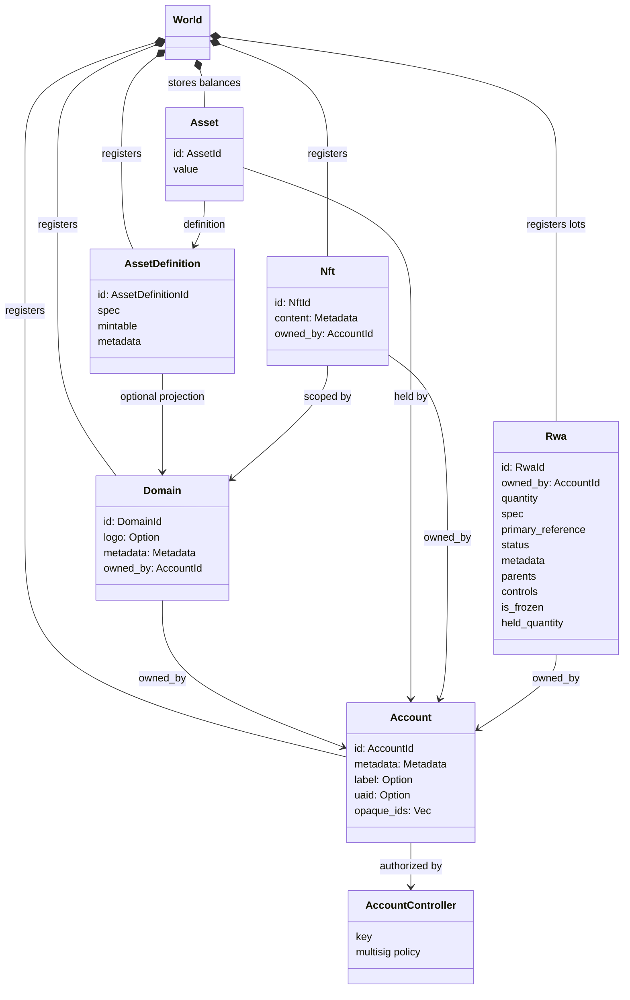
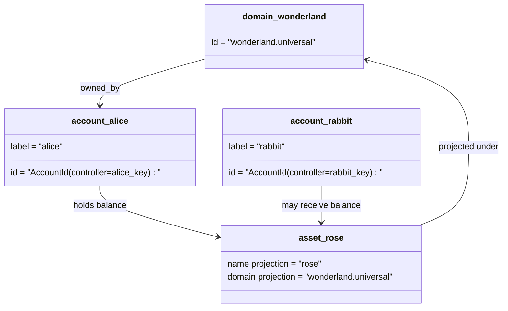

# მონაცემთა მოდელი {#data-model}

Iroha მაღაზიების მთავარ ანგარიშსწორების სახელმწიფო `World`. მისი პირველი გამოშვების მონაცემთა მოდელის გამოყენება
შემდეგი კანონიკური იდენტობები და სუბიექტები:

- დომენები არიან მონაცემთა სივრცე-კვალიფიცირებული, მაგალითად `payments.universal`
- ანგარიშები კანონიკური და დომენის გარეშეა; ანგარიში ID წარმოიშობა
  ანგარიშის კონტროლერი
- აქტივების განსაზღვრები შეიძლება შეინარჩუნოს დომენი/სახელების პროექცია, მაგრამ მათი კანონიკური
  ტექსტური მისამართი არის არაგამჭვირვალე Base58 იდენტიფიკატორი
- აქტივები არის საფონდო ანგარიშები კონკრეტული აქტივების განსაზღვრისთვის
- NFTs არის უნიკალური საკუთრებაში არსებული დომენებით კვალიფიცირებული ჩანაწერები IDs და მეტა მონაცემები
  შინაარსი
- RWAs წარმოიქმნება:ID ნაკრები, რომლებიც წარმოადგენენ აქტივებს, რომლებიც არ შედის ჯაჭვში
  მფლობელი, რაოდენობა, წარმომავლობა, მეტა მონაცემები, შენახვა, გაყინვა და სიცოცხლის ციკლი
  კონტროლი

## მაგალითი {#example}

ერთ-ერთ Iroha 3 ქსელი, `wonderland.universal` არის დომენი შიგნით
`universal` მონაცემთა სივრცე. ამ მაგალითში კანონიკური ანგარიშები კონტროლდება
მათი გასაღები ან პოლიტიკა და კოდირებული, როგორც დომენი I105 ანგარიში IDs. წაკითხული
ეტიკეტები, როგორიცაა `alice@wonderland.universal` არის ცალკეული საიდუმლოები, რომლებიც დაკავშირებულია
IDs. პროგნოზირებული აქტივების განსაზღვრა კვლავ შეიძლება შეიქმნას დომენიდან და
სახელი, როგორიცაა: `rose` დაწვრილებით `wonderland.universal`, ხოლო კანონიკური აქტივი
ტელეფონზე გამოყენებული განსაზღვრის მისამართი არის გენერირებული Base58 მისამართი.

## ბარათები {#aliases}

ალიასები ადამიანის სახის სახელებია, რომლებიც განლაგებულია კანონიკური წიგნის იდენტიფიკატორებზე.
ისინი სასარგებლოა API, CLI, საფულე, და Explorer საზღვრები, მაგრამ კანონიკური
IDs რჩება სტაბილური იდენტიფიკატორები, რომლებიც შენახულია მკაცრი წიგნის ველებში.

| მიზანი         | კანონიკური სამიზნე                                    | ლექსიკონი                                          | მხარდამჭერი მოდელი                                                                 |
| -------------- | --------------------------------------------------- | ------------------------------------------------------ | ----------------------------------------------------------------------------- |
| მომხმარებლის ანგარიში   | დომენების გარეშე `AccountId` კოდირებული როგორც I105 მისამართი   | `name@domain.dataspace` ან `name@dataspace`            | `AccountAlias`; ძირითადი საგნობაა `Account.label`, დამატებითი საიდუმლოები არის ბმული  |
| აქტივების განსაზღვრა | კანონიკური `AssetDefinitionId` Base58 მისამართი     | `name#domain.dataspace` ან `name#dataspace`            | `AssetDefinitionAlias` აქტივების განსაზღვრაზე დაკავებული                           |
| ხელშეკრულება       | კანონიკური Bech32m `ContractAddress`                 | `name::domain.dataspace` ან `name::dataspace`          | `ContractAlias` განთავსებული ხელშეკრულების მისამართზე დაკავებული                          |
| დომენის სახელი    | `DomainId` დაწვრილებით `domain.dataspace` ფორმა               | `domain.dataspace`                                    | SNS `domain` სახელების სივრცის ჩანაწერი                                                 |
| მონაცემთა სივრცის სახელი | ციფრული `DataSpaceId` აქტიური Nexus კატალოგი | მონაცემთა სივრცის ალექსანდრეები, როგორიცაა `universal`, `paynet`, ან `zk` | SNS `dataspace` სახელების სივრცის ჩანაწერი და აქტიური მონაცემთა სივრცე კატალოგი            |

ანგარიშის საყვედური სახელია მომხმარებლისთვის განკუთვნილი ანგარიშის სახელები. ისინი გადარჩებიან ანგარიშზე
რეკეიინგი, რადგან ალექსანდრე მიუთითებს აქტიურ ანგარიშზე ID მსოფლიო სახელმწიფოს საშუალებით
ინდექსები და ანგარიშის რეკეი ჩანაწერები. `SetPrimaryAccountAlias` სამინისტრო
ანგარიშის ძირითადი ეტიკეტი, `SetAccountAliasBinding` დამატებითი არასამთავრობო
ბმულები და `FindAccountByAlias` ან `FindAliasesByAccountId` ჟრანთჟრა.
ანგარიშის ანალიზი ჩვეულებრივ მოითხოვს აქტიურ SNS ანგარიშის ანალოგიური იჯარითი ხელშეკრულება
მქონე `AcquireAccountAliasLease` და განახლებულია `RenewAccountAliasLease`.

აქტივების ანალიზი დასახელებული აქტივების განმარტებები, არა ინდივიდუალური ანგარიშის სალდოები.
ანალიზი და ხელშეკრულების ანალიზი პირდაპირი კავშირებია კითხვადი სახელისგან
არსებული კანონიკური სამიზნე. აქტივების საიდუმლოები განისაზღვრება `SetAssetDefinitionAlias`;
საგულისხმო სახელის სეგმენტი უნდა შეესაბამებოდეს აქტივის განსაზღვრის გამოსახულების სახელს ან
პროგნოზირებული განსაზღვრის სახელწოდება. ხელშეკრულების საიდუმლოები `SetContractAlias`;
ანალოგიური მონაცემთა სივრცე უნდა შეესაბამებოდეს კონტრაქტის მისამართში კოდირებულ მონაცემთა სიფართოს.
ორივე ბმული შეიძლება ატაროს `lease_expiry_ms`; ამოწურვის შემდეგ ისინი შეწყვეტენ რეზოლუციას
როდესაც გრასის ფანჯარა გაივლის და მსოფლიო სახელმწიფოების ინდექსებიდან ამოღებული იქნება.

დომენებს არ აქვთ ცალკე `DomainAlias` ობიექტი. დომენის იდენტიფიკატორი არის
უკვე მონაცემთა სივრცე-კვალიფიცირებული სახელი, როგორიცაა `payments.universal`. SNS კვალი
დომენის სახელების ლიზინგის საკუთრება `domain` სახელების სივრცე და მონაცემთა სივრცისთვის
სათაურები `dataspace` სახელების სივრცე. `universal` მონაცემთა სივრცის ალექსი
უნდა დარჩეს განსაზღვრული.

## დაკავშირებული დოკუმენტები {#related-docs}

| თემა                                  | სად უნდა წავიდე?                                 |
| -------------------------------------- | ------------------------------------------- |
| დომენები                                | [დომენები](/ka/blockchain/domains.md)           |
| ანგარიშები                               | [ანგარიშები](/ka/blockchain/accounts.md)         |
| აქტივები                                 | [აქტივები](/ka/blockchain/assets.md)             |
| NFTs                                   | [NFTs](/ka/blockchain/nfts.md)                 |
| რეალური აქტივები                      | [რეალურ სამყაროში არსებული აქტივები](/ka/blockchain/rwas.md)    |
| მეტა მონაცემები                               | [მეტა მონაცემები](/ka/blockchain/metadata.md)         |
| რეგისტრაციისა და გადაცემის ინსტრუქციები | [ინსტრუქციები](/ka/blockchain/instructions.md) |
| განხორციელების დროის ნებართვები                    | [ნებართვები](/ka/blockchain/permissions.md)   |
| დასახელების წესები                           | [დასახელების წესები](/ka/reference/naming.md)        |
