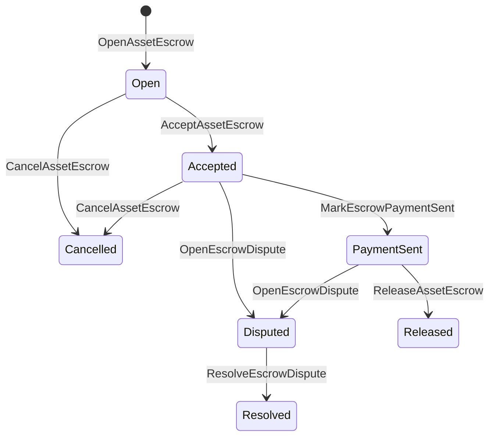

# ადგილობრივი აქტივების ესქრო {#native-asset-escrow}

ადგილობრივი ესქრო რიცხვითი აქტივების შენახვის მექანიზმია, რომელსაც რეესტრი მართავს. აქტივის აპლიკაციის კუთვნილ ანგარიშზე გაგზავნისა და ამ ანგარიშის დაცვაში აპლიკაციის კოდზე დაყრდნობის ნაცვლად, ესქროს ISIs ღირებულებას პროტოკოლის დეტერმინისტულ სადეპოზიტო ანგარიშზე გადააქვს და ესქროს სიცოცხლის ციკლს მსოფლიო მდგომარეობაში აღრიცხავს.

ადგილობრივი ესქრო გამოიყენეთ მარკეტპლეისზე ანგარიშსწორებისთვის, Aitai-ის მსგავსი ქსელგარეშე გადახდის კოორდინაციისთვის, ეტაპობრივი ჩაკეტვებისა და ისეთი დაფარული ესქროს ნაკადებისთვის, რომელთა სიცოცხლის ციკლის მდგომარეობა რეესტრში უნდა ჩანდეს.

## ცნებები {#concepts}

|კონცეფცია |აღწერა |
| --- | --- |
|`EscrowId` |გამომძახებლის მიერ არჩეული იდენტიფიკატორი, რომელიც ჰეშს ფუთავს. ის გამჭვირვალე და ანონიმურ ესქროებს შორის უნიკალური უნდა იყოს. |
|`AssetEscrowRecord` |გამჭვირვალე რიცხვითი აქტივის ესქროს ან ჩაკეტვის ჩანაწერი. |
|`AnonymousAssetEscrowRecord` |ნულიფიკატორებით, ვალდებულებებითა და მტკიცებულების დანართებით გამყარებული დაფარული ესქროს ჩანაწერი. |
|სადეპოზიტო ანგარიში |პროტოკოლის დეტერმინისტული ანგარიში, რომელიც ჯაჭვის ID-ის, ესქროს ID-ისა და აქტივის განსაზღვრისგან მიიღება. |
|მტკიცებულების ჰეშები |ჰეშებით შეიძლება აღინიშნოს ინვოისი, განაჩენი, შეტყობინება, შენახვის მანიფესტი ან სხვა ქსელგარეშე მტკიცებულება. თავად მტკიცებულების დატვირთვა ესქროს ჩანაწერში არ ინახება. |

გამჭვირვალე ჩანაწერი შეიცავს გამყიდველს, არჩევით მყიდველს, აქტივის განსაზღვრას, მთლიან თანხას, სადეპოზიტო ანგარიშს, სიცოცხლის ციკლის მდგომარეობას, ქცევის სახეს, დარჩენილ თანხას, არჩევით გათავისუფლების უფლებამოსილ პირსა და ვადის დროის ნიშნულს, მტკიცებულების ჰეშებს, დროის ნიშნულებს და გადაწყვეტის არჩევით დეტალებს.

ესქროს თანხა რიცხვითი აქტივის დადებითი რაოდენობა უნდა იყოს და აქტივის განსაზღვრის რიცხვით სპეციფიკაციას უნდა შეესაბამებოდეს. სანამ ესქრო ან ჩაკეტვა მოქმედია, აქტივის ჩვეულებრივი გადარიცხვით სადეპოზიტო ანგარიშის დაცლა შეუძლებელია; ამ ანგარიშიდან ღირებულების გასატანად მხოლოდ ქვემოთ აღწერილი ესქროს ISIs გამოიყენება.

## მარკეტპლეისის ესქრო {#marketplace-escrow}

მარკეტპლეისის ესქრო ქსელში აქტივის გათავისუფლებას ქსელგარეშე გადახდის ან მიწოდების პროცესთან აკოორდინირებს.



|ISI |ვინ წარადგენს |ეფექტი |
| --- | --- | --- |
|`OpenAssetEscrow` |გამყიდველი |გამყიდველის რიცხვით აქტივს პროტოკოლის სადეპოზიტო ანგარიშზე კეტავს და მარკეტპლეისის `Open` ჩანაწერს ქმნის. |
|`AcceptAssetEscrow` |მყიდველი |მყიდველს აღრიცხავს და მდგომარეობას `Open`-იდან `Accepted`-ზე ცვლის. გამყიდველი საკუთარ ესქროს ვერ მიიღებს. |
|`MarkEscrowPaymentSent` |მიმღები მყიდველი |მყიდველის მიერ ქსელგარეშე გადახდის გაგზავნის შემდეგ მდგომარეობას `Accepted`-იდან `PaymentSent`-ზე ცვლის. |
|`ReleaseAssetEscrow` |გამყიდველი |მდგომარეობას `PaymentSent`-იდან `Released`-ზე ცვლის და ესქროს მთელ თანხას მყიდველს გადასცემს. |
|`CancelAssetEscrow` |გამყიდველი |გადახდის მონიშვნამდე მდგომარეობას `Open`-იდან ან `Accepted`-იდან `Cancelled`-ზე ცვლის და თანხას გამყიდველს უბრუნებს. |
|`OpenEscrowDispute` |გამყიდველი ან მიმღები მყიდველი |მდგომარეობას `Accepted`-იდან ან `PaymentSent`-იდან `Disputed`-ზე ცვლის და მტკიცებულების ჰეშებს ამატებს. |
|`ResolveEscrowDispute` |ანგარიში `CanResolveEscrowDispute` ნებართვით |მდგომარეობას `Disputed`-იდან `Resolved`-ზე ცვლის და თანხას მყიდველსა და გამყიდველს შორის ანაწილებს. |

დავის გადაწყვეტის თანხები უარყოფითი არ უნდა იყოს და `buyer_amount + seller_amount` ესქროს თანხას უნდა უდრიდეს. ნულოვანი ნაწილები დასაშვებია, თუმცა გაყოფამ მთელი ჩაკეტილი ნაშთი უნდა მოიცვას.

### Rust მაგალითი {#rust-example}

მაგალითი ვარაუდობს, რომ გამყიდველისა და მყიდველის ანგარიშები უკვე არსებობს, აქტივის განსაზღვრა რიცხვით აქტივად არის რეგისტრირებული და გამყიდველს საკმარისი ნაშთი აქვს.

```rust
use iroha::{
    client::Client,
    data_model::{
        isi::escrow::{
            AcceptAssetEscrow, MarkEscrowPaymentSent, OpenAssetEscrow,
            ReleaseAssetEscrow,
        },
        prelude::*,
    },
};
use iroha_crypto::Hash;

fn release_marketplace_escrow(
    seller_client: &Client,
    buyer_client: &Client,
    asset_definition_id: AssetDefinitionId,
) -> eyre::Result<()> {
    let escrow_id = EscrowId::new(Hash::new("docs-marketplace-escrow-001"));

    seller_client.submit_blocking(OpenAssetEscrow::with_evidence_hashes(
        escrow_id,
        asset_definition_id,
        Numeric::from(40_u64),
        vec![Hash::new("invoice:2026-001")],
    ))?;

    buyer_client.submit_blocking(AcceptAssetEscrow::new(escrow_id))?;
    buyer_client.submit_blocking(MarkEscrowPaymentSent::new(escrow_id))?;
    seller_client.submit_blocking(ReleaseAssetEscrow::new(escrow_id))?;

    let record = seller_client.query_single(FindAssetEscrowById::new(escrow_id))?;
    assert_eq!(record.status, AssetEscrowStatus::Released);
    assert_eq!(record.remaining_amount, Numeric::zero());

    Ok(())
}
```

## ზოგადი აქტივების საკეტები {#generic-asset-locks}

აქტივის ჩაკეტვები იმავე ტიპის სადეპოზიტო ჩანაწერს იყენებს, თუმცა მყიდველისა და გამყიდველის შეთავაზებები არ არის. ისინი თანხას დანიშნულების ანგარიშისთვის კეტავს და თანხის გასატანად შეიძლება ცალკე გათავისუფლების უფლებამოსილი პირი მოითხოვოს.

|ISI |ვინ წარადგენს |ეფექტი |
| --- | --- | --- |
|`OpenAssetLock` |წყაროს ანგარიში |დადებით თანხას კეტავს, ჩანაწერში დანიშნულების ანგარიშს მყიდველად უთითებს და მდგომარეობას `Locked`-ზე აყენებს. |
|`DrawdownAssetLock` |გათავისუფლების უფლებამოსილი პირი, ან დანიშნულების ანგარიში, თუ ასეთი პირი მითითებული არ არის |სადეპოზიტო ანგარიშზე დარჩენილი თანხის ნაწილს ან მთლიან თანხას დანიშნულების ანგარიშზე რიცხავს. |
|`CancelAssetLock` |ჩაკეტვის გამხსნელი |მოქმედ ჩაკეტვას აუქმებს და დარჩენილ თანხას გამხსნელს უბრუნებს. |
|`ExpireAssetLock` |საბოლოო ვადის შემდეგ ნებისმიერი ტრანზაქციის უფლებამოსილი ანგარიში |წარსულში დარჩენილი `expires_at_ms`-ის მქონე ჩაკეტვას ვადაგასულად აღნიშნავს და დარჩენილ თანხას გამხსნელს უბრუნებს. |

`DrawdownAssetLock` ჩანაწერს `Locked` მდგომარეობაში ტოვებს, სანამ თანხის ნაწილი რჩება. როდესაც დარჩენილი თანხა ნულს მიაღწევს, მდგომარეობა `DrawnDown` ხდება და ჩანაწერი იხურება.

```rust
use iroha::{
    client::Client,
    data_model::{
        isi::escrow::{CancelAssetLock, DrawdownAssetLock, ExpireAssetLock, OpenAssetLock},
        prelude::*,
    },
};
use iroha_crypto::Hash;

fn drawdown_and_close_asset_locks(
    opener_client: &Client,
    destination_client: &Client,
    release_authority_client: &Client,
    asset_definition_id: AssetDefinitionId,
    destination: AccountId,
    release_authority: AccountId,
) -> eyre::Result<()> {
    let trusted_lock_id = EscrowId::new(Hash::new("docs-asset-lock-trusted"));

    opener_client.submit_blocking(OpenAssetLock::with_options(
        trusted_lock_id,
        asset_definition_id.clone(),
        destination.clone(),
        Numeric::from(40_u64),
        Some(release_authority),
        None,
        vec![Hash::new("milestone-plan-v1")],
    ))?;

    release_authority_client.submit_blocking(DrawdownAssetLock::new(
        trusted_lock_id,
        Numeric::from(15_u64),
    ))?;

    let partially_drawn =
        opener_client.query_single(FindAssetEscrowById::new(trusted_lock_id))?;
    assert_eq!(partially_drawn.status, AssetEscrowStatus::Locked);
    assert_eq!(partially_drawn.remaining_amount, Numeric::from(25_u64));

    opener_client.submit_blocking(CancelAssetLock::new(trusted_lock_id))?;
    let cancelled = opener_client.query_single(FindAssetEscrowById::new(trusted_lock_id))?;
    assert_eq!(cancelled.status, AssetEscrowStatus::Cancelled);

    let expiring_lock_id = EscrowId::new(Hash::new("docs-asset-lock-expiring"));
    opener_client.submit_blocking(OpenAssetLock::with_options(
        expiring_lock_id,
        asset_definition_id,
        destination,
        Numeric::from(10_u64),
        None,
        Some(0),
        Vec::new(),
    ))?;

    destination_client.submit_blocking(ExpireAssetLock::new(expiring_lock_id))?;
    let expired = opener_client.query_single(FindAssetEscrowById::new(expiring_lock_id))?;
    assert_eq!(expired.status, AssetEscrowStatus::Expired);

    Ok(())
}
```

Python ამჟამად ზოგადი ჩაკეტვებისთვის მაღალი დონის დამხმარეებს გვთავაზობს: `open_asset_lock`, `drawdown_asset_lock`, `cancel_asset_lock` და `expire_asset_lock`. Python-იდან მარკეტპლეისის ან ანონიმური ესქროს გამოსაყენებლად კანონიკური `InstructionBox` JSON SDK-ის JSON-ის პირდაპირი წვდომით გადასცით, ან გამოიყენეთ SDK, რომელსაც ესქროს სრულფასოვანი შემქმნელები აქვს.

## დავები {#disputes}

მარკეტპლეისის ესქრო შეიძლება `Accepted` ან `PaymentSent` მდგომარეობიდან სადავო გახდეს. დავის გახსნა მხოლოდ ჩანაწერში მითითებულ გამყიდველს ან მყიდველს შეუძლია. გადაწყვეტისთვის საჭიროა `CanResolveEscrowDispute`, რომელიც გადამწყვეტის ანგარიშს პირდაპირ ან როლის მეშვეობით აქვს მინიჭებული.

```rust
use iroha::{
    client::Client,
    data_model::{
        isi::escrow::{OpenEscrowDispute, ResolveEscrowDispute},
        prelude::*,
    },
};
use iroha_crypto::Hash;
use iroha_executor_data_model::permission::escrow::CanResolveEscrowDispute;

fn resolve_disputed_escrow(
    admin_client: &Client,
    buyer_client: &Client,
    court_client: &Client,
    court: AccountId,
    escrow_id: EscrowId,
) -> eyre::Result<()> {
    admin_client.submit_blocking(Grant::account_permission(
        Permission::from(CanResolveEscrowDispute),
        court,
    ))?;

    buyer_client.submit_blocking(OpenEscrowDispute::with_evidence_hashes(
        escrow_id,
        vec![Hash::new("buyer-payment-receipt")],
    ))?;

    court_client.submit_blocking(ResolveEscrowDispute::with_evidence_hashes(
        escrow_id,
        Numeric::from(30_u64),
        Numeric::from(10_u64),
        vec![Hash::new("court-judgement-001")],
    ))?;

    let record = admin_client.query_single(FindAssetEscrowById::new(escrow_id))?;
    assert_eq!(record.status, AssetEscrowStatus::Resolved);
    assert_eq!(
        record.resolution.as_ref().map(|resolution| resolution.buyer_amount.clone()),
        Some(Numeric::from(30_u64)),
    );

    Ok(())
}
```

## ანონიმური ესქრო {#anonymous-escrow}

ანონიმური ესქრო მარკეტპლეისის იმავე სიცოცხლის ციკლს იყენებს, თუმცა დაფინანსებისა და დახურვისას აქტივის მოძრაობა დაფარულია. საჯარო ჩანაწერში კვლავ ინახება გამყიდველი, მყიდველი, მდგომარეობა, მტკიცებულების ჰეშები, დროის ნიშნულები და მტკიცებულებასთან დაკავშირებული მოძრაობის ჩანაწერები. დაფარულ ჩანაწერებში თანხები და მიმღებები ვალდებულებებით, ნულიფიკატორებითა და მტკიცებულების დანართებით არის წარმოდგენილი.

|გამჭვირვალე ISI |ანონიმური ISI |
| --- | --- |
|`OpenAssetEscrow` |`OpenAnonymousAssetEscrow` |
|`AcceptAssetEscrow` |`AcceptAnonymousAssetEscrow` |
|`MarkEscrowPaymentSent` |`MarkAnonymousEscrowPaymentSent` |
|`ReleaseAssetEscrow` |`ReleaseAnonymousAssetEscrow` |
|`CancelAssetEscrow` |`CancelAnonymousAssetEscrow` |
|`OpenEscrowDispute` |`OpenAnonymousEscrowDispute` |
|`ResolveEscrowDispute` |`ResolveAnonymousEscrowDispute` |

საფულის ან პროვერის ინსტრუმენტმა მტკიცებულების დანართი და საჯარო შეყვანები უნდა შექმნას. გახსნა ესქროს ერთ ვალდებულებას ქმნის. გათავისუფლებამ, გაუქმებამ და ანონიმური დავის გადაწყვეტამ ზუსტად ერთი ესქროს ვალდებულება უნდა დახარჯოს და მოქმედების შესაბამისი მყიდველის, გამყიდველის ან გაყოფილი გამომავალი ვალდებულებები შექმნას.

```rust
use iroha::{
    client::Client,
    data_model::{
        isi::escrow::{
            AcceptAnonymousAssetEscrow, MarkAnonymousEscrowPaymentSent,
            OpenAnonymousAssetEscrow,
        },
        prelude::*,
        proof::ProofAttachment,
    },
};
use iroha_crypto::Hash;

fn open_anonymous_escrow(
    seller_client: &Client,
    buyer_client: &Client,
    escrow_id: EscrowId,
    asset_definition_id: AssetDefinitionId,
    funding_nullifiers: Vec<[u8; 32]>,
    escrow_commitment: [u8; 32],
    proof: ProofAttachment,
    root_hint: Option<[u8; 32]>,
) -> eyre::Result<()> {
    seller_client.submit_blocking(OpenAnonymousAssetEscrow::with_evidence_hashes(
        escrow_id,
        asset_definition_id,
        funding_nullifiers,
        escrow_commitment,
        proof,
        root_hint,
        vec![Hash::new("shielded-invoice")],
    ))?;

    buyer_client.submit_blocking(AcceptAnonymousAssetEscrow::new(escrow_id))?;
    buyer_client.submit_blocking(MarkAnonymousEscrowPaymentSent::new(escrow_id))?;

    Ok(())
}
```

დაფარული ტრანზაქციების ძირითადი მოდელისთვის იხილეთ [ანონიმური ტრანზაქციები](/ka/blockchain/anonymous-transactions.md).

## SDK გამოყენება {#sdk-usage}

დაფარვის მხარდაჭერა განსხვავებულია SDKs. Rust აქვს კანონიკური ტიპირებული მონაცემთა მოდელი. Python ამჟამად გამოხატავს ზოგადი აქტივების ჩაკეტვის დამხმარე საშუალებების. JavaScript და TypeScript იყენებენ Kotodama საფინანსო ფუნქციის ჰოსტ-ინვაკაციებს. Kotlin/JVM და Swift უზრუნველყოფენ ბაზრისთვის ტიპირებულ დატვირთვის მშენებლობას და ანონიმურ საფინანსოს.

|SDK |გამოიყენეთ ეს ზედაპირი.|მოცულობა |
| --- | --- | --- |
|[Rust](#rust-sdk) |`iroha::data_model::isi::escrow` |ბაზარზე დაფინანსება, გენერული საკეტები, ანონიმური დაფინანსებები, მოთხოვნები და მოვლენები. |
|[Python](#python-asset-locks) |`Instruction.open_asset_lock`, `TransactionDraft.open_asset_lock`, და კლიენტის `*_and_wait` დამხმარეები |საბაზრო ბაზარი და ანონიმური საფინანსო დამხმარეები ჯერ არ არიან პირველი კლასის Python მეთოდები |
|[JavaScript / TypeScript](#javascript-and-typescript-kotodama) |`compileKotodamaProgram` დან `@iroha/iroha-js/kotodama-compiler` |Kotodama ხელშეკრულებების ფარგლებში საფინანსო ჰოსტ-ფუნქციის მოწოდებები. |
|[Kotlin / JVM](#kotlin-and-jvm) |`InstructionTemplate` კლასები `org.hyperledger.iroha.sdk.core.model.instructions` |ბაზარი და ანონიმური საფინანსო ინსტრუქციის შაბლონები. |
|[Swift / iOS](#swift-and-ios) |`NativeEscrowInstructionBuilders` და `IrohaSDK.build*Escrow*` დამხმარეები |საბაზრო და ანონიმური ესქროს Norito JSON ინსტრუქციის დატვირთვები. |

ქვემოთ მოცემული მაგალითები ყურადღებას აქცევს ინსტრუქციის კონსტრუქციას. ანგარიშის დაფინანსება, ხელმოწერების მართვა და ტრანზაქციის წარდგენა თითოეული SDK ნორმალური ნაკადის მიხედვით მიმდინარეობს.

### Rust SDK {#rust-sdk}

გამოიყენეთ Rust SDK როდესაც თქვენ გჭირდებათ სრული ადგილობრივი დაფარვა ან მოთხოვნის / მოვლენების მხარდაჭერა. ზემოთ მოცემული მაგალითები აჩვენებს ბაზრის გათავისუფლებას, ზოგად ჩაკეტვას, დავების მოგვარებას და ანონიმურ საფინანსო კონსტრუქციას `iroha::data_model::isi::escrow`.

```rust
use iroha::{
    client::Client,
    data_model::{isi::escrow::OpenAssetEscrow, prelude::*},
};
use iroha_crypto::Hash;

fn open_and_read(
    client: &Client,
    asset_definition_id: AssetDefinitionId,
) -> eyre::Result<AssetEscrowRecord> {
    let escrow_id = EscrowId::new(Hash::new("docs-rust-sdk-escrow"));

    client.submit_blocking(OpenAssetEscrow::new(
        escrow_id,
        asset_definition_id,
        Numeric::from(10_u64),
    ))?;

    client.query_single(FindAssetEscrowById::new(escrow_id))
}
```

### Python აქტივების ჩაკეტვა {#python-asset-locks}

Python SDK გამოყოფს პირველი კლასის დამხმარეებს გენერული აქტივების საკეტებისათვის. გამოიყენეთ ისინი საფეხურის გადახდებისთვის, გათავისუფლების ნებართვის პრინციპით ჩამოტვირთვა, გახსნის მიერ გაუქმება და ვადაგვიანების ანაზღაურებისთვის.

```python
client.open_asset_lock_and_wait(
    chain_id="dev-chain",
    authority="<source-account-id>",
    private_key_hex="<source-private-key-hex>",
    escrow_id="merchant-lock-001",
    asset_definition_id="<asset-definition-base58>",
    destination="<destination-account-id>",
    amount="2500",
    release_authority="<trusted-release-account-id>",
    expires_at_ms=1_704_000_000_000,
)

client.drawdown_asset_lock_and_wait(
    chain_id="dev-chain",
    authority="<trusted-release-account-id>",
    private_key_hex="<trusted-release-private-key-hex>",
    escrow_id="merchant-lock-001",
    amount="1000",
)

client.expire_asset_lock_and_wait(
    chain_id="dev-chain",
    authority="<any-account-id>",
    private_key_hex="<any-private-key-hex>",
    escrow_id="merchant-lock-001",
)
```

ორმხრივი ჩაკეტვის შემთხვევაში გამორიცხეთ `release_authority`; მისამართზე ანგარიშს შემდეგ შეუძლია წარადგინოს `drawdown_asset_lock`.

### JavaScript და TypeScript Kotodama {#javascript-and-typescript-kotodama}

JavaScript SDK ამჟამად არ გამოფენს პირდაპირი ადგილობრივი საფინანსო ტრანზაქციების შემქმნელებს. JavaScript ან TypeScript აპლიკაციებისთვის, რომლებიც განახორციელებენ Kotodama ხელშეკრულებებს, შეადგინეთ საფინანსოს ჰოსტი ფუნქციის ინვოკაციები Kotodama კომპილერში.

ადგილობრივი ესქრო ჰოსტ-ფუნქციის გამოძახებები მოითხოვს მკაფიო წვდომის მინიშნებებს, რადგან კომპილერმა ვერ მიიღოს უფრო ვიწრო წვდომების ნაკრებები არაგამჭვირვალე ესქრო-ისთვის ISIs. ექსპორტირებულ შესასვლელ პუნქტებზე გამოიყენეთ ჯოკერების მინიშნებები, რომლითაც ტექნიკური გამოძახება `escrow_*` აშენებულია.

```js
import { compileKotodamaProgram } from "@iroha/iroha-js/kotodama-compiler";

const source = `
seiyaku MarketplaceEscrow {
  meta { abi_version: 1; }

  #[access(read="*", write="*")]
  kotoage fn run() permission(Admin) {
    let asset = asset_definition("62Fk4FPcMuLvW5QjDGNF2a4jAmjM");
    let offer = name("aitai_offer");
    let evidence = norito_bytes("00");

    call escrow_open_offer(offer, asset, 10, evidence);
    call escrow_accept(offer);
    call escrow_mark_payment_sent(offer);
    call escrow_release(offer);
  }
}
`;

const compiled = compileKotodamaProgram(source, {
  sourceName: "escrow.ko",
});

if (compiled.diagnostics.length > 0) {
  throw new Error(compiled.diagnostics.map((item) => item.message).join("\n"));
}
```

კონფლიქტებისათვის გამოიყენეთ `escrow_open_dispute(offer, evidence)` და `escrow_resolve_dispute(offer, buyer_amount, seller_amount, evidence)`. ანონიმური საპროცენტო ჰოსტი ფუნქციის ინვოკაციები იღებენ Norito მოთხოვნის დატვირთვის ბაიტებს, მაგალითად `anonymous_escrow_open_offer(request)`.

### Kotlin და JVM {#kotlin-and-jvm}

Kotlin/JVM SDK მოდელები მშობლიური ესქრო როგორც მორგებული ინსტრუქციის შაბლონები. თითოეული შაბლონი ადასტურებს საჭირო ველების და ამჟღავნებს კანონიკური არგუმენტების რუკა, რომელიც გამოიყენება ტრანზაქციების მშენებელი.

```kotlin
import org.hyperledger.iroha.sdk.core.model.escrow.NativeEscrowPermissions
import org.hyperledger.iroha.sdk.core.model.instructions.AcceptAssetEscrowInstruction
import org.hyperledger.iroha.sdk.core.model.instructions.MarkEscrowPaymentSentInstruction
import org.hyperledger.iroha.sdk.core.model.instructions.OpenAssetEscrowInstruction
import org.hyperledger.iroha.sdk.core.model.instructions.ReleaseAssetEscrowInstruction
import org.hyperledger.iroha.sdk.core.model.instructions.ResolveEscrowDisputeInstruction

val open = OpenAssetEscrowInstruction(
    escrowId = "escrow-hash",
    assetDefinition = "xor#wonderland",
    amount = "42.5",
    evidenceHashes = listOf("invoice-hash"),
)
val accept = AcceptAssetEscrowInstruction("escrow-hash")
val paid = MarkEscrowPaymentSentInstruction("escrow-hash")
val release = ReleaseAssetEscrowInstruction("escrow-hash")
val resolve = ResolveEscrowDisputeInstruction(
    escrowId = "escrow-hash",
    buyerAmount = "30",
    sellerAmount = "12.5",
    evidenceHashes = listOf("judgement-hash"),
)

println(open.arguments)
println(NativeEscrowPermissions.CAN_RESOLVE_ESCROW_DISPUTE)
```

ანონიმური შაბლონები ხელმისაწვდომია როგორც `OpenAnonymousAssetEscrowInstruction`, `AcceptAnonymousAssetEscrowInstruction`, `MarkAnonymousEscrowPaymentSentInstruction`, `ReleaseAnonymousAssetEscrowInstruction`, `CancelAnonymousAssetEscrowInstruction`, `OpenAnonymousEscrowDisputeInstruction`, და `ResolveAnonymousEscrowDisputeInstruction`. Android Java- ს მოთხოვნის კლიენტებს შეუსაბამობა შეუძლია გამოიყენოს `NativeEscrowInstructions.*` მშენებლები Android არტეფაქტი.

### Swift და iOS {#swift-and-ios}

Swift SDK აგებს დაფარვის ინსტრუქციას, როგორც Norito JSON დატვირთვები. გამოიყენეთ `NativeEscrowInstructionBuilders` პირდაპირ ან მოიხსენიეთ ექვივალენტი `IrohaSDK.build*Escrow*` დამხმარე, როდესაც თქვენი აპლიკაცია უკვე ფლობს `IrohaSDK` ინსტენსიას .

```swift
import IrohaSwift

let open = try NativeEscrowInstructionBuilders.openAssetEscrow(
    escrowId: "escrow-hash",
    assetDefinition: "xor#wonderland",
    amount: "42.5",
    evidenceHashes: ["invoice-hash"]
)
let accept = try NativeEscrowInstructionBuilders.acceptAssetEscrow(
    escrowId: "escrow-hash"
)
let paid = try NativeEscrowInstructionBuilders.markEscrowPaymentSent(
    escrowId: "escrow-hash"
)
let release = try NativeEscrowInstructionBuilders.releaseAssetEscrow(
    escrowId: "escrow-hash"
)
let resolve = try NativeEscrowInstructionBuilders.resolveEscrowDispute(
    escrowId: "escrow-hash",
    buyerAmount: "30",
    sellerAmount: "12.5",
    evidenceHashes: ["judgement-hash"]
)
```

ანონიმური Swift მშენებლები იღებენ ნულიფიკატორის სიებს, გამოსაშვებ კრიპტოგრაფიულ ვალდებულების ღირებულებათა სიებს, დამტკიცების ლექსიკონს და ვარიანტული `rootHint` მნიშვნელობებს. დავების გადაწყვეტის ნებართვის ტოკი ხელმისაწვდომია როგორც `NativeEscrowPermissions.canResolveEscrowDispute`.

## კითხვები და მოვლენები {#queries-and-events}

გამოიყენეთ სტატუსის გვერდების, შერიგების სამუშაოებისა და მხარდაჭერის ინსტრუმენტების სესროვო შეკითხვები:

|კითხვა |მიზანი |
| --- | --- |
|`FindAssetEscrowById` |წაიკითხეთ ერთი გამჭვირვალე საფინანსო ან საკეტი `EscrowId`. |
|`FindAssetEscrows` |შეაწერეთ გამჭვირვალე საფინანსო და საკეტო ჩანაწერები. |
|`FindAssetEscrowsBySeller` |ჩამოთვალეთ რეკორდები, რომლებიც გაიხსნა გამყიდველის ან საკეტი გახსნის მიერ. |
|`FindAssetEscrowsByBuyer` |ჩამონათვალი ბაზრის მიერ მიღებული საფინანსო ან საკეტი მყიდველის მიერ დანიშნულების მიზნით. |
|`FindAssetEscrowsByStatus` |სიაში ჩანაწერები `AssetEscrowStatus`.|
|`FindAnonymousAssetEscrowById` |წაკითხეთ ერთი ანონიმური საფინანსო ფასი `EscrowId`. |
|`FindAnonymousAssetEscrows*` |დაასახელეთ ანონიმური სესორები ყველა ჩანაწერით, გამყიდველის, მყიდველის ან სტატუსის მიხედვით. |

`EscrowEventFilter` შეუძლია დარეგისტრირდეს გამჭვირვალე ადგილობრივი საფინანსო და საკეტო ღონისძიებებზე საფინანსოდ ID-ით; გამყიდველი, მყიდველი, სტატუსი და ღონისძიების შედგენის ნიღაბი. ღონისძიებების ოჯახში შედის `Opened`, `Accepted`, `PaymentSent`, `Released`, `Cancelled`, `Expired`, `Disputed`, და `Resolved`. ანონიმური ესქროები ინსპექტირდება ანონიმურ საფინანსოს კითხვებზე.

## საოპერაციო შენიშვნები {#operational-notes}

- შეინახეთ დიდი ინვოები, ჩატის ლოგები, განაჩენები ან აუდიტის ბუნდები ესქროს გარეთ და დაამატეთ მათი კრიპტოგრაფიული ჰეშები მტკიცებულებად.
- გამოყენება სტაბილური `EscrowId` წარმობმულობა განაცხადებში, ასე რომ განმეორებითი მცდელობები არ შეიძლება შექმნას დუბლირებული ესქრო ერთი და იგივე შეთავაზების.
- გაცემა `CanResolveEscrowDispute` მხოლოდ ანგარიშებზე ან როლებზე, რომლებიც ოპერირებენ სადავო პროცესს.
- შეამოწმეთ გადახდის გარეთ ქსელის შემოწმება როგორც განაცხადის პოლიტიკა. Iroha რეგისტრირებს მფარველობისა და სიცოცხლის ციკლის გადასვლას; იგი თვითონ არ ამოწმებს საფინანსო ან გარე გადახდის ბილიკებს.
