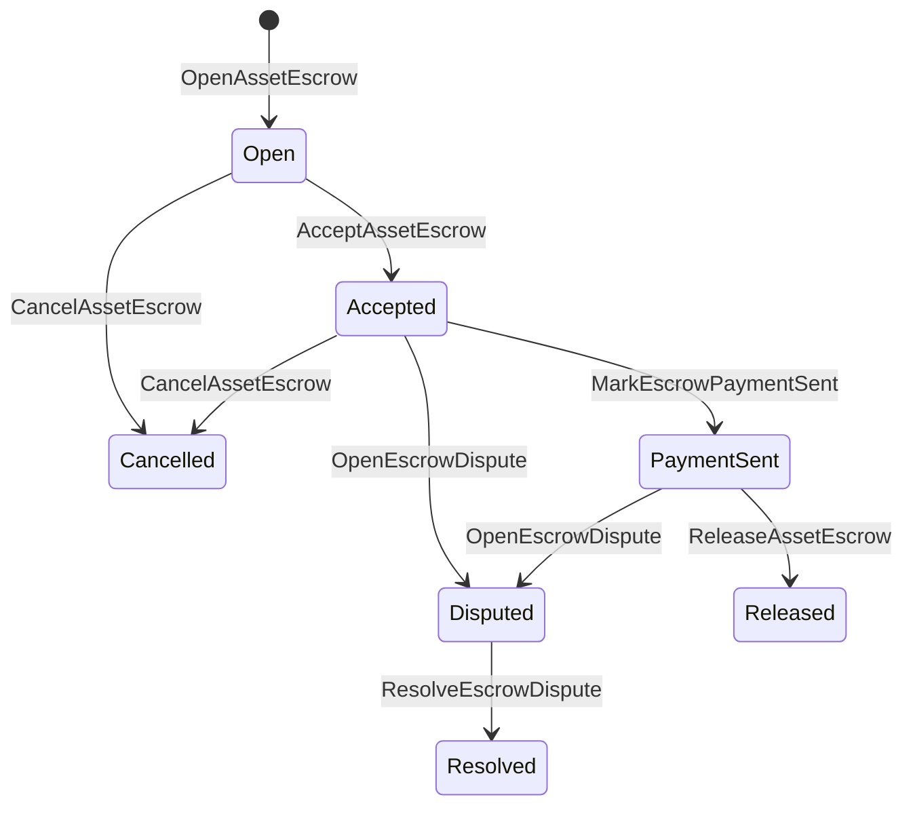

# ნაციონალური აქტივების დაფარვა {#native-asset-escrow}

Native escrow არის ლიდერული მართვის მექანიზმი ციფრული აქტივების შესანახად. იმის ნაცვლად, რომ აქტივები გადაიგზავნოს აპლიკაციის საკუთრებაში არსებულ ანგარიშზე და დაეყრდნობა განაცხადის კოდზე ამ ანგარიშის დასაცავად, ესროვი ISIs გადაიტანს ღირებულებას დეტერმინისტულ პროტოკოლზე მფლობელობის ანგარიშში და რეგისტრირებს ესროვის სიცოცხლის ციკლს მსოფლიო მდგომარეობით.

გამოიყენეთ ადგილობრივი დაფარვა საბაზრო ანგარიშსწორებისთვის, Aitai-style off-chain გადახდის კოორდინაცია, მილის ქვის საკეტები და დაცული დაფარვის სამუშაო პროცესები, რომ საჭიროებს ლიდერში ხილული სიცოცხლის ციკლის მდგომარეობა.

## კონცეფცია {#concepts}

|კონცეფცია |აღწერა |
| --- | --- |
|`EscrowId` |დამრეკლის მიერ შერჩეული იდენტიფიკატორი, რომელიც ჰეშის შემადგენლობაშია. ის უნდა იყოს უნიკალური გამჭვირვალე და ანონიმური საფარდებლებში. |
|`AssetEscrowRecord` |გამჭვირვალე ციფრული აქტივების საფინანსო ან საკეტო რეკორდი. |
|`AnonymousAssetEscrowRecord` |დაცული საფინანსო ანგარიშები, დამტკიცებული ბათილებლებით, ვალდებულებებით და მტკიცებულებების თანხებით. |
|სათავსო ანგარიში |დეტერმინისტური პროტოკოლის ანგარიში, რომელიც წარმოიშვა ჯაჭვი ID, საფინანსო დავალიანება ID და აქტივების განსაზღვრა. |
|მტკიცებულებების ჰეშეჟი |მტკიცებულებების ჰეშებს შეუძლიათ იდენტიფიცირონ ანგარიშები, განაჩენები, შეტყობინებები, შენახვის მანიფესტები ან სხვა off-chain მტკიცებულებები. მტკიცებულების სასარგებლო ტვირთი თავად არ არის შენახული escrow ჩანაწერში. |

გამჭვირვალე ჩანაწერები მოიცავს გამყიდველს, ვარიანტულ მყიდველსა, აქტივების განსაზღვრას, საერთო თანხას, შენახვის ანგარიშს, სიცოცხლის ციკლის სტატუსს, ქცევების სახეს, დარჩენილ თანხებს, ავტორიზაციას, ვაკანსიურ ვადაზე ვადაზე გათავისუფლებას, მტკიცებულებების ჰეშებს, ვადაზე და ვარიანტის გადაწყვეტის დეტალებზე.

დაფარვის თანხები უნდა იყოს პოზიტიური ციფრული აქტივების რაოდენობა და უნდა შეესაბამებოდეს აქტივების განსაზღვრის ციფრულ სპეციფიკაციას. სანამ დაფარვა ან ჩაკეტვა აქტიურია, ზოგადი აქტივების გადარიცხვები არ შეიძლება გათავისუფლდეს სათავსო ანგარიშისგან; სათავსოს გამოსვლის გზები არის ქვემოთ აღწერილი დაფარება ISIs.

## საბაზრო საფინანსო დაფარვა {#marketplace-escrow}

Marketplace escrow-ი კოორდინირებს აქტივების გათავისუფლებას ქსელზე გადახდის ან მიწოდების სამუშაო პროცესის გარეშე.



|ISI |კჲი დჲ ოპვრთნა.|ეფექტი |
| --- | --- | --- |
|`OpenAssetEscrow` |გამყიდველი |ჩაკეტავს გამყიდველის ციფრული აქტივი პროტოკოლის დაცვაში და ქმნის `Open` ბაზრის რეკორდს. |
|`AcceptAssetEscrow` |მყიდველი |რეგისტრაცია მყიდველს და გადაადგილება `Open` to `Accepted`. გამყიდველი არ შეიძლება მიიღოს საკუთარი საფინანსო |
|`MarkEscrowPaymentSent` |მიღებული მყიდველი |გადაადგილება `Accepted` `PaymentSent` მას შემდეგ, რაც მყიდველი გამოგზავნის გადახდას გარეთ ჯაჭვი. |
|`ReleaseAssetEscrow` |გამყიდველი |გადაადგილება `PaymentSent` `Released` და გადაცემა მთლიანი escrowed თანხა მყიდველს. |
|`CancelAssetEscrow` |გამყიდველი |გადაადგილება `Open` ან `Accepted` `Cancelled` და დაბრუნება გამყიდველს, სანამ გადახდა აღნიშნულია. |
|`OpenEscrowDispute` |გამყიდველი ან მიღებული მყიდველი |გადადის `Accepted` ან `PaymentSent` `Disputed` და ამატებს მტკიცებულებების ჰეშებს. |
|`ResolveEscrowDispute` |ანგარიში `CanResolveEscrowDispute` |გადადის `Disputed` `Resolved` და განაწილებს თანხას მყიდველსა და გამყიდველს შორის. |

სადავო გადაწყვეტილების თანხები არ უნდა იყოს უარყოფითი და `buyer_amount + seller_amount` უნდა შეესაბამებოდეს საფარდობო თანხას. ნულოვანი ფირფიტები დასაშვებია, მაგრამ მთლიანი გაყოფა უნდა ითვალისწინებდეს ჩაკეტილ ბალანსს.

### Rust მაგალითი {#rust-example}

ამ მაგალითში ვარაუდობენ, რომ გამყიდველისა და მყიდველის ანგარიშები უკვე არსებობს, აქტივების განსაზღვრა ციფრულად არის რეგისტრირებული და გამყიდველს საკმარისი ბალანსი აქვს.

```rust
use iroha::{
    client::Client,
    data_model::{
        isi::escrow::{
            AcceptAssetEscrow, MarkEscrowPaymentSent, OpenAssetEscrow,
            ReleaseAssetEscrow,
        },
        prelude::*,
    },
};
use iroha_crypto::Hash;

fn release_marketplace_escrow(
    seller_client: &Client,
    buyer_client: &Client,
    asset_definition_id: AssetDefinitionId,
) -> eyre::Result<()> {
    let escrow_id = EscrowId::new(Hash::new("docs-marketplace-escrow-001"));

    seller_client.submit_blocking(OpenAssetEscrow::with_evidence_hashes(
        escrow_id,
        asset_definition_id,
        Numeric::from(40_u64),
        vec![Hash::new("invoice:2026-001")],
    ))?;

    buyer_client.submit_blocking(AcceptAssetEscrow::new(escrow_id))?;
    buyer_client.submit_blocking(MarkEscrowPaymentSent::new(escrow_id))?;
    seller_client.submit_blocking(ReleaseAssetEscrow::new(escrow_id))?;

    let record = seller_client.query_single(FindAssetEscrowById::new(escrow_id))?;
    assert_eq!(record.status, AssetEscrowStatus::Released);
    assert_eq!(record.remaining_amount, Numeric::zero());

    Ok(())
}
```

## ზოგადი აქტივების საკეტები {#generic-asset-locks}

აქტივების საკეტები იყენებენ იმავე ტიპის მფარველობის ჩანაწერებს, მაგრამ ისინი არ არიან მყიდველი-გაყიდვის შემოთავაზებები. ისინი იკეტებიან თანხებს დანიშნულების ანგარიშისთვის და ვარიანტულად საჭიროა ცალკე გათავისუფლების ორგანო ფონდების გასატანად .

|ISI |კჲი დჲ ოპვრთნა.|ეფექტი |
| --- | --- | --- |
|`OpenAssetLock` |წყარო ანგარიში |დადებითი თანხის ჩაკეტვა, რეკორდების მყიდველად აღრიცხვა და სტატუსის `Locked` დაყენება. |
|`DrawdownAssetLock` |გათავისუფლების ორგანო ან დანიშნულების ადგილი, როდესაც არ არის განსაზღვრული გათავისუფლება ორგანო |გადაადგილება ნაწილობრივ ან მთლიანად დარჩენილი მზრუნველობის მიმართულებით. |
|`CancelAssetLock` |ლოქის გახსნა |გააუქმებს აქტიურ საკეტს და ანაზღაურებს დარჩენილ თანხას გახსნისათვის. |
|`ExpireAssetLock` |ნებისმიერი ოპერაციული ორგანო ვადა გასვლის შემდეგ |ამოიწურება წარსულში `expires_at_ms` მქონე ჩაკეტვა და დარჩენილი თანხა ანაზღაურდება გახსნისათვის. |

`DrawdownAssetLock` ინახავს ჩანაწერს `Locked`-ში, სანამ გარკვეული თანხა რჩება. როდესაც დარჩენილი თანხა ნულეს მიაღწევს, სტატუსი ხდება `DrawnDown` და ჩანაწერი იკეტება.

```rust
use iroha::{
    client::Client,
    data_model::{
        isi::escrow::{CancelAssetLock, DrawdownAssetLock, ExpireAssetLock, OpenAssetLock},
        prelude::*,
    },
};
use iroha_crypto::Hash;

fn drawdown_and_close_asset_locks(
    opener_client: &Client,
    destination_client: &Client,
    release_authority_client: &Client,
    asset_definition_id: AssetDefinitionId,
    destination: AccountId,
    release_authority: AccountId,
) -> eyre::Result<()> {
    let trusted_lock_id = EscrowId::new(Hash::new("docs-asset-lock-trusted"));

    opener_client.submit_blocking(OpenAssetLock::with_options(
        trusted_lock_id,
        asset_definition_id.clone(),
        destination.clone(),
        Numeric::from(40_u64),
        Some(release_authority),
        None,
        vec![Hash::new("milestone-plan-v1")],
    ))?;

    release_authority_client.submit_blocking(DrawdownAssetLock::new(
        trusted_lock_id,
        Numeric::from(15_u64),
    ))?;

    let partially_drawn =
        opener_client.query_single(FindAssetEscrowById::new(trusted_lock_id))?;
    assert_eq!(partially_drawn.status, AssetEscrowStatus::Locked);
    assert_eq!(partially_drawn.remaining_amount, Numeric::from(25_u64));

    opener_client.submit_blocking(CancelAssetLock::new(trusted_lock_id))?;
    let cancelled = opener_client.query_single(FindAssetEscrowById::new(trusted_lock_id))?;
    assert_eq!(cancelled.status, AssetEscrowStatus::Cancelled);

    let expiring_lock_id = EscrowId::new(Hash::new("docs-asset-lock-expiring"));
    opener_client.submit_blocking(OpenAssetLock::with_options(
        expiring_lock_id,
        asset_definition_id,
        destination,
        Numeric::from(10_u64),
        None,
        Some(0),
        Vec::new(),
    ))?;

    destination_client.submit_blocking(ExpireAssetLock::new(expiring_lock_id))?;
    let expired = opener_client.query_single(FindAssetEscrowById::new(expiring_lock_id))?;
    assert_eq!(expired.status, AssetEscrowStatus::Expired);

    Ok(())
}
```

Python ამჟამად გამოხატავს მაღალ დონეზე დამხმარე ჯენერიკული საკეტებისათვის: `open_asset_lock`, `drawdown_asset_lock`, `cancel_asset_lock` და `expire_asset_lock`. ბაზარზე და ანონიმური საფინანსო ობიექტებისთვის Python, გამოიყენეთ კანონიკური `InstructionBox` JSON SDK-ის JSON გაქცევის ღრუში, ან წარუდგინეთ SDK -ის მეშვეობით, რომელიც გამოავლინებს პირველი კლასის საფინანსო მშენებლებს.

## დავები {#disputes}

საბაზრო საფარდულო პირს შეუძლია შეუშვას დავა `Accepted` ან `PaymentSent`. მხოლოდ რეგისტრირებულმა გამყიდველმა ან მყიდველმა შეიძლება გახსნას დავა. გადაწყვეტა მოითხოვს `CanResolveEscrowDispute`, ან გადაცემა უშუალოდ გადამწყვეტის ანგარიშზე, ან როლით მიემკვიდრეობა .

```rust
use iroha::{
    client::Client,
    data_model::{
        isi::escrow::{OpenEscrowDispute, ResolveEscrowDispute},
        prelude::*,
    },
};
use iroha_crypto::Hash;
use iroha_executor_data_model::permission::escrow::CanResolveEscrowDispute;

fn resolve_disputed_escrow(
    admin_client: &Client,
    buyer_client: &Client,
    court_client: &Client,
    court: AccountId,
    escrow_id: EscrowId,
) -> eyre::Result<()> {
    admin_client.submit_blocking(Grant::account_permission(
        Permission::from(CanResolveEscrowDispute),
        court,
    ))?;

    buyer_client.submit_blocking(OpenEscrowDispute::with_evidence_hashes(
        escrow_id,
        vec![Hash::new("buyer-payment-receipt")],
    ))?;

    court_client.submit_blocking(ResolveEscrowDispute::with_evidence_hashes(
        escrow_id,
        Numeric::from(30_u64),
        Numeric::from(10_u64),
        vec![Hash::new("court-judgement-001")],
    ))?;

    let record = admin_client.query_single(FindAssetEscrowById::new(escrow_id))?;
    assert_eq!(record.status, AssetEscrowStatus::Resolved);
    assert_eq!(
        record.resolution.as_ref().map(|resolution| resolution.buyer_amount.clone()),
        Some(Numeric::from(30_u64)),
    );

    Ok(())
}
```

## ანონიმური საფინანსო გადასახადი {#anonymous-escrow}

ანონიმური საფინანსო ფასი იმავე ბაზრის სიცოცხლის ციკლს იყენებს, მაგრამ დაფინანსება და დახურვის აქტივების მოძრაობა დაცულია. საჯარო რეკორდი კვლავ ინახავს გამყიდველს, მყიდველს,... მტკიცებულებების ჰეშები, დროის შტამპები და მტკიცებულებებთან დაკავშირებული მოძრაობის ჩანაწერები. ფარდოვანი ნოტების შიგნით არსებული თანხები და მიმღები წარმოდგენილია ვალდებულებებით, ბათილებლებითა და მტკიცებულებათა დანართებით.

|გამჭვირვალე ISI |ანონიმური ISI |
| --- | --- |
|`OpenAssetEscrow` |`OpenAnonymousAssetEscrow` |
|`AcceptAssetEscrow` |`AcceptAnonymousAssetEscrow` |
|`MarkEscrowPaymentSent` |`MarkAnonymousEscrowPaymentSent` |
|`ReleaseAssetEscrow` |`ReleaseAnonymousAssetEscrow` |
|`CancelAssetEscrow` |`CancelAnonymousAssetEscrow` |
|`OpenEscrowDispute` |`OpenAnonymousEscrowDispute` |
|`ResolveEscrowDispute` |`ResolveAnonymousEscrowDispute` |

საფულე ან პროვერის ინსტრუმენტებმა უნდა შექმნან მტკიცებულების დამაგრება და საჯარო შესატყვისები. გახსნა ქმნის ერთ ეკლოსო ვალდებულებას. გათავისუფლება, გაუქმება და ანონიმური დავების მოგვარება უნდა დაიხარჯოს ზუსტად ერთი ეკლოსი ვალდებულება და შეიქმნას მყიდველი, გამყიდველი ან განცალკევებული გამოსავალი ვალდებულებები, რომელიც მოითხოვს ქმედება.

```rust
use iroha::{
    client::Client,
    data_model::{
        isi::escrow::{
            AcceptAnonymousAssetEscrow, MarkAnonymousEscrowPaymentSent,
            OpenAnonymousAssetEscrow,
        },
        prelude::*,
        proof::ProofAttachment,
    },
};
use iroha_crypto::Hash;

fn open_anonymous_escrow(
    seller_client: &Client,
    buyer_client: &Client,
    escrow_id: EscrowId,
    asset_definition_id: AssetDefinitionId,
    funding_nullifiers: Vec<[u8; 32]>,
    escrow_commitment: [u8; 32],
    proof: ProofAttachment,
    root_hint: Option<[u8; 32]>,
) -> eyre::Result<()> {
    seller_client.submit_blocking(OpenAnonymousAssetEscrow::with_evidence_hashes(
        escrow_id,
        asset_definition_id,
        funding_nullifiers,
        escrow_commitment,
        proof,
        root_hint,
        vec![Hash::new("shielded-invoice")],
    ))?;

    buyer_client.submit_blocking(AcceptAnonymousAssetEscrow::new(escrow_id))?;
    buyer_client.submit_blocking(MarkAnonymousEscrowPaymentSent::new(escrow_id))?;

    Ok(())
}
```

ძირითადი დაცული ოპერაციების მოდელის შესახებ იხილეთ [ანონიმური ოპერაციები](/ka/blockchain/anonymous-transactions.md).

## SDK გამოყენება {#sdk-usage}

დაფარვის მხარდაჭერა განსხვავებულია SDKs. Rust აქვს კანონიკური ტიპირებული მონაცემთა მოდელი. Python ამჟამად გამოხატავს აქტივების ჩაკეტვის ზოგადი დამხმარე საშუალებებს. JavaScript და TypeScript იყენებენ Kotodama საფინანსო მასპინძლის ზარებს. Kotlin/JVM და Swift უზრუნველყოფენ ბაზრისთვის და ანონიმური საფინანსოსთვის ტიპირებულ სასარგებლო ტვირთების მშენებლებს.

|SDK |გამოიყენეთ ეს ზედაპირი.|მოცულობა |
| --- | --- | --- |
| [Rust](#rust-sdk) |`iroha::data_model::isi::escrow` |ბაზარზე დაფინანსება, გენერული საკეტები, ანონიმური დაფინანსებები, გამოკითხვები და მოვლენები. |
| [Python](#python-asset-locks) |`Instruction.open_asset_lock`, `TransactionDraft.open_asset_lock`, და კლიენტის `*_and_wait` დამხმარეები |საბაზრო ბაზარი და ანონიმური საფინანსო დამხმარეები ჯერ არ არიან პირველი კლასის Python მეთოდები |
| [JavaScript / TypeScript](#javascript-and-typescript-kotodama) |`compileKotodamaProgram` დან `@iroha/iroha-js/kotodama-compiler` |Kotodama ხელშეკრულებების ფარგლებში გადახდის მასპინძლის ზარები. |
| [Kotlin / JVM](#kotlin-and-jvm) |`InstructionTemplate` კლასები `org.hyperledger.iroha.sdk.core.model.instructions` |ბაზარი და ანონიმური საფინანსო ინსტრუქციის შაბლონები. |
| [Swift / iOS](#swift-and-ios) |`NativeEscrowInstructionBuilders` და `IrohaSDK.build*Escrow*` დამხმარეები |საბაზრო და ანონიმური საფარდნო Norito JSON ინსტრუქციის სასარგებლო ტვირთები. |

ქვემოთ მოცემული მაგალითები ყურადღებას აქცევს ინსტრუქციის კონსტრუქციას. ანგარიშის დაფინანსება, ხელმოწერების მართვა და ტრანზაქციის წარდგენა თითოეული SDK ნორმალური ნაკადის მიხედვით მიმდინარეობს.

### Rust SDK {#rust-sdk}

გამოიყენეთ Rust SDK როდესაც თქვენ გჭირდებათ სრული ადგილობრივი დაფარვა ან გამოკითხვის / მოვლენების მხარდაჭერა. ზემოთ მოცემული მაგალითები აჩვენებს ბაზრის გათავისუფლებას, ზოგად ჩაკეტვას, დავების მოგვარებას და ანონიმურ საფინანსო კონსტრუქციას `iroha::data_model::isi::escrow`.

```rust
use iroha::{
    client::Client,
    data_model::{isi::escrow::OpenAssetEscrow, prelude::*},
};
use iroha_crypto::Hash;

fn open_and_read(
    client: &Client,
    asset_definition_id: AssetDefinitionId,
) -> eyre::Result<AssetEscrowRecord> {
    let escrow_id = EscrowId::new(Hash::new("docs-rust-sdk-escrow"));

    client.submit_blocking(OpenAssetEscrow::new(
        escrow_id,
        asset_definition_id,
        Numeric::from(10_u64),
    ))?;

    client.query_single(FindAssetEscrowById::new(escrow_id))
}
```

### Python აქტივების ჩაკეტვა {#python-asset-locks}

Python SDK გამოყოფს პირველი კლასის დამხმარეებს გენერული აქტივების ლოკებისათვის. გამოიყენეთ ისინი სათარიღო გადახდებისთვის, გათავისუფლების ორგანოს მიერ მოხსნისთვის, გახსნილის მიერ გაუქმებისა და ვადის ამოწურვისთანავე დაბრუნებისთვის.

```python
client.open_asset_lock_and_wait(
    chain_id="dev-chain",
    authority="<source-account-id>",
    private_key_hex="<source-private-key-hex>",
    escrow_id="merchant-lock-001",
    asset_definition_id="<asset-definition-base58>",
    destination="<destination-account-id>",
    amount="2500",
    release_authority="<trusted-release-account-id>",
    expires_at_ms=1_704_000_000_000,
)

client.drawdown_asset_lock_and_wait(
    chain_id="dev-chain",
    authority="<trusted-release-account-id>",
    private_key_hex="<trusted-release-private-key-hex>",
    escrow_id="merchant-lock-001",
    amount="1000",
)

client.expire_asset_lock_and_wait(
    chain_id="dev-chain",
    authority="<any-account-id>",
    private_key_hex="<any-private-key-hex>",
    escrow_id="merchant-lock-001",
)
```

ორმხრივი ჩაკეტვის შემთხვევაში გამორიცხეთ `release_authority`; მისამართზე ანგარიშს შემდეგ შეუძლია წარადგინოს `drawdown_asset_lock`.

### JavaScript და TypeScript Kotodama {#javascript-and-typescript-kotodama}

JavaScript SDK ამჟამად არ გამოფენს პირდაპირი ადგილობრივი საფინანსო ტრანზაქციების შემქმნელებს. JavaScript ან TypeScript აპლიკაციებისთვის, რომლებიც იყენებენ Kotodama ხელშეკრულებებს, შეადგინეთ საფინანსოს მასპინძელი მოწოდებები Kotodama კომპილერით.

Native escrow host calls require explicit access hints because the compiler cannot derive narrower access sets for opaque escrow ISIs. გამოიყენეთ საფრენი ბარათის მინიშნებები ექსპორტირებულ შესასვლელ პუნქტებზე, რომლებიც ეძახიან `escrow_*` ჩაშენებულებს.

```js
import { compileKotodamaProgram } from "@iroha/iroha-js/kotodama-compiler";

const source = `
seiyaku MarketplaceEscrow {
  meta { abi_version: 1; }

  #[access(read="*", write="*")]
  kotoage fn run() permission(Admin) {
    let asset = asset_definition("62Fk4FPcMuLvW5QjDGNF2a4jAmjM");
    let offer = name("aitai_offer");
    let evidence = norito_bytes("00");

    call escrow_open_offer(offer, asset, 10, evidence);
    call escrow_accept(offer);
    call escrow_mark_payment_sent(offer);
    call escrow_release(offer);
  }
}
`;

const compiled = compileKotodamaProgram(source, {
  sourceName: "escrow.ko",
});

if (compiled.diagnostics.length > 0) {
  throw new Error(compiled.diagnostics.map((item) => item.message).join("\n"));
}
```

კონფლიქტებისათვის გამოიყენეთ `escrow_open_dispute(offer, evidence)` და `escrow_resolve_dispute(offer, buyer_amount, seller_amount, evidence)`. ანონიმური სალარო მასპინძელი ზარები იღებენ Norito მოთხოვნის სასარგებლო ტვირთის ბაიტებს, მაგალითად, `anonymous_escrow_open_offer(request)`.

### Kotlin და JVM {#kotlin-and-jvm}

Kotlin/JVM SDK მოდელები მშობლიური escrow როგორც მორგებული ინსტრუქციის შაბლონები. თითოეული შაბლონი ადასტურებს საჭირო ველები და გამოხატავს კანონიკური არგუმენტების რუკა, რომელიც გამოიყენება ტრანზაქციების მშენებელი.

```kotlin
import org.hyperledger.iroha.sdk.core.model.escrow.NativeEscrowPermissions
import org.hyperledger.iroha.sdk.core.model.instructions.AcceptAssetEscrowInstruction
import org.hyperledger.iroha.sdk.core.model.instructions.MarkEscrowPaymentSentInstruction
import org.hyperledger.iroha.sdk.core.model.instructions.OpenAssetEscrowInstruction
import org.hyperledger.iroha.sdk.core.model.instructions.ReleaseAssetEscrowInstruction
import org.hyperledger.iroha.sdk.core.model.instructions.ResolveEscrowDisputeInstruction

val open = OpenAssetEscrowInstruction(
    escrowId = "escrow-hash",
    assetDefinition = "xor#wonderland",
    amount = "42.5",
    evidenceHashes = listOf("invoice-hash"),
)
val accept = AcceptAssetEscrowInstruction("escrow-hash")
val paid = MarkEscrowPaymentSentInstruction("escrow-hash")
val release = ReleaseAssetEscrowInstruction("escrow-hash")
val resolve = ResolveEscrowDisputeInstruction(
    escrowId = "escrow-hash",
    buyerAmount = "30",
    sellerAmount = "12.5",
    evidenceHashes = listOf("judgement-hash"),
)

println(open.arguments)
println(NativeEscrowPermissions.CAN_RESOLVE_ESCROW_DISPUTE)
```

ანონიმური შაბლონები ხელმისაწვდომია როგორც `OpenAnonymousAssetEscrowInstruction`, `AcceptAnonymousAssetEscrowInstruction`, `MarkAnonymousEscrowPaymentSentInstruction`, `ReleaseAnonymousAssetEscrowInstruction`, `CancelAnonymousAssetEscrowInstruction`, `OpenAnonymousEscrowDisputeInstruction`, და `ResolveAnonymousEscrowDisputeInstruction`. Android ჯავას დამრეკველებს შეუსაბამობა შეუძლიათ გამოიყენონ `NativeEscrowInstructions.*` მშენებლები Android არტეფაქტი.

### Swift და iOS {#swift-and-ios}

Swift SDK აგებს დაფარვის ინსტრუქციას, როგორც Norito JSON სასარგებლო ტვირთები. გამოიყენეთ `NativeEscrowInstructionBuilders` პირდაპირ ან დაუკავშირდით ექვივალენტს `IrohaSDK.build*Escrow*` დახმარებას, როდესაც თქვენს აპლიკაციაში უკვე არის `IrohaSDK` ინსტენცია.

```swift
import IrohaSwift

let open = try NativeEscrowInstructionBuilders.openAssetEscrow(
    escrowId: "escrow-hash",
    assetDefinition: "xor#wonderland",
    amount: "42.5",
    evidenceHashes: ["invoice-hash"]
)
let accept = try NativeEscrowInstructionBuilders.acceptAssetEscrow(
    escrowId: "escrow-hash"
)
let paid = try NativeEscrowInstructionBuilders.markEscrowPaymentSent(
    escrowId: "escrow-hash"
)
let release = try NativeEscrowInstructionBuilders.releaseAssetEscrow(
    escrowId: "escrow-hash"
)
let resolve = try NativeEscrowInstructionBuilders.resolveEscrowDispute(
    escrowId: "escrow-hash",
    buyerAmount: "30",
    sellerAmount: "12.5",
    evidenceHashes: ["judgement-hash"]
)
```

ანონიმური Swift მშენებლები იღებენ გაუქმების სიებს, გამოშვების ვალდებულებების სიებს, დამტკიცების ლექსიკონს და ვარიანტურ `rootHint` ღირებულებებს. დავების გადაწყვეტის ნებართვის ტოკი ხელმისაწვდომია როგორც `NativeEscrowPermissions.canResolveEscrowDispute`.

## კითხვები და მოვლენები {#queries-and-events}

გამოიყენეთ სტატუსის გვერდების, შერიგების სამუშაოებისა და მხარდაჭერის ინსტრუმენტების სესროვო შეკითხვები:

|კითხვა |მიზანი |
| --- | --- |
|`FindAssetEscrowById` |წაიკითხეთ ერთი გამჭვირვალე საფინანსო ან საკეტი `EscrowId`. |
|`FindAssetEscrows` |შეაწერეთ გამჭვირვალე საფინანსო და საკეტო ჩანაწერები. |
|`FindAssetEscrowsBySeller` |ჩამოთვალეთ რეკორდები, რომლებიც გაიხსნა გამყიდველის ან საკეტი გახსნის მიერ. |
|`FindAssetEscrowsByBuyer` |ჩამონათვალი ბაზრის მიერ მიღებული საფინანსო ან საკეტი მყიდველის მიერ დანიშნულების მიზნით. |
|`FindAssetEscrowsByStatus` |სიაში ჩანაწერები `AssetEscrowStatus`.|
|`FindAnonymousAssetEscrowById` |წაკითხეთ ერთი ანონიმური საფინანსო ფასი `EscrowId`. |
|`FindAnonymousAssetEscrows*` |დაასახელეთ ანონიმური სესორები ყველა ჩანაწერით, გამყიდველის, მყიდველის ან სტატუსის მიხედვით. |

`EscrowEventFilter` შეუძლია გამოიწეროს გამჭვირვალე ადგილობრივი დაფარვის ღონისძიებები დაფარვით ID, გამყიდველი, მყიდველი, სტატუსი და ღონისძიების შედგენის ნიღაბი. ღონისძიებების ოჯახში შედის `Opened`, `Accepted`, `PaymentSent`, `Released`, `Cancelled`, `Expired`, `Disputed`, და `Resolved`. ანონიმური საფინანსო ანგარიშები ინსპექტირდება ანონიმურ საფინანსოს კითხვებზე.

## საოპერაციო შენიშვნები {#operational-notes}

- შეინახეთ დიდი ინვოები, ჩატის ლოგები, განაჩენი ან აუდიტის ბუნდები საფინანსო ანგარიშის გარეთ და მიაერთეთ მათი ჰეშები მტკიცებულებად.
- გამოყენება სტაბილური `EscrowId` წარმობმულობა განაცხადებში, ასე რომ retries არ შეიძლება შექმნას duplicate escrow ერთი და იგივე შეთავაზების.
- გაცემა `CanResolveEscrowDispute` მხოლოდ ანგარიშებზე ან როლებზე, რომლებიც ოპერირებენ სადავო პროცესს.
- შეამოწმეთ გადახდის გარეთ ქსელის შემოწმება როგორც განაცხადის პოლიტიკა. Iroha რეგისტრირებს მფარველობისა და სიცოცხლის ციკლის გადასვლას; იგი თვითონ არ ამოწმებს საფინანსო ან გარე გადახდის ბილიკებს.
