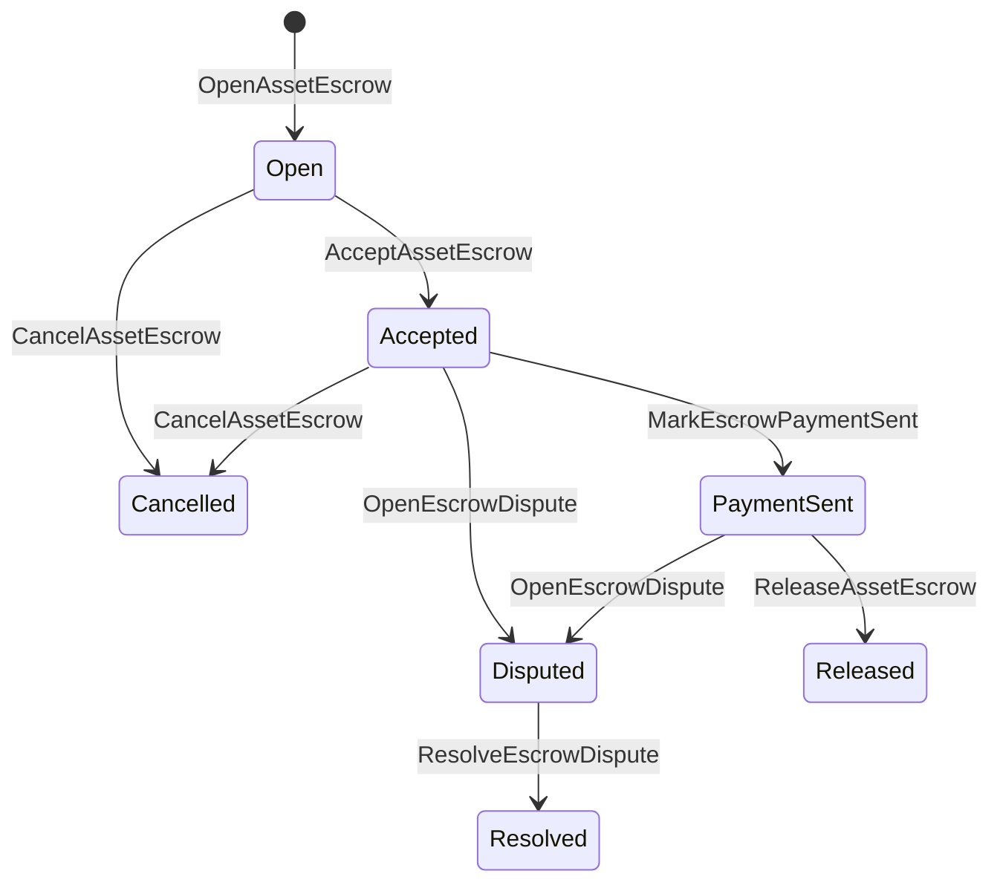

# ნაციონალური აქტივების გადახდა {#native-asset-escrow}

Native escrow არის ციფრული აქტივების მენეჯმენტირებული სათავსო მექანიზმი.
იმის ნაცვლად, რომ აქტივები გადაიგზავნოს განაცხადის საკუთრებაში არსებულ ანგარიშზე და დაეყრდნობა
ამ ანგარიშის დასაცავად განცხადების კოდი, საფარდოდ ISIs გადაიტანეთ ღირებულება a
დეტერმინისტური პროტოკოლის მფლობელობის ანგარიში და რეგისტრაცია საფარდობო სიცოცხლის ციკლი
მსოფლიო სახელმწიფო.

გამოიყენეთ ადგილობრივი დაფარვის საშუალება საბაზრო ანგარიშსწორებისთვის, აიტაი სტილის გარეშე გადახდა
კოორდინაცია, საწინააღმდეგო მიზნების დაფარვა და დაცული საფინანსო სამუშაო პროცესები, რომლებიც საჭიროა
რეგისტრირებული ცხოვრების ციკლის მდგომარეობა.

## კონცეფციები {#concepts}

| კონცეფცია | აღწერა |
| --- | --- |
| `EscrowId` | დამრეკლის მიერ შერჩეული იდენტიფიკატორი, რომელიც ჰეშის შემადგენლობაშია. ის უნდა იყოს უნიკალური გამჭვირვალე და ანონიმური საფარდობების შორის. |
| `AssetEscrowRecord` | გამჭვირვალე ციფრული აქტივების საფინანსო ან საკეტო რეკორდი. |
| `AnonymousAssetEscrowRecord` | დაცული საფინანსო ანგარიში, რომელსაც მხარს უჭერენ ბათილებლები, ვალდებულებები და მტკიცებულებების ჩართულობები. |
| სათავსო ანგარიში | დეტერმინისტური პროტოკოლის ანგარიში, რომელიც წარმოიშვა ჯაჭვიდან ID, საფინანსო დავალიანება ID, და აქტივების განსაზღვრა. |
| მტკიცებულებების ჰეშები | ფაქტურების, განაჩენების, შეტყობინებების, შენახვის მანიფესტების ან სხვა არაჩვეულებრივი მტკიცებულებების ჰაშები. თვითონ მტკიცებულების სასარგებლო ტვირთი არ არის შენახული საფინანსო ანგარიშში. |

გამჭვირვალე ჩანაწერები მოიცავს გამყიდველს, ავტორიულ მყიდველს. აქტივების განსაზღვრას.
საერთო თანხა, სათავსო ანგარიში, სიცოცხლის ციკლის სტატუსი, ქცევის სახეობა, დარჩენილი
თანხა, ვაკანსიური განთავისუფლების უფლება, ვაკანსია ვადის ამოწურვის ვადა, მტკიცებულება
ჰეშები, დროის შტამპები და ვარიანტული რეზოლუციის დეტალები.

დაფარვის თანხები უნდა იყოს პოზიტიური ციფრული აქტივების რაოდენობა და უნდა შეესაბამებოდეს
აქტივების განსაზღვრის ციფრული სპეციფიკაცია.
გენერული აქტივების გადარიცხვა არ შეიძლება გაუფასურდეს სათავსო ანგარიშს; სათავსოს გასვლა
ბილიკები არის საფინანსო ISIs ქვემოთ აღწერილი.

## საბაზრო საფინანსო დაფარვა {#marketplace-escrow}

ბაზრის საფინანსო ფასი კოორდინირებს აქტივების გათავისუფლებას ჯაჭვზე და არაჯაჭვებზე
გადახდის ან მიწოდების სამუშაო მიმდინარეობა.



| ISI | ვინ წარუდგენს | ეფექტი |
| --- | --- | --- |
| `OpenAssetEscrow` | გამყიდველი | იკეტება გამყიდველის ციფრული აქტივი პროტოკოლის დაცვაში და ქმნის `Open` ბაზრის რეკორდი. |
| `AcceptAssetEscrow` | მყიდველი | მყიდველი და გადაადგილება `Open` დაწვრილებით `Accepted`. მყიდველი ვერ მიიღებს საკუთარ საფარდელს. |
| `MarkEscrowPaymentSent` | მიღებული მყიდველი | გადაადგილება `Accepted` დაწვრილებით `PaymentSent` მას შემდეგ, რაც მყიდველი გამოგზავნის გადახდას ჯაჭვის გარეთ. |
| `ReleaseAssetEscrow` | გამყიდველი | გადაადგილება `PaymentSent` დაწვრილებით `Released` და გადარიცხავს მთლიანად დაფარულ თანხას მყიდველს. |
| `CancelAssetEscrow` | გამყიდველი | გადაადგილება `Open` ან `Accepted` დაწვრილებით `Cancelled` და გადახდის უკან გამყიდველს, სანამ გადახდა აღინიშნება. |
| `OpenEscrowDispute` | გამყიდველი ან მიღებული მყიდველი | გადაადგილება `Accepted` ან `PaymentSent` დაწვრილებით `Disputed` და დაამატებს მტკიცებულებების ჰეშესს. |
| `ResolveEscrowDispute` | ანგარიში `CanResolveEscrowDispute` | გადაადგილება `Disputed` დაწვრილებით `Resolved` და თანხა გაიყოფა მყიდველსა და გამყიდველს შორის. |

სადავო გადაწყვეტილების თანხები არ უნდა იყოს უარყოფითი და
`buyer_amount + seller_amount` უნდა შეესაბამოს საფინანსო თანხას. ნულოვანი ღირებულება
ფეხები დასაშვებია, მაგრამ მთელი გაყოფა უნდა ითვალისწინებდეს ჩაკეტილ ბალანსს.

### Rust მაგალითი {#rust-example}

ამ მაგალითში ვარაუდობენ, რომ გამყიდველისა და მყიდველის ანგარიშები უკვე არსებობს, აქტივი
განსაზღვრა რეგისტრირებულია რიცხვით და გამყიდველს აქვს საკმარისი ბალანსი.

```rust
use iroha::{
    client::Client,
    data_model::{
        isi::escrow::{
            AcceptAssetEscrow, MarkEscrowPaymentSent, OpenAssetEscrow,
            ReleaseAssetEscrow,
        },
        prelude::*,
    },
};
use iroha_crypto::Hash;

fn release_marketplace_escrow(
    seller_client: &Client,
    buyer_client: &Client,
    asset_definition_id: AssetDefinitionId,
) -> eyre::Result<()> {
    let escrow_id = EscrowId::new(Hash::new("docs-marketplace-escrow-001"));

    seller_client.submit_blocking(OpenAssetEscrow::with_evidence_hashes(
        escrow_id,
        asset_definition_id,
        Numeric::from(40_u64),
        vec![Hash::new("invoice:2026-001")],
    ))?;

    buyer_client.submit_blocking(AcceptAssetEscrow::new(escrow_id))?;
    buyer_client.submit_blocking(MarkEscrowPaymentSent::new(escrow_id))?;
    seller_client.submit_blocking(ReleaseAssetEscrow::new(escrow_id))?;

    let record = seller_client.query_single(FindAssetEscrowById::new(escrow_id))?;
    assert_eq!(record.status, AssetEscrowStatus::Released);
    assert_eq!(record.remaining_amount, Numeric::zero());

    Ok(())
}
```

## ზოგადი აქტივების საკეტები {#generic-asset-locks}

ქონების საკეტები იყენებენ იმავე ტიპის მფარველობის ჩანაწერს, მაგრამ ისინი არ არიან ყიდველი-გაყიდველი
შემოთავაზებები. ისინი ფინანსებს იკეტავენ სადესანტო ანგარიშზე და ვარიანტულად საჭიროებენ
ფონდების ამოღებისთვის განკუთვნილი ორგანო.

| ISI | ვინ წარუდგენს | ეფექტი |
| --- | --- | --- |
| `OpenAssetLock` | წყარო ანგარიში | იკეტება პოზიტიური თანხა, დაფიქსირებს მიმართულებას როგორც რეკორდის მყიდველს და ადგენს სტატუსს `Locked`. |
| `DrawdownAssetLock` | გათავისუფლების ორგანო ან მიმართულება, როდესაც არ არის დადგენილი გათავისუფლება | გადაცემა დარჩენილი მზრუნველობის ნაწილი ან მთლიანობა დანიშნულების ადგილზე. |
| `CancelAssetLock` | ჩაკეტვის გამხსნელი | გააუქმებს აქტიურ საკეტს და აბრუნებს დარჩენილ თანხას გახსნელს. |
| `ExpireAssetLock` | ნებისმიერი ოპერაციული ორგანო ვადა გასვლის შემდეგ | ამოწურულია ბლოკი `expires_at_ms` წარსულში და უკან დაბრუნება დარჩენილი თანხა გახსნის. |

`DrawdownAssetLock` ინახავს ჩანაწერს `Locked` სანამ გარკვეული თანხა დარჩება.
როდესაც დარჩენილი თანხა ნულამდე მიაღწევს, სტატუსი ხდება `DrawnDown` და
კაპიტალი ჟაჟრთგა.

```rust
use iroha::{
    client::Client,
    data_model::{
        isi::escrow::{CancelAssetLock, DrawdownAssetLock, ExpireAssetLock, OpenAssetLock},
        prelude::*,
    },
};
use iroha_crypto::Hash;

fn drawdown_and_close_asset_locks(
    opener_client: &Client,
    destination_client: &Client,
    release_authority_client: &Client,
    asset_definition_id: AssetDefinitionId,
    destination: AccountId,
    release_authority: AccountId,
) -> eyre::Result<()> {
    let trusted_lock_id = EscrowId::new(Hash::new("docs-asset-lock-trusted"));

    opener_client.submit_blocking(OpenAssetLock::with_options(
        trusted_lock_id,
        asset_definition_id.clone(),
        destination.clone(),
        Numeric::from(40_u64),
        Some(release_authority),
        None,
        vec![Hash::new("milestone-plan-v1")],
    ))?;

    release_authority_client.submit_blocking(DrawdownAssetLock::new(
        trusted_lock_id,
        Numeric::from(15_u64),
    ))?;

    let partially_drawn =
        opener_client.query_single(FindAssetEscrowById::new(trusted_lock_id))?;
    assert_eq!(partially_drawn.status, AssetEscrowStatus::Locked);
    assert_eq!(partially_drawn.remaining_amount, Numeric::from(25_u64));

    opener_client.submit_blocking(CancelAssetLock::new(trusted_lock_id))?;
    let cancelled = opener_client.query_single(FindAssetEscrowById::new(trusted_lock_id))?;
    assert_eq!(cancelled.status, AssetEscrowStatus::Cancelled);

    let expiring_lock_id = EscrowId::new(Hash::new("docs-asset-lock-expiring"));
    opener_client.submit_blocking(OpenAssetLock::with_options(
        expiring_lock_id,
        asset_definition_id,
        destination,
        Numeric::from(10_u64),
        None,
        Some(0),
        Vec::new(),
    ))?;

    destination_client.submit_blocking(ExpireAssetLock::new(expiring_lock_id))?;
    let expired = opener_client.query_single(FindAssetEscrowById::new(expiring_lock_id))?;
    assert_eq!(expired.status, AssetEscrowStatus::Expired);

    Ok(())
}
```

Python ამჟამად გამოყოფს მაღალ დონეზე მყოფი დამხმარეები გენერული საკეტებისათვის:
`open_asset_lock`, `drawdown_asset_lock`, `cancel_asset_lock`, და
`expire_asset_lock`. საბაზრო და ანონიმური საფინანსო ფასიდან Python, გამოყენება
კანონიკური `InstructionBox` JSON მეშვეობით SDK ეს არის JSON გაქცევის კარი, ან წარსდგენა
მეშვეობით SDK რომელიც გამოყოფს პირველი კლასის საფინანსო მწარმოებლებს.

## დაპირისპირებები {#disputes}

საბაზრო საფარდულო ფასი შეიძლება შევიდეს დავა `Accepted` ან `PaymentSent`.
მხოლოდ რეგისტრირებულმა გამყიდველმა ან მყიდველმა შეიძლება დავა გახსნას.
`CanResolveEscrowDispute`, ან გადაცემა უშუალოდ გამგებლის ანგარიშზე
ან როლით მემკვიდრეობით.

```rust
use iroha::{
    client::Client,
    data_model::{
        isi::escrow::{OpenEscrowDispute, ResolveEscrowDispute},
        prelude::*,
    },
};
use iroha_crypto::Hash;
use iroha_executor_data_model::permission::escrow::CanResolveEscrowDispute;

fn resolve_disputed_escrow(
    admin_client: &Client,
    buyer_client: &Client,
    court_client: &Client,
    court: AccountId,
    escrow_id: EscrowId,
) -> eyre::Result<()> {
    admin_client.submit_blocking(Grant::account_permission(
        Permission::from(CanResolveEscrowDispute),
        court,
    ))?;

    buyer_client.submit_blocking(OpenEscrowDispute::with_evidence_hashes(
        escrow_id,
        vec![Hash::new("buyer-payment-receipt")],
    ))?;

    court_client.submit_blocking(ResolveEscrowDispute::with_evidence_hashes(
        escrow_id,
        Numeric::from(30_u64),
        Numeric::from(10_u64),
        vec![Hash::new("court-judgement-001")],
    ))?;

    let record = admin_client.query_single(FindAssetEscrowById::new(escrow_id))?;
    assert_eq!(record.status, AssetEscrowStatus::Resolved);
    assert_eq!(
        record.resolution.as_ref().map(|resolution| resolution.buyer_amount.clone()),
        Some(Numeric::from(30_u64)),
    );

    Ok(())
}
```

## ანონიმური საფინანსო დაფარვა {#anonymous-escrow}

ანონიმური საფინანსო პირები იყენებენ იმავე ბაზრის სიცოცხლის ციკლს, მაგრამ დაფინანსება და
საჯარო ჩანაწერი კვლავ ინახავს გამყიდველს,
მყიდველი, სტატუსი, მტკიცებულებების ჰეშები, დროის შტამპები და მტკიცებულებებთან დაკავშირებული მოძრაობა
ჩანაწერები. ფარდოვანი ბარათების შიგნით არსებული თანხები და მიმღებნი წარმოდგენილია:
ვალდებულებები, ბათილებლები და მტკიცებულებათა მიმაგრება.

| გამჭვირვალე ISI | ანონიმური ISI |
| --- | --- |
| `OpenAssetEscrow` | `OpenAnonymousAssetEscrow` |
| `AcceptAssetEscrow` | `AcceptAnonymousAssetEscrow` |
| `MarkEscrowPaymentSent` | `MarkAnonymousEscrowPaymentSent` |
| `ReleaseAssetEscrow` | `ReleaseAnonymousAssetEscrow` |
| `CancelAssetEscrow` | `CancelAnonymousAssetEscrow` |
| `OpenEscrowDispute` | `OpenAnonymousEscrowDispute` |
| `ResolveEscrowDispute` | `ResolveAnonymousEscrowDispute` |

საფულე ან გამაჯანსაღებელი ინსტრუმენტები უნდა შეიქმნას მტკიცებულების დამაგრება და საზოგადოებრივი შეყვანები.
გათავისუფლება, გაუქმება და ანონიმურობა
სადავო გადაწყვეტილების მიღებისას უნდა დაიხარჯოს ზუსტად ერთი ვალდებულება და შეიქმნას
მყიდველის, გამყიდველის ან მოქმედების მიერ საჭირო გაყოფილი გამომუშავების ვალდებულებები.

```rust
use iroha::{
    client::Client,
    data_model::{
        isi::escrow::{
            AcceptAnonymousAssetEscrow, MarkAnonymousEscrowPaymentSent,
            OpenAnonymousAssetEscrow,
        },
        prelude::*,
        proof::ProofAttachment,
    },
};
use iroha_crypto::Hash;

fn open_anonymous_escrow(
    seller_client: &Client,
    buyer_client: &Client,
    escrow_id: EscrowId,
    asset_definition_id: AssetDefinitionId,
    funding_nullifiers: Vec<[u8; 32]>,
    escrow_commitment: [u8; 32],
    proof: ProofAttachment,
    root_hint: Option<[u8; 32]>,
) -> eyre::Result<()> {
    seller_client.submit_blocking(OpenAnonymousAssetEscrow::with_evidence_hashes(
        escrow_id,
        asset_definition_id,
        funding_nullifiers,
        escrow_commitment,
        proof,
        root_hint,
        vec![Hash::new("shielded-invoice")],
    ))?;

    buyer_client.submit_blocking(AcceptAnonymousAssetEscrow::new(escrow_id))?;
    buyer_client.submit_blocking(MarkAnonymousEscrowPaymentSent::new(escrow_id))?;

    Ok(())
}
```

ძირითადი დაცული ტრანზაქციის მოდელის შესახებ იხილეთ
[ანონიმური ტრანზაქციები](/ka/blockchain/anonymous-transactions.md).

## SDK გამოყენება {#sdk-usage}

საფინანსო მხარდაჭერა სხვადასხვა ქვეყნებში განსხვავებულად გამოხატულია SDKs. Rust აქვს კანონიკური
ტიპირებული მონაცემთა მოდელი. Python ამჟამად გამოავლინებს აქტივების ჩაკეტვის ზოგადი დამხმარე საშუალებებს.
JavaScript და TypeScript გამოყენება Kotodama ჟჲბჲპთნარა ოპვაპაჟკა. Kotlin/JVM და Swift
უზრუნველყოს ბაზრისთვის დასახელებული სასარგებლო ტვირთების მშენებლობისათვის და ანონიმური საფარდოდ.

| SDK | გამოიყენეთ ეს ზედაპირი | ფარგლებში |
| --- | --- | --- |
| [Rust](#rust-sdk) | `iroha::data_model::isi::escrow` | საფლავო ფირმა, გენერული საკნები, ანონიმური ფირმა და შეკითხვები. |
| [Python](#python-asset-locks) | `Instruction.open_asset_lock`, `TransactionDraft.open_asset_lock`, და კლიენტი `*_and_wait` დამხმარეები | ჟენერული აქტივების საკეტები. ბაზარი და ანონიმური საფინანსო დამხმარეები არ არიან პირველი კლასის Python ჯერჯერობით მეთოდები. |
| [JavaScript / TypeScript](#javascript-and-typescript-kotodama) | `compileKotodamaProgram` საგანგებო `@iroha/iroha-js/kotodama-compiler` | ეშროვი მასპინძლის ზარები შიგნით Kotodama ხელშეკრულებები. |
| [Kotlin / JVM](#kotlin-and-jvm) | `InstructionTemplate` კლასები `org.hyperledger.iroha.sdk.core.model.instructions` | ბაზარზე და ანონიმურ საფინანსო ინსტრუქციულ შაბლონებზე. |
| [Swift / iOS](#swift-and-ios) | `NativeEscrowInstructionBuilders` და `IrohaSDK.build*Escrow*` დამხმარეები | ბაზარი და ანონიმური საფინანსო ფასი Norito JSON ინსტრუქციის სასარგებლო ტვირთები. |

ქვემოთ მოცემული მაგალითები ყურადღებას აქცევს ინსტრუქციის კონსტრუქციას. ანგარიშის დაფინანსება,
ხელმოწერების მართვა და ტრანზაქციის წარდგენა ნორმალური ნაკადის შესაბამისად
თითოეული SDK.

### Rust SDK {#rust-sdk}

გამოიყენეთ Rust SDK როდესაც თქვენ გჭირდებათ სრული ადგილობრივი დაფარვა ან გამოკითხვის / მოვლენების მხარდაჭერა.
ზემოაღნიშნული მაგალითები აჩვენებს ბაზრის გათავისუფლებას, ზოგადი ჩაკეტვის შეღავათს, დავას
რეზოლუცია და ანონიმური საფინანსო კონსტრუქცია
`iroha::data_model::isi::escrow`.

```rust
use iroha::{
    client::Client,
    data_model::{isi::escrow::OpenAssetEscrow, prelude::*},
};
use iroha_crypto::Hash;

fn open_and_read(
    client: &Client,
    asset_definition_id: AssetDefinitionId,
) -> eyre::Result<AssetEscrowRecord> {
    let escrow_id = EscrowId::new(Hash::new("docs-rust-sdk-escrow"));

    client.submit_blocking(OpenAssetEscrow::new(
        escrow_id,
        asset_definition_id,
        Numeric::from(10_u64),
    ))?;

    client.query_single(FindAssetEscrowById::new(escrow_id))
}
```

### Python აქტივების ჩაკეტვა {#python-asset-locks}

სააგენტო Python SDK აჟღავნებს პირველ კლასის დამხმარეებს გენერული აქტივების საკეტების გამო. გამოიყენეთ ისინი
საპროტესტო აქციების გადახდა, გათავისუფლების ორგანოს მიერ გამოტანილი თანხის ჩამოტვირთვა,
გახსნა და ვადაგვიანების დაბრუნება.

```python
client.open_asset_lock_and_wait(
    chain_id="dev-chain",
    authority="<source-account-id>",
    private_key_hex="<source-private-key-hex>",
    escrow_id="merchant-lock-001",
    asset_definition_id="<asset-definition-base58>",
    destination="<destination-account-id>",
    amount="2500",
    release_authority="<trusted-release-account-id>",
    expires_at_ms=1_704_000_000_000,
)

client.drawdown_asset_lock_and_wait(
    chain_id="dev-chain",
    authority="<trusted-release-account-id>",
    private_key_hex="<trusted-release-private-key-hex>",
    escrow_id="merchant-lock-001",
    amount="1000",
)

client.expire_asset_lock_and_wait(
    chain_id="dev-chain",
    authority="<any-account-id>",
    private_key_hex="<any-private-key-hex>",
    escrow_id="merchant-lock-001",
)
```

ორპარტიული საკეტისთვის, გამორიცხეთ `release_authority`; დანიშნულების ანგარიშს შეუძლია
შემდეგ წარადგინეთ `drawdown_asset_lock`.

### JavaScript და TypeScript Kotodama {#javascript-and-typescript-kotodama}

სააგენტო JavaScript SDK ამჟამად პირდაპირი ადგილობრივი საფინანსო ოპერაცია არ გამოხატავს
მშენებლები. JavaScript ან TypeScript აპლიკაციები, რომლებიც განახორციელებენ Kotodama
ხელშეკრულებები, შეადგინოს escrow მასპინძელი ზარები Kotodama კომპილერი.

Native escrow მასპინძელი ზარები მოითხოვს მკაფიო წვდომის მინიშნებები, რადგან კომპილერი
ვერ მიიღებს უფრო ვიწრო წვდომის კომპლექტებს არაგამჭვირვალე საფარდოდ ISIs. გამოიყენეთ ფრიალების მითითებები
ექსპორტირებული შესასვლელი პუნქტები, რომლებიც მოითხოვს `escrow_*` ნაშენები.

```js
import { compileKotodamaProgram } from "@iroha/iroha-js/kotodama-compiler";

const source = `
seiyaku MarketplaceEscrow {
  meta { abi_version: 1; }

  #[access(read="*", write="*")]
  kotoage fn run() permission(Admin) {
    let asset = asset_definition("62Fk4FPcMuLvW5QjDGNF2a4jAmjM");
    let offer = name("aitai_offer");
    let evidence = norito_bytes("00");

    call escrow_open_offer(offer, asset, 10, evidence);
    call escrow_accept(offer);
    call escrow_mark_payment_sent(offer);
    call escrow_release(offer);
  }
}
`;

const compiled = compileKotodamaProgram(source, {
  sourceName: "escrow.ko",
});

if (compiled.diagnostics.length > 0) {
  throw new Error(compiled.diagnostics.map((item) => item.message).join("\n"));
}
```

სადავო პირებისათვის გამოყენება `escrow_open_dispute(offer, evidence)` და
`escrow_resolve_dispute(offer, buyer_amount, seller_amount, evidence)`.
Anonymous escrow host ზარები მიიღოს Norito სასარგებლო ტვირთის ბაიტების მოთხოვნა, მაგალითად
`anonymous_escrow_open_offer(request)`.

### Kotlin და JVM {#kotlin-and-jvm}

სააგენტო Kotlin/JVM SDK მოდელები მშობლიური escrow custom ინსტრუქციის შაბლონები. თითოეული
შაბლონი ადასტურებს საჭირო ველებს და ასახავს გამოყენებულ კანონიკურ არგუმენტთა რუკას
ტრანზაქციის შემქმნელის მიერ.

```kotlin
import org.hyperledger.iroha.sdk.core.model.escrow.NativeEscrowPermissions
import org.hyperledger.iroha.sdk.core.model.instructions.AcceptAssetEscrowInstruction
import org.hyperledger.iroha.sdk.core.model.instructions.MarkEscrowPaymentSentInstruction
import org.hyperledger.iroha.sdk.core.model.instructions.OpenAssetEscrowInstruction
import org.hyperledger.iroha.sdk.core.model.instructions.ReleaseAssetEscrowInstruction
import org.hyperledger.iroha.sdk.core.model.instructions.ResolveEscrowDisputeInstruction

val open = OpenAssetEscrowInstruction(
    escrowId = "escrow-hash",
    assetDefinition = "xor#wonderland",
    amount = "42.5",
    evidenceHashes = listOf("invoice-hash"),
)
val accept = AcceptAssetEscrowInstruction("escrow-hash")
val paid = MarkEscrowPaymentSentInstruction("escrow-hash")
val release = ReleaseAssetEscrowInstruction("escrow-hash")
val resolve = ResolveEscrowDisputeInstruction(
    escrowId = "escrow-hash",
    buyerAmount = "30",
    sellerAmount = "12.5",
    evidenceHashes = listOf("judgement-hash"),
)

println(open.arguments)
println(NativeEscrowPermissions.CAN_RESOLVE_ESCROW_DISPUTE)
```

ანონიმური შაბლონები ხელმისაწვდომია როგორც
`OpenAnonymousAssetEscrowInstruction`, `AcceptAnonymousAssetEscrowInstruction`,
`MarkAnonymousEscrowPaymentSentInstruction`,
`ReleaseAnonymousAssetEscrowInstruction`,
`CancelAnonymousAssetEscrowInstruction`,
`OpenAnonymousEscrowDisputeInstruction`, და
`ResolveAnonymousEscrowDisputeInstruction`. Android ჯავას მრეწველებს შეუძლიათ გამოიყენონ
შედარება `NativeEscrowInstructions.*` მშენებლები Android არტეფაქტი.

### Swift და iOS {#swift-and-ios}

სააგენტო Swift SDK აგებს საფინანსო ინსტრუქციას, როგორც Norito JSON სასარგებლო ტვირთები.
`NativeEscrowInstructionBuilders` უშუალოდ ან ეძახით ექვივალენტს
`IrohaSDK.build*Escrow*` დამხმარე, როდესაც თქვენი აპლიკაცია უკვე აქვს `IrohaSDK`
შემთხვევა.

```swift
import IrohaSwift

let open = try NativeEscrowInstructionBuilders.openAssetEscrow(
    escrowId: "escrow-hash",
    assetDefinition: "xor#wonderland",
    amount: "42.5",
    evidenceHashes: ["invoice-hash"]
)
let accept = try NativeEscrowInstructionBuilders.acceptAssetEscrow(
    escrowId: "escrow-hash"
)
let paid = try NativeEscrowInstructionBuilders.markEscrowPaymentSent(
    escrowId: "escrow-hash"
)
let release = try NativeEscrowInstructionBuilders.releaseAssetEscrow(
    escrowId: "escrow-hash"
)
let resolve = try NativeEscrowInstructionBuilders.resolveEscrowDispute(
    escrowId: "escrow-hash",
    buyerAmount: "30",
    sellerAmount: "12.5",
    evidenceHashes: ["judgement-hash"]
)
```

ანონიმური Swift მშენებლები იღებენ ნულიფიკატორის სიებს, გამოშვების ვალდებულებების სიებს, მტკიცებულებას
ლექსიკონი და ვარიანტი `rootHint` დისკუსიების გადაწყვეტის ნებართვა
ტოქენი ხელმისაწვდომია როგორც `NativeEscrowPermissions.canResolveEscrowDispute`.

## კითხვები და მოვლენები {#queries-and-events}

გამოიყენეთ სტატუსის გვერდების, შერიგების სამუშაოებისა და მხარდაჭერის ინსტრუმენტების საფონდო გამოკითხვები:

| კითხვები | მიზანი |
| --- | --- |
| `FindAssetEscrowById` | წაიკითხეთ ერთი გამჭვირვალე საფარდებელი ან ჩაკეტეთ `EscrowId`. |
| `FindAssetEscrows` | გადმოწერეთ გამჭვირვალე საფინანსო და საკეტო ჩანაწერები. |
| `FindAssetEscrowsBySeller` | ჩამოთვალეთ რეკორდები, რომლებიც გაიხსნა გამყიდველის ან საკეტი გახსნის მიერ. |
| `FindAssetEscrowsByBuyer` | ჩამოთვალეთ ბაზრის საფარდებელი ფასი, რომელიც მყიდველმა მიიღო ან დანიშნულების ადგილზე მიზნად ისახავს. |
| `FindAssetEscrowsByStatus` | ჩამონათვალი ჩანაწერები `AssetEscrowStatus`. |
| `FindAnonymousAssetEscrowById` | წაკითხეთ ერთი ანონიმური საფინანსო `EscrowId`. |
| `FindAnonymousAssetEscrows*` | ჩამოთვალეთ ანონიმური საფინანსო ანგარიშები ყველა ჩანაწერის მიხედვით, გამყიდველი, მყიდველი ან სტატუსი. |

`EscrowEventFilter` შეუძლიათ გამოიწერონ გამჭვირვალე ადგილობრივი საფინანსო და საკეტი
მოვლენები საფინანსო დაფარვით ID, გამყიდველი, მყიდველი, სტატუსი და ღონისძიების შედგენის ნიღაბი
ოჯახი მოიცავს `Opened`, `Accepted`, `PaymentSent`, `Released`,
`Cancelled`, `Expired`, `Disputed`, და `Resolved`. ანონიმური საფინანსო დაფარვა
ჩანაწერები ინსპექტირდება ანონიმური საფინანსო მოთხოვნების საშუალებით.

## საოპერაციო შენიშვნები {#operational-notes}

- ინახეთ დიდი ანგარიშები, ჩატის ლოგები, განაჩენები ან აუდიტის ბუნდები
  გადმოწერეთ ანგარიშები და დაამატეთ მათი ჰეშები მტკიცებულებად.
- სტაბილური გამოყენება `EscrowId` წარმოშობა აპლიკაციებში, ასე რომ retries ვერ ქმნის
  იგივე შეთავაზების ორმაგი საფარდებელი.
- გრანტი `CanResolveEscrowDispute` მხოლოდ ანგარიშებზე ან როლებზე, რომლებიც ფუნქციონირებს
  სადავო პროცესი.
- შეამოწმეთ გადახდის გარეთ ქსელის შემოწმება, როგორც განაცხადის პოლიტიკა. Iroha ჩანაწერები
  მფლობელობის და სიცოცხლის ციკლის გადასვლები; იგი არ ადასტურებს ფირმის ან გარე
  გადახდის რელსები თავისით.
