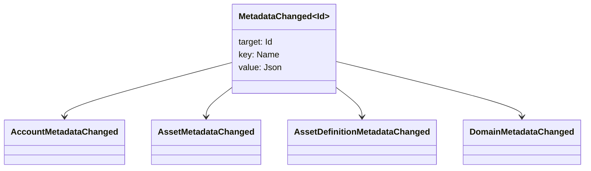

# მეტა მონაცემები {#metadata}

Metadata არის შეამოწმებული გასაღები ღირებულება რუკა მიერთებული ლეჯერი ობიექტების. გასაღები არიან
`Name` ღირებულებები და ფასეულობები JSON (`Json`) სასარგებლო ტვირთები.

შემდეგ ობიექტებს შეუძლიათ მიიტანონ მეტა მონაცემები:

- დომენები
- ანგარიშები
- აქტივები
- აქტივების განმარტებები
- NFTs
- RWAs
- გამამოძრავებელი
- ოპერაციები

გამოიყენეთ მეტა მონაცემები მცირე აღწერილობის ან ინდექსირების ველებისთვის, რომლებიც მოხვდებიან მთავარ წიგნში
დიდი სასარგებლო ტვირთების შენახვა უნდა მოხდეს WSV და მითითებულია a
საჭმლის მონელება, URI, ან SoraFS გზას.

მითითებების მისაღებად მეტა მონაცემების, აქტივების, NFTs, RWAs, ან ჯაჭვის გარეთ
შენახვა, იხილეთ
[მეტა მონაცემები და ლეჯერის შენახვის არჩევანი](/ka/guide/configure/metadata-and-store-assets.md).

## სცადე. Taira {#try-it-on-taira}

Metadata ჩანს ნორმალური რესურსის წაკითხვა. ეს ბრძანება ჩამონათვალებს Taira
აქტივების განმარტებები, რომლებსაც ამჟამად აქვთ მეტა მონაცემები:

```bash
curl -fsS 'https://taira.sora.org/v1/assets/definitions?limit=100' \
  | jq '.items[]
    | select((.metadata | length) > 0)
    | {id, name, metadata}'
```

გამოიყენეთ იგივე ნიმუში დომენებისა და ანგარიშებისთვის:

```bash
curl -fsS 'https://taira.sora.org/v1/domains?limit=20' \
  | jq '.items[] | select((.metadata // {} | length) > 0)'

curl -fsS 'https://taira.sora.org/v1/accounts?limit=20' \
  | jq '.items[] | select((.metadata // {} | length) > 0)'
```

ცარიელი გამოშვების შეფასება, როგორც მოქმედი შედეგის. ეს ნიშნავს მიმდინარე გვერდის Taira
ობიექტები არ შეიცავს მეტა მონაცემებს, არა ის, რომ საბოლოო წერტილი ჩავარდა.

## მეტა მონაცემების განახლება {#updating-metadata}

მეტა მონაცემები შეიცვლება Iroha სპეციალური ინსტრუქციები:

- [`SetKeyValue`](/ka/blockchain/instructions.md#setkeyvalue-removekeyvalue)
  ჩადება ან შეცვლა გასაღები
- [`RemoveKeyValue`](/ka/blockchain/instructions.md#setkeyvalue-removekeyvalue)
  ამოიღებს გასაღებას

ტრანზაქციის წარდგენის ორგანოს უნდა ჰქონდეს მოთხოვნილი ნებართვა
აქტიური runtime validator- ის მიერ. გათვალისწინებული ნებართვის ზედაპირისათვის იხილეთ
[ნებართვის ტოქნები](/ka/reference/permissions.md).

## მოვლენები {#events}

მონაცემთა მოვლენები გამონაბეჭდილია, როდესაც მეტატალღები იცვლება. ზოგადი მოვლენის სასარგებლო ტვირთი არის
`MetadataChanged<Id>`:



გამოყენება [მონაცემთა მოვლენების ფილტრები](/ka/blockchain/filters.md#data-event-filters) დაწვრილებით
გაფორმება მხოლოდ ერთეულობის ტიპის ან ობიექტის მეტა მონაცემთა მოვლენებზე ID რომ
ინტეგრაციის საკითხები.

## კითხვები {#queries}

Metadata ბრუნდება როგორც ნაწილი შეკითხული ობიექტის. მაგალითად, გამოყენება
[`FindAccountById`](/ka/reference/queries.md#accounts-and-permissions),
[`FindDomainById`](/ka/reference/queries.md#domains-and-peers), ან
[`FindAssetDefinitionById`](/ka/reference/queries.md#assets-nfts-and-rwas).
გამოყენება [`FindNfts`](/ka/reference/queries.md#assets-nfts-and-rwas) ან
[`FindNftsByAccountId`](/ka/reference/queries.md#assets-nfts-and-rwas) სამედიცინო
NFTs, და [`FindRwas`](/ka/reference/queries.md#assets-nfts-and-rwas) სამედიცინო RWA
შემდეგ წაიკითხეთ ობიექტის მეტა მონაცემთა ველი. NFT შეკითხვის პასუხები გამოყოფს
NFT `content` რუკა როგორც ჩანაწერის მეტა მონაცემები.

მეტა მონაცემთა საკვანძოები არის ნაწილი ლიდერის მდგომარეობა, ასე რომ შეინარჩუნოთ ისინი სტაბილური და თავიდან აიცილეთ
კოდირების აპლიკაციის სპეციფიკური ვერსია churn საკვანძო სახელში, როდესაც JSON
ამ ვერსია შეიძლება იყოს მკაფიოდ.
