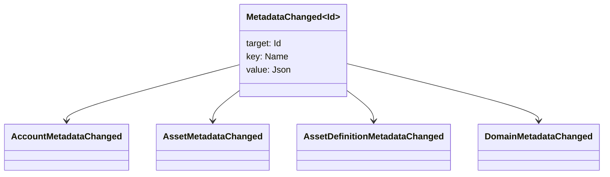

# მეტა მონაცემები {#metadata}

Metadata არის გადამოწმებული საკვანძო ღირებულების რუკა, რომელიც მიმაგრებულია წიგნის ობიექტებთან. საკვანჭეები არის `Name` მნიშვნელობები და მნიშვნელობები არიან JSON (`Json`) სასარგებლო ტვირთები .

შემდეგ ობიექტებს შეუძლიათ მიიტანონ მეტა მონაცემები:

- დომენები
- ანგარიშები
- აქტივები
- აქტივების განმარტებები
- NFTs
- RWAs
- გამომწვევი
- ოპერაციები

გამოიყენეთ მეტა მონაცემები მცირე აღწერილობის ან ინდექსირების ველებისთვის, რომლებიც მოეკუთვნებიან მთავრობის მდგომარეობაში. დიდი სასარგებლო ტვირთები უნდა იყოს შენახული WSV-ის გარეთ და მითითებული დიგესტით, URI ან SoraFS გზაზე.

მითითებისთვის, თუ როგორ უნდა აირჩიოთ მეტა მონაცემები, აქტივები NFTs, RWAs ან სათავსო ქსელის გარეთ, იხილეთ [ მეტა მონაცემებისა და ლიდერის შენახვის არჩევანი](/ka/guide/configure/metadata-and-store-assets.md).

## სცადეთ Taira {#try-it-on-taira}

Metadata ჩანს ნორმალური რესურსის წაკითხვის მეშვეობით. ეს ბრძანება ჩამოთვლის Taira აქტივების განმარტებები, რომლებსაც ამჟამად აქვთ მეტა მონაცემები:

```bash
curl -fsS 'https://taira.sora.org/v1/assets/definitions?limit=100' \
  | jq '.items[]
    | select((.metadata | length) > 0)
    | {id, name, metadata}'
```

გამოიყენეთ იგივე ნიმუში დომენებისა და ანგარიშებისათვის:

```bash
curl -fsS 'https://taira.sora.org/v1/domains?limit=20' \
  | jq '.items[] | select((.metadata // {} | length) > 0)'

curl -fsS 'https://taira.sora.org/v1/accounts?limit=20' \
  | jq '.items[] | select((.metadata // {} | length) > 0)'
```

ცარიელი გამოშვების შეფასება როგორც ვალიდური შედეგი. ეს ნიშნავს, რომ Taira ობიექტების მიმდინარე გვერდზე არ არის მეტა მონაცემები, არა ის, რომ საბოლოო წერტილი წარუმატებელია.

## Metadata- ს განახლება {#updating-metadata}

მეტა მონაცემები შეიცვლება Iroha სპეციალური ინსტრუქციით:

- [`SetKeyValue`](/ka/blockchain/instructions.md#setkeyvalue-removekeyvalue) ჩასვამს ან შეცვლის გასაღებს
- [`RemoveKeyValue`](/ka/blockchain/instructions.md#setkeyvalue-removekeyvalue) ამოიღებს გასაღებელს

ტრანზაქციის წარდგენის ორგანოს უნდა ჰქონდეს აქტიური runtime validator-ის მიერ მოთხოვნილი ნებართვა. გათვალისწინებული ნებართვის ზედაპირისთვის იხილეთ [ Permission Tokens](/ka/reference/permissions.md).

## მოვლენები {#events}

მონაცემთა მოვლენების გამონაბეჭდილება ხდება, როდესაც მეტა მონაცემები იცვლება. ზოგადი მოვლენის სასარგებლო ტვირთი არის `MetadataChanged<Id>`:



გამოიყენეთ [ მონაცემთა მოვლენების ფილტრები ](/ka/blockchain/filters.md#data-event-filters) მხოლოდ ინტეგრაციისათვის მნიშვნელოვანი სუბიექტის ტიპის ან ობიექტის ID მეტაანალიზებული მოვლენების გამოწერისთვის.

## კითხვები {#queries}

მეტა მონაცემები დაბრუნებულია როგორც გამოკითხული ობიექტის ნაწილი. მაგალითად, გამოიყენეთ [`FindAccountById`](/ka/reference/queries.md#accounts-and-permissions), [`FindDomainById`](/ka/reference/queries.md#domains-and-peers) ან [`FindAssetDefinitionById`](/ka/reference/queries.md#assets-nfts-and-rwas). გამოიყენეთ [`FindNfts`](/ka/reference/queries.md#assets-nfts-and-rwas) ან [`FindNftsByAccountId`](/ka/reference/queries.md#assets-nfts-and-rwas) NFTs, და [`FindRwas`](/ka/reference/queries.md#assets-nfts-and-rwas) RWA ლოტებისთვის. შემდეგ წაიკითხეთ ობიექტის მეტა მონაცემთა ველი. NFT შეკითხვის პასუხები გამოყოფს NFT `content` რუკას როგორც ჩანაწერის მეტაანალიზებას.

Metadata საკვანძოები არიან ნაწილი ლიდერის მდგომარეობა, ასე რომ შეინარჩუნოს ისინი სტაბილური და თავიდან ავიცილოთ კოდირება პროგრამის სპეციფიკური ვერსია churn საკვანჭო სახელწოდებაში, როდესაც JSON ღირებულება შეიძლება შეიცავდეს ეს ვერსია მკაფიოდ.
