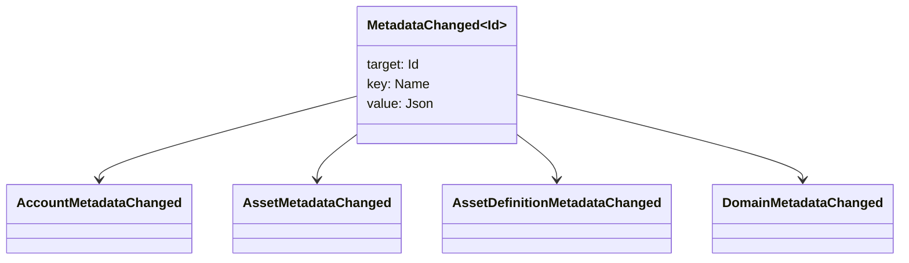

# მეტამონაცემები {#metadata}

მეტამონაცემები რეესტრის ობიექტებზე მიმაგრებული, შემოწმებული გასაღები-მნიშვნელობის ასახვაა. გასაღებები `Name` მნიშვნელობებია, ხოლო მნიშვნელობები — JSON (`Json`) დატვირთვები.

შემდეგ ობიექტებს შეუძლიათ მიიტანონ მეტამონაცემები:

- დომენები
- ანგარიშები
- აქტივები
- აქტივების განმარტებები
- NFTs
- RWAs
- ტრიგერი
- ოპერაციები

გამოიყენეთ მეტამონაცემები პატარა აღწერილობის ან ინდექსირების ველებისთვის, რომლებიც ეკუთვნის ბლოკჩეინის რეესტრის მდგომარეობას. დიდი დატვირთვები უნდა იყოს შენახული WSV -ის გარეთ და მითითებული კრიპტოგრაფიული დიჯესტით, URI, ან SoraFS გზა.

მეტამონაცემებს, აქტივებს, NFTs ობიექტებს, RWAs აქტივებსა და ქსელის გარეთ შენახვას შორის არჩევის შესახებ იხილეთ [მეტამონაცემებისა და რეესტრში შენახვის ვარიანტები](/ka/guide/configure/metadata-and-store-assets.md).

## განახორციელეთ ეს სამუშაო პროცესი Taira {#try-it-on-taira}

მეტამონაცემები ჩანს ნორმალური რესურსის წაკითხვის მეშვეობით. ეს ბრძანება ჩამოთვლის Taira აქტივების განმარტებები, რომლებსაც ამჟამად აქვთ მეტამონაცემები:

```bash
curl -fsS 'https://taira.sora.org/v1/assets/definitions?limit=100' \
  | jq '.items[]
    | select((.metadata | length) > 0)
    | {id, name, metadata}'
```

გამოიყენეთ იგივე ნიმუში დომენებისა და ანგარიშებისათვის:

```bash
curl -fsS 'https://taira.sora.org/v1/domains?limit=20' \
  | jq '.items[] | select((.metadata // {} | length) > 0)'

curl -fsS 'https://taira.sora.org/v1/accounts?limit=20' \
  | jq '.items[] | select((.metadata // {} | length) > 0)'
```

ცარიელი გამოშვების შეფასება როგორც მოქმედი შედეგი. ეს ნიშნავს, რომ Taira ობიექტების მიმდინარე გვერდზე არ არის მეტამონაცემები, არა ის, რომ API საბოლოო წერტილი წარუმატებელი იყო.

## მეტამონაცემები- ს განახლება {#updating-metadata}

მეტამონაცემები შეიცვლება Iroha ინსტრუქციის ოპერაციების დროს:

- [`SetKeyValue`](/ka/blockchain/instructions.md#setkeyvalue-removekeyvalue) ჩადება ან შეცვლა გასაღები
- [`RemoveKeyValue`](/ka/blockchain/instructions.md#setkeyvalue-removekeyvalue) ამოიღებს გასაღებას

ტრანზაქციის წარდგენილ ავტორიზაციის ხელმძღვანელს უნდა ჰქონდეს აქტიური შესრულების გარემოს ვალიდატორის მიერ მოთხოვნილი ნებართვა. გათვალისწინებული ნებართვის ზედაპირისთვის იხილეთ [ნებართვის ტოკენები](/ka/reference/permissions.md).

## მოვლენები {#events}

მონაცემთა მოვლენების გამონაბეჭდილება ხდება, როდესაც მეტამონაცემები იცვლება. ზოგადი მოვლენის დატვირთვა არის `MetadataChanged<Id>`:



გამოყენება [მონაცემთა მოვლენების ფილტრები](/ka/blockchain/filters.md#data-event-filters) მხოლოდ ინტეგრაციისათვის მნიშვნელოვანი სუბიექტის ტიპის ან ობიექტის ID-ის მეტამონაცემთა მოვლენების გამოწერისთვის.

## კითხვები {#queries}

მეტამონაცემები ბრუნდება როგორც ნაწილი გამოკითხული ობიექტის. მაგალითად, გამოყენება [`FindAccountById`](/ka/reference/queries.md#accounts-and-permissions), [`FindDomainById`](/ka/reference/queries.md#domains-and-peers), ან [`FindAssetDefinitionById`](/ka/reference/queries.md#assets-nfts-and-rwas). გამოყენება [`FindNfts`](/ka/reference/queries.md#assets-nfts-and-rwas) ან [`FindNftsByAccountId`](/ka/reference/queries.md#assets-nfts-and-rwas) სამედიცინო NFTs, და [`FindRwas`](/ka/reference/queries.md#assets-nfts-and-rwas) სამედიცინო RWA მაშინ წაიკითხეთ ობიექტის მეტამონაცემთა ველი. NFT შეკითხვის პასუხები გამოხატავს: NFT `content` რუკა, როგორც ჩანაწერის მეტამონაცემები.

მეტამონაცემები გასაღები არის ნაწილი ბლოკჩეინის რეესტრი მდგომარეობა, ასე რომ შეინარჩუნოს ისინი სტაბილური და თავიდან აიცილოთ კოდირება პროგრამის სპეციფიკური ვერსია ხშირი ცვლილება საკვანძო სახელი, როდესაც JSON ღირებულება შეიძლება შეიცავდეს ეს ვერსია მკაფიოდ.
