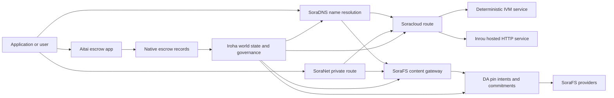

# SORA Nexus მომსახურება {#sora-nexus-services}

SORA Nexus დამატება აპლიკაციის მიმართულებით მომსახურების თვითმფრინავები გარშემო Iroha 3. ეს სერვისები არ არის ცალკეული ბლოკჩეინების ლიდერები. ისინი დამყარებულია Iroha მსოფლიო სახელმწიფო, Norito ტექნიკური მანიფესტები, მმართველობის ჩანაწერები და Torii საგზაო ოჯახები.

ხელმისაწვდომობა დამოკიდებულია კვანძის მშენებლობაზე და ქსელის პროფილზე. გამოყენება [`/openapi.json`](/ka/reference/torii-endpoints.md#app-and-sora-route-families) გენერირებული აპლიკაციის აღმოჩენა...API მარშრუტები სამიზნე კვანძზე. SoraFS CID და ცნობილი მარშრუტები ამომუშავებული დოკუმენტის გარეთ არის დამონტაჟებული, ამიტომ გადამოწმეთ ეს მარშრუტები პირდაპირ განთავსების შემოწმებისას.

## კომპონენტების რუკა {#component-map}

|კომპონენტი |როლი |მთავარი ზედაპირები |
| ---------------------- | ------------------------------------------------------------------------------------------------------------------------------------------- | ---------------------------------------------------------------------------------------- |
|Soracloud |აპლიკაციის განთავსება, მასპინძლული სერვისები, კერძო მოდელი/სამუშაო დროის მდგომარეობა და მომსახურების სიცოცხლის ციკლზე კონტროლი. |`/v1/soracloud/*`, `/api/*`, `iroha soracloud service ...` |
|Inrou |Soracloud-ზე განთავსებული HTTP შესრულების გარემო სერვისის იმ რევიზიებისთვის, რომლებსაც მოქმედი HTTP სიბრტყე სჭირდება. |Soracloud-ის შესრულების გარემოს კონფიგურაცია, ჰოსტის შესაძლებლობების განცხადებები, რეპლიკის შესრულების მდგომარეობა |
|SoraNet |კონფიდენციალურობა და ტრანსპორტის გადაფარვა წრედებისთვის, რელიე ტრაფიკი, VPN, Connect სესიები და სტრიმინგის მარშრუტები. |`/v1/connect/*`, `/v1/vpn/*`, SoraNet მარშრუტის მეტამონაცემები |
|მონაცემთა ხელმისაწვდომობა (DA) |ხელმისაწვდომობის მტკიცებულებების, ვალდებულებებისა და მიმაგრების განზრახვების ფენა იმ დატვირთვებისთვის, რომლებსაც Nexus-ის ზოლები, SoraFS-ის მანიფესტები და მტკიცებულებათა ნაკადები მიუთითებს. |`/v1/da/*`, `FindDaPinIntent*`, `[nexus.da]` |
|SoraFS |ტექნიკური მანიფესტების, CAR სასარგებლო დატვირთვების, ჩაკეტილი შინაარსის, კარიბჭეების მიღებისა და აღდგენის მტკიცებულების ნაკადების სათავსო ქსოვილი. |`/v1/sorafs/*`, `/sorafs/*`, `FindSorafsProviderOwner` |
|SoraDNS |დეტერმინისტური დასახელება და SORA -ში განთავსებული სერვისებისა და შინაარსის გადამწყვეტის ატესტაციის ფენა. |`/v1/soradns/*`, `/soradns/*`, გადამწყვეტი დირექტორი მოვლენები |
|აიტაი |აპლიკაციის დონეზე ფიტისა და აქტივების საფინანსო ტრანზაქციების ანგარიშსწორების კორიდორი, რომელსაც მხარს უჭერენ ადგილობრივი სესრო რეგისტრაციები და არა ცალკე ბლოკჩეინის რეესტრი. |`OpenAssetEscrow`, `FindAssetEscrow*`,`EscrowEventFilter`, Kotodama `escrow_*` შენობები |



## ჩვეულებრივი ნაკადები {#common-flows}

### მასპინძლული გაყოფა აპლიკაცია {#hosted-split-application}

ჩვეულებრივი შერეული აპლიკაცია იყენებს ყველა ნაჭერს ერთად:

1. სტატიკური ფრონტენდის აქტივები შეფუთულია და ჩაკეტილია SoraFS.
2. საჯარო ჰოსტი, მაგალითად, `<app>.sora`, რეგისტრირებულია SoraDNS-ის საშუალებით.
3. Soracloud მარშრუტები `/api/v1/search` ან `/api/v1/stream` Inrou-ს HTTP მომსახურების მიმართულებით.
4. Soracloud მარშრუტები `/api/auth` და `/api/v1/user` დეტერმინისტური IVM მწარმოებლებისთვის.
5. მომხმარებელს, რომელსაც სჭირდება კონფიდენციალურობა, შეუძლია მიაღწიოს იმავე შინაარსს ან API მარშრუტს SoraNet ციკლის საშუალებით.

|გზა |საყრდენი თვითმფრინავი |რატომ?|
| ----------------- | --------------------- | ------------------------------------------------- |
| `/`               |SoraFS სტატიკური შემცველობა |განახლებადი შინაარსის ფესვი და კარიბჭე ქეშირება |
|`/assets/*` |SoraFS სტატიკური შემცველობა |შინაარსის მიხედვით განსაზღვრული აქტივები და ტექნიკური მანიფესტური მტკიცებულებები|
|`/api/auth*` |Soracloud IVM |რეპლეი-საიმედო ავტისა და საფულის გამოწვევის სახელმწიფო |
|`/api/v1/user*` |Soracloud IVM |მმართველობისადმი მგრძნობიარე სახელმწიფოს მუტაციები |
|`/api/v1/search*` |Soracloud ინრუ |პირდაპირი HTTP სერვისი, კეისი, SSE ან კოლექტორის მდგომარეობა |

### შინაარსის გამოქვეყნება {#content-publication}

SoraFS გამოცემა წარმოადგენს მდგრადი არტეფაქტებს, სანამ სახელწოდება მიუთითებს მათზე:

1. შექმენით სასარგებლო დატვირთვა ან დირექტორი.
2. შეფუთეთ იგი ერთში CAR არქივი და ნაწილის გეგმა.
3. შეიქმნას Norito ტექნიკური მანიფესტი პინი პოლიტიკისა და მართვის მონაცემებით.
4. ტექნიკური მანიფესტის წარდგენა Torii.
5. დაფიქსირება DA პინი განზრახვის ან ხელმისაწვდომობის კრიპტოგრაფიული ვალდებულება, როდესაც მიზნობრივი პროფილი მკაფიო მტკიცებულებებს საჭიროებს.
6. ტექნიკური მანიფესტის დამაკავშირება SoraDNS სახელწოდებასთან ან Soracloud სტატიკურ ფრონტენდ მარშრუტს.

### კერძო მიზიდვა ან გადაცემის მარშრუტი {#private-fetch-or-streaming-route}

SoraNet შეიძლება დაჯდეს SoraFS-ის წინ ან Soracloud:

1. კლიენტი გადაწყვეტს სახელის ან ტექნიკური მანიფესტის.
2. დაცვის დირექტორი ან მარშრუტის ტექნიკური მანიფესტი ირჩევს შესასვლელსა და გასასვლელ რელეებს.
3. სატრანსპორტო მოძრაობა შეფუთულია და გადაიგზავნება SoraNet წრეზე.
4. გამშვები რელიე აღწევს SoraFS კარიბჭეს, Torii ნაკადს ან Soracloud მარშრუტს.

## აიტაი {#aitai}

Aitai არის SORA აპლიკაციის კორიდორი ბაზრის სტილის ფინანსური ოპერაციების დაფარვისთვის, სადაც მყიდველი და გამყიდველი კოორდინირებენ გადახდას გარეთ ჯაჭვი, ხოლო Iroha  კონტროლებს ქსელზე არსებული აქტივების მფლობელობას. ის უნდა გამოიყენოს ადგილობრივი საფინანსო ინსტრუქციის ოჯახი, ნაცვლად ხელშეკრულების საკუთრებაში არსებული საფინანსური ანგარიშის ახალი ციფრული აქტივების მფლობელი ნაკადებისათვის.

ადგილობრივი ესქრო ინახავს მფლობელობას ბლოკჩეინის რეესტრში. გამყიდველი გახსნის შეთავაზებას `OpenAssetEscrow`, მყიდველი იღებს და ნიშნის გარეშე გადახდის ჯაჭვის `AcceptAssetEscrow` და `MarkEscrowPaymentSent`, და გამყიდველმა გაათავისუფლოს `ReleaseAssetEscrow` ან გააუქმა, სანამ გადახდა მოხდება. თუ მყიდველი და გამყიდველი არ ეთანხმებიან, ორივე მხარეს შეუძლია გახსნას დავები, ხოლო მოგვარებელს `CanResolveEscrowDispute` შეუძლია გაიყოს ჩაკეტილი თანხა.

მთელი სიცოცხლის ციკლისთვის, გენერული აქტივების საკეტები, ანონიმური დაფარვა, კითხვები, მოვლენები და Rust მაგალითები იხილეთ [ნაციონალური აქტივების დაფარვა](/ka/blockchain/escrow.md).

|Aitai ზედაპირი |გამოიყენეთ იგი |
| ------------------------------------------------------------------------------------------------------------------------------------------------------------- | ----------------------------------------------------------------------------------------- |
| `OpenAssetEscrow`, `AcceptAssetEscrow`, `MarkEscrowPaymentSent`, `ReleaseAssetEscrow`, `CancelAssetEscrow`                                                    |გამჭვირვალე ციფრული აქტივების შეთავაზებები, მათ შორის XOR ნომინირებული ფინანსური ოპერაციების ანგარიშსწორების ნაკადები. |
| `OpenAnonymousAssetEscrow`, `AcceptAnonymousAssetEscrow`, `MarkAnonymousEscrowPaymentSent`, `ReleaseAnonymousAssetEscrow`, `CancelAnonymousAssetEscrow`       |დაცული შემოთავაზებები იყენებს მტკიცებულების დანართს დაფინანსებისა და გადაადგილების დასრულებისთვის. |
|`OpenEscrowDispute`, `ResolveEscrowDispute`, `OpenAnonymousEscrowDispute`, `ResolveAnonymousEscrowDispute` |სადავო ჩარევა და სასამართლო წესით გადაჭრა. |
|`FindAssetEscrowById`, `FindAssetEscrowsBySeller`, `FindAssetEscrowsByBuyer`, `FindAssetEscrowsByStatus` |აპლიკაციის სტატუსის გვერდები, შეთანხმების სამუშაოები და მხარდაჭერის ინსტრუმენტები. |
|`EscrowEventFilter` |ცოცხალი გამჭვირვალე საფინანსო ანაზღაურება საფინანსოს ID, გამყიდველი, მყიდველი, სტატუსი ან ღონისძიების ტიპის მიხედვით. |
| Kotodama `escrow_open_offer`, `escrow_accept`, `escrow_mark_payment_sent`, `escrow_release`, `escrow_cancel`, `escrow_open_dispute`, `escrow_resolve_dispute` |Kotodama ხელშეკრულების მოწოდება, რომელსაც მხარს უჭერს V1 საფინანსო სისტემა. |

საზოგადოებისთვის Taira ან Minamoto გამოყენება, განხილვა ქსელის გარეთ გადახდის რკინიგზა და ნებისმიერი მხარდაჭერა ან სასამართლო სამუშაო ნაკადი როგორც განაცხადის პოლიტიკა. Iroha რეგისტრირებულია დაცვის მდგომარეობა, სიცოცხლის ციკლის მოვლენები, მტკიცებულებების კრიპტოგრაფიული ჰეშები და აქტივების საბოლოო მოძრაობა; იგი არ ამოწმებს ფინანსური ოპერაციების ანგარიშსწორებას თვითონ.

## შეამოწმეთ მიზნობრივი კვანძი {#check-a-target-node}

ამ გვერდიდან მაგალითების გამოყენებამდე დაადასტურეთ, რომ მარშრუტის ოჯახი არსებობს იმ კვანძზე, რომელსაც მიზნად ისახავთ:

```bash
export TORII_URL=https://taira.sora.org

curl -fsS "$TORII_URL/openapi.json" \
  | jq '.paths | keys[] | select(test("^/v1/(soracloud|sorafs|soradns|connect|vpn|da)/"))'

curl -fsS -H 'Accept: application/json' "$TORII_URL/status" | jq .
```

`/openapi.json` არის კანონიკური OpenAPI API საბოლოო წერტილი. ზუსტი მარშრუტის ხელმისაწვდომობა დამოკიდებულია შენობის მახასიათებლებსა და ქსელის კონფიგურაციაზე. დოკუმენტში არ არის ჩამოთვლილი საჯარო ადგილობრივი SoraFS CID და ცნობილი მარშრუტები; შეამოწმეთ ეს API საბოლოო წერტილები პირდაპირ, როგორც ქვემოთ აღწერილია.

### Taira მხოლოდ წაკითხვის სიგარეტის შემოწმებები {#taira-read-only-smoke-checks}

საჯარო Taira API საბოლოო წერტილი სასარგებლოა წაკითხვის მხარის შემოწმებისთვის, მაგრამ არ გამოიყენოთ მას მუტაციური მაგალითებისათვის, თუ თქვენ მართავთ ავტორიზებულ ანგარიშს და აპირებთ შეცვალოთ საჯარო ტესტნეტის მდგომარეობა.

```bash
export TORII_URL=https://taira.sora.org

curl -fsS -H 'Accept: application/json' "$TORII_URL/status" \
  | jq '{version: .build.version, peers, blocks, lanes: (.teu_lane_commit | length)}'

curl -fsS "$TORII_URL/v1/vpn/profile" \
  | jq '{available, relay_endpoint, supported_exit_classes}'

curl -fsS "$TORII_URL/v1/sorafs/storage/peers?limit=4" \
  | jq '{gateway_base_url, pin_torii_urls}'

curl -fsS -H 'Accept: application/json' "$TORII_URL/v1/soracloud/status" \
  | jq '.control_plane | {service_count, services: [.services[] | {service_name, current_version}]}'
```

Taira შეიძლება გამოავლინოს განთავსების სპეციფიკური მართვის თვითმფრინავის მარშრუტები, რომლებიც არ არის ჩამოთვლილი OpenAPI გზაზე რუკაზე. განიხილეთ `/openapi.json` როგორც გაფორმებული ხელშეკრულება მის შემცველ მარშრუქებზე, შემდეგ დაუყოვნებლივ დაადასტურეთ განთავსებისთვის სპეციფიკური და საჯარო ადგილობრივი SoraFS მარშრუნტები, სანამ ისინი ხელმისაწვდომი იქნება დოკუმენტაციის მიხედვით.

## Soracloud {#soracloud}

Soracloud არის SORA აპლიკაციის კონტროლის თვითმფრინავი. იგი თვალყურს ადევნებს განთავსების ბუნდლებს, მომსახურების რევიზიებს, მარშრუტირებას, დანერგვის მდგომარეობას, ავტორიტეტულ კონფიგურაციულ ჩანაწერებს, დაშიფვრულ სერვისის საიდუმლოებებს, მოდელის რეესტრი დოკუმენტებს, კერძო დასკვნით სესიებს და შესრულების გარემოს პროტოკოლის შედეგების დოკუმენტის მონაცემებს .

Soracloud იყენებს ორ განხორციელების თვითმფრინავს:

|აღსრულების თვითმფრინავი |შესრულების გარემო |გამოიყენეთ იგი |
| ---------------------- | ------- | -------------------------------------------------------------------------------------------- |
|`DeterministicService` |`Ivm` |ავტორი, საცავის მდგომარეობა, სერტიფიცირებული წაკითხვა, შეკვეთილი ფოსტის ყუთების მენეჯერები, მმართველობის მიმართ მგრძნობიარე მუტაციები |
|`HttpService` |`Inrou` |პირდაპირი HTTP APIs, კოლექტორის მძიმე სამუშაოები, კეშით უზრუნველყოფილი სერვისები, SSE, ბრაუზერის დახმარებით მიმდინარეობა |

კონტროლის თვითმფრინავი ავტორიტეტულია. განლაგება, განახლება, უკან დაბრუნება, კონფიგურაცია, საიდუმლო, მოდელი და სტატუსის ბრძანებები გზავნილია Torii მეშვეობით და კითხულობს დასრულებულ მსოფლიო მდგომარეობას; ისინი არ ეყრდნობა ცალკე CLI - ადგილობრივ სარკეს. საჯარო მარშრუტი არის ყველაზე გრძელი პრეფისზე დაფუძნებული, ასე რომ ერთი რეგისტრირებულ ჰოსტს შეუძლია გადანაწილოს ტრაფიკი მასპინძლულ HTTP მარშრუტებსა და დეტერმინისტურ API მარშრუსებს შორის.

### გამომუშავებული სტარტერი სტრუქტურა გაყოფა აპლიკაცია {#scaffold-a-split-app}

განცალკევებული აპლიკაციის შაბლონი ქმნის სტატურულ ფრონტენდს და ერთ მასპინძლობს პირდაპირი API და ერთი დეტერმინისტური საფარი/API სერვისი:

```bash
iroha soracloud app init \
  --template split-app \
  --app-name solswap_indexer \
  --app-version 0.1.0 \
  --public-host solswap-indexer.sora \
  --output-dir ./apps/solswap-indexer

iroha soracloud app plan \
  --manifest ./apps/solswap-indexer/app_manifest.json

iroha soracloud app doctor \
  --manifest ./apps/solswap-indexer/app_manifest.json
```

`plan` ბეჭდება მარშრუტის გაყოფა, ბავშვთა მომსახურების ტექნიკური მანიფესტები, სამუშაო სივრცის სკრიპტების გზები და მოსალოდნელი ფრონტენდის პუბლიკაციის რეჟიმი. `doctor` ადასტურებს ადგილობრივ გამოშვების ხელშეკრულებას, სანამ თქვენ ჩართავთ Torii.

### აპლიკაციის განთავსება და ინსპექტირება {#deploy-and-inspect-app-state}

გამოიყენეთ ერთი მომავალი SoraFS შენახვის ეპოქა გამოშვების თითოეული განმეორებითი მცდელობისთვის. რადგან გაყოფილი აპლიკაციის შაბლონი შეიცავს Inrou სერვისს, კვალიფიცირება მისი ზუსტი არტეფაქტი შეარჩიეს ოფლაინ პროვაიდერის მაღაზიებში ონლაინ მუტაცია:

```bash
export SORACLOUD_TORII_URL=https://<soracloud-enabled-torii>
export SORAFS_RETENTION_EPOCH=<future-unix-seconds>

iroha soracloud app preseed \
  --manifest ./apps/solswap-indexer/app_manifest.json \
  --sorafs-retention-epoch "$SORAFS_RETENTION_EPOCH" \
  --inrou-preseed-target <validator-account,peer-id,absolute-store-path> \
  --inrou-preseed-max-capacity-bytes <bytes> \
  --inrou-preseed-helper /absolute/path/to/sorafs-node \
  --inrou-preseed-helper-sha256 <lowercase-sha256> \
  --receipt-out /absolute/path/to/solswap-inrou-preseed.json

iroha soracloud app release \
  --manifest ./apps/solswap-indexer/app_manifest.json \
  --sorafs-retention-epoch "$SORAFS_RETENTION_EPOCH" \
  --inrou-preseed-receipt /absolute/path/to/solswap-inrou-preseed.json \
  --torii-url "$SORACLOUD_TORII_URL"

iroha soracloud app status \
  --manifest ./apps/solswap-indexer/app_manifest.json \
  --torii-url "$SORACLOUD_TORII_URL"
```

გაიმეორეთ `--inrou-preseed-target` ყველა პროვაიდერის მაღაზიაში, რომელიც საჭიროა განთავსების პოლიტიკით. `release` ქმნის და სინქრონიზებს ტექნიკურ მანიფესტებს, აწარმოებს აპლიკაციის ექიმს, აპლიკაციის სტანდარტული პროგრამის ინფრასტრუქტურის ერთი მუტაციის წარდგენა, ავტორიტეტული სტატუსის შეთანხმება და დეკლარირებული ცოცხალი სამიზნეების შემოწმება. წინასწარ განსაზღვრული ქვითრი არ არის ვარიანტი, როდესაც აპლიკაცია შეიცავს Inrou- ის არტეფაქტებს.

უკვე განთავსებული სერვისისთვის, გამოიყენეთ სერვისის მასშტაბით განსაზღვრული ბრძანებები:

```bash
iroha soracloud service status \
  --service-name solswap_indexer_live \
  --torii-url "$SORACLOUD_TORII_URL"

iroha soracloud service rollback \
  --service-name solswap_indexer_live \
  --target-version 0.1.0 \
  --torii-url "$SORACLOUD_TORII_URL"
```

### კონფიგურაცია და საიდუმლო მასალა {#config-and-secret-material}

Soracloud კონფიგურაცია და საიდუმლო ჩანაწერები წარმოადგენს ავტორიტეტული განთავსების მდგომარეობის ნაწილს. განლაგება, განახლება და უკან დაბრუნება არ იხურება, როდესაც საჭირო კონფიგურირება ან საიდუმლო კავშირები აკლია ან არ შეესაბამება აქტიურ ტექნიკურ მანიფესებს.

```bash
iroha soracloud service config-set \
  --service-name solswap_indexer_live \
  --config-name indexer/public_config \
  --value-file ./config/public-config.json \
  --torii-url "$SORACLOUD_TORII_URL"

iroha soracloud service secret-set \
  --service-name solswap_indexer_live \
  --secret-name indexer/api_key \
  --secret-file ./secrets/api-key.envelope.json \
  --torii-url "$SORACLOUD_TORII_URL"
```

გამოიყენეთ CLI დახმარება თქვენი პროფილის მიერ მოთხოვნილი ზუსტი საკრედიტაციო დროშებისათვის:

```bash
iroha soracloud service config-set --help
iroha soracloud service secret-set --help
```

## ინრუ {#inrou}

Inrou არის მასპინძლული HTTP შესრულების გარემო, რომელიც გამოიყენება Soracloud. Iroha კვანძია ჩაშენებული Soracloud პროგრამულ უზრუნველყოფის აღსრულების გარემოს პროექტებით Soracloud რეპლიკა ადგილობრივი მატერიალიზაციის გეგმაში, იწყებს დანიშნული ჰოსტებული მომსახურების რეპლიკები როგორც loopback სერვისები, და ანგარიშები რეპლიკის შესრულების გარემოს სტატუსი ხელახლა ავტორიტეტულ მოდელში.

გამოიყენეთ Inrou სამუშაო დატვირთვებისთვის, რომლებსაც სჭირდებათ ცოცხალი HTTP ზედაპირი, როგორიცაა კოლექტორის მძიმე APIs, SSE ნაკადები, კეშის მხარდაჭერილი მენეჯერები ან ბრაუზერის დახმარებით მომსახურებები.

### შესრულების გარემო მოთხოვნები {#runtime-requirements}

- კონტეინერის ტექნიკური მანიფესტის შესრულების გარემო უნდა იყოს `Inrou`.
- სამსახურის ტექნიკური მანიფესტის შესრულების თვითმფრინავი უნდა იყოს `HttpService`.
- `HttpService + Inrou` მოითხოვს ზუსტად ერთს `PersistentRootLeaseVolume`, რომელიც დამონტაჟებულია `/`-ზე.
- რეპლიკირებული Inrou სერვისები ასევე საჭიროებენ საერთო მომსახურებას ან კონფიდენციალურ იჯარის შენახვას, როდესაც ისინი ინარჩუნებენ ცვალებად საერთო მდგომარეობას.
- წარმოების ჰოსტინგის კვანძები უნდა რეკლამირებდნენ რეალურ Inrou-ს სიმძლავრეზე, ნაცვლად იმისა, რომ ოპერირებდნენ მხოლოდ როგორც პროქსი.

### ტექნიკური მანიფესტის ფრაგმენტი {#manifest-fragment}

ქვემოთ მოცემული მაგალითი აჩვენებს ორი ტექნიკური მანიფესტის ფორმას. ეს არის ფრაგმენტი, და არა სრული განთავსების ბუნდი.

```jsonc
// container_manifest.json
{
  "schema_version": 1,
  "runtime": { "runtime": "Inrou", "value": null },
  "bundle_path": "/bundles/solswap-indexer.inrou",
  "entrypoint": "/app/bin/launch-indexer.sh",
  "args": [],
  "env": {
    "RUST_LOG": "info",
  },
  "inrou": {
    "schema_version": 1,
    "guest_os": { "guest_os": "DebianSlim", "value": null },
    "guest_images": {
      "x86_64": {
        "kernel_image_path": "/inrou/x86_64/vmlinux",
        "rootfs_image_path": "/inrou/x86_64/rootfs.ext4",
        "initrd_image_path": null,
      },
      "aarch64": {
        "kernel_image_path": "/inrou/aarch64/vmlinux",
        "rootfs_image_path": "/inrou/aarch64/rootfs.ext4",
        "initrd_image_path": null,
      },
    },
  },
  "lifecycle": {
    "start_grace_secs": 60,
    "stop_grace_secs": 30,
    "healthcheck_path": "/api/indexer/v1/health",
  },
}
```

```jsonc
// service_manifest.json
{
  "schema_version": 1,
  "service_name": "solswap_indexer_live",
  "service_version": "0.1.0",
  "execution_plane": { "execution_plane": "HttpService", "value": null },
  "replicas": 2,
  "route": {
    "host": "solswap-indexer.sora",
    "path_prefix": "/api/v1/search",
    "service_port": 8080,
    "visibility": { "visibility": "Public", "value": null },
    "tls_mode": { "tls": "Required", "value": null },
  },
  "lease_volumes": [
    {
      "volume_name": "root_disk",
      "kind": {
        "lease_volume": "PersistentRootLeaseVolume",
        "value": null,
      },
      "storage_class": { "storage_class": "Warm", "value": null },
      "mount_path": "/",
      "max_total_bytes": 8589934592,
    },
    {
      "volume_name": "index_state",
      "kind": { "lease_volume": "ServiceLeaseVolume", "value": null },
      "storage_class": { "storage_class": "Warm", "value": null },
      "mount_path": "/var/lib/solswap-indexer",
      "max_total_bytes": 1073741824,
    },
  ],
}
```

შესრულების გარემოში, თითოეული დამონტაჟებული იჯარის მოცულობა გამოფენილია მოცულობის სახელწოდებიდან გამომდინარე გარემოს ცვლადი საშუალებით:

```text
SORACLOUD_LEASE_VOLUME_ROOT_DISK_DIR
SORACLOUD_LEASE_VOLUME_ROOT_DISK_MOUNT_PATH
SORACLOUD_LEASE_VOLUME_INDEX_STATE_DIR
SORACLOUD_LEASE_VOLUME_INDEX_STATE_MOUNT_PATH
```

## SoraNet {#soranet}

SoraNet არის კონფიდენციალურობა და სატრანსპორტო გადაფარვა. ის უზრუნველყოფს ტრანსპორტის რელიეზე დაფუძნებულ მარშრუტებს, რომლებიც არ უნდა იყოს პირდაპირ დაკავშირებული სამიზნე კარიბჭესთან ან მომსახურებასთან. სატრანსპორტო დიზაინი იყენებს შესასვლელ, შუა და გასასვლელი როლებს, QUIC ტრანსპორტს, ხმაურზე დაფუძნებულ ჰიბრიდულ ხელშემხატვას, შესაძლებლობების მოლაპარაკებას, რელე დირექტორი მეტადატალებს და ფიქსირებული ზომის შეფუთული უჯრედები.

Nexus განთავსებებში, SoraNet შეუძლია შეიცავდეს შინაარსის შეძენას, კარიბჭე ტრაფიკს, VPN ან Connect სესიებს და Norito სტრიმინგის მარშრუტებს. დირექტორიში შესვლისას შეიძლება აღინიშნოს რელეები, რომლებიც მხარს უჭერენ `norito-stream`, რაც საშუალებას აძლევს კლიენტებს აირჩიონ მარშრუტები, რომლებიც შესაფერისია Torii RPC ან სტრიმინგის ტრანსპორტისთვის.

### სტრიმინგის კონფიგურაცია {#streaming-configuration}

Nexus პროფილი საშუალებას იძლევა SoraNet უზრუნველყოს სტრიმინგის მარშრუტებისთვის:

```toml
[streaming]
feature_bits = 0b11

[streaming.soranet]
enabled = true
exit_multiaddr = "/dns/torii/udp/9443/quic"
padding_budget_ms = 25
access_kind = "authenticated"
provision_spool_dir = "./storage/streaming/soranet_routes"
provision_spool_max_bytes = 0
provision_window_segments = 4
provision_queue_capacity = 256
```

გამოიყენეთ `access_kind = "read-only"` შინაარსის მარშრუტებისთვის, რომლებიც არ საჭიროებს მაყურებლის ავთენტიფიცირებას. გამოიყენეთ `authenticated` მაშინ, როდესაც გამოსვლის რელიემ უნდა მოახდინოს ბილეთების ან მაყურებლის იდენტობის გამოყენება Torii ან მასპინძლური სერვისზე გადასვლამდე.

### SoraNet-ცნობიარე SoraFS მოიტანეთ {#soranet-aware-sorafs-fetch}

SoraFS-ის fetch CLI-ს შეუძლია შექმნას ლოკალური პროქსის მანიფესტი და ბრაუზერის გაფართოებებისა თუ SDK ადაპტერებისთვის SoraNet-ის მარშრუტის მეტამონაცემები რიგში ჩაწეროს. ორკესტრატორის JSON-ში `local_proxy` უნდა განისაზღვროს `"emit_browser_manifest": true`-ით, ხოლო CLI აგებული უნდა იყოს `local-quic-proxy` მხარდაჭერით. Taira-ზე საჯარო სატესტო ქსელის ძირეულ მისამართზე შეამოწმეთ დაშვებული პროვაიდერების კატალოგი, შემდეგ კი შეავსეთ ამ პროვაიდერისთვის გაცემული დაცული პროვაიდერის ტუპლი:

```bash
export TAIRA_ROOT=https://taira.sora.org
curl -fsS "$TAIRA_ROOT/v1/sorafs/providers?limit=20" | jq '.providers'

: "${TAIRA_SORAFS_PROVIDER_ID:?set the admitted provider ID from Taira discovery}"
: "${TAIRA_SORAFS_GATEWAY_KEY:?set the provider gateway key}"
: "${TAIRA_SORAFS_PROVIDER_URL:?set the advertised provider base URL}"
: "${TAIRA_SORAFS_STREAM_TOKEN_FILE:?set the issued stream-token file}"

cargo run -p sorafs_orchestrator --features=local-quic-proxy --bin=sorafs_cli -- \
  fetch \
  --plan=artifacts/payload_plan.json \
  --manifest-id=<manifest-digest-hex> \
  --orchestrator-config=artifacts/orchestrator.json \
  --provider=name=taira,provider-id="$TAIRA_SORAFS_PROVIDER_ID",gateway-key="$TAIRA_SORAFS_GATEWAY_KEY",base-url="$TAIRA_SORAFS_PROVIDER_URL",stream-token="$(cat "$TAIRA_SORAFS_STREAM_TOKEN_FILE")" \
  --output=artifacts/payload.bin \
  --json-out=artifacts/fetch_summary.json \
  --local-proxy-manifest-out=artifacts/proxy_manifest.json \
  --local-proxy-mode=bridge \
  --local-proxy-norito-spool=storage/streaming/soranet_routes \
  --local-proxy-kaigi-spool=storage/streaming/soranet_routes \
  --local-proxy-kaigi-policy=authenticated \
  --max-peers=2 \
  --retry-budget=4
```

შეჯამება აფიქსირებს პროვაიდერის ანგარიშებს, ნაწილების ქვითრებს, ლოკალური პროქსის მეტამონაცემებსა და მიღებისთვის გამოყენებულ მოქმედ მარშრუტის პარამეტრებს.

### რელიე სტიმულირებელი შემოწმების რეგისტრაცია {#relay-incentive-verifier-roster}

რელეის წახალისების მიღება ჩაკეტილია. როდესაც `incentives.enable` არის ჭეშმარიტი, `incentives.trusted_verifier_ids` უნდა შეიცავდეს მინიმუმ კანონიკური ანგარიშის ID. სიაში არასდროს უნდა აღემატებოდეს 64 შესრულების გარემო ინახავს მას როგორც დეტერმინისტური დალაგებული ნაკრები, და უარყოფს არასწორ როსტრის გეომეტრიას რელე სტარტაპის დროს.

თითოეული `RelayBandwidthProofV1` განკუთვნილია ფიქსირებული ჩარჩო/დანაწილების ბიუჯეტის ფარგლებში და უნდა მოიხმაროს სრული ჩარჩო. მტკიცებულების ვერიფიკატორის ანგარიში უნდა იყოს კონფიგურირებულ სიაში და `RelayBandwidthProofV1::verify_signature()` უნდა გაიმარჯვოს, სანამ რელიე იკეტება ან შეცვლის მის შესრულების აკუმულატორს. შესაბამისად, არამარწმუნო კრიპტოგრაფიული ხელმოწერი ან ხელმოწერის უვნებელი/გაყალბებული მტკიცებულება არ შეუწყობს ხელს გაზომვას და ვერ წარმოქმნის სტიმულირებადი სურათს.

## მონაცემების ხელმისაწვდომობა (DA) {#data-availability-da}

DA არის ხელმისაწვდომობის მტკიცებულების ფენა იმ დატვირთვებისთვის, რომლებიც ძალიან დიდია, ზედმეტად კონფიდენციალურია ან ზედმეტია მომსახურების სპეციფიკური, რომ პირდაპირ მსოფლიო მდგომარეობაში განთავსდეს. იგი ფიქსირებს დეტერმინისტურ კრიპტოგრაფიულ ვალდებულებების ღირებულებებს და მოპოვების ვალდებულებებს, რათა ვალიდატორებმა, გეიტვაიზებმა და კლიენტებმა შეძლონ შეთანხმება იმაზე, თუ რომელი ბაიტები იყო დაპირებული, რა პოლიტიკა ვრცელდება და რომელი მტკიცებულება დაცულია.

DA არ შეიცავს Kura ან SoraFS:

- Kura ინახავს საბოლოო ბლოკის ნაკადის მონაცემებს და კონსენსუსის აღდგენის მონაცემებს.
- SoraFS ინახავს და ემსახურება შინაარსის მიმართულებით ბითებს, CAR დატვირთვებსა და ტექნიკურ მანიფესტებს.
- DA აფიქსირებს ვალდებულებებს, მტკიცებულების პოლიტიკებს, მტკიცებულების გახსნებსა და მიმაგრების განზრახვებს, რომელთა მეშვეობითაც ამ ბაიტების დაგეგმვა, აუდიტი და რეესტრის მდგომარეობასთან დაკავშირებაა შესაძლებელი.

გამოიყენეთ DA როდესაც აპლიკაცია ან Nexus შესრულების ბილიკი სჭირდება ხილული პერსპექტივა ბლოკჩეინი ლიდერში, რომ ქსელის გარეთ მონაცემები რჩება აღსარჩენი. ჩვეულებრივი მაგალითები მოიცავს შესრულების ბილიკის დატვირთვის კრიპტოგრაფიული ვალდებულებების ღირებულებებს ფინანსური ოპერაციების ანგარიშსწორების ნაკადებისთვის, SoraFS პინ ინტენციებს გამოქვეყნებული შინაარსისთვის, მტკიცებულებების ბუნდები, რომლებიც უნდა ინახებოდეს შემდგომ შემოწმებისთვის და აპლიკაციის არტეფაქტები, რომელთა საჯარო მდგომარეობა უნდა იყოს კრიპტოგრაფიული დიჯესტი და არა სრული დატვირთვის.

### სიცოცხლის ციკლი {#lifecycle}

|ეტაპი |რა დაფიქსირდა?|
| ---------- | ----------------------------------------------------------------------------------------------------------------------------------------------------- |
|განზრახვა |ბილეთი, ტექნიკური მანიფესტის რეფერენცია, ალიასი, ზოლი/ეპოქა/sequence რეფერენციის, შენახვის პოლიტიკა ან რეპლიკაცია მიზანი. |
|ვალდებულება |დიჯესტის მასალა, რომელიც მანიფესტს, ზოლის დატვირთვას, მტკიცებულებათა პაკეტს ან შინაარსის ფესვს რეესტრში ხილულ ჩანაწერთან აკავშირებს. |
|მტკიცებულებები |ხელმისაწვდომობის ხმები, მტკიცებულებების გახსნა, მომწოდებლის ატესტაციები ან სხვა პროფილის სპეციფიკური მტკიცებულება, რომელიც მიღებულია სამიზნე ქსელის მიერ. |
|კითხვა |`FindDaPinIntentByTicket`, `FindDaPinIntentByManifest`, `FindDaPinIntentByAlias` ან `FindDaPinIntentByLaneEpochSequence` საშუალებით ჩანართის განზრახ შესწავლა. |

DA მხარდაჭერილი ტიპიური გამოქვეყნების ნაკადი არის:

1. შექმნა ან მიღება დატვირთვის WSV გარეთ, მაგალითად SoraFS CAR ფაილი ან Nexus შესრულების ზოლის სასარგებლო დატვირთვა.
2. Norito-ს მანიფესტში ან მარშრუტისთვის სპეციფიკურ ვალდებულების ჩანაწერში გამოთვალეთ დატვირთვის ჰეში და აღწერეთ იგი.
3. წარადგინეთ ტექნიკური მანიფესტი, პინის განზრახვა ან კრიპტოგრაფიული ვალდებულება `/v1/da/*`, როდესაც ამ მარშრუტის ოჯახი ჩართულია, ან ქსელის მიერ ხელმოწერილი ტრანზაქციის გზაზე.
4. ვალდებული უნდა იყოს, რომ ვალიდატორებმა ან ხელმისაწვდომობის მიმწოდებლებმა შეაგროვონ აქტიური მტკიცებულებების პოლიტიკის მიხედვით მოთხოვნილი მტკიცებულებები.
5. დატვირთვაზე დამოკიდებული ალიასის, ანგარიშსწორების მტკიცებულების ან კარიბჭის მარშრუტის დაწინაურებამდე მიღებული მიმაგრების განზრახვა ან ვალდებულება მოიძიეთ.

### ალგორითმური მოდელი {#algorithmic-model}

DA გარდაქმნის სასარგებლო დატვირთვას ხელმოწერილი, განმეორებით დაცული, ბლოკ-ინდექსირებული კრიპტოგრაფიული ვალდებულების ღირებულებაში. მნიშვნელოვანი ალგორითმები დეტერმინისტურია, ასე რომ ვალიდატორებს და კარიბჭეებს შეუძლიათ იმავე კრიპტოგრაფიული დიჯესტების აღდგენა იმავე ბაიტებიდან.

1. განახორციელეთ წარდგენილი დატვირთვის კანონიზაცია. Torii იღებს მიღების მოთხოვნას `(lane_id, epoch, sequence)`, სასარგებლო ბაიტების, შეკვამვის მეტამონაცემების, ნაწილის ზომის, წაშლის პროფილის, შენახვის პოლიტიკისა და გამგზავნის ხელმოწერის საშუალებით. კვანძი გზიპის, დეფლატის ან Zstandard- ის დატვირთვებს მოითხოვს და შემდეგ ადასტურებს, რომ კანონიკური ბაიტის სიგრძე შეესაბამება `total_size`.
2. შეამოწმეთ შესრულების ზოლი და ნაწილის პარამეტრები. განხორციელების ზოლი უნდა არსებობდეს Nexus შესრულების ზოლის კატალოგში. `chunk_size` უნდა იყოს არა ნულოვანი სიმძლავრე ორი, მინიმუმ ორი ბითი, და არ აღემატება კონფიგურირებული მაქსიმუმის. წაშლის პროფილი უნდა შეიცავდეს მონაცემთა ნაჭრებს და მინიმუმ ორ პარიტეტულ ნაჭერს. განხორციელების ზოლის კატალოგში ირჩევს დამტკიცების სქემას, ან `merkle_sha256` ან `kzg_bls12_381`.
3. გამოიყენეთ ქსელის პოლიტიკა. კვანძი აამოქმედებს კონფიგურირებულ რეპლიკაციასა და შენახვის ბაზას ბლობ კლასისთვის. საჯარო მეტამონაცემები უნდა დარჩეს უბრალო ტექსტში; მხოლოდ მმართველობის მეტამონაცემების ჩიფტირება ხდება კვანჩის კონფიგურირებული მმართველობა მეტამონაცემთა გასაღებით, სანამ იგი დაიწერება ტექნიკურ მანიფეტში.
4. ნაწილებად დაყოფა და დაფიქსირება. კანონიკური დატვირთვა `chunk_size`-იდან მიღებული ფიქსირებული ზომის პროფილით ნაწილდება. Torii გამოითვლის დატვირთვის დიჯესტს, მიღებადობის მტკიცებულების ხის ფესვსა და თითოეული ნაწილის ვალდებულებას. მონაცემთა ნაწილები საკუთარ ბაიტებზე გამოთვლილ BLAKE3 ვალდებულებებს ატარებს.
5. დაამატეთ წაშლის კრიპტოგრაფიული ვალდებულებები. ჭრილობები დაჯგუფებულია `data_shards` ზოლებში. საბოლოო ზოლში დაკარგული უჯრედები პარიტეტის გაანგარიშებისთვის ნულოვანი შეფუთულია. RS(16) პარიტეტი ქმნის რიგის / გლობალური პარიტეტის ნაჭრებს; არჩევითი `row_parity_stripes` დაამატეთ კოლონური სტილის სტრიპის პარიტეტი მატრიცში. პარიტეტული ნაჭრის კრიპტოგრაფიული ვალდებულებები არის BLAKE3 კრიპტოლოგიური დიჟესტები პატარა ენდიანული `u16` სიმბოლოების.
6. შეიქმნას ტექნიკური მანიფესტი. `DaManifestV1` აღნიშნავს განხორციელების ზოლს, ეპოქას, ბლობ კლასს, კოდეკს, დატვირთვის კრიპტოგრაფიულ დიჯესტს, ნაწილის ფესვას, ნაწილისა ზომას, წაშლის პროფილს, შენახვის პოლიტიკას, ქირაობის კოტირებას, ნაჭრის კრიპტოგრაფიულ ვალდებულებას, ნებაყოფლობითი IPA ციფრული ვალდებულების მნიშვნელობას, დეტერმინისტური არის შენახვის ბილეთი: კვანძში ჯერ კრიპტოგრაფიული ჰეშები ტექნიკური მანიფესტის შაბლონი ცარიელი ბილეთით, შემდეგ დაწერს თითის ანაბეჭდი უკან როგორც საბოლოო `storage_ticket`.
7. უარყოფა ხელახალი დაკვრა კონფლიქტები. ხელახალი დაკვრა გასაღები არის `(lane_id, epoch, sequence, manifest_fingerprint)`. დუბლირებული იგივე თითის ანაბეჭდია idempotent. შეჩერებული თანმიმდევრულობა ან იგივე თანმიმდევრობა განსხვავებული თითის ანბეჭდით უარყოფილია.
8. ხელმოწერილი არტეფაქტების გამოცემა. Torii გამოითვლის PDP ვალდებულებას, ხელს აწერს `DaIngestReceipt`-ს, აგებს `DaCommitmentRecord`-ს და შუალედურ რიგში წერს მანიფესტის, PDP ვალდებულების, ვალდებულების ჩანაწერის, ვალდებულების განრიგის, მიმაგრების განზრახვის, ქვითრის ფაილისა და ქვითრის ჟურნალის არტეფაქტებს. ქვითრის კურსორი თითოეული `(lane_id, epoch)`-ისთვის მონოტონურად მიიწევს წინ.

კრიპტოგრაფიული ვალდებულების ჩანაწერები არის ის, რასაც ბლოკები ატარებენ. ჩანაწერი უკავშირდება:

- აღსრულების ზოლი, ეპოქა და თანმიმდევრობა
- გამომძახებლის ბლობის ID და კანონიკური მანიფესტის ჰეში
- აღსრულების ზოლის დამტკიცების სქემა
- ნაჭრის ფესვი
- ფულადი KZG კრიპტოგრაფიული ვალდებულება KZG შესრულების ხაზებისთვის.
- PDP/მტკიცებულების კრიპტოგრაფიული დიჯესტი
- შენახვის კლასი და შენახვის ბილეთი
- Torii DA დამადასტურებელი ხელმოწერა

სანამ ბლოკი ჩადებს DA რეკორდებს, ბლოკის შედგენის გზა ადასტურებს ბუნთს:

- `(lane_id, epoch, sequence)` უნდა იყოს უნიკალური ბუნდის შიგნით.
- ტექნიკური მანიფესტის კრიპტოგრაფიული ჰეშები უნდა იყოს ნულოვანი და უნიკალური ბუნდის შიგნით.
- კრიპტოგრაფიული ვალდებულების დამტკიცების სქემა უნდა შეესაბამებოდეს კონფიგურირებული შესრულების ბილიკის პოლიტიკას.
- მერკლის ზოლები KZG ვალდებულებებს უარყოფს; KZG ზოლები არანულოვან KZG ვალდებულებას მოითხოვს.
- პინის განზრახვები კანონიზირებულია, დალაგებულია და ფილტრირებულია შესრულების ზოლით, ტექნიკური მანიფესტის კრიპტოგრაფიული ჰეშით, შენახვის ბილეთით, მეპატრონე ანგარიშითა და ალიასი-კოლისიის წესებით.

ბლოკის სათაური ინახავს კრიპტოგრაფიულ ჰეშებს DA დამტკიცების პოლიტიკისთვის, კრიპტოგრაფიული ვალდებულებებისა და პინი განზრახვებისთვის. წევრობის მტკიცებულებებისათვის, კრიპტოგრაფული ვალდებულებების ღირებულების პაკეტი ასევე გამოყოფს მერკლის ფესვას, რომლის ფოთლებიც არის კანონიკური კრიპტოგიური ჰეშები. Norito-ის კოდირებული `DaCommitmentRecord` ღირებულებები. მშობლიური კვანძები კრიპტოგრაფიული ჰეშია მარცხენა და მარჯვენა შვილების კონკეტინაცია; უცნაური ფოთოლი უსიცვლელოდ გადადის შემდეგ ფენას.

### მტკიცებულებების შემოწმება {#proof-verification}

`/v1/da/commitments/prove` შეუძლია წარმოადგინოს მტკიცებულება ერთი კრიპტოგრაფიული ვალდებულებისთვის ბლოკში. მტკიცებულება შეიცავს კრიპტოგრაფიული ვალდებულებას, ბლოკის სიმაღლეს, ინდექსს ბუნდაში, ბუნდის კრიპტოგრაფულ ჰეშს, ბუნდლის სიგრძეს, Merkle ფესვი- ს და ძმას გზაზე. შემოწმება შეამოწმებს:

1. მტკიცებულების ბუნდის კრიპტოგრაფიული ჰეში შეესაბამება ბლოკის სათაურის DA კრიპტოგრაფულ ჰეშს დამაკავშირებელი მნიშვნელობისას.
2. დამტკიცების ბლოკის სიმაღლე შეესაბამება მითითებულ ბლოკის სათაურს.
3. ინდექსი არის საზღვრებში და კრიპტოგრაფიული ვალდებულება შეესაბამება ამ ინდექსის ბუნდელში შესვლას.
4. აღსრულების ბილიკის დამტკიცების პოლიტიკა იღებს კრიპტოგრაფიული ვალდებულების ღირებულებას.
5. კრიპტოგრაფიული ვალდებულების ფურცლის ძმური გზის დახევისას მიწოდებული ძირი აღდგება.
6. რეკონსტრუქციული ფესვი ტოლია ბუნდის ფესვთან.

ეს ადასტურებს, რომ კონკრეტულ ბლოკის დატვირთვაში კონკრეტული ხელმისაწვდომობის კრიპტოგრაფიული ვალდებულების ღირებულება იყო შეყვანილი; ეს არ ადასტურებთ, რომ ყველა რეპლიკა ამჟამად ონლაინ არის. პირდაპირი მოძიების შესაძლებლობა ცალკე შემოწმდება SoraFS მომწოდებლის შეძენით, PDP/PoTR შემოწმებით ან პროფილის სპეციფიკური ხელმისაწვდომობის მტკიცებულებებით.

### კონსენსუსის ინტერაქცია {#consensus-interaction}

კონსენსუსის დატვირთვების ხელმისაწვდომობა სავალდებულოა, მაგრამ ეს არ არის მეორე საბოლოო პროტოკოლი. ლიდერი გადაცემა ხელმოწერილი `PayloadManifest` სრული `3f + 1` კომიტეტისთვის. პირველი ორგანო და RS16 ნაწილის მოვლენების სამიზნეები შედგება A, რომლის `2f + 1` წევრებს შორის არიან ლიდერი და პროქსის კუდი. ერთი და იგივე ხედვის შეზღუდული რეტრანსმისია ვრცელდება სხეულის და ნაწილის მომსახურება მთელ კომიტეტში.

ტექნიკური მანიფესტი ან ნაწილობრივი ნაჭრების კომპლექტი არ არის საკმარისი ხმის მისაცემად. Prepare- ის წინ, თითოეულმა ვალიდატორმა უნდა აuthenticate ნაჭრები, რეკონსტრუქცია სრული კანონიკური სხეული, შეამოწმეთ მისი სიგრძე, ნაწილის ფესვი და კორპუსის კრიპტოგრაფიული ჰეში, გააგრძელეთ ეს კორპუსი და დაამთავრეთ დეტერმინისტური ბლოკის ვალიდაცია. ვალიდატორი ინახავს ზუსტ კორპუსს CommitQC განაცხადის ან სერტიფიცირებული აღდგენის საშუალებით.

როდესაც ქსელის კვანძები სერთიფიკატს ისწავლიან მანამდე, სანამ მას სხეული ექნება, ისინი ჯერ მოითხოვენ ავთენტირებულ ნაჭრებს ან კანონიკურ ორგანოს სერტიფიკატის კრიპტოგრაფიული ხელმომწერებისგან, შემდეგ კი აღდგენას გააფართოვებენ გაყინულ კომიტეტში. თითოეული პასუხი კვლავ უკავშირდება ზუსტ სიმაღლის კონტექსტს, წინადადებების მრგვალს, ტექნიკურ მანიფესტს და სხეულის საგანი. ბლოკი გამოიყენება მხოლოდ მას შემდეგ, რაც ადგილობრივად რეკონსტრუქციული სხეული შეესაბამება სერტიფიკატს.

### ოპერატორის შენიშვნები {#operator-notes}

Iroha 3 კონსენსუსის პროფილები ყოველთვის მოიცავს ხელმოწერილი ტექნიკური მანიფესტის და RS16 დატვირთვის გავრცელებას, სრული სხეულის წინასწარი მზადების ვალიდატაციას, DA ბუნდის ვალიდატირებას და შეზღუდული აღდგენის ტელემეტრიას. განლაგება და პროტოკოლის საზღვრები გაყინულია ხელმოწერილი სიმაღლის კონტექსტში; არ არსებობს ადგილობრივი გადართვა ან დროის გამოშვების პროფილი, რომელსაც შეუძლია მათი გამორთვა ან განსაზღვრა. ნოდ-ლოკალური ბლოკი და რიგის საზღვრებს ჯერ კიდევ უნდა შეესაბამებოდეს განთავსების ხელმოწერილ განლაგებასა და სამუშაო ტვირთს.

მარშრუტის აღმოჩენისათვის, დაიწყეთ კვანძის OpenAPI დოკუმენტით:

```bash
curl -fsS "$TORII_URL/openapi.json" \
  | jq '.paths | keys[] | select(startswith("/v1/da/"))'
```

გამოიყენეთ [შეკითხვის რეფერენცია](/ka/reference/queries.md#nexus-data-availability-and-packages) მიმდინარე DA მოთხოვნის სახელებისათვის და [ქსელის კვანძების კონფიგურაციის შაბლონი](/ka/reference/peer-config/) აპლიკაციის დონეზე `[nexus.da]` მიღების, ნიმუშების აღების, აუდიტის და აღდგენის საზღვრებისა და ადგილობრივი Sumeragi ბლოკის და რიგის ლიმიტებისათვის.

## SoraFS {#sorafs}

SoraFS არის დეცენტრალიზებული შინაარსის ადრესირებული შენახვის ქსოვილი. ის შეავსებს ბაიტებს დეტერმინისტურ ნაწილებად, CAR არქივებს და Norito ტექნიკურ მანიფესტებს, რომლებიც აკავშირებენ შინაარსის ფესვებს, ნაჭრის პროფილებს, პინი პოლიტიკას და მმართველობის ატესტატაციას. შენახვის პროვაიდერები რეკლამირებენ სიმძლავრეზე და შინაარსის ხელმისაწვდომობაზე, ხოლო გეტვეიზები ტექნიკური მანიფესტებისა და კრიპტოგრაფიული ვალდებულების ნაწილობრივი ღირებულებების შემოწმებას უზრუნველყოფენ შინაარსის მიწოდებამდე.

ტიპიური SoraFS გამოყენება მოიცავს სტატური აპლიკაციების აქტივებს, დოკუმენტაციის ნაგებობებს, ზონას ბუნდები, მოდელის ან არტეფაქტის რეფერენციები და მართვის მტკიცებულებების ბუნდები. Iroha მონაცემთა მოდელის ექსპოზიციები SoraFS შესასვლელი ღონისძიებები და [`FindSorafsProviderOwner`](/ka/reference/queries.md#nexus-data-availability-and-packages) მოთხოვნა პროვაიდერის საკუთრების რეზოლუციის შესახებ.

### Taira ტესტნეტის პროფილი {#taira-testnet-profile}

Taira არის კანონიკური საჯარო SoraFS ტესტნეტი. მისი შემოწმებული ვალიდატორის პროფილი იყენებს ჯაჭვას `fc56984b-2be7-431d-840e-21514d1883f0` და ჯაჭვის დისკრიმინანტს `369`. ქვემოთ მოცემული `NetworkId` არის მიმდინარე ჩაკეტილი Taira ბლოკჩეინის გენეზის ზუსტი იდენტობა. Taira რეზეტირებას შეუძლია შეცვალოს ეს კრიპტოგრაფიული ჰეში, ხოლო შეინარჩუნოს ჯაჭვის ეტიკეტი, ასე რომ განაახლოს იგი მიმდინარე ხელმოწერი განთავსების პროფილისგან და არასოდეს გამოიყვანოს ის ჯაჭვიდან UUID. Taira ეფექტური SoraFS პარამეტრები არის:

- ქსელის ნომერი: `hash:82531CE8EAE8BFF6BEECA4698BFD13A3BC8BEC5F0EE0D23D428C97FC17AB0F3B#3E94`
- სათაურის ბაზა URL: `https://taira.sora.org`
- Torii URLs დაამაგრეთ: `https://taira-validator-1.sora.org`-დან `https://taira-validator-4.sora.org`-მდე
- აღმოჩენის შესაძლებლობები: `torii_gateway`, `chunk_range_fetch` და `potr_mldsa`
- იზოლირებული შემცველობის წარმოშობა: `https://{cid}.sorafs.taira.sora.org/{path}`
- საჯარო პინების პოლიტიკა: ნებართვის გარეშე და საფასურიანი მიზნებით, `require_council_signatures = false`

```toml
[sorafs.storage]
enabled = false
max_capacity_bytes = 13743895347

[sorafs.discovery]
discovery_enabled = true
known_capabilities = ["torii_gateway", "chunk_range_fetch", "potr_mldsa"]

[sorafs.discovery.admission]
envelopes_dir = "configs/soranexus/taira/sorafs_admission"
trusted_council_keys = ["REPLACE_WITH_TAIRA_SORAFS_COUNCIL_PUBLIC_KEY"]
signature_threshold = "REPLACE_WITH_TAIRA_SORAFS_COUNCIL_SIGNATURE_THRESHOLD"

[sorafs.discovery.publish]
gateway_base_url = "https://taira.sora.org"
pin_torii_urls = [
  "https://taira-validator-1.sora.org",
  "https://taira-validator-2.sora.org",
  "https://taira-validator-3.sora.org",
  "https://taira-validator-4.sora.org",
]

[sorafs.gateway]
require_manifest_envelope = true
enforce_admission = true
enforce_capabilities = true

[sorafs.gateway.untrusted_hosting]
enabled = true
path_gateway_redirect = true
redirect_html_only = true

[sorafs.gateway.untrusted_hosting.cid_host_suffixes]
live = "sorafs.sora.org"
taira = "sorafs.taira.sora.org"

[sorafs.repair]
enabled = false
claim_ttl_secs = 900
heartbeat_interval_secs = 60
max_attempts = 3
worker_concurrency = 4

[sorafs.gc]
enabled = false
interval_secs = 900
max_deletions_per_run = 500
retention_grace_secs = 86400

[gov.sorafs_pin_policy]
require_council_signatures = false
```

სამი უმაღლესი დონეზე შესასვლელი მნიშვნელობა არის მემკვიდრეობითი ჩაკეტილი დეფოლტები; ყველა დანარჩენი ღირებულება ამონაწერში არის აშკარა Taira შემოწმებული პროფილის მიხედვით. ოპერატორმა უნდა შეცვალოს აღმოჩენის დაშვების ადგილის მფლობელები ხელმოწერილი განთავსების მასალით. თითოეული წარდგენილი თხოვნა უნდა შეიცავდეს ტექნიკური მონაცემთა კონტეინერს, გაიაროს მიმწოდებლის დაშვება და გამოიყენოს რეკლამირებული შესაძლებლობა.

Taira ვალიდატორები ჩაშენებულია SoraFS შენახვა, სარემონტო და ნარჩენების შეგროვება შეზღუდული. მათი კონფიგურირებული სიმძლავრე კვლავ რჩება ვალიდატორის ნაწილი დისკის ბიუჯეტის შემოწმება; ეს არ ნიშნავს, რომ ვალიდატორი არის შენახვის პროვაიდერი. გამოიყენეთ `GET /v1/sorafs/storage/peers?limit=4`, რათა წაიკითხოთ ამჟამად კონფიგურირებული კარიბჭე და პინი მიმართულებები ტესტირების წინ.

Taira-ის სქემა კონფიგურაცია აძლევს როგორც `live` ასევე `taira` CID ჰოსტი სათავეების საკვანძოებს. საჯარო ტესტნეტის ტექნიკური მანიფესტები, წარმოშობის შემოწმება და ბრაუზერის გამოცდები უნდა გამოიყენონ `sorafs.taira.sora.org`, ასე რომ მათი წარმოშობა აშკარად არის დაკავშირებული Taira; არ განიხილონ მიღებული `live` გასაღები როგორც რეკომენდაცია ტესტნეტის შინაარსის გამოქვეყნებისთვის წარმოების სახით. სხვა განთავსებებმა უნდა გამოიყენონ საკუთარი ქსელის იდენტურობა, მმართველობის გასაღებები, პროვაიდერის შესვლის მასალა, პინი API საბოლოო წერტილები და კapacity/შეკეთება პოლიტიკა.

### საჯარო ადგილობრივი CID და საიტის შესასვლელები {#public-local-cid-and-site-gateways}

ყველა SoraFS-ის ჩართული Torii კვანძი ამ ანონიმურ საჯარო მარშრუტებს აწყობს მაშინაც კი, როდესაც არ არის შექმნილი ვარიანტი აპლიკაცია API:

|მეთოდი და API საბოლოო |მიზანი |
| ---------------------------------- | -------------------------------------------------------------------- |
|`GET /.well-known/sorafs/manifest` |დააბრუნეთ ტექნიკური მანიფესტი, რომელიც შერჩეულია ერთიანი პროტოკოლი-სტანდარტული მოთხოვნის ჰოსტი |
|`GET /v1/sorafs/cid/{cid}` |შეზღუდული ადგილობრივი ტექნიკური მანიფესტის მეტამონაცემები და ფაილების მითითებები ერთი CID |
|`GET /sorafs/cid/{cid}` |ფესვური დოკუმენტი ერთი ადგილობრივი შინაარსის მიმართული საიტისათვის |
|`GET /sorafs/cid/{cid}/{*path}` |ერთი ნორმალიზებული გზა, ან ერთი დაზღვეული ბაიტების ფარგლებში, იმ CID |

ეს მარშრუტები არასდროს იღებენ `x-sorafs-stream-token` ან `x-sorafs-token-id`. ორივე სათაურის არსებობა ცუდი თხოვნაა. კანონიკური ტექნიკური მანიფესტი, რომელიც უკვე არსებობს კვანძის ავტორიტეტულ ადგილობრივ ობიექტში შენახვა არის საჯარო წაკითხვის შესაძლებლობა; კეშის შეცდომა არ აძლევს საშუალებას დისტანციური პროვაიდერის ჰიდრატაციას. დაცული პროვაიდერი CAR და ნაწილის მარშრუტები რჩებიან ცალკე ავთენტიფიცირებული პროტოკოლის ზედაპირები.

ბაიტების წაკითხვის წინ Torii ადასტურებს ადგილობრივი ტექნიკური მანიფესტის კანონიკური კოდირების, სემანტიკური შეზღუდვების, კრიპტოგრაფიული დიჯესტის და ფესვის CID შემდეგ საჭიროა ავტორიტეტული ადგილობრივი პროვაიდერის ვინაობა, მმართველობის აღიარება და ტექნიკური მანიფესტის CID და პროვაიდერთან დაკავშირებული რეგულაციების დაცვა. კარიბჭის განაკვეთი / აკრძალვის პოლიტიკა იყენებს ეფექტურ კლიენტის მისამართს, რომელიც პატივს სცემს გადაგზავნილ მისამართებს მხოლოდ კონფიგურირებული სანდო პროქსების მეშვეობით. დაკარგული პოლიტიკა, შესაბამისობა, იდენტობის ან მიღების მდგომარეობა არ დახურება.

ერთი თხოვნა ფლობს საჯარო კარიბჭის ბოლოდან ბოლომდე ნებართვას; პროცესის მასშტაბური ლიმიტი არის 64 ერთდროული წაკითხვა, ხოლო ზედმეტი თხოვნით დაბრუნება `503 Service Unavailable` და `Retry-After: 1`. ტექნიკური მანიფესტის პასუხები შეზღუდულია 16 MiB, ფაილების ჩამონათვალები დეფოლტურად 50 ჩანაწერზე და დაბრუნება მაქსიმუმ 500, ხოლო სრული ფაილი ან ერთი ბაიტიანი დიაპაზონი შეზღუდული 8 MiB. მოთხოვნის პარსირება დამოკიდებულია შენობა-ნაყოფზე. გადაზიდვის `app_api` შენობა იღებს დეკოდირებული ხელმოწერილი 32-ბიტიანი `limit`, იგნორირებს სხვა მოთხოვნის გასაღები, საშუალებას აძლევს უკანასკნელმა განმეორებულმა `limit` გაიმარჯვოს და შეჭრის ღირებულება `1..=500`. მახასიათებლების მინიმალური ნაგებობა `app_api` გარეშე იღებს მხოლოდ ერთ კანონიკურ `limit=1..500` წყვილს და უარყოფს უცნობ, განმეორებულ, პროცენტულად კოდირებულ ან არაკანონიკურ ფორმებს. გამოგზავნეთ ზუსტად ერთი `limit=<1..500>` წყვილი ქცევისთვის, რომელიც არის პორტატული მთელი ნაგებობებისთვის. CIDs, მასპინძლები, გზები და მანძილის სათაურები რჩებიან კანონიკურად და ერთჯერადი ღირებულებით ორივე შენაერთში. აქტიური HTML, CSS, JavaScript, SVG, XML, PDF, ან Wasm-ის შინაარსი მხოლოდ კონფიგურირებული CID -დან მიღებული იზოლირებული წარმოშობისგან (ან იქ გადამისამართებულია), რაც ხელს უშლის საერთო ბილიკის კარიბჭის წარმოშობის განხორციელებას არასაიმედო შინაარსზე.

### შეავსე, ააშენე და წარუდგინე {#pack-build-and-submit}

მომდევნო მუტაციის მაგალითი იყენებს მიმდინარე დამაგრებული Taira `NetworkId`, პინი API საბოლოო წერტილი, რეპლიკაციის დონე და მართვის პოლიტიკა. გამოიყენეთ ფინანსირებული სატესტო ქსელი ანგარიში და ერთჯერადი მფლობელის მხოლოდ საკვანძო ფაილი. Taira აღიარებს ნებართვის გარეშე პინები საბჭოს ხელმოწერების გარეშე, მაგრამ მაინც მოითხოვს განსაზღვრული საფასური.

```bash
cargo run -p sorafs_orchestrator --bin sorafs_cli -- \
  car pack \
  --input=./dist \
  --car-out=artifacts/site.car \
  --plan-out=artifacts/site.chunk-plan.json \
  --summary-out=artifacts/site.car-summary.json

: "${TAIRA_AUTHORITY:?set a funded Taira I105 account}"
export TAIRA_NETWORK_ID='hash:82531CE8EAE8BFF6BEECA4698BFD13A3BC8BEC5F0EE0D23D428C97FC17AB0F3B#3E94'
export TAIRA_PIN_TORII_URL=https://taira-validator-1.sora.org
export TAIRA_PRIVATE_KEY_FILE="${TAIRA_PRIVATE_KEY_FILE:-./secrets/taira-authority.ed25519}"
export TAIRA_RETENTION_EPOCH=$(( $(date -u +%s) + 86400 ))

cargo run -p sorafs_orchestrator --bin sorafs_cli -- \
  manifest build \
  --summary=artifacts/site.car-summary.json \
  --manifest-out=artifacts/site.manifest.to \
  --manifest-json-out=artifacts/site.manifest.json \
  --pin-min-replicas=1 \
  --pin-storage-class=warm \
  --pin-retention-epoch="$TAIRA_RETENTION_EPOCH"

cargo run -p sorafs_orchestrator --bin sorafs_cli -- \
  manifest submit \
  --manifest=artifacts/site.manifest.to \
  --chunk-plan=artifacts/site.chunk-plan.json \
  --torii-url="$TAIRA_PIN_TORII_URL" \
  --network-id="$TAIRA_NETWORK_ID" \
  --authority="$TAIRA_AUTHORITY" \
  --private-key-file="$TAIRA_PRIVATE_KEY_FILE" \
  --summary-out=artifacts/site.manifest.submit.json \
  --response-out=artifacts/site.manifest.submit.body
```

`manifest submit` მოითხოვს `/v1/sorafs/pin/register`. თუ მიზნობრივი კვანძი არ მიმართავს მას, ბრძანება ჩავარდება; პირველი გამოშვების CLI არ დაბრუნდება ზოგად `/transaction` API საბოლოო წერტილში.

### შეამოწმეთ და მოიტანეთ {#verify-and-fetch}

დაცული მოძიების tuple არის პროვაიდერის სპეციფიკური. მიიღეთ მისი პროვაიდერი ID და რეკლამირებული ბაზა URL Taira პროვაიდერების კატალოგიდან, და მიიღოთ კარიბჭე საკვანძო და ნაკადი ტოკენი ამ პროვაიდერს შეშვების ნაკადი. ეს მნიშვნელობები არ არის ვალიდატორის შენახვის პარამეტრები. ჩართული Taira ვალიდატორები აქვს ჩაშენებული შენახვა გამორთულია, ამიტომ ნუ შეცვლით ვალიდატორი პინი URL პროვაიდერისთვის URL.

```bash
export TAIRA_ROOT=https://taira.sora.org
curl -fsS "$TAIRA_ROOT/v1/sorafs/providers?limit=20" | jq '.providers'

: "${TAIRA_SORAFS_PROVIDER_ID:?set the admitted provider ID from Taira discovery}"
: "${TAIRA_SORAFS_GATEWAY_KEY:?set the provider gateway key}"
: "${TAIRA_SORAFS_PROVIDER_URL:?set the advertised provider base URL}"
: "${TAIRA_SORAFS_STREAM_TOKEN_FILE:?set the issued stream-token file}"

cargo run -p sorafs_orchestrator --bin sorafs_cli -- \
  proof verify \
  --manifest=artifacts/site.manifest.to \
  --car=artifacts/site.car \
  --chunk-plan=artifacts/site.chunk-plan.json \
  --summary-out=artifacts/site.verify.json

cargo run -p sorafs_orchestrator --bin sorafs_cli -- \
  fetch \
  --plan=artifacts/site.chunk-plan.json \
  --manifest-id=<manifest-digest-hex> \
  --provider=name=taira,provider-id="$TAIRA_SORAFS_PROVIDER_ID",gateway-key="$TAIRA_SORAFS_GATEWAY_KEY",base-url="$TAIRA_SORAFS_PROVIDER_URL",stream-token="$(cat "$TAIRA_SORAFS_STREAM_TOKEN_FILE")" \
  --output=artifacts/site.fetch.tar \
  --json-out=artifacts/site.fetch.json
```

### აღსადგენადობის მტკიცებულების შემოწმება {#proof-of-retrievability-checks}

ოპერატორებს შეუძლიათ შეამოწმონ, ექსპორტირონ და გამოუყვეს ანგარიშსწორების შედეგები. გამოწვევები განისაზღვრება ქსელის მტკიცებულების დამუშავების კონვეიერით; CLI ასახავს მათ შედეგებს .

```bash
cargo run -p sorafs_orchestrator --bin sorafs_cli -- \
  por status \
  --torii-url="$TAIRA_PIN_TORII_URL" \
  --manifest=<manifest-digest-hex> \
  --status=failed \
  --limit=20

cargo run -p sorafs_orchestrator --bin sorafs_cli -- \
  por report \
  --torii-url="$TAIRA_PIN_TORII_URL" \
  --week=<YYYY-Www> \
  --format=json
```

## SoraDNS {#soradns}

SoraDNS არის დეტერმინისტური დასახელების ფენა SORA სერვისებისა და შინაარსისთვის. იგი ნორმალიზებს სახელებს, ამაგრებს რეზოლუციის დირექტორი განახლებებს Iroha-ში, და განაწილებს SoraFS-ის მეშვეობით ხელმოწერილი ზონის ან გადამწყვეტის ბუნდების გავრცელებას. გადამწყვეტები და კარიბჭეები გადამწყვეტი მტკიცებულებების დოკუმენტებს ადასტურებენ, სანამ აღმოჩენის მეტაანახებს ენდობიან.

ბრაუზერიდან წვდომისთვის SoraDNS რეგისტრირებული FQDN-ის საფუძველზე კარიბჭის ჰოსტებს წარმოქმნის. რეგისტრირებული ინდივიდუალური ჰოსტი აპლიკაციის კანონიკურ საწყის მისამართად რჩება, ხოლო განთავსებული კარიბჭის პროფილები ამ მისამართისთვის ბრაუზერისა და Torii-ის სარეზერვო მარშრუტებს აქვეყნებს.

### ჰოსტი ფორმები {#host-forms}

|ფორმა |მაგალითი |მიზანი |
| ---------------------- | ---------------------------------------------- | --------------------------------------------------------- |
|მორგებული საწყისი მისამართი |`https://<fqdn>/<path>` |მანიფესტებსა და გამოშვების შენიშვნებში ჩაწერილი აპლიკაციის კანონიკური URL |
|Taira ბრაუზერის კარიბჭე |`https://<fqdn>.mon.taira.sora.net/<path>` |საჯარო ბრაუზერის კარიბჭე აქტიური ალიასი |
|Torii ჩამოვარდნის გზა |`https://taira.sora.org/soradns/<fqdn>/<path>` |Torii დებეგმირება და უკან დაბრუნების მარშრუტი აქტიური ალიასი |
|კანონიკური კრიპტოგრაფიული ჰეშ-გეიტი |`<base32(blake3(name))>.gw.sora.id` |დეტერმინისტური კარიბჭის იდენტობა და GAR შემოწმება |

`/soradns/<alias>/...` სათადარიგო არ არის სასურველი საჯარო URL. ინსტრუმენტები, აპლიკაციის ტექნიკური მანიფესტები და ფრონტენდის კონფიგურაცია უნდა უპირატესობდეს თავად ინდივიდუალური ჰოსტს. თუ Taira-ზე ალიასი სახელი არ არის აქტიური, ბრაუზერის კარიბჭე ან უკან დაბრუნების გზა შეიძლება დაუბრუნდეს `404` ან შეცვალოს TLS აპლიკაციის მარშრუტირების დაწყებამდე.

### გამომდინარე კარიბჭეების მასპინძლები {#derive-gateway-hosts}

```ts
import {
  deriveSoradnsGatewayHosts,
  hostPatternsCoverDerivedHosts,
} from '@iroha/iroha-js'

const derived = deriveSoradnsGatewayHosts('docs.sora')
console.log(derived.canonicalHost)
console.log(derived.prettyHost)

const taira = deriveSoradnsGatewayHosts('solswap-indexer.sora', {
  prettySuffix: 'mon.taira.sora.net',
})
console.log(taira.prettyHost)

const patterns = [
  derived.canonicalHost,
  derived.canonicalWildcard,
  derived.prettyHost,
]
console.log(hostPatternsCoverDerivedHosts(patterns, derived))
```

GAR დატვირთვები უნდა მოიცავდეს კანონიკური კრიპტოგრაფიული ჰეშ ჰოსტ, კანონიკურად ფარული ბარათი და შერჩეული ლამაზი ჰოსტი.

### მოიტანეთ Resolver დირექტორი წერტილის დროში მონაცემების ნახვა {#fetch-a-resolver-directory-snapshot}

```bash
curl -i "$TORII_URL/v1/soradns/directory/latest"

soradns_resolver directory fetch \
  --record-url "$TORII_URL/v1/soradns/directory/latest" \
  --directory-url https://gateway.example.org/soradns/directory/latest.car \
  --output ./state/soradns-directory

soradns_resolver rad verify \
  --rad ./state/soradns-directory/rad/resolver-a.norito
```

კარიბჭეები-მა უნდა უარყოს რეზოლუციონერები, რომელთა რეზოლუსორის ატესტაციის დოკუმენტი აკლია, ამოწურულია, ხელმოწერის გარეშეა ან არ არის დამყარებული Merkle ფესვი- ის უახლეს დირექტორიაში. ქსელში, სადაც ჯერჯერობით არ გამოქვეყნებულა მრეზოლუციის დირექტორი, `/v1/soradns/directory/latest` შეუძლია დაბრუნდეს `404` მიუხედავად იმისა, რომ მარშრუტი ჩართულია.

### DNS საჯარო დელეგაცია {#public-dns-delegation}

SoraDNS ჰოსტი დერეფცია არ შეცვლის რეგულარული ინტერნეტ DNS დელეგაცია. თუ საჯარო DNS სახელი უნდა მიუთითოს SoraDNS კარიბჭეზე:

- ქვედომენებისთვის, გამოაქვეყნეთ CNAME შესარჩევი ლამაზი ჰოსტით
- სათაურის სახელებისათვის გამოიყენეთ ALIAS/ANAME ან A/AAAA ჩანაწერები კარიბჭე anycast IPs-ში.
- GAR შემოწმებებისთვის კანონიკური ჰეშის ჰოსტი SoraDNS-ის კარიბჭის დომენში შეინახეთ

## FHE და UAID {#fhe-and-uaid}

FHE-თან დაკავშირებული ზედაპირები, რომლებიც ხელმისაწვდომია Nexus მომსახურებისათვის, მოიცავს:

- `iroha_crypto::fhe_bfv` განახორციელებს დეტერმინისტური BFV მხარდაჭერა სკალარული შიფროტექსტის შეფასებისთვის. იდენტიფიკატორის რეზოლუცია იყენებს `BfvIdentifierPublicParameters` და `BfvIdentifierCiphertext`, სადაც სლოტ 0 ინახავს შესასვლელი ბაიტების სიგრძეს, ხოლო შემდგომ სლოტები ინახავენ თითო კოდირებულ ბაიტს.
- Soracloud სახელმწიფო და სამუშაო სქემების მოდელი FHE შიფროტექსტის სამუშაო დატვირთვები მმართველობის მიერ მართული პარამეტრების კომპლექტებით, შესრულების პოლიტიკით, ციფრულ ტექსტის კრიპტოგრაფიული ვალდებულების ღირებულებებით, შეკითხვის მონაცემთა კონტეინერებით და გამჟღავნების მოთხოვნებით.

BFV იდენტიფიკატორის გზა გამოიყენება კონფიდენციალურობის შენარჩუნებისათვის. კლიენტს შეუძლია წარადგინოს დაშიფვრილი იდენტიფექცია Torii რეზულუერზე. რეზულირებელი შეაფასებს იგი აქტიური იდენტიფიკატორის პოლიტიკა, იღებს `OpaqueAccountId` და გადმოსცემს ქვითრს. `ClaimIdentifier` შემდეგ ამაყობს იმ პროტოკოლის შედეგების ჩანართს მიზნობრივ ანგარიშზე მიმაგრებულ UAID-თან.

UAID ამ ნაკადის იდენტობისა და შესაძლებლობების საყრდენია. მონაცემთა მოდელში `UniversalAccountId` ჰეშზეა დაფუძნებული და `uaid:<hash>` სახით გამოისახება. პარსერები იღებენ როგორც `uaid:<hash>`-ს, ისე ნედლ 64-თექვსმეტობით დიჯესტს. `Account` და `NewAccount` შეიცავს არასავალდებულო `uaid` და `opaque_ids` ველებს. შესრულების გარემოში რეგისტრაცია უზრუნველყოფს UAID-სა და ანგარიშს შორის ერთ-ერთზე-ერთ ინდექსს, უარყოფს დუბლირებულ ან ერთმანეთთან შეჯახებულ გაუმჭვირვალე იდენტიფიკატორებს და UAID-ის გარეშე წარმოდგენილ გაუმჭვირვალე იდენტიფიკატორებს. როდესაც UAID-სა და ანგარიშს შორის კავშირი იცვლება, შესრულების გარემო ამ UAID-ისთვის სივრცის კატალოგის მონაცემთა სივრცის ბმებს თავიდან აგებს.

სივრცის კატალოგის მანიფესტები UAID-ს შესაძლებლობებს უკავშირებს. `AssetPermissionManifest` მიუთითებს UAID-ს, მონაცემთა სივრცეს, გააქტიურების ეპოქას, არასავალდებულო ვადის გასვლის ეპოქას და ნებადართვისა თუ აკრძალვის დალაგებულ ჩანაწერებს, რომელთა მოქმედების არე განისაზღვრება მონაცემთა სივრცით, პროგრამით, მეთოდით, აქტივითა და AMX როლით. შეფასებისას აკრძალვას უპირატესობა აქვს: პირველი შესატყვისი აკრძალვა მოთხოვნას უარყოფს; წინააღმდეგ შემთხვევაში უახლესი შესატყვისი ნებადართული კანდიდატი თანხის ნებისმიერ ლიმიტთან მოწმდება. ამ მანიფესტების გამოქვეყნებას, ვადის გასვლასა და გაუქმებას `CanPublishSpaceDirectoryManifest` იცავს.

Soracloud FHE სტატუსისთვის განხორციელებული სქემები არის:

|სქემა |რა აკონტროლებს ის?|
| ----------------------------------------- | --------------------------------------------------------------------------------------------------------------------------- |
|`SoraStateBindingV1` და `FheCiphertext` |აცხადებს, რომ სახელმწიფო გასაღების პრეფიქსის ქვეშ არსებული მნიშვნელობები არის FHE შიფროტექსტები. |
|`FheParamSetV1` |სახელები სქემა, ბეკენდი, მოდულის ჯაჭვი, პოლინომიული ხარისხი, slot რაოდენობა, უსაფრთხოების მიზანი, სიცოცხლის ციკლი და პარამეტრი კრიპტოგრაფიული დიჯესტი ღირებულება. |
|`FheExecutionPolicyV1` |შეზღუდავს შიფროტექსტის ზომას, უბრალო ტექსტის მოცულობას, შესვლის/გამოშვების რაოდენობას, გამრავლების სიღრმეს, ბრუნვებს, საწყისი გამართვები- ს და მრგვალობის რეჟიმს. |
|`FheGovernanceBundleV1` |წყვილი ერთი პარამეტრი დაყენებული ერთად ერთი შესრულების პოლიტიკა მიღების ვალიდაციის. |
|`FheJobSpecV1` |აღწერს დეტერმინისტულ `Add`, `Multiply`, `RotateLeft` ან `Bootstrap` სამუშაოს შიფროტექსტის მდგომარეობის გასაღებებსა და ვალდებულებებზე. |
|`CiphertextQuerySpecV1` |მოთხოვნები მხოლოდ შიფროტექსტით განისაზღვრება სერვისის მიხედვით, დამაკავშირებელი, საკვანძო პრეფექსი, შედეგების ლიმიტი, მეტამონაცემთა დონე და ვარიანტული ჩართულობის მტკიცებულება. |
|`DecryptionRequestV1` |მოითხოვს გაჟღერებას ერთი შიფროტექსტის კრიპტოგრაფიული ვალდებულების შესახებ დეკრიფირების ავტორიტეტის პოლიტიკის ფარგლებში. |

`FheJobSpecV1::validate_for_execution` შეამოწმებს, რომ სამუშაო, განხორციელების პოლიტიკა და პარამეტრების ნაკრებები მიღებამდე თანხმდება. ის ასევე ახორციელებს ოპერაციის სპეციფიკურ წესებს: დამატება და გამრავლება საჭიროა მინიმუმ ორი შესავალი; შეცვლა და საწყისი გამართვა საჭიროებს ზუსტად ერთ შეყვანას, ხოლო მოთხოვნილი სიღრმე, როტაციის რაოდენობა, საწყისი გამართვა რიცხვი, შესვლის რაოდენობა, დატვირთვის ბაიტები და დეტერმინისტური გამომუშავების ზომა უნდა დარჩეს პოლიტიკის საზღვრებში. შიფროტექსტის მოთხოვნის შედეგები არ უნდა დაბრუნდეს უბრალო ტექსტის რიგებს .

UAID არც შიფროტექსტია და არც თავად FHE პოლიტიკა. ის ანგარიშის შესაძლებლობების სტაბილური საყრდენია, რომლითაც პოულობენ ანგარიშს, გაუმჭვირვალე იდენტიფიკატორების მტკიცებებს და სივრცის კატალოგის ბმებს, რომლებიც სერვისის ან მონაცემთა სივრცის ნაკადს უფლებამოსილებას ანიჭებს. FHE სქემები დაშიფრული სასარგებლო დატვირთვის მიღებასა და შესრულებას ცალკე მართავს პარამეტრების ნაკრებების, შესრულების პოლიტიკების, შიფროტექსტის ვალდებულებებისა და გაშიფვრის უფლებამოსილების პოლიტიკების მეშვეობით.

Torii შესაბამისი ზედაპირები შედის:

- `/v1/identifier-policies`
- `/v1/identifiers/resolve`
- `/v1/accounts/{account_id}/identifiers/claim-receipt`
- `/v1/identifiers/receipts/{receipt_hash}`
- `/v1/accounts/{uaid}/portfolio`
- `/v1/space-directory/uaids/{uaid}`
- `/v1/space-directory/uaids/{uaid}/manifests`
- `/v1/soracloud/fhe/job/run`
- `/v1/soracloud/ciphertext/query`
- `/v1/soracloud/decrypt/request`

საჯარო მეტამონაცემების საზღვარი აშკარაა სქემებში: UAID ბმულები, არაგამჭვირვალე იდენტიფიკატორის ჩანაწერები, ტექნიკური მანიფესტის სიცოცხლის ციკლი, სახელმწიფო გასაღები კრიპტოგრაფიული დიჯესტები, შიფროტექსტის ზომები, შიფროტექსტის კრიპტოგრაფიული ვალდებულებები, პოლიტიკის სახელწოდება, პარამეტრების დასახელებული ვერსიები, სამუშაო ოპერაციები. გამოშვების მდგომარეობის გასაღები და გამჟღავნების მოთხოვნის მეტამონაცემები შეიძლება იყოს ხილული. იდენტიფიკატორის წვრილმანი ტექსტები, დეკრიფირებული მდგომარეობა, მოდელის შემოტანები და გამოსვლები და FHE საიდუმლო გასაღებები არის ამ საჯარო შეკითხვების ჩანაწერების გარეთ.

## ოპერაციული კონტროლის სია {#operational-checklist}

- დაადასტურეთ გენერირებული მომსახურების ოჯახები `/openapi.json` სამიზნე კვანძზე Torii, და უშუალოდ შეისწავლეთ საჯარო ადგილობრივი SoraFS CID და ცნობილი მარშრუტები.
- Soracloud განთავსების ტექნიკური მანიფესტები, SoraFS ტექნიკური მასპინძლები, SoraDNS განმსაზღვრელი დირექტორი ჩანაწერები, SoraNet რელე დირექტორული ჩანაწერების და DA პინი განზრახვები ან ხელმისაწვდომობის კრიპტოგრაფიული ვალდებულებები როგორც მართვის მიმართ მგრძნობიარე არტეფაქტები.
- გამოიყენეთ ერთი და იგივე SORA Nexus პროფილი ერთ ქსელში მუდმივად ვალიდატორებს შორის.
- ინრუ-ს ფესვი და გაზიარებული იჯარის მოცულობა ტექნიკურ მანიფესტებში შეინახეთ, ნაცვლად იმისა, რომ ეყრდნობა ადჰოკო კვანძის ადგილობრივ გზებს.
- გამოიყენეთ SoraFS მტკიცებულების შემოწმება შინაარსის ალიასის პოპულარიზაციამდე.
- მონიტორი SoraNet ხელის შეხების ჩავარდნა, Sumeragi სხეულის მდგომარეობა და დაკარგული დატვირთვის აღდგენა; SoraFS კარიბჭეების უარის თქმა, SoraDNS RAD სიახლე, და Soracloud ჯანდაცვის განთავსება.
- საჯარო ტესტნეტის გამოყენებისათვის გამოიყენეთ Taira პროფილი და დაიწყეთ [დაკავშირება SORA Nexus მონაცემთა სივრცეებთან](/ka/get-started/sora-nexus-dataspaces.md).

იხილეთ ასევე:

- [Torii API საბოლოო ნიშნები](/ka/reference/torii-endpoints.md)
- [მონაცემთა მოვლენების ფილტრები](/ka/blockchain/filters.md#data-event-filters)
- [შეკითხვის რეფერენცია](/ka/reference/queries.md#nexus-data-availability-and-packages)
- [კანონიკური Taira ვალიდატორის კონფიგურაცია ჩაკეტილი წყარო კოდის რევიზიის დროს](https://github.com/hyperledger-iroha/iroha/blob/0010c5a70039eac101a4846499ba9ceaf43eb65c/configs/soranexus/taira/config.toml)
