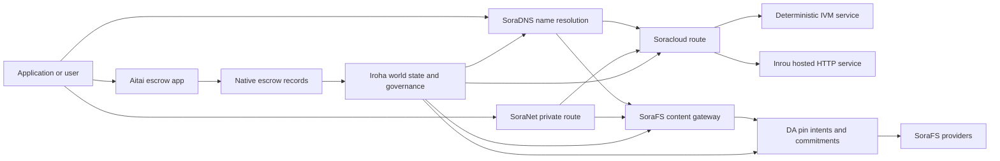

# SORA Nexus მომსახურება {#sora-nexus-services}

SORA Nexus დამატება აპლიკაციის მიმართულებით მომსახურების თვითმფრინავები გარშემო Iroha 3. ეს სერვისები
ეს არ არის ცალკე რეგისტრაციები. ისინი დამყარებულია Iroha მსოფლიო სახელმწიფო, Norito
მანიფესტები, მმართველობის ჩანაწერები და Torii საგზაო ოჯახები.

ხელმისაწვდომობა დამოკიდებულია კვანძის მშენებლობაზე და ქსელის პროფილზე.
[`/openapi`](/ka/reference/torii-endpoints.md#app-and-sora-route-families) დაწვრილებით
მიზნობრივი კვანძი, როგორც დასაშვები მარშრუტების ავტორიტეტული სია.

## კომპონენტების რუკა {#component-map}

| კომპონენტი              | როლი                                                                                                                                        | ძირითადი ზედაპირები                                                                            |
| ---------------------- | ------------------------------------------------------------------------------------------------------------------------------------------- | ---------------------------------------------------------------------------------------- |
| Soracloud              | აპლიკაციების განთავსება, ჰოსტებული სერვისები, კერძო მოდელი/სამუშაო დროის მდგომარეობა და მომსახურების სიცოცხლის ციკლის კონტროლი.                                        | `/v1/soracloud/*`, `/api/*`, `iroha app soracloud ...`                                   |
| ინრუ                  | Soracloud მასპინძლობს HTTP მომსახურების რევიზიონებისთვის გაშვების დრო, რომელიც საჭიროებს ცოცხალ HTTP ავილი.                                                            | Soracloud runtime კონფიგურაცია, მასპინძელი შესაძლებლობების რეკლამები, replica runtime მდგომარეობა                 |
| SoraNet                | კონფიდენციალურობა და ტრანსპორტის გადაფარვა მილები, რელე-ტრაფიკი, VPN, გაერთიანეთ სესიები და სტრიმინგი.                                     | `/v1/connect/*`, `/v1/vpn/*`, SoraNet მარშრუტის მეტა მონაცემები                                     |
| მონაცემთა ხელმისაწვდომობა (DA) | მტკიცებულებების ხელმისაწვდომობა, ვალდებულება და სასარგებლო ტვირთებისათვის განკუთვნილი შერწყმის ფენა Nexus ბილიკები, SoraFS აჟღერებს და მტკიცებულებები დგება. | `/v1/da/*`, `FindDaPinIntent*`, `[sumeragi.da]`                                          |
| SoraFS                 | კონტენტზე დარეგისტრირებული სათავსო ქსოვილები მანიფესტებისთვის, CAR სასარგებლო ტვირთები, ჩაკეტილი შინაარსი, კარიბჭეების მოპოვება და აღდგენის მტკიცებულებების ნაკადები.           | `/v1/sorafs/*`, `/sorafs/*`, `FindSorafsProviderOwner`                                   |
| SoraDNS                | დეტერმინისტური დასახელება და მრეგულირებელი ატესტაციის ფენა SORA-მასპინძლე სერვისები და შინაარსი.                                                   | `/v1/soradns/*`, `/soradns/*`, resolver დირექტორი მოვლენები                                 |
| აიტაი                  | აპლიკაციის დონეზე ფირმის და აქტივების ანგარიშსწორების კორიდორი, რომელსაც მხარს უჭერენ ადგილობრივი საფინანსო ანგარიშები და არა ცალკე წიგნი.                                     | `OpenAssetEscrow`, `FindAssetEscrow*`, `EscrowEventFilter`, Kotodama `escrow_*` შენობა-ნაგებობები |



## ჩვეულებრივი ნაკადები {#common-flows}

### მასპინძლული Split აპლიკაცია {#hosted-split-application}

ტიპიური შერეული აპლიკაცია იყენებს ყველა ნაჭერს ერთად:

1. სტატიკური ფრონტენდის აქტივები შეფუთულია და ჩაკეტილია SoraFS.
2. საჯარო მასპინძელი, მაგალითად `<app>.sora`, რეგისტრირებულია
   SoraDNS.
3. Soracloud მარშრუტები `/api/v1/search` ან `/api/v1/stream` ინრუზე HTTP
   მომსახურება.
4. Soracloud მარშრუტები `/api/auth` და `/api/v1/user` დეტერმინისტური IVM
   მენეჯმენტები.
5. კლიენტებს, რომლებსაც პირადი ცხოვრების მოთხოვნა სჭირდებათ, შეუძლიათ მიაღწიონ იმავე შინაარსს ან API მარშრუტი
   ა-ის საშუალებით SoraNet რაკეტა.

| გზა              | საყრდენი თვითმფრინავი         | რატომ?                                               |
| ----------------- | --------------------- | ------------------------------------------------- |
| `/`               | SoraFS სტატური შემცველობა | რეპროდუქციული შინაარსის root და gateway caching     |
| `/assets/*`       | SoraFS სტატური შემცველობა | შინაარსის მიხედვით განსაზღვრული აქტივები და მანიფესტურები      |
| `/api/auth*`      | Soracloud IVM         | ავტისა და საფულის გამოწვევის რეპლეი-საუვნებელი სახელმწიფო       |
| `/api/v1/user*`   | Soracloud IVM         | მმართველობის მიმართ მგრძნობიარე სახელმწიფო მუტაციები              |
| `/api/v1/search*` | Soracloud ინრუ       | ცოცხალი HTTP სერვისი, კეისი, SSE, ან კოლექტორის სახელმწიფო |

### შინაარსის გამოქვეყნება {#content-publication}

SoraFS გამოცემა წარმოქმნის მდგრადი არტეფაქტებს, სანამ სახელწოდება მათზე მიუთითებს:

1. შექმენით სასარგებლო ტვირთი ან დირექტორი.
2. შეავსეთ იგი a CAR საარქივო და ნაწილის გეგმა.
3. აწარმოე Norito მანიფესტი პინი პოლიტიკისა და მართვის მონაცემებით.
4. წარადგინეთ განცხადება Torii.
5. დაფიქსირება a DA განზრახვა ან ხელმისაწვდომობის ვალდებულება, როდესაც მიზანი
   პროფილისათვის საჭიროა მკაფიო მტკიცებულებები.
6. დააკავშიროთ მანიფესტი a SoraDNS სახელი ან Soracloud სტატიკური წინა კუთხის მარშრუტი.

### კერძო მიყვანა ან გადაცემის მარშრუტი {#private-fetch-or-streaming-route}

SoraNet შეიძლება იჯდეს წინ SoraFS ან Soracloud:

1. კლიენტმა სახელი ან მანიფესტი გადაწყვიტა.
2. დაცვის დირექტორი ან მარშრუტის მანიფესტი ირჩევს შესასვლელ და გასასვლელ რელეებს.
3. სატრანსპორტო მოძრაობა შეფუთულია და გადაგზავნილია SoraNet რაკეტა.
4. გამოსასვლელი რელე მიაღწევს SoraFS კარიბჭე Torii ნაკადი, ან Soracloud
   რუტა.

## აიტაი {#aitai}

აიტაი არის SORA პროგრამის კორიდორი ბაზრის სტილის დათმობისთვის, სადაც
მყიდველი და გამყიდველი კოორდინირებენ გადახდას ჯაჭვის გარეთ, ხოლო Iroha აკონტროლებს
ქონების მფლობელობა ჯაჭვზე. ის უნდა გამოიყენოს მშობლიური საფინანსო ინსტრუქციის ოჯახი
ხელშეკრულების საკუთრებაში არსებული საფინანსო ანგარიშის ნაცვლად ახალი ციფრული აქტივების დაცვისთვის
მდინარეები.

მფლობელი ინახავს აღნიშნულ წიგნში. გამყიდველი იხსნის შეთავაზებას
`OpenAssetEscrow`, მყიდველი იღებს და აღნიშნავს გადახდას არაფრის ჯაჭვიდან:
`AcceptAssetEscrow` და `MarkEscrowPaymentSent`, და გამყიდველი გათავისუფლებს
მქონე `ReleaseAssetEscrow` ან გააუქმებს, სანამ გადახდა აღნიშნულია. თუ მყიდველი და
გამყიდველი არ ეთანხმება, ორივე მხარეს შეუძლია დავა გახსნას და გადაწყვიტოს
`CanResolveEscrowDispute` შეუძლია დანაწილოს დაბლოკული თანხა.

მთელ სიცოცხლის ციკლზე, გენერული აქტივების საკეტები, ანონიმური დაფარვა, გამოკითხვები,
მოვლენები და Rust მაგალითები, იხილეთ
[ნაციონალური აქტივების გადახდა](/ka/blockchain/escrow.md).

| აიტაის ზედაპირი                                                                                                                                                 | გამოიყენეთ იგი                                                                                |
| ------------------------------------------------------------------------------------------------------------------------------------------------------------- | ----------------------------------------------------------------------------------------- |
| `OpenAssetEscrow`, `AcceptAssetEscrow`, `MarkEscrowPaymentSent`, `ReleaseAssetEscrow`, `CancelAssetEscrow`                                                    | ციფრული აქტივების გამჭვირვალე შეთავაზებები, მათ შორის XOR- ნომინირებული დასახლების ნაკადები.             |
| `OpenAnonymousAssetEscrow`, `AcceptAnonymousAssetEscrow`, `MarkAnonymousEscrowPaymentSent`, `ReleaseAnonymousAssetEscrow`, `CancelAnonymousAssetEscrow`       | შემცველი შეთავაზებები, როდესაც დაფინანსებისა და დახურვის მოძრაობები მტკიცებულებების თანდართვით განხორციელდება. |
| `OpenEscrowDispute`, `ResolveEscrowDispute`, `OpenAnonymousEscrowDispute`, `ResolveAnonymousEscrowDispute`                                                    | სადავო ჩარევა და სასამართლო წესით გადაჭრა.                                                 |
| `FindAssetEscrowById`, `FindAssetEscrowsBySeller`, `FindAssetEscrowsByBuyer`, `FindAssetEscrowsByStatus`                                                      | აპლიკაციის სტატუსის გვერდები, შეთანხმების სამუშაოები და მხარდაჭერის ინსტრუმენტები.                               |
| `EscrowEventFilter`                                                                                                                                           | ცოცხალი გამჭვირვალე საფინანსო აბონენტები საფინანსოს იდენტიფიკაციით, გამყიდველის, მყიდველის და სტატუსის ან ღონისძიების ტიპის მიხედვით. |
| Kotodama `escrow_open_offer`, `escrow_accept`, `escrow_mark_payment_sent`, `escrow_release`, `escrow_cancel`, `escrow_open_dispute`, `escrow_resolve_dispute` | Kotodama ხელშეკრულების ზარები, რომელსაც მხარს უჭერს V1 საფინანსო სისკალები.                                 |

საზოგადოებისთვის Taira ან Minamoto გამოყენება, მკურნალობა off-chain გადახდის რკინიგზა და
ნებისმიერი მხარდაჭერის ან სასამართლოს სამუშაო პროცესის გამოყენება განაცხადის პოლიტიკის ფარგლებში. Iroha დაფიქსირება
მფლობელობის მდგომარეობა, სიცოცხლის ციკლის მოვლენები, მტკიცებულებების ჰეშები და აქტივების საბოლოო მოძრაობა;
იგი არ ადასტურებს ფიატური ანგარიშსწორების დამოუკიდებლობას.

## შეამოწმეთ მიზნობრივი კვანძი {#check-a-target-node}

ამ გვერდიდან მაგალითების გამოყენებამდე დაადასტურეთ, რომ არსებობს მარშრუტის ოჯახი
კვანძზე, რომელსაც მიზნად ისახავთ:

```bash
export TORII_URL=https://taira.sora.org

curl -fsS "$TORII_URL/openapi.json" \
  | jq '.paths | keys[] | select(test("^/v1/(soracloud|sorafs|soradns|connect|vpn|da)/"))'

curl -fsS "$TORII_URL/status" | jq .
```

თუ: `/openapi.json` არ არის გამოფენილი პროფილის მიერ, შეეცადეთ `/openapi`. ზუსტად
მარშრუტის ხელმისაწვდომობა დამოკიდებულია შენობის მახასიათებლებსა და ქსელის კონფიგურაციაზე.

### Taira მხოლოდ სიგარეტის წაკითხვა {#taira-read-only-smoke-checks}

საზოგადოება Taira საბოლოო წერტილი სასარგებლოა წაკითხვის მხარის შემოწმებისთვის, მაგრამ არ გამოიყენოთ იგი
მუტაციური მაგალითებისათვის, თუ თქვენ არ ფუნქციონირებთ ავტორიზებულ ანგარიშს და
აპირებთ ცოცხალი მდგომარეობის შეცვლას.

```bash
export TORII_URL=https://taira.sora.org

curl -fsS "$TORII_URL/status" \
  | jq '{version: .build.version, peers, blocks, lanes: (.teu_lane_commit | length)}'

curl -fsS "$TORII_URL/v1/connect/status" | jq '{enabled, sessions_active}'

curl -fsS "$TORII_URL/v1/vpn/profile" \
  | jq '{available, relay_endpoint, supported_exit_classes}'

curl -fsS "$TORII_URL/v1/sorafs/storage/state" \
  | jq '{bytes_capacity, bytes_used, pin_queue_depth, por_inflight}'

curl -fsS -H 'Accept: application/json' "$TORII_URL/v1/soracloud/status" \
  | jq '.control_plane | {service_count, services: [.services[] | {service_name, current_version}]}'
```

Taira შეიძლება გამოავლინოს განთავსების სპეციფიკური მართვის თვითმფრინავის მარშრუტები, რომლებიც არ არის
დასახელებულია OpenAPI რუკა გადმოვარდნაზე. `/openapi` როგორც წარმოქმნილი პირველადი
API კონტრაქტი, შემდეგ დაუდასტურეთ ნებისმიერი განთავსების სპეციფიკური მარშრუტი პირდაპირ ადრე
დოკუმენტაცია როგორც ცოცხალი.

## Soracloud {#soracloud}

Soracloud ეს არის SORA აპლიკაციის კონტროლის თვითმფრინავი. იგი თვალყურს ადევნებს განთავსებას
ბუნდები, მომსახურების რევიზიები, მარშრუტირება, განხორციელების მდგომარეობა, ავტორიტეტული კონფიგურაცია
ჩანაწერები, დაშიფვრილი მომსახურების საიდუმლოებები, რეესტრის მოდელები, კერძო
დასკვნა სესიები, და runtime მიღების.

Soracloud იყენებს ორ განხორციელების თვითმფრინავს:

| აღსრულების თვითმფრინავი        | გაშვების დრო | გამოიყენეთ იგი                                                                                   |
| ---------------------- | ------- | -------------------------------------------------------------------------------------------- |
| `DeterministicService` | `Ivm`   | ავტორი, საფონდო მდგომარეობა, სერტიფიცირებული წაკითხვები, დავალებული ფოსტის ყუთების მენეჯერები, მმართველობის მიმართ მგრძნობიარე მუტაციები |
| `HttpService`          | `Inrou` | ცოცხალი HTTP APIs, კოლექციური სამუშაოები, კეიშის მხარდაჭერილი სერვისები; SSE, ბრაუზერის დახმარებით გადაადგილება     |

ოპვრთრთნარაჲ, აჟრაჲნარა, რალბაკ, კონფიგრაჲ,
საიდუმლო, მოდელი და სტატუსის ბრძანებები გადმოწერეთ Torii და წაკითხული ჩადენილი
მსოფლიო სახელმწიფო; ისინი არ ეყრდნობიან ცალკე CLI- ლოკალური სარკე.
მარშრუტი არის ყველაზე გრძელი პრეფისზე დაფუძნებული, ასე რომ ერთი რეგისტრირებული მასპინძელს შეუძლია ავტოტრაფიკის გაყოფა
მასპინძლებს შორის HTTP მარშრუტები და დეტერმინისტური API მარშრუტები.

### გაშლილი აპლიკაციის დაწყება {#scaffold-a-split-app}

განცალკევებული აპლიკაციის შაბლონი ქმნის სტატიკურ ფრონტენდს და ერთს ჰოსტავს პირდაპირ API
და ერთი დეტერმინისტური საფარი/API მომსახურება:

```bash
iroha app soracloud app init \
  --template split-app \
  --app-name solswap_indexer \
  --app-version 0.1.0 \
  --public-host solswap-indexer.sora \
  --output-dir ./apps/solswap-indexer

iroha app soracloud app local-plan \
  --manifest ./apps/solswap-indexer/app_manifest.json

iroha app soracloud app doctor \
  --manifest ./apps/solswap-indexer/app_manifest.json
```

`local-plan` დაბეჭდავს მარშრუტის განყოფილებას, ბავშვთა მომსახურების მანიფესტს, სამუშაო სივრცეს
სკრიპტის გზები და მოსალოდნელი ფრონტენდის გამოქვეყნების რეჟიმი. `doctor`
ადასტურებს ადგილობრივ გათავისუფლების ხელშეკრულებას, სანამ თქვენ ჩართავთ Torii.

### განლაგება და აპლიკაციის მდგომარეობის შემოწმება {#deploy-and-inspect-app-state}

```bash
export SORACLOUD_TORII_URL=https://<soracloud-enabled-torii>

iroha app soracloud app deploy \
  --manifest ./apps/solswap-indexer/app_manifest.json \
  --torii-url "$SORACLOUD_TORII_URL"

iroha app soracloud app status \
  --manifest ./apps/solswap-indexer/app_manifest.json \
  --torii-url "$SORACLOUD_TORII_URL"
```

უკვე განთავსებული სერვისისათვის გამოიყენეთ სერვის-სკოპული ბრძანებები:

```bash
iroha app soracloud status \
  --service-name solswap_indexer_live \
  --torii-url "$SORACLOUD_TORII_URL"

iroha app soracloud rollback \
  --service-name solswap_indexer_live \
  --target-version 0.1.0 \
  --torii-url "$SORACLOUD_TORII_URL"
```

### კონფიგურაცია და საიდუმლო მასალა {#config-and-secret-material}

Soracloud კონფიგურაცია და საიდუმლო შეტყობინებები არის ავტორიტეტული განთავსების ნაწილი
სახელმწიფო. განლაგება, გაუმჯობესება და გადახურვა ვერ ჩაიკეტა საჭირო კონფიგურაციის ან
საიდუმლო კავშირები აკლია ან არ შეესაბამება აქტიურ მანიფესტებს.

```bash
iroha app soracloud config-set \
  --service-name solswap_indexer_live \
  --config-name indexer/public_config \
  --value-file ./config/public-config.json \
  --torii-url "$SORACLOUD_TORII_URL"

iroha app soracloud secret-set \
  --service-name solswap_indexer_live \
  --secret-name indexer/api_key \
  --secret-file ./secrets/api-key.envelope.json \
  --torii-url "$SORACLOUD_TORII_URL"
```

გამოიყენეთ CLI თქვენი პროფილის მიერ მოთხოვნილი ზუსტი საკრედიტაციო ნიშნების დასახელება:

```bash
iroha app soracloud config-set --help
iroha app soracloud secret-set --help
```

## ინრუ {#inrou}

ინრუ არის მასპინძელი HTTP გამოყენებული გამშვები დრო Soracloud. ან Iroha კვანძთან ერთად
ჩასმული Soracloud დაშვებული სამუშაო დროის პროექტები Soracloud სახელმწიფო ადგილობრივ
მატერიალიზაციის გეგმა, იწყებს დანიშნული ჰოსტებული მომსახურების რეპლიკები როგორც loopback
სერვისები, და ანგარიშები რეპლიკა runtime სახელმწიფო უკან ავტორიტეტული
მოდელი.

გამოიყენეთ Inrou სამუშაო დატვირთვებისთვის, რომლებზეც საჭიროა პირდაპირი HTTP ზედაპირი, როგორიცაა:
კოლექციური მძიმე APIs, SSE დინამეტრები, კეიშის მხარდაჭერილი მენეჯერები ან
ბრაუზერით დამხმარე სერვისები.

### გაშვების დროის მოთხოვნა {#runtime-requirements}

- კონტეინერის მანიფესტის გამშვები დრო უნდა იყოს `Inrou`.
- სამსახურის მანიფესტის შესრულების თვითმფრინავი უნდა იყოს `HttpService`.
- `HttpService + Inrou` საჭიროებს ზუსტად ერთს `PersistentRootLeaseVolume`
  დამონტაჟებული `/`.
- რეპლიკირებული Inrou სერვისები ასევე საჭიროებს საერთო მომსახურებას ან კონფიდენციალურ იჯარას
  შენახვა, როდესაც ისინი ინარჩუნებენ ცვალებად საერთო მდგომარეობას.
- წარმოების ჰოსტინგის კვანძები უნდა რეკლამირდეს რეალური Inrou- ის სიმძლავრე ნაცვლად
  ოპერირება მხოლოდ პროქსის სახით.

### გამოხატული ფრაგმენტი {#manifest-fragment}

ქვემოთ მოცემული მაგალითი აჩვენებს ორი მანიფესტის ფორმას. ეს არის ნაჭერი,
არ არის სრული განთავსების ბუნეტი.

```jsonc
// container_manifest.json
{
  "schema_version": 1,
  "runtime": { "runtime": "Inrou", "value": null },
  "bundle_path": "/bundles/solswap-indexer.inrou",
  "entrypoint": "/app/bin/launch-indexer.sh",
  "args": [],
  "env": {
    "RUST_LOG": "info",
  },
  "inrou": {
    "schema_version": 1,
    "guest_os": { "guest_os": "DebianSlim", "value": null },
    "guest_images": {
      "x86_64": {
        "kernel_image_path": "/inrou/x86_64/vmlinux",
        "rootfs_image_path": "/inrou/x86_64/rootfs.ext4",
        "initrd_image_path": null,
      },
      "aarch64": {
        "kernel_image_path": "/inrou/aarch64/vmlinux",
        "rootfs_image_path": "/inrou/aarch64/rootfs.ext4",
        "initrd_image_path": null,
      },
    },
  },
  "lifecycle": {
    "start_grace_secs": 60,
    "stop_grace_secs": 30,
    "healthcheck_path": "/api/indexer/v1/health",
  },
}
```

```jsonc
// service_manifest.json
{
  "schema_version": 1,
  "service_name": "solswap_indexer_live",
  "service_version": "0.1.0",
  "execution_plane": { "execution_plane": "HttpService", "value": null },
  "replicas": 2,
  "route": {
    "host": "solswap-indexer.sora",
    "path_prefix": "/api/v1/search",
    "service_port": 8080,
    "visibility": { "visibility": "Public", "value": null },
    "tls_mode": { "tls": "Required", "value": null },
  },
  "lease_volumes": [
    {
      "volume_name": "root_disk",
      "kind": {
        "lease_volume": "PersistentRootLeaseVolume",
        "value": null,
      },
      "storage_class": { "storage_class": "Warm", "value": null },
      "mount_path": "/",
      "max_total_bytes": 8589934592,
    },
    {
      "volume_name": "index_state",
      "kind": { "lease_volume": "ServiceLeaseVolume", "value": null },
      "storage_class": { "storage_class": "Warm", "value": null },
      "mount_path": "/var/lib/solswap-indexer",
      "max_total_bytes": 1073741824,
    },
  ],
}
```

გაშვების დროს, თითოეული დამონტაჟებული იჯარის მოცულობა გარემოს საშუალებით გამოფენილია
მოცულობის სახელწოდებიდან გამომდინარე ცვლადი:

```text
SORACLOUD_LEASE_VOLUME_ROOT_DISK_DIR
SORACLOUD_LEASE_VOLUME_ROOT_DISK_MOUNT_PATH
SORACLOUD_LEASE_VOLUME_INDEX_STATE_DIR
SORACLOUD_LEASE_VOLUME_INDEX_STATE_MOUNT_PATH
```

## SoraNet {#soranet}

SoraNet არის კონფიდენციალურობა და სატრანსპორტო overlay. იგი უზრუნველყოფს relay-based
ტრანსპორტის მარშრუტები, რომლებიც არ უნდა დაუკავშირდნენ მიზნობრივი კარიბჭეს
ან მომსახურება. სატრანსპორტო დიზაინი იყენებს შესასვლელ, შუა და გასასვლელი რელე როლებს,
QUIC ტრანსპორტი, ხმაურზე დაფუძნებული ჰიბრიდული ხელის შეხება, შესაძლებლობების მოლაპარაკებები,
რელიე დირექტორი მეტა მონაცემები და ფიქსირებული ზომის შეფუთული უჯრედები.

დაწვრილებით Nexus განთავსება, SoraNet შეუძლია შეტანილი შინაარსის მოძიება, კარიბჭეების მოძრაობა,
VPN ან Connect სესიები, და Norito გადამზიდველი მარშრუტები. დირექტორიში შესვლა შეიძლება
აღნიშნული მხარდაჭერის მარკის რელიეები `norito-stream`, რომელიც მომხმარებლებს საშუალებას აძლევს აირჩიონ მარშრუტები
შესაფერისი Torii RPC ან ტრანსპორტის მიმოქცევა.

### სტრიმინგის კონფიგურაცია {#streaming-configuration}

სააგენტო Nexus პროფილის შესაძლებლობა SoraNet გადაცემის მარშრუტების უზრუნველყოფა:

```toml
[streaming]
feature_bits = 0b11

[streaming.soranet]
enabled = true
exit_multiaddr = "/dns/torii/udp/9443/quic"
padding_budget_ms = 25
access_kind = "authenticated"
provision_spool_dir = "./storage/streaming/soranet_routes"
provision_spool_max_bytes = 0
provision_window_segments = 4
provision_queue_capacity = 256
```

გამოყენება `access_kind = "read-only"` შინაარსის მარშრუტებისთვის, რომლებიც არ საჭიროებენ
მაყურებლის ავთენტიფიკაცია. გამოყენება `authenticated` როდესაც გამოსასვლელი რელე უნდა ამოქმედდეს
ბილეთები ან მაყურებლის ვინაობა, სანამ ხიდი Torii ან მასპინძელი სერვისი.

### SoraNet-მოგეხსენებათ. SoraFS მოიტანე. {#soranet-aware-sorafs-fetch}

სააგენტო SoraFS შეძენა CLI შეუძლია გამოიყოს ადგილობრივი proxy manifesto და spool SoraNet
ბრაუზერის გაფართოებების მარშრუტის მეტა მონაცემები ან SDK ადაპტერები:

```bash
sorafs_cli fetch \
  --plan artifacts/payload_plan.json \
  --manifest-id 7bb2...9d31 \
  --provider name=alpha,provider-id=9f5c...73aa,base-url=https://gw-alpha.example.org/,stream-token="$(cat alpha.token)" \
  --output artifacts/payload.bin \
  --json-out artifacts/fetch_summary.json \
  --local-proxy-manifest-out artifacts/proxy_manifest.json \
  --local-proxy-mode bridge \
  --local-proxy-norito-spool storage/streaming/soranet_routes \
  --local-proxy-kaigi-spool storage/streaming/soranet_routes \
  --local-proxy-kaigi-policy authenticated \
  --max-peers=2 \
  --retry-budget=4
```

შეჯამებული ჩანაწერების მომწოდებლის ანგარიშები, ნაწილის მიღებები, ადგილობრივი პროქსული მეტა მონაცემები,
და ეფექტური მარშრუტის პარამეტრები, რომლებიც გამოყენებულია მოზიდვისთვის.

## მონაცემთა ხელმისაწვდომობა (DA) {#data-availability-da}

DA არის ხელმისაწვდომობის მტკიცებულების ფენა სასარგებლო ტვირთებისთვის, რომლებიც ძალიან დიდია
კონფიდენციალურობისადმი მგრძნობიარე, ან ზედმეტად სერვისის სპეციფიკური, რომ პირდაპირ მსოფლიოში განთავსდეს
სახელმწიფო. ის აღნიშნავს დეტერმინისტურ ვალდებულებებს და მოპოვების ვალდებულებებს, ასე რომ
ვალიდატორები, გეტვები და კლიენტები შეიძლება შეთანხმდნენ რა ბაიტები იყო დაპირებული,
რა პოლიტიკა გამოიყენება და რომელი მტკიცებულებებია აღნიშნული.

DA არ შეიცავს Kura ან SoraFS:

- Kura ინახავს საბოლოო ბლოკის ნაკადის და კონსენსუსის აღდგენის მონაცემებს.
- SoraFS ინახება და ემსახურება შინაარსის მიმართულებით ბითებს, CAR სასარგებლო ტვირთები და
  მანიფესტები.
- DA ჩანაწერები ვალდებულებების, მტკიცებულების პოლიტიკის, მტკიცებულება გახსნის და pin განზრახვა
  რომელიც საშუალებას აძლევს იმ ბაიტებს დაგეგმონ, აუდიტირდნენ და დაუკავშირდნენ მთავარ წიგნს
  სახელმწიფო.

გამოყენება DA როდესაც განაცხადი ან Nexus ლეინს სჭირდება წიგნში ხილული დაპირება
რომ off-chain მონაცემები რჩება ამოღებადი. ჩვეულებრივი მაგალითები მოიცავს lane
სასარგებლო ტვირთის ვალდებულებები ანგარიშსწორების ნაკადებისთვის, SoraFS გამოქვეყნებული პინების განზრახვა
შინაარსი, მტკიცებულებების ბუნდები, რომლებიც შემდგომ შემოწმების მიზნით უნდა შენარჩუნდეს; და
გამოყენების არტეფაქტები, რომელთა საჯარო მდგომარეობა უნდა იყოს დიგესტი და არა
მთლიანი სასარგებლო ტვირთი.

### სიცოცხლის ციკლი {#lifecycle}

| სცენა      | რა არის ჩაწერილი                                                                                                                                      |
| ---------- | ----------------------------------------------------------------------------------------------------------------------------------------------------- |
| განზრახვა     | ბილეთი, რეფერენციის მანიფესტი, alias, ზოლი/epoch/sequence რეფერენცია, შენახვის პოლიტიკა ან რეპლიკაციის მიზანი.                                          |
| ვალდებულება | შეარჩიეთ მასალა, რომელიც ამაყობს მანიფესს, ბილიკის სასარგებლო დატვირთვას, დამტკიცების ბუნდელს ან შინაარსის ფესვს წიგნის ჩანაწერზე.                                    |
| მტკიცებულებები   | ხელმისაწვდომობის ხმები, მტკიცებულებების გახსნა, პროვაიდერის ატესტაციები ან სხვა პროფილურ-სპეციფიკური მტკიცებულება, რომელიც მიღებულია მიზნობრივი ქსელის მიერ.                         |
| კითხვები      | პინ-ნტენის შესწავლა `FindDaPinIntentByTicket`, `FindDaPinIntentByManifest`, `FindDaPinIntentByAlias`, ან `FindDaPinIntentByLaneEpochSequence`. |

ჩვეულებრივი DA- მხარდაჭერილი გამოქვეყნების ნაკადი არის:

1. შექმნას ან მიიღოს სასარგებლო ტვირთი გარეთ WSV, მაგალითად, SoraFS CAR
   ფაილი ან Nexus სარკეზე დატვირთვა.
2. hash და აღწერეთ სასარგებლო ტვირთის Norito მანიფესტური ან მარშრუტის სპეციფიკური
   ვალდებულების ჩანაწერი.
3. წარუდგინეთ მანიფესტი, ნებართვა ან ვალდებულება `/v1/da/*` როდესაც
   რომ მარშრუტის ოჯახი ჩართულია, ან ქსელის მიერ ხელმოწერილი
   ტრანზაქციის გზა.
4. მოთხოვნილი მტკიცებულებების შეგროვება ვალდებული იყოს დამტკიცებლების ან ხელმისაწვდომობის მომწოდებელთა მიერ
   აქტიური მტკიცებულების პოლიტიკით.
5. შეკითხვა შედეგად pin განზრახვა ან ვალდებულება, სანამ პოპულარიზაცია alias,
   ანგარიშსწორების მტკიცებულება, ან კარიბჭის მარშრუტი, რომელიც დამოკიდებულია სასარგებლო ტვირთზე.

### ალგორითმური მოდელი {#algorithmic-model}

DA გარდაქმნის სასარგებლო ტვირთს ხელმოწერილი, გათამაშებისგან დაცული, ბლოკ-ინდექსირებული ვალდებულება.
მნიშვნელოვანი ალგორითმები დეტერმინისტურია, ასე რომ ვალიდატორებმა და გეიტვეიმებმა შეიძლება
ამავე ბაიტებისგან იგივე დიგესტები გადაითვალოთ.

1. **კანონიკულირეთ წარდგენილი სასარგებლო ტვირთი.** Torii მიიღებს მიღების მოთხოვნას
   `(lane_id, epoch, sequence)`, სასარგებლო ტვირთის ბაიტები, შეკვამვის მეტა მონაცემები, ნაჭერი
   ზომა, წაშლის პროფილი, შენახვის პოლიტიკა და გამგზავრებლის ხელმოწერა.
   გაშლის gzip, deflate ან Zstandard სასარგებლო ტვირთები, როდესაც მოთხოვნა, შემდეგ
   ადასტურებს, რომ კანონიკური ბაიტის სიგრძე თანაბარია `total_size`.
2. **ბილიკისა და ნაწილის პარამეტრების ვალიდირება.** ბილიკი უნდა არსებობდეს Nexus
   კალათოლიკოსი. `chunk_size` უნდა იყოს არა ნულოვანი სიმძლავრე ორი, მინიმუმ ორი
   ბაიტები, და არ უნდა იყოს მეტი კონფიგურირებული მაქსიმალური.
   მოიცავს მონაცემთა ნაჭრებს და მინიმუმ ორ პარიტეტულ ნაჭერს. მარშრუტის კატალოგი ირჩევს
   მტკიცებულების სისტემა, ან `merkle_sha256` ან `kzg_bls12_381`.
3. **გამოიყენეთ ქსელის პოლიტიკა.** კვანძი აამოქმედებს კონფიგურირებულ რეპლიკაციას და
   ბლობ კლასის შენახვის საწყისი ხაზები. საჯარო მეტატალღები უნდა დარჩეს ცალსახად ტექსტური;
   მხოლოდ მმართველობის მეტა მონაცემები დაშიფრულია ნოდის კონფიგურირებული მმართველობით
   მეტა მონაცემების გასაღები მანამდე, სანამ ის მანიფესტში დაიწერება.
4. **ნაპაგჲ და ნაპაგწ.** კანონიკური სასარგებლო ტვირთის ნაჭერი ფიქსირებული ზომის
   პროფილის მიღება `chunk_size`. Torii გამოთვლის სასარგებლო ტვირთის დიგესტი,
   მტკიცებულების აღდგენის ხის ფესვი და ერთ ნაწილზე ვალდებულებები. მონაცემთა ნაწილის
   ტარება BLAKE3 ვალდებულებები მათ ბაიტებზე.
5. **დამატება წაშლის ვალდებულებები.** ჭრილობები დაჯგუფებულია ზოლებად
   `data_shards`. საბოლოო ზოლში დაკარგული უჯრედები ნულოვანი შეფუთულია თანაბარობისთვის
   გათვლა. RS(16) პარიტეტის შექმნის რიგები / გლობალური პარიტეტული ნაწილის;
   `row_parity_stripes` დაამატეთ რგოლების ტიპის ზოლი მატრიცის მასშტაბით.
   პარიტეტის ნაჭრის ვალდებულებები BLAKE3 პატარა ანდიის დიჟეტები `u16` სიმბოლოები.
6. **ნაოპაგთ მანიფეს.** `DaManifestV1` დაფიქსირებულია ზოლი, ეპოქა, ბლობ კლასი,
   კოდეკი, სასარგებლო ტვირთის მონახულება, ნაწილის ფესვა, ნაწილისა ზომა, წაშლის პროფილი, შენარჩუნება
   პოლიტიკა, ქირაობის კოტირება, ნაწილის ვალდებულებები, ვარიანტი IPA ვალდებულება, მეტა მონაცემები,
   შენახვის ბილეთი არის დეტერმინისტური: კვანძი პირველად hashes a
   მანიფესტი შაბლონი ცარიელი ბილეთით, შემდეგ წერს თითის ანაბარს როგორც
   საბოლოო `storage_ticket`.
7. **უარი თქვათ რეპლეი კონფლიქტებზე.** რეპლეი კლავიზი არის
   `(lane_id, epoch, sequence, manifest_fingerprint)`. დუბლიკატი
   იგივე თითის ანაბეჭდია შეუძლებელი.
   სხვადასხვა თითის ანაბეჭდი უარყოფითია.
8. **ჟრფეთ ჟლსპვჟრთნარა ნაპაპაკა.** Torii გაანგარიშებს a PDP ვალდებულება, ხელს აწერს
   `DaIngestReceipt`, აწარმოებს `DaCommitmentRecord`, და წერს სროლის არტეფაქტებს
   სათქმელი, PDP ვალდებულება, ვალდებულების წარდგენა, ვალდებულებათა განრიგი;
   pin განზრახვა, მიღების ფაილი და მიღების ჩანაწერი. მიღება კურსორი წინ
   მონოტონიურად `(lane_id, epoch)`.

ბლოკები ატარებენ ჩანაწერებს. ჩანაწერი იკავებს:

- ზოლი, ეპოქა და თანმიმდევრობა
- დამრეკავის ბლოპი ID და კანონიკური მანიფესტის ჰეში
- სარკეების გამწმენდის სქემა
- ნაჭრის ფესვი
- ნებაყოფლობით KZG ვალდებულება KZG ბილიკები
- PDP/მტკიცებულების საჭმელი
- შენახვის კლასი და შენახვის ბილეთი
- Torii DA აღიარების ხელმოწერა

სანამ ბლოკი ჩაშენდება DA ჩანაწერები, ბლოკის შეკრების გზა ადასტურებს ბუნთს:

- `(lane_id, epoch, sequence)` უნდა იყოს უნიკალური ბუნდში.
- მანიფესტური ჰაშები უნდა იყოს არა ნულოვანი და უნიკალური ბუნდის შიგნით.
- ვალდებულების დამტკიცების სქემა უნდა შეესაბამებოდეს კონფიგურირებული ზოლის პოლიტიკას.
- მერკლის ზოლები უარყოფა KZG ვალდებულებები; KZG ზოლები მოითხოვს არა ნულოვანი KZG
  ვალდებულება.
- პინ განზრახვები კანონიზირებულია, დალაგებულია და ფილტრირებულია ბილიკით, მანიფესტ ჰაშით,
  შენახვის ბილეთი, მფლობელის ანგარიში და საიდუმლო-კოლიზიის წესები.

ბლოკის სათაური ინახავს hashes DA მტკიცებულების პოლიტიკა, ვალდებულებები და pin
განზრახვები. წევრობის მტკიცებულებებისათვის, ვალდებულების ბუნდი ასევე გამოფენს Merkle
ფესვი, რომლის ფოთლები კანონიკური ჰეშებია Norito-კოდირებული
`DaCommitmentRecord` მნიშვნელობები. მშობლიური კვანძები ჰაშის მარცხენა და კონკოტენაცია
სწორი ბავშვები; უცნაური ფოთლი არ იცვლება შემდეგ ფენაზე.

### მტკიცებულებების შემოწმება {#proof-verification}

`/v1/da/commitments/prove` შეუძლია წარმოადგინოს მტკიცებულება ერთ ბლოკში ერთ ვალდებულებაზე.
მტკიცებულება შეიცავს ვალდებულებას, ბლოკის სიმაღლეს, ინდექსს ბუნდაში, ბუნდა
hash, ბუნდის სიგრძე, Merkle root და ძმური გზა. შემოწმების შეამოწმება:

1. მტკიცებულების ბუნდლის ჰეში შეესაბამება ბლოკის სათაურს DA დავალების ჰაში.
2. მტკიცებულების ბლოკის სიმაღლე შეესაბამება მითითებულ ბლოკის სათაურს.
3. ინდექსი არის საზღვრებში და ვალდებულება შეადგენს ბუნდის მითითებას
   ინდექსი.
4. სარკე-გამძლეობის პოლიტიკა იღებს ვალდებულებას.
5. დავალების ფურცლიდან ძმური გზა გადასვლისას მიწოდებული
   ფესვი.
6. რეკონსტრუქციული ფესვი შეადგენს ბუნდის ფესვას.

ეს ადასტურებს, რომ კონკრეტული ხელმისაწვდომობის ვალდებულება შევიდა კონკრეტულ
ბლოკი სასარგებლო ტვირთის; ეს არ ადასტურებს, რომ ყველა რეპლიკა ამჟამად ონლაინ.
აღდგენის შესაძლებლობა ცალკე შემოწმდება SoraFS მიმწოდებლის შეძენა, PDP/PoTR
შემოწმება ან პროფილის სპეციფიკური ხელმისაწვდომობის მტკიცებულება.

### კონსენსუსის ინტერაქცია {#consensus-interaction}

DA არის დაკავშირებული Sumeragi საიმედო მაუწყებლის საშუალებით (RBC), მაგრამ ეს არ არის
მეორე საბოლოო პროტოკოლი. RBC გაავრცელებს და იბრუნებს წინადადებების სასარგებლო ტვირთებს:
შემოთავაზებელი აცხადებს სხდომას `(height, view, payload_hash)`, თანატოლები
გაცვლითი ნაჭრები და `READY`/`DELIVER` სიგნალები ადევნებს თვალყურს, არის თუ არა საკმარისი ვალიდატორები
დაინახა იგივე სასარგებლო ტვირთი.

დაწვრილებით Iroha 3, პარტნიორი განიხილავს მოქმედ ბლოკის სასარგებლო ტვირთის ხელმისაწვდომობას, როდესაც:

- ადგილობრივი მოქმედი ბლოკის ბაიტები ჰეშის მიხედვით მოსალოდნელი სასარგებლო ტვირთის ჰეშს, ან
- RBC აღადგინა სასარგებლო ტვირთი, რომელიც შეესაბამება ბლოკის ჰეშს, სიმაღლეს, ხედვას და
  პაეილოჟი ჰაში.

თუ არც ერთი პირობა არ შეესაბამება, თანატოლების ჩანაწერები `missing_local_data`, ცდილობს
სასარგებლო ტვირთის აღდგენა RBC ან ბლოკ სინქრონიზაცია და ანგარიშსწორება DA კარი
სტატუსი და ტელემეტრი. მიმდინარე განხორციელებისას, DA სიგნალები
საბოლოო განსაზღვრის შესახებ რეკომენდაციები: ბლოკი ჯერ კიდევ სრულდება კომიტეტის სერტიფიკატიდან პლუს
შესაბამისი ადგილობრივი სასარგებლო ტვირთი, და არა ცალკე DA კვორუმის მოწმობა.

DA დროის გაფართოება აღდგენის ფანჯრები. DA კვორუმის ვადა ამოქმედდება
კონფიგურირებული ბლოკიდან და commit timings, შემდეგ გამრავლებულია
`sumeragi.advanced.da.quorum_timeout_multiplier`. დისპონდენტობის ვადაა:
`max(quorum_timeout, availability_timeout_floor_ms) * availability_timeout_multiplier`.
სანამ ეს ხელმისაწვდომობის ვადა ამოიწურება, კვანძი უპირატესობას სარგებლო ტვირთის აღდგენა და
თავიდან აცილებს ნაადრევი გადაგეგმვა; მისი ამოწურვის შემდეგ, ნორმალური აღდგენა და
ხედვის შეცვლის გზები შეიძლება გაგრძელდეს.

### ოპერატორის შენიშვნები {#operator-notes}

Iroha 3 კონსენსუსის პროფილები მოიცავს RBC-გამოჭრილ სასარგებლო ტვირთების გავრცელება, მანიფესტი
მცველები, DA ბუნდული ვალიდენცია და აღდგენის ტელემეტრიის.
შაბლონის გამოფენა `[sumeragi.da]` ვალდებულებების და მტკიცებულებათა ღია განვადების შეზღუდვები
ბლოკი, პლუს `[sumeragi.advanced.da]` დროის გაამრავლებელი კვორუმისთვის და
ხელმისაწვდომობის ქცევა. შეინარჩუნეთ ეს პარამეტრები თანმიმდევრულად ერთში
ქსელის პროფილი.

რუტის აღმოჩენისთვის, დაიწყეთ კვანძით OpenAPI დოკუმენტი:

```bash
curl -fsS "$TORII_URL/openapi.json" \
  | jq '.paths | keys[] | select(startswith("/v1/da/"))'
```

გამოიყენეთ
[შეკითხვის რეფერენცია](/ka/reference/queries.md#nexus-data-availability-and-packages)
ამჟამად DA შეკითხვის სახელები და
[პარტნიორის კონფიგურაციის შაბლონი](/ka/reference/peer-config/) ადგილობრივი
`[sumeragi.da]` ბუშტები, რომლებიც გამოფენილია თქვენი მშენებლობით.

## SoraFS {#sorafs}

SoraFS არის დეცენტრალიზებული შინაარსის ადრესირებული შენახვის ქსოვილი.
ბაიტები დეტერმინისტურ ნაწილებად, CAR არქივები და Norito აჩვენებს, რომ
დააკავშიროთ შინაარსის ფესვები, შეჭრილი პროფილები, pin პოლიტიკები და მმართველობა
ატესტაციები. შენახვის პროვაიდერები რეკლამირებენ სიმძლავრესა და შინაარსს
ხელმისაწვდომობა, ხოლო გეითეიები ადასტურებენ მანამდე მანიფესებსა და ნაწილობრივ ვალდებულებებს
შემცველი შინაარსი.

ტიპიური SoraFS გამოყენება მოიცავს სტატიკური აპლიკაციების აქტივებს, დოკუმენტაციას
შენობა-ნაგებობები, ზონების ბუნდები, მოდელის ან არტეფაქტის მინიშნებები და მმართველობის მტკიცებულებები
ბუნდები. Iroha მონაცემთა მოდელის გამოხატვა SoraFS ღონისძიებები და a
[`FindSorafsProviderOwner`](/ka/reference/queries.md#nexus-data-availability-and-packages)
მოთხოვნა პროვაიდერის საკუთრების რეზოლუციის შესახებ.

### შეავსეთ, გამოაცხადეთ, ხელი მოაწერეთ და წარადგინეთ {#pack-manifest-sign-and-submit}

```bash
cargo run -p sorafs_car --features cli --bin sorafs_cli -- \
  car pack \
  --input ./dist \
  --car-out artifacts/site.car \
  --plan-out artifacts/site.chunk-plan.json \
  --summary-out artifacts/site.car-summary.json

cargo run -p sorafs_car --features cli --bin sorafs_cli -- \
  manifest build \
  --summary artifacts/site.car-summary.json \
  --manifest-out artifacts/site.manifest.to \
  --manifest-json-out artifacts/site.manifest.json \
  --pin-min-replicas=3 \
  --pin-storage-class=warm \
  --pin-retention-epoch=42

SIGSTORE_ID_TOKEN=$(oidc-client fetch-token) \
cargo run -p sorafs_car --features cli --bin sorafs_cli -- \
  manifest sign \
  --manifest artifacts/site.manifest.to \
  --bundle-out artifacts/site.manifest.bundle.json \
  --signature-out artifacts/site.manifest.sig

cargo run -p sorafs_car --features cli --bin sorafs_cli -- \
  manifest submit \
  --manifest artifacts/site.manifest.to \
  --chunk-plan artifacts/site.chunk-plan.json \
  --torii-url "$TORII_URL" \
  --resolve-submitted-epoch=true \
  --authority=<i105-account-id> \
  --private-key-file ./secrets/authority.ed25519 \
  --summary-out artifacts/site.manifest.submit.json \
  --response-out artifacts/site.manifest.submit.body
```

თუ: `/v1/sorafs/pin/register` არ არის განლაგებული მიზნობრივ კვანძზე, CLI შეიძლება
უკან დაცემა ხელმოწერილი `/transaction` წარდგენა და ელოდება ტერმინალს
მილსადენის სტატუსი.

### შეამოწმეთ და მოიტანეთ {#verify-and-fetch}

```bash
cargo run -p sorafs_car --features cli --bin sorafs_cli -- \
  proof verify \
  --manifest artifacts/site.manifest.to \
  --car artifacts/site.car \
  --chunk-plan artifacts/site.chunk-plan.json \
  --summary-out artifacts/site.verify.json

sorafs_cli fetch \
  --plan artifacts/site.chunk-plan.json \
  --manifest-id <manifest-digest-hex> \
  --provider name=primary,provider-id=<provider-id-hex>,base-url=https://gateway.example.org/,stream-token="$(cat provider.token)" \
  --output artifacts/site.fetch.tar \
  --json-out artifacts/site.fetch.json
```

### აღდგენილობის მტკიცებულების შემოწმება {#proof-of-retrievability-checks}

ოპერატორებს შეუძლიათ შეამოწმონ და გამოაქტიურონ შენახვის მიმწოდებლების მტკიცებულებების შემოწმება:

```bash
sorafs_cli por status \
  --torii-url "$TORII_URL" \
  --manifest <manifest-digest-hex> \
  --status=failed \
  --limit=20

sorafs_cli por trigger \
  --torii-url "$TORII_URL" \
  --manifest <manifest-digest-hex> \
  --provider <provider-id-hex> \
  --reason=latency_probe \
  --samples=48 \
  --auth-token artifacts/challenge_token.to
```

## SoraDNS {#soradns}

SoraDNS არის დეტერმინისტური დასახელების ფენა SORA მომსახურება და შინაარსი.
ნორმალიზებს სახელებს, ანკერებს resolver დირექტორი განახლებები Iroha, და
გადანაწილებს ხელმოწერილი ზონა ან resolver ბუნდების მეშვეობით SoraFS. რეზოლუტორები და
gateways დავადასტუროთ resolver ატესტაციის დოკუმენტები სანამ ნდობა აღმოჩენა
მეტა მონაცემები.

ბრაუზერის წვდომისთვის, SoraDNS იღებს gateway hosts რეგისტრირებული FQDN.
რეგისტრირებული სიმართლის მასპინძელი რჩება კანონიკური განაცხადის წარმოშობა, ხოლო
განთავსებული გატვირთვების პროფილები ბრაუზერის და Torii საპასუხო მარშრუტები ამისთვის
წარმოშობა.

### მასპინძელი ფორმები {#host-forms}

| ფორმა | მაგალითი | მიზანი |
| --- | --- | --- |
| უდაბნობის წარმოშობა | `https://<fqdn>/<path>` | კანონიკური აპლიკაცია URL დაფიქსირებულია მანიფესტებსა და განთავისუფლების ჩანაწერებში |
| Taira ბრაუზერის კარიბჭე | `https://<fqdn>.mon.taira.sora.net/<path>` | საჯარო ბრაუზერის შესასვლელი აქტიური alias-ისთვის |
| Torii უკან დაბრუნების გზა | `https://taira.sora.org/soradns/<fqdn>/<path>` | Torii აქტიური საიდუმლოების დებოგის და უკან დაბრუნების მარშრუტი |
| კანონიკური ჰეშ-გეიტი | `<base32(blake3(name))>.gw.sora.id` | დეტერმინისტური კარიბჭის იდენტობა და GAR შემოწმება |

სააგენტო `/soradns/<alias>/...` ფალბაქი არ არის საყვარელი საზოგადოება URL.
ინსტრუმენტები, აპლიკაციების მანიფესტები და ფრონტენდის კონფიგურაცია უნდა ურჩიოს სიმართლე
მასპინძელი თავად. თუ საიდუმლო არ არის აქტიური Taira, ბრაუზერის გეტვაიტი ან
უკან დაბრუნების გზა შეიძლება დაბრუნდეს `404` ან გაუმართლა TLS აპლიკაციების გატარებამდე
იწყება.

### დერევიზული კარიბჭე მასპინძლები {#derive-gateway-hosts}

```ts
import {
  deriveSoradnsGatewayHosts,
  hostPatternsCoverDerivedHosts,
} from '@iroha/iroha-js'

const derived = deriveSoradnsGatewayHosts('docs.sora')
console.log(derived.canonicalHost)
console.log(derived.prettyHost)

const taira = deriveSoradnsGatewayHosts('solswap-indexer.sora', {
  prettySuffix: 'mon.taira.sora.net',
})
console.log(taira.prettyHost)

const patterns = [
  derived.canonicalHost,
  derived.canonicalWildcard,
  derived.prettyHost,
]
console.log(hostPatternsCoverDerivedHosts(patterns, derived))
```

GAR სასარგებლო დატვირთვები უნდა მოიცავდეს კანონიკური ჰეშის მასპინძელს, კანონიკურ უაილდ კარტს,
და რჩეული ლამაზი მასპინძელი.

### მოიტანეთ Resolver დირექტორის სურათი {#fetch-a-resolver-directory-snapshot}

```bash
curl -i "$TORII_URL/v1/soradns/directory/latest"

soradns_resolver directory fetch \
  --record-url "$TORII_URL/v1/soradns/directory/latest" \
  --directory-url https://gateway.example.org/soradns/directory/latest.car \
  --output ./state/soradns-directory

soradns_resolver rad verify \
  --rad ./state/soradns-directory/rad/resolver-a.norito
```

Gateways უნდა უარყოს resolvers, რომლის resolver ატესტაციის დოკუმენტი არის
დაკარგული, ამოწურული, ხელმოწერილი ან არაკორირებული ბოლო დირექტორიაში Merkle
root. ქსელში, სადაც ჯერ არ არის გამოქვეყნებული მრეზოლუციის დირექტორი,
`/v1/soradns/directory/latest` შეიძლება დაბრუნდეს `404` მიუხედავად იმისა, რომ მარშრუტი
აძლევთ.

### საზოგადოება DNS დელეგაცია {#public-dns-delegation}

SoraDNS მასპინძელი წარმოშობა არ შეცვლის ჩვეულებრივი ინტერნეტ DNS დელეგაცია.
თუ საჯარო DNS სახელი უნდა მიუთითოს a SoraDNS კარიბჭე

- ქვედომინებისთვის, გამოაქვეყნეთ CNAME სასურველ საყვარელ მასპინძელს.
- სათადარიგო სახელებისათვის, გამოყენება ALIAS/ANAME ან A/AAAA ჩანაწერები კარიბჭე anycast
  IPs
- შეინახეთ კანონიკური hash ჰოსტი ქვემოთ SoraDNS კარიბჭე დომენი GAR
  შემოწმებები

## FHE და UAID {#fhe-and-uaid}

FHE-მათთან დაკავშირებული ზედაპირები ხელმისაწვდომია Nexus მომსახურება მოიცავს:

- `iroha_crypto::fhe_bfv` დეტერმინისტური განხორციელებს BFV მხარდაჭერა სკალარისთვის
  ციფრული ტექსტის შეფასება. იდენტიფიკატორის რეზოლუციის გამოყენება
  `BfvIdentifierPublicParameters` და `BfvIdentifierCiphertext`, სადაც საფარი
  0 ინახავს შესასვლელი ბაიტის სიგრძეს და შემდგომ სლოტებში ინახება ერთი დაშიფრებული ბაიტი
  თითოეული.
- Soracloud სახელმწიფო და სამუშაო სქემების მოდელი FHE ჩიფრული ტექსტის სამუშაო დატვირთვები
  მმართველობის მართული პარამეტრების ნაკრები, შესრულების პოლიტიკა, ციფრული ტექსტი
  ვალდებულებები, გამოკითხვის კონვერტები და გამჟღავნების მოთხოვნები.

სააგენტო BFV საიდენტიფიკაციო გზა გამოიყენება კონფიდენციალურობის დაცვისათვის.
შეუძლია წარუდგინოს დაშიფვრილი იდენტიფიკატორი Torii მრეცხი. მრეცხავი
აფასებს მას აქტიური იდენტიფიკატორის პოლიტიკის ფარგლებში, იღებს
`OpaqueAccountId`, და აძლევს ქვითარს. `ClaimIdentifier` მაშინ ამაყობს, რომ
მიღება UAID მიზნობრივ ანგარიშზე მიმაგრებული.

სააგენტო UAID ეს არის იდენტობა და შესაძლებლობები ამ ნაკადის ირგვლივ.
მონაცემთა მოდელი, `UniversalAccountId` არის hash-backed და ასახავს, როგორც
`uaid:<hash>`. ოპერატორები აძლევენ ორივე `uaid:<hash>` ან ნედლი 64-ჰექსი
გადმომჭრა. `Account` და `NewAccount` შეთავაზება ვარიანტია `uaid` და `opaque_ids`
სფეროები. Runtime რეგისტრაცია იძულებული ხდება ერთი-ერთ UAID-საკონტო ინდექსი,
უარყოფს ორმაგი ან შეჯახებული არაღია იდენტიფიკატორების და უარყოფს არაღია
იდენტიფიკატორები UAID. ყოველ ჯერზე, როდესაც UAID ანგარიშის დამაკავშირებელი ცვლილებები,
runtime აღდგება Space Directory მონაცემთა პუნქტის ბმულები, რომ UAID.

სივრცის დირექტორი ადასტურებს შესაძლებლობების მიერთება UAID. ან
`AssetPermissionManifest` სახელები UAID, მონაცემთა სივრცე, აქტივაცია და
ვარიანტის ამოწურვის პერიოდი და მონაცემთა სივრცის მიხედვით განსაზღვრული ნებართვის/გადამისამართების შეტყობინებები;
პროგრამა, მეთოდი, აქტივი და AMX შეფასება არის უარყოფითი მოგებები: პირველი
შეესაბამება უარყოფს უარყოფს მოთხოვნა, წინააღმდეგ შემთხვევაში ბოლო შეესაბმება საშუალებას
კანდიდატი შემოწმებულია ნებისმიერი თანხის ლიმიტის მიმართ. გამოქვეყნება, ვადა და
ამ მანიფესტების მოხსნა დაცულია `CanPublishSpaceDirectoryManifest`.

სამედიცინო Soracloud FHE სახელმწიფო, განხორციელებული სქემები:

| სქემა                                    | რა აკონტროლებს მას                                                                                                            |
| ----------------------------------------- | --------------------------------------------------------------------------------------------------------------------------- |
| `SoraStateBindingV1` მქონე `FheCiphertext` | აცხადებს, რომ სახელმწიფო გასაღების პრეფისის ქვეშ არსებული ღირებულებები არის FHE ციფრული ტექსტები.                                                          |
| `FheParamSetV1`                           | დასახელება სქემა, backend, მოდულუსის ჯაჭვი, პოლინომიული ხარისხის, slots რაოდენობა, უსაფრთხოების სამიზნე, სიცოცხლის ციკლი და პარამეტრების დიგესტი.  |
| `FheExecutionPolicyV1`                    | შეზღუდავს ციფრული ტექსტის ზომას, უბრალო ტექსტის მოცულობას, შესვლის/გამოშვების რაოდენობას, გამრავლების სიღრმეს, როტაციებს, ბუტშტრაპებსა და მრგვალობის რეჟიმს. |
| `FheGovernanceBundleV1`                   | პარამეტრი ერთ პარამეტრზე დადგენილია.                                               |
| `FheJobSpecV1`                            | აღწერს დეტერმინისტური `Add`, `Multiply`, `RotateLeft`, ან `Bootstrap` მუშაობა ციფრული ტექსტის სახელმწიფო გასაღები და ვალდებულებები.    |
| `CiphertextQuerySpecV1`                   | გამოკითხვები მხოლოდ ციფრული ტექსტის სტატუსის მიხედვით, სერვისით, დამაკავშირებლად, გასაღების პრეფექსით, შედეგების ლიმიტით, მეტა მონაცემთა დონეზე და ვარიანტური ჩართულობის დამტკიცებით.  |
| `DecryptionRequestV1`                     | მოითხოვს გაჟღერებას ერთი ჩიფრული ტექსტის ვალდებულების შესახებ დეკრიფტაციის უფლებამოსილების პოლიტიკის ფარგლებში.                                      |

`FheJobSpecV1::validate_for_execution` შეამოწმებს, რომ სამუშაო, აღსრულება
პოლიტიკა და პარამეტრების შედგენილი თანხმობა მიღების წინ. ის ასევე ახორციელებს
ექსპლუატაციის სპეციფიკური წესები: დამატება და გამრავლება საჭიროებს მინიმუმ ორ შესასვლელს, ბრუნვა
და bootstrap საჭიროებს ზუსტად ერთი შესასვლელი, და მოთხოვნილი სიღრმე, ბრუნვის რაოდენობა,
bootstrap რაოდენობა, შესასვლელი რაოდენობა, სასარგებლო ტვირთის ბაიტები და დეტერმინისტური გამომავალი ზომა
უნდა დარჩეს პოლიტიკის საზღვრებში. კიფერტექსტის გამოკითხვის შედეგები არ შეიძლება დაბრუნდეს
მარტივი ტექსტის რიგები.

UAID არ არის ციფრული ტექსტი და არა FHE პოლიტიკა თავისთავად. ეს არის სტაბილური
ანგარიშის შესაძლებლობის ანკერით, რომელიც გამოიყენება ანგარიშის მოსაძებნად, არაპროგნოზირებული იდენტიფიკატორი
პრეტენზიები და Space Directory- ის ვალდებულებები, რომლებიც ავტორიზაციას აძლევს სერვისს ან მონაცემთა სივრცეს
დევნა. FHE სქემები მართავს დაშიფვრულ სასარგებლო ტვირთების მიღებასა და შესრულებას
ცალკე პარამეტრების ნაკრებების, შესრულების პოლიტიკის, ციფრული ტექსტის საშუალებით
ვალდებულებები და დეკრიფტაციის ორგანოს პოლიტიკა.

შესაბამისი Torii ზედაპირები მოიცავს:

- `/v1/identifier-policies`
- `/v1/identifiers/resolve`
- `/v1/accounts/{account_id}/identifiers/claim-receipt`
- `/v1/identifiers/receipts/{receipt_hash}`
- `/v1/accounts/{uaid}/portfolio`
- `/v1/space-directory/uaids/{uaid}`
- `/v1/space-directory/uaids/{uaid}/manifests`
- `/v1/soracloud/model/run-private`
- `/v1/soracloud/model/run-private/finalize`
- `/v1/soracloud/model/decrypt-output`

საჯარო მეტა მონაცემების საზღვარი აშკარაა სქემებში: UAID ბმულები,
გაუმჭვირვალე იდენტიფიკატორების ჩანაწერები, სიცოცხლის ციკლი, სახელმწიფო გასაღები დიგესტები;
ციფრული ტექსტის ზომები, ციფრულ ტექსტზე ვალდებულებები, პოლიტიკის სახელები, პარამეტრების ნაკრები
ვერსიები, სამუშაო ოპერაციები, გამონახვის მდგომარეობის გასაღებები და გამჟღავნების მოთხოვნა
მეტა მონაცემები შეიძლება იყოს ხილული. იდენტიფიკატორების წვრილმანი ტექსტები, დეკრიფირებული მდგომარეობა, მოდელი
შემოტანილი და გამომავალი პროდუქტები; FHE საიდუმლო გასაღები არის გარეთ ამ საჯარო შეკითხვა
დოკუმენტები.

## ოპერაციული კონტროლის სია {#operational-checklist}

- დაადასტურეთ მომსახურების შესაძლებლობის მქონე ოჯახები `/openapi` მიზნის მიმართ Torii
  ბმული.
- მკურნალობა Soracloud განთავსების მანიფესტები, SoraFS მანიფესტები, SoraDNS გამჭრელი
  რეგისტრაციის ჩანაწერები, SoraNet რელიე დირექტორიების ჩანაწერები და DA ნამუშევრის განზრახვა ან
  მმართველობის მიმართ მგრძნობიარე არტეფაქტების სახით ხელმისაწვდომობის ვალდებულებები.
- გამოიყენეთ იგივე SORA Nexus პროფილი თანმიმდევრულად ერთ-ერთ ვალიდატორზე
  ქსელი.
- ინრუ-ს ფესვი და გაზიარებული იჯარის მოცულობა მანიფესტებში შეინახეთ, იმის ნაცვლად, რომ დაეყრდნობა
  ad hoc node-local trajectories-ზე.
- გამოყენება SoraFS მტკიცებულების შემოწმება შინაარსის ანალიზის პოპულარიზაციამდე.
- მონიტორი SoraNet ხელის შეხების ჩავარდნა, DA კვორუმის ან ხელმისაწვდომობის ვადა,
  SoraFS კარიბჭეების უარის თქმა, SoraDNS RAD სიახლე და Soracloud განხორციელება
  ჯანმრთელობა.
- საზოგადოებისთვის Taira ან Minamoto გამოყენება, დაიწყეთ
  [შეხება SORA Nexus მონაცემთა სივრცეები](/ka/get-started/sora-nexus-dataspaces.md).

იხილეთ ასევე:

- [Torii საბოლოო წერტილები](/ka/reference/torii-endpoints.md)
- [მონაცემთა მოვლენების ფილტრები](/ka/blockchain/filters.md#data-event-filters)
- [შეკითხვის რეფერენცია](/ka/reference/queries.md#nexus-data-availability-and-packages)
