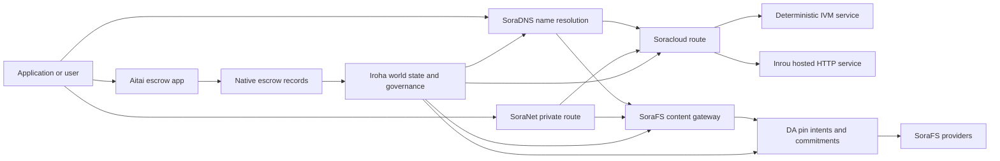

# SORA Nexus მომსახურება {#sora-nexus-services}

SORA Nexus დამატება აპლიკაციის მიმართულებით მომსახურების თვითმფრინავები გარშემო Iroha 3. ეს სერვისები არ არის ცალკე ლიდერები. ისინი დამყარებულია: Iroha მსოფლიო სახელმწიფო, Norito მანიფესტები, მმართველობის ჩანაწერები და Torii საგზაო ოჯახები.

ხელმისაწვდომობა დამოკიდებულია კვანძის მშენებლობაზე და ქსელის პროფილზე. გამოიყენეთ [`/openapi`](/ka/reference/torii-endpoints.md#app-and-sora-route-families) სამიზნე კვანძიზე, როგორც დასაშვები მარშრუტების ავტორიტეტული სია.

## კომპონენტების რუკა {#component-map}

|კომპონენტი |როლი |მთავარი ზედაპირები |
| ---------------------- | ------------------------------------------------------------------------------------------------------------------------------------------- | ---------------------------------------------------------------------------------------- |
|Soracloud |აპლიკაციის განთავსება, მასპინძლული სერვისები, კერძო მოდელი/სამუშაო დროის მდგომარეობა და მომსახურების სიცოცხლის ციკლზე კონტროლი. |`/v1/soracloud/`, `/api/`, `iroha app soracloud ...` |
|შიგნით |Soracloud მასპინძლობს HTTP მუშაობის დროს მომსახურების რევიზიები, რომლებიც საჭიროებს ცოცხალი HTTP თვითმფრინავი. |Soracloud runtime კონფიგურაცია, მასპინძელი შესაძლებლობების რეკლამები, რეპლიკა runtime მდგომარეობა |
|SoraNet |კონფიდენციალურობა და ტრანსპორტის გადაფარვა ცირკულეტებისთვის, რელიე ტრაფიკი, VPN, Connect სესიები და სტრიმინგის მარშრუტები. |`/v1/connect/`, `/v1/vpn/`, SoraNet მარშრუტის მეტა მონაცემები |
|მონაცემების ხელმისაწვდომობა (DA) |ხელმისაწვდომობის მტკიცებულებები, ვალდებულება და სასარგებლო ტვირთების გადაჭრის განზრახ ფენა, რომლებიც მითითებულია Nexus მარშრუტებით, SoraFS მანიფესტებით და დამტკიცებითი ნაკადებით. |`/v1/da/`, `FindDaPinIntent`, `[sumeragi.da]` |
|SoraFS |მანიფესების, CAR სასარგებლო ტვირთების, ჩაკეტილი შინაარსის, კარიბჭეების მოძიებისა და აღდგენის მტკიცებულების ნაკადების სათავსო ქსოვილი. |`/v1/sorafs/`, `/sorafs/`, `FindSorafsProviderOwner` |
|SoraDNS |დეტერმინისტური დასახელება და SORA -ში განთავსებული სერვისებისა და შინაარსის გადამწყვეტის ატესტაციის ფენა. |`/v1/soradns/`, `/soradns/`, გადამწყვეტი დირექტორი მოვლენები |
|აიტაი |აპლიკაციის დონეზე ფირმის და აქტივების ანგარიშსწორების კორიდორი, რომელსაც მხარს უჭერენ ადგილობრივი საფინანსო რეგისტრაციები და არა ცალკე წიგნი. |`OpenAssetEscrow`, `FindAssetEscrow*`,`EscrowEventFilter`, Kotodama `escrow_*` შენობები |



## ჩვეულებრივი ნაკადები {#common-flows}

### მასპინძლული Split აპლიკაცია {#hosted-split-application}

ჩვეულებრივი შერეული აპლიკაცია იყენებს ყველა ნაჭერს ერთად:

1. სტატიკური ფრონტენდის აქტივები შეფუთულია და ჩაკეტილია SoraFS.
2. საჯარო მასპინძელი, მაგალითად, `<app>.sora`, რეგისტრირებულია SoraDNS-ის საშუალებით.
3. Soracloud მარშრუტები `/api/v1/search` ან `/api/v1/stream` Inrou-ს HTTP მომსახურების მიმართულებით.
4. Soracloud მარშრუტები `/api/auth` და `/api/v1/user` დეტერმინისტური IVM მწარმოებლებისთვის.
5. მომხმარებელს, რომელსაც სჭირდება კონფიდენციალურობა, შეუძლია მიაღწიოს იმავე შინაარსს ან API მარშრუტს SoraNet ციკლის საშუალებით.

|გზა |საყრდენი თვითმფრინავი |რატომ?|
| ----------------- | --------------------- | ------------------------------------------------- |
| `/`               |SoraFS სტატიკური შემცველობა |განახლებადი შინაარსის root და gateway caching |
|`/assets/*` |SoraFS სტატიკური შემცველობა |შინაარსზე გათვალისწინებული აქტივები და მანიფესტური მტკიცებულებები |
|`/api/auth*` |Soracloud IVM |რეპლეი-საიმედო ავტისა და საფულის გამოწვევის სახელმწიფო |
|`/api/v1/user*` |Soracloud IVM |მმართველობისადმი მგრძნობიარე სახელმწიფოს მუტაციები |
|`/api/v1/search*` |Soracloud ინრუ |პირდაპირი HTTP სერვისი, კეისი, SSE ან კოლექტორის მდგომარეობა |

### შინაარსის გამოქვეყნება {#content-publication}

SoraFS გამოცემა წარმოადგენს მდგრადი არტეფაქტებს, სანამ სახელწოდება მიუთითებს მათზე:

1. შექმენით სასარგებლო დატვირთვა ან დირექტორი.
2. შეფუთეთ იგი ერთში CAR არქივი და ნაწილის გეგმა.
3. შეიქმნას Norito მანიფესტი pin პოლიტიკა და მართვის მონაცემებით.
4. განცხადების წარდგენა Torii.
5. დაფიქსირება DA pin განზრახვის ან ხელმისაწვდომობის ვალდებულების შესახებ, როდესაც მიზნობრივი პროფილისთვის მკაფიო მტკიცებულებაა საჭირო.
6. დააკავშიროთ მანიფესტი SoraDNS სახელწოდებასთან ან Soracloud სტატიკურ ფრონტენდ მარშრუტთან.

### კერძო მიზიდვა ან გადაცემის მარშრუტი {#private-fetch-or-streaming-route}

SoraNet შეიძლება დაჯდეს SoraFS-ის წინ ან Soracloud:

1. კლიენტი გადაწყვეტს სახელის ან მანიფესტის.
2. დაცვის დირექტორი ან მარშრუტის მანიფესტი ირჩევს შესასვლელსა და გასასვლელ რელიებს.
3. სატრანსპორტო მოძრაობა შეფუთულია და გადაიგზავნება SoraNet წრეზე.
4. გამშვები რელიე აღწევს SoraFS კარიბჭეს, Torii ნაკადს ან Soracloud მარშრუტს.

## აიტაი {#aitai}

Aitai არის SORA აპლიკაციის დერეფანი ბაზრის ტიპის ანგარიშსწორებისთვის, სადაც მყიდველი და გამყიდველი კოორდინირებენ გადახდას გარეთ ჯაჭვი, ხოლო Iroha აკონტროლებს ქსელზე არსებული აქტივების მფარველობა. ის უნდა გამოიყენოს ნაციონალური საფინანსო ინსტრუქციის ოჯახი, არა ხელშეკრულების საკუთრებაში მყოფი საფარველო ანგარიში ახალი ციფრული აქტივების მფარველი ნაკადებისთვის.

Native escrow ინახავს მფლობელობას მთავარ წიგნში. გამყიდველი იხსნის შეთავაზებას `OpenAssetEscrow`, მყიდველი იღებს და აღნიშნავს გადახდას გარეთ ჯაჭვი `AcceptAssetEscrow` და `MarkEscrowPaymentSent`; და გამყიდველმა გაათავისუფლოს `ReleaseAssetEscrow` ან გააუქმა, სანამ გადახდა მოხდება. თუ მყიდველი და გამყიდველი არ ეთანხმებიან, ორივე მხარეს შეუძლია გახსნას დავები, ხოლო მოგვარებელს `CanResolveEscrowDispute` შეუძლია გაიყოს ჩაკეტილი თანხა.

მთელი სიცოცხლის ციკლისათვის, ზოგადი აქტივების ჩაკეტვა, ანონიმური საფინანსო დავალიანება, გამოკითხვები, მოვლენები და Rust მაგალითები იხილეთ [Native Asset Escrow](/ka/blockchain/escrow.md).

|Aitai ზედაპირი |გამოიყენეთ იგი |
| ------------------------------------------------------------------------------------------------------------------------------------------------------------- | ----------------------------------------------------------------------------------------- |
| `OpenAssetEscrow`, `AcceptAssetEscrow`, `MarkEscrowPaymentSent`, `ReleaseAssetEscrow`, `CancelAssetEscrow`                                                    |გამჭვირვალე ციფრული აქტივების შეთავაზებები, მათ შორის XOR ნომინირებული საგადასახადო ნაკადები. |
| `OpenAnonymousAssetEscrow`, `AcceptAnonymousAssetEscrow`, `MarkAnonymousEscrowPaymentSent`, `ReleaseAnonymousAssetEscrow`, `CancelAnonymousAssetEscrow`       |დაცული შემოთავაზებები იყენებს მტკიცებულების დანართს დაფინანსებისა და გადაადგილების დასრულებისთვის. |
|`OpenEscrowDispute`, `ResolveEscrowDispute`, `OpenAnonymousEscrowDispute`, `ResolveAnonymousEscrowDispute` |სადავო ჩარევა და სასამართლო წესით გადაჭრა. |
|`FindAssetEscrowById`, `FindAssetEscrowsBySeller`, `FindAssetEscrowsByBuyer`, `FindAssetEscrowsByStatus` |აპლიკაციის სტატუსის გვერდები, შეთანხმების სამუშაოები და მხარდაჭერის ინსტრუმენტები. |
|`EscrowEventFilter` |ცოცხალი გამჭვირვალე საფინანსო ანაზღაურება საფინანსოს ID, გამყიდველი, მყიდველი, სტატუსი ან ღონისძიების ტიპის მიხედვით. |
| Kotodama `escrow_open_offer`, `escrow_accept`, `escrow_mark_payment_sent`, `escrow_release`, `escrow_cancel`, `escrow_open_dispute`, `escrow_resolve_dispute` |Kotodama ხელშეკრულების მოწოდება, რომელსაც მხარს უჭერს V1 საფინანსო სისტემა. |

საჯარო Taira ან Minamoto გამოყენებისათვის, მოითვალეთ გადახდის რკინიგზა და ნებისმიერი მხარდაჭერის ან სასამართლოს სამუშაო ნაკადი განაცხადის პოლიტიკად. Iroha აღნიშნავს დაცვის მდგომარეობას, სიცოცხლის ციკლის მოვლენებს, მტკიცებულებების ჰეშებსა და საბოლოო აქტივების მოძრაობას; იგი არ ადასტურებს ფიატული ანგარიშსწორება თავისთავად.

## შეამოწმეთ მიზნობრივი კვანძი {#check-a-target-node}

ამ გვერდიდან მაგალითების გამოყენებამდე, დაადასტურეთ, რომ მარშრუტის ოჯახი არსებობს იმ კვანძზე, რომელსაც აპირებთ:

```bash
export TORII_URL=https://taira.sora.org

curl -fsS "$TORII_URL/openapi.json" \
  | jq '.paths | keys[] | select(test("^/v1/(soracloud|sorafs|soradns|connect|vpn|da)/"))'

curl -fsS -H 'Accept: application/json' "$TORII_URL/status" | jq .
```

თუ `/openapi.json` არ არის გამოფენილი პროფილის მიერ, სცადეთ `/openapi`. ზუსტი მარშრუტის ხელმისაწვდომობა დამოკიდებულია მშენებლობის მახასიათებლებსა და ქსელის კონფიგურაციაზე.

### Taira მხოლოდ წაკითხვის სიგარეტის შემოწმებები {#taira-read-only-smoke-checks}

საჯარო Taira საბოლოო წერტილი სასარგებლოა წაკითხვის გვერდის შემოწმებისთვის, მაგრამ არ გამოიყენოთ მას მუტაციური მაგალითებისათვის, თუ თქვენ არ იყენებთ ავტორიზებულ ანგარიშს და აპირებთ ცოცხალი მდგომარეობის შეცვლას.

```bash
export TORII_URL=https://taira.sora.org

curl -fsS -H 'Accept: application/json' "$TORII_URL/status" \
  | jq '{version: .build.version, peers, blocks, lanes: (.teu_lane_commit | length)}'

curl -fsS "$TORII_URL/v1/connect/status" | jq '{enabled, sessions_active}'

curl -fsS "$TORII_URL/v1/vpn/profile" \
  | jq '{available, relay_endpoint, supported_exit_classes}'

curl -fsS "$TORII_URL/v1/sorafs/storage/state" \
  | jq '{bytes_capacity, bytes_used, pin_queue_depth, por_inflight}'

curl -fsS -H 'Accept: application/json' "$TORII_URL/v1/soracloud/status" \
  | jq '.control_plane | {service_count, services: [.services[] | {service_name, current_version}]}'
```

Taira შეიძლება გამოავლინოს განთავსების სპეციფიკური მართვის თვითმფრინავი მარშრუტები, რომლებიც არ არის ჩამოთვლილი OpenAPI გზა რუკაზე. განიხილეთ `/openapi` როგორც პირველადი წარმოქმნილი API ხელშეკრულება, შემდეგ დაუდასტურეთ ნებისმიერი განთავსება-სპეციფიური მარშრუტი პირდაპირ მანამ სანამ დოკუმენტირდება როგორც ცოცხალი.

## Soracloud {#soracloud}

Soracloud არის SORA აპლიკაციის მართვის თვითმფრინავი. იგი თვალყურს ადევნებს განთავსების ბუნდებს, მომსახურების რევიზიებს, მარშრუტირებას, დანერგვის მდგომარეობას, ავტორიტეტულ კონფიგურაციულ ჩანაწერებს, დაშიფვრულ სერვისის საიდუმლოებებს, მოდელი რეესტრიების ჩანაწერს, კერძო დასკვნით სესიებს და გამშვებ დროს მიღებულ ქვითრებს.

Soracloud იყენებს ორ განხორციელების თვითმფრინავს:

|აღსრულების თვითმფრინავი |დევნის დრო |გამოიყენეთ იგი |
| ---------------------- | ------- | -------------------------------------------------------------------------------------------- |
|`DeterministicService` |`Ivm` |ავტორი, საცავის მდგომარეობა, სერტიფიცირებული წაკითხვა, შეკვეთილი ფოსტის ყუთების მენეჯერები, მმართველობის მიმართ მგრძნობიარე მუტაციები |
|`HttpService` |`Inrou` |პირდაპირი HTTP APIs, კოლექტორის მძიმე სამუშაოები, კეშით უზრუნველყოფილი სერვისები, SSE, ბრაუზერის დახმარებით მიმდინარეობა |

კონტროლის თვითმფრინავი ავტორიტეტულია. განლაგება, განახლება, უკან დაბრუნება, კონფიგურაცია, საიდუმლოება, მოდელი და სტატუსის ბრძანებები გზავნილია Torii მეშვეობით და კითხულობს ვალდებულ მსოფლიო მდგომარეობას; ისინი არ ეყრდნობა ცალკე CLI - ადგილობრივ სარკეს . საჯარო მარშრუტი არის ყველაზე გრძელი პრეფისზე დაფუძნებული, ასე რომ ერთი რეგისტრირებულ მასპინძელს შეუძლია ავტოტრანსპორტის განცალკევება მასპინძლულ HTTP მარშრუტებსა და დეტერმინისტურ API მარშრუსებს შორის.

### გაშლილი აპლიკაციის დაწყება {#scaffold-a-split-app}

განცალკევებული აპლიკაციის შაბლონი ქმნის სტატურულ ფრონტენდს და ერთ მასპინძლობს პირდაპირი API და ერთი დეტერმინისტური საფარი/API სერვისი:

```bash
iroha app soracloud app init \
  --template split-app \
  --app-name solswap_indexer \
  --app-version 0.1.0 \
  --public-host solswap-indexer.sora \
  --output-dir ./apps/solswap-indexer

iroha app soracloud app local-plan \
  --manifest ./apps/solswap-indexer/app_manifest.json

iroha app soracloud app doctor \
  --manifest ./apps/solswap-indexer/app_manifest.json
```

`local-plan` ბეჭდება მარშრუტის გაყოფა, ბავშვთა მომსახურების მანიფესტები, სამუშაო სივრცის სკრიპტების გზები და მოსალოდნელი ფრონტენდის პუბლიკაციის რეჟიმი. `doctor` ადასტურებს ადგილობრივ გამოშვების ხელშეკრულებას, სანამ თქვენ ჩართავთ Torii.

### აპლიკაციის განთავსება და ინსპექტირება {#deploy-and-inspect-app-state}

```bash
export SORACLOUD_TORII_URL=https://<soracloud-enabled-torii>

iroha app soracloud app deploy \
  --manifest ./apps/solswap-indexer/app_manifest.json \
  --torii-url "$SORACLOUD_TORII_URL"

iroha app soracloud app status \
  --manifest ./apps/solswap-indexer/app_manifest.json \
  --torii-url "$SORACLOUD_TORII_URL"
```

უკვე განთავსებული სერვისისთვის, გამოიყენეთ სერვისის მასშტაბით განსაზღვრული ბრძანებები:

```bash
iroha app soracloud status \
  --service-name solswap_indexer_live \
  --torii-url "$SORACLOUD_TORII_URL"

iroha app soracloud rollback \
  --service-name solswap_indexer_live \
  --target-version 0.1.0 \
  --torii-url "$SORACLOUD_TORII_URL"
```

### კონფიგურაცია და საიდუმლო მასალა {#config-and-secret-material}

Soracloud კონფიგურაცია და საიდუმლო ჩანაწერები წარმოადგენს ავტორიტეტული განთავსების მდგომარეობის ნაწილს. განლაგება, განახლება და უკან დაბრუნება არ იხურება, როდესაც საჭირო კონფიგურა ან საიდუმლო კავშირები აკლია ან არ შეესაბამება აქტიურ მანიფესტებს.

```bash
iroha app soracloud config-set \
  --service-name solswap_indexer_live \
  --config-name indexer/public_config \
  --value-file ./config/public-config.json \
  --torii-url "$SORACLOUD_TORII_URL"

iroha app soracloud secret-set \
  --service-name solswap_indexer_live \
  --secret-name indexer/api_key \
  --secret-file ./secrets/api-key.envelope.json \
  --torii-url "$SORACLOUD_TORII_URL"
```

გამოიყენეთ CLI დახმარება თქვენი პროფილის მიერ მოთხოვნილი ზუსტი საკრედიტაციო დროშებისათვის:

```bash
iroha app soracloud config-set --help
iroha app soracloud secret-set --help
```

## ინრუ {#inrou}

ინრუ არის მასპინძელი. HTTP გატარების დრო, რომელიც გამოიყენება Soracloud. სააგენტო Iroha კვანძები ჩასმული Soracloud დაშვებული სამუშაო დროის პროექტები Soracloud ადგილობრივი მატერიალიზაციის გეგმაში განთავსება, განაწყობს დანიშნული ჰოსტებული სერვისის რეპლიკებს როგორც loopback სერვისებს; და ანგარიშები რეპლიკა runtime მდგომარეობა უკან ავტორიტეტული მოდელი.

გამოიყენეთ Inrou სამუშაო დატვირთვებისთვის, რომლებსაც სჭირდებათ ცოცხალი HTTP ზედაპირი, როგორიცაა კოლექტორის მძიმე APIs, SSE ნაკადები, კეშის მხარდაჭერილი მენეჯერები ან ბრაუზერის დახმარებით მომსახურებები.

### გაშვების დროის მოთხოვნები {#runtime-requirements}

- კონტეინერის მანიფესტის შესრულების დრო უნდა იყოს `Inrou`.
- სამსახურის მანიფესტის შესრულების თვითმფრინავი უნდა იყოს `HttpService`.
- `HttpService + Inrou` მოითხოვს ზუსტად ერთს `PersistentRootLeaseVolume`, რომელიც დამონტაჟებულია `/`-ზე.
- რეპლიკირებული Inrou სერვისები ასევე საჭიროებენ საერთო მომსახურებას ან კონფიდენციალურ იჯარის შენახვას, როდესაც ისინი ინარჩუნებენ ცვალებად საერთო მდგომარეობას.
- წარმოების ჰოსტინგის კვანძები უნდა რეკლამირებდნენ რეალურ Inrou-ს სიმძლავრეზე, ნაცვლად იმისა, რომ ოპერირებდნენ მხოლოდ როგორც პროქსი.

### გამოხატული ფრაგმენტი {#manifest-fragment}

ქვემოთ მოცემული მაგალითი აჩვენებს ორი მანიფესტის ფორმას. ეს არის ფრაგმენტი, და არა სრული განთავსების ბუნეტი.

```jsonc
// container_manifest.json
{
  "schema_version": 1,
  "runtime": { "runtime": "Inrou", "value": null },
  "bundle_path": "/bundles/solswap-indexer.inrou",
  "entrypoint": "/app/bin/launch-indexer.sh",
  "args": [],
  "env": {
    "RUST_LOG": "info",
  },
  "inrou": {
    "schema_version": 1,
    "guest_os": { "guest_os": "DebianSlim", "value": null },
    "guest_images": {
      "x86_64": {
        "kernel_image_path": "/inrou/x86_64/vmlinux",
        "rootfs_image_path": "/inrou/x86_64/rootfs.ext4",
        "initrd_image_path": null,
      },
      "aarch64": {
        "kernel_image_path": "/inrou/aarch64/vmlinux",
        "rootfs_image_path": "/inrou/aarch64/rootfs.ext4",
        "initrd_image_path": null,
      },
    },
  },
  "lifecycle": {
    "start_grace_secs": 60,
    "stop_grace_secs": 30,
    "healthcheck_path": "/api/indexer/v1/health",
  },
}
```

```jsonc
// service_manifest.json
{
  "schema_version": 1,
  "service_name": "solswap_indexer_live",
  "service_version": "0.1.0",
  "execution_plane": { "execution_plane": "HttpService", "value": null },
  "replicas": 2,
  "route": {
    "host": "solswap-indexer.sora",
    "path_prefix": "/api/v1/search",
    "service_port": 8080,
    "visibility": { "visibility": "Public", "value": null },
    "tls_mode": { "tls": "Required", "value": null },
  },
  "lease_volumes": [
    {
      "volume_name": "root_disk",
      "kind": {
        "lease_volume": "PersistentRootLeaseVolume",
        "value": null,
      },
      "storage_class": { "storage_class": "Warm", "value": null },
      "mount_path": "/",
      "max_total_bytes": 8589934592,
    },
    {
      "volume_name": "index_state",
      "kind": { "lease_volume": "ServiceLeaseVolume", "value": null },
      "storage_class": { "storage_class": "Warm", "value": null },
      "mount_path": "/var/lib/solswap-indexer",
      "max_total_bytes": 1073741824,
    },
  ],
}
```

გატარების დროს, თითოეული დამონტაჟებული იჯარის მოცულობა გამოფენილია მოცულობის სახელწოდებიდან გამომდინარე გარემოს ცვლადებით:

```text
SORACLOUD_LEASE_VOLUME_ROOT_DISK_DIR
SORACLOUD_LEASE_VOLUME_ROOT_DISK_MOUNT_PATH
SORACLOUD_LEASE_VOLUME_INDEX_STATE_DIR
SORACLOUD_LEASE_VOLUME_INDEX_STATE_MOUNT_PATH
```

## SoraNet {#soranet}

SoraNet არის კონფიდენციალურობა და სატრანსპორტო გადაფარვა. ის უზრუნველყოფს ტრანსპორტის რელიეზე დაფუძნებულ მარშრუტებს, რომლებიც არ უნდა იყოს პირდაპირ დაკავშირებული სამიზნე კარიბჭესთან ან მომსახურებასთან. სატრანსპორტო დიზაინი იყენებს შესასვლელ, შუა და გასასვლელი როლებს, QUIC ტრანსპორტს, ხმაურზე დაფუძნებულ ჰიბრიდულ ხელშემხატვას, შესაძლებლობების მოლაპარაკებას, რელე დირექტორი მეტადატალებს და ფიქსირებული ზომის შეფუთული უჯრედები.

Nexus განთავსებებში, SoraNet შეუძლია შეიცავდეს შინაარსის შეძენას, კარიბჭე ტრაფიკს, VPN ან Connect სესიებს და Norito სტრიმინგის მარშრუტებს. დირექტორიში შესვლისას შეიძლება აღინიშნოს რელეები, რომლებიც მხარს უჭერენ `norito-stream`, რაც საშუალებას აძლევს კლიენტებს აირჩიონ მარშრუტები, რომლებიც შესაფერისია Torii RPC ან სტრიმინგის ტრანსპორტისთვის.

### სტრიმინგის კონფიგურაცია {#streaming-configuration}

Nexus პროფილი საშუალებას იძლევა SoraNet უზრუნველყოს სტრიმინგის მარშრუტებისთვის:

```toml
[streaming]
feature_bits = 0b11

[streaming.soranet]
enabled = true
exit_multiaddr = "/dns/torii/udp/9443/quic"
padding_budget_ms = 25
access_kind = "authenticated"
provision_spool_dir = "./storage/streaming/soranet_routes"
provision_spool_max_bytes = 0
provision_window_segments = 4
provision_queue_capacity = 256
```

გამოიყენეთ `access_kind = "read-only"` შინაარსის მარშრუტებისთვის, რომლებიც არ საჭიროებს მაყურებლის ავთენტიფიცირებას. გამოიყენეთ `authenticated` მაშინ, როდესაც გამოსვლის რელიემ უნდა მოახდინოს ბილეთების ან მაყურებლის იდენტობის გამოყენება Torii ან მასპინძლური სერვისზე გადასვლამდე.

### SoraNet-ცნობიარე SoraFS მოიტანეთ {#soranet-aware-sorafs-fetch}

SoraFS აღება CLI შეიძლება გამოიყოს ადგილობრივი პროქსის მანიფესტი და spool SoraNet მარშრუტის მეტა მონაცემები ბრაუზერის გაფართოებების ან SDK ადაპტერებისათვის:

```bash
sorafs_cli fetch \
  --plan artifacts/payload_plan.json \
  --manifest-id 7bb2...9d31 \
  --provider name=alpha,provider-id=9f5c...73aa,base-url=https://gw-alpha.example.org/,stream-token="$(cat alpha.token)" \
  --output artifacts/payload.bin \
  --json-out artifacts/fetch_summary.json \
  --local-proxy-manifest-out artifacts/proxy_manifest.json \
  --local-proxy-mode bridge \
  --local-proxy-norito-spool storage/streaming/soranet_routes \
  --local-proxy-kaigi-spool storage/streaming/soranet_routes \
  --local-proxy-kaigi-policy authenticated \
  --max-peers=2 \
  --retry-budget=4
```

შემაჯამებელი ჩანაწერების მომწოდებლის ანგარიშები, ნაწილის ქვითრები, ადგილობრივი პროქსის მეტა მონაცემები და ეფექტური მარშრუტის პარამეტრები, რომლებიც გამოიყენება მოძიებისთვის.

### რელიე სტიმულირებელი შემოწმების რეგისტრაცია {#relay-incentive-verifier-roster}

რელეის წახალისების მიღება ჩაკეტილია. როდესაც `incentives.enable` მართალია, `incentives.trusted_verifier_ids` უნდა შეიცავდეს მინიმუმ ერთ და მაქსიმუმ 64 კანონიკურ ანგარიშს IDs. Runtime ინახავს სიაში როგორც დეტერმინისტური რიგით ნაკრები, ხოლო არასწორი სიაში გეომეტრიას უარყოფენ რელეის დაწყების დროს.

თითოეული `RelayBandwidthProof` განკუთვნილია ფიქსირებული ჩარჩო/დანაწილების ბიუჯეტის ფარგლებში და უნდა მოიცავდეს მთელ ჩარჩოს. მტკიცებულების გადამოწმებელი ანგარიში უნდა იყოს კონფიგურირებულ სიაში, ხოლო `RelayBandwidthProof::verify_signature()` უნდა წარმატებული იყოს: მანამდე, სანამ რელე იკეტება ან შეცვლის მის შესრულების აკუმულატორს. არამარწმუნო ხელმომწერი ან ხელმოწერის უვნებლობა/გაყალბებული მტკიცებულება შესაბამისად არ შეუწყობს ხელს გაზომვას და ვერ წარმოქმნის სტიმული მომენტალურ სურათს.

## მონაცემების ხელმისაწვდომობა (DA) {#data-availability-da}

DA არის ხელმისაწვდომობის მტკიცებულების ფენა იმ სასარგებლო ტვირთებისთვის, რომლებიც ძალიან დიდია, ზედმეტად კონფიდენციალურია ან ზედმეტია მომსახურების სპეციფიკური, რომ პირდაპირ მსოფლიო მდგომარეობაში განთავსდეს. იგი აღნიშნავს დეტერმინისტურ ვალდებულებებს და მოძიების ვალდებულებებს, რათა ვალიდატორებმა, გეიტვაიზებმა და კლიენტებმა შეძლონ შეთანხმება იმაზე, თუ რომელი ბაიტები იყო დაპირებული, რა პოლიტიკა გამოიყენება და რომელი მტკიცებულება დაცულია.

DA არ შეიცავს Kura ან SoraFS:

- Kura ინახავს საბოლოო ბლოკის ნაკადის მონაცემებს და კონსენსუსის აღდგენის მონაცემებს.
- SoraFS ინახავს და ემსახურება შინაარსის მიმართულებით ბაიტებს, CAR სასარგებლო ტვირთებსა და მანიფესტებს.
- DA აღნიშნავს ვალდებულებებს, მტკიცებულებების პოლიტიკას, მტკიცებულებათა გახსნას და pin განზრახვებს, რომლებიც საშუალებას აძლევენ ამ ბაიტების დაგეგმვა, აუდიტირება და ლიდერის მდგომარეობასთან დაკავშირება.

გამოიყენეთ DA, როდესაც აპლიკაციისთვის ან Nexus მარშრუტისათვის საჭიროა მთავარ წიგნში ხილული დაპირება, რომ რიგგარეშე მონაცემები კვლავაც ამოღებადია. გავრცელებული მაგალითები მოიცავს მარშრუტების სასარგებლო ტვირთის ვალდებულებებს ანგარიშსწორების ნაკადებისთვის, SoraFS პინის განზრახვებს გამოქვეყნებული შინაარსისთვის; მტკიცებულებების ბუნდები, რომლებიც უნდა შენარჩუნდეს შემდგომ შემოწმებისთვის და აპლიკაციის არტეფაქტები, რომელთა საჯარო მდგომარეობა უნდა იყოს დეგესტი და არა სრული სასარგებლო ტვირთი.

### სიცოცხლის ციკლი {#lifecycle}

|ეტაპი |რა არის დაფიქსირებული |
| ---------- | ----------------------------------------------------------------------------------------------------------------------------------------------------- |
|განზრახვა |ბილეთი, მანიფესტური რეფერენცია, alias, ზოლი / ეპოქა / თანმიმდევრობის მითითება, შენახვის პოლიტიკა, ან რეპლიკაციის მიზანი. |
|ვალდებულება |აღჭურვილი მასალა, რომელიც აკავშირებს მანიფესს, ბილიკის სასარგებლო დატვირთვას, დამტკიცების ბუნდელს ან შინაარსის ფესვს წიგნის ჩანაწერზე. |
|მტკიცებულებები |ხელმისაწვდომობის ხმები, მტკიცებულებების გახსნა, მომწოდებლის ატესტაციები ან სხვა პროფილის სპეციფიკური მტკიცებულება, რომელიც მიღებულია სამიზნე ქსელის მიერ. |
|კითხვა |`FindDaPinIntentByTicket`, `FindDaPinIntentByManifest`, `FindDaPinIntentByAlias` ან `FindDaPinIntentByLaneEpochSequence` საშუალებით ჩანართის განზრახ შესწავლა. |

DA მხარდაჭერილი ტიპიური გამოქვეყნების ნაკადი არის:

1. აღდგენა ან მიღება სასარგებლო ტვირთის WSV გარეთ, მაგალითად SoraFS CAR ფაილი ან Nexus სარკინიგზის სასარგებლო დატვირთვა.
2. დასახელება და სასარგებლო ტვირთის აღწერა Norito მანიფესტში ან მარშრუტის სპეციფიკური ვალდებულების ჩანაწერში.
3. წარადგინეთ მანიფესტი, პინი განზრახვა ან ვალდებულება `/v1/da/*` მეშვეობით, როდესაც ამ მარშრუტის ოჯახი ჩართულია, ან ქსელის მიერ ხელმოწერილი ტრანზაქციის გზა.
4. ვალდებული უნდა იყოს, რომ ვალიდატორებმა ან ხელმისაწვდომობის მიმწოდებლებმა შეაგროვონ აქტიური მტკიცებულებების პოლიტიკის მიხედვით მოთხოვნილი მტკიცებულებები.
5. შეკითხვა მიღებული pin განზრახვა ან ვალდებულება, სანამ პოპულარიზაცია alias, ანგარიშსწორების მტკიცებულება, ან კარიბჭე გზა, რომელიც დამოკიდებულია სასარგებლო ტვირთის.

### ალგორითმური მოდელი {#algorithmic-model}

DA გარდაქმნის სასარგებლო დატვირთვას ხელმოწერილი, განმეორებით დაცული, ბლოკ-ინდექსირებული ვალდებულებად. მნიშვნელოვანი ალგორითმები დეტერმინისტურია, ასე რომ ვალიდატორებს და გეიტვეებს შეუძლიათ იმავე დიჯესტის გადათვლა იმავე ბიტებისგან.

1. Torii იღებს მიღების მოთხოვნას `(lane_id, epoch, sequence)`, სასარგებლო ტვირთის ბაიტებით, შეკვამვის მეტა მონაცემებით, ნაწილის ზომით, წაშლის პროფილით, შენახვის პოლიტიკა და გამგზავრებლის ხელმოწერა. კვანძი გზიპის, დეფლატის ან Zstandard- ის სასარგებლო ტვირთებს მოითხოვს და შემდეგ ადასტურებს, რომ კანონიკური ბაიტის სიგრძე შეადგენს `total_size` .
2. შეამოწმეთ ბილიკისა და ნაწილის პარამეტრები. ბილიკი უნდა არსებობდეს Nexus ბილიკის კატალოგში. `chunk_size` უნდა იყოს არა ნულოვანი სიმძლავრე ორი, მინიმუმ ორი ბითი; და არ აღემატება კონფიგურირებული მაქსიმუმის. წაშლის პროფილი უნდა შეიცავდეს მონაცემთა ნაჭრებს და მინიმუმ ორ პარიტეტულ ნაჭერს. მარშრუტის კატალოგში ირჩევს დამტკიცების სქემას, ან `merkle_sha256` ან `kzg_bls12_381`.
3. გამოიყენეთ ქსელის პოლიტიკა. კვანძი აამოქმედებს კონფიგურირებულ რეპლიკაციასა და შენახვის ბაზას blob კლასისთვის. საჯარო მეტა მონაცემები უნდა დარჩეს უბრალო ტექსტში; მხოლოდ მმართველობის მეტა მონაცემების ჩიფტირება ხდება კვანძის კონფიგურირებული მმართველობა metadata გასაღებით მანამდე, სანამ ის დაიწერება მანიფეტში .
4. ნაჭერი და ჩაბარება. კანონიკური სასარგებლო ტვირთის ნაჭერი არის ფიქსირებული ზომის პროფილისგან გამომდინარე `chunk_size`. Torii ითვლის სასარგებლო სატვირთოს დიგესტს, აღდგენის მტკიცებულების ხის ძირს და ნაჭრის ერთობლივ ვალდებულებებს. მონაცემთა ნაჭრები ატარებენ BLAKE3 ვალდებულებას მათი ბითებზე.
5. დაამატეთ წაშლის ვალდებულებები. ნაჭრები დაჯგუფებულია `data_shards` სტრიპებად. საბოლოო სტრიპში დაკარგული უჯრედები ნულოვანი შეფუთულია პარიტეტის გაანგარიშებისთვის. RS(16) პარიტეტი ქმნის რიგის / გლობალური პარიტეტის ნაჭრები; ვარიანტი `row_parity_stripes` დაამატეთ კოლონური სტილის სტრიპის პარიტეტი მატრიცის მასშტაბით. პარიტეტული ნაჭრის ვალდებულებები არის BLAKE3 მცირე ზომის `u16` სიმბოლოების დიგესტები.
6. შექმენით მანიფესტი. `DaManifestV1` აღნიშნავს მარშრუტს, ეპოქას, ბლოპის კლასს, კოდეკს, სასარგებლო ტვირთის დიგესტს, ნაჭრის ფესვას, ნაჭრების ზომას, წაშლის პროფილს, შენახვის პოლიტიკას, ქირაობის შეფასებას, ნაჭერის ვალდებულებებს, ვარიანტულ IPA ვალდებულებას, მეტადატებს და გამოშვების დროს. შენახვის ბილეთი დეტერმინისტურია: კვანძი ჯერ ჰეშავს მანიფესტის შაბლონს ცარიელი ბილეთით, შემდეგ კი ამ თითის ანაბარს უკან წერს როგორც საბოლოო `storage_ticket`.
7. Reject replay კონფლიქტები. Replay გასაღები არის `(lane_id, epoch, sequence, manifest_fingerprint)`. duplicate იგივე თითის ანაბეჭდია idempotent. შეჩერებული თანმიმდევრულობა ან იგივე თანმიმდევრობა განსხვავებული თითის ანბეჭდით უარყოფილია.
8. გამოავლინეთ ხელმოწერილი არტეფაქტები. Torii ითვლის PDP ვალდებულებას, ხელს აწერს `DaIngestReceipt`, აშენებს `DaCommitmentRecord` და წერს მანიფესტისთვის სროლის არტეფაკტებს. PDP ვალდებულება, ვალდებულების ჩანაწერი, ვალდებულება გრაფიკი, pin განზრახვა, მიღების ფაილი და მიღების დღიური. მიღების კურსორი წინ monotonically თითოეული `(lane_id, epoch)`.

ბლოკები ატარებენ ჩანაწერებს. ჩანაწერი უკავშირდება:

- ბილიკი, ეპოქა და თანმიმდევრულობა
- დამრეკავის ბლოპი ID და კანონიკური მანიფესტის ჰაში
- ბილიკების გამწმენდის სქემა
- ნაჭრის ფესვი
- KZG ვალდებულება KZG ზოლებისათვის
- PDP/მტკიცებულების დეგესტი
- შენახვის კლასი და შენახვის ბილეთი
- Torii DA დამადასტურებელი ხელმოწერა

სანამ ბლოკი ჩადებს DA რეკორდებს, ბლოკის ასამბლეის გზა ადასტურებს ბუნთს:

- `(lane_id, epoch, sequence)` უნდა იყოს უნიკალური ბუნდის შიგნით.
- მანიფესტური ჰეშები უნდა იყოს არა ნულოვანი და უნიკალური ბუნდის შიგნით.
- ვალდებულების დამტკიცების სქემა უნდა შეესაბამებოდეს კონფიგურირებული ზოლის პოლიტიკას.
- მერკლის ზოლები უარყოფენ KZG ვალდებულებებს; KZG ზოლები მოითხოვენ არა ნულოვან KZG ვალდებულებას.
- pin განზრახვა არის canonicalized, დალაგებული, და ფილტრირებულია ზოლი, manifest hash, შენახვის ბილეთი, მფლობელის ანგარიში და alias-კოლისიის წესები.

ბლოკის სათაური ინახავს ჰეშებს DA მტკიცებულების პოლიტიკის, ვალდებულებების და pin განზრახვისთვის. წევრობის მტკიცებულებებისათვის, ვალდებულება ბუნდი ასევე გამოავლინებს Merkle ფესვი, რომლის ფოთლები არის კანონიკური Norito-კოდირებული `DaCommitmentRecord` ღირებულებების ჰეშები. მშობლიური კვანძები ჰეშის მარცხენა და მარჯვენა შვილების კონკეტინაცია; უცნაური ფოთოლი უწყვეტად გადადის შემდეგ ფენზე.

### მტკიცებულებების შემოწმება {#proof-verification}

`/v1/da/commitments/prove` შეუძლია წარმოადგინოს მტკიცებულება ერთ ბლოკში ერთ ვალდებულებაზე. მტკიცებულება შეიცავს ვალდებულებას, ბლოკის სიმაღლეს, ინდექსს ბუნდელში, ბუნდელ ჰეშს, ბუნელის სიგრძეს, Merkle root- ს და ძმების გზას. შემოწმება შეამოწმებს:

1. მტკიცებულების ბუნდის ჰაში შეესაბამება ბლოკის სათაურის DA ვალდებულების ჰეშს.
2. დამტკიცების ბლოკის სიმაღლე შეესაბამება მითითებულ ბლოკის სათაურს.
3. ინდექსი არის საზღვრებში და ვალდებულება შეესაბამება ამ ინდექსის ბუნდის მითითებას.
4. კალაპოტის საწინააღმდეგო პოლიტიკა იღებს ვალდებულებას.
5. დაწესებულების ფურცლიდან ძმური გზის გადახრა აღადგენს მიწოდებულ ძირს.
6. რეკონსტრუქციული ფესვი ტოლია ბუნდის ფესვთან.

ეს ადასტურებს, რომ კონკრეტულ ბლოკის სასარგებლო ტვირთში კონკრეტული ხელმისაწვდომობის ვალდებულება იყო შეყვანილი; ეს არ ადასტურებთ, რომ ყველა რეპლიკა ამჟამად ონლაინ არის. პირდაპირი მოძიების შესაძლებლობა ცალკე შემოწმდება SoraFS მომწოდებლის შეძენით, PDP/PoTR შემოწმებით ან პროფილის სპეციფიკური ხელმისაწვდომობის მტკიცებულებებით.

### კონსენსუსის ინტერაქცია {#consensus-interaction}

DA უკავშირდება Sumeragi საიმედო გადაცემის მეშვეობით (RBC), მაგრამ ეს არ არის მეორე საბოლოო პროტოკოლი. RBC ავრცელებს და აღადგენს წინადადებების სასარგებლო ტვირთებს: შემოთავაზებელი აცხადებს სხდომას `(height, view, payload_hash)`, პარტნიორთა გაცვლითი ნაწილებისთვის და `READY`/`DELIVER` სიგნალების გამოკვლევაზე, შეესაბამება თუ არა საკმარისი რაოდენობის დამტკიცებელმა პირებმა ერთსა და იმავე სასარგებლო ტვირთს.

Iroha 3 ფარგლებში, თანატოლები განიხილავენ მოქმედი ბლოკის სასარგებლო ტვირთის ხელმისაწვდომობას, როდესაც:

- ადგილობრივი მოქმედი ბლოკის ბაიტები ჰეშის მიხედვით მოსალოდნელი სასარგებლო ტვირთის ჰეშს, ან
- RBC აღადგინა სასარგებლო ტვირთის შეესაბამება ბლოკ ჰეშ, სიმაღლე, ხედვა და სასარგებლო სატვირთო ჰეშ.

თუ არც ერთი პირობა არ შეესაბამება, პარტნიორი რეგისტრირებს `missing_local_data`, ცდილობს სასარგებლო ტვირთის აღდგენას RBC ან ბლოკის სინქრონიზაციის მეშვეობით და იუწყება DA კარიბჭეს სტატუსისა და ტელემეტრიის შესახებ. მიმდინარე განხორციელებისას ეს DA სიგნალები საბოლოოობისთვის საკონსულტაციოა: ბლოკი ჯერ კიდევ სრულდება კომიტეტის სერტიფიკატისა და შესაბამისი ადგილობრივი სასარგებლო ტვირთისგან, არა ცალკე კვორუმის სერტიფიკატიდან DA .

DA დროის გაფართოება აღდგენის ფანჯრები. ეფექტიანი DA კვორუმის დროის ვადა არის მიღებული კონფიგურირებული ბლოკიდან და ჩაბარების დროები, შემდეგ გამრავლებულია `sumeragi.advanced.da.quorum_timeout_multiplier`. ხელმისაწვდომობის დროი არის `max(quorum_timeout, availability_timeout_floor_ms) * availability_timeout_multiplier`. სანამ ხელმისაწვდომობის ვადა ამოიწურება, კვანძი სასარგებლო ტვირთის აღდგენას უწყობს ხელს და თავიდან აცილებს ნაადრევი გადაგეგმვას; მას შემდეგ, რაც ის ამოიწურა, ჩვეულებრივი აღდგენის და ნახვის შეცვლის გზები შეიძლება გაგრძელდეს.

### ოპერატორის შენიშვნები {#operator-notes}

Iroha 3 კონსენსუსის პროფილები მოიცავს სასარგებლო ტვირთების გავრცელებას, რომელიც მხარდაჭერილია RBC-ით, მანიფესტის დაცვას, DA ბუნდის ვალიდენციზაციას და აღდგენის ტელემეტრიას. პარტნიორული შაბლონი აჩვენებს `[sumeragi.da]` ლიმიტებს ბლოკზე ვალდებულებების და მტკიცებულების გახსნისთვის, პლუს `[sumeragi.advanced.da]` დროის გამრავლებლები კვორუმისა და ხელმისაწვდომობის ქცევისთვის. შეინარჩუნეთ ეს პარამეტრები თანმიმდევრული ერთ ქსელის პროფილის validator-ებში.

მარშრუტის აღმოჩენისათვის, დაიწყეთ კვანძის OpenAPI დოკუმენტით:

```bash
curl -fsS "$TORII_URL/openapi.json" \
  | jq '.paths | keys[] | select(startswith("/v1/da/"))'
```

გამოიყენეთ შეკითხვის რეფერენცია [](/ka/reference/queries.md#nexus-data-availability-and-packages) მიმდინარე შეკითხვების სახელებისთვის DA და კონფიგურაციის შაბლონი [ peer](/ka/reference/peer-config/) თქვენი მშენებლობის მიერ გამოფენილი ადგილობრივი `[sumeragi.da]` ღილაკებისათვის.

## SoraFS {#sorafs}

SoraFS არის დეცენტრალიზებული შინაარსის ადრესირებული შენახვის ქსოვილი. ის შეავსებს ბაიტებს დეტერმინისტურ ნაწილებად, CAR არქივებს და Norito მანიფესტს, რომლებიც აკავშირებენ შინაარსის ფესვებს, სათავსო პროვაიდერები რეკლამირებენ სიმძლავრეზე და შინაარსის ხელმისაწვდომობაზე, ხოლო კარიბჭეები კონტენტის მიწოდებამდე ადასტურებენ მანიფესებსა და ნაწილობრივ ვალდებულებებს.

SoraFS ტიპიური გამოყენებები მოიცავს სტატიკურ აპლიკაციების აქტივებს, დოკუმენტაციის ნაგებობებს, ზონის ბუნდლებს, მოდელებსა და არტეფაქტებზე რეფერენციებს და მმართველობის მტკიცებულებების ბუნდებს. Iroha მონაცემთა მოდელი გამოხატავს SoraFS კარიბჭეზე მოვლენებს და პროვაიდერის საკუთრების გადაწყვეტის მიზნით [`FindSorafsProviderOwner`](/ka/reference/queries.md#nexus-data-availability-and-packages) შეკითხვას .

### საჯარო ადგილობრივი CID და საიტის შესასვლელები {#public-local-cid-and-site-gateways}

ყველა SoraFS-ის ჩართული Torii კვანძი ამ ანონიმურ საჯარო მარშრუტებს აწყობს მაშინაც კი, როდესაც არ არის აშენებული ვარიანტი აპლიკაცია API:

|მეთოდი და საბოლოო |მიზანი |
| --- | --- |
|`GET /.well-known/sorafs/manifest` |დააბრუნეთ კანონიკური მოთხოვნის მასპინძლის მიერ შერჩეული მანიფესტი |
|`GET /v1/sorafs/cid/{cid}` |დაბრუნება შეზღუდული ადგილობრივი მანიფესტის მეტა მონაცემები და ფაილის ჩანაწერები ერთი CID |
|`GET /sorafs/cid/{cid}` |ფესვური დოკუმენტი ერთი ადგილობრივი შინაარსის მიმართული საიტისათვის |
|`GET /sorafs/cid/{cid}/{*path}` |ერთი ნორმალიზებული გზა, ან ერთი დაზღვეული ბაიტების ფარგლებში, იმ CID |

ეს მარშრუტები არასდროს იღებენ `x-sorafs-stream-token` ან `x-sorafs-token-id`. ორივე სათაურის არსებობა ცუდი თხოვნაა. კანონიკური მანიფესტი, რომელიც უკვე არის ნოდის ავტორიტეტულ ადგილობრივ მაღაზიაში, არის საჯარო წაკითხვის შესაძლებლობა; კეშის შეცდომა არ აძლევს საშუალებას დისტანციური პროვაიდერის ჰიდრატაცია. დაცული პროვაიდერი CAR და ნაწილის მარშრუტები რჩებიან ცალკე ავთენტიფიცირებული პროტოკოლის ზედაპირები.

ბაიტების წაკითხვის წინ, Torii ადასტურებს ადგილობრივი მანიფესტის კანონიკურ კოდირებას, სემანტიკურ შეზღუდვებს, დიგესტს და ფესვას CID. შემდეგ ეს მოითხოვს ავტორიტეტულ ადგილობრივ პროვაიდერის იდენტიფიკაციას, მმართველობის აღიარებასა და მანიფეტის შესაბამისობის და ჩამოტვირთვის შემოწმებას, CID, და პროვაიდერი. Gateway განაკვეთის / აკრძალვის პოლიტიკა იყენებს ეფექტურ კლიენტის მისამართს, პატივს მიაგებენ გადაგზავნილ მისამართებს მხოლოდ კონფიგურირებული სანდო პროქსების მეშვეობით. დაკარგული პოლიტიკა, შესაბამისობა, მოხსნა, იდენტობის ან მიღების სახელმწიფო ვერ დაიხურება.

ერთი თხოვნა ფლობს საჯარო კარიბჭის ბოლოდან ბოლომდე ნებართვას; პროცესის მასშტაბური ლიმიტი არის 64 ერთდროული წაკითხვა, ხოლო ზედმეტი თხოვნით დაბრუნება `503 Service Unavailable` და `Retry-After: 1`. მანიფესტური პასუხები შეზღუდულია 16 MiB, ფაილების ჩამონათვალების დეფოლტი 50 შესავალზე და მიიღეთ მაქსიმუმ 500, ხოლო სრული ფაილი ან ერთი ბაიტის დიაპაზონი შეზღუდვაა 8 MiB. CIDs, გამოკითხვები, მასპინძლები, გზები და დიაპაზონის სათაურები უნდა გამოიყენოს მათი კანონიკური ერთმა ღირებულებამ ფორმები. აქტიური HTML, სკრიპტი, SVG, XML, PDF ან Wasm-ის შინაარსი მხოლოდ კონფიგურირებული CID -დან გამომდინარე იზოლირებული წარმოშობისგან (ან იქ გადამისამართებულია), რაც ხელს უშლის საერთო ბილიკის კარიბჭის წარმოშობის მიერ არასაიმედო შინაარსის შესრულებას.

### ზომიერების გამოწვევები {#moderation-challenges}

SoraFS მოდერაციული გამოწვევის ეკონომიკა არის კონსენსუსის სახელმწიფო. აქტიური პოლიტიკა სახელებს მმართველობის ხმის მიცემის აქტივს და მმართველობა ანგარიშები გამოიყენება escrow და slashing. თითოეული გამოწვევა საჭიროებს ზუსტად 150 ერთეული ამ აქტივი; მისი გაზრდის ატომურად გადაადგილება ბონდი escrow. შემთხვევა უარყოფს ორმაგი გამოწვევის იდენტიფიკატორს, იმავე ანგარიშის მეორე გამოწვევას ან განმეორებით გამოყენებულ მტკიცებულებების დიგესტს ბალანდების ან გამოწვევების მაჩვენებლების შეცვლის გარეშე.

გამოწვევის წარდგენის ვადა და გამოწვევის გადაჭრის ვადა განსხვავებულია. მმართველობა მიიღებს ზუსტად 24 საათის შემდეგ, რაც წარმოდგენების მიღება ახლოსაა მიმდინარე გამოწვევის მისაღებად ან უარყოფისთვის. გამოწვევების მოლოდინში ბლოკის კენჭისყრა აჩვენებს მხოლოდ ამ რეზოლუციის ვადის განმავლობაში:

- მიღებული გამოწვევის შედეგად საქმე შეწყდება და ბონდი მთლიანად ანაზღაურდება;
- უარის თქმის გამო საქმის გაგრძელებას აძლევს, ბონდის 25%-ს გადაგზავნის შემცირების მიმღებ პირს (მომგვარდება ხმის მიცემული აქტივის სიზუსტის მიხედვით) და დანარჩენი თანხა ანაზღაურება; და
- გაურკვეველი გამოწვევა გრანსიის ფანჯრის შემდეგ ამოიწურება, არ გაიხსნება და მთლიანად დაბრუნდება ბონდი.

`ExpireSorafsModerationChallenge` არ აქვს ნებართვა და შეუძლებელია გასაჩივრებისათვის, რომელიც უკვე ამოწურულია. საქმის დასკვნა ახორციელებს იმავე ვადაზე გადახდას, როგორც backstop-ს, ასე რომ, არამყოფელი მფლობელი ვერ დატოვებს ფინანსებს ჩაკეტილი ან გააჩნია ბლოკირებული ანგარიშსწორებები. თითოეული ანგარიშგება არის ატომური: თუ რომელიმე დაბრუნება ან ნაკვეთი ფეხის წარუმატებლობა, მთლიანი ანგარიშგების უკან rolls.

მოდერაციის პოლიტიკა და შემთხვევების ჩანაწერები იყენებენ პირველი გამოშვების სქემას პირდაპირ. კვანძები უარყოფენ წინასწარ გაჭრილი მუდმივი განლაგებები გენეზი / სახელმწიფო ინიციალიზაციის დროს ან snapshot აღდგენა; რეგენერირება ამ მოწყობილობების ნაცვლად inferring ხმის აქტივი, სათავსო ანგარიშები, ვადები, ან ეკონომიკა legacy მდგომარეობა.

### შეავსეთ, გამოაცხადეთ, ხელი მოაწერეთ და წარადგინეთ {#pack-manifest-sign-and-submit}

```bash
cargo run -p sorafs_car --features cli --bin sorafs_cli -- \
  car pack \
  --input ./dist \
  --car-out artifacts/site.car \
  --plan-out artifacts/site.chunk-plan.json \
  --summary-out artifacts/site.car-summary.json

cargo run -p sorafs_car --features cli --bin sorafs_cli -- \
  manifest build \
  --summary artifacts/site.car-summary.json \
  --manifest-out artifacts/site.manifest.to \
  --manifest-json-out artifacts/site.manifest.json \
  --pin-min-replicas=3 \
  --pin-storage-class=warm \
  --pin-retention-epoch=42

SIGSTORE_ID_TOKEN=$(oidc-client fetch-token) \
cargo run -p sorafs_car --features cli --bin sorafs_cli -- \
  manifest sign \
  --manifest artifacts/site.manifest.to \
  --bundle-out artifacts/site.manifest.bundle.json \
  --signature-out artifacts/site.manifest.sig

cargo run -p sorafs_car --features cli --bin sorafs_cli -- \
  manifest submit \
  --manifest artifacts/site.manifest.to \
  --chunk-plan artifacts/site.chunk-plan.json \
  --torii-url "$TORII_URL" \
  --resolve-submitted-epoch=true \
  --authority=<i105-account-id> \
  --private-key-file ./secrets/authority.ed25519 \
  --summary-out artifacts/site.manifest.submit.json \
  --response-out artifacts/site.manifest.submit.body
```

თუ `/v1/sorafs/pin/register` მიზნობრივ კვანძზე არ არის განლაგებული, CLI შეიძლება დაუბრუნდეს ხელმოწერილი `/transaction` წარდგენას და ელოდოს ტერმინალის მილსადენის სტატუსს.

### შეამოწმეთ და მოიტანეთ {#verify-and-fetch}

```bash
cargo run -p sorafs_car --features cli --bin sorafs_cli -- \
  proof verify \
  --manifest artifacts/site.manifest.to \
  --car artifacts/site.car \
  --chunk-plan artifacts/site.chunk-plan.json \
  --summary-out artifacts/site.verify.json

sorafs_cli fetch \
  --plan artifacts/site.chunk-plan.json \
  --manifest-id <manifest-digest-hex> \
  --provider name=primary,provider-id=<provider-id-hex>,base-url=https://gateway.example.org/,stream-token="$(cat provider.token)" \
  --output artifacts/site.fetch.tar \
  --json-out artifacts/site.fetch.json
```

### აღსადგენადობის მტკიცებულების შემოწმება {#proof-of-retrievability-checks}

ოპერატორებს შეუძლიათ შეამოწმონ და გამოაქტიურონ მტკიცებულების შემოწმება შენახვის მიმწოდებლებისთვის:

```bash
sorafs_cli por status \
  --torii-url "$TORII_URL" \
  --manifest <manifest-digest-hex> \
  --status=failed \
  --limit=20

sorafs_cli por trigger \
  --torii-url "$TORII_URL" \
  --manifest <manifest-digest-hex> \
  --provider <provider-id-hex> \
  --reason=latency_probe \
  --samples=48 \
  --auth-token artifacts/challenge_token.to
```

## SoraDNS {#soradns}

SoraDNS არის დეტერმინისტური დასახელების ფენა SORA სერვისებისა და შინაარსისთვის. იგი ნორმალიზებს სახელებს, ამაგრებს რეზოლუციის დირექტორი განახლებებს Iroha-ში, და განაწილებს SoraFS-ის მეშვეობით ხელმოწერილი ზონის ან გადამწყვეტის ბუნდების გავრცელებას. გადამწყვეტები და კარიბჭეები გადამწყვეტი მტკიცებულებების დოკუმენტებს ადასტურებენ, სანამ აღმოჩენის მეტაანახებს ენდობიან.

ბრაუზერის წვდომისათვის SoraDNS იღებს საგუშაგო მასპინძლებს რეგისტრირებული FQDN დან. რეგისტრაციაში ჩართული ტანჯვის მასპინძელი რჩება კანონიკური აპლიკაციის წარმომავლობა, ხოლო განთავსებულ საგუშაკო პროფილებზე ამ წარმოშობისთვის გამოჩნდება ბრაუზის და Torii უკან დაბრუნების მარშრუტები .

### მასპინძელი ფორმები {#host-forms}

|ფორმა |მაგალითი |მიზანი |
| --- | --- | --- |
|ტყუილობის წარმოშობა |`https://<fqdn>/<path>` |კანონიკური აპლიკაცია URL რეგისტრირებულია მანიფესტებსა და განთავისუფლების ნოტებში |
|Taira ბრაუზერის კარიბჭე |`https://<fqdn>.mon.taira.sora.net/<path>` |საჯარო ბრაუზერის კარიბჭე აქტიური alias |
|Torii უკან დაბრუნების გზა |`https://taira.sora.org/soradns/<fqdn>/<path>` |Torii დებეგმირება და უკან დაბრუნების მარშრუტი აქტიური alias |
|კანონიკული ჰეშ-გაიტეი |`<base32(blake3(name))>.gw.sora.id` |დეტერმინისტური კარიბჭის იდენტობა და GAR შემოწმება |

`/soradns/<alias>/...` fallback არ არის სასურველი საჯარო URL. ინსტრუმენტები, აპლიკაციების მანიფესტები და ფრონტენდის კონფიგურაცია უნდა უპირატესობდეს თავად vanity მასპინძელს. თუ Taira-ზე საიდუმლო სახელი არ არის აქტიური, ბრაუზერის კარიბჭე ან უკან დაბრუნების გზა შეიძლება დაუბრუნდეს `404` ან შეცვალოს TLS აპლიკაციის მარშრუტირების დაწყებამდე.

### გამომდინარე კარიბჭეების მასპინძლები {#derive-gateway-hosts}

```ts
import {
  deriveSoradnsGatewayHosts,
  hostPatternsCoverDerivedHosts,
} from '@iroha/iroha-js'

const derived = deriveSoradnsGatewayHosts('docs.sora')
console.log(derived.canonicalHost)
console.log(derived.prettyHost)

const taira = deriveSoradnsGatewayHosts('solswap-indexer.sora', {
  prettySuffix: 'mon.taira.sora.net',
})
console.log(taira.prettyHost)

const patterns = [
  derived.canonicalHost,
  derived.canonicalWildcard,
  derived.prettyHost,
]
console.log(hostPatternsCoverDerivedHosts(patterns, derived))
```

GAR სასარგებლო ტვირთები უნდა დაფაროს კანონიკური ჰეშის მასპინძელი, კანონიკური ფრიადი ბარათი, და შერჩეული ლამაზი მასპინძლი.

### მოიტანეთ Resolver Directory Snapshot {#fetch-a-resolver-directory-snapshot}

```bash
curl -i "$TORII_URL/v1/soradns/directory/latest"

soradns_resolver directory fetch \
  --record-url "$TORII_URL/v1/soradns/directory/latest" \
  --directory-url https://gateway.example.org/soradns/directory/latest.car \
  --output ./state/soradns-directory

soradns_resolver rad verify \
  --rad ./state/soradns-directory/rad/resolver-a.norito
```

Gateways-მა უნდა უარყოს რეზოლუციონერები, რომელთა რეზოლუსორის ატესტაციის დოკუმენტი აკლია, ამოწურულია, ხელმოწერის გარეშეა ან არ არის დამყარებული Merkle root- ის უახლეს დირექტორიაში. ქსელში, სადაც ჯერჯერობით არ გამოქვეყნებულა მრეზოლუციის დირექტორი, `/v1/soradns/directory/latest` შეუძლია დაბრუნდეს `404` მიუხედავად იმისა, რომ მარშრუტი ჩართულია.

### DNS საჯარო დელეგაცია {#public-dns-delegation}

SoraDNS მასპინძელი დერეფცია არ შეცვლის რეგულარული ინტერნეტ DNS დელეგაცია. თუ საჯარო DNS სახელი უნდა მიუთითოს SoraDNS კარიბჭეზე:

- ქვედომენებისთვის, გამოაქვეყნეთ CNAME შესარჩევი ლამაზი მასპინძელით
- სათაურის სახელებისათვის გამოიყენეთ ALIAS/ANAME ან A/AAAA ჩანაწერები კარიბჭე anycast IPs-ში.
- შეინახეთ კანონიკური ჰეშის მასპინძელი SoraDNS შესასვლელი დომენის ქვეშ GAR შემოწმებისათვის

## FHE და UAID {#fhe-and-uaid}

FHE-თან დაკავშირებული ზედაპირები, რომლებიც ხელმისაწვდომია Nexus მომსახურებისათვის, მოიცავს:

- `iroha_crypto::fhe_bfv` განახორციელებს დეტერმინისტური BFV მხარდაჭერა სკალარული ციფრული ტექსტის შეფასებისთვის. იდენტიფიკატორის რეზოლუცია იყენებს `BfvIdentifierPublicParameters` და `BfvIdentifierCiphertext`, სადაც სლოტ 0 ინახავს შესასვლელი ბაიტების სიგრძეს, ხოლო შემდგომ სლოტები ინახავენ თითო კოდირებულ ბაიტს.
- Soracloud სახელმწიფო და სამუშაო სქემების მოდელი FHE ციფრული ტექსტის სამუშაო დატვირთვები მმართველობის მიერ მართული პარამეტრების კომპლექტებით, განხორციელების პოლიტიკით, ციფრულ ტექსტის ვალდებულებებით, გამოკითხვის კონვერტებით და გამჟღავნების მოთხოვნებით.

BFV იდენტიფიკატორის გზა გამოიყენება კონფიდენციალურობის შენარჩუნებისათვის. კლიენტს შეუძლია წარადგინოს დაშიფვრილი იდენტიფექცია Torii რეზულირებელს. რეზულირი შეაფასებს აქტიური იდენტიფიკატორის პოლიტიკის ფარგლებში, ის იღებს `OpaqueAccountId` და გადმოსცემს ქვითარს. `ClaimIdentifier` შემდეგ ამ ქვითარს უკავშირებს მიზნობრივ ანგარიშზე მიმაგრებულ UAID კუთვნილებას.

UAID არის იმ ნაკადის ირგვლივ არსებული იდენტობისა და შესაძლებლობების დამყარება. მონაცემთა მოდელში, `UniversalAccountId` არის ჰეშ-დაჭერული და გამოჩნდება როგორც `uaid:<hash>`. პარსერები იღებენ ან `uaid:<hash>` ან ნედლეულის 64-ჰექსის დიჟესტს. `Account` და `NewAccount` მოიცავს ვარიანტურ ველებს `uaid` და `opaque_ids`. Runtime რეგისტრაცია ახორციელებს ერთი-ერთი UAID ანგარიშის ინდექსს, უარყოფს ორმაგი ან შეჯახებული არაღია იდენტიფიკატორები და უარყოფს არაღიაი იდენტიფექტორები გარეშე UAID. როდესაც UAID ანგარიშის კავშირი იცვლება, runtime აშენებს Space Directory მონაცემთა პუნქტის კავშირი იმ UAID.

სივრცის დირექტორი აჩვენებს UAID შეუერთების შესაძლებლობებს. `AssetPermissionManifest` დაასახელებს მონაცემთა სივრცეში, აქტივაციის პერიოდსა და ვარიანტის ამოწურვის ეპოქას UAID და შეკვეთა ნებაყოფა / უარყოფა ჩანაწერები, რომლებიც განსაზღვრულია მონაცემთა სიფართოზე, პროგრამაზე, მეთოდიზე, აქტივზე და AMX როლით. შეფასება არის უარყოფითი მოგებები: პირველი შედარების უარყოფა უარყოფს მოთხოვნას, წინააღმდეგ შემთხვევაში უკანასკნელი შედარების ნებართვა კანდიდატი შემოწმდება ნებისმიერი თანხის ლიმიტის მიმართ. ამ მანიფესტების გამოქვეყნება, ვადა და გაუქმება დაცულია `CanPublishSpaceDirectoryManifest`.

Soracloud FHE სტატუსისთვის განხორციელებული სქემები არის:

|სქემა |რა აკონტროლებს ის?|
| ----------------------------------------- | --------------------------------------------------------------------------------------------------------------------------- |
|`SoraStateBindingV1` და `FheCiphertext` |აცხადებს, რომ სახელმწიფო გასაღების პრეფიქსის ქვეშ არსებული მნიშვნელობები არის FHE ციფრული ტექსტები. |
|`FheParamSetV1` |სახელები სქემა, backend, მოდულის ჯაჭვი, პოლინომიული ხარისხი, slots რაოდენობა, უსაფრთხოების სამიზნე, სიცოცხლის ციკლი და პარამეტრების დიგესტი. |
|`FheExecutionPolicyV1` |შეზღუდავს ციფრული ტექსტის ზომას, უბრალო ტექსტის მოცულობას, შესვლის/გამოშვების რაოდენობას, გამრავლების სიღრმეს, ბრუნვებს, bootstraps- ს და მრგვალობის რეჟიმს. |
|`FheGovernanceBundleV1` |წყვილი ერთი პარამეტრი დაყენებული ერთად ერთი შესრულების პოლიტიკა მიღების ვალიდაციის. |
|`FheJobSpecV1` |აღწერს დეტერმინისტური `Add`, `Multiply`, `RotateLeft` ან `Bootstrap` მუშაობა ციფრული ტექსტის სახელმწიფო გასაღები და ვალდებულებები. |
|`CiphertextQuerySpecV1` |გამოკითხვები მხოლოდ ციფრული ტექსტით განისაზღვრება სერვისის მიხედვით, დამაკავშირებელი, საკვანძო პრეფექსი, შედეგების ლიმიტი, მეტა მონაცემთა დონე და ვარიანტული ჩართულობის მტკიცებულება. |
|`DecryptionRequestV1` |მოითხოვს გაჟღერებას ერთი ციფრული ტექსტის ვალდებულების შესახებ დეკრიფტაციის უფლებამოსილების პოლიტიკის ფარგლებში. |

`FheJobSpecV1::validate_for_execution` შეამოწმებს, რომ სამუშაო, განხორციელების პოლიტიკა და პარამეტრების ნაკრებები მიღებამდე თანხმდება. ის ასევე ახორციელებს ოპერაციის სპეციფიკურ წესებს: დამატება და გამრავლება საჭიროა მინიმუმ ორი შესავალი; rotate და bootstrap საჭიროებს ზუსტად ერთ შესასვლელს, ხოლო მოთხოვნილი სიღრმე, ბრუნვის რაოდენობა, bootstrap რაოდენობა, შესასვლელი რაოდენობა, სასარგებლო ტვირთის ბაიტები და დეტერმინისტური გამომუშავების ზომა უნდა დარჩეს პოლიტიკის საზღვრებში. ციფრული ტექსტის გამოკითხვის შედეგები არ უნდა დაბრუნდეს უბრალო ტექსტი რიგები.

UAID არ არის ციფრული ტექსტი და არც თვით FHE პოლიტიკა. ეს არის სტაბილური ანგარიშის შესაძლებლობის ანკერი, რომელიც გამოიყენება ანგარიშის მოსაძებნად, არაგამჭვირვალე იდენტიფიკატორის პრეტენზიები და Space Directory- ის კავშირები, რომლებიც ავტორიზირებენ მომსახურების ან მონაცემთა სივრცის ნაკადს. FHE სქემები კოდირებული სასარგებლო ტვირთის მიღებასა და შესრულებას ცალკე მართავს პარამეტრების კომპლექტების, განხორციელების პოლიტიკის, ციფრული ტექსტის ვალდებულებების და დეკრიფტაციის უფლებამოსილების პოლიტიკის საშუალებით.

Torii შესაბამისი ზედაპირები შედის:

- `/v1/identifier-policies`
- `/v1/identifiers/resolve`
- `/v1/accounts/{account_id}/identifiers/claim-receipt`
- `/v1/identifiers/receipts/{receipt_hash}`
- `/v1/accounts/{uaid}/portfolio`
- `/v1/space-directory/uaids/{uaid}`
- `/v1/space-directory/uaids/{uaid}/manifests`
- `/v1/soracloud/model/run-private`
- `/v1/soracloud/model/run-private/finalize`
- `/v1/soracloud/model/decrypt-output`

საჯარო მეტატალღების საზღვარი აშკარაა სქემებში: UAID ბმულები, არაგამჭვირვალე იდენტიფიკატორების ჩანაწერები, მანიფესტის სიცოცხლის ციკლი, სახელმწიფო გასაღების დიგესტები, კიფრული ტექსტის ზომები, საკიფრო ტექსტის ვალდებულებები, პოლიტიკის სახელები, პარამეტრების კომპლექტის ვერსიები, სამუშაო ოპერაციები, გამომუშავებული სახელმწიფო გასაღები. და გამჟღავნების მოთხოვნის მეტა მონაცემები შეიძლება იყოს ხილული. საიდენტიფიკაციო ჩვეულებრივი ტექსტები, დეკრიფირებული მდგომარეობა, მოდელის შეყვანილი და გამოსავალი და FHE საიდუმლო გასაღებები არის ამ საჯარო გამოკითხვის ჩანაწერების გარეთ.

## ოპერაციული კონტროლის სია {#operational-checklist}

- დაადასტურეთ ჩართული სერვისების ოჯახები `/openapi` მიზნობრივ Torii კვანძზე.
- Soracloud განთავსების მანიფესტები, SoraFS მანიფეშტები, SoraDNS გადამწყვეტის დირექტორიების ჩანაწერები, SoraNet რელიე დირექტორების ჩანაწერი და DA პინ ინტენციები ან ხელმისაწვდომობის ვალდებულებები როგორც მართვის მიმართულებით მგრძნობიარე არტეფაქტები.
- გამოიყენეთ ერთი და იგივე SORA Nexus პროფილი ერთ ქსელში მუდმივად ვალიდატორებს შორის.
- შეინახეთ Inrou root და გაზიარებული იჯარის მოცულობა მანიფესტებში, ნაცვლად იმისა, რომ დაეყრდნობა ad hoc node-local paths.
- გამოიყენეთ SoraFS მტკიცებულების შემოწმება შინაარსის ანალიზის პოპულარიზაციამდე.
- მონიტორი SoraNet ხელის შეხების ჩავარდნა, DA კვორუმის ან ხელმისაწვდომობის დროის შეზღუდვა; SoraFS კარიბჭეების უარის თქმა, SoraDNS RAD სიახლე, და Soracloud ჯანდაცვის განთავსება.
- საჯარო Taira ან Minamoto გამოყენებისათვის, დაიწყეთ [დაკავშირდით SORA Nexus მონაცემთა ბაზებს](/ka/get-started/sora-nexus-dataspaces.md).

იხილეთ ასევე:

- [Torii საბოლოო წერტილები](/ka/reference/torii-endpoints.md)
- [მონაცემთა მოვლენების ფილტრები](/ka/blockchain/filters.md#data-event-filters)
- [შეკითხვის რეფერენცია](/ka/reference/queries.md#nexus-data-availability-and-packages)
