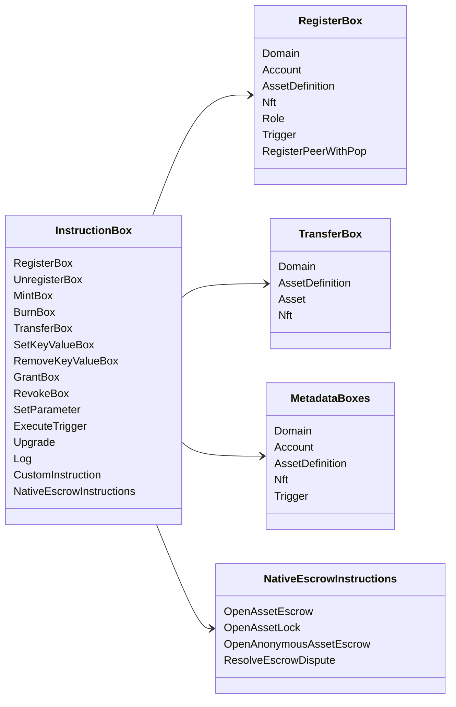

# Iroha სპეციალური ინსტრუქციები {#iroha-special-instructions}

ამჟამინდელი მონაცემთა მოდელი ასახავს ამ ჩაშენებულ ინსტრუქციის ოჯახებს:

|ინსტრუქცია |ვარიანტები |
| --- | --- |
| [`RegisterBox`](/ka/blockchain/instructions.md#un-register) | `Domain`, `Account`, `AssetDefinition`, `Nft`, `Role`, `Trigger`, `RegisterPeerWithPop` |
| [`UnregisterBox`](/ka/blockchain/instructions.md#un-register) | `Peer`, `Domain`, `Account`, `AssetDefinition`, `Nft`, `Role`, `Trigger` |
| [`MintBox`](/ka/blockchain/instructions.md#mint-burn) |ციფრული `Asset`, განმეორების გამომწვევი |
| [`BurnBox`](/ka/blockchain/instructions.md#mint-burn) |ციფრული `Asset`, განმეორების გამომწვევი |
| [`TransferBox`](/ka/blockchain/instructions.md#transfer) |`Domain`, `AssetDefinition`, ციფრული `Asset`, `Nft` |
| [`SetKeyValueBox`](/ka/blockchain/instructions.md#setkeyvalue-removekeyvalue) | `Domain`, `Account`, `AssetDefinition`, `Nft`, `Trigger` მეტა მონაცემები |
| [`RemoveKeyValueBox`](/ka/blockchain/instructions.md#setkeyvalue-removekeyvalue) | `Domain`, `Account`, `AssetDefinition`, `Nft`, `Trigger` მეტა მონაცემები |
| [`GrantBox`](/ka/blockchain/instructions.md#grant-revoke) |ნებართვა ანგარიშსწორებისათვის, როლი ანგარიშგებისათვის, ნებართვ როლისთვის |
| [`RevokeBox`](/ka/blockchain/instructions.md#grant-revoke) |ნებართვა ანგარიშიდან, როლი ანგარიშიდან, ნებართვის როლი |
| [`SetParameter`](/ka/blockchain/instructions.md#setparameter) |ქსელის პარამეტრების განახლება |
| [`ExecuteTrigger`](/ka/blockchain/instructions.md#executetrigger) |განადგურება |
| [`Upgrade`](/ka/blockchain/instructions.md#other-instructions) |აღმასრულებელი განახლება |
| [`Log`](/ka/blockchain/instructions.md#other-instructions) |აღმასრულებელი ლოგის ჩანაწერი |
| [`CustomInstruction`](/ka/blockchain/instructions.md#other-instructions) |აღმასრულებლისთვის სპეციფიური სასარგებლო ტვირთი JSON |
| [ეროვნული აქტივების საფინანსო დაფარვა](/ka/blockchain/escrow.md) | `OpenAssetEscrow`, `AcceptAssetEscrow`, `MarkEscrowPaymentSent`, `ReleaseAssetEscrow`, `CancelAssetEscrow`, `OpenEscrowDispute`, `ResolveEscrowDispute` |
| [გენერული აქტივების ჩაკეტვა](/ka/blockchain/escrow.md#generic-asset-locks) |`OpenAssetLock`, `DrawdownAssetLock`, `CancelAssetLock`, `ExpireAssetLock` |
| [ანონიმური აქტივების დაფარვა](/ka/blockchain/escrow.md#anonymous-escrow) | `OpenAnonymousAssetEscrow`, `AcceptAnonymousAssetEscrow`, `MarkAnonymousEscrowPaymentSent`, `ReleaseAnonymousAssetEscrow`, `CancelAnonymousAssetEscrow`, `OpenAnonymousEscrowDispute`, `ResolveAnonymousEscrowDispute` |

დამატებითი Iroha 3 მოდულები შეიძლება დარეგისტრირდეს დომენის სპეციფიკური ინსტრუქციის ტიპები ინსტრუქციების რეესტრის მეშვეობით. მიმდინარე წყარო ხიდან გენერირებული სქემის დონეზე ჩამონათვალი იხილეთ [ მონაცემთა მოდელი სქემა](./data-model-schema.md) .

::: details დიაგრამა: ძირითადი ინსტრუქციის ოჯახები

:::
