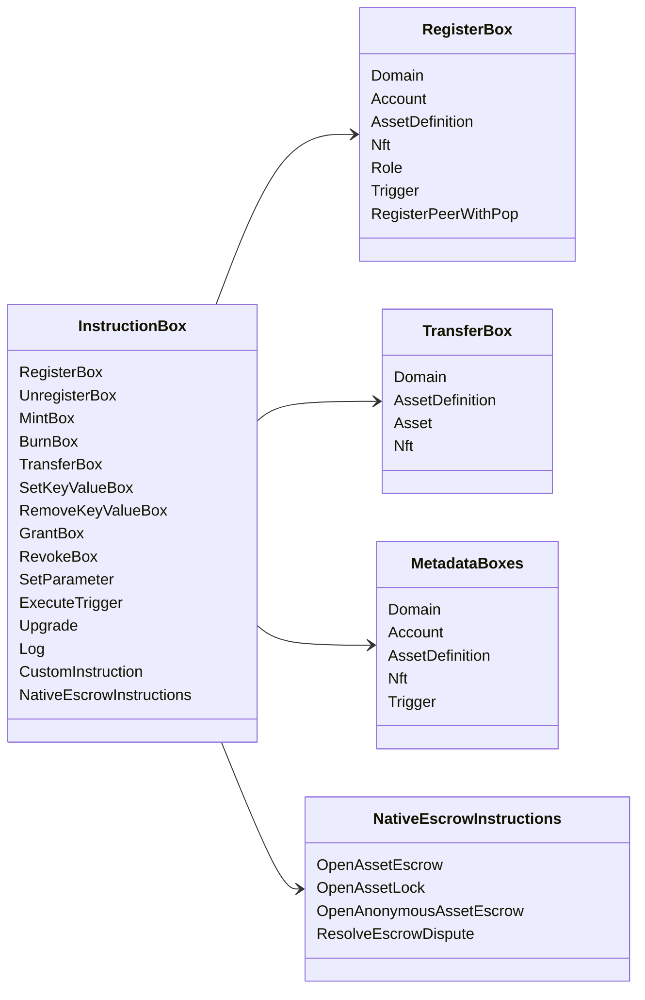

# Iroha ინსტრუქციის ოპერაციები {#iroha-special-instructions}

ამჟამინდელი მონაცემთა მოდელი ასახავს ამ ჩაშენებულ ინსტრუქციის ოჯახებს:

|ინსტრუქცია |ვარიანტები |
| --- | --- |
| [`RegisterBox`](/ka/blockchain/instructions.md#un-register) | `Domain`, `Account`, `AssetDefinition`, `Nft`, `Role`, `Trigger`, `RegisterPeerWithPop` |
| [`UnregisterBox`](/ka/blockchain/instructions.md#un-register) | `Peer`, `Domain`, `Account`, `AssetDefinition`, `Nft`, `Role`, `Trigger` |
| [`MintBox`](/ka/blockchain/instructions.md#mint-burn) |ციფრული `Asset`, განმეორების ტრიგერი |
| [`BurnBox`](/ka/blockchain/instructions.md#mint-burn) |ციფრული `Asset`, განმეორების ტრიგერი |
| [`TransferBox`](/ka/blockchain/instructions.md#transfer) |`Domain`, `AssetDefinition`, ციფრული `Asset`, `Nft` |
| [`SetKeyValueBox`](/ka/blockchain/instructions.md#setkeyvalue-removekeyvalue) | `Domain`, `Account`, `AssetDefinition`, `Nft`, `Trigger` მეტამონაცემები |
| [`RemoveKeyValueBox`](/ka/blockchain/instructions.md#setkeyvalue-removekeyvalue) | `Domain`, `Account`, `AssetDefinition`, `Nft`, `Trigger` მეტამონაცემები |
| [`GrantBox`](/ka/blockchain/instructions.md#grant-revoke) | `Permission` (`Grant<Permission, Account>`), `Role` (`Grant<RoleId, Account>`), `RolePermission` (`Grant<Permission, Role>`) |
| [`RevokeBox`](/ka/blockchain/instructions.md#grant-revoke) | `Permission` (`Revoke<Permission, Account>`), `Role` (`Revoke<RoleId, Account>`), `RolePermission` (`Revoke<Permission, Role>`) |
| [`SetParameter`](/ka/blockchain/instructions.md#setparameter) |ქსელის პარამეტრების განახლება |
| [`ExecuteTrigger`](/ka/blockchain/instructions.md#executetrigger) |განადგურება |
| [`Upgrade`](/ka/blockchain/instructions.md#other-instructions) |აღმასრულებელი განახლება |
| [`Log`](/ka/blockchain/instructions.md#other-instructions) |აღმასრულებელი ლოგის ჩანაწერი |
| [`CustomInstruction`](/ka/blockchain/instructions.md#other-instructions) |აღმასრულებლისთვის სპეციფიური დატვირთვა JSON |
|[ნაციონალური აქტივების საფინანსო დაფარვა](/ka/blockchain/escrow.md) | `OpenAssetEscrow`, `AcceptAssetEscrow`, `MarkEscrowPaymentSent`, `ReleaseAssetEscrow`, `CancelAssetEscrow`, `OpenEscrowDispute`, `ResolveEscrowDispute` |
|[გენერული აქტივების ჩაკეტვა](/ka/blockchain/escrow.md#generic-asset-locks) |`OpenAssetLock`, `DrawdownAssetLock`, `CancelAssetLock`, `ExpireAssetLock` |
|[ანონიმური აქტივების დაფარვა](/ka/blockchain/escrow.md#anonymous-escrow) | `OpenAnonymousAssetEscrow`, `AcceptAnonymousAssetEscrow`, `MarkAnonymousEscrowPaymentSent`, `ReleaseAnonymousAssetEscrow`, `CancelAnonymousAssetEscrow`, `OpenAnonymousEscrowDispute`, `ResolveAnonymousEscrowDispute` |
|[ატომური კერძო ფინანსური ოპერაციების ანგარიშსწორება](/ka/blockchain/instructions.md#atomic-private-settlement) |`ActivatePrivateSettlementPoolV1`, `RotatePrivateSettlementPoolPolicyV1`, `FinalizeAtomicPrivateSettlementV1`, `AbortAtomicPrivateSettlementV1` |

დამატებითი Iroha 3 მოდულები შეიძლება დარეგისტრირდეს დომენის სპეციფიკური ინსტრუქციის ტიპები ინსტრუქციების რეესტრის მეშვეობით. კვანძის ავტორიტეტული სქემისა და ბრძანებისა, რომელიც მას აღებს, იხილეთ [მონაცემთა მოდელის სქემა](./data-model-schema.md).

::: details დიაგრამა: ოჯახების ძირითადი ინსტრუქცია

:::
