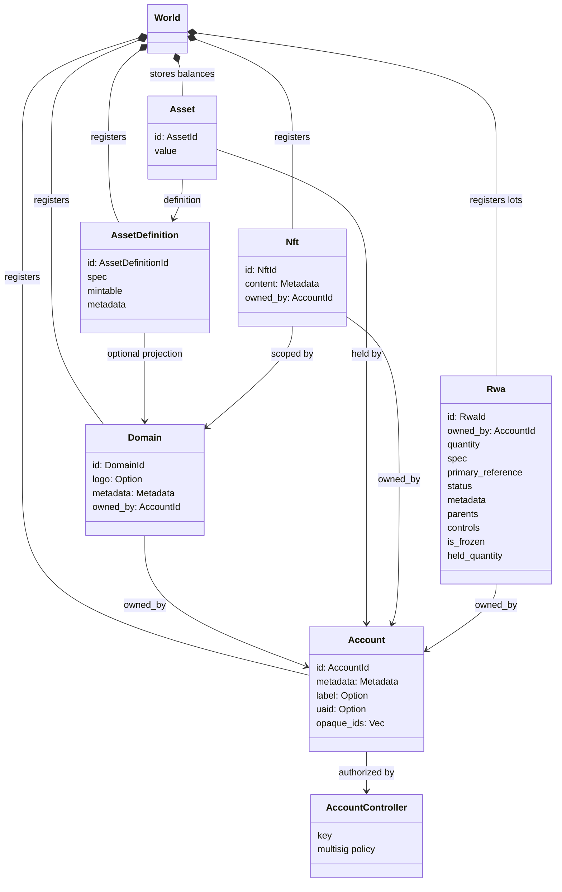
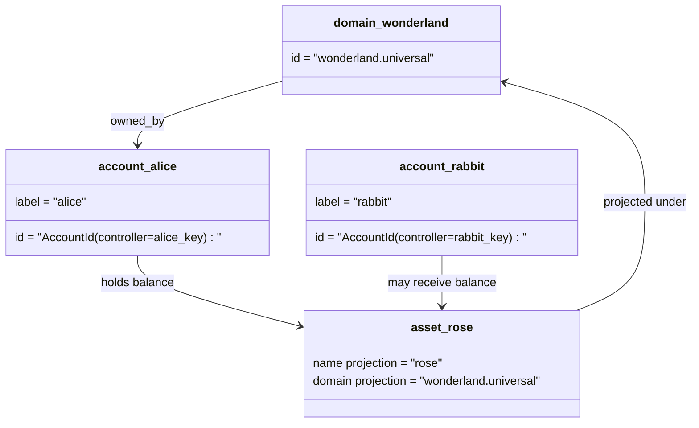

# Деректер моделі {#data-model}

Iroha `World` кітапшасын сақтап қалады. Оның алғашқы шығарылған деректер моделі мынадай каноникалық сәйкестіктер мен субъектілерді қолданады:

- Домендер деректер кеңістігіне сәйкес келеді, мысалы `payments.universal`
- шоттар каноникалық және доменсіз; шот ID есеп жүргізушіден алынған.
- активтер анықтамасы домен/атақ проекциясын сақтай алады, бірақ олардың каноникалық мәтіндік мекенжайы мөлдір емес Base58 идентификаторы болып табылады.
- активтер - нақты актив анықтамасы бойынша шоттарда ұсталатын қалдықтар
- NFTs - доменлік біліктілігі бар IDs және метамәдени мазмұны бар бірегей меншіктегі жазбалар
- RWAs өндірілген- ID партиялар, олар ағымдағы меншік иесі, мөлшері, шығу тегі, метамәліметтері, ұстаулары, тоңазытулары және өмірлік циклді бақылауымен тізбектен тыс активтерді білдіреді.

## Мисал {#example}

Бірде Iroha 3 желісі, `wonderland.universal` ішкі домен болып табылады `universal` Бұл мысалдағы каноникалық есептер олардың кілттері немесе ережелері арқылы бақыланады және доменсіз болып кодталады I105 есеп IDs. Оқуға қабілетті таңбалар: `alice@wonderland.universal` осыларға байланысты жеке атаулар болып табылады IDs. Проектіленген активтің анықтамасы әлі де домен мен атаудан құрылуы мүмкін: `rose` ішінде `wonderland.universal`, ал сымда пайдаланылатын каноникалық активтерді анықтау адресі пайдаланған Base58 адресі болып табылады.

## Жалбырақтары {#aliases}

Алфавиттер - каноникалық кітапша идентификаторларының үстінен қабатталған адам бетіндегі атаулар. Олар API, CLI, қапшық және зерттеуші шекараларында пайдалы, бірақ каноникалық IDs қатаң кітапша салаларында сақталатын тұрақты идентификаторлар болып қала береді .

|Мақсат |Каноникалық мақсат |Әдеттегідей .|Қолдау үлгісі |
| -------------- | --------------------------------------------------- | ------------------------------------------------------ | ----------------------------------------------------------------------------- |
|Пайдаланушы тіркелгісі |доменсіз `AccountId` I105 мекенжайы ретінде кодталған |`name@domain.dataspace` немесе `name@dataspace` |`AccountAlias`; негізгі аты-жөн - `Account.label`, қосымша аты-жөні - бұзылушы |
|Активтер анықтамасы |`AssetDefinitionId` Base58 мекенжайы |`name#domain.dataspace` немесе `name#dataspace` |`AssetDefinitionAlias` активтің анықтамасына байланысты |
|Келісімшарт |Канондық Bech32m `ContractAddress` |`name::domain.dataspace` немесе `name::dataspace` |`ContractAlias` іске қосылған келісімшарт адресіне байланысты |
|Домен атауы |`DomainId` түрінде `domain.dataspace` |`domain.dataspace` |SNS `domain` атау кеңістігінің жазбасы |
|Деректер аумағының атауы |белсенді Nexus каталогынан сандық `DataSpaceId` |`universal`, `paynet` немесе `zk` сияқты деректер кеңістігінің атаулары |SNS `dataspace` атау кеңістігі тіркемесі және белсенді деректер кеңістігінің каталогы |

Тіркелiк атаулары - пайдаланушыға қарасты тіркелiк есімдер. Олар тіркелiктi қайта құрудан сақталады, өйткені аты-жөн активтi тіркелгiне сілтейді ID Дүниежүзілік мемлекеттік индекстер мен есептік жазбалар арқылы. `SetPrimaryAccountAlias` шоттың негізгі этикеті үшін, `SetAccountAliasBinding` қосымша негізгі емес аты-жөндер үшін және `FindAccountByAlias` немесе `FindAliasesByAccountId` Тіркелгілердің аты-жөндері әдетте активті SNS есептік аты-жөнімен жалға алу `AcquireAccountAliasLease` және жаңартылған `RenewAccountAliasLease`.

Актив атаулары жеке есеп айырысу баланстары емес, аты-жөн атаулары. Активтердің аты-жөндері `SetAssetDefinitionAlias` белгіленеді; аты-жүн сегменті активтің анықтамасы дисплей атауы немесе болжамды анықтама атауымен сәйкес келуі тиіс. Келісімшарт аты-жындары `SetContractAlias` белгіленеді; атаулы деректер кеңістігі келісімшарттың мекенжайында кодталған дерек кеңістігіне сәйкес келуі керек. Екі байланыс `lease_expiry_ms` алып жүруге болады; мерзімі өткеннен кейін олар мейірімділік терезесі өтіп кеткен кезде шешілуін тоқтатады және әлемдік мемлекет индекстерінен алынып тасталады.

Домендердің жеке `DomainAlias` объектісі жоқ. Домен идентификаторы қазірдің өзінде `payments.universal` сияқты деректер кеңістігі бойынша білікті атау болып табылады. SNS `domain` атау кеңістігіндегі домен атаулары мен `dataspace` атау кеңiстiгiндегi дерек кеңiс аты-жөндерiне жалға беру меншiгiн қадағалайды. Құпия `universal` деректер кеңістігінің аты-жөндері анықталуы тиіс.

## Қауіпкерлер {#related-docs}

|Тақырыбы|Қайда барсам екен ?|
| -------------------------------------- | ------------------------------------------- |
|Домендер | [Домендер](/kk/blockchain/domains.md) |
|Есептер | [Есепшоттар](/kk/blockchain/accounts.md) |
|Активтер| [Активтер](/kk/blockchain/assets.md) |
|NFTs | [NFTs](/kk/blockchain/nfts.md) |
|Реалдық активтер | [Реалдық әлемдегі активтер](/kk/blockchain/rwas.md) |
|Метамәліметтер| [Метадеректер](/kk/blockchain/metadata.md) |
|Тіркеу және аударым нұсқаулары | [Нұсқаулар](/kk/blockchain/instructions.md) |
|Орындалу уақыты рұқсаттары | [Рұқсаттар](/kk/blockchain/permissions.md) |
|Атау ережелері | [Атау ережелері](/kk/reference/naming.md) |
