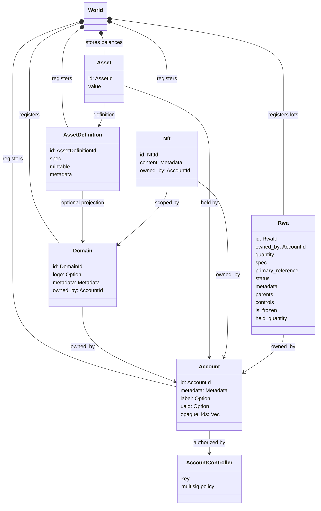
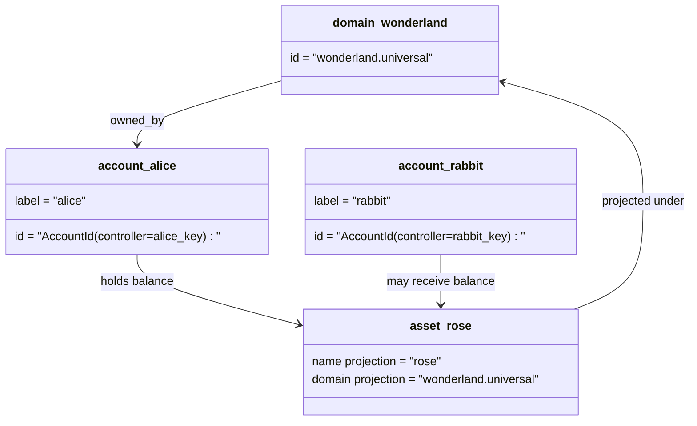

# Деректер моделі {#data-model}

Iroha блокчейн тізілімінің күйін `World` сақтайды. Оның бірінші шығарылым деректер моделі келесі бір ғана протокол-стандартты идентификаторлар мен нысандарды қолданады:

- домендер деректер кеңістігімен сертификатталған, мысалы `payments.universal`
- шоттар бір протоколдық стандартқа жататын және доменсіз; шот идентификаторы шот контроллерінен алынады
- активтердің анықтамалары домен/аты проекциясын сақтай алады, бірақ олардың бір ғана протокол-стандартты мәтіндік мекенжайы – бұл мөлдір емес Base58 идентификаторы
- активтер белгілі бір актив анықтамасы үшін есептік жазбаларда ұсталған қалдықтар болып табылады
- NFTs доменге сәйкес идентификаторлары және метадеректер мазмұны бар ерекше меншік құқықтары бар жазбалар
- RWAs – ағымдағы иесі, саны, шығу тегі, метадеректер, ұстап тұру, тоңдыру және өмірлік циклді басқару арқылы тізбеден тыс активтерді білдіретін жасалған-ID лоттар

## Мысал {#example}

Iroha 3 желісінде, `wonderland.universal` `universal` деректер кеңістігінің ішінде домен болып табылады. Бұл мысалда бір протокол стандартты есепшоттар өздерінің кілттермен немесе саясаттармен бақыланады және доменсіз I105 есепшот идентификаторлары ретінде кодталады. Оқуға ыңғайлы белгілер, мысалы `alice@wonderland.universal`, сол идентификаторларға байланған жеке лақап аттар болып табылады. Жобаланған активтердің анықтамасы әлі де домен мен атаудан құрылуы мүмкін `wonderland.universal` ішіндегі `rose` сияқты, ал протоколдік таратылымда қолданылатын бір ғана протокол-стандартты актив анықтамасы мекенжайы - бұл жасалған Base58 мекенжайы.

## Кейінгі аттар {#aliases}

Алиастар - бұл жеке протокол стандартындағы блокчейн тіркелгі идентификаторларының үстіне қойылған адамға көрінетін аттар. Олар API, CLI, әмиян және шолушы шекараларында пайдалы, бірақ жеке протокол стандартына сәйкес идентификаторлар блокчейн тіркелгі өрістерінде тұрақты идентификаторлар ретінде қалады.

|Мақсат|бір протокол-стандартты мақсат|Лақап атау тура мағынада|Қолдау моделі|
| -------------- | --------------------------------------------------- | ------------------------------------------------------ | ----------------------------------------------------------------------------- |
|Пайдаланушы тіркелгісі|доменсіз `AccountId` I105 мекенжайы ретінде кодталған| `name@domain.dataspace` немесе `name@dataspace`            | `AccountAlias`; негізгі лақап аты `Account.label`, қосымша лақап аттары баптаулар|
|Активтің анықтамасы|жалғыз протокол-стандарт `AssetDefinitionId` Base58 мекенжай| `name#domain.dataspace` немесе `name#dataspace`            | `AssetDefinitionAlias` актив анықтамасына байланысты|
|Шарт|бір протокол-стандарт Bech32m `ContractAddress`| `name::domain.dataspace` немесе `name::dataspace`          | `ContractAlias` орналастырылған келісім-шарт мекенжайына байланған|
|Домен атауы| `DomainId` `domain.dataspace` формада | `domain.dataspace`                                    | SNS `domain` кеңістік атауы жазбасы|
|Деректер кеңістігінің атауы|белсенді Nexus каталогынан сандық `DataSpaceId`| `universal`, `paynet` немесе `zk` сияқты деректер кеңістігінің лақап аты | SNS `dataspace` кеңістік жазбасы және белсенді деректер кеңістігі каталогы |

Шоттық лақап аттары пайдаланушыға көрсетілетін шот атаулары болып табылады. Олар шотты қайта кілттеу кезінде сақталады, себебі лақап ат белсенді шот идентификаторына әлемдік күй индексі және шотты қайта кілттеу жазбалары арқылы нұсқайды. Шоттың негізгі жапсырмасы үшін `SetPrimaryAccountAlias`-ды, қосымша негізгі емес лақап аттар үшін `SetAccountAliasBinding`-ді, ал оқу үшін `FindAccountByAlias` немесе `FindAliasesByAccountId`-ді пайдаланыңыз. Шот лақап аттарына әдетте `AcquireAccountAliasLease` арқылы алынған және `RenewAccountAliasLease` арқылы жаңартылатын белсенді SNS шот-лқап келісімі қажет.

Активтің лақап аттары жеке есеп шоттарының қалдықтарын емес, актив анықтамаларын атайды. Актив лақап аттары мен келісімшарт лақап аттары оқу мүмкін атынан бар бір протокол стандартты нысанға тікелей байланыстар болып табылады. Активтердің айлақ аттары `SetAssetDefinitionAlias` арқылы орнатылады; айлақ атауының сегменті актив анықтамасының көрсетілген атауына немесе болжамды анықтаманың атауына сәйкес болуы тиіс. Келісімшарттардың айлақ аттары `SetContractAlias` арқылы орнатылады; Алиас деректер кеңістігі келісімшарт мекенжайында кодталған деректер кеңістігіне сәйкес болуы керек. Екі байланыс та `lease_expiry_ms` символын тасымалдауы мүмкін; мерзімі өткеннен кейін олар қарындық терезесі аяқталған кезде шешілмей қалады және әлем-мемлекет индекстерінен жойылады.

Домендердің жеке `DomainAlias` объектісі жоқ. Домен идентификаторы деректер кеңістігімен анықталған ат болып табылады, мысалы, `payments.universal`. SNS жалдау меншіклін қадағалайды `domain` кеңістігінде домен аттары үшін және `dataspace` кеңістігінде деректер кеңістігі лақап аттары үшін. Брондалған `universal` деректер кеңістігінің лақап аты анықталған күйінде қалуы керек.

## Қатысты құжаттар {#related-docs}

|Тақырып|Қайда баруға|
| -------------------------------------- | ------------------------------------------- |
|Домендер| [Домендер](/kk/blockchain/domains.md)           |
|Есеп-шоттар| [Шоттар](/kk/blockchain/accounts.md)         |
|Активтер| [Активтер](/kk/blockchain/assets.md)             |
| NFTs                                   | [NFTs](/kk/blockchain/nfts.md)                 |
|Шынайы дүниедегі активтер| [Шынайы дүниедегі активтер](/kk/blockchain/rwas.md)    |
|Метадеректер| [Метадеректер](/kk/blockchain/metadata.md)         |
|Тіркеу және аудару нұсқаулары| [Нұсқаулар](/kk/blockchain/instructions.md) |
|бағдарламалық қамтамасыз етуді орындау ортасының рұқсаттары| [Рұқсаттар](/kk/blockchain/permissions.md)   |
|Атау қою ережелері| [Атау ережелері](/kk/reference/naming.md)        |
