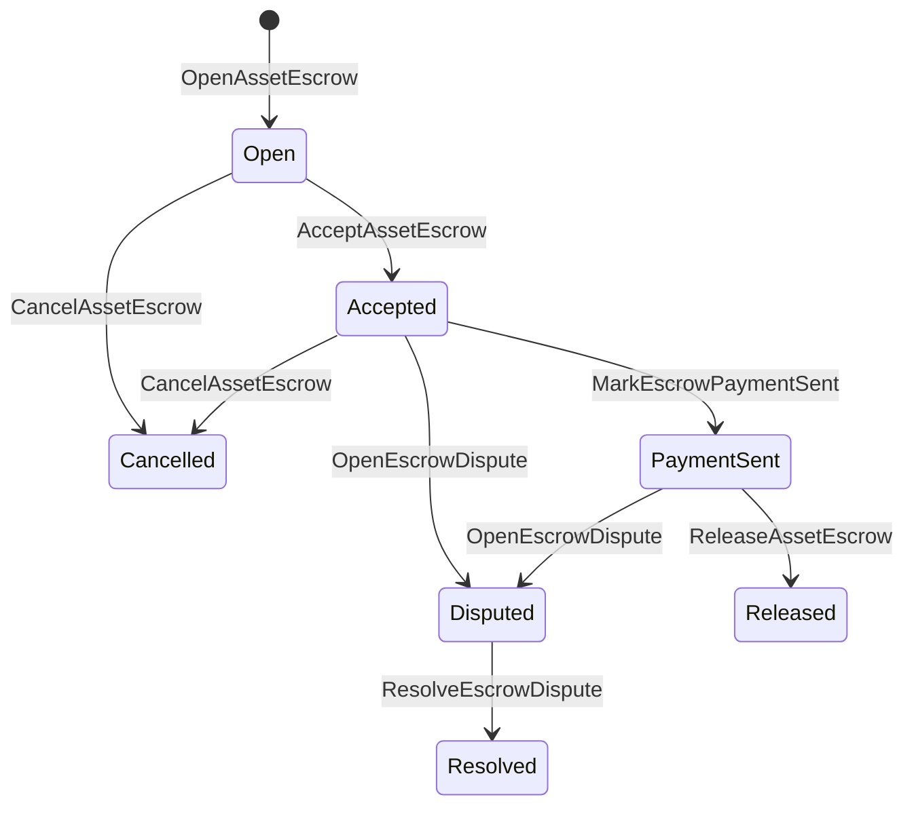

# Жергiлiктi активтердi басқару {#native-asset-escrow}

Native escrow - сандық активтерді сақтаудың бухгалтерлік кітапшамен басқарылатын тетігі. Қолданбаға ие шотқа активтерді жіберудің орнына және сол шотты қорғау үшін өтінім кодына сүйене отырып, ISIs құнын детерминистік протоколдық қамқорлық шотына аударып, кепілдік берудің өмір циклін әлемдік деңгейде тіркейді.

Базардағы есеп айырысу үшін жергілікті кепілдікті пайдалану, Атай стилімен тізбектен тыс төлемдерді үйлестіру, маңызды қадамдарды бекіту және кітапшаға көрінетін өмір циклының жай-күйін қажет ететін қорғалған кепілдікті жұмыс барысы.

## Тұжырымдамалар {#concepts}

|Тұжырымдама |Бейнелеу |
| --- | --- |
|`EscrowId` |Шақырушының таңдап алған идентификаторы, ол ашық және анонимді кепілгерлер арасында бірегей болуы тиіс. |
|`AssetEscrowRecord` |Транспарентті сандық активтердің депозиттік немесе кілтілік тіркелімі. |
|`AnonymousAssetEscrowRecord` |Құжаттарды жою, міндеттемелерді орындау және дәлелдеу құжаттарымен қамтамасыз етілген қорланған депозиттік тіркелім. |
|Күзет шоттары |ID тізбекінен, ID кепілдендірілген шоттан және активтің анықтамасынан алынған детерминистік протокол. |
|Дәлелдемелер шешесі |Дәлелдемелер шешелері шоттарды, сот шешімдерін, хабарламаларды, сақтау манифесттерін немесе басқа да тізбектен тыс дәлелдемелерді анықтауға болады.|

Өткінші жазбаларда сатушы, ерікті сатып алушы, активтердің анықтамасы, жалпы сомасы, қамқорлық шоты, өмірлік цикл жағдайы, мінез-құлық түрі, қалған сома, ерікті босату өкілеттігі, ерікті мерзімі өткен уақыт мөрі, дәлелдеме хэштері, уақыт мөрі және ерікті шешу деректері көрсетіледі.

Ескроу сомалары оң сандық активтер мөлшері болуы керек және активтердің анықтамасының сандық ерекшелігіне сәйкес келуі тиіс. Эскроу немесе блокировка белсенді болған кезде, жалпы активтерді аудару қорғаншылық шотын ағындыра алмайды; қорғаншылықтан шығу жолдары төменде сипатталған қорғаншылық ISIs болып табылады.

## Базардағы депозит {#marketplace-escrow}

Базардағы кепілгерлік жүйелер желідегі активтерді босатуды және желіден тыс төлемді немесе жеткізуді үйлестіреді.



|ISI |Оны кім тапсырады ?|Нәтижесі |
| --- | --- | --- |
|`OpenAssetEscrow` |Сатушы |Протоколды сақтаудағы сатушының сандық активін бекітеді және `Open` нарықтағы тіркемені жасайды. |
|`AcceptAssetEscrow` |Сатып алушы |Сатып алушыны тіркеп, `Open` -ға ауыстырады `Accepted`. Сатушы өзінің кепілдігін қабылдамайды.|
|`MarkEscrowPaymentSent` |Қабылданған сатып алушы |`Accepted` сатып алушы тізбектен тыс төлемді жібергеннен кейін `PaymentSent`-ға ауыстырылады. |
|`ReleaseAssetEscrow` |Сатушы |`PaymentSent` -ны `Released`-ға көшіріп, сатып алушыға толық кепілдендірілген сома аударылады. |
|`CancelAssetEscrow` |Сатушы |`Open` немесе `Accepted`-ны `Cancelled`-ге көшіріп, төлем белгіленгеннен бұрын сатушыға қайтарылады. |
|`OpenEscrowDispute` |Сатушы немесе қабылданған сатып алушы |`Accepted` немесе `PaymentSent`-ны `Disputed`-ге көшіріп, дәлелдемелерді шешелермен қосады. |
|`ResolveEscrowDispute` |`CanResolveEscrowDispute` бойынша шот| Қозғалыстар `Disputed` үшін `Resolved` және сатып алушы мен сатушы арасында бөлінеді. |

Таулы мәселелерді шешу сомалары теріс болмауы тиіс, ал `buyer_amount + seller_amount` кепілдік сомасына тең болуы керек. нөлдік мәнді аяқтарға рұқсат етіледі, бірақ барлық бөлініс бекітілген балансты есепке алуы қажет.

### Rust мысал {#rust-example}

Бұл мысал сатушы мен сатып алушының шоттары бар екенін, активтің анықтамасы сандық болып тіркелгенін және сатушының теңгерімінің жеткілікті екенін болжайды.

```rust
use iroha::{
    client::Client,
    data_model::{
        isi::escrow::{
            AcceptAssetEscrow, MarkEscrowPaymentSent, OpenAssetEscrow,
            ReleaseAssetEscrow,
        },
        prelude::*,
    },
};
use iroha_crypto::Hash;

fn release_marketplace_escrow(
    seller_client: &Client,
    buyer_client: &Client,
    asset_definition_id: AssetDefinitionId,
) -> eyre::Result<()> {
    let escrow_id = EscrowId::new(Hash::new("docs-marketplace-escrow-001"));

    seller_client.submit_blocking(OpenAssetEscrow::with_evidence_hashes(
        escrow_id,
        asset_definition_id,
        Numeric::from(40_u64),
        vec![Hash::new("invoice:2026-001")],
    ))?;

    buyer_client.submit_blocking(AcceptAssetEscrow::new(escrow_id))?;
    buyer_client.submit_blocking(MarkEscrowPaymentSent::new(escrow_id))?;
    seller_client.submit_blocking(ReleaseAssetEscrow::new(escrow_id))?;

    let record = seller_client.query_single(FindAssetEscrowById::new(escrow_id))?;
    assert_eq!(record.status, AssetEscrowStatus::Released);
    assert_eq!(record.remaining_amount, Numeric::zero());

    Ok(())
}
```

## Жалпы активтер қақпақтары {#generic-asset-locks}

Активтер кілтісі бірдей сақтау жазбасын пайдаланады, бірақ олар сатып алушы-сатушы ұсыныстары болып табылмайды. Олар мақсат шотына арналған қаражатты қаптайды және мүмкіндігінше қаражат алу үшін бөлек босату органына қажет болады.

|ISI |Оны кім тапсырады ?|Нәтижесі |
| --- | --- | --- |
|`OpenAssetLock` |Бастапқы есеп |Жақсы соманы бекітеді, баратын жерді рекордтық сатып алушы ретінде тіркейді және жағдайды `Locked` деп қояды. |
|`DrawdownAssetLock` |Рұқсат ету өкілеттігі немесе рұқсат беру өкілеттігі белгіленбеген жер |Қалған күтімнің бір бөлігін немесе бәрін де мақсатқа аударады. |
|`CancelAssetLock` |Қапшықты ашу |Белгілі құлыпты жою және қалған соманы ашушыға қайтару. |
|`ExpireAssetLock` |Мерзімінен кейін кез келген транзакциялық орган |Өткенде `expires_at_ms` белгісі бар кілті аяқталады және қалған соманы ашушыға қайтарады. |

`DrawdownAssetLock` тіркемені `Locked`-да сақтайды, ал белгілі бір сома сақталады. Қалған сома нөлге жеткенде, жағдай `DrawnDown` болып табылады және тіркеме жабылады.

```rust
use iroha::{
    client::Client,
    data_model::{
        isi::escrow::{CancelAssetLock, DrawdownAssetLock, ExpireAssetLock, OpenAssetLock},
        prelude::*,
    },
};
use iroha_crypto::Hash;

fn drawdown_and_close_asset_locks(
    opener_client: &Client,
    destination_client: &Client,
    release_authority_client: &Client,
    asset_definition_id: AssetDefinitionId,
    destination: AccountId,
    release_authority: AccountId,
) -> eyre::Result<()> {
    let trusted_lock_id = EscrowId::new(Hash::new("docs-asset-lock-trusted"));

    opener_client.submit_blocking(OpenAssetLock::with_options(
        trusted_lock_id,
        asset_definition_id.clone(),
        destination.clone(),
        Numeric::from(40_u64),
        Some(release_authority),
        None,
        vec![Hash::new("milestone-plan-v1")],
    ))?;

    release_authority_client.submit_blocking(DrawdownAssetLock::new(
        trusted_lock_id,
        Numeric::from(15_u64),
    ))?;

    let partially_drawn =
        opener_client.query_single(FindAssetEscrowById::new(trusted_lock_id))?;
    assert_eq!(partially_drawn.status, AssetEscrowStatus::Locked);
    assert_eq!(partially_drawn.remaining_amount, Numeric::from(25_u64));

    opener_client.submit_blocking(CancelAssetLock::new(
        trusted_lock_id,
        partially_drawn.remaining_amount.clone(),
    ))?;
    let cancelled = opener_client.query_single(FindAssetEscrowById::new(trusted_lock_id))?;
    assert_eq!(cancelled.status, AssetEscrowStatus::Cancelled);

    let expiring_lock_id = EscrowId::new(Hash::new("docs-asset-lock-expiring"));
    opener_client.submit_blocking(OpenAssetLock::with_options(
        expiring_lock_id,
        asset_definition_id,
        destination,
        Numeric::from(10_u64),
        None,
        Some(0),
        Vec::new(),
    ))?;

    destination_client.submit_blocking(ExpireAssetLock::new(expiring_lock_id))?;
    let expired = opener_client.query_single(FindAssetEscrowById::new(expiring_lock_id))?;
    assert_eq!(expired.status, AssetEscrowStatus::Expired);

    Ok(())
}
```

Python Қазіргі уақытта жалпы қақпақтардың жоғары деңгейдегі көмекшілерін: `open_asset_lock`, `drawdown_asset_lock`, `cancel_asset_lock`, және `expire_asset_lock`. Базардағы және анонимді кепілдендіру үшін Python, пайдалану каноникалық `InstructionBox` JSON арқылы SDK Ол ... JSON құтылу қақпасы, немесе бір SDK Бұл бірінші дәрежелі кепілдік салушыларды әшкерелейді.

## Таластар {#disputes}

Базардағы кепілдік `Accepted` немесе `PaymentSent` арқылы дауға кіре алады. Тек тіркелген сатушы немесе сатып алушы ғана дауды аша алады. Шешімдеу үшін `CanResolveEscrowDispute` қажет, ол тікелей шешім беруші шотына беріледі немесе рөл арқылы мұраланады.

```rust
use iroha::{
    client::Client,
    data_model::{
        isi::escrow::{OpenEscrowDispute, ResolveEscrowDispute},
        prelude::*,
    },
};
use iroha_crypto::Hash;
use iroha_executor_data_model::permission::escrow::CanResolveEscrowDispute;

fn resolve_disputed_escrow(
    admin_client: &Client,
    buyer_client: &Client,
    court_client: &Client,
    court: AccountId,
    escrow_id: EscrowId,
) -> eyre::Result<()> {
    admin_client.submit_blocking(Grant::account_permission(
        Permission::from(CanResolveEscrowDispute),
        court,
    ))?;

    buyer_client.submit_blocking(OpenEscrowDispute::with_evidence_hashes(
        escrow_id,
        vec![Hash::new("buyer-payment-receipt")],
    ))?;

    court_client.submit_blocking(ResolveEscrowDispute::with_evidence_hashes(
        escrow_id,
        Numeric::from(30_u64),
        Numeric::from(10_u64),
        vec![Hash::new("court-judgement-001")],
    ))?;

    let record = admin_client.query_single(FindAssetEscrowById::new(escrow_id))?;
    assert_eq!(record.status, AssetEscrowStatus::Resolved);
    assert_eq!(
        record.resolution.as_ref().map(|resolution| resolution.buyer_amount.clone()),
        Some(Numeric::from(30_u64)),
    );

    Ok(())
}
```

## Анонимдік депозит {#anonymous-escrow}

Анонимдік депозит нарықтағы өмірлік циклді пайдаланады, бірақ қаржыландыру және жабылу активтерінің қозғалысы қорғалады. Қоғамдық жазба әлі күнге дейін сатушыны, сатып алушыны, жай-күйін, дәлелдемелерді, уақыт таңбаларын және дәлелдемелермен байланысты қозғалыс деректерін сақтайды. Қорғалған банкноталардың ішіндегі сомалар мен алушылар міндеттемелермен, күшін жоюшылармен және дәлелді қосымшалармен көрсетіледі.

|Өткінші ISI |Аноним ISI |
| --- | --- |
|`OpenAssetEscrow` |`OpenAnonymousAssetEscrow` |
|`AcceptAssetEscrow` |`AcceptAnonymousAssetEscrow` |
|`MarkEscrowPaymentSent` |`MarkAnonymousEscrowPaymentSent` |
|`ReleaseAssetEscrow` |`ReleaseAnonymousAssetEscrow` |
|`CancelAssetEscrow` |`CancelAnonymousAssetEscrow` |
|`OpenEscrowDispute` |`OpenAnonymousEscrowDispute` |
|`ResolveEscrowDispute` |`ResolveAnonymousEscrowDispute` |

Портфель немесе провер құралы дәлелді қосымшаны және қоғамдық кірістерді құруы керек. Ашық ету бір депозиттік міндеттеме жасайды. босату, күшін жою және анонимді дауларды шешу дәл бір депозиттік міндеттемені жұмсайды және іс-әрекет үшін қажетті сатып алушы, сатушы немесе бөлінген шығыс міндеттемелерін құруы тиіс.

```rust
use iroha::{
    client::Client,
    data_model::{
        isi::escrow::{
            AcceptAnonymousAssetEscrow, MarkAnonymousEscrowPaymentSent,
            OpenAnonymousAssetEscrow,
        },
        prelude::*,
        proof::ProofAttachment,
    },
};
use iroha_crypto::Hash;

fn open_anonymous_escrow(
    seller_client: &Client,
    buyer_client: &Client,
    escrow_id: EscrowId,
    asset_definition_id: AssetDefinitionId,
    funding_nullifiers: Vec<[u8; 32]>,
    escrow_commitment: [u8; 32],
    proof: ProofAttachment,
    root_hint: Option<[u8; 32]>,
) -> eyre::Result<()> {
    seller_client.submit_blocking(OpenAnonymousAssetEscrow::with_evidence_hashes(
        escrow_id,
        asset_definition_id,
        funding_nullifiers,
        escrow_commitment,
        proof,
        root_hint,
        vec![Hash::new("shielded-invoice")],
    ))?;

    buyer_client.submit_blocking(AcceptAnonymousAssetEscrow::new(escrow_id))?;
    buyer_client.submit_blocking(MarkAnonymousEscrowPaymentSent::new(escrow_id))?;

    Ok(())
}
```

Негізгі қорғалған операция үлгісі үшін [Анонимді операциялар](/kk/blockchain/anonymous-transactions.md) дегенді қараңыз.

## SDK пайдалану {#sdk-usage}

SDKs. Rust каноникалық типті дерек үлгісі бар. Python қазіргі уақытта жалпы активтерді бұғаттау көмекшілерін көрсетеді. JavaScript және TypeScript пайдалану Kotodama депозиттік хост шақырулары. Kotlin/JVM және Swift нарыққа арналған типті пайдалы жүк жасаушыларды және анонимді кепілгерлерді қамтамасыз етеді.

|SDK |Осы бетті пайдаланыңыз .|Ауқымы |
| --- | --- | --- |
| [Rust](#rust-sdk) |`iroha::data_model::isi::escrow` |Базардағы депозит, жалпы құлыптар, анонимді депозит, сұраулар және оқиғалар. |
| [Python](#python-asset-locks) |`Instruction.open_asset_lock`, `TransactionDraft.open_asset_lock` және клиенттің `*_and_wait` көмекшілері |Жалпы активтердің құлыптары. Базар және анонимді кепілгерлік көмекшілері әлі күнге дейін бірінші деңгейдегі Python әдістер емес. |
| [JavaScript / TypeScript](#javascript-and-typescript-kotodama) |`compileKotodamaProgram` -ден `@iroha/iroha-js/kotodama-compiler`|Kotodama келісім-шарттардағы эскроу хостинг шақырады. |
| [Kotlin / JVM](#kotlin-and-jvm) |`InstructionTemplate` сыныптары `org.hyperledger.iroha.sdk.core.model.instructions` |Базар және анонимді кепілдік берудің арнайы нұсқаулық үлгілері. |
| [Swift / iOS](#swift-and-ios) |`NativeEscrowInstructionBuilders` және `IrohaSDK.build*Escrow*` көмекшілері |Базар және анонимді кепілдік беру Norito JSON нұсқаулықтардың пайдалы жүктемелер. |

Төмендегі мысалдар нұсқаулық құрылымына назар аударады: шот қаржыландыру, қолтаңбаларды басқару және мәмілелерді тапсыру әрбір SDK үшін қалыпты ағыннан тұрады.

### Rust SDK {#rust-sdk}

Rust SDK толық жергілікті қамтуды немесе сұрау / оқиғаларды қолдауды қажет еткен кезде қолданыңыз. Жоғарыда келтірілген мысалдарда нарықта шығарылу, жалпы жабылма алу, дауларды шешу және `iroha::data_model::isi::escrow`мен анонимді кепілдік жасау көрсетіледі.

```rust
use iroha::{
    client::Client,
    data_model::{isi::escrow::OpenAssetEscrow, prelude::*},
};
use iroha_crypto::Hash;

fn open_and_read(
    client: &Client,
    asset_definition_id: AssetDefinitionId,
) -> eyre::Result<AssetEscrowRecord> {
    let escrow_id = EscrowId::new(Hash::new("docs-rust-sdk-escrow"));

    client.submit_blocking(OpenAssetEscrow::new(
        escrow_id,
        asset_definition_id,
        Numeric::from(10_u64),
    ))?;

    client.query_single(FindAssetEscrowById::new(escrow_id))
}
```

### Python Активтер қапшығы {#python-asset-locks}

Python SDK жалпы активтердің бұғаулары үшін бірінші дәрежелі көмекшілерді көрсетеді. Оларды кезеңді төлемдер, босату органының тартулары, ашушының күшін жоюы және мерзімі өткен аударымдар үшін пайдалану.

```python
client.open_asset_lock_and_wait(
    chain_id="dev-chain",
    authority="<source-account-id>",
    private_key_hex="<source-private-key-hex>",
    escrow_id="merchant-lock-001",
    asset_definition_id="<asset-definition-base58>",
    destination="<destination-account-id>",
    amount="2500",
    release_authority="<trusted-release-account-id>",
    expires_at_ms=1_704_000_000_000,
)

client.drawdown_asset_lock_and_wait(
    chain_id="dev-chain",
    authority="<trusted-release-account-id>",
    private_key_hex="<trusted-release-private-key-hex>",
    escrow_id="merchant-lock-001",
    amount="1000",
)

client.expire_asset_lock_and_wait(
    chain_id="dev-chain",
    authority="<any-account-id>",
    private_key_hex="<any-private-key-hex>",
    escrow_id="merchant-lock-001",
)
```

Екі тарапты бұғаттау үшін `release_authority` қалдырыңыз; содан кейін барушы шот `drawdown_asset_lock` тапсыра алады.

### JavaScript және TypeScript Kotodama {#javascript-and-typescript-kotodama}

JavaScript SDK қазіргі уақытта тікелей жергiлiктi эскорлық транзакция жасаушыларды ашпайды. Kotodama келісімшарттарын орналастыратын JavaScript немесе TypeScript қолданбалар үшін Kotodama компиляторымен эскорлік хост шақыруларын жинақтаңыз.

Туғандық эскорлық хост шақырылымдарына айқын қол жеткізу параметрлері қажет, өйткені компилятор ашық емес эскор ISIs үшін таррақ қол жеткізу жиынтығын ала алмайды. Экспортқа шығарылған кіру нүктелерінде `escrow_*` құрамаларын шақыратын Wildcard параметрлерін қолданыңыз.

```js
import { compileKotodamaProgram } from "@iroha/iroha-js/kotodama-compiler";

const source = `
seiyaku MarketplaceEscrow {
  meta { abi_version: 1; }

  #[access(read="*", write="*")]
  kotoage fn run() permission(Admin) {
    let asset = asset_definition("62Fk4FPcMuLvW5QjDGNF2a4jAmjM");
    let offer = name("aitai_offer");
    let evidence = norito_bytes("00");

    call escrow_open_offer(offer, asset, 10, evidence);
    call escrow_accept(offer);
    call escrow_mark_payment_sent(offer);
    call escrow_release(offer);
  }
}
`;

const compiled = compileKotodamaProgram(source, {
  sourceName: "escrow.ko",
});

if (compiled.diagnostics.length > 0) {
  throw new Error(compiled.diagnostics.map((item) => item.message).join("\n"));
}
```

Таластар үшін пайдалану `escrow_open_dispute(offer, evidence)` және `escrow_resolve_dispute(offer, buyer_amount, seller_amount, evidence)`. Анонимдік эскорлық қоректенуші шақыруларды қабылдау Norito мысалы, пайдалы жүктеме байттарын сұраңыз `anonymous_escrow_open_offer(request)`.

### Kotlin және JVM {#kotlin-and-jvm}

Kotlin/JVM SDK аталмыш кепілдікті жеке нұсқама үлгілері ретінде модельдейді. Әрбір үлгі қажетті өрістерді растайды және транзакция жасаушы қолданған каноникалық аргумент картасын көрсетеді.

```kotlin
import org.hyperledger.iroha.sdk.core.model.escrow.NativeEscrowPermissions
import org.hyperledger.iroha.sdk.core.model.instructions.AcceptAssetEscrowInstruction
import org.hyperledger.iroha.sdk.core.model.instructions.MarkEscrowPaymentSentInstruction
import org.hyperledger.iroha.sdk.core.model.instructions.OpenAssetEscrowInstruction
import org.hyperledger.iroha.sdk.core.model.instructions.ReleaseAssetEscrowInstruction
import org.hyperledger.iroha.sdk.core.model.instructions.ResolveEscrowDisputeInstruction

val open = OpenAssetEscrowInstruction(
    escrowId = "escrow-hash",
    assetDefinition = "xor#wonderland",
    amount = "42.5",
    evidenceHashes = listOf("invoice-hash"),
)
val accept = AcceptAssetEscrowInstruction("escrow-hash")
val paid = MarkEscrowPaymentSentInstruction("escrow-hash")
val release = ReleaseAssetEscrowInstruction("escrow-hash")
val resolve = ResolveEscrowDisputeInstruction(
    escrowId = "escrow-hash",
    buyerAmount = "30",
    sellerAmount = "12.5",
    evidenceHashes = listOf("judgement-hash"),
)

println(open.arguments)
println(NativeEscrowPermissions.CAN_RESOLVE_ESCROW_DISPUTE)
```

Аноним үлгілері: `OpenAnonymousAssetEscrowInstruction`, `AcceptAnonymousAssetEscrowInstruction`, `MarkAnonymousEscrowPaymentSentInstruction`, `ReleaseAnonymousAssetEscrowInstruction`, `CancelAnonymousAssetEscrowInstruction`, `OpenAnonymousEscrowDisputeInstruction`, және `ResolveAnonymousEscrowDisputeInstruction`. Android Java шақырушылар сәйкестендіруді пайдалана алады `NativeEscrowInstructions.*` Құрылысшылар Android артефакт.

### Swift және iOS {#swift-and-ios}

Swift SDK депозиттік нұсқауларды Norito JSON пайдалы жүктемелер ретінде жасайды. Тікелей `NativeEscrowInstructionBuilders` қолданыңыз немесе қолданбаңызда қазірдің өзінде `IrohaSDK` үлгісі бар болса, еквивалентті `IrohaSDK.build*Escrow*` көмекшісіне хабарлаңыз.

```swift
import IrohaSwift

let open = try NativeEscrowInstructionBuilders.openAssetEscrow(
    escrowId: "escrow-hash",
    assetDefinition: "xor#wonderland",
    amount: "42.5",
    evidenceHashes: ["invoice-hash"]
)
let accept = try NativeEscrowInstructionBuilders.acceptAssetEscrow(
    escrowId: "escrow-hash"
)
let paid = try NativeEscrowInstructionBuilders.markEscrowPaymentSent(
    escrowId: "escrow-hash"
)
let release = try NativeEscrowInstructionBuilders.releaseAssetEscrow(
    escrowId: "escrow-hash"
)
let resolve = try NativeEscrowInstructionBuilders.resolveEscrowDispute(
    escrowId: "escrow-hash",
    buyerAmount: "30",
    sellerAmount: "12.5",
    evidenceHashes: ["judgement-hash"]
)
```

Анонимді Swift жасаушылар жойылушы тізімдерді, шығыс міндеттемелер тізімін, дәлелді сөздікті және таңдаулы `rootHint` мәндерін алады. Тәртіп белгісі `NativeEscrowPermissions.canResolveEscrowDispute` ретінде қол жетімді.

## Сұрақтар мен оқиғалар {#queries-and-events}

Статус беттеріне, келісу жұмыстарына және қолдау құралдарына кепілдік беру сұрауларын қолдану:

|Сұрақтар |Мақсаты |
| --- | --- |
|`FindAssetEscrowById` |`EscrowId` арқылы бір мөлдір кепілдендірілу немесе бекітуді оқыңыз. |
|`FindAssetEscrows` |Көзге көрінетін депозиттік және жабық жазбаларды тізімдеу. |
|`FindAssetEscrowsBySeller` |Сатушы немесе құлыпты ашушы ашыған жазбаларды тізімдеу. |
|`FindAssetEscrowsByBuyer` |Базардағы сатып алушы қабылдайтын кепілдіктерді тізімдеу немесе баратын жерді мақсат ету. |
|`FindAssetEscrowsByStatus` |`AssetEscrowStatus` бойынша тізімді жазу. |
|`FindAnonymousAssetEscrowById` |`EscrowId` арқылы бір анонимді кепілдікті оқыңыз. |
|`FindAnonymousAssetEscrows*` |Барлық тіркелгілер, сатушы, сатып алушы немесе мәртебе бойынша анонимді кепілгерлерді тізімдеу. |

`EscrowEventFilter` транспаренттiк жергiлiктi кепiлдiк және кепілдендiру арқылы жабылу іс-шараларына жазылуға болады ID, сатушы, сатып алушы, мәртебе және іс-шаралар маскасы. `Opened`, `Accepted`, `PaymentSent`, `Released`, `Cancelled`, `Expired`, `Disputed`, және `Resolved`. Анонимдік депозиттік жазбалар анонимді депозиттік сұрау салу арқылы тексеріледі.

## Операциялық ескертулер {#operational-notes}

- Үлкен шот-фактураларды, сұхбат журналдарын, сот шешімдерін немесе аудит топтамаларын депозиттік тіркелімнің сыртында сақтаңыз және олардың хэшестерін дәлелдеме ретінде қосасыз.
- Өтiнiштерде тұрақты `EscrowId` шығарылымын қолдану, сондықтан қайта сынақтарда бiрдей ұсыныс үшiн екпiлiк әшекейлер құрылмас.
- `CanResolveEscrowDispute` тек даулар процесін жүзеге асыратын шоттарға немесе рөлдерге ғана беріледі.
- Тіркелгі саясаты ретінде тізбектен тыс төлемдерді тексеруді қараңыз. Iroha сақтау мен өмірлік циклге ауысуларды тіркейді; ол fiat немесе сыртқы төлем рельстерін өзі тексермейді.
