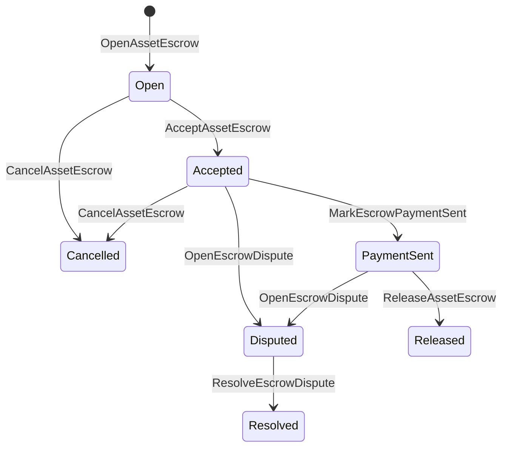

# Туынды активтерді сенімхатта сақтау {#native-asset-escrow}

Туған жердегі эскроу сандық активтерге арналған блокчейн тізбесімен басқарылатын қамау механизмі болып табылады. Активтерді қосымшаға тиесілі есепшотқа жіберу және оған сену орнына сол аккаунтты қорғау үшін қолданба коды, эскроу ISIs мәнін детерминистикалық хаттама сақтау аккаунтына аудару және эскроу өмірлік циклін әлемдік күйде тіркеу.

Нарықтағы қаржылық транзакцияларды settlements үшін жергілікті эскроу пайдаланыңыз, Аитай стиліндегі офф-ченнел төлем үйлестіру, кезеңдік құлыптар және блокчейн есептік жазба өмірлік циклінде көрінетін қорғалған эскроу жұмыс ағындары.

## Түсініктер {#concepts}

|ұғым|Сипаттама|
| --- | --- |
| `EscrowId` |клиент таңдайтын идентификаторды криптографиялық хэшпен орай отырып сұрау. Ол ашық және анонимді кепілдіктер арасында бірегей болу керек.|
| `AssetEscrowRecord` |Транспарент сандық активтерді тіркеу немесе құлыптау жазбасы.|
| `AnonymousAssetEscrowRecord` |Нөлдендіргіштермен, криптографиялық міндеттеме мәндерімен және дәлелдік қоса тіркемелерімен қамтамасыз етілген қорғалған эскроу жазбасы.|
|Сақтау шоты|Тізбек идентификаторы, кепілдік идентификаторы және актив анықтамасынан алынған детерминистік протокол аккаунты.|
|Дәлелді криптографиялық хэштер|Дәлелдік криптографиялық хэштер шот-фактураларды, сот шешімдерін, хабарламаларды, сақтау техникалық манифесттерін немесе басқа сыртқы дәлелдерді анықтай алатынын көрсете алады. Дәлелдік жүктеме өзі эскроу жазбасында сақталмайды.|

Мәйкем жазбалар сатушыны, таңдамалы сатып алушыны, активтің анықтамасын, жалпы соманы, сақтау шотын, өмірлік цикл күйін, мінез-құлық түрін, қалған соманы, таңдамалы шығару құқығы басын, таңдамалы мерзім аяқталу уақытын, дәлелдік криптографиялық хэштерін, уақыт белгілерін және таңдамалы шешім мәліметтерін қамтиды.

Эскроу сомалары оң сандық актив мөлшері болуы керек және актив анықтамасындағы сандық ерекшелікпен сәйкес келуі керек. Эскроу немесе құлыптау белсенді болған кезде, жалпы актив аударымдары сақтау шотын босата алмайды; сақтау шығу жолдары төменде сипатталған эскроу ISIs болып табылады.

## Маркетплейс депозиттік есеп {#marketplace-escrow}

Маркетплейстің эскроуы тізбеде орналасқан активті төлесіз немесе жеткізу жұмыс ағымымен бірге босатуды үйлестіреді.



| ISI |Оны кім тапсырады|Әсер|
| --- | --- | --- |
| `OpenAssetEscrow` |Сатушы|Сатушының сандық активін протоколдың сақтауында құлыптайды және `Open` нарық жазбасын жасайды.|
| `AcceptAssetEscrow` |Сатып алушы|Сатып алушыны тіркейді және `Open`-ні `Accepted`-ге жылжытады. Сатушы өз эскросын қабылдай алмайды.|
| `MarkEscrowPaymentSent` |Қабылданған сатып алушы|Сатып алушы офф-чейн төлемін жібергеннен кейін `Accepted` мекенжайынан `PaymentSent` мекенжайына жылжытады.|
| `ReleaseAssetEscrow` |Сатушы|`PaymentSent` мекенжайынан `Released` мекенжайына көшіреді және толық кепілдендірілген соманы сатып алушыға береді.|
| `CancelAssetEscrow` |Сатушы|`Open` немесе `Accepted` элементін `Cancelled` орнына жылжытады және төлем көрсетілгенге дейін сатушыға ақшасын қайтарады.|
| `OpenEscrowDispute` |Сатушы немесе қабылданған сатып алушы|`Accepted` немесе `PaymentSent` мәнін `Disputed` мәніне жылжытады және дәлелдер криптографиялық хэштерін қосады.|
| `ResolveEscrowDispute` | `CanResolveEscrowDispute` тіркелгісі|Сома `Disputed`-дан `Resolved`-ге ауыстырылады және соманы сатып алушы мен сатушы арасында бөледі.|

Дауларды шешу сомалары теріс болмауы керек, және `buyer_amount + seller_amount` эскроу сомасына тең болуы керек. Нөлдік мәндегі қаржылық аударым бөліктеріне рұқсат етіледі, бірақ бүкіл бөліну құлпыланған балансты есепке алуы керек.

### Rust Мысал {#rust-example}

Бұл мысалда сатушы мен сатып алушының есепшоттары бұрыннан бар деп есептеледі, активтің анықтамасы сандық ретінде тіркелген, және сатушының жеткілікті балансы бар.

```rust
use iroha::{
    client::Client,
    data_model::{
        isi::escrow::{
            AcceptAssetEscrow, MarkEscrowPaymentSent, OpenAssetEscrow,
            ReleaseAssetEscrow,
        },
        prelude::*,
    },
};
use iroha_crypto::Hash;

fn release_marketplace_escrow(
    seller_client: &Client,
    buyer_client: &Client,
    asset_definition_id: AssetDefinitionId,
) -> eyre::Result<()> {
    let escrow_id = EscrowId::new(Hash::new("docs-marketplace-escrow-001"));

    seller_client.submit_blocking(OpenAssetEscrow::with_evidence_hashes(
        escrow_id,
        asset_definition_id,
        Numeric::from(40_u64),
        vec![Hash::new("invoice:2026-001")],
    ))?;

    buyer_client.submit_blocking(AcceptAssetEscrow::new(escrow_id))?;
    buyer_client.submit_blocking(MarkEscrowPaymentSent::new(escrow_id))?;
    seller_client.submit_blocking(ReleaseAssetEscrow::new(escrow_id))?;

    let record = seller_client.query_single(FindAssetEscrowById::new(escrow_id))?;
    assert_eq!(record.status, AssetEscrowStatus::Released);
    assert_eq!(record.remaining_amount, Numeric::zero());

    Ok(())
}
```

## Жалпы активтерді қамау {#generic-asset-locks}

Активтерді блоктау сол сақтау жазбасы түрін қолданады, бірақ олар сатып алушы-сатушы ұсыныстары емес. Олар қаражатты тағайындалған есепшотқа блоктайды және таңдаулы түрде қаражатты алу үшін бөлек босату өкілеттігін қажет етуі мүмкін.

| ISI |Оны кім тапсырады|Әсер|
| --- | --- | --- |
| `OpenAssetLock` |Шығу есептік жазбасы|Позитивті соманы блоктайды, тағайындалған мекенжайды жазба сатып алушы ретінде тіркейді және күйін `Locked` деп белгілейді.|
| `DrawdownAssetLock` |Босату рұқсат етуге құқығы бар басшы, немесе босату рұқсат етуге құқығы бар басшы көрсетілмеген жағдайда тағайындалған мекен-жай|Қалдық қамқорлықтың бір бөлігін немесе барлығын тағайындалған жерге аударды.|
| `CancelAssetLock` |Құлып ашқыш|Белсенді құлпын болдырмайды және қалған соманы ашушыға қайтарады.|
| `ExpireAssetLock` |Кез келген операцияны уәкілетті субъект мерзімінен кейін|Өткен уақытта `expires_at_ms` бар құлпты жарамсыз етеді және қалған соманы ашқышқа қайтарады.|

`DrawdownAssetLock` кейбір сома қалғанша `Locked`-де жазбаны сақтайды. Қалған сома нөлге жеткенде, мәртебе `DrawnDown`-ге айналады және жазба жабылады.

```rust
use iroha::{
    client::Client,
    data_model::{
        isi::escrow::{CancelAssetLock, DrawdownAssetLock, ExpireAssetLock, OpenAssetLock},
        prelude::*,
    },
};
use iroha_crypto::Hash;

fn drawdown_and_close_asset_locks(
    opener_client: &Client,
    destination_client: &Client,
    release_authority_client: &Client,
    asset_definition_id: AssetDefinitionId,
    destination: AccountId,
    release_authority: AccountId,
) -> eyre::Result<()> {
    let trusted_lock_id = EscrowId::new(Hash::new("docs-asset-lock-trusted"));

    opener_client.submit_blocking(OpenAssetLock::with_options(
        trusted_lock_id,
        asset_definition_id.clone(),
        destination.clone(),
        Numeric::from(40_u64),
        Some(release_authority),
        None,
        vec![Hash::new("milestone-plan-v1")],
    ))?;

    release_authority_client.submit_blocking(DrawdownAssetLock::new(
        trusted_lock_id,
        Numeric::from(15_u64),
    ))?;

    let partially_drawn =
        opener_client.query_single(FindAssetEscrowById::new(trusted_lock_id))?;
    assert_eq!(partially_drawn.status, AssetEscrowStatus::Locked);
    assert_eq!(partially_drawn.remaining_amount, Numeric::from(25_u64));

    opener_client.submit_blocking(CancelAssetLock::new(trusted_lock_id))?;
    let cancelled = opener_client.query_single(FindAssetEscrowById::new(trusted_lock_id))?;
    assert_eq!(cancelled.status, AssetEscrowStatus::Cancelled);

    let expiring_lock_id = EscrowId::new(Hash::new("docs-asset-lock-expiring"));
    opener_client.submit_blocking(OpenAssetLock::with_options(
        expiring_lock_id,
        asset_definition_id,
        destination,
        Numeric::from(10_u64),
        None,
        Some(0),
        Vec::new(),
    ))?;

    destination_client.submit_blocking(ExpireAssetLock::new(expiring_lock_id))?;
    let expired = opener_client.query_single(FindAssetEscrowById::new(expiring_lock_id))?;
    assert_eq!(expired.status, AssetEscrowStatus::Expired);

    Ok(())
}
```

Python қазіргі уақытта жалпы құлыптар үшін жоғары деңгейдегі көмекшілерді ұсынады: `open_asset_lock`, `drawdown_asset_lock`, `cancel_asset_lock`, және `expire_asset_lock`. Нарық және Python-дан жасырын кепіл үшін, бір ғана протокол-стандартты `InstructionBox` JSON арқылы SDK-ның JSON қашу люкінен пайдаланыңыз, немесе бірінші класты эскроу жасаушыларын көрсететін SDK арқылы жіберіңіз.

## Даулар {#disputes}

Нарықтағы кепілгерлік `Accepted` немесе `PaymentSent` арқылы дауды бастай алады. Дауды тек тіркелген сатушы немесе сатып алушы аша алады. Дауды шешу үшін `CanResolveEscrowDispute` қажет, ол тікелей шешуші есептік жазбаға берілуі мүмкін немесе рөл арқылы алынуы мүмкін.

```rust
use iroha::{
    client::Client,
    data_model::{
        isi::escrow::{OpenEscrowDispute, ResolveEscrowDispute},
        prelude::*,
    },
};
use iroha_crypto::Hash;
use iroha_executor_data_model::permission::escrow::CanResolveEscrowDispute;

fn resolve_disputed_escrow(
    admin_client: &Client,
    buyer_client: &Client,
    court_client: &Client,
    court: AccountId,
    escrow_id: EscrowId,
) -> eyre::Result<()> {
    admin_client.submit_blocking(Grant::account_permission(
        Permission::from(CanResolveEscrowDispute),
        court,
    ))?;

    buyer_client.submit_blocking(OpenEscrowDispute::with_evidence_hashes(
        escrow_id,
        vec![Hash::new("buyer-payment-receipt")],
    ))?;

    court_client.submit_blocking(ResolveEscrowDispute::with_evidence_hashes(
        escrow_id,
        Numeric::from(30_u64),
        Numeric::from(10_u64),
        vec![Hash::new("court-judgement-001")],
    ))?;

    let record = admin_client.query_single(FindAssetEscrowById::new(escrow_id))?;
    assert_eq!(record.status, AssetEscrowStatus::Resolved);
    assert_eq!(
        record.resolution.as_ref().map(|resolution| resolution.buyer_amount.clone()),
        Some(Numeric::from(30_u64)),
    );

    Ok(())
}
```

## Анонимді эскроу {#anonymous-escrow}

Анонимді эскроу сол нарықтың өмірлік цикліне сүйенеді, бірақ қаржыландыру және активті жабу қозғалысы қорғалған. Қоғамдық жазба әлі де сатушыны, сатып алушыны, мәртебені сақтайды, криптографиялық хэштер, уақыт белгілеулері және дәлелге байланысты қозғалыс жазбаларының дәлелі. Қорғалған жазбалар ішіндегі сомалар мен алушылар криптографиялық міндеттемелер мәндерімен, нөлдеушілермен және дәлелдік тіркемелермен көрсетіледі.

|Мөлдір ISI|Аноним ISI|
| --- | --- |
| `OpenAssetEscrow` | `OpenAnonymousAssetEscrow` |
| `AcceptAssetEscrow` | `AcceptAnonymousAssetEscrow` |
| `MarkEscrowPaymentSent` | `MarkAnonymousEscrowPaymentSent` |
| `ReleaseAssetEscrow` | `ReleaseAnonymousAssetEscrow` |
| `CancelAssetEscrow` | `CancelAnonymousAssetEscrow` |
| `OpenEscrowDispute` | `OpenAnonymousEscrowDispute` |
| `ResolveEscrowDispute` | `ResolveAnonymousEscrowDispute` |

Әмиян немесе тексеруші құралдары дәлелді тіркеме мен қоғамдық енгізулерді құруы керек. Ашуы бір депозиттік криптографиялық міндеттеме мәнін жасайды. Шығару, болдырмау, және аноним дау шешімі дәл бір эскроу криптографиялық міндеттеме мәнін жұмсауы және әрекетке қажет сатып алушы, сатушы немесе бөлу шығыс криптографиялық міндеттеме мәндерін жасауы керек.

```rust
use iroha::{
    client::Client,
    data_model::{
        isi::escrow::{
            AcceptAnonymousAssetEscrow, MarkAnonymousEscrowPaymentSent,
            OpenAnonymousAssetEscrow,
        },
        prelude::*,
        proof::ProofAttachment,
    },
};
use iroha_crypto::Hash;

fn open_anonymous_escrow(
    seller_client: &Client,
    buyer_client: &Client,
    escrow_id: EscrowId,
    asset_definition_id: AssetDefinitionId,
    funding_nullifiers: Vec<[u8; 32]>,
    escrow_commitment: [u8; 32],
    proof: ProofAttachment,
    root_hint: Option<[u8; 32]>,
) -> eyre::Result<()> {
    seller_client.submit_blocking(OpenAnonymousAssetEscrow::with_evidence_hashes(
        escrow_id,
        asset_definition_id,
        funding_nullifiers,
        escrow_commitment,
        proof,
        root_hint,
        vec![Hash::new("shielded-invoice")],
    ))?;

    buyer_client.submit_blocking(AcceptAnonymousAssetEscrow::new(escrow_id))?;
    buyer_client.submit_blocking(MarkAnonymousEscrowPaymentSent::new(escrow_id))?;

    Ok(())
}
```

Негізгі қорғалған транзакция моделін қарау үшін, қараңыз [Анонимдік транзакциялар](/kk/blockchain/anonymous-transactions.md).

## SDK Пайдалanу {#sdk-usage}

Эскроу қолдауы SDKs арқылы әртүрлі көрсетіледі. Rust бір протокол-стандартты типтелген деректер моделіне ие. Python қазіргі уақытта жалпы активті құлыптау көмектерін ұсынады. JavaScript және TypeScript Kotodama эскроу хост-функция шақыруларын пайдаланады. Kotlin/JVM және Swift нарық пен анонимді эскроу үшін типтелген деректер жиынтығы құрастырушыларын қамтамасыз етеді.

| SDK |Бұл бетті пайдаланыңыз|Көлем|
| --- | --- | --- |
| [Rust](#rust-sdk) | `iroha::data_model::isi::escrow` |Нарықтық эскроу, жалпы құлыптар, анонимді эскроу, сұраулар және оқиғалар.|
| [Python](#python-asset-locks) | `Instruction.open_asset_lock`, `TransactionDraft.open_asset_lock` және клиент `*_and_wait` көмекшілері|Жалпы активтерді құлыптау. Нарық және анонимдік депозиткуратор көмекшілері әлі негізгі Python әдістер емес.|
| [JavaScript / TypeScript](#javascript-and-typescript-kotodama) | `compileKotodamaProgram` бастап `@iroha/iroha-js/kotodama-compiler` |Kotodama келісімшарттарындағы эскроу хост-функциясын шақырулар.|
| [Kotlin / JVM](#kotlin-and-jvm) |`InstructionTemplate` сыныптары `org.hyperledger.iroha.sdk.core.model.instructions`-де|Marketplace және анонимді эскроу үшін арнайы нұсқаулық үлгілері.|
| [Swift / iOS](#swift-and-ios) |`NativeEscrowInstructionBuilders` және `IrohaSDK.build*Escrow*` көмекшілер|Нарық және анонимдік эскроу Norito JSON нұсқаулық жүктемелері.|

Төмендегі мысалдар нұсқаулық құруға бағытталған. Шотты қаржыландыру, қолтаңба басқару және транзакцияларды жіберу әрбір SDK үшін әдеттегі ағымға сәйкес жүргізіледі.

### Rust SDK {#rust-sdk}

Толық жергілікті қамтуды немесе сұрау/оқиға қолдауын қажет еткенде Rust SDK пайдаланыңыз. Жоғарыдағы мысалдар нарықтық релизді, жалпы құлыпты төмендетуді, дауды шешуді және `iroha::data_model::isi::escrow` арқылы анонимді сенімділік құрылығын көрсетеді.

```rust
use iroha::{
    client::Client,
    data_model::{isi::escrow::OpenAssetEscrow, prelude::*},
};
use iroha_crypto::Hash;

fn open_and_read(
    client: &Client,
    asset_definition_id: AssetDefinitionId,
) -> eyre::Result<AssetEscrowRecord> {
    let escrow_id = EscrowId::new(Hash::new("docs-rust-sdk-escrow"));

    client.submit_blocking(OpenAssetEscrow::new(
        escrow_id,
        asset_definition_id,
        Numeric::from(10_u64),
    ))?;

    client.query_single(FindAssetEscrowById::new(escrow_id))
}
```

### Python Активтерді құлыптау {#python-asset-locks}

Python SDK жалпы активтерді құлыптауға арналған бірінші дәрежелі көмекшілерді көрсетеді. Оларды межелі төлемдер, босату рұқсаты бойынша тартылымдар, ашушының жою әрекеттері және мерзімі өту бойынша қайтарымдар үшін қолданыңыз.

```python
client.open_asset_lock_and_wait(
    chain_id="dev-chain",
    authority="<source-account-id>",
    private_key_hex="<source-private-key-hex>",
    escrow_id="merchant-lock-001",
    asset_definition_id="<asset-definition-base58>",
    destination="<destination-account-id>",
    amount="2500",
    release_authority="<trusted-release-account-id>",
    expires_at_ms=1_704_000_000_000,
)

client.drawdown_asset_lock_and_wait(
    chain_id="dev-chain",
    authority="<trusted-release-account-id>",
    private_key_hex="<trusted-release-private-key-hex>",
    escrow_id="merchant-lock-001",
    amount="1000",
)

client.expire_asset_lock_and_wait(
    chain_id="dev-chain",
    authority="<any-account-id>",
    private_key_hex="<any-private-key-hex>",
    escrow_id="merchant-lock-001",
)
```

Екі тарапты құлып үшін `release_authority` жойыңыз; содан кейін мақсатты есептік жазба `drawdown_asset_lock` ұсына алады.

### JavaScript және TypeScript Kotodama {#javascript-and-typescript-kotodama}

JavaScript SDK қазіргі уақытта тікелей жергілікті эскроу транзакцияларын құру құралдарын ашпайды. JavaScript немесе TypeScript қосымшалары үшін, Kotodama келісімшарттарын орналастырған кезде, эскроу хост-функция шақыруларын Kotodama компиляторымен жинақтаңыз.

Түпнұсқа эскроу хост-функция шақырулары нақты қолжетімділік көрсеткіштерін талап етеді, өйткені компилятор мөлдір емес эскроу үшін тар қолжетімділік жиынтықтарын анықтай алмайды ISIs. Техникалық шақыру `escrow_*` кірістірмелерін пайдаланатын экспортталған кіріс нүктелерінде жұптама көрсеткіштерді қолданыңыз.

```js
import { compileKotodamaProgram } from "@iroha/iroha-js/kotodama-compiler";

const source = `
seiyaku MarketplaceEscrow {
  meta { abi_version: 1; }

  #[access(read="*", write="*")]
  kotoage fn run() permission(Admin) {
    let asset = asset_definition("62Fk4FPcMuLvW5QjDGNF2a4jAmjM");
    let offer = name("aitai_offer");
    let evidence = norito_bytes("00");

    call escrow_open_offer(offer, asset, 10, evidence);
    call escrow_accept(offer);
    call escrow_mark_payment_sent(offer);
    call escrow_release(offer);
  }
}
`;

const compiled = compileKotodamaProgram(source, {
  sourceName: "escrow.ko",
});

if (compiled.diagnostics.length > 0) {
  throw new Error(compiled.diagnostics.map((item) => item.message).join("\n"));
}
```

Даулар үшін `escrow_open_dispute(offer, evidence)` және `escrow_resolve_dispute(offer, buyer_amount, seller_amount, evidence)` пайдаланыңыз. Анонимді эскроу хост-функция шақырулары Norito сұрау жүктемесі байттарын қабылдайды, мысалы `anonymous_escrow_open_offer(request)`.

### Kotlin және JVM {#kotlin-and-jvm}

Kotlin/JVM SDK жергілікті эскроуды жеке нұсқаулық шаблондары ретінде модельдейді. Әрбір шаблон қажетті өрістерді тексереді және транзакция құрастырушымен қолданылатын бір протоколдық-стандартты аргумент картасын ашады.

```kotlin
import org.hyperledger.iroha.sdk.core.model.escrow.NativeEscrowPermissions
import org.hyperledger.iroha.sdk.core.model.instructions.AcceptAssetEscrowInstruction
import org.hyperledger.iroha.sdk.core.model.instructions.MarkEscrowPaymentSentInstruction
import org.hyperledger.iroha.sdk.core.model.instructions.OpenAssetEscrowInstruction
import org.hyperledger.iroha.sdk.core.model.instructions.ReleaseAssetEscrowInstruction
import org.hyperledger.iroha.sdk.core.model.instructions.ResolveEscrowDisputeInstruction

val open = OpenAssetEscrowInstruction(
    escrowId = "escrow-hash",
    assetDefinition = "xor#wonderland",
    amount = "42.5",
    evidenceHashes = listOf("invoice-hash"),
)
val accept = AcceptAssetEscrowInstruction("escrow-hash")
val paid = MarkEscrowPaymentSentInstruction("escrow-hash")
val release = ReleaseAssetEscrowInstruction("escrow-hash")
val resolve = ResolveEscrowDisputeInstruction(
    escrowId = "escrow-hash",
    buyerAmount = "30",
    sellerAmount = "12.5",
    evidenceHashes = listOf("judgement-hash"),
)

println(open.arguments)
println(NativeEscrowPermissions.CAN_RESOLVE_ESCROW_DISPUTE)
```

Анонимді үлгілер `OpenAnonymousAssetEscrowInstruction`, `AcceptAnonymousAssetEscrowInstruction`, `MarkAnonymousEscrowPaymentSentInstruction`, `ReleaseAnonymousAssetEscrowInstruction`, `CancelAnonymousAssetEscrowInstruction`, `OpenAnonymousEscrowDisputeInstruction` және `ResolveAnonymousEscrowDisputeInstruction` ретінде қолжетімді. Android Java сұрау салатын клиенттері Android артефактісіндегі сәйкес `NativeEscrowInstructions.*` құрастырушыларды пайдалана алады.

### Swift және iOS {#swift-and-ios}

Swift SDK Norito JSON деректер пакеттері ретінде сенімділік нұсқауларын құрады. `NativeEscrowInstructionBuilders` тікелей пайдаланыңыз немесе қосымшаңызда 이미 `IrohaSDK` данасы бар болса, эквивалентті `IrohaSDK.build*Escrow*` көмекшісін шақырыңыз.

```swift
import IrohaSwift

let open = try NativeEscrowInstructionBuilders.openAssetEscrow(
    escrowId: "escrow-hash",
    assetDefinition: "xor#wonderland",
    amount: "42.5",
    evidenceHashes: ["invoice-hash"]
)
let accept = try NativeEscrowInstructionBuilders.acceptAssetEscrow(
    escrowId: "escrow-hash"
)
let paid = try NativeEscrowInstructionBuilders.markEscrowPaymentSent(
    escrowId: "escrow-hash"
)
let release = try NativeEscrowInstructionBuilders.releaseAssetEscrow(
    escrowId: "escrow-hash"
)
let resolve = try NativeEscrowInstructionBuilders.resolveEscrowDispute(
    escrowId: "escrow-hash",
    buyerAmount: "30",
    sellerAmount: "12.5",
    evidenceHashes: ["judgement-hash"]
)
```

Анонимды Swift құрылысшылар нөлге айналдыратын тізімдерді, криптографиялық міндеттеме мәндерінің тізімдерін, дәлел сөздігін және таңдаулы `rootHint` мәндерін алады. Дауларды шешуші рұқсат белгісі `NativeEscrowPermissions.canResolveEscrowDispute` ретінде қолжетімді.

## Сұраулар мен оқиғалар {#queries-and-events}

Статус беттері, есеп айырысу тапсырмалары және қолдау құралдары үшін эскроу сұрауларын пайдаланыңыз:

|Сұрау|Мақсат|
| --- | --- |
| `FindAssetEscrowById` | `EscrowId` арқылы бір мөлдір эскроу немесе құлыпты оқыңыз. |
| `FindAssetEscrows` |Мөлдір сенімхат және құлып жазбаларын тізімдеңіз.|
| `FindAssetEscrowsBySeller` |Сатушы немесе құлып ашқыш ашқан жазбаларды тізімдеңіз.|
| `FindAssetEscrowsByBuyer` |Сатып алушы қабылдаған немесе тағайындалған жерге бағытталған құлыптарды нарықтық делдалдар тізімін жасаңыз.|
| `FindAssetEscrowsByStatus` |Жазбаларды `AssetEscrowStatus` бойынша тізімдеңіз.|
| `FindAnonymousAssetEscrowById` |`EscrowId` жазған бір анонимді эскроуды оқыңыз.|
| `FindAnonymousAssetEscrows*` |Барлық жазбалар, сатушы, сатып алушы немесе мәртебе бойынша анонимді эскроуды тізімдеңіз.|

`EscrowEventFilter` эскроу идентификаторы, сатушы, сатып алушы, күй және оқиға жиынтығы маскасы бойынша мөлдір жергілікті эскроу және құлыптау оқиғаларын жазыла алады. Оқиға отбасы `Opened` қамтиды, `Accepted`, `PaymentSent`, `Released`, `Cancelled`, `Expired`, `Disputed` және `Resolved`. Анонимді эскроу жазбалары анонимді эскроу сұраулары арқылы тексеріледі.

## Операциялық ескертпелер {#operational-notes}

- Үлкен шот-фактурларды, чат журналдарын, үкімдерді немесе аудит жинақтарын кепілгерлік жазбасынан тыс сақтап, олардың криптографиялық хэштерін дәлел ретінде тіркеңіз.
- Қолданбаларда тұрақты `EscrowId` туындысын пайдаланыңыз, сонда қайта әрекет ету сол ұсынысқа қайталанатын кепілдіктерді жасай алмайды.
- Тек дауларды шешу процесін басқаратын есептік жазбаларға немесе рөлдерге `CanResolveEscrowDispute` тағайындаңыз.
- Тізбеден тыс төлемді тексеруді қосымшаның саясаты ретінде қарастырыңыз. Iroha құжаттарды сақтау мен өмірлік циклінің өзгерістерін тіркейді; ол өздігінен фиат немесе сыртқы төлем жүйелерін тексермейді.
