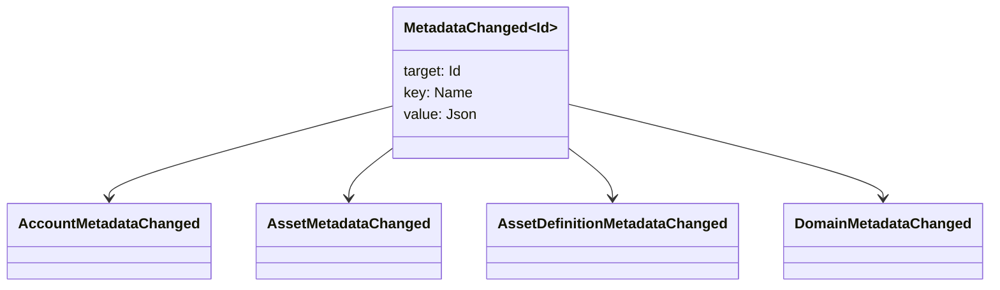

# Метамәліметтер {#metadata}

Метадеректер - кітапша объектілеріне қоса берілген тексерілген кілті-құндылық картасы. Кілттер `Name` мәндері, ал мәндер JSON (`Json`) пайдалы жүктемелер.

Келесі нысандар метамәліметтерді жеткізе алады:

- домендер
- есеп айырысу
- активтер
- активтер анықтамасы
- NFTs
- RWAs
- қозғалтқыштар
- операциялар

Үлкен пайдалы жүктемелер WSV шегінен тыс жерде сақталуы және URI немесе SoraFS жолымен сілтеме жасалуы тиіс.

Метадеректерді, активтерді NFTs, RWAs немесе тізбектен тыс сақтауды таңдау бойынша нұсқаулар үшін [Метадеректі және бухгалтерлік есептік жазбаларды сақтауды таңдауды қараңыз](/kk/guide/configure/metadata-and-store-assets.md).

## Taira арқылы сынап көріңіз. {#try-it-on-taira}

Метамәліметтер әдеттегі ресурстарды оқу арқылы көрінеді. Бұл командада Taira активтердің анықтамалары бар:

```bash
curl -fsS 'https://taira.sora.org/v1/assets/definitions?limit=100' \
  | jq '.items[]
    | select((.metadata | length) > 0)
    | {id, name, metadata}'
```

Домендер мен тіркелгілер үшін бірдей үлгі қолданылсын:

```bash
curl -fsS 'https://taira.sora.org/v1/domains?limit=20' \
  | jq '.items[] | select((.metadata // {} | length) > 0)'

curl -fsS 'https://taira.sora.org/v1/accounts?limit=20' \
  | jq '.items[] | select((.metadata // {} | length) > 0)'
```

Бос шығысқа жарамды нәтиже ретінде қараңыз. Бұл Taira нысандарының ағымдағы беті метамәлімен қамтылмаған дегенді білдіреді, бірақ соңғы нүкте сәтсіздікке ұшыраған жоқ.

## Метамәдени деректерді жаңарту {#updating-metadata}

Метамәліметтер Iroha арнайы нұсқаулықпен ауыстырылады:

- [`SetKeyValue`](/kk/blockchain/instructions.md#setkeyvalue-removekeyvalue) кілтті қосады немесе ауыстырады
- [`RemoveKeyValue`](/kk/blockchain/instructions.md#setkeyvalue-removekeyvalue) кілтті алып тастайды

Транзакцияны ұсынған орган белсенді орындау уақытын растаушының талап еткен рұқсатына ие болуы керек. Әдетті рұқсат беті үшін [Permission Tokens ](/kk/reference/permissions.md) қараңыз.

## Оқиғалар {#events}

Деректер оқиғалары метамәдени деректердің өзгеруі кезінде жіберіледі. Жалпы оқиғаның пайдалы жүктемесі `MetadataChanged<Id>`:



[дерек оқиғалары сүзгілерін ](/kk/blockchain/filters.md#data-event-filters) пайдалану арқылы интеграцияға мән беретін субъекті түрі немесе объектісі ID үшін тек метамәдени оқиғаларға жазылу.

## Сұрақтар {#queries}

Метамәліметтер сұралған объектінің бөлігі ретінде қайтарылады. Мысалы, [`FindAccountById`](/kk/reference/queries.md#accounts-and-permissions), [`FindDomainById`](/kk/reference/queries.md#domains-and-peers), немесе [`FindAssetDefinitionById`](/kk/reference/queries.md#assets-nfts-and-rwas) қолданыңыз. [`FindNfts`](/kk/reference/queries.md#assets-nfts-and-rwas) немесе [`FindNftsByAccountId`](/kk/reference/queries.md#assets-nfts-and-rwas) NFTs, және [`FindRwas` ](/kk/reference/queries.md#assets-nfts-and-rwas) RWA партияларын пайдаланыңыз. Содан кейін нысанның метамәліметрі өрісін оқыңыз. NFT сұраныс жауаптары NFT `content` картасын жазба метамәлімелімелі ретінде көрсетеді.

Метамәліметтер кілтілері бухгалтерлік жазбаның бір бөлігі болып табылады, сондықтан оларды тұрақты ұстаңыз және JSON мәні сол нұсқаны айқын алып жүрсе, қолданбаға сәйкес нұсқаны кодтаудан аулақ болу керек.
