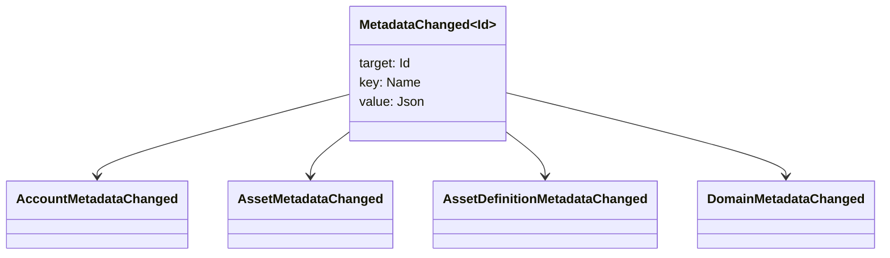

# Метадеректер {#metadata}

Метадеректер – блокчейн тізбелік объектілеріне тіркелген тексерілген кілт-мағына картасы. Кілттер – `Name` мәндер, ал мәндер – JSON (`Json`) жүктемелер.

Келесі объектілер метадеректерді тасымалдауы мүмкін:

- домендер
- есептер
- активтер
- активтер анықтамалары
- NFTs
- RWAs
- қоздырғыштар
- транзакциялар

Блокчейн регистрінің күйінде болу керек шағын сипаттамалық немесе индекстік өрістер үшін метадеректерді пайдаланыңыз. Үлкен жүктемелер WSV сыртында сақталуы керек және криптографиялық хеш мәні, URI немесе SoraFS жолы арқылы көрсетілуі тиіс.

Метадеректерді, активтерді, NFTs, RWAs немесе офф-чейн сақтау орнын таңдауға арналған нұсқаулар үшін [Метадеректер және блокчейн тіркелімін сақтау таңдау](/kk/guide/configure/metadata-and-store-assets.md) қараңыз.

## Осы жұмыс ағынын Taira бойынша іске қосыңыз {#try-it-on-taira}

Метадеректер әдеттегі ресурс оқу арқылы көрінеді. Бұл команда қазіргі уақытта метадеректері бар Taira активтер анықтамаларын көрсетеді:

```bash
curl -fsS 'https://taira.sora.org/v1/assets/definitions?limit=100' \
  | jq '.items[]
    | select((.metadata | length) > 0)
    | {id, name, metadata}'
```

Домендер мен есептік жазбалар үшін сол үлгіні пайдаланыңыз:

```bash
curl -fsS 'https://taira.sora.org/v1/domains?limit=20' \
  | jq '.items[] | select((.metadata // {} | length) > 0)'

curl -fsS 'https://taira.sora.org/v1/accounts?limit=20' \
  | jq '.items[] | select((.metadata // {} | length) > 0)'
```

Бос нәтижені заңды нәтиже ретінде қарастырыңыз. Бұл Taira объектілерінің ағымдағы бетінде метадеректер жоқ екенін білдіреді, API ұшар нүктесінің сәтсіз болғанын емес.

## Мета деректерді жаңарту {#updating-metadata}

Метадеректер Iroha нұсқаулық операциялары арқылы өзгереді:

- [`SetKeyValue`](/kk/blockchain/instructions.md#setkeyvalue-removekeyvalue) кілтті қояды немесе ауыстырады
- [`RemoveKeyValue`](/kk/blockchain/instructions.md#setkeyvalue-removekeyvalue) перненi алып тастайды

Транзакцияны жіберетін авторизациялау бастығы активті бағдарламалық қамтамасыз ету орындалу ортасын тексеруші талап ететін рұқсаты болуы керек. Әдепкі рұқсат беті үшін қараңыз [Рұқсат белгішелері](/kk/reference/permissions.md).

## Оқиғалар {#events}

Метадеректер өзгергенде деректер оқиғалары туындайды. Жалпы оқиға жүктемесі `MetadataChanged<Id>` болып табылады:



Интеграцияға маңызды болатын объектінің түрі немесе объектінің идентификаторы үшін тек метадеректер оқиғаларына жазылу үшін [деректер оқиғасы сүзгілері](/kk/blockchain/filters.md#data-event-filters) пайдаланыңыз.

## Сұраулар {#queries}

Метадеректер сұралған объектінің бөлігі ретінде қайтарылады. Мысалы, пайдаланыңыз [`FindAccountById`](/kk/reference/queries.md#accounts-and-permissions), [`FindDomainById`](/kk/reference/queries.md#domains-and-peers), немесе [`FindAssetDefinitionById`](/kk/reference/queries.md#assets-nfts-and-rwas). Пайдалану [`FindNfts`](/kk/reference/queries.md#assets-nfts-and-rwas) немесе [`FindNftsByAccountId`](/kk/reference/queries.md#assets-nfts-and-rwas) үшін NFTs, және [`FindRwas`](/kk/reference/queries.md#assets-nfts-and-rwas) үшін RWA көп. Содан кейін объектінің метадеректер өрісін оқыңыз. NFT сұрау жауаптары көрсетеді NFT `content` жазбаның метадеректері ретінде карта.

Метадеректер кілттері блокчейн тізілім күйінің бөлігі болып табылады, сондықтан оларды тұрақты ұстаңыз және JSON мәні сол нұсқаны айқын түрде жеткізе алатын кезде қосымшалық нұсқа өзгерістерін кілт атына енгізуден аулақ болыңыз.
