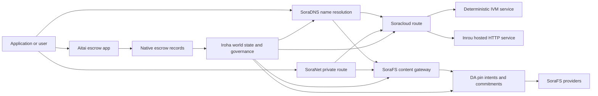

# SORA Nexus Қызметтер {#sora-nexus-services}

SORA Nexus Iroha 3 айналасында қосымшаға қарасты қызмет көрсету ұшақтарын қосады. Бұл қызметтер бөлек кітапханалар болып табылмайды. Олар Iroha әлемдік мемлекет, Norito манифестер, басқару деректері және Torii маршрут отбасылары арқылы бекітіледі.

Қолжетімділік түйінді құруға және желі профиліне байланысты. [`/openapi`](/kk/reference/torii-endpoints.md#app-and-sora-route-families) мақсатты түйінде рұқсат етілген бағыттардың ауторитетті тізімі ретінде қолданылсын.

## Компоненттер картасы {#component-map}

|Компонент |Рол |Негізгі беттер |
| ---------------------- | ------------------------------------------------------------------------------------------------------------------------------------------- | ---------------------------------------------------------------------------------------- |
|Soracloud |Қолданбаларды іске асыру, хостингтік қызметтер, жеке модель/жұмыс уақыты және қызмет өмір сүру циклін басқару. |`/v1/soracloud/`, `/api/`, `iroha app soracloud ...` |
|Ішкі |Soracloud тірі HTTP ұшақты қажет ететін қызметтiк тексерулер үшiн HTTP жұмыс уақытын хост етті. |Soracloud орындалу уақытын баптау, хост мүмкіндіктері жарнамалары, репликалық орындалу уақыты |
|SoraNet |Шектілер, эстафеталық трафик, VPN, қосылу сессиялары мен стриминг маршруттары үшін жекешелік және көлік төсемі. |`/v1/connect/`, `/v1/vpn/`, SoraNet бағыттың метамәдени деректері |
|Деректердің қол жетімділігі (DA) |Nexus жолақтары, SoraFS манифесттері және дәлелдеу ағындары арқылы аталатын пайдалы жүктер үшін қол жетімділік дәлелі, міндеттеме және шынайы мақсат қабаты. |`/v1/da/`, `FindDaPinIntent`, `[sumeragi.da]` |
|SoraFS |Манифестер, CAR пайдалы жүктемелер, тігілген мазмұн, шлюз алу және қалпына келтіруді дәлелдейтін ағымдар үшін мағыналы сақтау туындысы. |`/v1/sorafs/`, `/sorafs/`, `FindSorafsProviderOwner` |
|SoraDNS |SORA хостингтік қызметтері мен мазмұны үшін детерминистік атау және резюсерлік аттестация қабаттары. |`/v1/soradns/`, `/soradns/`, resolver каталогы оқиғалары |
|Атай |Қолданба деңгейіндегі фиаттық және активтерді есеп айырысу коридоры жеке кітапшамен емес, жергілікті депозиттік тіркелімдермен қамтамасыз етіледі. | `OpenAssetEscrow`, `FindAssetEscrow*`, `EscrowEventFilter`, Kotodama `escrow_*` ғимараттар |



## Әдеттегі ағындар {#common-flows}

### Хостингті бөлінген қолданба {#hosted-split-application}

Әдеттегі аралас ұялы қолданба барлық бөлшектерді біріктіреді:

1. Статикалық фронт-энд активтері SoraFS арқылы жинақталады және бекітіледі.
2. Мысалы, `<app>.sora` мемлекеттік қоныс аударушы SoraDNS арқылы тіркеледі.
3. Soracloud маршруттары `/api/v1/search` немесе `/api/v1/stream` Inrou HTTP қызметіне.
4. Soracloud бағыттары `/api/auth` және `/api/v1/user` детерминистік IVM басқарушыларға.
5. Құпиялықты қажет ететін клиенттер SoraNet схемасы арқылы бірдей мазмұнға немесе API бағытына қол жеткізе алады.

|Жол .|Қолдаушы ұшақ |Неге ?|
| ----------------- | --------------------- | ------------------------------------------------- |
| `/`               |SoraFS статикалық мазмұн |Қайталайтын мазмұнның тамыр және шлюз алдын ала сақтау |
|`/assets/*` |SoraFS статикалық мазмұн |Мазмұнына негізделген активтер және дәлелдемелер |
|`/api/auth*` |Soracloud IVM |Қайта ойнау қауіпсіз авт және қапсық проблемасы |
|`/api/v1/user*` |Soracloud IVM |Басқарушылыққа сезімтал мемлекеттердің мутациялары |
|`/api/v1/search*` |Soracloud Инру |Тірі HTTP қызмет, кеш, SSE немесе жинақшы |

### Мазмұны жариялау {#content-publication}

SoraFS басылымда оларға атау белгілегенге дейін тұрақты артефакттар шығарылады:

1. Пайдалы жүк немесе каталог құру.
2. Оны CAR мұрағатына жинап, бөлшекті жоспарлаңыз.
3. Пин саясаты мен басқару деректерімен Norito манифесін құру.
4. Манифесті Torii телефонына тапсырыңыз.
5. Міндетті профиль нақты дәлелдеме қажет болған жағдайда DA пин ниеті немесе қолжетімділік міндеттемесін тіркеңіз.
6. Маниверді SoraDNS атауына немесе Soracloud статикалық алдыңғы бағытына байлау.

### Жеке автокөлікпен немесе ағызумен {#private-fetch-or-streaming-route}

SoraNet SoraFS немесе Soracloud алдында отыра алады:

1. Клиент атауды немесе манифестті шешеді.
2. Күзет қапшығы немесе маршрут манифесті кіру және шығу релелерін таңдайды.
3. Жол жүрісі толтырылып, SoraNet схемасы арқылы жіберіледі.
4. Шығу эстафетасы SoraFS қақпасына, Torii ағынына немесе Soracloud бағытына жетеді.

## Атай {#aitai}

Aitai - SORA нарық стилі бойынша есеп айырысу үшін қолданбалы дәліз, онда сатып алушы мен сатушы желіден тыс төлемді үйлестіреді, ал Iroha Жаңа сандық активтерді күзету ағындары үшін келісімшартқа тиесілі депозиттік шоттың орнына, ол түпкілікті эскорлық нұсқаулар отбасын қолдануы керек.

Жергiлiктi депозит бухгалтерлiк кiтапқа қамқорлық сақтап қалады. `OpenAssetEscrow`, сатып алушы тізбектен тыс төлемді қабылдайды және белгілейді: `AcceptAssetEscrow` және `MarkEscrowPaymentSent`, және сатушы босатады `ReleaseAssetEscrow` Егер сатып алушы мен сатушы келіспесе, кез-келген тарап дауды ашуы және оны шешуді `CanResolveEscrowDispute` қапшықталған соманы бөлуге болады.

Толық өмірлік цикл, жалпы активтердің құлыптары, анонимді кепілдендіру, сұрау салулар, оқиғалар және Rust мысалдар үшін қараңыз [Туған активтердің кепілдендіруі](/kk/blockchain/escrow.md).

|Атай беті |Пайдаланыңыз |
| ------------------------------------------------------------------------------------------------------------------------------------------------------------- | ----------------------------------------------------------------------------------------- |
|`OpenAssetEscrow`, `AcceptAssetEscrow`, `MarkEscrowPaymentSent`, `ReleaseAssetEscrow`, `CancelAssetEscrow` |XOR номиналында есеп айырысу ағындарын қоса алғанда, мөлдір сандық активтерді ұсыну. |
|`OpenAnonymousAssetEscrow`, `AcceptAnonymousAssetEscrow`, `MarkAnonymousEscrowPaymentSent`, `ReleaseAnonymousAssetEscrow`, `CancelAnonymousAssetEscrow` |Қорғалған ұсыныстар қаржыландыру және тоқтату қозғалыстары үшін дәлелді қосымшаларды пайдаланады. |
|`OpenEscrowDispute`, `ResolveEscrowDispute`, `OpenAnonymousEscrowDispute`, `ResolveAnonymousEscrowDispute` |Дауылға түсу және сот үлгісі бойынша шешім қабылдау. |
|`FindAssetEscrowById`, `FindAssetEscrowsBySeller`, `FindAssetEscrowsByBuyer`, `FindAssetEscrowsByStatus` |Қолданбаның жай-күй беттері, келісу жұмыстары және қолдау құралдары. |
|`EscrowEventFilter` |Тірі транспарентті эскорлық жазылулар эскорлік идентификаторы бойынша, сатушы, сатып алушы, мәртебе немесе іс-шара түрі. |
| Kotodama `escrow_open_offer`, `escrow_accept`, `escrow_mark_payment_sent`, `escrow_release`, `escrow_cancel`, `escrow_open_dispute`, `escrow_resolve_dispute` |Kotodama келісім-шарттық шақырулар V1 кепілдік беру жүйесімен қамтамасыз етіледі. |

Қоғамдық Taira немесе Minamoto пайдалану үшін, желіден тыс төлем рельсін және кез-келген қолдау немесе сот жұмыс ағынын өтінім саясаты ретінде қараңыз. Iroha сақталу жағдайын, өмірлік цикл оқиғаларын, дәлелдемелерді хэштегі мен түпкілікті активтер қозғалысын тіркейді; ол fiat есеп айырысуды өздігінен растамайды.

## Мақсатты түйінді тексеріңіз {#check-a-target-node}

Осы беттегі мысалдарды қолданғаннан бұрын, бағытты үйлесімді мақсат ететін түйінде бар екендігін растаңыз:

```bash
export TORII_URL=https://taira.sora.org

curl -fsS "$TORII_URL/openapi.json" \
  | jq '.paths | keys[] | select(test("^/v1/(soracloud|sorafs|soradns|connect|vpn|da)/"))'

curl -fsS -H 'Accept: application/json' "$TORII_URL/status" | jq .
```

Егер `/openapi.json` профильден көрінбесе, `/openapi` сынап көріңіз. Жолдың нақты қол жетімділігі құрылыс функцияларына және желі конфигурациясына байланысты болады.

### Taira Тек оқуға арналған темекі тексеректері {#taira-read-only-smoke-checks}

Қоғамдық Taira аяқ нүктесі оқу жағындағы тексерулер үшін пайдалы, бірақ егер сіз рұқсат етілген тіркелгіңізді жүргізбесеңіз және тікелей күйін өзгертуді көздемесеңіз, оны мутациялық мысалдар үшін қолданбаңыз.

```bash
export TORII_URL=https://taira.sora.org

curl -fsS -H 'Accept: application/json' "$TORII_URL/status" \
  | jq '{version: .build.version, peers, blocks, lanes: (.teu_lane_commit | length)}'

curl -fsS "$TORII_URL/v1/connect/status" | jq '{enabled, sessions_active}'

curl -fsS "$TORII_URL/v1/vpn/profile" \
  | jq '{available, relay_endpoint, supported_exit_classes}'

curl -fsS "$TORII_URL/v1/sorafs/storage/state" \
  | jq '{bytes_capacity, bytes_used, pin_queue_depth, por_inflight}'

curl -fsS -H 'Accept: application/json' "$TORII_URL/v1/soracloud/status" \
  | jq '.control_plane | {service_count, services: [.services[] | {service_name, current_version}]}'
```

Taira OpenAPI жол картасында тізбеленген емес, орналасуға арналған арнайы басқарушы ұшақ бағыттарын анықтауы мүмкін. `/openapi` API негізгі генерацияланған келісім-шарт ретінде қараңыз, содан кейін оны тікелей тереңдетуден бұрын кез келген орналасуға байланысты бағытты растаңыз.

## Soracloud {#soracloud}

Soracloud - бұл SORA қолданбаларды басқару тетігі. Ол орналасу топтамаларын, қызмет көрсетуді қайта қарауды, бағыт-бағдарлауды, іске қосу жағдайын, ауторитетті конфигурация жазуларын, шифрланған қызмет құпиясын, үлгі тізілімін есепке алуды, жеке қорытынды сессияларын және жұмыс уақытын қабылдауды бақылайды.

Soracloud екі орындаушы ұшақты пайдаланады:

|Атқарушы ұшағы |Уақыты |Пайдаланыңыз |
| ---------------------- | ------- | -------------------------------------------------------------------------------------------- |
|`DeterministicService` |`Ivm` |Автор, қапшықтың жай-күйі, сертификатталған оқулар, тапсырылған пошта қораптарын басқарушылар, басқаруға сезімтал мутациялар |
|`HttpService` |`Inrou` |Тірі HTTP APIs, коллекторлық ауыр жұмыс, кешпен қамтамасыз етілген қызметтер, SSE, браузер көмегімен ағымдар |

Басқару деңгейі авторитетті. Жоспарлану, жаңарту, қайта оралу, конфигурация, құпия, модель және жай-күй командалары Torii арқылы тапсырылады және берілген әлемдік жағдайды оқиды; олар бөлек CLI - жергілікті айнаға сүйенбейді. Қоғамдық бағыт-бағдар ең ұзақ префикске негізделген, сондықтан бір тіркелген қоректенуші трафикті хост HTTP маршруттары мен детерминистік API маршруттары арасында бөлуге болады.

### Бөлінген қолданбаны орнату {#scaffold-a-split-app}

Бөлінген қолданба үлгісі статикалық алдыңғы аяқты және бір хостингті тікелей API және бір детерминистік қапшық/API қызметін жасайды:

```bash
iroha app soracloud app init \
  --template split-app \
  --app-name solswap_indexer \
  --app-version 0.1.0 \
  --public-host solswap-indexer.sora \
  --output-dir ./apps/solswap-indexer

iroha app soracloud app local-plan \
  --manifest ./apps/solswap-indexer/app_manifest.json

iroha app soracloud app doctor \
  --manifest ./apps/solswap-indexer/app_manifest.json
```

`local-plan` маршрут бөлінісін, балалық қызмет көрсету манифестерін, жұмыс кеңістігінің скрипт жолдарын және алдын-ала жариялау режимін басып шығарады. `doctor` сіз Torii қатысқанға дейін жергілікті босату шартын растайды.

### Қолданбаны орналастыру және тексеру жағдайы {#deploy-and-inspect-app-state}

```bash
export SORACLOUD_TORII_URL=https://<soracloud-enabled-torii>

iroha app soracloud app deploy \
  --manifest ./apps/solswap-indexer/app_manifest.json \
  --torii-url "$SORACLOUD_TORII_URL"

iroha app soracloud app status \
  --manifest ./apps/solswap-indexer/app_manifest.json \
  --torii-url "$SORACLOUD_TORII_URL"
```

Әзірге орналастырылған қызмет үшін қызмет ауқымы бойынша командаларды қолданыңыз:

```bash
iroha app soracloud status \
  --service-name solswap_indexer_live \
  --torii-url "$SORACLOUD_TORII_URL"

iroha app soracloud rollback \
  --service-name solswap_indexer_live \
  --target-version 0.1.0 \
  --torii-url "$SORACLOUD_TORII_URL"
```

### Құпия және құпия материал {#config-and-secret-material}

Soracloud конфигурация және құпия жазулар авторитетті орналасу күйінің бөлігі болып табылады. Қажетті конфигурациялар немесе құпия байланыстар жоқ болған кезде немесе белсенді манифесттермен сәйкес келмегенде, орналастыру, жаңарту және қайта оралу жабылады.

```bash
iroha app soracloud config-set \
  --service-name solswap_indexer_live \
  --config-name indexer/public_config \
  --value-file ./config/public-config.json \
  --torii-url "$SORACLOUD_TORII_URL"

iroha app soracloud secret-set \
  --service-name solswap_indexer_live \
  --secret-name indexer/api_key \
  --secret-file ./secrets/api-key.envelope.json \
  --torii-url "$SORACLOUD_TORII_URL"
```

CLI көмегін пайдаланып, профиліңіз үшін талап етілетін нақты куәлік белгілерін алыңыз:

```bash
iroha app soracloud config-set --help
iroha app soracloud secret-set --help
```

## Интроу {#inrou}

Inrou - HTTP хостингті орындалу уақыты, оны Soracloud пайдаланады. Iroha түйінге қосылған Soracloud орындалу уақытының жобалары Soracloud күйіне жіберіледі Жергiлiктi материализациялау жоспары, тапсырылған хост-сервис репликаларын бульондық қызметтер ретiнде бастайды және репликаның орындалу уақытын қалпына келтiру туралы есептер беделді модельге қайтарады.

HTTP бетін қажет ететін жұмыс жүктемелері үшін Inrou-ды қолданыңыз, мысалы коллекторлы APIs, SSE ағымдары, кешпен қамтамасыз етілген басқарушылар немесе браузер көмегімен көрсетілетін қызметтер.

### Орындалу уақыты бойынша талаптар {#runtime-requirements}

- Контейнерлік манифесттің жұмыс істеу уақыты `Inrou` болуы тиіс.
- Қызмет манифесті орындалу жазықтығы `HttpService` болуы тиіс.
- `HttpService + Inrou` дәл бір `PersistentRootLeaseVolume`-ді қажет етеді, ол `/`-ге орнатылған.
- Қайталанушы Inrou қызметтеріне де ортақ қызмет немесе құпия лизингтік сақтау қажет, егер олар өзгеретін ортақ жағдайды сақтайтын болса.
- Өндірістік хостинг түйіндері тек прокси ретінде жұмыс істемей, нақты Inrou қуатын жарнамалауға тиіс.

### Көрініссіз бөлік {#manifest-fragment}

Төмендегі мысал екі манифесттің пішінін көрсетеді. Бұл толық орналасу топтамасы емес, фрагмент.

```jsonc
// container_manifest.json
{
  "schema_version": 1,
  "runtime": { "runtime": "Inrou", "value": null },
  "bundle_path": "/bundles/solswap-indexer.inrou",
  "entrypoint": "/app/bin/launch-indexer.sh",
  "args": [],
  "env": {
    "RUST_LOG": "info",
  },
  "inrou": {
    "schema_version": 1,
    "guest_os": { "guest_os": "DebianSlim", "value": null },
    "guest_images": {
      "x86_64": {
        "kernel_image_path": "/inrou/x86_64/vmlinux",
        "rootfs_image_path": "/inrou/x86_64/rootfs.ext4",
        "initrd_image_path": null,
      },
      "aarch64": {
        "kernel_image_path": "/inrou/aarch64/vmlinux",
        "rootfs_image_path": "/inrou/aarch64/rootfs.ext4",
        "initrd_image_path": null,
      },
    },
  },
  "lifecycle": {
    "start_grace_secs": 60,
    "stop_grace_secs": 30,
    "healthcheck_path": "/api/indexer/v1/health",
  },
}
```

```jsonc
// service_manifest.json
{
  "schema_version": 1,
  "service_name": "solswap_indexer_live",
  "service_version": "0.1.0",
  "execution_plane": { "execution_plane": "HttpService", "value": null },
  "replicas": 2,
  "route": {
    "host": "solswap-indexer.sora",
    "path_prefix": "/api/v1/search",
    "service_port": 8080,
    "visibility": { "visibility": "Public", "value": null },
    "tls_mode": { "tls": "Required", "value": null },
  },
  "lease_volumes": [
    {
      "volume_name": "root_disk",
      "kind": {
        "lease_volume": "PersistentRootLeaseVolume",
        "value": null,
      },
      "storage_class": { "storage_class": "Warm", "value": null },
      "mount_path": "/",
      "max_total_bytes": 8589934592,
    },
    {
      "volume_name": "index_state",
      "kind": { "lease_volume": "ServiceLeaseVolume", "value": null },
      "storage_class": { "storage_class": "Warm", "value": null },
      "mount_path": "/var/lib/solswap-indexer",
      "max_total_bytes": 1073741824,
    },
  ],
}
```

Ағымдағы уақытта әрбір монтаждалған жалға беру көлемі көлемнің атауынан алынған қоршаған ортаның өзгерістері арқылы анықталады:

```text
SORACLOUD_LEASE_VOLUME_ROOT_DISK_DIR
SORACLOUD_LEASE_VOLUME_ROOT_DISK_MOUNT_PATH
SORACLOUD_LEASE_VOLUME_INDEX_STATE_DIR
SORACLOUD_LEASE_VOLUME_INDEX_STATE_MOUNT_PATH
```

## SoraNet {#soranet}

SoraNet - бұл құпиялылық және көліктік үстіңгі қабырғасы. Бұл мақсатты шлюзге немесе қызметке тікелей қосылуға тиіс емес, трафикке релелік бағыттарды ұсынады. Көлік конструкциясы кіріс, орта және шығыс реле рольдерін, QUIC көлікті, шуға негізделген гибридті қолын тигізуді, мүмкіндіктер келіссөзін, эстафеталық каталогтың метамәліметтерін және тұрақты мөлшердегі толтырылған ұяшықтарды пайдаланады.

Nexus орналасуларында, SoraNet мазмұнды алуды, шлюз трафигін, VPN немесе Connect сессияларын және Norito стримингтік бағыттарды тасымалдай алады. Тіркелім жазулары `norito-stream` қолдауын көрсететін релелерді белгілеуі мүмкін, бұл клиенттерге Torii RPC немесе стримингті трафикке қолайлы маршруттарды таңдауға мүмкіндік береді.

### Желідегі конфигурация {#streaming-configuration}

Nexus профилі SoraNet желілік маршруттар үшін қамтамасыз етуді мүмкін етеді:

```toml
[streaming]
feature_bits = 0b11

[streaming.soranet]
enabled = true
exit_multiaddr = "/dns/torii/udp/9443/quic"
padding_budget_ms = 25
access_kind = "authenticated"
provision_spool_dir = "./storage/streaming/soranet_routes"
provision_spool_max_bytes = 0
provision_window_segments = 4
provision_queue_capacity = 256
```

`access_kind = "read-only"` дегенді көргішін аутентификациялауды қажет етпейтін мазмұн бағыттары үшін қолданыңыз. `authenticated` дегенді пайдаланыңыз, егер шығыс эстафетасы Torii немесе хостингтік қызметпен байланысудан бұрын билеттерді немесе көрерменнің жеке басын орындауы керек болса.

### SoraNet-Ақылдаған SoraFS Табыңыз {#soranet-aware-sorafs-fetch}

SoraFS алып келуші CLI жергілікті прокси манифесті шығара алады және браузердің кеңейтулері немесе SDK адаптерлері үшін SoraNet бағыт метамәдени деректерін бұрғылай алады:

```bash
sorafs_cli fetch \
  --plan artifacts/payload_plan.json \
  --manifest-id 7bb2...9d31 \
  --provider name=alpha,provider-id=9f5c...73aa,base-url=https://gw-alpha.example.org/,stream-token="$(cat alpha.token)" \
  --output artifacts/payload.bin \
  --json-out artifacts/fetch_summary.json \
  --local-proxy-manifest-out artifacts/proxy_manifest.json \
  --local-proxy-mode bridge \
  --local-proxy-norito-spool storage/streaming/soranet_routes \
  --local-proxy-kaigi-spool storage/streaming/soranet_routes \
  --local-proxy-kaigi-policy authenticated \
  --max-peers=2 \
  --retry-budget=4
```

Жинақтау деректерін жеткізуші есептер, бөлшек квитанциялар, жергілікті прокси метамәдениеттері және әкелу үшін қолданылатын тиімді маршрут параметрлері.

## Деректердің қол жетімділігі (DA) {#data-availability-da}

DA - өте үлкен, құпиялылыққа бейім немесе тікелей әлемдік күйге орналасу үшін қызмет ерекшеліктері үшін пайдалы жүктемелер үшін қол жетімділік дәлелді қабаты. Ол детерминистік міндеттемелер мен алу міндеттемелерін тіркейді, сондықтан растаушылар, шлюздер және клиенттер қандай байттар уәде етілгені туралы келісе алады, қандай саясат қолданылады және қандай дәлелдер сақталған.

DA Kura немесе SoraFS дегенді алмастыруға болмайды:

- Kura түпкілікті блок ағыны мен консенсус қалпына келтіру деректерін сақтау.
- SoraFS мазмұн адресі бар байттарды, CAR пайдалы жүктемелерді және манифесттерді сақтайды және қызмет етеді.
- DA міндеттемелерді, дәлелдеу саясатын, дәлелдемелерді ашуды және осы байттарды жоспарлауға, аудит жүргізуге және бас кітапшасына қайта байланыстыруға мүмкіндік беретін шикізатты мақсаттарды есепке алады.

Пайдалану DA өтiнiш немесе Nexus Lane-ге кітабынан көрінетін, шынжырдан тыс деректерді қайтару мүмкіндігін беретін уәде қажет. Әдеттегі мысалдарға есеп айырысу ағындары үшін жолақтағы пайдалы жүктеме міндеттемелері жатады. SoraFS Жарияланған мазмұнға арналған шынайы мақсаттар, кейіннен тексеру үшін сақталуға тиіс дәлелдеме топтамалары, және пайдалану артефактілері, олардың қоғамдық жағдайы толық жүк емес, терілеу болуы тиіс.

### Өмір циклі {#lifecycle}

|Этап |Жазбалар|
| ---------- | ----------------------------------------------------------------------------------------------------------------------------------------------------- |
|Мақсат |Билет, манифестикалық сілтеме, псевдоним, жолақ/эпоха/тізбелік сілтеме, сақтау саясаты немесе репликация нысанасы. |
|Қатысуы |Маниверді, жолақ жүктемесін, дәлелдеме топтамасын немесе мазмұн түбірін кітапшаға көрінетін жазбаға байланыстыратын материалды алмастыру. |
|Дәлелдемелер|Қолжетімділік дауыстары, дәлелдемелерді ашу, провайдерлердің куәландырулары немесе мақсатты желі қабылдаған басқа да профильдік дәлелдер. |
|Сұрақтар |`FindDaPinIntentByTicket`, `FindDaPinIntentByManifest`, `FindDaPinIntentByAlias` немесе `FindDaPinIntentByLaneEpochSequence` арқылы шынайы мақсаттағы іздестірулер. |

DA негізделген әдеттегі жарияланымдар ағыны:

1. Пайдалы жүктемені WSV шегінен тыс құрастыру немесе қабылдау, мысалы, SoraFS CAR файлы немесе Nexus жолағындағы пайдалы жүктеме.
2. Norito манифестінде немесе маршрут-шайықты міндеттемелер туралы жазбада пайдалы жүктемені сипаттаңыз.
3. Маршрут отбасы рұқсат етілген кезде `/v1/da/*` арқылы немесе желідегі қол қойылған транзакция жолы арқылы манифесті, пин ниетті немесе міндеттемелерді тапсырыңыз.
4. Құжатты растаушылар немесе қолжетімділік берушілер белсенді дәлелдеме саясаты талап ететін дәлелдерді жинауға рұқсат етілсін.
5. Пайдалы жүктемеге тәуелді аниме, есеп айырысу дәлелі немесе шлюз бағытын ұсынғанға дейін нәтижелі пин ниеті мен міндеттемелерін сұраңыз.

### Алгоритмдік модель {#algorithmic-model}

DA пайдалы жүктемені қолтаңбаланған, қайта ойнаудан қорғалған, блок-индекстелетін міндеттемеге айналдырады. маңызды алгоритмдер детерминистік, сондықтан растаушылар және шлюздер бірдей байттерден бірдей дигестерді қайта есептеуі мүмкін.

1. Torii `(lane_id, epoch, sequence)`, пайдалы жүктеме байттары, қысылу метамәліметрі, бөлшектің мөлшері, өшіру профилімен сіңірілетін сұрауды қабылдайды. gzip, deflate немесе Zstandard пайдалы жүктемелерін талап еткен кезде түйін сымдайды, содан кейін каноникалық байт ұзындығының `total_size` тең екенін тексереді.
2. жолақ және бөлшек параметрлерін бекіту. жолақ Nexus жолақ каталогында болуы тиіс. `chunk_size` екі, кем дегенде екі байттан тұратын нөлдік емес қуаттылығы болуы керек; және конфигурацияланған ең жоғарғы шегінен аспауы тиіс. Өшіру профилі деректер бөліністерін және кем дегенде екі паритеттік бөліністерді қамтиды. Жол картасының каталогы `merkle_sha256` немесе `kzg_bls12_381` дәлелді схеманы таңдайды.
3. Желі саясатын қолдану. түйін Блоб класы үшін конфигурацияланған репликация мен сақтау базасын орындайды. Қоғамдық метадеректер жай мәтінді сақталуы керек; басқаруға арналған метадеректерді манифестке жазудан бұрын түйіннің конфигурациялық басқаруға арналған метадеректердің кілтімен шифрланады.
4. Каноникалық пайдалы жүктеме, `chunk_size`. Torii Пайдалы жүктiң дигестiн, қалпына келтiру мүмкiндiгiн дәлелдеу ағашының тамырын және бөлшек бойынша мiндеттемелердi есептейді. BLAKE3 Байттар бойынша міндеттемелер.
5. Өшіру міндеттемелерін қосу. Қисықтар `data_shards` жояқтарына топтастырылады. Соңғы жояқтағы жасушалар паритетті есептеу үшін нөлге толтырылады. RS(16) паритет жасайды Сап / жаһандық параллельді бөліктері; таңдамалы `row_parity_stripes` баған стилідегі жолақтың параллелін матрицаға қосу. Параллельдік бөлік міндеттемелері - BLAKE3 аз ендтік `u16` символдардың дигестері.
6. Маниверді құру. `DaManifestV1` жолды, эпоханы, блоб класын, кодекті, пайдалы жүктемені, бөлшек тамырын, бөлшек өлшемін, өшіру профилін, сақталу саясатын, жалдау бағасын, бөлшек міндеттемелерін, ерікті IPA міндеттемесін, метамәліметтерді және шығарылған уақытты тіркейді. Сақтау билеті детерминистік: түйін ең алдымен бос билетпен манифест үлгісін хэш етеді, содан кейін оны соңғы `storage_ticket` деп жазады.
7. Қайта ойнау конфликттерін бас тарту. Қайта ойнату кілтісі `(lane_id, epoch, sequence, manifest_fingerprint)`. Бір саусағы бар қосарланған файл жарамсыз болып табылады. Ескіретілген ретті немесе басқа саусағымен бірдей ретті бас тарту керек.
8. Қол қойылған артефакттерді шығару. Torii PDP міндеттемесін есептеп шығарады, `DaIngestReceipt` қол қояды, `DaCommitmentRecord` құрастырады және манифестке арналған сұлбалық артефакттерді жазады: PDP міндеттеме, міндеттемелер жазбасы, міндеттемелер кестесі, пин ниеті, квитанция файлы және квитанцияның журналы. Квитанция курсоры `(lane_id, epoch)` бойынша монотонды түрде алға жылжып келеді.

Қатысу туралы жазбалар - бұл блоктардың арқасында жасалған.

- Жол, эпоха және реттілік
- ID және каноникалық манифесті hash
- жолақты тексеру схемасы
- түйіршік түбі
- KZG жолақтар үшін ерікті KZG міндеттемесі
- PDP/көрсеткіш терісі
- сақтау класы және сақтау билеті
- Torii DA расталған қолтаңба

Блок DA жазбаларын ендіруден бұрын, блок жинақтау жолы топтаманы растайды:

- `(lane_id, epoch, sequence)` топтаманың ішінде бірегей болуы керек.
- Манифесттік шешелер топтаманың ішінде нөлдік емес және бірегей болуы керек.
- Қатысуын дәлелдейтін схема конфигурацияланған жолақ саясатына сәйкес келуі тиіс.
- Меркл жолақтары KZG міндеттемелерін бас тартады; KZG жолақтарда нөлдік емес KZG міндеттемелерді талап етеді.
- Пинді мақсаттар жолақ, манифести hash, сақтау билеті, иеленуші тіркелгі және аты-жөнімен соқтығысу ережелері бойынша қаноникализацияланады, сұрыпталады және сүзгіленеді.

Блок басы DA дәлелдеу саясаттары, міндеттемелері және шерттеу ниеттері үшін хештарды сақтайды. Norito кодталған каноникалық `DaCommitmentRecord` мәндердің хештары болып табылады. Ата-ана түйіндері сол және оң балалардың шоғырлануын сақтайды; таңбалы жапырақ келесі қабатқа өзгеріссіз жылжытылады.

### Куәлікті тексеру {#proof-verification}

`/v1/da/commitments/prove` блоктағы бір міндеттеме үшін дәлелдеме бере алады. Дәлелдемеде міндеттеменің, блок биіктігі, топтамадағы индекс, топтаманың хеш, топтама ұзындығы, Merkle тамыры және бауырлас жолы бар. Тексеру тексерулері:

1. Көлдендіру топтамасының хэшігі блок бастығының DA міндеттемеге сәйкес келеді.
2. Проверка блогының биіктігі көрсетілген блок бастығына сәйкес келеді.
3. Индекс лимиттерде және міндеттеме осы индекстегі топтамалық кіріске тең.
4. Жол жүріп өту саясаты осы міндеттемеге қол жеткізді.
5. Қатысу жапырағынан бауырлас жолды бөле отырып, берілген тамыр қайта құрылады.
6. Қайта құрылған тамыры топтық тамырға тең.

Бұл белгілі бір блок жүктемесіне нақты қолжетімділік міндеттемесінің енгізілгенін дәлелдейді; ол барлық көшірмелердің қазіргі уақытта онлайн екендігін дәлелдемейді. Тікелей алу қабілеті SoraFS провайдерлер арқылы бөлек тексеріледі, PDP/PoTR тексерулері немесе профильдік қолжетімділік дәлелдемесі.

### Консенсус өзара іс-қимылы {#consensus-interaction}

DA сенімді хабар тарату арқылы Sumeragi қосылады (RBC), бірақ ол екінші түпкіліктілік протоколы болып табылмайды. RBC ұсыныстардың пайдалы жүктемесін таратып, қалпына келтіреді: ұсыныс беруші `(height, view, payload_hash)`, әріптестер алмасу бөліктері үшін сессияны жариялайды және `READY`/`DELIVER` сигналдары бірдей пайдалы жүктемені бақылауға жеткілікті растаушылардың бар-жоғын қадағалайды.

Iroha 3 бойынша теңгерімділер кезек күтіп тұрған блоктық пайдалы жүктемені келесі жағдайларда қолда бар деп есептейді:

- жергiлiктi күту блогы күтiлетiн пайдалы жүктiң хэшiне гашиктеген байттарды, немесе
- RBC блок хэш, биіктік, көрініс және пайдалы жүктемеге сәйкес келетін пайдалы жүктi қалпына келтiрді.

Егер кез-келген жағдай дұрыс болмаса, достар `missing_local_data`, RBC немесе блок синхронизациясы арқылы пайдалы жүктемені қалпына келтіруге тырысады және DA қақпасының жай-күйі мен телеметриясы туралы хабарлайды. Қазіргі іске асыру кезінде бұл DA сигналдары түпкіліктілік үшін кеңесші болып табылады: блок әлі де жеке DA кворум куәлігінен емес, міндеттеме сертификатынан және сәйкес келетін жергілікті пайдалы жүктемеден аяқталады.

DA уақыты қалпына келтіру терезесін кеңейтеді. Эффективті DA кворум уақытын конфигурацияланған блок пен жүктеу уақыттарынан алады, содан кейін `sumeragi.advanced.da.quorum_timeout_multiplier` арқылы көбейтіледі. Қолжетімділік уақыт мерзімі `max(quorum_timeout, availability_timeout_floor_ms) * availability_timeout_multiplier`. Қолжетімділік мерзімі аяқталғанға дейін түйін пайдалы жүктемені қалпына келтіруді жеңілдетеді және ерте қайта жоспарланудан аулақ болады; ол өткеннен кейін қалыпты қалпына келтіру және көріністі өзгерту жолдары жалғаса алады.

### Оператордың жазбалары {#operator-notes}

Iroha 3 консенсус профильдері: RBC-қол жүктi таратуды қамтамасыз ететiн, күзет көрсетушiлер, DA топтамалық растау және қалпына келтіру телеметриясы. `[sumeragi.da]` Блок бойынша міндеттемелер мен дәлелдемелерді ашу шегі, плюс `[sumeragi.advanced.da]` Кворум және қолжетімділік мінез-құлқы үшін уақыт үзіліс көбейтушілері. Бұл параметрлерді бір желідегі растаушылар бойынша сәйкес сақтаңыз бейіні.

Маршрутты анықтау үшін түйіннің OpenAPI құжатымен бастаңыз:

```bash
curl -fsS "$TORII_URL/openapi.json" \
  | jq '.paths | keys[] | select(startswith("/v1/da/"))'
```

Ағымдағы DA сұраныстың атаулары үшін [ сұрау салу анықтамасын](/kk/reference/queries.md#nexus-data-availability-and-packages) және құрылымыңыздан көрінетін жергілікті `[sumeragi.da]` түймелері үшін [ теңгерімдік конфигурация үлгісін](/kk/reference/peer-config/) қолданыңыз.

## SoraFS {#sorafs}

SoraFS деген орталықтандырылмаған мазмұнды мекендейтін сақтау туындысы. Ол байттарды детерминистік бөліктерге, CAR мұрағаттарға және Norito мазмұн тамырларын байланыстыратын манифесттерге топтастырады. Орындаушылар контенттің мүмкіндіктері мен қол жетімділігін жарнамалайды, ал шлюздер контентті ұсынудан бұрын манифесттер мен бөлшектік міндеттемелерді тексереді.

SoraFS әдеттегі пайдаланулары статикалық қолданба активтерін, құжаттамалық құрылыстарды, аймақ топтамаларын, модель немесе артефакт сілтемелерін және басқару дәлелдемелері топтамаларын қамтиды. Iroha деректер моделі SoraFS шлюз оқиғаларын және провайдер иелігін шешу үшін [`FindSorafsProviderOwner`](/kk/reference/queries.md#nexus-data-availability-and-packages) сұранысын ашады.

### Жинақтау, жариялау, қолтаңбалау және ұсыну {#pack-manifest-sign-and-submit}

```bash
cargo run -p sorafs_car --features cli --bin sorafs_cli -- \
  car pack \
  --input ./dist \
  --car-out artifacts/site.car \
  --plan-out artifacts/site.chunk-plan.json \
  --summary-out artifacts/site.car-summary.json

cargo run -p sorafs_car --features cli --bin sorafs_cli -- \
  manifest build \
  --summary artifacts/site.car-summary.json \
  --manifest-out artifacts/site.manifest.to \
  --manifest-json-out artifacts/site.manifest.json \
  --pin-min-replicas=3 \
  --pin-storage-class=warm \
  --pin-retention-epoch=42

SIGSTORE_ID_TOKEN=$(oidc-client fetch-token) \
cargo run -p sorafs_car --features cli --bin sorafs_cli -- \
  manifest sign \
  --manifest artifacts/site.manifest.to \
  --bundle-out artifacts/site.manifest.bundle.json \
  --signature-out artifacts/site.manifest.sig

cargo run -p sorafs_car --features cli --bin sorafs_cli -- \
  manifest submit \
  --manifest artifacts/site.manifest.to \
  --chunk-plan artifacts/site.chunk-plan.json \
  --torii-url "$TORII_URL" \
  --resolve-submitted-epoch=true \
  --authority=<i105-account-id> \
  --private-key-file ./secrets/authority.ed25519 \
  --summary-out artifacts/site.manifest.submit.json \
  --response-out artifacts/site.manifest.submit.body
```

Егер `/v1/sorafs/pin/register` мақсатты түйінге бағытталмаса, CLI қол қойылған `/transaction` тапсырысына қайтып келіп, терминал құбырларының жай-күйін күте алады.

### Тексеру және әкелу {#verify-and-fetch}

```bash
cargo run -p sorafs_car --features cli --bin sorafs_cli -- \
  proof verify \
  --manifest artifacts/site.manifest.to \
  --car artifacts/site.car \
  --chunk-plan artifacts/site.chunk-plan.json \
  --summary-out artifacts/site.verify.json

sorafs_cli fetch \
  --plan artifacts/site.chunk-plan.json \
  --manifest-id <manifest-digest-hex> \
  --provider name=primary,provider-id=<provider-id-hex>,base-url=https://gateway.example.org/,stream-token="$(cat provider.token)" \
  --output artifacts/site.fetch.tar \
  --json-out artifacts/site.fetch.json
```

### Қалпына келтіруді дәлелдейтін тексерулер {#proof-of-retrievability-checks}

Операторлар сақтаушыларды тексеруге және тексеруді бастауға болады:

```bash
sorafs_cli por status \
  --torii-url "$TORII_URL" \
  --manifest <manifest-digest-hex> \
  --status=failed \
  --limit=20

sorafs_cli por trigger \
  --torii-url "$TORII_URL" \
  --manifest <manifest-digest-hex> \
  --provider <provider-id-hex> \
  --reason=latency_probe \
  --samples=48 \
  --auth-token artifacts/challenge_token.to
```

## SoraDNS {#soradns}

SoraDNS - SORA қызметтері мен мазмұны үшін детерминистік атау қабаты. Ол атауларды қалыпқа келтіреді, resolver каталогының жаңартуларын Iroha-да бекітеді, және SoraFS арқылы қол қойылған аймақ немесе шешуші топтамаларын таратады. Резолюторлар мен шлюздер анықтау метамәдени деректеріне сену алдында резолютор куәландыру құжаттарын тексереді.

Браузерге қол жеткізу үшін SoraDNS порталдық хосттарды тіркелген FQDN веб-сайтынан алады. Тіркелген ванитеттік хост каноникалық қолданбаның шығу тегі болып қала береді, ал орналастырылған порталдық профильдер бұл шығу тегі үшін браузер мен Torii артқа оралатын бағыттарды көрсетеді.

### Үйлестіруші нысандар {#host-forms}

|Нысан |Мысалы:|Мақсаты |
| --- | --- | --- |
|Мағыналы шығу тегі |`https://<fqdn>/<path>` |Манифестер мен хабарламаларда жазылған Canonical app URL |
|Taira браузерге кіреберісі |`https://<fqdn>.mon.taira.sora.net/<path>` |Белсенді атау үшін жалпы браузер шлюзі |
|Torii қайту жолы |`https://taira.sora.org/soradns/<fqdn>/<path>` |Torii активті аты-жөні үшін дебог және кері қайтару жолы |
|Canonical hash gateway |`<base32(blake3(name))>.gw.sora.id` |Детерминистикалық шлюз сәйкестігі және GAR тексеруі |

`/soradns/<alias>/...` құлдырауы қоғамдық URL емес. Құралдар, қолданбалар манифестері және алдыңғы аяқ конфигурациясы пайдасыздық хостингтің өзіне артықшылығын білдіреді. Егер Taira желісінде аты-жөн белсенді болмаса, браузердің шлюзі немесе кері қайту жолы қолданбаларды бағыттау басталғанға дейін `404` немесе TLS қатесін қайтара алады.

### Деривациялық шлюз хостингтері {#derive-gateway-hosts}

```ts
import {
  deriveSoradnsGatewayHosts,
  hostPatternsCoverDerivedHosts,
} from '@iroha/iroha-js'

const derived = deriveSoradnsGatewayHosts('docs.sora')
console.log(derived.canonicalHost)
console.log(derived.prettyHost)

const taira = deriveSoradnsGatewayHosts('solswap-indexer.sora', {
  prettySuffix: 'mon.taira.sora.net',
})
console.log(taira.prettyHost)

const patterns = [
  derived.canonicalHost,
  derived.canonicalWildcard,
  derived.prettyHost,
]
console.log(hostPatternsCoverDerivedHosts(patterns, derived))
```

GAR Пайдалы жүктемелер каноникалық хаш хостинг, каноникалық Wildcard және таңдалған әдемі хостинг қамтылуы керек.

### Резольвер қапшығының кескінін алыңыз {#fetch-a-resolver-directory-snapshot}

```bash
curl -i "$TORII_URL/v1/soradns/directory/latest"

soradns_resolver directory fetch \
  --record-url "$TORII_URL/v1/soradns/directory/latest" \
  --directory-url https://gateway.example.org/soradns/directory/latest.car \
  --output ./state/soradns-directory

soradns_resolver rad verify \
  --rad ./state/soradns-directory/rad/resolver-a.norito
```

Gateways резюсерлік куәландыру құжаты жоқ, мерзімі өткен, қолтаңбаланбаған немесе Merkle тамырын соңғы каталогта бекітпеген резюмерлерді қабылдамауы керек. Резюсерлі каталог әлі жарияланбаған желіде `/v1/soradns/directory/latest` бағыт рұқсат етілсе де, `404` қайтаруға болады.

### Қоғамдық DNS Делегация {#public-dns-delegation}

SoraDNS қоректендіруші деривациясы әдеттегі интернет DNS делегациясын алмастырады. Егер қоғамдық DNS атауы SoraDNS шлюзіне сілтеме жасаса:

- субдомендер үшін таңдалған әдемі хостқа CNAME жариялаңыз.
- Апекс атаулары үшін ALIAS/ANAME немесе A/AAAA деректерін кез-келген IPs шлюзге пайдалану
- GAR тексерулері үшін каноникалық хеш хостингті SoraDNS шлюз доменінің астында сақтау.

## FHE және UAID {#fhe-and-uaid}

FHE қызметтеріне қол жетімді Nexus -ға байланысты беттер:

- `iroha_crypto::fhe_bfv` масштабтық шифрлы мәтінді бағалау үшін детерминистикалық BFV қолдауды іске асырады. Идентификаторлық бұрыштама `BfvIdentifierPublicParameters` және `BfvIdentifierCiphertext` қолданылады, мұнда 0 ұяшығы кіріс байт ұзындығын сақтайды, ал кейінірекгі ұяшықтар әрқайсысы бір шифрланған байт сақталады.
- Soracloud мемлекеттік және лауазымдық схемалар үлгісі FHE басқарумен басқарылатын параметрлер жиынтығымен шифрлы мәтіннің жұмыс жүктемелері, орындалу саясаттары, шифрлы текст міндеттемелері, сұраныс конверттері және ашылуы туралы өтініштер.

BFV сәйкестендіру жолы құпиялылықты сақтау үшін қолданылады. Клиент шифрланған идентификаторды Torii резюллерине бере алады. Резюллер бағалау активті сәйкестендіру саясаты бойынша `OpaqueAccountId` белгісін алады және квитанция шығарады. `ClaimIdentifier`, содан кейін осы квитанцияны мақсатты шотқа қоса берілген UAID тіркелгісіне байлайды.

Қауымдастық UAID деректер үлгісінде, бұл деректердің `UniversalAccountId` шешпен қамтамасыз етіледі және `uaid:<hash>`. Паразерлер екеуін де қабылдайды . `uaid:<hash>` немесе 64-геекс шикізатты өшіру. `Account` және `NewAccount` таңдап алынатын `uaid` және `opaque_ids` Тегістеу уақытын тіркеу бір-бірден UAID- есептік көрсеткіш, екі рет немесе бір-бірімен ұшыраған мөлдір идентификаторларды қабылдамайды және мөлдір идентификаторлар UAID. Әрқашанда UAID Есепті байланыстыру өзгерістері, орындау уақыты қайта құру Space Directory деректер базасы байланыстары үшін UAID.

Space Directory UAID-ге қосу мүмкіндіктерін көрсетеді. `AssetPermissionManifest` -да UAID, деректер кеңістігі, белсенділеу және ерікті аяқталу кезеңі аталады, сондай-ақ дерек кеңістігіне, бағдарламаға, әдіске, активке және AMX рөліне байланысты рұқсат ету / бас тарту жазулары тапсырылады. Бағалау - жеңімпаздарды бас тарту: бірінші сәйкестікті бас тарту сұрау салуды бас тартады, әйтпесе соңғы сәйкестікті рұқсат ету кандидаты кез келген сомаға қарсы тексеріледі. Бұл манифестерді жариялау, тоқтату және қайтарып алу `CanPublishSpaceDirectoryManifest`.

Soracloud FHE күйі бойынша іске асырылған схемалар:

|Схема |Ол нені басқарады ?|
| ----------------------------------------- | --------------------------------------------------------------------------------------------------------------------------- |
|`SoraStateBindingV1` және `FheCiphertext`|Мемлекеттік кілттің префиксі астындағы мәндердің FHE шифрлы мәтіндер екенін мәлімдейді. |
|`FheParamSetV1` |Схеманың атауы, бэк-энд, модуль тізбектері, полиномиялық дәрежесі, ұңғымалар саны, қауіпсіздік нысанасы, өмірлік цикл және параметрлер дигесті. |
|`FheExecutionPolicyV1` |Шифрлы мәтіннің мөлшерін, жай мәтіннің өлшемін, кіріс/шығару санын, көбейту тереңдігін, айналымдарын, бастау жолын және дөңгелектеу режимін шегеді. |
|`FheGovernanceBundleV1` |Қабылдауды растау үшін бір параметрді бір орындау саясатымен белгілейді. |
|`FheJobSpecV1` |Шифрлы мәтіннің мемлекеттік кілттері мен міндеттемелері бойынша детерминистік `Add`, `Multiply`, `RotateLeft` немесе `Bootstrap` жұмысты сипаттайды. |
|`CiphertextQuerySpecV1` |Сұрау салулар тек шифрлы мәтінмен қызмет, байланыстыру, кілті префиксі, нәтижелік шегі, метамәліметтер деңгейі және ерікті қосу дәлелі бойынша көрсетіледі. |
|`DecryptionRequestV1` |Шифрлау билігі саясаты бойынша шифрлы мәтіннің бір міндеттемесі үшін ашылуын сұрайды. |

`FheJobSpecV1::validate_for_execution` тапсырманың, орындау саясатының және параметрлер жиынтығының қабылдаудан бұрын келісуін тексереді. Ол сондай-ақ операцияға қатысты ережелерді орындайды: қосу мен көбейту үшін кемінде екі кіріс қажет, айналма және ботстрап дәл бір кіруді қажет етеді, және сұралған тереңдік, айналым саны, ботстраф саны, кіріс саны, пайдалы жүктеме байттары және детерминистік шығыс өлшемі саясаттың шегінде болуы керек. Шифрлы мәтін сауалдарының нәтижелері қарапайым мәтін жолдарын қайтармауы тиіс.

UAID шифрлы мәтін емес және FHE саясатының өзі емес. Бұл қызмет немесе деректер кеңістігінің ағынын рұқсат ететін шотты табуға, мөлдір идентификатор талаптары мен Space Directory байланыстары үшін қолданылатын тұрақты есептік жазба мүмкіндіктері бекіткісі. FHE схемалары параметрлер жиынтығы, орындалу саясаты, шифрлы мәтін міндеттемелері және шифрлау билігі саясаты арқылы шифрланған пайдалы жүктемелерді қабылдау мен орындауды бөлек реттейді.

Тиісті Torii беттеріне мыналар жатады:

- `/v1/identifier-policies`
- `/v1/identifiers/resolve`
- `/v1/accounts/{account_id}/identifiers/claim-receipt`
- `/v1/identifiers/receipts/{receipt_hash}`
- `/v1/accounts/{uaid}/portfolio`
- `/v1/space-directory/uaids/{uaid}`
- `/v1/space-directory/uaids/{uaid}/manifests`
- `/v1/soracloud/model/run-private`
- `/v1/soracloud/model/run-private/finalize`
- `/v1/soracloud/model/decrypt-output`

Қоғамдық метамәдени деректердің шекарасы схемаларда нақты көрсетілген: UAID байлаулар, мөлдір емес идентификатор жазулары, манифестикалық өмір циклі, мемлекеттік кілттің дигеттері, шифрлы мәтін өлшемі, шифрлық мәтіннің міндеттемелері, саясаттың атаулары, параметрлер жиынтықталған нұсқалар, жұмыс операциялары, шығыс мемлекеттік кілттер, және ашылуды сұраған метамәдени деректер көрінетін болады. Идентификатордың ашық мәтіндері, шифрланбаған жай-күйі, үлгі кірістері мен шығыстары және FHE құпия кілттері осы қоғамдық сұраулар жазбаларынан тыс жерде орналасқан.

## Операциялық тексеру тізімі {#operational-checklist}

- `/openapi` ұяшығында Torii қосылған қызмет отбасыларын растаңыз.
- Дарылау Soracloud орналасу манифесттері, SoraFS манифесттер, SoraDNS resolver каталогының жазбалары, SoraNet эстафеталық каталог жазбалары және DA басқаруға сезімтал заттар ретінде нақты мақсаттар немесе қолжетімділік міндеттемелері.
- Бір желіде бірдей SORA Nexus профилін растаушылар арқылы жүйелі түрде қолдану.
- Inrou root және ортақ лизинг көлемдерін манифесттерде сақтаңыз, әсіресе node-local paths.
- Мазмұндық атауларды жайылтудан бұрын SoraFS дәлелді тексеруді қолдану.
- Монитор SoraNet қол тигізу сәтсіздіктері, DA кворум немесе қолжетімділік мерзімдері, SoraFS gateway бас тартулары, SoraDNS RAD жаңалық, және Soracloud денсаулығын қамтамасыз ету.
- Қоғамға арналған Taira немесе Minamoto пайдалану, бастапқыда [Қосылу SORA Nexus деректер кеңістігі](/kk/get-started/sora-nexus-dataspaces.md).

Сондай-ақ қараңыз:

- [Torii аяқтық нүктелері](/kk/reference/torii-endpoints.md)
- [Деректер оқиғасы сүзгілері ](/kk/blockchain/filters.md#data-event-filters)
- [Сұраныс анықтамасы](/kk/reference/queries.md#nexus-data-availability-and-packages)
