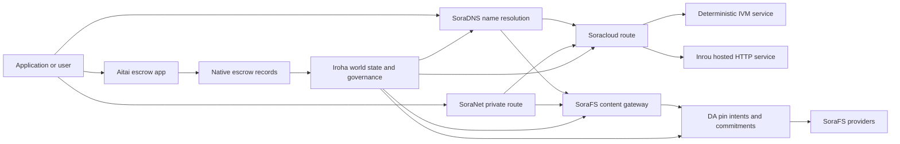

# SORA Nexus Қызметтер {#sora-nexus-services}

SORA Nexus Iroha 3 айналасында қолданбаға арналған қызметтік жазықтықтарды қосады. Бұл қызметтер жеке блокчейн бухгалтерлік тізілімдері емес. Олар Iroha әлемдік күйімен, Norito техникалық манифесттерімен, басқару жазбаларымен және Torii маршрут отбасыларымен бекітілген.

Қолжетімділік түйіннің жинағы мен желі профиліне байланысты. Пайдаланыңыз [`/openapi.json`](/kk/reference/torii-endpoints.md#app-and-sora-route-families) жасалған қосымшаны табу үшін API мақсатты түйінде маршруттар. Қоғамдық жергілікті SoraFS CID және белгілі бағыттар сол жасалған құжаттың сыртында орналастырылған, сондықтан орналастыруды тексергенде сол бағыттарды тікелей зерттеңіз.

## Компонент картасы {#component-map}

|Компонент|Рөлі|Негізгі беттер|
| ---------------------- | ------------------------------------------------------------------------------------------------------------------------------------------- | ---------------------------------------------------------------------------------------- |
| Soracloud              |Қолданбаны орналастыру, хостталған қызметтер, жеке модель/жұмыс кезеңінің күйі және қызметтің өмірлік циклін басқару.| `/v1/soracloud/*`, `/api/*`, `iroha soracloud service ...`                                   |
| Inrou | Тікелей HTTP деңгейін қажет ететін сервис нұсқаларына арналған Soracloud басқаратын HTTP орындау ортасы. | Soracloud орындау ортасының конфигурациясы, хост мүмкіндіктері туралы хабарландырулар, реплика орындау ортасының күйі |
| SoraNet                |Схемаларға, релейлік трафикке, VPN, сессияларды қосуға және стриминг маршруттарына арналған жеке деректерді қорғау және тасымалдау қабаты.| `/v1/connect/*`, `/v1/vpn/*`, SoraNet маршрут метадеректері|
|Деректерге қолжетімділік (DA)|Қолжетімділік дәлелі, криптографиялық міндеттеме мәні және Nexus орындау жолдары, SoraFS техникалық манифесттер және дәлел потоктары арқылы сілтемеленген тасымалдаушы деректерге арналған pin-niyet қабаты.| `/v1/da/*`, `FindDaPinIntent*`, `[nexus.da]`                                             |
| SoraFS                 |Техникалық манифесттерге, CAR payload-тарға, бекітілген контентке, шлюз арқылы алуларға және қалпына келтіру дәлелі ағынына арналған контентке бағытталған сақтау құрылымы.| `/v1/sorafs/*`, `/sorafs/*`, `FindSorafsProviderOwner`                                   |
| SoraDNS                |SORA-қондырылған қызметтер мен контентке арналған детерминистикалық атау беру және шешім қабылдауды куәландыру қабаты.| `/v1/soradns/*`, `/soradns/*`, шешуші каталог оқиғалары|
|Айтай|Қолданба деңгейіндегі фиат және активтік қаржылық транзакцияларды есеп айырысу арнасы, бөлек блокчейн тізіліммен емес, жергілікті кепілдік жазбаларымен қамтамасыз етілген.| `OpenAssetEscrow`, `FindAssetEscrow*`, `EscrowEventFilter`, Kotodama `escrow_*` кіріктірілген функциялар |



## Жиі кездесетін ағындар {#common-flows}

### Қонақтастырылған бөлінген қосымша {#hosted-split-application}

Кәдімгі аралас жазықтықтағы қолданба барлық бөліктерді бірге пайдаланады:

1. Статикалық фронтенд активтері SoraFS арқылы орауланып және бекітіледі.
2. Мысалы, қоғамдық хост `<app>.sora` SoraDNS арқылы тіркелген.
3. Soracloud `/api/v1/search` немесе `/api/v1/stream` бағыттарын Inrou HTTP қызметіне бағыттайды.
4. Soracloud бағыттарын `/api/auth` және `/api/v1/user` детерминистикалық IVM өңдегіштерге бағыттайды.
5. Жеке өмірді қажет ететін клиенттер бірдей мазмұнға немесе API бағытына SoraNet тізбегі арқылы жете алады.

|Жол|Артқы жазықтық|Неге|
| ----------------- | --------------------- | ------------------------------------------------- |
| `/`               | SoraFS статикалық мазмұн |Қайталанатын мазмұнның түпкі қалтасы және шлюз кэштеу|
| `/assets/*`       | SoraFS статикалық мазмұн |Мазмұнға бағытталған активтер және техникалық манифест дәлелдері|
| `/api/auth*`      | Soracloud IVM         |Қайта ойнатуға қауіпсіз аутентификация және әмиян сынағының күйі|
| `/api/v1/user*`   | Soracloud IVM         |Басқаруға сезімтал мемлекеттік мутациялар|
| `/api/v1/search*` | Soracloud Inrou       |Тікелей HTTP қызметі, кэш, SSE немесе жинаушы күйі|

### Мазмұнды жариялау {#content-publication}

SoraFS жарияланым атауға сілтеме жасар алдында ұзаққа шыдайтын артефактілерді тудырады:

1. Payload немесе каталог құрыңыз.
2. Оны CAR архивіне жинап, жоспарды бөліктерге бөліңіз.
3. PIN саясаты мен басқару деректері бар Norito техникалық манифесті жасаңыз.
4. Torii мекенжайына техникалық манифестті тапсырыңыз.
5. Нысаналы профиль нақты дәлелді қажет ететін кезде DA PIN ниеті немесе қолжетімділік криптографиялық міндеттемесінің мәнін тіркеу.
6. Техникалық манифесті SoraDNS атауына немесе Soracloud статикалық фронтенд бағытына байлаңыз.

### Жеке Fetch немесе ағынды маршрут {#private-fetch-or-streaming-route}

SoraNet SoraFS немесе Soracloud алдында отыра алады:

1. Клиент атауды немесе техникалық манифесті шешеді.
2. Қорғау каталогы немесе маршруттық техникалық манифест кіру және шығу релеін таңдайды.
3. Трафик толтырылып, SoraNet тізбегі арқылы жіберіледі.
4. Шығу релесі SoraFS шлюзіне, Torii ағынына немесе Soracloud бағытына жетеді.

## Айтай {#aitai}

Aitai – бұл нарықтық стильдегі қаржылық транзакцияларды шешу үшін сатып алушы мен сатушының off-chain төлемді үйлестіруіне арналған SORA қосымша дәлізі, мұнда Iroha тізбектегі активтерді сақтауын басқарады. Жаңа сандық активтерді сақтау ағындары үшін келісім-шартқа тиесілі эскроу есепшотын қолданудың орнына жергілікті эскроу нұсқаулары отбасын пайдалануы керек.

Туынды эскроу блокчейн тізілімінде қарауды сақтайды. Сатушы `OpenAssetEscrow` арқылы ұсыныс ашады, сатып алушы қабылдайды және оффчейн төлемді `AcceptAssetEscrow` және `MarkEscrowPaymentSent` арқылы белгілейді, және сатушы `ReleaseAssetEscrow` арқылы босатады немесе төлем белгіленгенге дейін тоқтатады. Егер сатып алушы мен сатушы келісімге келе алмаса, кез келген тарап дау ашып, `CanResolveEscrowDispute` көмегімен шешуші құлыпталған соманы бөлісе алады.

Толық өмірлік цикл үшін, жалпы актив құлпылары, анонимді эскроу, сұраулар, оқиғалар және Rust мысалдары үшін, қараңыз [Туынды активтерді сенімхатта сақтау](/kk/blockchain/escrow.md).

|Айтай беті|Оны пайдаланыңыз|
| ------------------------------------------------------------------------------------------------------------------------------------------------------------- | ----------------------------------------------------------------------------------------- |
| `OpenAssetEscrow`, `AcceptAssetEscrow`, `MarkEscrowPaymentSent`, `ReleaseAssetEscrow`, `CancelAssetEscrow`                                                    |Төмендегі XOR номиналды қаржылық операцияларды есеп айырысу ағындарын қоса алғанда, мөлдір сандық актив ұсыныстар.|
| `OpenAnonymousAssetEscrow`, `AcceptAnonymousAssetEscrow`, `MarkAnonymousEscrowPaymentSent`, `ReleaseAnonymousAssetEscrow`, `CancelAnonymousAssetEscrow`       |Қорғалатын ұсыныстар қаржыландыру және жабу әрекеттері үшін дәлел тіркемелерін пайдаланады.|
| `OpenEscrowDispute`, `ResolveEscrowDispute`, `OpenAnonymousEscrowDispute`, `ResolveAnonymousEscrowDispute`                                                    |Дауларды тіркеу және сот үлгідегі шешім.|
| `FindAssetEscrowById`, `FindAssetEscrowsBySeller`, `FindAssetEscrowsByBuyer`, `FindAssetEscrowsByStatus`|Қосымша күй беттері, салық есептері жұмыстары және қолдау құралдары.|
| `EscrowEventFilter` |Эскроу идентификаторы, сатушы, сатып алушы, мәртебе немесе іс-шара түрі бойынша тікелей ашық эскроу жазылымдары.|
| Kotodama `escrow_open_offer`, `escrow_accept`, `escrow_mark_payment_sent`, `escrow_release`, `escrow_cancel`, `escrow_open_dispute`, `escrow_resolve_dispute` | Kotodama келісімшарт шақырулары V1 эскроу жүйелік шақырулары арқылы қолдаулы. |

Қоғамдық Taira немесе Minamoto пайдалану үшін, оффчейн төлем жүйесін және кез келген қолдау немесе сот жұмыс процесін қолданба саясаты ретінде қарастырыңыз. Iroha тіркейді қамауда ұстау күйі, өмірлік цикл оқиғалары, дәлелдердің криптографиялық хэштері және соңғы активтің қозғалысы; ол өздігімен фиат қаржылық транзакцияны есеп айырысуын растамайды.

## Мақсат түйінін тексеру {#check-a-target-node}

Бұл беттегі мысалдарды қолданбас бұрын, мақсатты түйінде маршруттар отбасыларының бар екеніне көз жеткізіңіз:

```bash
export TORII_URL=https://taira.sora.org

curl -fsS "$TORII_URL/openapi.json" \
  | jq '.paths | keys[] | select(test("^/v1/(soracloud|sorafs|soradns|connect|vpn|da)/"))'

curl -fsS -H 'Accept: application/json' "$TORII_URL/status" | jq .
```

`/openapi.json` - бұл бірегей протокол-стандартты OpenAPI API соңғы нүкте. Нақты маршруттың қолжетімділігі құрылым ерекшеліктері мен желі конфигурациясына байланысты. Құжатта қоғамдық жергілікті SoraFS CID және жақсы танымал маршруттар көрсетілмеген; төменде сипатталғандай, сол API ұштар нүктелерін тікелей тексеріңіз.

### Taira Тек оқу үшін арналған түтін тексерулері {#taira-read-only-smoke-checks}

Қоғамдық Taira API соңғы нүктесі оқу жағындағы тексерулер үшін пайдалы, бірақ егер сіз рұқсат етілген есептік жазбаны пайдаланбайтын болсаңыз немесе қоғамдық тест желісінің күйін өзгертуге ниетіңіз болмаса, оны түрлендіретін мысалдар үшін пайдаланбаңыз.

```bash
export TORII_URL=https://taira.sora.org

curl -fsS -H 'Accept: application/json' "$TORII_URL/status" \
  | jq '{version: .build.version, peers, blocks, lanes: (.teu_lane_commit | length)}'

curl -fsS "$TORII_URL/v1/vpn/profile" \
  | jq '{available, relay_endpoint, supported_exit_classes}'

curl -fsS "$TORII_URL/v1/sorafs/storage/peers?limit=4" \
  | jq '{gateway_base_url, pin_torii_urls}'

curl -fsS -H 'Accept: application/json' "$TORII_URL/v1/soracloud/status" \
  | jq '.control_plane | {service_count, services: [.services[] | {service_name, current_version}]}'
```

Taira OpenAPI жол картасында көрсетілмеген, орналастыруға қатысты басқару-жолдарын көрсетуі мүмкін. `/openapi.json`-ты оның ішіндегi маршруттар үшін жасалған келісім деп есептеп, содан кейін оларды қолжетімді ретінде құжаттамалайр алдында орналастыруға қатысты және жалпы жергілікті SoraFS маршруттарын тікелей растаңыз.

## Soracloud {#soracloud}

Soracloud – бұл SORA қолданба басқару жазықтығы. Ол орналастыру топтамаларын, қызмет өзгертулері, бағыттауды, іске қосу күйін, авторитетті конфигурациялық жазбаларды, шифрланған қызмет құпияларын, модель тіркеу жазбаларын, жеке болжамдық сеанстарды және бағдарламалық қамтамасыз ету орындау ортасы протоколының нәтиже жазбаларын бақылайды.

Soracloud екі орындау жазықтығын пайдаланады:

|Орындау жазықтығы|бағдарламалық қамтамасыз ету орындау ортасы|Оны пайдаланыңыз|
| ---------------------- | ------- | -------------------------------------------------------------------------------------------- |
| `DeterministicService` | `Ivm`   |Аутентификация, қойма күйі, сертификатталған оқу, реттелген пошта жәшігі өңдеушілері, басқаруға сезімтал мутациялар|
| `HttpService`          | `Inrou` |Тікелей HTTP APIs, коллекторға ауыр жұмыс, кэш-пен қамтамасыз етілген қызметтер, SSE, браузер көмегімен ағындар|

Басқару деңгейі билік береді. Орнату, жаңарту, артқа қайтару, конфигурация, құпия, модель және күй командалары Torii арқылы жіберіліп, аяқталған әлемдік күйді оқиды; олар жеке CLI-жергілікті айнаға сүйенбейді. Қоғамдық бағыттау ең ұзын префикс негізінде, сондықтан бір тіркелген хост хостталған HTTP маршруттар мен детерминирленген API маршруттар арасында трафикті бөле алады.

### Split App үшін жасалған бастапқы құрылым {#scaffold-a-split-app}

Бөлінген қосымша үлгісі статикалық алдыңғы жағынан және бір орналастырылған тікелей API және бір детерминистік қазына/API қызметінен тұрады:

```bash
iroha soracloud app init \
  --template split-app \
  --app-name solswap_indexer \
  --app-version 0.1.0 \
  --public-host solswap-indexer.sora \
  --output-dir ./apps/solswap-indexer

iroha soracloud app plan \
  --manifest ./apps/solswap-indexer/app_manifest.json

iroha soracloud app doctor \
  --manifest ./apps/solswap-indexer/app_manifest.json
```

`plan` маршруттың бөлігі, балалық қызметтің техникалық манифесттері, жұмыс кеңістігінің скрипт жолдары және күтілетін фронтенд жариялау режимін шығарады. `doctor` сіз Torii-ны қатыстырмас бұрын жергілікті релиз келісімін тексереді.

### Қолданба күйін орналастыру және тексеру {#deploy-and-inspect-app-state}

Релизді қайтадан сынаған сайын бір болашақ SoraFS сақтау уақытын қайта пайдаланыңыз. Себебі split-app үлгісі Inrou қызметін қамтиды, онлайн өзгерістен бұрын таңдаулы оффлайн провайдер дүкендерінде оның нақты артефактісін тексеріңіз:

```bash
export SORACLOUD_TORII_URL=https://<soracloud-enabled-torii>
export SORAFS_RETENTION_EPOCH=<future-unix-seconds>

iroha soracloud app preseed \
  --manifest ./apps/solswap-indexer/app_manifest.json \
  --sorafs-retention-epoch "$SORAFS_RETENTION_EPOCH" \
  --inrou-preseed-target <validator-account,peer-id,absolute-store-path> \
  --inrou-preseed-max-capacity-bytes <bytes> \
  --inrou-preseed-helper /absolute/path/to/sorafs-node \
  --inrou-preseed-helper-sha256 <lowercase-sha256> \
  --receipt-out /absolute/path/to/solswap-inrou-preseed.json

iroha soracloud app release \
  --manifest ./apps/solswap-indexer/app_manifest.json \
  --sorafs-retention-epoch "$SORAFS_RETENTION_EPOCH" \
  --inrou-preseed-receipt /absolute/path/to/solswap-inrou-preseed.json \
  --torii-url "$SORACLOUD_TORII_URL"

iroha soracloud app status \
  --manifest ./apps/solswap-indexer/app_manifest.json \
  --torii-url "$SORACLOUD_TORII_URL"
```

Жіберу саясаты талап ететін әрбір провайдер дүкені үшін `--inrou-preseed-target` қайталаңыз. `release` техникалық манифестерді жасайды және синхрондайды, қосымшаны тексеруді іске қосады, бір ғана протокол-стандартты қолданба-инфрақұрылым мутациясын ұсынады, беделді мәртебені үйлестіреді және жарияланған тірі нысандарды растайды. Қолданба Inrou артефактілерін қамтитын кезде алдын ала тұқым протоколы нәтижесінің жазбасы міндетті болып табылады.

Алдын ала орналастырылған қызмет үшін қызметке арналған пәрмендерді пайдаланыңыз:

```bash
iroha soracloud service status \
  --service-name solswap_indexer_live \
  --torii-url "$SORACLOUD_TORII_URL"

iroha soracloud service rollback \
  --service-name solswap_indexer_live \
  --target-version 0.1.0 \
  --torii-url "$SORACLOUD_TORII_URL"
```

### Конфигурация және құпия материал {#config-and-secret-material}

Soracloud конфигурация және құпия жазбалар беделді орналастыру күйінің бөлігі болып табылады. Қажетті конфигурациялар немесе құпия байламдар жоқ немесе белсенді техникалық манифесттермен сәйкес келмеген жағдайда орналастыру, жаңарту және кері қайтару жабық түрде сәтсіз болады.

```bash
iroha soracloud service config-set \
  --service-name solswap_indexer_live \
  --config-name indexer/public_config \
  --value-file ./config/public-config.json \
  --torii-url "$SORACLOUD_TORII_URL"

iroha soracloud service secret-set \
  --service-name solswap_indexer_live \
  --secret-name indexer/api_key \
  --secret-file ./secrets/api-key.envelope.json \
  --torii-url "$SORACLOUD_TORII_URL"
```

Профайлыңызға қажет нақты тіркелгі белгілері үшін CLI көмегін пайдаланыңыз:

```bash
iroha soracloud service config-set --help
iroha soracloud service secret-set --help
```

## Инро {#inrou}

Inrou — бұл Soracloud қолданатын орналастырылған HTTP бағдарламалық орындау ортасы. Енгізілген Soracloud бағдарламалық орындау ортасы бар Iroha тоғы Soracloud жобаларды қабылдайды жергілікті материалдандыру жоспарына күйді енгізеді, тағайындалған орналастырылған қызметтің репликаларын loopback қызметтері ретінде іске қосады және реплика бағдарламалық қамтамасыз ету орындау ортасының күйін беделді модельге қайта хабарлайды.

Тікелей HTTP беті қажет болатын жүктемелер үшін Inrou пайдаланыңыз, мысалы, коллекторға көп бағытталған APIs, SSE ағындары, кэшпен қолдау көрсетілетін өңдеушілер немесе браузер арқылы қолдау көрсетілетін қызметтер.

### бағдарламалық қамтамасыз ету орындау ортасының талаптары {#runtime-requirements}

- Контейнердің техникалық манифесті бағдарламалық қамтамасыз ету орындау ортасы `Inrou` болуы қажет.
- Қызметтің техникалық манифестін орындау алаңы `HttpService` болуы керек.
- `HttpService + Inrou` дәл бір `PersistentRootLeaseVolume`-ның `/` орнына орнатылуын талап етеді.
- Көшірулі Inrou қызметтеріне де өзгермелі ортақ күйді сақтаған кезде ортақ қызмет немесе құпия жалдау қоймасы қажет.
- Өндірістік хостинг түйіндері тек прокси ретінде жұмыс істеудің орнына нақты Inrou сыйымдылығын жарнамалауы керек.

### техникалық манифест фрагмент {#manifest-fragment}

Төмендегі мысал екі техникалық манифесттің пішінін көрсетеді. Бұл фрагмент, толық орналастыру жиынтығы емес.

```jsonc
// container_manifest.json
{
  "schema_version": 1,
  "runtime": { "runtime": "Inrou", "value": null },
  "bundle_path": "/bundles/solswap-indexer.inrou",
  "entrypoint": "/app/bin/launch-indexer.sh",
  "args": [],
  "env": {
    "RUST_LOG": "info",
  },
  "inrou": {
    "schema_version": 1,
    "guest_os": { "guest_os": "DebianSlim", "value": null },
    "guest_images": {
      "x86_64": {
        "kernel_image_path": "/inrou/x86_64/vmlinux",
        "rootfs_image_path": "/inrou/x86_64/rootfs.ext4",
        "initrd_image_path": null,
      },
      "aarch64": {
        "kernel_image_path": "/inrou/aarch64/vmlinux",
        "rootfs_image_path": "/inrou/aarch64/rootfs.ext4",
        "initrd_image_path": null,
      },
    },
  },
  "lifecycle": {
    "start_grace_secs": 60,
    "stop_grace_secs": 30,
    "healthcheck_path": "/api/indexer/v1/health",
  },
}
```

```jsonc
// service_manifest.json
{
  "schema_version": 1,
  "service_name": "solswap_indexer_live",
  "service_version": "0.1.0",
  "execution_plane": { "execution_plane": "HttpService", "value": null },
  "replicas": 2,
  "route": {
    "host": "solswap-indexer.sora",
    "path_prefix": "/api/v1/search",
    "service_port": 8080,
    "visibility": { "visibility": "Public", "value": null },
    "tls_mode": { "tls": "Required", "value": null },
  },
  "lease_volumes": [
    {
      "volume_name": "root_disk",
      "kind": {
        "lease_volume": "PersistentRootLeaseVolume",
        "value": null,
      },
      "storage_class": { "storage_class": "Warm", "value": null },
      "mount_path": "/",
      "max_total_bytes": 8589934592,
    },
    {
      "volume_name": "index_state",
      "kind": { "lease_volume": "ServiceLeaseVolume", "value": null },
      "storage_class": { "storage_class": "Warm", "value": null },
      "mount_path": "/var/lib/solswap-indexer",
      "max_total_bytes": 1073741824,
    },
  ],
}
```

Бағдарламалық қамтамасыз ету орындау ортасында әрбір тіркелген лизинг көлемі көлем атауынан алынған орта айнымалылар арқылы көрсетіледі:

```text
SORACLOUD_LEASE_VOLUME_ROOT_DISK_DIR
SORACLOUD_LEASE_VOLUME_ROOT_DISK_MOUNT_PATH
SORACLOUD_LEASE_VOLUME_INDEX_STATE_DIR
SORACLOUD_LEASE_VOLUME_INDEX_STATE_MOUNT_PATH
```

## SoraNet {#soranet}

SoraNet – бұл құпиялық пен көлік қабаты. Ол мақсатты шлюзге немесе қызметке тікелей қосылмауы керек трафик үшін релей арқылы бағыттарды қамтамасыз етеді. Көлік дизайны кіру, орта және шығу реле рөлдерін, QUIC көлікті, шу негізіндегі аралас қол беру сигналын, мүмкіндіктерді келісуді, реле каталогының метадеректерін және тұрақты өлшемдегі толтырылған ұяшықтарды пайдаланады.

Nexus орналастыруларда, SoraNet контентті алу, шлюз трафигін, VPN немесе Connect сессияларын және Norito ағынды маршруттарды тасымалдауы мүмкін. Каталог жазбалары `norito-stream` қолдайтын ретрансляторларды белгілей алады, бұл клиенттердің Torii RPC немесе ағындық трафикке қолайлы маршруттарды таңдауға мүмкіндік береді.

### Ағындық конфигурация {#streaming-configuration}

Nexus профилі стриминг маршруттары үшін SoraNet провизиялауды іске қосады:

```toml
[streaming]
feature_bits = 0b11

[streaming.soranet]
enabled = true
exit_multiaddr = "/dns/torii/udp/9443/quic"
padding_budget_ms = 25
access_kind = "authenticated"
provision_spool_dir = "./storage/streaming/soranet_routes"
provision_spool_max_bytes = 0
provision_window_segments = 4
provision_queue_capacity = 256
```

Көрерменнің аутентификациясын қажет етпейтін контент бағыттары үшін `access_kind = "read-only"` қолданыңыз. Torii немесе хостталған сервиске қосылмас бұрын шығу релеінде билеттерді немесе көрерменнің жеке басын тексеру қажет болғанда `authenticated` қолданыңыз.

### SoraNet-білді SoraFS алу {#soranet-aware-sorafs-fetch}

SoraFS алуыш CLI жергілікті прокси техникалық манифестін шығара алады және браузер кеңейтімдері немесе SDK адаптерлері үшін SoraNet маршрут метадеректерін кезекке қоя алады. Оркестр JSON `local_proxy`-ді `"emit_browser_manifest": true`-мен анықтауы керек, ал CLI `local-quic-proxy` қолдауымен жасалуы керек. Taira күні, қоғамдық тестнет түбірінде қабылданған провайдер каталогын тексеріңіз, содан кейін сол провайдерге берілген қорғалатын провайдер қосындысын толтырыңыз:

```bash
export TAIRA_ROOT=https://taira.sora.org
curl -fsS "$TAIRA_ROOT/v1/sorafs/providers?limit=20" | jq '.providers'

: "${TAIRA_SORAFS_PROVIDER_ID:?set the admitted provider ID from Taira discovery}"
: "${TAIRA_SORAFS_GATEWAY_KEY:?set the provider gateway key}"
: "${TAIRA_SORAFS_PROVIDER_URL:?set the advertised provider base URL}"
: "${TAIRA_SORAFS_STREAM_TOKEN_FILE:?set the issued stream-token file}"

cargo run -p sorafs_orchestrator --features=local-quic-proxy --bin=sorafs_cli -- \
  fetch \
  --plan=artifacts/payload_plan.json \
  --manifest-id=<manifest-digest-hex> \
  --orchestrator-config=artifacts/orchestrator.json \
  --provider=name=taira,provider-id="$TAIRA_SORAFS_PROVIDER_ID",gateway-key="$TAIRA_SORAFS_GATEWAY_KEY",base-url="$TAIRA_SORAFS_PROVIDER_URL",stream-token="$(cat "$TAIRA_SORAFS_STREAM_TOKEN_FILE")" \
  --output=artifacts/payload.bin \
  --json-out=artifacts/fetch_summary.json \
  --local-proxy-manifest-out=artifacts/proxy_manifest.json \
  --local-proxy-mode=bridge \
  --local-proxy-norito-spool=storage/streaming/soranet_routes \
  --local-proxy-kaigi-spool=storage/streaming/soranet_routes \
  --local-proxy-kaigi-policy=authenticated \
  --max-peers=2 \
  --retry-budget=4
```

Қысқаша жазбалар провайдері есептерді, бөлшек протокол нәтижелері жазбаларын, жергілікті прокси метадеректерін және алу үшін қолданылған тиімді маршрут параметрлерін хабарлайды.

### Релейлік ынталандыруды тексерушінің тізімі {#relay-incentive-verifier-roster}

Релейлік ынталандыруды енгізу сәтсіздік жағдайда жабылады. Егер `incentives.enable` шын болса, `incentives.trusted_verifier_ids` кем дегенде бір стандартты протокол есептік жазба идентификаторын қамтуы керек. Ротер ешқашан 64-тен аспауы керек кіріспелер, тіпті ынталандырулар өшірілген кезде де. Бағдарламалық қамтамасыз ету ортасы оны детерминистік тәртіптелген жиын ретінде сақтайды және релейді іске қосу кезінде жарамсыз тізім геометриясын қабылдамайды.

Әрбір `RelayBandwidthProofV1` тұрақты кадр/бөлінген бюджеттің астында декодталады және ол толық кадрды тұтынуы керек. Дәлелдің тексерушінің есепшоты конфигурацияланған тізімде болуы тиіс, және `RelayBandwidthProofV1::verify_signature()` сәтті болуы тиіс, релей өзінің өнімділік аккумуляторын құлыптамас бұрын немесе өзгертпес бұрын. Сондықтан сенімсіз криптографиялық қолтаңба беруші немесе қолтаңба жарамсыз/зақымдалған дәлел ешқандай өлшем бермейді және ынталандыру снэпшотын жасай алмайды.

## Деректердің қолжетімділігі (DA) {#data-availability-da}

DA – бұл жүктемелерді тікелей әлемдік күйге орналастыруға тым үлкен, тым жеке деректерге сезімтал немесе тым қызметке тән болған жағдайда олардың қолжетімділігін дәлелдейтін қабат. Бұл детерминистикалық криптографиялық міндеттеме мәндерін және алу міндеттерін тіркейді, сонда растайтындар, шлюздер және клиенттер қай байттар уәде етілгенін, қандай саясат қолданылатынын және қай дәлелдер байқалғанын келісе алады.

DA Kura немесе SoraFS орнына қолданылмайды:

- Kura аяқталған блок ағынын және консенсус қалпына келтіру деректерін сақтайды.
- SoraFS мазмұнға бағытталған байттарды, CAR жүктемелерді және техникалық манифесттерді сақтайды және қызмет көрсетеді.
- DA криптографиялық міндеттеме мәндерін, дәлел саясатын, дәлелді ашуды және сол байттардың жоспарлануына, аудиттелуіне және блокчейн тіркелім күйіне қайтарылуына мүмкіндік беретін пин ниеттерін тіркейді.

Қолданба немесе Nexus орындау жолы блокчейн тізілімінде көрінетін уәде қажет болғанда, офф-чейн деректерінің қайта алынатынын қамтамасыз ету үшін DA пайдаланыңыз. Жиі кездесетін мысалдарға қаржылық транзакцияларды есептеу ағыны үшін орындалу жолындағы жүктеме криптографиялық міндеттемелер мәндері, жарияланған мазмұн үшін SoraFS PIN ниеттері жатады, кейін тексеру үшін сақталуы қажет дәлелдеме бундлдері және жалпы күйі толық мәліметтер емес, криптографиялық хэш мәні болып табылатын қолданба артефакттары.

### Өмірлік цикл {#lifecycle}

|Сахна|Не жазылды|
| ---------- | ----------------------------------------------------------------------------------------------------------------------------------------------------- |
|Ниет|Билет, техникалық манифест сілтемесі, лақап ат, жол/эпоха/рет сілтемесі, сақтау саясаты немесе көшіру нысаны.|
|криптографиялық міндеттеме мәні|криптографиялық қорытынды мән материалы, ол техникалық манифестті, орындау жолындағы жүктемені, дәлел пакетін немесе мазмұн түбірін блокчейн тізілімі жазбасында көрінетін нәрсемен байланыстырады.|
|Дәлел|Қолжетімділік дауыстары, дәлелдеме ашулары, провайдердің куәліктері немесе мақсатты желі қабылдайтын басқа профильге байланысты дәлелдер.|
|Сұрау| `FindDaPinIntentByTicket`, `FindDaPinIntentByManifest`, `FindDaPinIntentByAlias` немесе `FindDaPinIntentByLaneEpochSequence` арқылы пин-мақсатты іздеулер.|

Әдеттегі DA қолдаған жариялау ағыны мынандай:

1. Жүк мөлшерін WSV-нен тыс құрыңыз немесе қабылдаңыз, мысалы, SoraFS CAR файлы немесе Nexus орындау жолы жүктемесі.
2. криптографиялық хэш және жүктемені Norito техникалық манифестте немесе маршрутқа арнайы криптографиялық міндеттеме мәні жазбасында сипаттаңыз.
3. Техникалық манифестті, ниет нүктесін немесе криптографиялық міндеттеме мәнін сол бағыт отбасылары қосылған кезде `/v1/da/*` арқылы немесе желінің қол қойылған транзакция жолы арқылы жіберіңіз.
4. Валидаторларға немесе қолжетімділік провайдерлеріне белсенді дәлел саясаты бойынша қажетті дәлелдерді жинауға рұқсат етіңіз.
5. Жүктемеге байланысты алиасты, қаржылық транзакцияны аяқтау дәлелін немесе шлюз бағыттауын жылжытпас бұрын алынған PIN ниетін немесе криптографиялық міндеттеме мәнін сұраңыз.

### Алгоритмдік модель {#algorithmic-model}

DA жүктемені қол қойылған, қайта ойналуға қарсы қорғалған, блок индексімен көрсетілген криптографиялық міндеттеме мәніне айналдырады. Маңызды алгоритмдер детерминистік, сондықтан тексерушілер мен шлюздер бірдей байттардан бірдей криптографиялық дайджестерді қайта есептей алады.

1. Жіберілген жүктемені каноникалық түрге келтіріңіз. Torii `(lane_id, epoch, sequence)`, жүктеме байттары, сығымдау метадеректері, бөлік өлшемі, жою профилі, сақтау саясаты және жіберушінің қолтаңбасымен қабылдау сұрауын қабылдайды. Түйін сұралған кезде gzip, deflate немесе Zstandard жүктемелерін шешіп, содан кейін бір протоколдық стандартқа сай байт ұзындығының `total_size` болуын тексереді.
2. Орындау жолы мен чанктің параметрлерін тексеріңіз. Орындау жолы Nexus орындау жолы каталогында болуы керек. `chunk_size` нөлге тең емес екілік дәрежесі болуы тиіс, кемінде екі байт. және конфигурацияланған ең үлкенінен үлкен емес. Өшіру профилі деректер бөліктерін және кемінде екі паритет бөлігін қамтуы керек. Орындау арнасы каталогы дәлел схемасын таңдайды, немесе `merkle_sha256`, немесе `kzg_bls12_381`.
3. Желілік саясатты қолдану. Түйін блоб класы үшін конфигурацияланған репликация және сақтау базасын орындайды. Қоғамдық метадеректер ашық мәтін күйінде қалуы керек; тек басқару үшін арналған метадеректер түйіннің конфигурацияланған басқару метадеректер кілтімен шифрленіп, техникалық манифестке жазылудан бұрын өңделеді.
4. Бөлімшелеу және протоколды аяқтау. Бір протокол-стандартты деректер пакеті `chunk_size`-дан алынған тұрақты өлшемді профильмен бөлімшеленеді. Torii деректер пакетінің криптографиялық мәнін есептейді қорыту мәні, қайта алу дәлелі ағашының түбірі және әр-бөлшекке криптографиялық міндеттемелер мәндері. Деректер бөлшектері өз байттары бойынша BLAKE3 криптографиялық міндеттемелер мәндерін алып жүреді.
5. Өшіру криптографиялық міндеттеме мәндерін қосыңыз. Бөлікшелер `data_shards` жолақтарына топтастырылған. Соңғы жолақтағы жетіспейтін ұяшықтар паритетті есептеу үшін нөлмен толтырылады. RS(16) паралығы қатар/желі паралельділік бөліктерін жасайды; өзгертпелі `row_parity_stripes` матрица бойынша бағандық стильдегі жолақты паралельдік қосады. Паралельдік бөлік криптографиялық міндеттеме мәндері BLAKE3 кішкентай-эндиктік `u16` символдарының криптографиялық қоры болып табылады.
6. Техникалық манифест жасаңыз. `DaManifestV1` орындау жолын, эпохасын, блоб класын, кодекін, тасымалдау криптографиялық дайджест мәнін, чанк түбірін, чанк өлшемін, ереажа профилін, сақтау саясатын, жалдау ұсынысын, чанк криптографиялық міндеттемелер мәндерін, қосымша IPA криптографиялық міндеттемелер мәнін тіркейді, метадеректер және шығару уақыты. Сақтау билеті детерминистік: түйін алдымен техникалық манифест шаблондарын бос билетпен криптографиялық түрде хэшлейді, содан кейін сол саусақ ізін соңғы `storage_ticket` ретінде қайта жазады.
7. Қайталау қақтығыстарын қабылдамаңыз. Қайталау кілті `(lane_id, epoch, sequence, manifest_fingerprint)`. Сол саусақ іздері бар көшірме идемпотент болып табылады. Ескі тізбек немесе басқа саусақ іздері бар сол тізбек қабылданбайды.
8. Қолтаңбалы артефакттарды шығару. Torii PDP криптографиялық міндеттеме мәнін есептейді, `DaIngestReceipt` қол қояды, `DaCommitmentRecord`-ді құрады және техникалық манифест үшін, PDP криптографиялық міндеттеме мәні, криптографиялық міндеттеме мәнінің жазбасы үшін спул артефакттарды жазады, криптографиялық міндеттеменің мәндерінің кестесі, пин ниеті, протокол нәтижесі жазбасының файлы және протокол нәтижесі жазбасының журналы. Протокол нәтижесі жазбасының курсоры `(lane_id, epoch)` бойынша монотонды түрде алға жылжиды.

криптографиялық міндеттемелік мән жазбалары – блоктарда тасымалданатын нәрсе. Жазба байланыстырады:

- орындау жолағы, дәуір, және тізбек
- қоңырау шалушының blob идентификаторы және бір процесс-стандартты техникалық манифест криптографиялық хэші
- орындау жолақ дәлел схемасы
- түйін тамыр
- міндетті емес KZG KZG орындау жолдары үшін криптографиялық міндеттеме мәні
- PDP/криптографиялық хэш мәні
- сақтау класы және сақтау билеті
- Torii DA растау қолы

Блок DA жазбаларын енгізбестен бұрын, блокты жинау жолы бундлды тексереді:

- `(lane_id, epoch, sequence)` пакеттің ішінде бірегей болуы тиіс.
- техникалық манифест криптографиялық хэштері нөлге тең болмауы және бундл ішінде бірегей болуы тиіс.
- Криптографиялық міндеттеме мәнін дәлелдеу схемасы бапталған орындау арнасының саясатына сәйкес болуы керек.
- Merkle орындау жолдары KZG криптографиялық міндеттеме мәндерін қабылдамайды; KZG орындау жолдары нөлден өзгеше KZG криптографиялық міндеттеме мәнін талап етеді.
- Pin ниеттері канондық түрде орындалып, орындалу жолы, техникалық манифестің криптографиялық хэші, сақтау билетi, иесінің аккаунты және лақап атаулардың қақтығысы ережелері бойынша сұрыпталады және сүзгіленеді.

Блок тақырыбы DA дәлел саясаттары үшін криптографиялық хэштерді, криптографиялық міндеттемелер мәндерін және пин ниеттерін сақтайды. Мүшелік дәлелдер үшін криптографиялық міндеттемелер мәндерінің пакеті сонымен қатар жалғыз протокол стандартындағы криптографиялық хэштері бар жапырақтары бар Меркл түбірін көрсетеді. Norito-кодталған `DaCommitmentRecord` мәндері. Ата-аналық түйіндер сол және оң балалардың қосындысын криптографиялық хэш етеді; тақ жапырақ келесі қабатқа өзгеріссіз жылжиды.

### Дәлелді тексеру {#proof-verification}

`/v1/da/commitments/prove` блоктағы бір криптографиялық міндеттемеге дәлелді көрсетуі мүмкін. Дәлелде криптографиялық міндеттеме мәні, блок биіктігі, топтамадағы индекс, топтаманың криптографиялық хэші, топтама ұзындығы, Меркле түбірі және бауырластар жолы болады. Тексеру мынадайды тексереді:

1. Дәлел пакеті криптографиялық хэш байлау мәнінің блоктың тақырыбының DA криптографиялық хэшіне сәйкес келеді.
2. Дәлел блок биіктігі сілтемеленген блок тақырыбына сәйкес келеді.
3. Индекс шекараларда және криптографиялық міндеттеменің мәні сол индекстегі бундел кіруімен тең.
4. Орындау жолы дәлелдеу саясаты криптографиялық міндеттеме мәнін қабылдайды.
5. Криптографиялық міндеттеме мәнінің жапырағынан бауыр жолын бүгу ұсынылған тамырды қалпына келтіреді.
6. Қалпына келтірілген түбір тіркелген түбірге тең.

Бұл белгілі бір блок жүктемесіне белгілі бір қолжетімділік криптографиялық міндеттеме мәні енгізілгенін дәлелдейді; бұл әрбір көшірме қазіргі уақытта желіде бар екенін дәлелдемейді. Тікелей қайта алу қабілеті жеке-жеке SoraFS провайдерінен алынатын мәліметтер, PDP/PoTR тексерулері немесе профильге тән қолжетімділік дәлелдері арқылы тексеріледі.

### Консенсус өзара әрекеттесу {#consensus-interaction}

Консенсус жүктемесінің қолжетімділігі міндетті, бірақ бұл екінші финалдық хаттама емес. Көшбасшы қол қойылған `PayloadManifest`-ны толық `3f + 1` комитетіне таратудың хабарын береді. Бірінші дене және RS16 бөлшек пайда болу нысандары Set A-ны нысанаға алады, оның `2f + 1` мүшелеріне жетекші және делегат құйрығы кіреді. Шектеулі біркелкі көріністі қайта тарату дене мен бөлшек қызметін бүкіл комитетке кеңейтеді.

Дауыс беру үшін техникалық манифест немесе ішінара оскен жиынтығы жеткіліксіз. Дайындалуға дейін әрбір валидатор кесінділерді тексеріп, толық бір протокол стандартты денесін қалпына келтіруі керек, оның ұзындығын, бөліктің түбірін және дененің криптографиялық хэшін тексеру, сол денені сақтау және детерминистік блокты тексеруді аяқтау. Валидатор дәл сол денені CommitQC қосымшасы немесе сертификатталған қалпына келтіру арқылы ұстайды.

Желідегі әріптес сертификатты денесі жоқ кезде үйренгенде, алдымен хаттамалық стандартты бір денені немесе сертификат криптографиялық қолтаңбаларын расталған бөліктерді сұрайды, содан кейін қайталануды тоңған комитетке кеңейтеді. Әр жауап дәл биіктік контекстіне, ұсыныс раундтарына, техникалық манифестке және дене субъектісіне байланған болып қалады. Блок тек жергілікті қалпына келтірілген дене сертификатқа сәйкес келгеннен кейін қолданылады.

### Оператор ескертулері {#operator-notes}

Iroha 3 консенсус профилдері әрқашан қол қойылған техникалық манифест пен RS16 жүктемені тарату, Prepare алдында толық дене тексерісі, DA пакет тексерісі және шектеулі қалпына келтіру телеметриясын қамтиды. Таралым мен протокол шектері қол қойылған биіктік контекстіне бекітілген; оларды өшіруге немесе қайта анықтауға болатын жергілікті ауысу немесе уақыт профилі жоқ. Түйіндік жергілікті блок және кезек шектері әлі де таралымның қол қойылған орналасуына және жұмыс жүктемесіне сәйкес келуі керек.

Маршрутты анықтау үшін түйіннің OpenAPI құжатынан бастаңыз:

```bash
curl -fsS "$TORII_URL/openapi.json" \
  | jq '.paths | keys[] | select(startswith("/v1/da/"))'
```

Ағымдағы DA сұрау атаулары үшін [сұрау сілтемесі](/kk/reference/queries.md#nexus-data-availability-and-packages) пайдаланыңыз, ал қолданба деңгейіндегі `[nexus.da]` енгізу, таңдау, аудит және қалпына келтіру шектеулерімен қатар жергілікті Sumeragi блок және кезек шектеулері үшін [желілік тең дәрежелі құрылғылар конфигурация шаблоны](/kk/reference/peer-config/) пайдаланыңыз.

## SoraFS {#sorafs}

SoraFS – бұл орталықсыздандырылған мазмұнға негізделген сақтау құрылымы. Ол байттарды детерминирленген кесектерге, CAR мұрағаттарына және Norito техникалық манифесттерге орай пакеттейді, олар мазмұн түбірлерін, кесектеу профилдерін, бекіту саясаттарын және басқару куәліктерін байланыстырады. Сақтау провайдерлері сыйымдылықты және мазмұнның қолжетімділігін жарнамаласа, ал шлюздер мазмұнды ұсынар алдында техникалық манифесттерді және бөлік криптографиялық міндеттемелерінің мәндерін тексереді.

SoraFS әдетте қолданбаның статикалық ресурстары, құжаттама жинақтары, аймақ бумалары, модельдерге не артефактілерге сілтемелер және басқару дәлелдерінің бумалары үшін пайдаланылады. Iroha деректер моделі SoraFS шлюз оқиғаларын және провайдер иесін анықтауға арналған [`FindSorafsProviderOwner`](/kk/reference/queries.md#nexus-data-availability-and-packages) сұрауын ұсынады.

### Taira Тесттік желі Профилі {#taira-testnet-profile}

Taira бірегей протокол-стандартты қоғамдық SoraFS тест желісі болып табылады. Оның тіркелген валидатор профилі `fc56984b-2be7-431d-840e-21514d1883f0` тізбегін және `369` тізбек дискриминантын пайдаланады. Төмендегі `NetworkId` қазіргі бекітілген Taira блокчейннің бастапқы нақты сәйкестігі болып табылады. A Taira қалпына келтіру сол криптографиялық хэшті өзгерте алады, бірақ тізбек белгіллесін сақтайды, сондықтан оны ағымдағы қол қойылған орналастыру профилінен жаңартыңыз және оны тізбектен UUID ешқашан шығармаңыз. Taira-ның тиімді SoraFS параметрлері:

- желі идентификаторы: `hash:82531CE8EAE8BFF6BEECA4698BFD13A3BC8BEC5F0EE0D23D428C97FC17AB0F3B#3E94`
- қақпа базасы URL: `https://taira.sora.org`
- штырь Torii URLs: `https://taira-validator-1.sora.org` арқылы `https://taira-validator-4.sora.org`
- табу мүмкіндіктері: `torii_gateway`, `chunk_range_fetch`, және `potr_mldsa`
- оқшауланған мазмұн шығу тегі: `https://{cid}.sorafs.taira.sora.org/{path}`
- қоғамдық pin саясаты: рұқсатсыз және ақылы, `require_council_signatures = false` арқылы

```toml
[sorafs.storage]
enabled = false
max_capacity_bytes = 13743895347

[sorafs.discovery]
discovery_enabled = true
known_capabilities = ["torii_gateway", "chunk_range_fetch", "potr_mldsa"]

[sorafs.discovery.admission]
envelopes_dir = "configs/soranexus/taira/sorafs_admission"
trusted_council_keys = ["REPLACE_WITH_TAIRA_SORAFS_COUNCIL_PUBLIC_KEY"]
signature_threshold = "REPLACE_WITH_TAIRA_SORAFS_COUNCIL_SIGNATURE_THRESHOLD"

[sorafs.discovery.publish]
gateway_base_url = "https://taira.sora.org"
pin_torii_urls = [
  "https://taira-validator-1.sora.org",
  "https://taira-validator-2.sora.org",
  "https://taira-validator-3.sora.org",
  "https://taira-validator-4.sora.org",
]

[sorafs.gateway]
require_manifest_envelope = true
enforce_admission = true
enforce_capabilities = true

[sorafs.gateway.untrusted_hosting]
enabled = true
path_gateway_redirect = true
redirect_html_only = true

[sorafs.gateway.untrusted_hosting.cid_host_suffixes]
live = "sorafs.sora.org"
taira = "sorafs.taira.sora.org"

[sorafs.repair]
enabled = false
claim_ttl_secs = 900
heartbeat_interval_secs = 60
max_attempts = 3
worker_concurrency = 4

[sorafs.gc]
enabled = false
interval_secs = 900
max_deletions_per_run = 500
retention_grace_secs = 86400

[gov.sorafs_pin_policy]
require_council_signatures = false
```

Үш жоғары деңгейлі шлюз мәндері мұрагерлік бойынша жабық күйде сәтсіздікке ұшыраған әдепкі мәндер болып табылады; үзіндідегі барлық басқа мәндер Taira тіркелген профилінде нақты көрсетілген. Оператор ашылым-қабылдау орынбасарларын қол қойылған орналастыру материалымен алмастыруы тиіс. Әрбір қызмет көрсетілген сұраныс техникалық манифест деректер контейнерін жеткізіп, провайдер қабылдауынан өтіп, жарияланған мүмкіндікті қолдануы керек.

Taira валидаторларда енгізілген SoraFS сақтау, жөндеу және қоқыс жинау өшірілген. Олардың бапталған сыйымдылығы валидатордың бір бөлігі болып қала береді диск-бюджет тексеру; бұл валидатор сақтау провайдерінің екенін білдірмейді. Тестілеуден бұрын ағымдағы конфигурацияланған шлюз бен байқау нүктелерін оқу үшін `GET /v1/sorafs/storage/peers?limit=4` пайдаланыңыз.

Taira схемасының конфигурациясы `live` және `taira` CID-хост суффикс кілттерін қабылдайды. Қоғамдық тестнет техникалық манифесттері, шығу тексерістері және браузер тестілері `sorafs.taira.sora.org`-ді қолдануы тиіс, сонда олардың шығуы Taira-ке айқын байланыстырылған болады; қабылданған `live` кілтті тесттік желі мазмұнын өндіріс сияқты көрінетін шыққан жерде жариялауға ұсыныс ретінде қарамаңыз. Басқа орналастырулар өздерінің желілік сәйкестілігін, басқару кілттерін, провайдерді қабылдау материалын, API нүктелерді бекіту және сыйымдылық/жөндеу саясатын пайдалану міндетті.

### Қоғамдық Жергілікті CID және Сайт Қақпалары {#public-local-cid-and-site-gateways}

Әрбір SoraFS-бағдарланған Torii түйіні осы анонимді қоғамдық маршруттарды опционалды қосымша API жасалмаған кезде де қосады:

|Әдіс және API тіркелу нүктесі|Мақсат|
| ---------------------------------- | -------------------------------------------------------------------- |
| `GET /.well-known/sorafs/manifest` |Бір протокол-стандарт сұрау хостымен таңдалған техникалық манифестті қайтару|
| `GET /v1/sorafs/cid/{cid}`         |Бір CID үшін шектелген жергілікті техникалық манифест метадеректерін және файл жазбаларын қайтару|
| `GET /sorafs/cid/{cid}`            |Бір жергілікті мазмұнға сілтеме жасалған сайт үшін түпнұсқа құжатты қызмет көрсету|
| `GET /sorafs/cid/{cid}/{*path}`    | Сол CID аясында бір қалыпқа келтірілген жолды немесе бір шектелген байт диапазонын қызмет көрсетіңіз |

Бұл маршруттар ешқашан `x-sorafs-stream-token` немесе `x-sorafs-token-id` қабылдамайды. Кез келген тақырыптың болуы дұрыс емес сұрау болып саналады. Узелдің авторитарлы жергілікті жүйесінде бұрыннан бар бір ғана протокол-стандартты техникалық манифест дөкен – бұл жалпы оқу мүмкіндігі; кэштің жіберілуі алыстағы провайдердің деректерді жаңалауға рұқсат бермейді. Қорғалатын провайдер CAR және бөлік маршруттары бөлек аутентификацияланған протокол беттері болып қала береді.

Байттарды оқудан бұрын, Torii жергілікті техникалық манифестің бір протокол-стандарт кодтауын, семантикалық шектеулерін, криптографиялық дайджест мәнін және түбір CID тексереді. Содан кейін ол техникалық манифест, CID және провайдер үшін беделді жергілікті провайдердің тұлғасын, басқару рұқсатын және басқарылатын сәйкестікті талап етеді. Шлюз тарифі/тыйым салу саясаты тиімді клиенттік мекенжайды пайдаланып, тек конфигурацияланған сенімді проксилер арқылы жіберілген мекенжайларды есепке алады. Саясат, сәйкестілік, жеке бас немесе рұқсат күйі жоқ болса, жабық күйде сәтсіз болады.

Бір сұрау соңынан соңғы ашық шлюз рұқсатына ие; бүкіл процесс бойынша шектеу бір уақытта 64 оқуды қосады, артық сұраулар `503 Service Unavailable` және `Retry-After: 1` қайтарады. техникалық манифест жауаптары 16-ға шектелген MiB, файл тізімдері әдепкі бойынша 50 жазбаны көрсетеді және ең көбі 500-ге дейін қайтарылады, ал толық файл немесе бір байт диапазоны 8-ге шектелген MiB. Сұрау талдауы құрастырылымға байланысты жүзеге асырылады. Тасымалдау `app_api` құрастыруы декодталған таңбасыз 32-биттік `limit` қабылдайды, басқа сұраныс кілттерін елемейді, соңғы қайталанған `limit` жеңетіндей етеді және мәнді `1..=500` шегінде ұстайды. `app_api` жоқ минималды мүмкіндікке ие жинақ тек бір ғана протокол-стандарт `limit=1..500` жұбын қабылдайды және белгісіз, қайталанатын, пайызбен кодталған немесе бір емес протокол-стандарт нысандарын қабылдамайды. Барлық жинақтарда қолдануға болатын әрекет үшін дәл бір `limit=<1..500>` жұбын жіберіңіз. CIDs, хосттар, жолдар және диапазон тақырыптары екі жинақта да бір протокол стандартында және бір мәнді болып қалады. Белсенді HTML, CSS, JavaScript, SVG, XML, PDF, немесе Wasm мазмұны тек конфигурацияланған CID-ден туынды оқшауланған шығыс көзінен беріледі (немесе сол жерге бағытталады), ортақ path-gateway шығыс көзіне сенімсіз мазмұнды орындауға кедергі жасайды.

### Орау, Құру және Жіберу {#pack-build-and-submit}

Келесі мутация мысалы ағымдағы бекітілген Taira `NetworkId`, pin API соңғы нүктесін, репликация қабатын және басқару саясатын пайдаланады. Қаржыландырылған пайдаланыңыз сынақ желісіндегі есептік жазба және бір реттік тек иесіне арналған кілт файлы. Taira кеңес қолтаңбаларысыз рұқсатсыз тіркемелерді қабылдайды, бірақ әлі де басқарылатын төлемді алады.

```bash
cargo run -p sorafs_orchestrator --bin sorafs_cli -- \
  car pack \
  --input=./dist \
  --car-out=artifacts/site.car \
  --plan-out=artifacts/site.chunk-plan.json \
  --summary-out=artifacts/site.car-summary.json

: "${TAIRA_AUTHORITY:?set a funded Taira I105 account}"
export TAIRA_NETWORK_ID='hash:82531CE8EAE8BFF6BEECA4698BFD13A3BC8BEC5F0EE0D23D428C97FC17AB0F3B#3E94'
export TAIRA_PIN_TORII_URL=https://taira-validator-1.sora.org
export TAIRA_PRIVATE_KEY_FILE="${TAIRA_PRIVATE_KEY_FILE:-./secrets/taira-authority.ed25519}"
export TAIRA_RETENTION_EPOCH=$(( $(date -u +%s) + 86400 ))

cargo run -p sorafs_orchestrator --bin sorafs_cli -- \
  manifest build \
  --summary=artifacts/site.car-summary.json \
  --manifest-out=artifacts/site.manifest.to \
  --manifest-json-out=artifacts/site.manifest.json \
  --pin-min-replicas=1 \
  --pin-storage-class=warm \
  --pin-retention-epoch="$TAIRA_RETENTION_EPOCH"

cargo run -p sorafs_orchestrator --bin sorafs_cli -- \
  manifest submit \
  --manifest=artifacts/site.manifest.to \
  --chunk-plan=artifacts/site.chunk-plan.json \
  --torii-url="$TAIRA_PIN_TORII_URL" \
  --network-id="$TAIRA_NETWORK_ID" \
  --authority="$TAIRA_AUTHORITY" \
  --private-key-file="$TAIRA_PRIVATE_KEY_FILE" \
  --summary-out=artifacts/site.manifest.submit.json \
  --response-out=artifacts/site.manifest.submit.body
```

`manifest submit` `/v1/sorafs/pin/register` талап етеді. Егер мақсатты түйін оны бағыттамаса, команда 실패 болады; бірінші шығарылым CLI жалпы `/transaction` API нүктесіне оралуы жоқ.

### Растау және алу {#verify-and-fetch}

Қорғалатын алу тізбесі провайдерге тән. Оның провайдер идентификаторын және Taira провайдері каталогынан жарнамаланған базасын URL алыңыз, сондай-ақ сол провайдердің арқылы шлюз кілтін және ағын токенін алыңыз қабылдау ағысы. Бұл мәндер валидаторлық сақтау параметрлері емес. Тексерілген Taira валидаторларда кіріктірілген сақтау өшірілген, сондықтан провайдерді URL валидатор пинмен URL ауыстырмаңыз.

```bash
export TAIRA_ROOT=https://taira.sora.org
curl -fsS "$TAIRA_ROOT/v1/sorafs/providers?limit=20" | jq '.providers'

: "${TAIRA_SORAFS_PROVIDER_ID:?set the admitted provider ID from Taira discovery}"
: "${TAIRA_SORAFS_GATEWAY_KEY:?set the provider gateway key}"
: "${TAIRA_SORAFS_PROVIDER_URL:?set the advertised provider base URL}"
: "${TAIRA_SORAFS_STREAM_TOKEN_FILE:?set the issued stream-token file}"

cargo run -p sorafs_orchestrator --bin sorafs_cli -- \
  proof verify \
  --manifest=artifacts/site.manifest.to \
  --car=artifacts/site.car \
  --chunk-plan=artifacts/site.chunk-plan.json \
  --summary-out=artifacts/site.verify.json

cargo run -p sorafs_orchestrator --bin sorafs_cli -- \
  fetch \
  --plan=artifacts/site.chunk-plan.json \
  --manifest-id=<manifest-digest-hex> \
  --provider=name=taira,provider-id="$TAIRA_SORAFS_PROVIDER_ID",gateway-key="$TAIRA_SORAFS_GATEWAY_KEY",base-url="$TAIRA_SORAFS_PROVIDER_URL",stream-token="$(cat "$TAIRA_SORAFS_STREAM_TOKEN_FILE")" \
  --output=artifacts/site.fetch.tar \
  --json-out=artifacts/site.fetch.json
```

### Қалпына келтіру қабілеттілігін тексеру {#proof-of-retrievability-checks}

Операторлар қалпына келтірілетінін дәлелдеу нәтижелерін тексере, экспорттай және есептей алады. Сынақтар желінің дәлел бағдарламалық қамтамасыз етуі өңдеу жұмыс ағыны бойынша жоспарланады; CLI олардың нәтижелерін көрсетеді.

```bash
cargo run -p sorafs_orchestrator --bin sorafs_cli -- \
  por status \
  --torii-url="$TAIRA_PIN_TORII_URL" \
  --manifest=<manifest-digest-hex> \
  --status=failed \
  --limit=20

cargo run -p sorafs_orchestrator --bin sorafs_cli -- \
  por report \
  --torii-url="$TAIRA_PIN_TORII_URL" \
  --week=<YYYY-Www> \
  --format=json
```

## SoraDNS {#soradns}

SoraDNS – бұл SORA қызметтері мен мазмұны үшін детерминистикалық атау қою қабаты. Ол аттарды стандартқа келтіреді, резолвер каталогының жаңартуларын Iroha-де тіркейді, және SoraFS арқылы қол қойылған аймақ немесе шешуші пакеттерді таратады. Шешушілер мен шлюздер ашу метадеректеріне сенбей тұрып, шешуші куәландыру құжаттарын тексереді.

Браузер арқылы кіру үшін, SoraDNS тіркелген FQDN-ден шлюз хосттарын шығарады. Тіркелген ванити хост бір ғана протокол-стандартты қосымша шығу нүктесі болып қала береді, ал орналастырылған шлюз профильдері сол шығу нүктесіне арналған браузер және Torii резервтік маршруттарды көрсетеді.

### Қонақ нысандары {#host-forms}

|Форма|Мысал|Мақсат|
| ---------------------- | ---------------------------------------------- | --------------------------------------------------------- |
|Зәуре шығу тегі| `https://<fqdn>/<path>`                        |техникалық манифесттерде және шығару ескертпелерінде тіркелген бір протокол-стандартты қосымша URL|
| Taira шолғыш қақпасы | `https://<fqdn>.mon.taira.sora.net/<path>`     |Белсенді ауыспалы атқа арналған қоғамдық шолғыш қақпасы|
| Torii резервтік жол| `https://taira.sora.org/soradns/<fqdn>/<path>` | Torii белсенді псевдоним үшін ақауларды түзету және резервті маршрут |
|бір протокол-стандартты криптографиялық хэш шлюзі| `<base32(blake3(name))>.gw.sora.id`            |Детерминирленген шлюз идентификаторы және GAR тексеру|

`/soradns/<alias>/...` резервтік нұсқасы ең қолайлы қоғамдық URL емес. Құрал-саймандар, қосымша техникалық манифесттер және фронтенд конфигурациясы өзгеше аталған хостты таңдау керек. Егер Taira жүйесінде альяс белсенді болмаса, браузер қақпасы немесе резервтік жол `404` қайтара алады немесе қолданба маршрутизациясы басталмас бұрын TLS сәтсіздікке ұшырауы мүмкін.

### Шақыру Қақпасының Хосттарын шығару {#derive-gateway-hosts}

```ts
import {
  deriveSoradnsGatewayHosts,
  hostPatternsCoverDerivedHosts,
} from '@iroha/iroha-js'

const derived = deriveSoradnsGatewayHosts('docs.sora')
console.log(derived.canonicalHost)
console.log(derived.prettyHost)

const taira = deriveSoradnsGatewayHosts('solswap-indexer.sora', {
  prettySuffix: 'mon.taira.sora.net',
})
console.log(taira.prettyHost)

const patterns = [
  derived.canonicalHost,
  derived.canonicalWildcard,
  derived.prettyHost,
]
console.log(hostPatternsCoverDerivedHosts(patterns, derived))
```

GAR жүктемелері бір протоколдық стандарттағы криптографиялық хэш хостын, бір протоколдық стандарттағы жоғарғы деңгейлі таңбалы хостты және таңдалған әдемі хостты қамтуы керек.

### Резолвер каталогының уақыт бойынша мәліметтер көрінісін алу {#fetch-a-resolver-directory-snapshot}

```bash
curl -i "$TORII_URL/v1/soradns/directory/latest"

soradns_resolver directory fetch \
  --record-url "$TORII_URL/v1/soradns/directory/latest" \
  --directory-url https://gateway.example.org/soradns/directory/latest.car \
  --output ./state/soradns-directory

soradns_resolver rad verify \
  --rad ./state/soradns-directory/rad/resolver-a.norito
```

Шлюздер резольвердің куәландыру құжаты жоқ, мерзімі өткен, қол қойылмаған немесе соңғы каталог Merkle түбірінде бекітілмеген резольверлерді қабылдамауы керек. Ешқандай резольвер каталогы жарияланбаған желіде, `/v1/soradns/directory/latest` маршруты қосулы болғанына қарамастан `404` қайтара алады.

### Қоғамдық DNS Делегация {#public-dns-delegation}

SoraDNS хост шығару әдеттегі интернет DNS делегациясын алмастырмайды. Егер жалпы DNS атау SoraDNS шлюзге нұсқауы керек болса:

- поддомендер үшін таңдалған әдемі хостқа CNAME жариялаңыз
- apex аттары үшін, ALIAS/ANAME немесе A/AAAA жазбаларын gateway anycast IPs мекенжайына пайдаланыңыз
- GAR тексерулері үшін бір протоколдық стандартты криптографиялық хэш хостын SoraDNS шлюз доменінде сақтаңыз

## FHE және UAID {#fhe-and-uaid}

Nexus қызметтеріне қолжетімді FHE-қатысты беттер мыналарды қамтиды:

- `iroha_crypto::fhe_bfv` скалярлық шифрланған мәтінді бағалау үшін детерминирленген BFV қолдауын жүзеге асырады. Идентификаторды шешу `BfvIdentifierPublicParameters` және `BfvIdentifierCiphertext` пайдаланады, мұнда 0-ші слот енгізу байт ұзындығын сақтайды, ал кейінгі слоттар әрқайсысы бір шифрланған байтты сақтайды.
- Soracloud күй және жұмыс схемалары моделін FHE басқару жүргізілетін параметрлер жиынтықтарымен, орындау саясаттарымен, шифртекст криптографиялық міндеттемелер мәндерімен, сұрау деректер контейнерлерімен және жария ету сұраулары арқылы шифртекст жұмыс жүктемелерін сипаттайды.

BFV идентификатор жолы құпиялылықты сақтайтын тіркелуге арналған. Клиент кодталған идентификаторды Torii шешушіге ұсына алады. Шешуші оны қарайды белсенді идентификатор саясаты, `OpaqueAccountId`-ті алады және протокол нәтижесі жазбасын шығарады. Содан кейін `ClaimIdentifier` сол протокол нәтижесі жазбасын мақсатты есептік жазбаға тіркелген UAID-ке байланыстырады.

UAID — осы ағынның сәйкестендіру және мүмкіндік тірегі. Деректер моделінде `UniversalAccountId` хэшке негізделген және `uaid:<hash>` түрінде көрсетіледі. Парсерлер `uaid:<hash>` пішімін де, өңделмеген 64 он алтылық таңбалы криптографиялық дайджестті де қабылдайды. `Account` пен `NewAccount` міндетті емес `uaid` және `opaque_ids` өрістерін қамтиды. Орындау ортасы тіркеу кезінде UAID пен тіркелгі арасында бір-біріне сәйкесті индексті қамтамасыз етеді, қайталанатын не өзара соқтығысатын мөлдір емес идентификаторларды және UAID-ы жоқ мөлдір емес идентификаторларды қабылдамайды. UAID пен тіркелгі байланысы өзгерген сайын, орындау ортасы осы UAID үшін Кеңістік каталогындағы деректер кеңістігі байланыстарын қайта құрады.

Ғарыштық каталогтың техникалық манифесттері мүмкіндіктерді UAID-ге тіркейді. `AssetPermissionManifest` UAID, деректер кеңістігі, іске қосу және қосымша аяқталу кезеңін атайды, сондай-ақ деректер кеңістігі, бағдарлама, әдіс, актив және AMX рөлі бойынша шектелген рұқсат/тыйымдалған жазбаларды тәртіпке келтіреді. Бағалау - бас тарту жеңеді: бірінші сәйкес келетін бас тарту сұранысты қабылдамайды, әйтпесе соңғы сәйкес келетін рұқсат кандидаты кез келген мөлшер шегіне тексеріледі. Осы техникалық манифестерді жариялау, мерзімін аяқтау және қайтарып алу `CanPublishSpaceDirectoryManifest` арқылы қорғалады.

Soracloud FHE мемлекеті үшін жүзеге асырылған схемалар мыналар болып табылады:

|Схема|Ол не нәрсені басқарады|
| ----------------------------------------- | --------------------------------------------------------------------------------------------------------------------------- |
| `SoraStateBindingV1` бар `FheCiphertext` |Мемлекеттік кілт префиксі астындағы мәндердің FHE шифрланған мәтіндер екенін жариялайды.|
| `FheParamSetV1`                           |Схеманы, артқы жағын, модульдік тізбекті, полином дәрежесін, слот санын, қауіпсіздік мақсаттарын, өмірлік циклді және параметрдің криптографиялық дайджесті мәнін атайды.|
| `FheExecutionPolicyV1`                    |Шифр мәтінінің өлшемі, ашық мәтін мөлшері, енгізу/шығару саны, көбейту тереңдігі, айналдырулар, жүктемелер және дөңгелектеу режимі шекаралары.|
| `FheGovernanceBundleV1`                   |Жұптар бір параметр жиынтығын қабылдау тексеру үшін бір орындау саясатына байланыстырады.|
| `FheJobSpecV1`                            |Шифрланған күй кілттері мен криптографиялық міндеттеме мәндері бойынша детерминистік `Add`, `Multiply`, `RotateLeft` немесе `Bootstrap` жұмысты сипаттайды.|
| `CiphertextQuerySpecV1`                   |Қызмет, байлау, кілт префиксі, нәтиже шегі, метадеректер деңгейі және міндетті емес қосымша дәлел бойынша тек шифрланған күйді сұрау.|
| `DecryptionRequestV1`                     |Шифрланған мәтіннің бір криптографиялық міндеттемесі мәнін дешифрлау-құқығы саясаты бойынша ашуды сұрайды.|

`FheJobSpecV1::validate_for_execution` жұмысқа қабылдамас бұрын, тапсырма, орындалу саясаты және параметр жинағының сәйкес келетінін тексереді. Сондай-ақ, ол операцияға тән ережелерді орындайды: қосу және көбейту үшін кемінде екі кіріс қажет, rotate және bootstrap дәл бір кірісті қажет етеді, ал сұралған тереңдік, айналу саны, bootstrap саны, кіріс саны, жүктеме байттары және детерминирленген шығыс мөлшері саясат шектерінде қалуы керек. Шифрланған мәтінге сұраныс нәтижелері ашық мәтін жолдарын қайтармауы тиіс.

UAID — шифрмәтін де, FHE саясатының өзі де емес. Ол қызметке не деректер кеңістігі ағынына рұқсат беретін тіркелгіні, мөлдір емес идентификатор талаптарын және Кеңістік каталогы байланыстарын табуға пайдаланылатын тұрақты тіркелгі мүмкіндігінің тірегі. FHE схемалары шифрланған пайдалы жүктемені қабылдау мен орындауды параметрлер жиынтықтары, орындау саясаттары, шифрмәтін міндеттемелері және шифрды ашу өкілеттігінің саясаттары арқылы бөлек басқарады.

Тиісті Torii беттерге мыналар кіреді:

- `/v1/identifier-policies`
- `/v1/identifiers/resolve`
- `/v1/accounts/{account_id}/identifiers/claim-receipt`
- `/v1/identifiers/receipts/{receipt_hash}`
- `/v1/accounts/{uaid}/portfolio`
- `/v1/space-directory/uaids/{uaid}`
- `/v1/space-directory/uaids/{uaid}/manifests`
- `/v1/soracloud/fhe/job/run`
- `/v1/soracloud/ciphertext/query`
- `/v1/soracloud/decrypt/request`

Қоғамдық метадеректер шекарасы схемаларда анық көрсетілген: UAID байланыстар, көрінбейтін идентификатор жазбалары, техникалық манифесттің өмірлік циклі, күйлік кілт криптографиялық дайджесттері, шифр мәтіндерінің өлшемдері, шифр мәтіні криптографиялық міндеттеме мәндері, саясат атаулары, параметрлер жиынының нұсқалары, жұмыс операциялары, шығу күйінің кілттері және ашу сұранысы метадеректері көрінуі мүмкін. Идентификаторлардың ашық мәтіндері, дешифрланған күйі, модельдің кірістері мен шығыстары және FHE құпия кілттері осы ашық сұраныс жазбаларының сыртында қалған.

## Операциялық тексеру тізімі {#operational-checklist}

- Мақсатты Torii түйініндегі `/openapi.json` генерацияланған қызмет отбасыларын растаңыз және жария жергілікті SoraFS CID және жақсы танымал маршруттарды тікелей тексеріңіз.
- Soracloud орналастыру техникалық манифесттерін, SoraFS техникалық манифесттерді, SoraDNS шешуші каталог жазбаларын, SoraNet релелік каталог жазбаларын және DA бекіту ниеттері немесе қол жетімділік криптографиялық міндеттемелер мәндерін басқаруға сезімтал артефакттар ретінде қарастырыңыз.
- Бір желідегі барлық тексерушілерде бірдей SORA Nexus профильді үнемі пайдаланыңыз.
- Ad hoc node-local жолдарына сүйенудің орнына техникалық манипуляцияларда Inrou түбірін және ортақ жалгерлік көлемдерді сақтаңыз.
- Мазмұн тіркелімдерін насихаттаудан бұрын SoraFS дәлелді растаманы пайдаланыңыз.
- Қадағалаңыз SoraNet қол алысу сәтсіздіктерін, Sumeragi деректер күйін және жетіспейтін жүктемені қалпына келтіруді, SoraFS шлюздің бас тартуларын, SoraDNS RAD жаңа күйін және Soracloud енгізу денсаулығын.
- Қоғамдық тесттік желіде пайдалану үшін Taira профилін қолданып, [SORA Nexus деректер кеңістіктеріне қосылу](/kk/get-started/sora-nexus-dataspaces.md) арқылы бастаңыз.

Сондай-ақ қараңыз:

- [Torii API соңғы нүктелері](/kk/reference/torii-endpoints.md)
- [Деректер оқиғаларының сүзгілері](/kk/blockchain/filters.md#data-event-filters)
- [Сұрау сілтемесі](/kk/reference/queries.md#nexus-data-availability-and-packages)
- [бір протокол-стандарт Taira валидатор конфигурациясы бекітілген бастапқы код ревизиясында](https://github.com/hyperledger-iroha/iroha/blob/0010c5a70039eac101a4846499ba9ceaf43eb65c/configs/soranexus/taira/config.toml)
