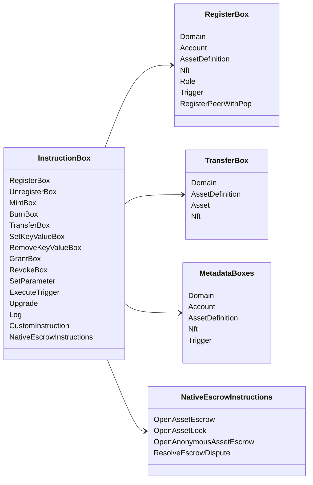

# Iroha Нұсқаулық операциялары {#iroha-special-instructions}

Ағымдағы деректер моделі осы кірістірілген нұсқаулық отбасыларын көрсетеді:

|Нұсқаулық|Варианттар|
| --- | --- |
| [`RegisterBox`](/kk/blockchain/instructions.md#un-register) | `Domain`, `Account`, `AssetDefinition`, `Nft`, `Role`, `Trigger`, `RegisterPeerWithPop` |
| [`UnregisterBox`](/kk/blockchain/instructions.md#un-register) | `Peer`, `Domain`, `Account`, `AssetDefinition`, `Nft`, `Role`, `Trigger` |
| [`MintBox`](/kk/blockchain/instructions.md#mint-burn) |сандық `Asset`, қайталануларды іске қосу|
| [`BurnBox`](/kk/blockchain/instructions.md#mint-burn) |сандық `Asset`, қайталануларды іске қосу|
| [`TransferBox`](/kk/blockchain/instructions.md#transfer) | `Domain`, `AssetDefinition`, сандық `Asset`, `Nft` |
| [`SetKeyValueBox`](/kk/blockchain/instructions.md#setkeyvalue-removekeyvalue) | `Domain`, `Account`, `AssetDefinition`, `Nft`, `Trigger` метадеректер|
| [`RemoveKeyValueBox`](/kk/blockchain/instructions.md#setkeyvalue-removekeyvalue) | `Domain`, `Account`, `AssetDefinition`, `Nft`, `Trigger` метадеректер|
| [`GrantBox`](/kk/blockchain/instructions.md#grant-revoke) | `Permission` (`Grant<Permission, Account>`), `Role` (`Grant<RoleId, Account>`), `RolePermission` (`Grant<Permission, Role>`) |
| [`RevokeBox`](/kk/blockchain/instructions.md#grant-revoke) | `Permission` (`Revoke<Permission, Account>`), `Role` (`Revoke<RoleId, Account>`), `RolePermission` (`Revoke<Permission, Role>`) |
| [`SetParameter`](/kk/blockchain/instructions.md#setparameter) |тізбек параметрін жаңарту|
| [`ExecuteTrigger`](/kk/blockchain/instructions.md#executetrigger) |орындауды іске қосу|
| [`Upgrade`](/kk/blockchain/instructions.md#other-instructions) |орындаушыны жаңарту|
| [`Log`](/kk/blockchain/instructions.md#other-instructions) | орындаушының журнал жазбасы |
| [`CustomInstruction`](/kk/blockchain/instructions.md#other-instructions) |орындаушыға-арналған JSON жүктеме|
| [Табиғи активті эскроу](/kk/blockchain/escrow.md) | `OpenAssetEscrow`, `AcceptAssetEscrow`, `MarkEscrowPaymentSent`, `ReleaseAssetEscrow`, `CancelAssetEscrow`, `OpenEscrowDispute`, `ResolveEscrowDispute` |
| [Жалпы активтерді қамау](/kk/blockchain/escrow.md#generic-asset-locks) | `OpenAssetLock`, `DrawdownAssetLock`, `CancelAssetLock`, `ExpireAssetLock` |
| [Аноним активтерді сенімгерлікке беру](/kk/blockchain/escrow.md#anonymous-escrow) | `OpenAnonymousAssetEscrow`, `AcceptAnonymousAssetEscrow`, `MarkAnonymousEscrowPaymentSent`, `ReleaseAnonymousAssetEscrow`, `CancelAnonymousAssetEscrow`, `OpenAnonymousEscrowDispute`, `ResolveAnonymousEscrowDispute` |
| [Атомдық жеке қаржылық транзакцияны есептеу](/kk/blockchain/instructions.md#atomic-private-settlement) | `ActivatePrivateSettlementPoolV1`, `RotatePrivateSettlementPoolPolicyV1`, `FinalizeAtomicPrivateSettlementV1`, `AbortAtomicPrivateSettlementV1` |

Қосымша Iroha 3 модульдер нұсқаулық тіркеу арқылы доменге тән нұсқаулық түрлерін тіркей алады. Түйінді-өкілетті схема және оны ұстайтын пәрмен үшін [Деректер моделі схемасы](./data-model-schema.md) қараңыз.

::: details Диаграмма: Негізгі нұсқаулық отбасылары

:::
