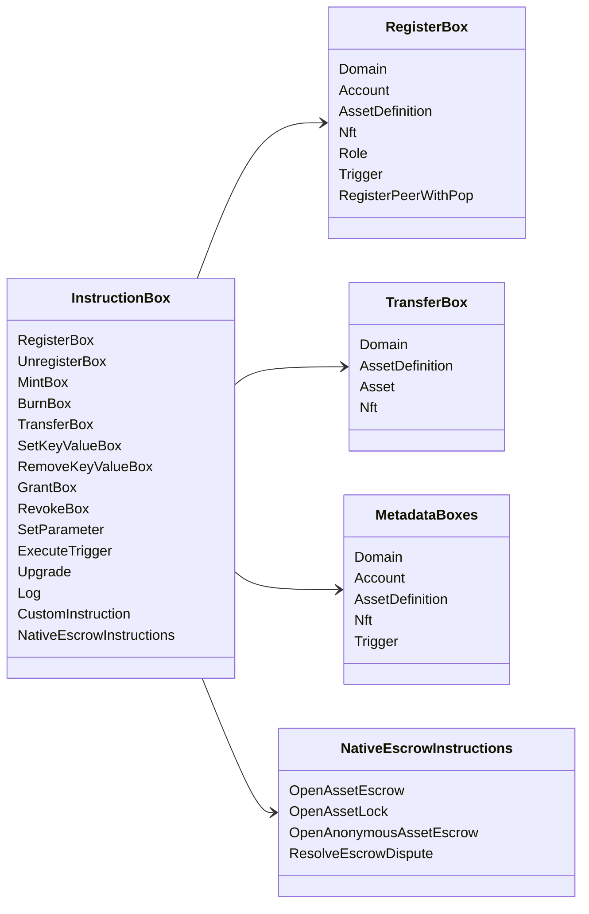

# Iroha Арнайы нұсқаулар {#iroha-special-instructions}

Қазіргі деректер моделі осы үйлесімді нұсқаулық отбасыларын көрсетеді:

|Нұсқаулық |Түрлері |
| --- | --- |
| [`RegisterBox`](/kk/blockchain/instructions.md#un-register) | `Domain`, `Account`, `AssetDefinition`, `Nft`, `Role`, `Trigger`, `RegisterPeerWithPop` |
| [`UnregisterBox`](/kk/blockchain/instructions.md#un-register) | `Peer`, `Domain`, `Account`, `AssetDefinition`, `Nft`, `Role`, `Trigger` |
| [`MintBox`](/kk/blockchain/instructions.md#mint-burn) |сандық `Asset`, қайталануды іске қосу |
| [`BurnBox`](/kk/blockchain/instructions.md#mint-burn) |сандық `Asset`, қайталануды іске қосу |
| [`TransferBox`](/kk/blockchain/instructions.md#transfer) | `Domain`, `AssetDefinition`, сандық `Asset`, `Nft` |
| [`SetKeyValueBox`](/kk/blockchain/instructions.md#setkeyvalue-removekeyvalue) | `Domain`, `Account`, `AssetDefinition`, `Nft`, `Trigger` метадеректер |
| [`RemoveKeyValueBox`](/kk/blockchain/instructions.md#setkeyvalue-removekeyvalue) | `Domain`, `Account`, `AssetDefinition`, `Nft`, `Trigger` метадеректер |
| [`GrantBox`](/kk/blockchain/instructions.md#grant-revoke) |есеп беруге рұқсат, рөлге есеп беру, рөлді атқаруға рұқсат|
| [`RevokeBox`](/kk/blockchain/instructions.md#grant-revoke) |Тіркелгі бойынша рұқсат, Тіркелгіндегі рөл, Ролдан рұқсат |
| [`SetParameter`](/kk/blockchain/instructions.md#setparameter) |тізбек параметрлерін жаңарту |
| [`ExecuteTrigger`](/kk/blockchain/instructions.md#executetrigger) |іске қосу |
| [`Upgrade`](/kk/blockchain/instructions.md#other-instructions) |орындаушы жаңарту |
| [`Log`](/kk/blockchain/instructions.md#other-instructions) |орындаушы журналының жазуы |
| [`CustomInstruction`](/kk/blockchain/instructions.md#other-instructions) |орындаушыға тән JSON пайдалы жүк |
| [Жергiлiктi активтердiң депозитi ](/kk/blockchain/escrow.md) | `OpenAssetEscrow`, `AcceptAssetEscrow`, `MarkEscrowPaymentSent`, `ReleaseAssetEscrow`, `CancelAssetEscrow`, `OpenEscrowDispute`, `ResolveEscrowDispute` |
| [Жалпы активтердің құлыптары](/kk/blockchain/escrow.md#generic-asset-locks) | `OpenAssetLock`, `DrawdownAssetLock`, `CancelAssetLock`, `ExpireAssetLock` |
| [Анонимді активтерді кепілдендіру](/kk/blockchain/escrow.md#anonymous-escrow) | `OpenAnonymousAssetEscrow`, `AcceptAnonymousAssetEscrow`, `MarkAnonymousEscrowPaymentSent`, `ReleaseAnonymousAssetEscrow`, `CancelAnonymousAssetEscrow`, `OpenAnonymousEscrowDispute`, `ResolveAnonymousEscrowDispute` |

Қосымша Iroha 3 модульдері тапсырмалар тізілімі арқылы доменге тән нұсқаулық түрлерін тіркей алады. Ағымдағы көз ағашынан құрылған схема деңгейі тізімі үшін [Дан модельінің схемасын қараңыз](./data-model-schema.md).

::: details Диаграмма: Негізгі нұсқаулар отбасылары

:::
