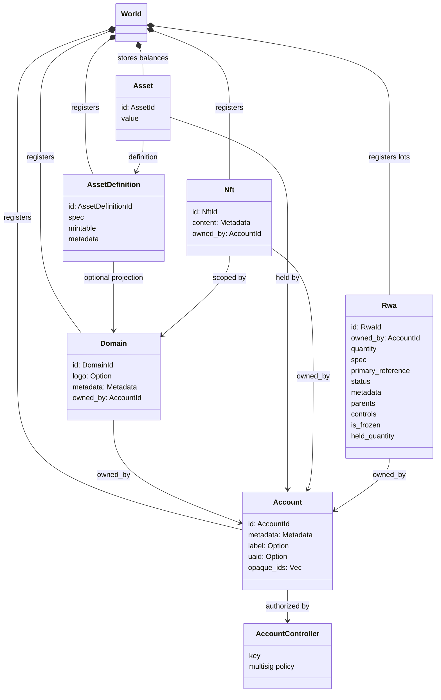
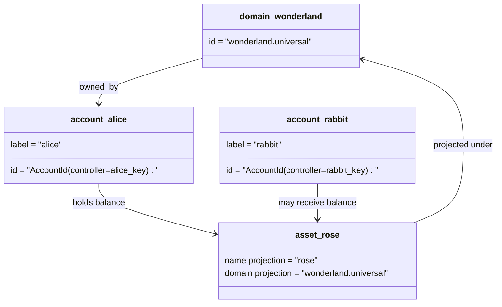

# Өгөгдлийн загвар {#data-model}

Iroha блокчейн бүртгэлийн төлөвийг `World`-д хадгалдаг. Түүний анхны хувилбарын өгөгдлийн загвар нь дараах нэг протокол стандартад нийцсэн танилт болон объектуудыг ашиглана:

- домэйнууд нь өгөгдөл сангийн эрх бүхий, жишээлбэл `payments.universal`
- дансууд нь ганц протоколын стандарттай ба домайнгүй; дансны ID нь дансны хянагчаас гаралтай байдаг
- хөрөнгийн тодорхойлолт нь домэйн/нэрний проекцийг хадгалах боломжтой боловч түүний нэг протокол-стандартын текстийн хаяг нь бүдүүлэг Base58 толь бичлээр тодорхойлогддог
- өрөнгийн зүйлс нь тодорхой хөрөнгийн тодорхойлолтод зориулан дансууд дээр хадгалагддаг үлдэгдлүүд юм
- NFTs нь домайн-дэглэгдсэн ID болон мета өгөгдлийн агуулгатай өвөрмөц эзэмшигдсэн бүртгэлүүд юм
- RWAs нь одоогийн эзэмшигч, тоо хэмжээ, гарал үүсэл, мета өгөгдөл, хадгалалт, түгжих, амьдралын мөчлөгийн хяналт бүхий off-chain хөрөнгөүүдийг илэрхийлэх үүсгэсэн ID-ийн багц юм

## Жишээ {#example}

Iroha 3 сүлжээнд `wonderland.universal` нь `universal` өгөгдлийн орон зайд агуулагдах домэйн юм. Энэ жишээний ганц протокол-стандарт дансуудыг тэдний түлхүүр эсвэл бодлогод хянадаг бөгөөд домэйнгүй I105 дансны ID болгон кодлодог. Уншигдах боломжтой шошгууд, жишээ нь `alice@wonderland.universal` нь тухайн ID-уудтай холбогдсон тусгай нэрс юм. Домэйн болон нэрлэсэн зүйлээс төсөөлсөн хөрөнгийн тодорхойлолтыг үүсгэж болно. жишээ нь `rose` нь `wonderland.universal`-д байдаг бол протокол дамжуулалтын үед ашиглагддаг нэг протоколын стандарт хөрөнгийн тодорхойлолтын хаяг нь үүсгэгдсэн Base58 хаяг юм.

## Хүчин нэрүүд {#aliases}

Нэрүүд нь нэг протокол стандартын блокчейн бүртгэлийн танигч дээр давхарлагдсан хүний уншдаг нэрүүд юм. Эдгээр нь API, CLI, түрийвч, болон судлагчийн хил хязгаарт ашигтай байдаг ч нэг протокол стандартын ID нь блокчейний бүртгэлийн хатуу талбарт хадгалагдсан тогтвортой танигч хэвээр байна.

|Зорилго|нэг протокол стандартын зорилт|Нэршил буквально|Дэмжих загвар|
| -------------- | --------------------------------------------------- | ------------------------------------------------------ | ----------------------------------------------------------------------------- |
|Хэрэглэгчийн акаунт|доменгүй `AccountId` нь I105 хаягаар кодлогдсон| `name@domain.dataspace` эсвэл `name@dataspace`            | `AccountAlias`; үндсэн нэршил нь `Account.label`, нэмэлт нэршлүүд нь холболтууд юм|
|Хөрөнгийн тодорхойлолт|Нэг процессын стандарт `AssetDefinitionId` Base58 хаяг| `name#domain.dataspace` эсвэл `name#dataspace`            | `AssetDefinitionAlias` хөрөнгийн тодорхойлолтод холбоотой|
|Гэрээ|нэг протокол-стандарт Bech32m `ContractAddress`| `name::domain.dataspace` эсвэл `name::dataspace`          | `ContractAlias` байрлуулсан гэрээний хаягт холбогдсон|
|Домэйн нэр| `DomainId` нь `domain.dataspace` хэлбэрээр | `domain.dataspace`                                    | SNS `domain` нэр орон бүртгэл|
|Өгөгдлийн сангийн нэр| идэвхтэй Nexus каталогийн тоон `DataSpaceId` | `universal`, `paynet`, эсвэл `zk` гэсэн dataspace овог нэр| SNS `dataspace` нэр оронгийн бичлэг болон идэвхтэй өгөгдлийн сангийн каталог|

Дансны өвөрмөц нэрүүд нь хэрэглэгчдэд харагддаг дансны нэрүүд юм. Эдгээр нь дансны дахин түлхүүр хийх үйл явцад ч хадгалагддаг бөгөөд учир нь өвөрмөц нэр нь идэвхтэй дансны ID-г дэлхийн төлөвлөгөөний индекс болон дансны дахин түлхүүрийн мэдээллээр зааж өгдөг. Бүртгэлээний үндсэн шошгын хувьд `SetPrimaryAccountAlias`-ийг, нэмэлт үндсэн бус нэршлгийн хувьд `SetAccountAliasBinding`-ийг, уншихад `FindAccountByAlias` эсвэл `FindAliasesByAccountId`-ийг ашиглана. Бүртгэлийн нэршлүүдэд ерөнхийдөө `AcquireAccountAliasLease`-оор олж авсан, `RenewAccountAliasLease`-оор шинэчилсэн идэвхитэй SNS бүртгэлийн нэршлийн түрээс хэрэгтэй байдаг.

Хөрөнгийн орлуулга нь дансны тус бүрийн үлдэгдлүүдийг биш, хөрөнгийн тодорхойлолтыг нэрлэдэг. Хөрөнгийн орлуулгууд болон гэрээний орлуулгууд нь уншиж болох нэрийг байгаа ганц протокол стандартын зорилготой шууд холбодог. Эд хөрөнгийн овог нэрийг `SetAssetDefinitionAlias` ашиглан тохируулдаг; овог нэрийн хэсэг нь эд хөрөнгийн тодорхойлолтын дэлгэцийн нэр эсвэл төсөөлсөн тодорхойлолтын нэртэй таарч байх ёстой. Гэрээний овог нэрийг `SetContractAlias` ашиглан тохируулдаг; нэрийн орон зай нь гэрээний хаягт кодлогдсон орон зайтай таарч байх ёстой. Аль алиныг нь `lease_expiry_ms` дамжуулж болно; хугацаа дууссаны дараа тэдгээр нь уучлалтын цонх дуусахад шийдэгдэхээ больж, дэлхийн төлөвийн индексээс арилдаг.

Домейнууд тусдаа `DomainAlias` объекттой биш юм. Домейны таних тэмдэг нь аль хэдийн өгөгдлийн сан-д тохирсон нэр байдаг, жишээ нь `payments.universal`. SNS нь түрээсийн эзэмшлийг хянадаг `domain` нэрийн сан дахь домэйн нэр болон `dataspace` нэрийн сан дахь өгөгдлийн сангийн орлуулгуудын хувьд. Хавсаргасан `universal` өгөгдлийн сангийн орлуулга заавал тодорхойлогдсон хэвээр байх ёстой.

## Холбогдсон баримт бичгүүд {#related-docs}

|Сэдэв|Хаашаа явах вэ|
| -------------------------------------- | ------------------------------------------- |
|Домэйнууд| [Домэйнууд](/mn/blockchain/domains.md)           |
|Данснууд| [Данс](/mn/blockchain/accounts.md)         |
|Өмч хөрөнгө| [Хөрөнгө](/mn/blockchain/assets.md)             |
| NFTs                                   | [NFTs](/mn/blockchain/nfts.md)                 |
|Бодит ертөнцийн хөрөнгүүд| [Бодит Дэлхийн Хөрөнгүүд](/mn/blockchain/rwas.md)    |
|Метадата| [Метадата](/mn/blockchain/metadata.md)         |
|Бүртгэл болон шилжүүлгийн зааврууд| [Заавар](/mn/blockchain/instructions.md) |
|програм хангамжийн гүйцэтгэх орчны зөвшөөрөл| [Зөвшөөрөл](/mn/blockchain/permissions.md)   |
|Нэрлэх дүрэм| [Нэрлэх дүрэм](/mn/reference/naming.md)        |
