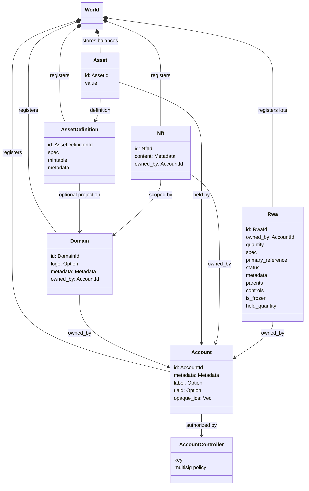
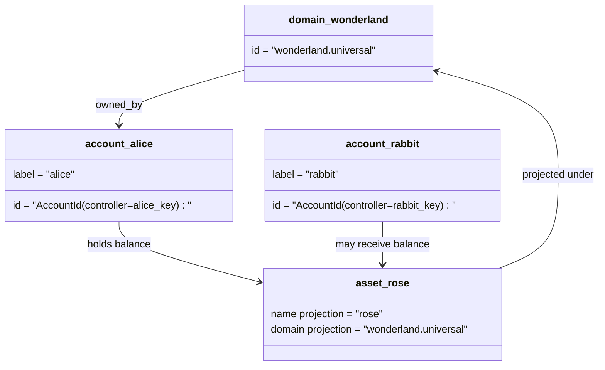

# Мэдээллийн загвар {#data-model}

Iroha дэлгүүрийн номын сан `World`. Анхны хэвлэлийн мэдээллийн загварын хэрэглээ
дараахь санхүүгийн тодорхойлолт, байгууллагууд:

- Тодруулбал, доменүүд нь мэдээллийн орон зайд зориулсан `payments.universal`
- бүртгэл нь хуулиар батлагдсан, доменгүй; ID Энэ нь
  дансны хяналтын ажилтан
- хөрөнгийн тодорхойлолт нь домен / нэр төслийг хадгалж болно, гэхдээ тэдгээрийн каноник
  текст хаяг нь ил тод Base58 тодорхойлогч
- хөрөнгө нь тухайн хөрөнгийн тодорхойлолтын бүртгэлд хадгалагдаж буй үлдэгдэл
- NFTs доменийн эрх бүхий цорын ганц эзэмшлийн бүртгэл IDs болон метабараа
  агуулга
- RWAs үйлдвэрлэгддэг-ID Захиргааны зах зээлээс гадуур хөрөнгийг төлөөлж байгаа
  эзэмшигч, тоо хэмжээ, эх үүсвэр, метадэтгэл, хадгалах, хасах, амьдралын мөрийн
  хяналт

## Жишээлбэл {#example}

Нэг удаа Iroha 3 сүлжээ, `wonderland.universal` нь доменийн дотор
`universal` Энэ жишээний санхүүгийн бүртгэл нь хяналттай
Үүнд доменгүй гэсэн кодтой I105 данс IDs. Уншиж болно
Жишээ нь: `alice@wonderland.universal` тэдгээрийн хоорондоо холбогдсон бие даасан нууц нэрүүд
IDs. Төслийн хөрөнгө тодорхойлолт нь домен болон
нэр: `rose` .д `wonderland.universal`, Каноникийн хөрөнгө
Утасны тодорхойлолтын хаяг нь үүсгэсэн Base58 хаяг юм.

## Нүүр хуудас {#aliases}

Алиасеуд нь хүний өмнө байрлах нэрүүд бөгөөд каннонгийн номын бүртгэлийн тодруулгуудын үүнээс дээш давхарсан байдаг.
Эдгээр нь API, CLI, халамж, хайгуулын хилүүд, гэхдээ каноникийн
IDs Тогтвортой номын бүртгэлийн талбайд хадгалагдсан тогтвортой тодруулгыг хэвээр үлдэнэ.

| Зорилго         | Canonical зорилт                                    | Бусад үсэг                                          | Нүүр хуудасны загвар                                                                 |
| -------------- | --------------------------------------------------- | ------------------------------------------------------ | ----------------------------------------------------------------------------- |
| Хэрэглэгчийн данс   | доменгүй `AccountId` цахилгаан I105 хаяг   | `name@domain.dataspace` эсвэл `name@dataspace`            | `AccountAlias`; үндсэн нууц үсэг нь `Account.label`, Үндэсний нууц нэрүүд нь холболт юм  |
| Ашигт малтмалын тодорхойлох | Каноникийн `AssetDefinitionId` Base58 хаяг     | `name#domain.dataspace` эсвэл `name#dataspace`            | `AssetDefinitionAlias` хөрөнгийн тодорхойлолтод хамааралтай                           |
| Гэрээ       | Каноникийн Bech32m `ContractAddress`                 | `name::domain.dataspace` эсвэл `name::dataspace`          | `ContractAlias` Хөдөлмөрийн хэрэгслийг ашиглах гэрээний хаягаар холбогдсон                          |
| Доменийн нэр    | `DomainId` .д `domain.dataspace` хэлбэр               | `domain.dataspace`                                    | SNS `domain` нэр орон зайны бүртгэл                                                 |
| Мэдээллийн орон тооны нэр | тооны `DataSpaceId` идэвхтэй Nexus жагсаалт | Мэдээллийн орон зай гэх мэт `universal`, `paynet`, эсвэл `zk` | SNS `dataspace` нэр орон тооны бүртгэл болон идэвхтэй мэдээллийн орон тооны каталог            |

Хэтгэлэгт бүртгэлийн нэрүүд нь хэрэглэгчийн өмнө байрлах дансны нэрүүд юм.
эргэлт хийх, учир нь алиас нь идэвхтэй дансанд тодруулах ID Дэлхийн улс орнуудын дамжуулан
Энэтхэгийн үнэлгээ, бүртгэл `SetPrimaryAccountAlias` .
дансны үндсэн тэмдэг, `SetAccountAliasBinding` нэмэлт анхан шатны сургууль биш
нууц нэр, `FindAccountByAlias` эсвэл `FindAliasesByAccountId` уншигчдын хувьд.
Эдгээртээ бодит SNS худалдан авсан санхүүгийн орлон
хамтран `AcquireAccountAliasLease` болон шинэчлэгдэж `RenewAccountAliasLease`.

Ашигт малтмалын нэр томъёо, сангийн үлдэгдэл биш
Алиаз, гэрээний алиаз нь уншигч нэрээс шууд холбогдсон
Орчин үеийн санхүүгийн зорилт. `SetAssetDefinitionAlias`;
Алиас нэрний сегмент нь хөрөнгийн тодорхойлолт үзүүлэлтийн нэртэй ижил төстэй байх ёстой, эсвэл
Төслийн тодорхойлолтын нэр. `SetContractAlias`;
Алиас мэдээллийн орон зай нь гэрээний хаягт кодлагдсан мэдээллийн орон газартай нийцэх ёстой.
Хоёр татварын `lease_expiry_ms`; хугацаа дууссан дараа тэд цэвэрлэхээ зогсоодог.
Энэ нь дэлхийн улс орнуудын үнэлгээний жагсаалтыг дуусгах үед.

Домен нь тусгай `DomainAlias` Тодруулгын тодруулагч
аль хэдийн мэдээллийн орон тооны нэртэй `payments.universal`. SNS замыг
Газрын тосны эзэмшилд орлого `domain` нэр орон зай болон өгөгдлийн орон зай
Хөдөлмөрийн хэрэгсэл `dataspace` Нэрлэгийн орон зай. `universal` Мэдээллийн орон тоо
тодорхойлох ёстой.

## Холбогдсон баримт бичиг {#related-docs}

| Судалгаа                                  | Хэзээ явах вэ?                                 |
| -------------------------------------- | ------------------------------------------- |
| Доменүүд                                | [Доменүүд](/mn/blockchain/domains.md)           |
| Санхүүжилт                               | [Санхүүжилт](/mn/blockchain/accounts.md)         |
| Ашигт малтмал                                 | [Ашигт малтмал](/mn/blockchain/assets.md)             |
| NFTs                                   | [NFTs](/mn/blockchain/nfts.md)                 |
| Байгалийн санхүүжилт                      | [Байгаль орчин](/mn/blockchain/rwas.md)    |
| Мэдээлэл                               | [Мэдээлэл](/mn/blockchain/metadata.md)         |
| бүртгэл, шилжүүлэн суулгах заавар | [Сургалтууд](/mn/blockchain/instructions.md) |
| Хөдөлмөрийн цаг хугацааны зөвшөөрөл                    | [Тусгай зөвшөөрөл](/mn/blockchain/permissions.md)   |
| Тодруулгын дүрэм                           | [Тодруулгын дүрэм](/mn/reference/naming.md)        |
