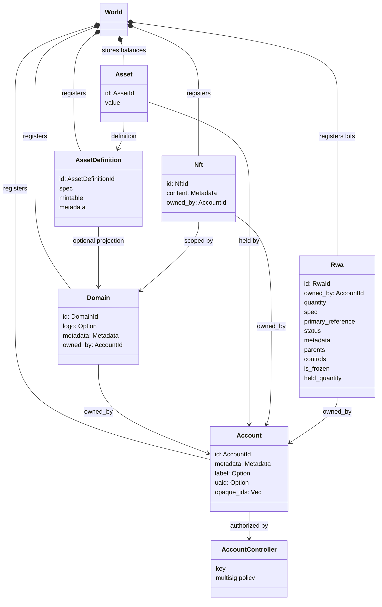
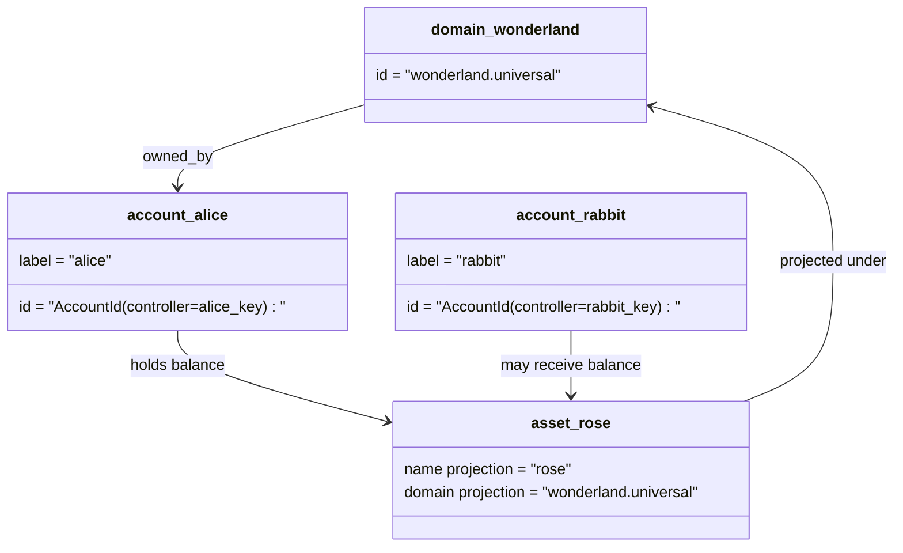

# Мэдээллийн загвар {#data-model}

Iroha нь `World` -ийн номын сангийн жагсаалтыг хадгалдаг. Түүний анхны нэвтрүүлэгт мэдээллийн загварын дагуу дараахь каноникийн тодруулгыг, нэгжүүдийг ашигладаг:

- Тодруулбал `payments.universal` гэх мэт өгөгдлийн орон зайд зориулсан доменүүд байна
- Санхүүжилт нь хуулийн дагуу байдаг бөгөөд доменгүй; санхүүжилт ID нь санхүүгийн хяналтын ажилтангаас үүдэлтэй
- хөрөнгийн тодорхойлолт нь домен / нэр төслийг хадгалж болно, гэхдээ тэдгээрийн санхүүгийн текст хаяг нь ил тод Base58 идентификатор юм
- хөрөнгө нь тухайн хөрөнгийн тодорхойлолтын бүртгэлд хадгалагдсан үлдэгдэл юм
- NFTs нь доменийн чанартай IDs болон метадангийн агуулгатай цорын ганц эзэмшлийн бүртгэл юм
- RWAs нь өнөөгийн эзэмшигч, тоо, эх үүсвэр, метадэтгэл, хадгаламж, мөхжилт, амьдралын эргэлтийн хяналттай зах зээлийн гадаад хөрөнгийг илэрхийлдэг-ID партиуд юм.

## Жишээлбэл {#example}

Iroha 3 сүлжээнд `wonderland.universal` нь `universal` мэдээллийн орон зайд орших домен юм. Энэ жишээ дэх хуулиар бүртгэгдсэн өгөгдлүүд нь тэдгээрийн түлхүүр эсвэл бодлогын дагуу хяналт тавих бөгөөд доменгүй I105 дансанд IDs шифрлэгдсэн байдаг. `alice@wonderland.universal` зэрэг уншигдах тэмдэгүүд нь IDs-ийн хооронд холбогдсон бие даасан нууц нэр юм. `wonderland.universal`-д `rose` гэх мэт домен, нэрээс төлөвлөсөн хөрөнгийн тодорхойлолтыг бүтээн байгуулах боломжтой бол тухайн цахилгаанд ашигласан санхүүжилтийн тодорхойлолт нь бий болсон Base58 хаяг юм.

## Нүүр хуудас {#aliases}

Алиаз нь хүний өмнө байрлах нэр юм. Каноникийн номын бүртгэлийн тодруулгыг давхарсан. Эдгээр нь API, CLI, хөрөнгийн болон хайгуулын хязгаарт ашигтай байдаг. Гэхдээ Canonical IDs нь хатуу номын бүртгэлийн талбайд хадгалагдсан тогтвортой тодорхойлогч хэвээр байна.

|Зорилго .|Canonical зорилт |Нүүр хуудас|Хөдөлмөрийн загвар|
| -------------- | --------------------------------------------------- | ------------------------------------------------------ | ----------------------------------------------------------------------------- |
|Хэрэглэгчийн данс |I105 хаягаар кодлогдсон доменгүй `AccountId` |`name@domain.dataspace` эсвэл `name@dataspace` |`AccountAlias`; үндсэн нууц үсэг нь `Account.label`, нэмэлт унш үсэг нь холболт юм |
|Ашигт малтмалын тодорхойлох |`AssetDefinitionId` Base58 хаяг |`name#domain.dataspace` эсвэл `name#dataspace` |`AssetDefinitionAlias` хөрөнгийн тодорхойлолтод хамааралтай |
|Гэрээ |Canonical Bech32m `ContractAddress` |`name::domain.dataspace` эсвэл `name::dataspace` |`ContractAlias` ашиглалтад оруулсан гэрээний хаягтай холбогдсон|
|Доменийн нэр |`DomainId` хэлбэрээр `domain.dataspace` |`domain.dataspace` |SNS `domain` нэр орон тооны бүртгэл |
|Мэдээллийн орон тооны нэр|үйл ажиллагааны Nexus жагсаалтын тооны `DataSpaceId` |`universal`, `paynet`, эсвэл `zk` гэх мэт мэдээллийн орон тооны нууц нэрүүд |SNS `dataspace` нэр орон тооны бүртгэл болон идэвхтэй мэдээллийн орон тооны каталог |

Акаунтын нууц нэр нь хэрэглэгчийн өмнө байрлах дансны нэрүүд юм. Тэд бүртгэлээ сэргээж үлддэг, учир нь алис нь дэлхийн улс орнуудын индекс болон бүртгэлийн бүртгэлээр идэвхтэй дансанд ID чиглүүлж байна. Хэтгэлийн үндсэн тэмдэглэлд `SetPrimaryAccountAlias`, нэмэлт үндсэн биш нууц үсэгт `SetAccountAliasBinding`, уншлын хувьд `FindAccountByAlias` эсвэл `FindAliasesByAccountId` гэж ашиглах. Хэтгэлийн нууц үгээр нь `AcquireAccountAliasLease`-ээр худалдан авч, `RenewAccountAliasLease`-ээр шинэчлэн батлагдсан идэвхтэй SNS сангийн нууц үсгийн гэрээ шаарддаг.

Ашигт малтмалын алиасеуд нь тухайн хөрөнгийн тодорхойлолт, үл бол бүртгэлийн үлдэгдэл биш. Ашигт малтмалын нууц үсэг нь `SetAssetDefinitionAlias` гэж тохируулна; нууц үсгийн нэр хэсгийг активын тодорхойлолтын дэлгэцийн нэр эсвэл төлөвлөсөн тодорхойлолт нэртэй нийцүүлэх ёстой. Гэрээний нууц үсийг `SetContractAlias` гэж тохируулдаг; нууц мэдээллийн орон зай нь гэрээний хаягаар кодлагдсан өгөгдлийн талбайтай нийцэх ёстой. Хоёр холболт нь `lease_expiry_ms`-ийг тээвэрлэж болно; хугацаа дууссан дараа тэд даатгалын цонхны хугацаа өнгөрөх тусам шийдвэрлэхээс татгалздаг бөгөөд дэлхийн улс орнуудын индексүүдээс арилгагдана.

Доменүүд нь тусгай `DomainAlias` объектгүй. Доменийн тодруулга бол аль хэдийн `payments.universal` гэх мэт өгөгдлийн орон зайд шалгарсан нэр юм. SNS нь `domain` нэрний газар дахь доменийн нэрийг болон `dataspace` нэрсийн газарт өгөгдэл орчны нууцлавын эзэмшилд ордог. `universal` өгөгдлийн орон зайн нууц нэр нь тодорхойлсон байх ёстой.

## Холбогдсон баримт бичиг {#related-docs}

|Судалгаа|Кайд явах вэ?|
| -------------------------------------- | ------------------------------------------- |
|Доменүүд | [Доменүүд](/mn/blockchain/domains.md)|
|Санхүүжилт | [Санхүүжилт](/mn/blockchain/accounts.md)|
|Байгууллага | [Байгууллага](/mn/blockchain/assets.md) |
|NFTs | [NFTs](/mn/blockchain/nfts.md) |
|Эдүгээрийн хөрөнгө| [Үнэн ертөнцөд хөрөнгө](/mn/blockchain/rwas.md) |
|Мэдээлэл мэдээлэл | [Мэдээлэл](/mn/blockchain/metadata.md) |
|бүртгэл , шилжүүлэн суулгах журам | [Нээлт ](/mn/blockchain/instructions.md) |
|Хөдөлмөрийн хугацааны зөвшөөрөл|  зөвшөөрөл|
|Тодруулгын журам | [Тодруулгын дүрэмүүд](/mn/reference/naming.md) |
