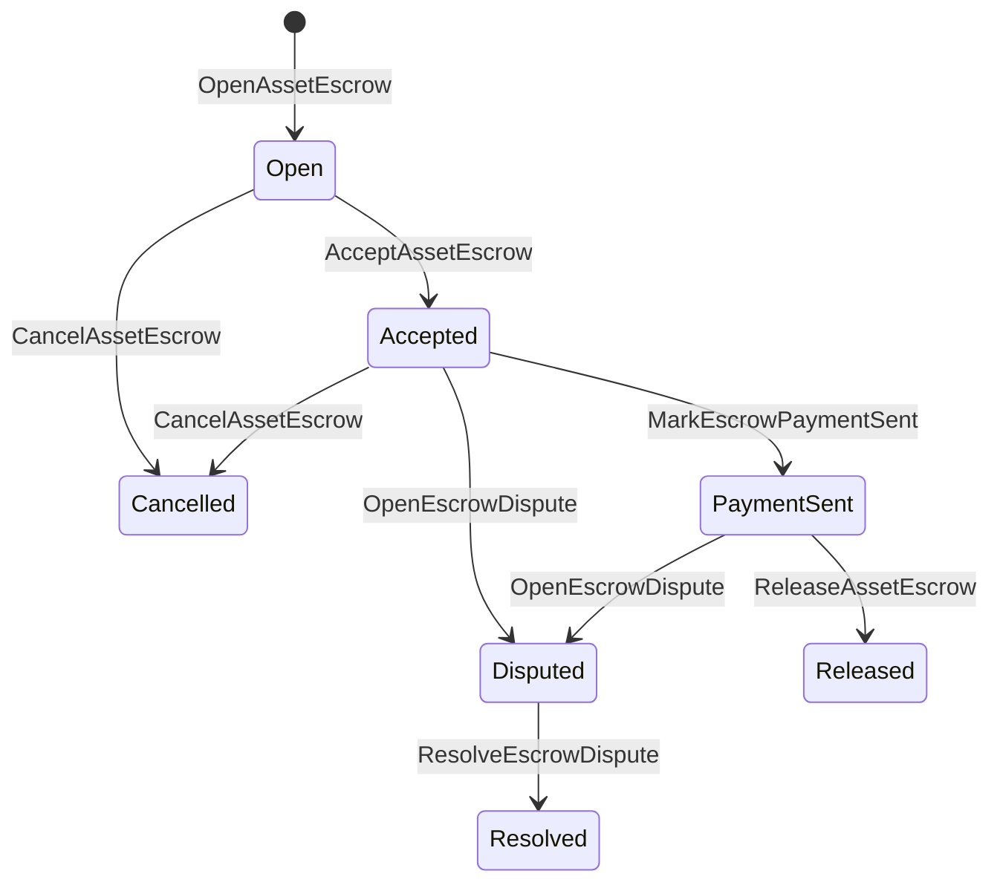

# Тухайн хөрөнгийн хяналт тавих {#native-asset-escrow}

Үндэсний хадгаламж нь санхүүгийн хөрөнгийг захиргааны номын сүлжээгээр хянах механизм юм. Газрын хэрэгслийн өмчит дансанд хөрөнгө илгээхийн оронд, тухайн дансыг хамгаалахын тулд газрын кодтой тулгуурлан ESCROW ISIs нь үнэ цэнийг тодорхойлох протоколын хяналтын дансанд шилжүүлж, ESCROw-ийн амьдралын мөрийг дэлхийн хэмжээнд бүртгэж байна.

Хөрөнгийн ордны зохицуулалт, Aitai загварын гадаад зах зээлийн төлбөрийн уялдаа холбоо, үйл явцын гол цэгүүд, томоохон тэмдэгтээр харагдах амьдралын мөрийн төлөв шаарддаг хамгаалалттай хадгаламжийн ажлын урсгал ашиглана.

## Үндсэн ойлголтууд {#concepts}

|Үндсэн ойлголт|Тодруулга |
| --- | --- |
|`EscrowId` |Зурагчийн сонгосон тодруулгыг хэшээр багтаасан. Энэ нь ил тод, нууцлан бүртгэгдсэн хадгаламжид цогц байх ёстой. |
|`AssetEscrowRecord` |Ашигт малтмалын ил тод санхүүгийн хадгаламж эсвэл хаалтын бүртгэл. |
|`AnonymousAssetEscrowRecord` |Үндсэн хуулийн заалтыг хүчингүй болгох, үүрэг гүйцэтгэх, баталгаажуулах баримтаар батлан хамгаалах. |
|Хяналтын сан|ID, ID хээрийн сан, хөрөнгийн тодорхойлолтоос үүдэлтэй тодорхойлалтын протоколын сан. |
|Мэдээллийн хашс|Мэдээллийн хэшүүд нь фактурууд, шүүх тогтоол, мессеж, хадгаламжийн манфист эсвэл бусад зангилаасаа гадуур баримтыг тодорхойлох боломжтой.|

Ил тод баримт нь борлуулагч, сонголттой худалдан авагч, хөрөнгийн тодорхойлолтоор, нийт хэмжээгээр, хадгаламжийн дансанд, амьдралын мөрийн байдлаараа, заншлын хэлбэрээр, үлдсэн хэмжээгээр, сонголттай гаргах эрх мэдэлтэй, сонголтгүй хугацаагаар дуусах хугацааны тэмдэг, гэрчилгээний хэшиг, цаг хугацааны тэмдэг болон шийдвэрлэх шийдлийн дэлгэрэнгүй мэдээллийг агуулж байна.

Ашигт малтмалын санхүүжилтийн хэмжээ нь эерэг тооны хөрөнгийн хэмжээ байх ёстой бөгөөд хөрөнгийн тодорхойлолтын санхүүгийн үзүүлэлттэй нийцэх ёстой. Ашигтмалтмалын төлөөлөгч эсвэл гулгал идэвхтэй байх үед, ерөнхий хөрөнгийн шилжүүлэн суулгах нь хадгаламжийн дансыг арилгаж чадахгүй; хадгаламжийг гаргах зам нь доор заасан ISIs хадгаламж юм.

## Хөрөнгийн зах зээлийн хямрал {#marketplace-escrow}

Зах зээлийн захиалгаар зах зээлийн зах зээлд орсон хөрөнгийн нөөцийг зах зээлтээс гадуур төлбөрийн эсвэл нийлүүлэлтийн ажлын урсгалаар зохицуулж байна.



|ISI |Хэн үүнийг өргөн мэдүүлсэн бэ?|Үр дүн|
| --- | --- | --- |
|`OpenAssetEscrow` |Худаллагч |Худалчийн санхүүгийн актив нь протоколын хяналтад орсон бөгөөд `Open` зах зээлийн бүртгэл бий болгодог. |
|`AcceptAssetEscrow` |Худалдан авагч|Худагч худалдан авагчийг бүртгэж, `Open` -ийг `Accepted`-д шилжүүлнэ. Худалтан өөрийн захиалгыг хүлээн зөвшөөрөхгүй байна. |
|`MarkEscrowPaymentSent` |Худалдан авсан худалдан авагч |`Accepted` нь `PaymentSent`-д худалдан авагч зах зээлийн гадаад төлбөрийг илгээсний дараа шилжүүлнэ. |
|`ReleaseAssetEscrow` |Худаллагч |`PaymentSent`-ийг `Released`-д шилжүүлж, худалдан авагчдаа бүрэн хадгаламж олгосон хэмжээг шилжүүлнэ. |
|`CancelAssetEscrow` |Худаллагч |`Open` эсвэл `Accepted`-ийг `Cancelled`-д шилжүүлж, төлбөрийг тэмдэглэхээс өмнө борлуулагчдаа буцааж өгдөг. |
|`OpenEscrowDispute` |Худалтан эсвэл хүлээн зөвшөөрөгдсөн худалдан авагч|`Accepted` эсвэл `PaymentSent`-ийг `Disputed`-д шилжүүлж, нотлох баримтын хэшиг нэмнэ. |
|`ResolveEscrowDispute` |`CanResolveEscrowDispute` компанийн бүртгэл|`Disputed` -ийг `Resolved`-д шилжүүлж, худалдан авагч болон борлуулагч хооронд хуваадаг. |

Шүүхийн шийдвэрлэх хэмжээ нь сөрөг биш байх ёстой, `buyer_amount + seller_amount` нь хадгаламжийн хэмжээтэй тэнцэх ёстой. Нурын үнэ цэнэтэй хөлүүд зөвшөөрөлтэй боловч бүх хуваарилалт хаагдсан үлдэгдлийг тооцох хэрэгтэй.

### Rust Жишээлбэл {#rust-example}

Энэ жишээ нь худалдагч болон худалдан авагчдын данс аль хэдийн бий, хөрөнгийн тодорхойлолтыг тооны байдлаар бүртгэж, борлуулагч хангалттай тэнцвэртэй гэж үздэг.

```rust
use iroha::{
    client::Client,
    data_model::{
        isi::escrow::{
            AcceptAssetEscrow, MarkEscrowPaymentSent, OpenAssetEscrow,
            ReleaseAssetEscrow,
        },
        prelude::*,
    },
};
use iroha_crypto::Hash;

fn release_marketplace_escrow(
    seller_client: &Client,
    buyer_client: &Client,
    asset_definition_id: AssetDefinitionId,
) -> eyre::Result<()> {
    let escrow_id = EscrowId::new(Hash::new("docs-marketplace-escrow-001"));

    seller_client.submit_blocking(OpenAssetEscrow::with_evidence_hashes(
        escrow_id,
        asset_definition_id,
        Numeric::from(40_u64),
        vec![Hash::new("invoice:2026-001")],
    ))?;

    buyer_client.submit_blocking(AcceptAssetEscrow::new(escrow_id))?;
    buyer_client.submit_blocking(MarkEscrowPaymentSent::new(escrow_id))?;
    seller_client.submit_blocking(ReleaseAssetEscrow::new(escrow_id))?;

    let record = seller_client.query_single(FindAssetEscrowById::new(escrow_id))?;
    assert_eq!(record.status, AssetEscrowStatus::Released);
    assert_eq!(record.remaining_amount, Numeric::zero());

    Ok(())
}
```

## Женерийн хөрөнгөний буудлууд {#generic-asset-locks}

Ашигт малтмалын нууц нь мөн адил хадгаламжийн бүртгэлийн хэлбэрээр ашигладаг боловч худалдан авагч-арилжагч санал болгодоггүй. Тэд зорилтот дансны хөрөнгийг хааж, санхүүжилтийг гаргахын тулд тусгай зөвшөөрөл шаарддаг.

|ISI |Хэн үүнийг өргөн мэдүүлсэн бэ?|Үр дүн|
| --- | --- | --- |
|`OpenAssetLock` |Эх сурвалж |Эерэг хэмжээг буулгаж, гаралтай газрыг захиалгын худалдан авагч болгон бүртгэж, статусыг `Locked` гэж тогтоодог. |
|`DrawdownAssetLock` |Хөрөнгө оруулалтын эрх мэдэл, эсвэл зөвшөөрөлгүй газар нь .|Үлдсэн хяналтын ажиллагааны хэсгийг эсвэл бүхэлдээ нээлт хийх газарт шилжүүлнэ. |
|`CancelAssetLock` |Захиргааны нээгч .|Ажилтай замбарыг хүчингүй болгож, үлдсэн хэмжээг нээгчэд буцааж өгдөг. |
|`ExpireAssetLock` |Хөдөлмөрийн эрх баригч ямар ч хугацааны дараа .|Өнгөрсөн хугацаанд `expires_at_ms` гэсэн мөрийн хугацаа дуусгавар болж, үлдсэн хэмжээг нээгчэд буцааж өгдөг. |

`DrawdownAssetLock` нь бүртгэлийг `Locked`-д хадгалж байгаа бол зарим хэмжээ үлддэг. үлдсэн хэмжээ нургаар хүрэхэд, статусууд `DrawnDown` болж, бүртгэл дуусгавар болно.

```rust
use iroha::{
    client::Client,
    data_model::{
        isi::escrow::{CancelAssetLock, DrawdownAssetLock, ExpireAssetLock, OpenAssetLock},
        prelude::*,
    },
};
use iroha_crypto::Hash;

fn drawdown_and_close_asset_locks(
    opener_client: &Client,
    destination_client: &Client,
    release_authority_client: &Client,
    asset_definition_id: AssetDefinitionId,
    destination: AccountId,
    release_authority: AccountId,
) -> eyre::Result<()> {
    let trusted_lock_id = EscrowId::new(Hash::new("docs-asset-lock-trusted"));

    opener_client.submit_blocking(OpenAssetLock::with_options(
        trusted_lock_id,
        asset_definition_id.clone(),
        destination.clone(),
        Numeric::from(40_u64),
        Some(release_authority),
        None,
        vec![Hash::new("milestone-plan-v1")],
    ))?;

    release_authority_client.submit_blocking(DrawdownAssetLock::new(
        trusted_lock_id,
        Numeric::from(15_u64),
    ))?;

    let partially_drawn =
        opener_client.query_single(FindAssetEscrowById::new(trusted_lock_id))?;
    assert_eq!(partially_drawn.status, AssetEscrowStatus::Locked);
    assert_eq!(partially_drawn.remaining_amount, Numeric::from(25_u64));

    opener_client.submit_blocking(CancelAssetLock::new(trusted_lock_id))?;
    let cancelled = opener_client.query_single(FindAssetEscrowById::new(trusted_lock_id))?;
    assert_eq!(cancelled.status, AssetEscrowStatus::Cancelled);

    let expiring_lock_id = EscrowId::new(Hash::new("docs-asset-lock-expiring"));
    opener_client.submit_blocking(OpenAssetLock::with_options(
        expiring_lock_id,
        asset_definition_id,
        destination,
        Numeric::from(10_u64),
        None,
        Some(0),
        Vec::new(),
    ))?;

    destination_client.submit_blocking(ExpireAssetLock::new(expiring_lock_id))?;
    let expired = opener_client.query_single(FindAssetEscrowById::new(expiring_lock_id))?;
    assert_eq!(expired.status, AssetEscrowStatus::Expired);

    Ok(())
}
```

Python одоогийн байдлаар генирийн замбарын өндөр түвшний туслагчдыг илрүүлж байна: `open_asset_lock`, `drawdown_asset_lock`, `cancel_asset_lock`, болон `expire_asset_lock`. Хөрөнгийн зах зээлд болон нууцлагдсан хадгаламж Python, Canonical ашиглах `InstructionBox` JSON цаашид SDK Энэ бол JSON нэвтрүүлэг, эсвэл нэг SDK Энэ нь нэгдүгээр зэргийн хадгаламжийн бүтээн байгуулагчдыг илрүүлж байна.

## Сөрөгдөл {#disputes}

Зах зээл дээр хадгаламжлах нь маргааныг үүсгэх боломжтой `Accepted` эсвэл `PaymentSent`. Зөвхөн бүртгэлтэй худалдагч эсвэл худалдан авагч нь маргааныг нээх боломжтой. `CanResolveEscrowDispute`, Тухайн асуудлыг шийдвэрлэх бүртгэлэд шууд олгодог эсвэл үүрэг гүйцэтгэхээр өвлөнд авдаг.

```rust
use iroha::{
    client::Client,
    data_model::{
        isi::escrow::{OpenEscrowDispute, ResolveEscrowDispute},
        prelude::*,
    },
};
use iroha_crypto::Hash;
use iroha_executor_data_model::permission::escrow::CanResolveEscrowDispute;

fn resolve_disputed_escrow(
    admin_client: &Client,
    buyer_client: &Client,
    court_client: &Client,
    court: AccountId,
    escrow_id: EscrowId,
) -> eyre::Result<()> {
    admin_client.submit_blocking(Grant::account_permission(
        Permission::from(CanResolveEscrowDispute),
        court,
    ))?;

    buyer_client.submit_blocking(OpenEscrowDispute::with_evidence_hashes(
        escrow_id,
        vec![Hash::new("buyer-payment-receipt")],
    ))?;

    court_client.submit_blocking(ResolveEscrowDispute::with_evidence_hashes(
        escrow_id,
        Numeric::from(30_u64),
        Numeric::from(10_u64),
        vec![Hash::new("court-judgement-001")],
    ))?;

    let record = admin_client.query_single(FindAssetEscrowById::new(escrow_id))?;
    assert_eq!(record.status, AssetEscrowStatus::Resolved);
    assert_eq!(
        record.resolution.as_ref().map(|resolution| resolution.buyer_amount.clone()),
        Some(Numeric::from(30_u64)),
    );

    Ok(())
}
```

## Аноним хяналт тавих {#anonymous-escrow}

Олон нийтийн бүртгэл нь борлуулагч, худалдан авагч, статусын хадгаламж, гэрчилгээний хэшүүд, цаг хугацааны тэмдэг, баталгаатай холбогдсон хөдөлгөөний баримтыг хадгалдаг. Сүлжүүлсэн тэмдэгтүүдийн доторх хэмжээ, хүлээн авагчдыг үүрэг гүйцэтгэл, хүчингүй болгох болон баталгааны хавсралтаар илэрхийлж байна.

|Ил тод ISI |Аноним ISI |
| --- | --- |
|`OpenAssetEscrow` |`OpenAnonymousAssetEscrow` |
|`AcceptAssetEscrow` |`AcceptAnonymousAssetEscrow` |
|`MarkEscrowPaymentSent` |`MarkAnonymousEscrowPaymentSent` |
|`ReleaseAssetEscrow` |`ReleaseAnonymousAssetEscrow` |
|`CancelAssetEscrow` |`CancelAnonymousAssetEscrow` |
|`OpenEscrowDispute` |`OpenAnonymousEscrowDispute` |
|`ResolveEscrowDispute` |`ResolveAnonymousEscrowDispute` |

Номын сангийн хэрэгсэл нь баталгааны хавсралт болон олон нийтийн өгөгдлийг бүрдүүлэх ёстой. нээлттэй бол нэг халамжийн үүрэг гүйцэтгэнэ. Ашиглалт, цуцлах, нууцлагдсан маргаан шийдвэрлэх нь яг нэг халамжийг зарцуулах бөгөөд худалдан авагч, борлуулагч эсвэл үйл ажиллагаанаас шаардагдах хуваарилсан үр дүнгийн үүрэг гүйцетгэнэ.

```rust
use iroha::{
    client::Client,
    data_model::{
        isi::escrow::{
            AcceptAnonymousAssetEscrow, MarkAnonymousEscrowPaymentSent,
            OpenAnonymousAssetEscrow,
        },
        prelude::*,
        proof::ProofAttachment,
    },
};
use iroha_crypto::Hash;

fn open_anonymous_escrow(
    seller_client: &Client,
    buyer_client: &Client,
    escrow_id: EscrowId,
    asset_definition_id: AssetDefinitionId,
    funding_nullifiers: Vec<[u8; 32]>,
    escrow_commitment: [u8; 32],
    proof: ProofAttachment,
    root_hint: Option<[u8; 32]>,
) -> eyre::Result<()> {
    seller_client.submit_blocking(OpenAnonymousAssetEscrow::with_evidence_hashes(
        escrow_id,
        asset_definition_id,
        funding_nullifiers,
        escrow_commitment,
        proof,
        root_hint,
        vec![Hash::new("shielded-invoice")],
    ))?;

    buyer_client.submit_blocking(AcceptAnonymousAssetEscrow::new(escrow_id))?;
    buyer_client.submit_blocking(MarkAnonymousEscrowPaymentSent::new(escrow_id))?;

    Ok(())
}
```

Үндсэн хамгаалалттай гүйлгээний загварын талаар [Аноним гүйлгээ](/mn/blockchain/anonymous-transactions.md)-ийг үзнэ үү.

## SDK Хэрэглээ {#sdk-usage}

SDKs нь Rust хэмжээнд янз бүрийн хэлбэрээр хадгаламжийн дэмжлэг үзэгдэж байна. Python нь одоогийн байдлаар нийтлэг хөрөнгийг хаах туслалцааг үзүүлдэг. JavaScript болон TypeScript нь Kotodama-ийн хадгаламж хөтөчийн дуудлага ашигладаг. Kotlin/JVM болон Swift нь зах зээлийн хэрэглээний ачааллын бүтээн байгуулагчид болон нууцлан хадгаламжлах үйлчилгээг хангаж байна.

|SDK |Энэ давхаргыг ашигла.|Хэрэглээ |
| --- | --- | --- |
| [Rust](#rust-sdk) |`iroha::data_model::isi::escrow` |Хөрөнгийн хяналт тавих, нийтлэг замбарууд, нууцлагдсан хяналтын тавих, асуултууд, үйл явдал.|
| [Python](#python-asset-locks) |`Instruction.open_asset_lock`, `TransactionDraft.open_asset_lock` болон үйлчлүүлэгчдийн `*_and_wait` туслах |Нийслэлийн зах зээл болон үл тодруулсан хадгаламжийн туслах нь Python анхны түвшний арга зам биш байна. |
| [JavaScript / TypeScript](#javascript-and-typescript-kotodama) |`compileKotodamaProgram` нь `@iroha/iroha-js/kotodama-compiler`|Kotodama гэрээний дотоод хэсэгт хадгаламжийн хөтөчийн дуудлага байна. |
| [Kotlin / JVM](#kotlin-and-jvm) |`InstructionTemplate` ангид `org.hyperledger.iroha.sdk.core.model.instructions` |Хөрөнгийн газар болон нууцлан бүртгүүлсэн захиалгын загварууд. |
| [Swift / iOS](#swift-and-ios) |`NativeEscrowInstructionBuilders` болон `IrohaSDK.build*Escrow*` туслах ажилчид |Зах зээлийн газар болон Norito JSON нэвтрүүлгийн ашигтай ачаалал. |

Дараах жишээ нь сургалтын бүтээн байгуулалтад анхаарлаа хандуулж байна. Санхүүжилтийн санхүүжилт, гарын үсэг зурах менежмент, гүйлгээний өргөн мэдүүлэг нь тус бүр SDK -ийн хэвийн урсгалтай байдаг.

### Rust SDK {#rust-sdk}

Та Rust SDK-ийг бүрэн эх оронч даатгалын хэрэгцээ эсвэл хайл / үйл явдлын дэмжлэг хэрэгтэй үед ашигла. Дээрх жишээ нь зах зээлийн нэвтрүүлэг, ерөнхий замбараагүй татгалз, маргааныг шийдвэрлэх болон `iroha::data_model::isi::escrow` -ийн өмгөөлөгчийн нэр бус бүтээн байгуулалтыг харуулдаг.

```rust
use iroha::{
    client::Client,
    data_model::{isi::escrow::OpenAssetEscrow, prelude::*},
};
use iroha_crypto::Hash;

fn open_and_read(
    client: &Client,
    asset_definition_id: AssetDefinitionId,
) -> eyre::Result<AssetEscrowRecord> {
    let escrow_id = EscrowId::new(Hash::new("docs-rust-sdk-escrow"));

    client.submit_blocking(OpenAssetEscrow::new(
        escrow_id,
        asset_definition_id,
        Numeric::from(10_u64),
    ))?;

    client.query_single(FindAssetEscrowById::new(escrow_id))
}
```

### Python Ашигт малтмалын буудлууд {#python-asset-locks}

Python SDK нь нэгдүгээр зэрэглэлийн туслагчдыг нийтлэг хөрөнгийн буудалд илрүүлж байна. Тэднийг хиймэл тэмдэгтийн төлбөр, чөлөөлөх байгууллагын татах, нээлтчийн цуцлах, хугацаа дуусах нөхөн төлбөрийн төлөө ашиглана.

```python
client.open_asset_lock_and_wait(
    chain_id="dev-chain",
    authority="<source-account-id>",
    private_key_hex="<source-private-key-hex>",
    escrow_id="merchant-lock-001",
    asset_definition_id="<asset-definition-base58>",
    destination="<destination-account-id>",
    amount="2500",
    release_authority="<trusted-release-account-id>",
    expires_at_ms=1_704_000_000_000,
)

client.drawdown_asset_lock_and_wait(
    chain_id="dev-chain",
    authority="<trusted-release-account-id>",
    private_key_hex="<trusted-release-private-key-hex>",
    escrow_id="merchant-lock-001",
    amount="1000",
)

client.expire_asset_lock_and_wait(
    chain_id="dev-chain",
    authority="<any-account-id>",
    private_key_hex="<any-private-key-hex>",
    escrow_id="merchant-lock-001",
)
```

Хоёр талын буудалд `release_authority` хаяж өгөөч; оновчтой дансанд `drawdown_asset_lock` хүргэж болно.

### JavaScript болон TypeScript Kotodama {#javascript-and-typescript-kotodama}

JavaScript SDK нь одоогоор шууд эх үүсвэрт хадгаламжийн гүйлгээний бүтээн байгуулагчдыг илрүүлдэггүй. JavaScript эсвэл TypeScript -ийн хэрэгслийн хувьд Kotodama гэрээг нэвтрүүлэхэд, Kotodama -ийн компиляроор хадгаламж хөтөчийн дуудлыг боловсруулж болно.

Үндэсний эскро хостийн дуудлага нь ISIs нээлттэй эскрогийн `escrow_*` хувьд компилятор илүү хязгаарлалттай дотуурлын багц гаргаж чадахгүй учраас тодорхой хангамжийн илтгэлийг шаарддаг байна.

```js
import { compileKotodamaProgram } from "@iroha/iroha-js/kotodama-compiler";

const source = `
seiyaku MarketplaceEscrow {
  meta { abi_version: 1; }

  #[access(read="*", write="*")]
  kotoage fn run() permission(Admin) {
    let asset = asset_definition("62Fk4FPcMuLvW5QjDGNF2a4jAmjM");
    let offer = name("aitai_offer");
    let evidence = norito_bytes("00");

    call escrow_open_offer(offer, asset, 10, evidence);
    call escrow_accept(offer);
    call escrow_mark_payment_sent(offer);
    call escrow_release(offer);
  }
}
`;

const compiled = compileKotodamaProgram(source, {
  sourceName: "escrow.ko",
});

if (compiled.diagnostics.length > 0) {
  throw new Error(compiled.diagnostics.map((item) => item.message).join("\n"));
}
```

Халдаанд ашиглах `escrow_open_dispute(offer, evidence)` болон `escrow_resolve_dispute(offer, buyer_amount, seller_amount, evidence)`. Үндсэн хуулийн заалтыг хүлээн зөвшөөрөх Norito хэрэглээний ачаалалтын байтыг хүснэ үү `anonymous_escrow_open_offer(request)`.

### Kotlin болон JVM {#kotlin-and-jvm}

Kotlin/JVM SDK загварууд нь өөрийнхөөрөө зориулсан зааварчилгааны загваруудыг . Худалдааны бүтээн байгуулагч ашигласан санхүүгийн аргументын картаг тус бүр баталгаажуулж, шаардлагыг хангадаг.

```kotlin
import org.hyperledger.iroha.sdk.core.model.escrow.NativeEscrowPermissions
import org.hyperledger.iroha.sdk.core.model.instructions.AcceptAssetEscrowInstruction
import org.hyperledger.iroha.sdk.core.model.instructions.MarkEscrowPaymentSentInstruction
import org.hyperledger.iroha.sdk.core.model.instructions.OpenAssetEscrowInstruction
import org.hyperledger.iroha.sdk.core.model.instructions.ReleaseAssetEscrowInstruction
import org.hyperledger.iroha.sdk.core.model.instructions.ResolveEscrowDisputeInstruction

val open = OpenAssetEscrowInstruction(
    escrowId = "escrow-hash",
    assetDefinition = "xor#wonderland",
    amount = "42.5",
    evidenceHashes = listOf("invoice-hash"),
)
val accept = AcceptAssetEscrowInstruction("escrow-hash")
val paid = MarkEscrowPaymentSentInstruction("escrow-hash")
val release = ReleaseAssetEscrowInstruction("escrow-hash")
val resolve = ResolveEscrowDisputeInstruction(
    escrowId = "escrow-hash",
    buyerAmount = "30",
    sellerAmount = "12.5",
    evidenceHashes = listOf("judgement-hash"),
)

println(open.arguments)
println(NativeEscrowPermissions.CAN_RESOLVE_ESCROW_DISPUTE)
```

Аноним загварууд: `OpenAnonymousAssetEscrowInstruction`, `AcceptAnonymousAssetEscrowInstruction`, `MarkAnonymousEscrowPaymentSentInstruction`, `ReleaseAnonymousAssetEscrowInstruction`, `CancelAnonymousAssetEscrowInstruction`, `OpenAnonymousEscrowDisputeInstruction`, болон `ResolveAnonymousEscrowDisputeInstruction`. Android Java-ийн дуудлагачид тохируулалтыг ашиглаж болно `NativeEscrowInstructions.*` Барилгын ажилтан Android Артефакт.

### Swift болон iOS {#swift-and-ios}

Swift SDK нь Norito JSON нөөц ачаалал болгон хадгаламжийн чиглэлийг бий болгодог. Таны аппликейшн аль хэдийн `IrohaSDK` үлгэр жишээтэй бол шууд `NativeEscrowInstructionBuilders` -ийг ашиглаж, эсвэл ижил төстэй `IrohaSDK.build*Escrow*` туслах руу дуудъя.

```swift
import IrohaSwift

let open = try NativeEscrowInstructionBuilders.openAssetEscrow(
    escrowId: "escrow-hash",
    assetDefinition: "xor#wonderland",
    amount: "42.5",
    evidenceHashes: ["invoice-hash"]
)
let accept = try NativeEscrowInstructionBuilders.acceptAssetEscrow(
    escrowId: "escrow-hash"
)
let paid = try NativeEscrowInstructionBuilders.markEscrowPaymentSent(
    escrowId: "escrow-hash"
)
let release = try NativeEscrowInstructionBuilders.releaseAssetEscrow(
    escrowId: "escrow-hash"
)
let resolve = try NativeEscrowInstructionBuilders.resolveEscrowDispute(
    escrowId: "escrow-hash",
    buyerAmount: "30",
    sellerAmount: "12.5",
    evidenceHashes: ["judgement-hash"]
)
```

Аноним Swift бүтээн байгуулагчид хүчингүй болгох жагсаалт, гарааны үүрэг гүйцэтгэх жагсаалтууд, баталгаажуулах үгс болон сонголттой `rootHint` үнэ цэнэүүдийг авч байна. Халдааны шийдвэрлэх зөвшөөрлийн тэмдэг нь `NativeEscrowPermissions.canResolveEscrowDispute` хэлбэрээр ашиглагддаг.

## Судалгаа, үйл явдал {#queries-and-events}

Статусын хуудас, тохируулалтын ажил, дэмжлэгийн хэрэгслүүдэд хадгаламжийн асуултыг ашигла:

|Судалгаа |Зорилго|
| --- | --- |
|`FindAssetEscrowById` |Нэг ил тод хадгаламж эсвэл `EscrowId` -ийг уншина уу. |
|`FindAssetEscrows` |Ил тод хадгаламж, нууц бичгийг жагсаарай. |
|`FindAssetEscrowsBySeller` |Худалдан авагч эсвэл хаалтын нээгчээс нээгдсэн бүртгэлийг жагсаарай. |
|`FindAssetEscrowsByBuyer` |Худалдан авагч хүлээн авсан зах зээлийн хадгаламжийг жагсаалж, эсвэл чиглэлд зориулсан хаалтыг буулгах. |
|`FindAssetEscrowsByStatus` |`AssetEscrowStatus` хүртэл бүртгэлийн жагсаалт. |
|`FindAnonymousAssetEscrowById` |`EscrowId` -ээр нэг нэргүй захиалгыг уншина уу. |
|`FindAnonymousAssetEscrows*` |Бүх бүртгэл, борлуулагч, худалдан авагч эсвэл байдлын дагуу нэрсгүй хадгаламж эзэмшигчдийг жагсаал. |

`EscrowEventFilter` нээлттэй эх оронч хадгаламжийн үйл явдлыг бүртгэж, хадгаламжтайгаар хаах боломжтой ID, борлуулагч, худалдан авагч, байдал, үйл явдлын маск. `Opened`, `Accepted`, `PaymentSent`, `Released`, `Cancelled`, `Expired`, `Disputed`, болон `Resolved`. Үндсэн хуулийн заалтаар төлөөлөгчийн бүртгэл шалгагдана.

## Үйл ажиллагааны тэмдэглэл {#operational-notes}

- Томоохон төлбөр, ярилцлагын тэмдэгт, шүүх хуралдаан, хяналтын багцыг хадгаламжийн бүртгэлээс гадна хадгалж, тэдгээрийн хэшийг нотолгоонд холбоно.
- Нэвтрүүлэгт тогтвортой `EscrowId` дэргээлийг ашиглаж, мөн адил санал болгоход дахин туршиж үзэх нь дублицируулсан хадгаламжийг бий болгох боломжгүй.
- `CanResolveEscrowDispute` нь зөвхөн маргааны үйл ажиллагааг явуулж буй бүртгэл, үүрэг гүйцэтгэгчдэд олгоно.
- Захиргааны зах зээлээс гадуур төлбөрийн санхүүжилтийг өргөдлийн бодлогын хувьд авч үзнэ. Iroha хадгаламж, амьдралын мөрийн шилжилтийг бүртгэнэ; энэ нь фиат эсвэл гадаад төлбөрийн замыг өөрөө шалгаж чадахгүй байна.
