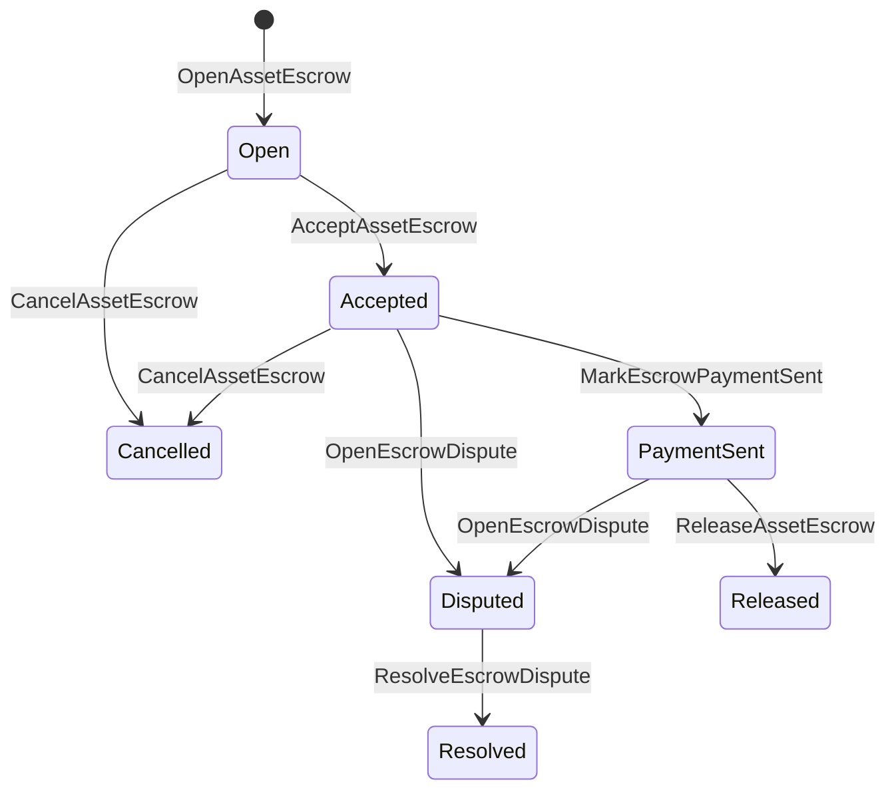

# Уугуул хөрөнгийн эскроу {#native-asset-escrow}

Өндөрлөгийн арилжааны натив эскроу нь тоон хөрөнгийн хувьд блокчейн бүртгэлийн хадгалалтын механизмын удирддаг хэлбэр юм. Хөрөнгийг програмын эзэмшдэг данс руу илгээхийн оронд, мөн түүн дээр тулгуурлахын оронд тэр дансыг хамгаалах өргөдлийн код, баталгаажсан ISIs утгыг тодорхой протокол хадгалалтын данс руу шилжүүлэх ба баталгаажлалтын амьдралын мөчүүдийг дэлхийн төлөвт бүртгэх.

Танай зах зээлийн санхүүгийн гүйлгээний шийдвэрлэлийг нутгийн эскроу ашиглах, Aitai загварын хэв шинжийн төлбөрийн зохицуулалт, үе шатны түгжээ, блокчэйн бүртгэлийн амьдралын мөчлөгийн төлөвт харагдах шаардлагатай хамгаалагдсан эскроу ажлын урсгалууд.

## Өгүүлэмжүүд {#concepts}

|Түвшин|Тайлбар|
| --- | --- |
| `EscrowId` |клиент сонгосон, криптографийн хэш ороосон таньж мэдэгдэх тэмдэгт хүсэж байна. Энэ нь ил тод ба нэрээ нууцалсан хадгаламжуудад давхцахгүй байх ёстой.|
| `AssetEscrowRecord` | Ил тод тоон хөрөнгийн хадгаламж эсвэл түгжээний бичлэг.|
| `AnonymousAssetEscrowRecord` | Nullifier, амлалт болон нотолгооны хавсралтаар баталгаажсан хамгаалалттай эскроугийн бүртгэл. |
|Хадгаламжийн данс|Гинжний ID, хадгалах ID, болон хөрөнгийн тодорхойлолтоос гаралтай тодорхойлогдсон протоколын данс.|
|Баримт нотолгооны криптографийн хэшүүд|Нотлох баримтыг криптографийн хэш нь нэхэмжлэл, шийдвэр, зурвас, хадгалалтын техникийн тайлан, эсвэл бусад гадаадлалт нотлох баримтыг тодорхойлох боломжтой. Нотлох баримтын агуулга нь эскроу бүртгэлд хадгалагддаггүй.|

Тунгалаг бичиг баримт нь худалдагч, сонголтоор худалдан авагч, хөрөнгийн тодорхойлолт, нийт дүн, хадгалалтын данс, амьдралын мөчлөгийн статус, зан үйл төрлийг, үлдсэн дүнг, сонголтоор гаргах эрхийн үндэслэл, сонголтоор хүчин төгөлдөр хугацааны тэмдэг, нотолгооны криптографын хэшүүд, цаг хугацааны тэмдэг, мөн сонголтоор шийдвэрлэлийн дэлгэрэнгүй мэдээллийг агуулна.

Эскроуны дүн нь эерэг тоон хөрөнгө байх ёстой бөгөөд хөрөнгийн тодорхойлолтын тоон үзүүлэлттэй нийцсэн байх шаардлагатай. Эскроу эсвэл түгжээг идэвхтэй байхад ерөнхий хөрөнгө шилжүүлэлтүүд хадгалалтын дансыг хоослох боломжгүй; хадгалалтын гарах замууд нь доор тайлбарласан эскроу ISIs юм.

## Зах зээлийн итгэмжлэгдсэн хадгаламж {#marketplace-escrow}

Зах зээлийн эскроу нь гадаад төлбөр эсвэл хүргэлтийн ажлын урсгалтай хамт блокчэйн дэх хөрөнгийг гаргах үйл явцыг зохицуулдаг.



| ISI |Энийг хэн ирүүлдэг вэ|Нөлөө|
| --- | --- | --- |
| `OpenAssetEscrow` |Худалдагч|Худалдагчийн тоон хөрөнгийг протоколын хадгалалтанд түгжиж, `Open` зах зээлийн бүртгэлийг үүсгэнэ.|
| `AcceptAssetEscrow` |Худалдан авагч|Худалдан авагчаас бүртгэж, `Open`-г `Accepted` руу шилжүүлнэ. Худалдагч өөрийн зуучлалын дансыг хүлээн авч чадахгүй.|
| `MarkEscrowPaymentSent` |Хүлээн авсан худалдан авагч|Худалдан авагч офф-чейн төлбөрийг илгээсний дараа `Accepted`-ийг `PaymentSent` руу шилжүүлнэ.|
| `ReleaseAssetEscrow` |Худалдагч| `PaymentSent`-г `Released`-рүү шилжүүлж, бүрэн хадгаламжийн дүнг худалдан авагчаар дамжуулдаг.|
| `CancelAssetEscrow` |Худалдагч|Төлбөр тэмдэглэгдэхээс өмнө `Open` эсвэл `Accepted`-ийг `Cancelled` руу шилжүүлж, худалдагчид буцаан төлбөрлөнө.|
| `OpenEscrowDispute` |Худалдаачин эсвэл хүлээн зөвшөөрөгдсөн худалдан авагч| `Accepted` эсвэл `PaymentSent`-ийг `Disputed` руу шилжүүлж, нотлох баримтын криптографийн хэшийг нэмнэ.|
| `ResolveEscrowDispute` |Данс `CanResolveEscrowDispute`-тай| `Disputed`-г `Resolved` руу шилжүүлж, мөнгийг худалдагч ба худалдан авагчийн хооронд хуваана.|

Маргаан шийдвэрлэх хэмжээ нь сөрөг бус байх ёстой бөгөөд `buyer_amount + seller_amount` нь хадгаламжийн хэмжээнд тэнцүү байх ёстой. Тэг утгатай санхүүгийн шилжүүлгийн хэсгүүдийг зөвшөөрөх боловч бүхэл бүтэн хуваалт нь түгжигдсэн үлдэгдлийг хамрах ёстой.

### Rust Жишээ {#rust-example}

Энэ жишээ нь борлуулагч ба худалдан авагчийн дансууд аль хэдийн бий гэсэн таамаглалтай, хөрөнгийн тодорхойлолт тоон хэлбэрээр бүртгэгдсэн, мөн борлуулагчийн үлдэгдэл хангалттай байгаа гэж үздэг.

```rust
use iroha::{
    client::Client,
    data_model::{
        isi::escrow::{
            AcceptAssetEscrow, MarkEscrowPaymentSent, OpenAssetEscrow,
            ReleaseAssetEscrow,
        },
        prelude::*,
    },
};
use iroha_crypto::Hash;

fn release_marketplace_escrow(
    seller_client: &Client,
    buyer_client: &Client,
    asset_definition_id: AssetDefinitionId,
) -> eyre::Result<()> {
    let escrow_id = EscrowId::new(Hash::new("docs-marketplace-escrow-001"));

    seller_client.submit_blocking(OpenAssetEscrow::with_evidence_hashes(
        escrow_id,
        asset_definition_id,
        Numeric::from(40_u64),
        vec![Hash::new("invoice:2026-001")],
    ))?;

    buyer_client.submit_blocking(AcceptAssetEscrow::new(escrow_id))?;
    buyer_client.submit_blocking(MarkEscrowPaymentSent::new(escrow_id))?;
    seller_client.submit_blocking(ReleaseAssetEscrow::new(escrow_id))?;

    let record = seller_client.query_single(FindAssetEscrowById::new(escrow_id))?;
    assert_eq!(record.status, AssetEscrowStatus::Released);
    assert_eq!(record.remaining_amount, Numeric::zero());

    Ok(())
}
```

## Ерөнхий хөрөнгийн түгжээ {#generic-asset-locks}

Хөрөнгө түгжээнүүд нь ижил хадгалалтын бүртгэлийн төрлийг ашигладаг боловч тэд худалдагч-зорилтот санал биш юм. Тэд хөрөнгийг очих данс руу түгжиж, сонголтоор тусдаа хөрөнгийг татах эрхийг баталгаажуулах эрх бүхий этгээдийг шаарддаг.

| ISI |Энийг хэн ирүүлдэг вэ|Нөлөө|
| --- | --- | --- |
| `OpenAssetLock` |Эх данс|Эерэг дүнг түгжиж, зорьсон газрыг бичлэгийг худалдан авагч гэж тэмдэглэж, төлөвийг `Locked` болгон тохируулна.|
| `DrawdownAssetLock` |Гаргах зөвшөөрлийн гол этгээд, эсвэл гаргах зөвшөөрлийн гол этгээд тогтоогдоогүй тохиолдолд чиглэлийн газар|Үлдсэн хадгалалтыг хэсэгчлэн эсвэл бүхэлд нь очих газарт шилжүүлдэг.|
| `CancelAssetLock` |Түлхүүр онгойлгч|Идэвхтэй түгжээг цуцалж, үлдсэн мөнгийг нээсэн хүнд буцаана.|
| `ExpireAssetLock` |Хугацаа дууссаны дараа ямар ч гүйлгээний зөвшөөрлийн үндсэн нөхцөл|Өнгөрсөн хугацаанд `expires_at_ms` гэсэн түгжээг дуусгаж, үлдсэн дүнг нээсэн хүнд буцааж өгнө.|

`DrawdownAssetLock` нь үлдсэн хэмжээ байхын хэрээр `Locked`-д бүртгэл хөтөлдөг. Үлдсэн хэмжээ тэглэгдэхэд, статус нь `DrawnDown` болж бүртгэл хаагдана.

```rust
use iroha::{
    client::Client,
    data_model::{
        isi::escrow::{CancelAssetLock, DrawdownAssetLock, ExpireAssetLock, OpenAssetLock},
        prelude::*,
    },
};
use iroha_crypto::Hash;

fn drawdown_and_close_asset_locks(
    opener_client: &Client,
    destination_client: &Client,
    release_authority_client: &Client,
    asset_definition_id: AssetDefinitionId,
    destination: AccountId,
    release_authority: AccountId,
) -> eyre::Result<()> {
    let trusted_lock_id = EscrowId::new(Hash::new("docs-asset-lock-trusted"));

    opener_client.submit_blocking(OpenAssetLock::with_options(
        trusted_lock_id,
        asset_definition_id.clone(),
        destination.clone(),
        Numeric::from(40_u64),
        Some(release_authority),
        None,
        vec![Hash::new("milestone-plan-v1")],
    ))?;

    release_authority_client.submit_blocking(DrawdownAssetLock::new(
        trusted_lock_id,
        Numeric::from(15_u64),
    ))?;

    let partially_drawn =
        opener_client.query_single(FindAssetEscrowById::new(trusted_lock_id))?;
    assert_eq!(partially_drawn.status, AssetEscrowStatus::Locked);
    assert_eq!(partially_drawn.remaining_amount, Numeric::from(25_u64));

    opener_client.submit_blocking(CancelAssetLock::new(trusted_lock_id))?;
    let cancelled = opener_client.query_single(FindAssetEscrowById::new(trusted_lock_id))?;
    assert_eq!(cancelled.status, AssetEscrowStatus::Cancelled);

    let expiring_lock_id = EscrowId::new(Hash::new("docs-asset-lock-expiring"));
    opener_client.submit_blocking(OpenAssetLock::with_options(
        expiring_lock_id,
        asset_definition_id,
        destination,
        Numeric::from(10_u64),
        None,
        Some(0),
        Vec::new(),
    ))?;

    destination_client.submit_blocking(ExpireAssetLock::new(expiring_lock_id))?;
    let expired = opener_client.query_single(FindAssetEscrowById::new(expiring_lock_id))?;
    assert_eq!(expired.status, AssetEscrowStatus::Expired);

    Ok(())
}
```

Python одоогоор ерөнхий түлхүүрийн хувьд өндөр түвшний туслах функцуудыг ил болгож байна: `open_asset_lock`, `drawdown_asset_lock`, `cancel_asset_lock`, ба `expire_asset_lock`. Маркетплейс болон Python-аас авсан нэргүй хадгаламжийн хувьд, нэг протокол-стандарт `InstructionBox` JSON-ийг SDK-ын JSON гарцын хаалгаар ашиглах, эсвэл анхан шатны нөөц баригчдыг ил гаргадаг SDK-оор дамжуулан илгээх.

## Маргаан {#disputes}

Зах зээлийн зуучлал `Accepted` эсвэл `PaymentSent`-ээс маргаан үүсгэж болно. Зөвхөн бүртгэлтэй худалдаачин эсвэл худалдан авагч л маргаан нээж болох юм. Маргааны шийдэл нь `CanResolveEscrowDispute`-ыг шаарддаг бөгөөд үүнийг шууд шийдвэрлэгчийн дансанд олгох эсвэл үүргээс удамшуулан авах боломжтой.

```rust
use iroha::{
    client::Client,
    data_model::{
        isi::escrow::{OpenEscrowDispute, ResolveEscrowDispute},
        prelude::*,
    },
};
use iroha_crypto::Hash;
use iroha_executor_data_model::permission::escrow::CanResolveEscrowDispute;

fn resolve_disputed_escrow(
    admin_client: &Client,
    buyer_client: &Client,
    court_client: &Client,
    court: AccountId,
    escrow_id: EscrowId,
) -> eyre::Result<()> {
    admin_client.submit_blocking(Grant::account_permission(
        Permission::from(CanResolveEscrowDispute),
        court,
    ))?;

    buyer_client.submit_blocking(OpenEscrowDispute::with_evidence_hashes(
        escrow_id,
        vec![Hash::new("buyer-payment-receipt")],
    ))?;

    court_client.submit_blocking(ResolveEscrowDispute::with_evidence_hashes(
        escrow_id,
        Numeric::from(30_u64),
        Numeric::from(10_u64),
        vec![Hash::new("court-judgement-001")],
    ))?;

    let record = admin_client.query_single(FindAssetEscrowById::new(escrow_id))?;
    assert_eq!(record.status, AssetEscrowStatus::Resolved);
    assert_eq!(
        record.resolution.as_ref().map(|resolution| resolution.buyer_amount.clone()),
        Some(Numeric::from(30_u64)),
    );

    Ok(())
}
```

## Нэргүй итгэмжлэгдсэн данс {#anonymous-escrow}

Нэргүй эскроу нь зах зээлийн ижил амьдралын мөчлөгийг ашигладаг ч санхүүжилт болон хаалтын хөрөнгийн шилжүүлэг нь хамгаалалттай байна. Нийтийн бүртгэлд худалдагч, худалдан авагч, төлөв, нотлох баримтын хэш, цагийн тэмдэг болон нотолгоотой холбогдсон шилжилтийн бүртгэл хадгалагдана. Хамгаалалттай тэмдэглэл доторх дүн ба хүлээн авагчийг криптографийн амлалт, nullifier болон нотолгооны хавсралтаар төлөөлүүлнэ.

| Ил тод ISI |Нэргүй ISI|
| --- | --- |
| `OpenAssetEscrow` | `OpenAnonymousAssetEscrow` |
| `AcceptAssetEscrow` | `AcceptAnonymousAssetEscrow` |
| `MarkEscrowPaymentSent` | `MarkAnonymousEscrowPaymentSent` |
| `ReleaseAssetEscrow` | `ReleaseAnonymousAssetEscrow` |
| `CancelAssetEscrow` | `CancelAnonymousAssetEscrow` |
| `OpenEscrowDispute` | `OpenAnonymousEscrowDispute` |
| `ResolveEscrowDispute` | `ResolveAnonymousEscrowDispute` |

Төлбөрийн түрийвч эсвэл нотлох хэрэгслийн хэрэгсэл нь нотлох баримтын хавсралт болон олон нийтэд зориулсан оруулалтыг бүтээх ёстой. Нээх нь нэг зуучлалын криптографын баталгааны утгыг үүсгэдэг. Гаргах, цуцлах, мөн нэрээ нууцалсан маргаан шийдвэрлэхэд яг нэг криптографийн баталгааны үнийг зарцуулах ёстой бөгөөд үйлдлийг хэрэгжүүлэхэд шаардлагатай худалдан авагч, худалдагч, эсвэл хуваасан гаралтын криптографийн баталгааны утгуудыг үүсгэх ёстой.

```rust
use iroha::{
    client::Client,
    data_model::{
        isi::escrow::{
            AcceptAnonymousAssetEscrow, MarkAnonymousEscrowPaymentSent,
            OpenAnonymousAssetEscrow,
        },
        prelude::*,
        proof::ProofAttachment,
    },
};
use iroha_crypto::Hash;

fn open_anonymous_escrow(
    seller_client: &Client,
    buyer_client: &Client,
    escrow_id: EscrowId,
    asset_definition_id: AssetDefinitionId,
    funding_nullifiers: Vec<[u8; 32]>,
    escrow_commitment: [u8; 32],
    proof: ProofAttachment,
    root_hint: Option<[u8; 32]>,
) -> eyre::Result<()> {
    seller_client.submit_blocking(OpenAnonymousAssetEscrow::with_evidence_hashes(
        escrow_id,
        asset_definition_id,
        funding_nullifiers,
        escrow_commitment,
        proof,
        root_hint,
        vec![Hash::new("shielded-invoice")],
    ))?;

    buyer_client.submit_blocking(AcceptAnonymousAssetEscrow::new(escrow_id))?;
    buyer_client.submit_blocking(MarkAnonymousEscrowPaymentSent::new(escrow_id))?;

    Ok(())
}
```

Доорх хамгаалагдсан гүйлгээний загварыг үзнэ үү: [Нэргүй гүйлгээ](/mn/blockchain/anonymous-transactions.md).

## SDK Ашиглалт {#sdk-usage}

Эскроу дэмжлэг SDKs дээр өөр өөрөөр илэрдэг. Rust нь нэг протокол стандарттай төрөлжсөн өгөгдлийн загвартай. Python одоогоор ерөнхий хөрөнгө түгжих туслах хэрэгслүүдийг ил болгож байна. JavaScript ба TypeScript нь Kotodama эскроу хост-функцийн дуудлагыг ашигладаг. Kotlin/JVM ба Swift нь зах зээл болон нэргүй эскроугийн зориулалттай төрөлжүүлсэн өгөгдөл үүсгэгчийг өгдөг.

| SDK |Энэ гадаргыг ашигла|Хүчин чадал|
| --- | --- | --- |
| [Rust](#rust-sdk) | `iroha::data_model::isi::escrow` |Зах зээлийн итгэмжлэл, ерөнхий түгжигчид, нэргүй итгэмжлэл, асуултууд, ба үйл явдлууд.|
| [Python](#python-asset-locks) | `Instruction.open_asset_lock`, `TransactionDraft.open_asset_lock`, ба үйлчлүүлэгч `*_and_wait` туслагчид |Ердийн хөрөнгө барьцаанууд. Худалдааны талбай болон нэргүй зуучлалын туслахууд одоогоор анхны зэрэгийн Python аргачлал биш байна.|
| [JavaScript / TypeScript](#javascript-and-typescript-kotodama) | `compileKotodamaProgram` - `@iroha/iroha-js/kotodama-compiler` | Kotodama гэрээний дотор Escrow хост-функцийн дуудлагууд.|
| [Kotlin / JVM](#kotlin-and-jvm) |`InstructionTemplate` ангиуд `org.hyperledger.iroha.sdk.core.model.instructions` дотор|Зах зээл болон нэрээ нууцлах хадгалах захиалгын тусгай зааврын загварууд.|
| [Swift / iOS](#swift-and-ios) |`NativeEscrowInstructionBuilders` ба `IrohaSDK.build*Escrow*` туслахууд|Зах зээл ба нэргүй хадгаламжийн Norito JSON зааварчилгааны өгөгдлүүд.|

Доорх жишээнүүд зааварчилгааны бүтэц дээр төвлөрнө. Дансны санхүүжилт, гарын үсэг удирдах, гүйлгээ хийх нь тус бүрийн SDK энгийн урсгалыг дагана.

### Rust SDK {#rust-sdk}

Бүрэн нутгийн хамгаалалт эсвэл асуулт/үйл явдлын дэмжлэг хэрэгтэй бол Rust SDK хэрэглэнэ үү. Дээрх жишээнүүд нь зах зээлийн нээгдэлт, ерөнхий түгжээ буцаан таталт, маргаан шийдвэрлэх, мөн `iroha::data_model::isi::escrow`-той нэрээ нууцлах хадгалах бүтээцийг харуулж байна.

```rust
use iroha::{
    client::Client,
    data_model::{isi::escrow::OpenAssetEscrow, prelude::*},
};
use iroha_crypto::Hash;

fn open_and_read(
    client: &Client,
    asset_definition_id: AssetDefinitionId,
) -> eyre::Result<AssetEscrowRecord> {
    let escrow_id = EscrowId::new(Hash::new("docs-rust-sdk-escrow"));

    client.submit_blocking(OpenAssetEscrow::new(
        escrow_id,
        asset_definition_id,
        Numeric::from(10_u64),
    ))?;

    client.query_single(FindAssetEscrowById::new(escrow_id))
}
```

### Python Хөрөнгийн түгжээ {#python-asset-locks}

Python SDK нь ерөнхий хөрөнгийн түгжээний хувьд анхны зэрэглэлийн туслахуудыг иллэрүүлдэг. Үүнийг мөчлөгийн төлбөр, гаргалтын эрх бүхий голоор дуудаж авах, нээсэн этгээдээр цуцлах, хугацаа дууссаны буцаан олголтод ашиглаарай.

```python
client.open_asset_lock_and_wait(
    chain_id="dev-chain",
    authority="<source-account-id>",
    private_key_hex="<source-private-key-hex>",
    escrow_id="merchant-lock-001",
    asset_definition_id="<asset-definition-base58>",
    destination="<destination-account-id>",
    amount="2500",
    release_authority="<trusted-release-account-id>",
    expires_at_ms=1_704_000_000_000,
)

client.drawdown_asset_lock_and_wait(
    chain_id="dev-chain",
    authority="<trusted-release-account-id>",
    private_key_hex="<trusted-release-private-key-hex>",
    escrow_id="merchant-lock-001",
    amount="1000",
)

client.expire_asset_lock_and_wait(
    chain_id="dev-chain",
    authority="<any-account-id>",
    private_key_hex="<any-private-key-hex>",
    escrow_id="merchant-lock-001",
)
```

Хоёр талт түгжээгээр хийхдээ `release_authority`-ийг орхино; дараа нь хүлээн авагч данс нь `drawdown_asset_lock`-ийг илгээгээрэй.

### JavaScript ба TypeScript Kotodama {#javascript-and-typescript-kotodama}

JavaScript SDK нь одоогоор шууд нутгийн зуучлалын гүйлгээ бүтээх үйлчилгээ үзүүлдэггүй. JavaScript эсвэл TypeScript програмуудын хувьд Kotodama гэрээг байрлуулдаг бол зуучлалын host-function дуудлагыг Kotodama компайлераар бүрдүүлээрэй.

Эндэхийн эскроу хост-функцийн дуудах үед компилятор нь харанхуй эскроуд зориулсан нарийн хандалтын багцыг олох боломжгүй учир тодорхой хандалтын заавар шаардлагатай байдаг ISIs. Техникийн дуудах `escrow_*` хэрэгслүүдэд зориулсан экспортлогдсон орцонд wildcard заавар ашиглаарай.

```js
import { compileKotodamaProgram } from "@iroha/iroha-js/kotodama-compiler";

const source = `
seiyaku MarketplaceEscrow {
  meta { abi_version: 1; }

  #[access(read="*", write="*")]
  kotoage fn run() permission(Admin) {
    let asset = asset_definition("62Fk4FPcMuLvW5QjDGNF2a4jAmjM");
    let offer = name("aitai_offer");
    let evidence = norito_bytes("00");

    call escrow_open_offer(offer, asset, 10, evidence);
    call escrow_accept(offer);
    call escrow_mark_payment_sent(offer);
    call escrow_release(offer);
  }
}
`;

const compiled = compileKotodamaProgram(source, {
  sourceName: "escrow.ko",
});

if (compiled.diagnostics.length > 0) {
  throw new Error(compiled.diagnostics.map((item) => item.message).join("\n"));
}
```

Маргааныг шийдвэрлэхэд `escrow_open_dispute(offer, evidence)` болон `escrow_resolve_dispute(offer, buyer_amount, seller_amount, evidence)`-ийг ашиглана уу. Нэргүй хадгаламжийн сервер функц дуудах нь Norito хүсэлтийн өгөгдлийн байтуудыг хүлээн авдаг, жишээ нь `anonymous_escrow_open_offer(request)`.

### Kotlin ба JVM {#kotlin-and-jvm}

Kotlin/JVM SDK загварууд төрөлх хадгаламжийг захиалгат зааврын загварууд болгон дүрслэдэг. Тус бүрийн загвар шаардлагатай талбарыг баталгаажуулж, гүйлгээний бүтээгчээр ашигладаг нэг протокол-стандарт аргументийн газрын зурагт нээлттэй болгодог.

```kotlin
import org.hyperledger.iroha.sdk.core.model.escrow.NativeEscrowPermissions
import org.hyperledger.iroha.sdk.core.model.instructions.AcceptAssetEscrowInstruction
import org.hyperledger.iroha.sdk.core.model.instructions.MarkEscrowPaymentSentInstruction
import org.hyperledger.iroha.sdk.core.model.instructions.OpenAssetEscrowInstruction
import org.hyperledger.iroha.sdk.core.model.instructions.ReleaseAssetEscrowInstruction
import org.hyperledger.iroha.sdk.core.model.instructions.ResolveEscrowDisputeInstruction

val open = OpenAssetEscrowInstruction(
    escrowId = "escrow-hash",
    assetDefinition = "xor#wonderland",
    amount = "42.5",
    evidenceHashes = listOf("invoice-hash"),
)
val accept = AcceptAssetEscrowInstruction("escrow-hash")
val paid = MarkEscrowPaymentSentInstruction("escrow-hash")
val release = ReleaseAssetEscrowInstruction("escrow-hash")
val resolve = ResolveEscrowDisputeInstruction(
    escrowId = "escrow-hash",
    buyerAmount = "30",
    sellerAmount = "12.5",
    evidenceHashes = listOf("judgement-hash"),
)

println(open.arguments)
println(NativeEscrowPermissions.CAN_RESOLVE_ESCROW_DISPUTE)
```

Нэргүй загваруудыг `OpenAnonymousAssetEscrowInstruction`, `AcceptAnonymousAssetEscrowInstruction`, `MarkAnonymousEscrowPaymentSentInstruction`, `ReleaseAnonymousAssetEscrowInstruction`, `CancelAnonymousAssetEscrowInstruction`, `OpenAnonymousEscrowDisputeInstruction`, болон `ResolveAnonymousEscrowDisputeInstruction` болгон ашиглаж болно. Android Java-г хүсэж буй клиентүүд нь Android бүтээмжээс тохирох `NativeEscrowInstructions.*` барилгачинуудыг ашиглаж болно.

### Swift ба iOS {#swift-and-ios}

Swift SDK нь Norito JSON payload-ууд болгон эскроу зааврыг бүрдүүлдэг. `NativeEscrowInstructionBuilders`-ийг шууд ашиглаарай, эсвэл таны аппликейшнд аль хэдийн `IrohaSDK` instance байгаа бол тэнцүү `IrohaSDK.build*Escrow*` туслахыг дуудаарай.

```swift
import IrohaSwift

let open = try NativeEscrowInstructionBuilders.openAssetEscrow(
    escrowId: "escrow-hash",
    assetDefinition: "xor#wonderland",
    amount: "42.5",
    evidenceHashes: ["invoice-hash"]
)
let accept = try NativeEscrowInstructionBuilders.acceptAssetEscrow(
    escrowId: "escrow-hash"
)
let paid = try NativeEscrowInstructionBuilders.markEscrowPaymentSent(
    escrowId: "escrow-hash"
)
let release = try NativeEscrowInstructionBuilders.releaseAssetEscrow(
    escrowId: "escrow-hash"
)
let resolve = try NativeEscrowInstructionBuilders.resolveEscrowDispute(
    escrowId: "escrow-hash",
    buyerAmount: "30",
    sellerAmount: "12.5",
    evidenceHashes: ["judgement-hash"]
)
```

Нэргүй Swift builder-үүд nullifier-ын жагсаалт, гаралтын амлалтын жагсаалт, нотолгооны dictionary болон сонголттой `rootHint` утгыг хүлээн авна. Маргаан шийдвэрлэгчийн зөвшөөрлийн токеныг `NativeEscrowPermissions.canResolveEscrowDispute`-оор авна.

## Асуултууд болон Үйл явдал {#queries-and-events}

Статусын хуудсууд, нийцлийн ажлууд, дэмжлэгийн хэрэгслүүдэд эскроу асуулгыг ашиглана уу:

|Асуулт|Зорилго|
| --- | --- |
| `FindAssetEscrowById` |Нэг тунгалаг хадгаламж эсвэл түгжээг `EscrowId`-аар уншина уу.|
| `FindAssetEscrows` | Ил тод зуучлал болон түгжигдсэн бүртгэлийг жагсаана уу. |
| `FindAssetEscrowsBySeller` |Худалдагч эсвэл түгжээ нээгчээс нээгдсэн бүртгэлүүдийг жагсаах.|
| `FindAssetEscrowsByBuyer` |Худалдан авагч хүлээн зөвшөөрсөн зах зээлийн түр итгэмжлэлийг жагсаах эсвэл зорилтот газарт чиглэсэн түгжээг жагсаах.|
| `FindAssetEscrowsByStatus` |Бичлэгүүдийг `AssetEscrowStatus`–аар жагсаана уу.|
| `FindAnonymousAssetEscrowById` |Нэг нэргүй хадгаламжийг `EscrowId`-аас уншина уу.|
| `FindAnonymousAssetEscrows*` |Бүх бүртгэл, худалдагч, худалдан авагч эсвэл статусын дагуу нэргүй эскроу жагсаах.|

`EscrowEventFilter` нь ил тод уугуул хадгаламж болон түгжих эвэнтүүдэд хадгаламжийн ID, худалдагч, худалдан авагч, төлөв, болон эвэнт-нэм маскаар захиалга өгөх боломжтой. Эвэнт гэр бүлд `Opened` ордог, `Accepted`, `PaymentSent`, `Released`, `Cancelled`, `Expired`, `Disputed`, ба `Resolved`. Нэрээ нууцлах хадгаламжийн бүртгэлүүдийг нэрээ нууцлах хадгаламжийн лавлагаагар шалгаж болно.

## Үйл ажиллагааны тэмдэглэл {#operational-notes}

- Том хэмжээний нэхэмжлэл, чатны тэмдэглэл, шийдвэрүүд эсвэл аудитын багцуудыг эскроу бичиглэлээс гадна хадгалж, тэдгээрийн криптографик хешийг нотолгоо болгон хавсаргаарай.
- Програмд тогтвортой `EscrowId` гаралтыг ашигла, ингэснээр дахин оролдлого нь ижил саналын хувьд давхардан хадгаламж үүсгэхгүй.
- Зөвхөн маргаан шийдвэрлэх үйл явцыг гүйцэтгэдэг данс эсвэл үүрэгт Grant `CanResolveEscrowDispute` олгоно.
- Гадны төлбөрийн баталгаажуулалтыг програмын бодлого гэж үзнэ үү. Iroha нь хадгалалт ба амьдралын мөчлөгийн шилжилтийг бүртгэдэг; үүнийгээ өөрөө бэлэн мөнгө эсвэл гадаад төлбөрийн сувгийг баталгаажуулахгүй.
