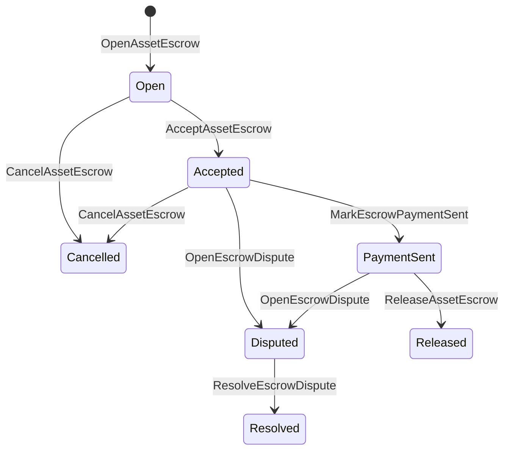

# Үндэсний хөрөнгийн хяналт {#native-asset-escrow}

Нэтив экшро нь тооны хөрөнгийн номоор хяналт тавих механизм юм.
Үүнээс гадна хөрөнгө оруулалтын хэрэгслийн өмчит дансанд дамжуулж,
тухайн дансыг хамгаалах хүсэлтний код, захиалга ISIs үнэ цэнийг а
тодорхойлох протоколын хяналтын тооцоо, хадгаламжийн амьдралын мөрийг бүртгэх
Дэлхийн улс төр.

Хөрөнгийн зах зээлийн төлбөр тооцооны хувьд эх орондоо хадгаламжтай, Атай загварын гадаадын төлбөрийг ашиглах
зохицуулалт, чухал ач холбогдолтой замбараагүй ажил хийх
Тодруулгын тоног төхөөрөмжээс харагдах амьдралын мөрийн байдал.

## Үндсэн ойлголтууд {#concepts}

| Үндсэн ойлголт | Тодруулбал |
| --- | --- |
| `EscrowId` | Зурагчийн сонгосон тодорхойлог нь хэшийг хамардаг. Энэ нь ил тод, нууцлан бүртгэгдсэн хадгаламж хооронд цорын ганц байх ёстой. |
| `AssetEscrowRecord` | Ашигт малтмалын ил тод санхүүгийн хадгаламж эсвэл гулгалтын бүртгэл. |
| `AnonymousAssetEscrowRecord` | Хөдөлмөрийн баталгаатай бүртгэл, үүрэг гүйцэтгэгч, гэрчилгээний хавсралт. |
| Хяналтын сан | Захиргаанаас үүдэлтэй тодорхойлох протоколын тооцоо ID, Хөдөлмөрийн сан ID, ба активын тодорхойлолт. |
| Мэдээллийн хашис | Бусвар, шүүх хуралдаан, мэдээ, хадгаламжийн манфист эсвэл бусад гарын үсэггүй баримт. |

Ил тод бүртгэл нь борлуулагч, сонгодог худалдан авагч, хөрөнгийн тодорхойлолт,
Нийт хэмжээ, хадгаламжийн данс, амьдралын мөрийн байдал, заншил, үлдсэн
хэмжээ, сонголттой чөлөөлөх эрх мэдэл, сонголттай дуусгалын хугацаа, гэрчилгээ
хэш, цаг хугацааны тэмдэг, сонголттой шийдвэрлэлийн дэлгэрэнгүй мэдээлэл.

Хөдөлмөрийн санхүүжилтийн хэмжээ нь санхүүгийн хөрөнгөний тооны эерэг хэмжээ байх ёстой бөгөөд
хөрөнгийн тодорхойлолтын тооны онцлог.
нийтлэг хөрөнгийн шилжүүлэн суулгах нь хадгаламжны дансыг цэвэрлэх боломжгүй; хадгаламжийн гарах
Залуудыг хадгаламж гэж үздэг. ISIs доор заасан.

## Хөрөнгийн зах зээлийн хяналт {#marketplace-escrow}

Зах зээлийн захиалгаар зах зээлийн зах зээлээс гадуур үйл ажиллагаа явуулдаг
төлбөрийн болон хүргэх ажлын урсгал.



| ISI | Хэн үүнийг өргөн мэдүүлнэ | Үр дүн |
| --- | --- | --- |
| `OpenAssetEscrow` | Худалтан | Протоколын хяналтад суугаа худалдааны санхүүгийн хөрөнгөг хааж, `Open` зах зээлийн дээд амжилт. |
| `AcceptAssetEscrow` | Худалдан авагч | Худалдан авагчийг бүртгэж, хөдөлгөөн `Open` . `Accepted`. Худалцуулагч өөрийн захиалгыг хүлээн зөвшөөрөхгүй. |
| `MarkEscrowPaymentSent` | Худалдан авсан худалдан авагч | Хөдөлмөр `Accepted` . `PaymentSent` худалдан авагч гарын үсэгт төлбөрийг илгээсний дараа. |
| `ReleaseAssetEscrow` | Худалтан | Хөдөлмөр `PaymentSent` . `Released` болон худалдан авагчдаа бүрэн хадгаламж олгодог. |
| `CancelAssetEscrow` | Худалтан | Хөдөлмөр `Open` эсвэл `Accepted` . `Cancelled` төлбөрийг тэмдэглэхээс өмнө худалдан авагчдаа буцааж өгөх. |
| `OpenEscrowDispute` | Худаллагч эсвэл хүлээн зөвшөөрөгдсөн худалдан авагч | Хөдөлмөр `Accepted` эсвэл `PaymentSent` . `Disputed` Мөн гэрчилгээний хэшиг нэмнэ. |
| `ResolveEscrowDispute` | Хэтгэлэг `CanResolveEscrowDispute` | Хөдөлмөр `Disputed` . `Resolved` худалдан авагч болон борлуулагчийн хооронд хувааж байна. |

Шүүхийн шийдвэрлэх хэмжээ нь сөрөг үзүүлэлтгүй байх ёстой бөгөөд
`buyer_amount + seller_amount` Хөдөлмөрийн төлбөрийн хэмжээтэй тэнцэх ёстой.
хөл нь зөвшөөрөгдсөн боловч цогц хуваагдал нь хаагдсан тэнцвэрт байдлыг хангах ёстой.

### Rust Жишээлбэл {#rust-example}

Энэ жишээ нь худалдагч, худалдан авагчдын данс аль хэдийн бий, хөрөнгө
тодорхойлолт нь тооны хувьд бүртгэгдсэн бөгөөд борлуулагч хангалттай тэнцвэртэй байна.

```rust
use iroha::{
    client::Client,
    data_model::{
        isi::escrow::{
            AcceptAssetEscrow, MarkEscrowPaymentSent, OpenAssetEscrow,
            ReleaseAssetEscrow,
        },
        prelude::*,
    },
};
use iroha_crypto::Hash;

fn release_marketplace_escrow(
    seller_client: &Client,
    buyer_client: &Client,
    asset_definition_id: AssetDefinitionId,
) -> eyre::Result<()> {
    let escrow_id = EscrowId::new(Hash::new("docs-marketplace-escrow-001"));

    seller_client.submit_blocking(OpenAssetEscrow::with_evidence_hashes(
        escrow_id,
        asset_definition_id,
        Numeric::from(40_u64),
        vec![Hash::new("invoice:2026-001")],
    ))?;

    buyer_client.submit_blocking(AcceptAssetEscrow::new(escrow_id))?;
    buyer_client.submit_blocking(MarkEscrowPaymentSent::new(escrow_id))?;
    seller_client.submit_blocking(ReleaseAssetEscrow::new(escrow_id))?;

    let record = seller_client.query_single(FindAssetEscrowById::new(escrow_id))?;
    assert_eq!(record.status, AssetEscrowStatus::Released);
    assert_eq!(record.remaining_amount, Numeric::zero());

    Ok(())
}
```

## Женерийн хөрөнгийн замбарууд {#generic-asset-locks}

Ашигт малтмалын нууц нь мөн адил хадгаламжийн бүртгэлийн хэлбэрээр ашигладаг боловч худалдан авагч, борлуулагч биш
санал болгодог. Тэд төлбөрийн санхүүжилтийг
хөрөнгийг гаргах эрх мэдлийг тусгаарлах.

| ISI | Хэн үүнийг өргөн мэдүүлнэ | Үр дүн |
| --- | --- | --- |
| `OpenAssetLock` | Эх сурвалжийн данс | Эерэг хэмжээг хааж, зорилтот газрыг захиалгын худалдан авагч болгон бүртгэж, статусыг `Locked`. |
| `DrawdownAssetLock` | Хөрөнгө оруулалтын эрх мэдэл, эсвэл хаягдлын эрх мэдэлгүй тохиолдолд | Үлдсэн хаалганы хэсгийг эсвэл бүхэлдээ газарт шилжүүлнэ. |
| `CancelAssetLock` | Хаалтын нээгч | Ажилтай замбарыг хүчингүй болгож, үлдсэн хэмжээг нээгчэд буцааж өгдөг. |
| `ExpireAssetLock` | Захиргааны эрх баригч | Үндсэн хуулийн заалтыг `expires_at_ms` өмнө нь хийсэн мөнгийг нээгчдэд буцааж өгдөг. |

`DrawdownAssetLock` бичиг баримтыг хадгалдаг `Locked` Зарим хэмжээгээр үлдсэн байх.
Үлдсэн хэмжээ нь нургаар хүрч, статусууд `DrawnDown` болон
Тодруулгыг хааж байна.

```rust
use iroha::{
    client::Client,
    data_model::{
        isi::escrow::{CancelAssetLock, DrawdownAssetLock, ExpireAssetLock, OpenAssetLock},
        prelude::*,
    },
};
use iroha_crypto::Hash;

fn drawdown_and_close_asset_locks(
    opener_client: &Client,
    destination_client: &Client,
    release_authority_client: &Client,
    asset_definition_id: AssetDefinitionId,
    destination: AccountId,
    release_authority: AccountId,
) -> eyre::Result<()> {
    let trusted_lock_id = EscrowId::new(Hash::new("docs-asset-lock-trusted"));

    opener_client.submit_blocking(OpenAssetLock::with_options(
        trusted_lock_id,
        asset_definition_id.clone(),
        destination.clone(),
        Numeric::from(40_u64),
        Some(release_authority),
        None,
        vec![Hash::new("milestone-plan-v1")],
    ))?;

    release_authority_client.submit_blocking(DrawdownAssetLock::new(
        trusted_lock_id,
        Numeric::from(15_u64),
    ))?;

    let partially_drawn =
        opener_client.query_single(FindAssetEscrowById::new(trusted_lock_id))?;
    assert_eq!(partially_drawn.status, AssetEscrowStatus::Locked);
    assert_eq!(partially_drawn.remaining_amount, Numeric::from(25_u64));

    opener_client.submit_blocking(CancelAssetLock::new(trusted_lock_id))?;
    let cancelled = opener_client.query_single(FindAssetEscrowById::new(trusted_lock_id))?;
    assert_eq!(cancelled.status, AssetEscrowStatus::Cancelled);

    let expiring_lock_id = EscrowId::new(Hash::new("docs-asset-lock-expiring"));
    opener_client.submit_blocking(OpenAssetLock::with_options(
        expiring_lock_id,
        asset_definition_id,
        destination,
        Numeric::from(10_u64),
        None,
        Some(0),
        Vec::new(),
    ))?;

    destination_client.submit_blocking(ExpireAssetLock::new(expiring_lock_id))?;
    let expired = opener_client.query_single(FindAssetEscrowById::new(expiring_lock_id))?;
    assert_eq!(expired.status, AssetEscrowStatus::Expired);

    Ok(())
}
```

Python одоогийн байдлаар генирийн замбарын өндөр түвшний туслагчдыг илрүүлж байна:
`open_asset_lock`, `drawdown_asset_lock`, `cancel_asset_lock`, болон
`expire_asset_lock`. Хөрөнгийн газар болон үл тодруулсан хадгаламж Python, хэрэглээ
Каноникийн `InstructionBox` JSON . SDK Энэ бол JSON Уурхдаг ёс, эсвэл хүлээлгэх
. SDK Энэ нь нэгдүгээр зэргийн хадгаламжийн бүтээн байгуулагчдыг илрүүлж байна.

## Сөрөгдөл {#disputes}

Зах зээл дээр хадгаламжлах нь маргааныг үүсгэх боломжтой `Accepted` эсвэл `PaymentSent`.
Зөвхөн бүртгэлтэй худалдагч эсвэл худалдан авагч нь маргаан нээж болно.
`CanResolveEscrowDispute`, эсвэл шийдвэрлэх бүртгэлэд шууд олгогдсон
эсвэл үүрэг гүйцэтгэхээр өвлөн авсан.

```rust
use iroha::{
    client::Client,
    data_model::{
        isi::escrow::{OpenEscrowDispute, ResolveEscrowDispute},
        prelude::*,
    },
};
use iroha_crypto::Hash;
use iroha_executor_data_model::permission::escrow::CanResolveEscrowDispute;

fn resolve_disputed_escrow(
    admin_client: &Client,
    buyer_client: &Client,
    court_client: &Client,
    court: AccountId,
    escrow_id: EscrowId,
) -> eyre::Result<()> {
    admin_client.submit_blocking(Grant::account_permission(
        Permission::from(CanResolveEscrowDispute),
        court,
    ))?;

    buyer_client.submit_blocking(OpenEscrowDispute::with_evidence_hashes(
        escrow_id,
        vec![Hash::new("buyer-payment-receipt")],
    ))?;

    court_client.submit_blocking(ResolveEscrowDispute::with_evidence_hashes(
        escrow_id,
        Numeric::from(30_u64),
        Numeric::from(10_u64),
        vec![Hash::new("court-judgement-001")],
    ))?;

    let record = admin_client.query_single(FindAssetEscrowById::new(escrow_id))?;
    assert_eq!(record.status, AssetEscrowStatus::Resolved);
    assert_eq!(
        record.resolution.as_ref().map(|resolution| resolution.buyer_amount.clone()),
        Some(Numeric::from(30_u64)),
    );

    Ok(())
}
```

## Аноним хяналт тавих {#anonymous-escrow}

Анонимны захиалгаар зах зээлийн амьдралын мөрийг ашигладаг, гэхдээ санхүүжилт болон
Нийтийн бүртгэл нь худалдагчдыг хадгалдаг.
худалдан авагч, байдал, баримтын хэшүүд, цаг хугацааны тэмдэг, баталгаатай холбоотой хөдөлгөөн
Сэтгэлэгт тэмдэгтийн доторх хэмжээ, хүлээн авагчдыг:
Зохиол, хүчингүй болгох болон баталгааны хавсралт.

| Ил тод ISI | Аноним ISI |
| --- | --- |
| `OpenAssetEscrow` | `OpenAnonymousAssetEscrow` |
| `AcceptAssetEscrow` | `AcceptAnonymousAssetEscrow` |
| `MarkEscrowPaymentSent` | `MarkAnonymousEscrowPaymentSent` |
| `ReleaseAssetEscrow` | `ReleaseAnonymousAssetEscrow` |
| `CancelAssetEscrow` | `CancelAnonymousAssetEscrow` |
| `OpenEscrowDispute` | `OpenAnonymousEscrowDispute` |
| `ResolveEscrowDispute` | `ResolveAnonymousEscrowDispute` |

Номын сангийн болон шалгалтын хэрэгсэл нь баталгааны хавсралт болон олон нийтийн өгөгдлийг бүтээх ёстой.
Нээлт нь нэг гарын үсэгт үүргийг бий болгодог.
маргааныг шийдвэрлэхэд яг нэг халамжийн үүрэг гүйцэтгэх
үйл ажиллагааны дагуу худалдан авагч, борлуулагч эсвэл хуваагдсан үр дүнгийн үүрэг гүйцэтгэгч.

```rust
use iroha::{
    client::Client,
    data_model::{
        isi::escrow::{
            AcceptAnonymousAssetEscrow, MarkAnonymousEscrowPaymentSent,
            OpenAnonymousAssetEscrow,
        },
        prelude::*,
        proof::ProofAttachment,
    },
};
use iroha_crypto::Hash;

fn open_anonymous_escrow(
    seller_client: &Client,
    buyer_client: &Client,
    escrow_id: EscrowId,
    asset_definition_id: AssetDefinitionId,
    funding_nullifiers: Vec<[u8; 32]>,
    escrow_commitment: [u8; 32],
    proof: ProofAttachment,
    root_hint: Option<[u8; 32]>,
) -> eyre::Result<()> {
    seller_client.submit_blocking(OpenAnonymousAssetEscrow::with_evidence_hashes(
        escrow_id,
        asset_definition_id,
        funding_nullifiers,
        escrow_commitment,
        proof,
        root_hint,
        vec![Hash::new("shielded-invoice")],
    ))?;

    buyer_client.submit_blocking(AcceptAnonymousAssetEscrow::new(escrow_id))?;
    buyer_client.submit_blocking(MarkAnonymousEscrowPaymentSent::new(escrow_id))?;

    Ok(())
}
```

Үндсэн хамгаалалттай гүйлгээний загварын тухай үзнэ үү
[Аноним бүтээн байгуулалтууд](/mn/blockchain/anonymous-transactions.md).

## SDK Хэрэглээ {#sdk-usage}

Хөдөлмөрийн санхүүжилт SDKs. Rust .
Мэдээллийн загварыг хэвлүүлсэн. Python Одоогийн байдлаар нийтлэг хөрөнгийн буцалтгүй тусламжаар халддаг.
JavaScript болон TypeScript хэрэглээ Kotodama Хөдөлмөрийн хөтлөгчтэй харилцах. Kotlin/JVM болон Swift
зах зээлийн хэрэглээний ачаа барьж, нууцлан хадгаламжлах үйлчилгээ үзүүлнэ.

| SDK | Энэ дэлхийг ашигла | Хөдөлмөрийн хүрээ |
| --- | --- | --- |
| [Rust](#rust-sdk) | `iroha::data_model::isi::escrow` | Зах зээл, нийтлэг замбарууд, нууцлан хадгаламжлах, асуултууд, үйл явдал. |
| [Python](#python-asset-locks) | `Instruction.open_asset_lock`, `TransactionDraft.open_asset_lock`, болон үйлчлүүлэгч `*_and_wait` туслах | Маркет болон нууцлаг халамжийн туслагч нь нэгдүгээрт биш Python Үүнээс өмнө ч. |
| [JavaScript / TypeScript](#javascript-and-typescript-kotodama) | `compileKotodamaProgram` цаашид `@iroha/iroha-js/kotodama-compiler` | Хөдөлмөрийн хөтлөгч нь дотооддоо дууддаг Kotodama гэрээ. |
| [Kotlin / JVM](#kotlin-and-jvm) | `InstructionTemplate` ангид `org.hyperledger.iroha.sdk.core.model.instructions` | Зах зээл болон нууцлан бүртгэгдсэн захиалгын загварууд. |
| [Swift / iOS](#swift-and-ios) | `NativeEscrowInstructionBuilders` болон `IrohaSDK.build*Escrow*` туслах | Хөрөнгийн газар, нууцлаг хадгаламж Norito JSON сургалтын хэрэглэгдэх ачаа. |

Дараах жишээ нь сургалтын бүтээн байгуулалтыг төвлөрүүлнэ.
гарын үсэг удирдлага, гүйлгээний өргөн мэдүүлэг нь
бүр SDK.

### Rust SDK {#rust-sdk}

Хөдөлмөрийн Rust SDK Хэрэв та бүхэлдээ эх орондоо хамрагдах эсвэл асуултын / үйл явдлын дэмжлэг хэрэгтэй бол.
Дээр дурдсан жишээ нь зах зээлийн нэвтрүүлэг, нийтлэг хөл хорио, маргаан
шийдвэрлэлээ, нууцлан хадгаламжийн бүтээн байгуулалт
`iroha::data_model::isi::escrow`.

```rust
use iroha::{
    client::Client,
    data_model::{isi::escrow::OpenAssetEscrow, prelude::*},
};
use iroha_crypto::Hash;

fn open_and_read(
    client: &Client,
    asset_definition_id: AssetDefinitionId,
) -> eyre::Result<AssetEscrowRecord> {
    let escrow_id = EscrowId::new(Hash::new("docs-rust-sdk-escrow"));

    client.submit_blocking(OpenAssetEscrow::new(
        escrow_id,
        asset_definition_id,
        Numeric::from(10_u64),
    ))?;

    client.query_single(FindAssetEscrowById::new(escrow_id))
}
```

### Python Ашигт малтмалын зам {#python-asset-locks}

Хөдөлмөрийн Python SDK Нэгдүгээр ангиллын туслалцаачдыг нийтлэг хөрөнгийн буудалд илрүүлнэ
Захиргааны байгууллагын төлбөрийн хувьд, чөлөөлөх эрх мэдлийн татан авах,
нээлт хийх, хугацаа дуусах нөхөн төлбөр.

```python
client.open_asset_lock_and_wait(
    chain_id="dev-chain",
    authority="<source-account-id>",
    private_key_hex="<source-private-key-hex>",
    escrow_id="merchant-lock-001",
    asset_definition_id="<asset-definition-base58>",
    destination="<destination-account-id>",
    amount="2500",
    release_authority="<trusted-release-account-id>",
    expires_at_ms=1_704_000_000_000,
)

client.drawdown_asset_lock_and_wait(
    chain_id="dev-chain",
    authority="<trusted-release-account-id>",
    private_key_hex="<trusted-release-private-key-hex>",
    escrow_id="merchant-lock-001",
    amount="1000",
)

client.expire_asset_lock_and_wait(
    chain_id="dev-chain",
    authority="<any-account-id>",
    private_key_hex="<any-private-key-hex>",
    escrow_id="merchant-lock-001",
)
```

Хоёр талын замбараагүй байхын тулд `release_authority`; Зохиоллын данс
Дараа нь `drawdown_asset_lock`.

### JavaScript болон TypeScript Kotodama {#javascript-and-typescript-kotodama}

Хөдөлмөрийн JavaScript SDK одоогийн байдлаар шууд эх үүсвэрт хадгаламжийн гүйлгээг илрүүлэхгүй байна
Барилгын ажилчид. JavaScript эсвэл TypeScript хэрэглээг нэвтрүүлэх Kotodama
гэрээ, захиалгын хөтөчтэй харилцах Kotodama хувилбарч.

Тухайн захиалгын хостийн дуудлага нь тодорхой нэвтрүүлгийн намруудыг шаарддаг, учир нь компилятор
ил тод хадгаламжийн хувьд ховор ханшийн багц гаргаж чадахгүй ISIs. Үргэлжүүлэгт зориулсан хувилбарыг ашигла
нэвтрүүлэг хийх экспортын цэгүүд `escrow_*` Барилгууд.

```js
import { compileKotodamaProgram } from "@iroha/iroha-js/kotodama-compiler";

const source = `
seiyaku MarketplaceEscrow {
  meta { abi_version: 1; }

  #[access(read="*", write="*")]
  kotoage fn run() permission(Admin) {
    let asset = asset_definition("62Fk4FPcMuLvW5QjDGNF2a4jAmjM");
    let offer = name("aitai_offer");
    let evidence = norito_bytes("00");

    call escrow_open_offer(offer, asset, 10, evidence);
    call escrow_accept(offer);
    call escrow_mark_payment_sent(offer);
    call escrow_release(offer);
  }
}
`;

const compiled = compileKotodamaProgram(source, {
  sourceName: "escrow.ko",
});

if (compiled.diagnostics.length > 0) {
  throw new Error(compiled.diagnostics.map((item) => item.message).join("\n"));
}
```

Халдаанд ашиглах `escrow_open_dispute(offer, evidence)` болон
`escrow_resolve_dispute(offer, buyer_amount, seller_amount, evidence)`.
Анонимны хяналтын хөтөч дуудлага хүлээн авна Norito хэрэглэгдэх ачаалалтай байтын хүсэлт, жишээ нь
`anonymous_escrow_open_offer(request)`.

### Kotlin болон JVM {#kotlin-and-jvm}

Хөдөлмөрийн Kotlin/JVM SDK Үндэсний захиалгын загварыг зориулсан заалын загвар болгодог.
загвар нь шаардлагыг баталгаажуулж, ашигласан каноникийн аргументийн газрын зургийг илрүүлнэ
гүйлгээний бүтээн байгуулагч.

```kotlin
import org.hyperledger.iroha.sdk.core.model.escrow.NativeEscrowPermissions
import org.hyperledger.iroha.sdk.core.model.instructions.AcceptAssetEscrowInstruction
import org.hyperledger.iroha.sdk.core.model.instructions.MarkEscrowPaymentSentInstruction
import org.hyperledger.iroha.sdk.core.model.instructions.OpenAssetEscrowInstruction
import org.hyperledger.iroha.sdk.core.model.instructions.ReleaseAssetEscrowInstruction
import org.hyperledger.iroha.sdk.core.model.instructions.ResolveEscrowDisputeInstruction

val open = OpenAssetEscrowInstruction(
    escrowId = "escrow-hash",
    assetDefinition = "xor#wonderland",
    amount = "42.5",
    evidenceHashes = listOf("invoice-hash"),
)
val accept = AcceptAssetEscrowInstruction("escrow-hash")
val paid = MarkEscrowPaymentSentInstruction("escrow-hash")
val release = ReleaseAssetEscrowInstruction("escrow-hash")
val resolve = ResolveEscrowDisputeInstruction(
    escrowId = "escrow-hash",
    buyerAmount = "30",
    sellerAmount = "12.5",
    evidenceHashes = listOf("judgement-hash"),
)

println(open.arguments)
println(NativeEscrowPermissions.CAN_RESOLVE_ESCROW_DISPUTE)
```

Анноним загварууд нь
`OpenAnonymousAssetEscrowInstruction`, `AcceptAnonymousAssetEscrowInstruction`,
`MarkAnonymousEscrowPaymentSentInstruction`,
`ReleaseAnonymousAssetEscrowInstruction`,
`CancelAnonymousAssetEscrowInstruction`,
`OpenAnonymousEscrowDisputeInstruction`, болон
`ResolveAnonymousEscrowDisputeInstruction`. Android Java дуудлага нь
нийлүүлэх `NativeEscrowInstructions.*` Барилгын ажилтан Android Артефакт.

### Swift болон iOS {#swift-and-ios}

Хөдөлмөрийн Swift SDK хадгаламжийн чиглэлийг Norito JSON Хөдөлмөрийн ачаалал.
`NativeEscrowInstructionBuilders` шууд, эсвэл тэнцвэртэй
`IrohaSDK.build*Escrow*` таны аппликейшн аль хэдийн `IrohaSDK`
жишээ.

```swift
import IrohaSwift

let open = try NativeEscrowInstructionBuilders.openAssetEscrow(
    escrowId: "escrow-hash",
    assetDefinition: "xor#wonderland",
    amount: "42.5",
    evidenceHashes: ["invoice-hash"]
)
let accept = try NativeEscrowInstructionBuilders.acceptAssetEscrow(
    escrowId: "escrow-hash"
)
let paid = try NativeEscrowInstructionBuilders.markEscrowPaymentSent(
    escrowId: "escrow-hash"
)
let release = try NativeEscrowInstructionBuilders.releaseAssetEscrow(
    escrowId: "escrow-hash"
)
let resolve = try NativeEscrowInstructionBuilders.resolveEscrowDispute(
    escrowId: "escrow-hash",
    buyerAmount: "30",
    sellerAmount: "12.5",
    evidenceHashes: ["judgement-hash"]
)
```

Аноним Swift Барилгын ажилчид хүчингүй болгох жагсаалтыг, гарааны үүрэг гүйцэтгэх жагсаалгыг, баталгааг авдаг
үгс, сонголт `rootHint` Хөршлийн шийдвэрлэх зөвшөөрөл
токен нь `NativeEscrowPermissions.canResolveEscrowDispute`.

## Судалгаа, үйл явдал {#queries-and-events}

Статусын хуудас, тохируулалтын ажил, дэмжлэгийн хэрэгслийн хувьд хадгаламжийн асуултыг ашигла:

| Судалгаа | Зорилго |
| --- | --- |
| `FindAssetEscrowById` | Нэг ил тод хадгаламж уншина уу, эсвэл хааж `EscrowId`. |
| `FindAssetEscrows` | Өргөдлийн нууц тэмдэгт, хаалтын жагсаалт. |
| `FindAssetEscrowsBySeller` | Худалдан авагч эсвэл хаалтын нээгчээс нээлсэн бүртгэлийг жагсаарай. |
| `FindAssetEscrowsByBuyer` | Худалдан авагч хүлээн авсан зах зээлийн захиалгыг жагсаалт, эсвэл чиглэлд зориулсан захиалга. |
| `FindAssetEscrowsByStatus` | Тодруулсны бүртгэл `AssetEscrowStatus`. |
| `FindAnonymousAssetEscrowById` | Нэг нэргүй захиалгыг уншина уу `EscrowId`. |
| `FindAnonymousAssetEscrows*` | Бүх бүртгэл, борлуулагч, худалдан авагч эсвэл байдлын дагуу нэргүй хадгаламж олгогчдыг жагсаарай. |

`EscrowEventFilter` нээлттэй эх оронч хадгаламж, сэжиглэлийг бүртгэж болно
Хөдөлмөрийн санхүүжилтийн үйл явдал ID, Худалцуулагч, худалдан авагч, статус, үйл явдлын жагсаалтын маск
гэр бүл `Opened`, `Accepted`, `PaymentSent`, `Released`,
`Cancelled`, `Expired`, `Disputed`, болон `Resolved`. Анонимны халамж
Тус бүртгэл нь нууцлагдмал захиалгын асуултаар шалгагдана.

## Үйл ажиллагааны тэмдэглэл {#operational-notes}

- Их төлбөр, ярилцлагын тэмдэгт, шүүх хуралдаан, хяналтын багцыг
  Сэтгэлэгт бүртгэлтэй, гэрчилгээний баримтыг баталгаажуулах.
- Тэсвэртэй ашиглах `EscrowId` нэвтрүүлэгт дүгнэлт хийх боломжгүй
  ижил санал авахын тулд хоёр дахин баталгаажуулсан.
- Грант `CanResolveEscrowDispute` зөвхөн үйл ажиллагаагаа явуулдаг
  маргааны үйл ажиллагаа.
- Захиргааны зах зээлээс гадуур төлбөрийн санхүүжилтийг өргөдлийн бодлогын хувьд авч үзнэ. Iroha бүртгэл
  Хяналт тавих болон амьдралын мөрийн шилжилтийг сануулахгүй; fiat эсвэл гадаад
  төлбөрийн замыг өөрөө хийдэг.
