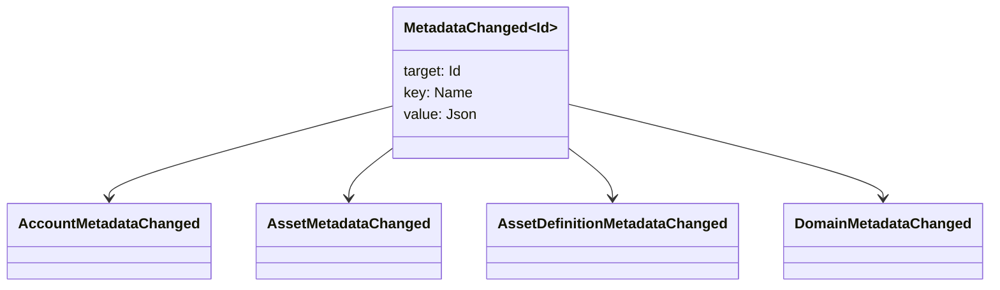

# Метадата {#metadata}

Метадата бол блокчейн хослол бичгийн объектуудад холбоотой шалгагдсан түлхүүр-үнэлгээний газрын зураг юм. Түлхүүрүүд нь `Name` утгууд бөгөөд утгууд нь JSON (`Json`) агуулга юм.

Дараах объектууд нь мета өгөгдөл авч явж чадна:

- доменууд
- дансууд
- эзэмшил
- мөнгөн хөрөнгийн тодорхойлолт
- NFTs
- RWAs
- түлхүүрүүд
- үйлдлүүд

Блокчэйн сангийн төлөвийн жижиг тайлбарлах эсвэл индекс хийх талбаруудад мета өгөгдөл ашиглана. Том хэмжээний өгөгдлийг WSV-аас гадна хадгалаад криптографийн дайджест утга, URI эсвэл SoraFS замаар лавлана.

Мета өгөгдөл, хөрөнгө, NFTs, RWAs эсвэл офф-чейн хадгалалтыг сонгох талаар заавар авахыг хүсвэл [Мета өгөгдөл ба блокчэйн бүртгэл хадгалах сонголтууд](/mn/guide/configure/metadata-and-store-assets.md)-г үзнэ үү.

## Энэ урсгалыг Taira-д ажиллуулна уу {#try-it-on-taira}

Метадата нь энгийн нөөц уншлагуудаар харагдана. Энэ тушаал нь одоогоор метадататай байгаа Taira хөрөнгийн тодорхойлолтуудыг жагсаадаг:

```bash
curl -fsS 'https://taira.sora.org/v1/assets/definitions?limit=100' \
  | jq '.items[]
    | select((.metadata | length) > 0)
    | {id, name, metadata}'
```

Домэйн болон аккаунтуудын хувьд ижил загварыг ашигла:

```bash
curl -fsS 'https://taira.sora.org/v1/domains?limit=20' \
  | jq '.items[] | select((.metadata // {} | length) > 0)'

curl -fsS 'https://taira.sora.org/v1/accounts?limit=20' \
  | jq '.items[] | select((.metadata // {} | length) > 0)'
```

Хоосон гарцыг хүчинтэй үр дүн гэж үз. Энэ нь Taira объектуудын одоогийн хуудсанд метадата агуулаагүй байгаа бөгөөд API төгсгөлийн цэг алдаа гаргасан гэсэн үг биш юм.

## Мета өгөгдлийг шинэчилж байна {#updating-metadata}

Метаг өгөгдлийг Iroha зааврын үйлдлүүдээр өөрчилдөг:

- [`SetKeyValue`](/mn/blockchain/instructions.md#setkeyvalue-removekeyvalue) түлхүүрийг оруулж эсвэл солих
- [`RemoveKeyValue`](/mn/blockchain/instructions.md#setkeyvalue-removekeyvalue) түлхүүрийг авдаг

Лавлагаа илгээж буй эрхийг баталгаажуулах үндсэн этгээд нь идэвхитэй програм хангамжийн гүйцэтгэх орчны баталгаажуулагчийн шаарддаг зөвшөөрлийг эзэмшиж байх ёстой. Анхдагч зөвшөөрлийн давхаргыг харах бол [Өөрт нь зөвшөөрөл өгөх тэмдэг](/mn/reference/permissions.md)-г үзнэ үү.

## Арга хэмжээ {#events}

Мэдээллийн үйл явдлууд метадата өөрчлөгдөхөд үүсдэг. Ерөнхий үйл явдлын агуулга нь `MetadataChanged<Id>` байна:



Интеграцад чухал тустай ороомог эсвэл объектын ID-д зориулсан зөвхөн метадатын үйл явдлуудад захиалахдаа [өгөгдлийн үйл явдлын шүүлтүүр](/mn/blockchain/filters.md#data-event-filters)-г ашигла.

## Асуултууд {#queries}

Мета өгөгдлийг асуусан объектийн нэг хэсэг болгон буцаадаг. Жишээлбэл, ашиглах [`FindAccountById`](/mn/reference/queries.md#accounts-and-permissions), [`FindDomainById`](/mn/reference/queries.md#domains-and-peers), эсвэл [`FindAssetDefinitionById`](/mn/reference/queries.md#assets-nfts-and-rwas). Хэрэглэх [`FindNfts`](/mn/reference/queries.md#assets-nfts-and-rwas) эсвэл [`FindNftsByAccountId`](/mn/reference/queries.md#assets-nfts-and-rwas) тиймээс NFTs, болон [`FindRwas`](/mn/reference/queries.md#assets-nfts-and-rwas) ийн тулд RWA олон зүйл. Дараа нь объектын мета өгөгдлийн талбарыг уншина. NFT асуултын хариултуудыг илчилдэг NFT `content` мета өгөгдөл маягаар газрын зураг.

Мета өгөгдлийн түлхүүрүүд нь блокчэйн бүртгэлийн төлөвийн нэг хэсэг тул тэдгээрийг тогтвортой байлгаж, тодорхой нэг програмын хувилбарын өөрчлөлтийг түлхүүрийн нэрэнд шифрлэхээс зайлсхий, учир нь JSON утга нь тухайн хувилбарыг илэрхий харуулах боломжтой.
