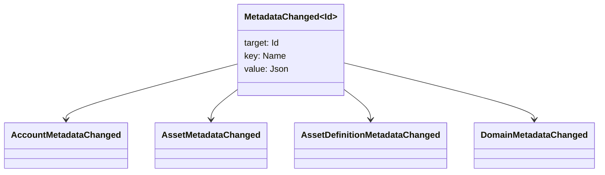

# Мэдээлэл {#metadata}

Metadata нь томоохон бүртгэлийн объектуудад холбогдсон шалгагдсан түлхний үнэ цэнэтэй газрын зураг юм.
`Name` үнэ цэнэ JSON (`Json`) хэрэглэгдэх ачаа.

Дараах объектүүд метадэтгэлийг авч болно:

- доменүүд
- нягтлан бодох бүртгэл
- хөрөнгө
- хөрөнгийн тодорхойлолт
- NFTs
- RWAs
- гадаргуулагч
- гүйлгээ

Тодруулгад багтаж буй тодорхойлох болон индексирүүлэх талбайдын бага хэмжээний метабараа ашиглах
Их нөөцтэй ачааллыг WSV а
хоолой, URI, эсвэл SoraFS Замыг.

Metadata, хөрөнгө сонгох талаар зөвлөгөө авах NFTs, RWAs, эсвэл зангилаагүй
хадгаламж, үзнэ үү
[Metadata болон Ledger хадгалах сонголтууд](/mn/guide/configure/metadata-and-store-assets.md).

## Та үүнийг туршиж үзээрэй. Taira {#try-it-on-taira}

Metadata нь хэвийн эх үүсвэрийн уншлын дамжуулан харагдаж байна. Энэ команд жагсаалт Taira
Одоогийн байдлаар метадэтгэгтэй хөрөнгийн тодорхойлолтууд:

```bash
curl -fsS 'https://taira.sora.org/v1/assets/definitions?limit=100' \
  | jq '.items[]
    | select((.metadata | length) > 0)
    | {id, name, metadata}'
```

Домен болон данс бүртгэлд ижил загварыг ашигла:

```bash
curl -fsS 'https://taira.sora.org/v1/domains?limit=20' \
  | jq '.items[] | select((.metadata // {} | length) > 0)'

curl -fsS 'https://taira.sora.org/v1/accounts?limit=20' \
  | jq '.items[] | select((.metadata // {} | length) > 0)'
```

Энэ нь өнөөгийн хуудсыг Taira
объектууд нь метадэтгэлийг авч чадахгүй, төгсгөлийн цэг алдаатай гэж үгүйсгэхгүй.

## Metadataг шинэчлэх {#updating-metadata}

Metadata нь Iroha Тодруулбал:

- [`SetKeyValue`](/mn/blockchain/instructions.md#setkeyvalue-removekeyvalue)
  түлхэгийг оруулдаг эсвэл солидог
- [`RemoveKeyValue`](/mn/blockchain/instructions.md#setkeyvalue-removekeyvalue)
  нөөц гаргадаг

Худалдааныг өргөн мэдүүлсэн байгууллагаас зөвшөөрөл авах шаардлагатай
үйл ажиллагаа явуулах цаг хугацааны баталгаажуулагчаар.
[Тусгай зөвшөөрлийн токенүүд](/mn/reference/permissions.md).

## Үргэлж {#events}

Мэдээллийн үйл явдлыг метадэтгэлийн өөрчлөлтийн үед дамжуулдаг.
`MetadataChanged<Id>`:



Хэрэглээ [Мэдээллийн үйл явдлын филтр](/mn/blockchain/filters.md#data-event-filters) .
зөвхөн нэгжийн төрөл эсвэл объектын метадангийн үйл явдлыг бүртгэнэ ID Энэ
Интеграцид хамаатай.

## Судалгаа {#queries}

Мэдээлэл өгөгдлийг хүсэлт гаргасан объектын нэг хэсэг болгон буцааж өгдөг. Жишээ нь,
[`FindAccountById`](/mn/reference/queries.md#accounts-and-permissions),
[`FindDomainById`](/mn/reference/queries.md#domains-and-peers), эсвэл
[`FindAssetDefinitionById`](/mn/reference/queries.md#assets-nfts-and-rwas).
Хэрэглээ [`FindNfts`](/mn/reference/queries.md#assets-nfts-and-rwas) эсвэл
[`FindNftsByAccountId`](/mn/reference/queries.md#assets-nfts-and-rwas) .
NFTs, болон [`FindRwas`](/mn/reference/queries.md#assets-nfts-and-rwas) . RWA
Дараа нь объектын метадэтгэлийг уншина уу. NFT асуултын хариу нь
NFT `content` Захиргааны метадэтгэрийн зураг.

Metadata түлхүүр нь томоохон бүртгэлийн байдалд ордог тул тэднийг тогтвортой байлгаж,
Хэрэглэлийн тухайн хувилбарыг кодлох нь ач холбогдолтой нэр рүү шилжүүлнэ JSON
үнэ цэнэ нь тухайн хувилбарыг тодорхой илэрхийлж болно.
