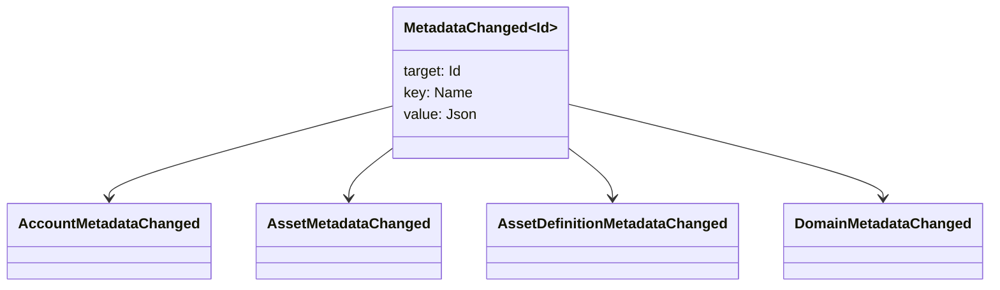

# Мэдээлэл мэдээлэл {#metadata}

Metadata нь томоохон бүртгэлийн объектуудад холбогдсон хяналтын түлхний үнэ цэнэтэй газрын зураг юм. Хяналт нь `Name` хэмжээнүүд бөгөөд үнэ цэнэ нь JSON (`Json`) ашиг ачааллууд юм.

Дараах объектүүд метадэтгэлийг тээвэрлэж болно:

- доменүүд
- санхүүжилт
- хөрөнгө
- хөрөнгийн тодорхойлолт
- NFTs
- RWAs
- түлхүүжүүлэг
- гүйлгээ

Тодруулбал, WSV дээс гадна агуулагдах бөгөөд URI эсвэл SoraFS замаар дурддаг байх ёстой.

Metadata, хөрөнгийн сонгон шалгаруулалтын талаар зөвлөгөө авах, NFTs, RWAs, эсвэл зах зээлийн гадна хадгалах, үзнэ үү [Metadata болон Ledger хадгалах сонголтууд](/mn/guide/configure/metadata-and-store-assets.md).

## Taira дээр туршиж үзээрэй. {#try-it-on-taira}

Metadata нь хэвийн нөөцийн уншлын дамжуулан харагдана. Энэ команд нь Taira хөрөнгөний тодорхойлолт, одоогийн байдлаар метадататай байна:

```bash
curl -fsS 'https://taira.sora.org/v1/assets/definitions?limit=100' \
  | jq '.items[]
    | select((.metadata | length) > 0)
    | {id, name, metadata}'
```

Домен, дансны хувьд ижил загварыг ашиглах:

```bash
curl -fsS 'https://taira.sora.org/v1/domains?limit=20' \
  | jq '.items[] | select((.metadata // {} | length) > 0)'

curl -fsS 'https://taira.sora.org/v1/accounts?limit=20' \
  | jq '.items[] | select((.metadata // {} | length) > 0)'
```

Энэ нь Taira объектын одоогийн хуудсанд метадэт мэдээлэл байхгүй гэсэн үг биш, төгсгөлийн цэг алдаатай гэсэн үг биш юм.

## Metadataг шинэчлэх {#updating-metadata}

Metadata нь Iroha тусгай зааварчилгаагаар өөрчлөгдөж байна:

- [`SetKeyValue`](/mn/blockchain/instructions.md#setkeyvalue-removekeyvalue) товчлогыг оруулж, солиод байна
- [`RemoveKeyValue`](/mn/blockchain/instructions.md#setkeyvalue-removekeyvalue) нь мөрийг устгана.

Транзакцийг өргөн мэдүүлсэн эрх баригч нь идэвхтэй гүйлгээний цаг хугацааны баталгаажуулагчаар шаарддаг зөвшөөрөлтэй байх ёстой. Дашрамд дурдах зөвшөөрлийн талбайн талаар [Хэрэглэх токенүүд](/mn/reference/permissions.md)-ийг үзнэ үү.

## Үргэлт {#events}

Мэдээллийн үйл явц нь метадэтгэлийн өөрчлөлтийн үед дамжуулагдана. `MetadataChanged<Id>`:



[ мэдээллийн үйл явдлын филтрүүд ](/mn/blockchain/filters.md#data-event-filters)-ийг ашиглан зөвхөн нэгжлэлтэд чухал ач холбогдол бүхий этгээдийн төрөл эсвэл объект ID-ийн мета өгөгдөлний үйл явдлыг бүртгэж болно.

## Судалгаа {#queries}

Мэдээлэл өгөгдлийг асуусан объектын нэг хэсэг болгон буцааж өгдөг. Жишээлбэл, [`FindAccountById`](/mn/reference/queries.md#accounts-and-permissions), [`FindDomainById`](/mn/reference/queries.md#domains-and-peers), эсвэл [`FindAssetDefinitionById`](/mn/reference/queries.md#assets-nfts-and-rwas) ашиглана. [`FindNfts`](/mn/reference/queries.md#assets-nfts-and-rwas) эсвэл [`FindNftsByAccountId`](/mn/reference/queries.md#assets-nfts-and-rwas)-ийг NFTs болон [`FindRwas`](/mn/reference/queries.md#assets-nfts-and-rwas)-г RWA хэсгүүдээр ашигла. Дараа нь объектын метад мэдээллийн талбайг уншина уу. NFT асуултын хариулт нь NFT `content` газрын зургийг бүртгэлийн метад мэдээллээр илрүүлнэ.

Metadata түлхүүр нь томоохон бүртгэлийн байдлын нэг хэсэг тул тэдгээрийг тогтвортой байлгаж, JSON үнэ цэнэ нь тухайн хувилбарыг тодорхой илэрхийлж чаддаг бол хэрэгслийн тусгай хувилбарын кодлогыг нэрийн нэрт оруулж болохгүй.
