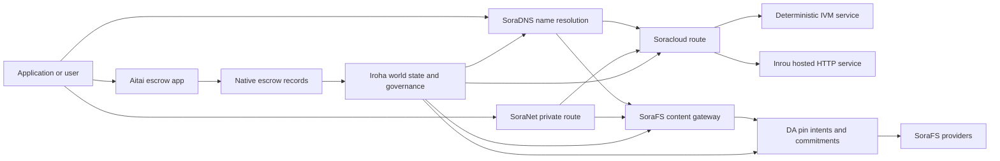

# SORA Nexus Үйлчилгээ {#sora-nexus-services}


SORA Nexus нь Iroha 3 -ийн дэргэдэх аппликейшнээр чиглэсэн үйлчилгээний нисдэг тэрэгүүдийг нэмнэ. Эдгээр үйл ажиллагааг тусгайлан бүртгэдэггүй бөгөөд тэдгээрийг Iroha дэлхийн улсын, Norito манифест, засаглалын баримт бичиг болон Torii замын гэр бүлүүдээс бүрдүүлж байна .

Хэрэглээ нь түймрийн бүтээн байгуулалт болон сүлжээний профилээс хамаарна. зорилтын түймэр дээр үүсгэсэн апп-API чиглэлийг олохын тулд [`/openapi`](/mn/reference/torii-endpoints.md#app-and-sora-route-families) ашиглах. Олон нийтийн орон нутгийн SoraFS CID болон алдартай замыг бүтээсэн баримтын гадна байрлуулж байгаа тул ашиглалтыг шалгахдаа эдгээр замыг шууд судалж үзээрэй.

## Компонент газрын зураг {#component-map}

|Компонент |Ажлын үүрэг |Гол талбай .|
| ---------------------- | ------------------------------------------------------------------------------------------------------------------------------------------- | ---------------------------------------------------------------------------------------- |
|Soracloud |Хэрэглээний хэрэгжилт, хостинг үйлчилгээ, хувийн загвар / гүйлгээний цаг үеийн байдал, үйлчилгээний амьдралын мөрийг хянах. |`/v1/soracloud/`, `/api/`, `iroha app soracloud ...`|
|Дотооддоо|Soracloud нь амьд HTTP нисэх онгоц шаардлагатай үйлчилгээний шинэчлэлийн үйл ажиллагаанд HTTP гүйцэтгэх хугацааг хүлээн авч байна. |Soracloud гүйлгээний цаг тохируулалт, хөтөч боломжийн зар сурталчилгаа, дүрсэлтийн гүйлгээны цаг байдлын .|
|SoraNet |Ширээ, ээлжит хөдөлгөөн, VPN, Холбооны үе шат, урсгалын чиглэлийн нууцлал, тээврийн орчин. |`/v1/connect/`, `/v1/vpn/`, SoraNet замын метадэтгэлэг |
|Мэдээллийн хангамж (DA) |Nexus замын, SoraFS тайлбарын болон баталгааны урсгалын дагуу дурдсан хэрэглээний ачааллын хангамжтай байдлын гэрэл баримт, үүрэг гүйцэтгэл, нэвтрүүлгийн зориулалтын шадар. |`/v1/da/`, `FindDaPinIntent`, `[sumeragi.da]`|
|SoraFS |Манифес, CAR нөөцийн ачаалл, тавигдсан агуулга, галт тэрэгний хуримтлагууд болон нөхөн сэргээх чадлын баталгааны урсгалыг хадгалах контентын хаягдалтай угаа. |`/v1/sorafs/`, `/sorafs/`, `FindSorafsProviderOwner`|
|SoraDNS |SORA -д байршуулсан үйлчилгээ, агуулгын тодорхойлох нэрэмжит болон шийдвэрлэх-аттестацийн шатаг. |`/v1/soradns/`, `/soradns/`, Resolver directory үйл явдлууд |
|Атай |Хэрэглээний түвшинд буй фиат болон хөрөнгийн зохицуулалтын коридор нь тусгай номын сангаас биш, дотоод хадгаламжийн бүртгэлээр дэмжлэг үзүүлдэг. |`OpenAssetEscrow`, `FindAssetEscrow*`,`EscrowEventFilter`, Kotodama `escrow_*` барилга байгууламж |



## Нийтлэг урсгал {#common-flows}

### Хостын хуваарилсан хэрэглээ {#hosted-split-application}

Тухайн төрлийн халуун тайзны апп нь бүх хэсгийг хамтдаа ашигладаг:

1. Статикийн фронтэнд хөрөнгийг SoraFS -ээр багтаж, түймжилж байна.
2. Тухайлбал, `<app>.sora` олон нийтийн хөтлөгч нь SoraDNS хаягаар бүртгэгдсэн байна.
3. Soracloud замыг `/api/v1/search` эсвэл `/api/v1/stream` нь Inrou HTTP үйлчилгээний чиглэлд.
4. Soracloud замыг `/api/auth` болон `/api/v1/user` нь тодорхойлсон IVM хяналтын хэрэглэгчдэд зориулагдсан.
5. Хувийн байдлыг хангах шаардлагатай үйлчлүүлэгчид ижил агуулга эсвэл API замыг SoraNet тойроггоор хүргэж болно.

|Даяар |Хөдөөний нисэх онгоц .|Яагаад?|
| ----------------- | --------------------- | ------------------------------------------------- |
| `/`               |SoraFS статийн агууламж |Өрсөх боломжтой агуулгын түшиг болон галт тэрэгний хадгаламжлах |
|`/assets/*` |SoraFS статийн агууламж |Үндсэн өгөгдлийн дагуу хаягдалтай хөрөнгийн сан болон ил тод баримт |
|`/api/auth*` |Soracloud IVM|Өргөдлийн аюулгүй зохиол , мөн санхүүгийн асуудал |
|`/api/v1/user*` |Soracloud IVM|Засаг захиргааны хувьд эмзэг байдлын өөрчлөлт . |
|`/api/v1/search*` |Soracloud Дээрх |Амьдрал HTTP үйлчилгээ, хадгаламж, SSE эсвэл цуглуулгачийн байдал |

### Зохиоллын хэвлэл {#content-publication}

SoraFS хэвлэл нь нэр нь тэдгээрийг заахаас өмнө удаан эдэлгээтэй артефактыг гаргадаг:

1. Хөдөлмөрийн ачаалал эсвэл захиалгыг бүтээх.
2. Энэ нь CAR архив болон хэсэг төлөвлөгөөт багтаж.
3. Norito нэвтрүүлэгний бодлого, удирдлагын мэдээллийг бүрдүүлэх.
4. Номын жагсаалтыг Torii албан тушаалд хүргүүлнэ.
5. DA нэрийн зорилго эсвэл бэлэн байдлын үүрэг гүйцэтгэх тухай баримт бичнэ, хэрэв зорилтот хувилбар тодорхой баталгаа шаарддаг бол.
6. Манифест нь SoraDNS нэртэй эсвэл Soracloud статикийн дэргэдэх чиглэлтэй холбох.

### Шаардлагатай тээвэрлэлт эсвэл урсгалын зам {#private-fetch-or-streaming-route}

SoraNet нь SoraFS эсвэл Soracloud -ийн өмнө сууж болно:

1. Хэрэглэгчийн нэр эсвэл тэмдэгтийг шийднэ.
2. Хяналтын захиалга эсвэл замын жагсаалт нь нэвтрэх болон гарах релесийг сонгодог.
3. Зам тээврийн хөдөлгөөн багаж, SoraNet тойрогт дамжуулагдана.
4. Гадаад явгын ээлж SoraFS хаалга, Torii урсгал, эсвэл Soracloud замыг хүрнэ.

## Атай {#aitai}

Aitai нь SORA зах зээлийн загварын зохицуулалтын хэрэгслийн коридор бөгөөд худалдан авагч, борлуулагчийн хоорондоо төлбөрийг координатжуулж, Iroha нь . Шинэ санхүүгийн хөрөнгийн хяналтын урсгалд гэрээний өмчит хяналт татварын дансны эзэмшилтээс өөрөөр нь эх үүсвэртэй халдааны сургалтын гэрээг ашиглах ёстой.

Үндэсний хадгаламж нь захиалгыг номын санд хадгалж, борлуулагчаар санал авдаг `OpenAssetEscrow`, худалдан авагч нь зах зээлийн гадаад төлбөрийг хүлээн зөвшөөрч, тэмдэглэж байна: `AcceptAssetEscrow` болон `MarkEscrowPaymentSent`, ба худалдагч нь `ReleaseAssetEscrow` Хэрэв худалдан авагч болон борлуулагч санал зөрчсөн бол аль алинд нь маргааныг нээж, шийдвэрлэх боломжтой `CanResolveEscrowDispute` хаалттай хэмжээг хувааж болно.

Бүх амьдралын мөчлөг, нийтлэг хөрөнгийн нууцлал, үл мэдэгдэх хадгаламж, асуултууд, үйл явдлууд болон Rust -ийн жишээг үзнэ үү [Үндэсний хөрөнгийн хадгаламжийн ](/mn/blockchain/escrow.md).

|Атай дагуул |Үүнийг ашиглаарай.|
| ------------------------------------------------------------------------------------------------------------------------------------------------------------- | ----------------------------------------------------------------------------------------- |
|`OpenAssetEscrow`, `AcceptAssetEscrow`, `MarkEscrowPaymentSent`, `ReleaseAssetEscrow`, `CancelAssetEscrow` |XOR -ийн төлбөрийн урсгал зэрэг ил тод санхүүгийн хөрөнгийн санал. |
|`OpenAnonymousAssetEscrow`, `AcceptAnonymousAssetEscrow`, `MarkAnonymousEscrowPaymentSent`, `ReleaseAnonymousAssetEscrow`, `CancelAnonymousAssetEscrow` |Шаардлагатай санал нь санхүүжилт болон зогсоох хөдөлгөөнд нотолгооны хавсралтыг ашигладаг. |
|`OpenEscrowDispute`, `ResolveEscrowDispute`, `OpenAnonymousEscrowDispute`, `ResolveAnonymousEscrowDispute`|Шүүх хуралдаанаар маргааныг шийдвэрлэх. |
|`FindAssetEscrowById`, `FindAssetEscrowsBySeller`, `FindAssetEscrowsByBuyer`, `FindAssetEscrowsByStatus`|Хэрэглэлийн байдлын хуудсууд, тохируулалтын ажлын байр болон дэмжлэг үзүүлэх хэрэгсэл. |
|`EscrowEventFilter` |Хөдөлмөрийн төлөөлөгч, худалдагч, худалдан авагч, нөхцөл байдал эсвэл үйл явдлын төрөлгээр шууд ил тод бүртгэлтэй. |
| Kotodama `escrow_open_offer`, `escrow_accept`, `escrow_mark_payment_sent`, `escrow_release`, `escrow_cancel`, `escrow_open_dispute`, `escrow_resolve_dispute` |Kotodama гэрээний дуудлага нь V1 хадгаламжийн системээр баталгаажуулсан. |

Олон нийтийн Taira эсвэл Minamoto ашиглахын тулд гадаад төлбөрийн шугам болон аливаа дэмжлэг, шүүх ажлын урсгалыг өргөдлийн бодлогын хувьд авч үзээрэй. Iroha хадгаламжийн байдал, амьдралын мөрийн үйл явдлууд, гэрчилгээний хэшүүд, эцсийн хөрөнгийн хөдөлгөөнийг бүртгэдэг; энэ нь фиат тооцоог өөрөө баталгаажуулахгүй юм.

## Зорилгоны сүлжээг шалгана {#check-a-target-node}

Энэ хуудасны жишээг ашиглахаасаа өмнө чиглэлийн гэр бүл нь та зорилтот цэг дээр байгаа эсэхийг баталгаажуул:

```bash
export TORII_URL=https://taira.sora.org

curl -fsS "$TORII_URL/openapi.json" \
  | jq '.paths | keys[] | select(test("^/v1/(soracloud|sorafs|soradns|connect|vpn|da)/"))'

curl -fsS -H 'Accept: application/json' "$TORII_URL/status" | jq .
```

Хэрэв `/openapi.json` нь хувилбараас илрээгүй бол `/openapi`-ийг туршиж үзээрэй. Тухайн чиглэлийн бэлэн байдал нь бүтээн байгуулалтын шинж чанар, сүлжээний конфигурацынд хамаарна. Документ олон нийтийн орон нутгийн SoraFS CID болон алдартай чиглэлийг жагсаалдаггүй; эдгээр төгсгөлийн цэгүүдийг дараах байдлаар шууд шалгаарай.

### Taira Зөвхөн уншигчдын цахилгаан тамхины шалгалт {#taira-read-only-smoke-checks}

Олон нийтийн Taira төгсгөл нь уншигч талын шалгалтын хувьд ашигтай боловч зөвшөөрөлтэй дансыг ашиглаж байгаа бөгөөд олон нийтийн тестний сүлжээний байдлыг өөрчлөх бодолгүй бол өөрчилсөн жишээгээр хэрэглэхгүй.

```bash
export TORII_URL=https://taira.sora.org

curl -fsS -H 'Accept: application/json' "$TORII_URL/status" \
  | jq '{version: .build.version, peers, blocks, lanes: (.teu_lane_commit | length)}'

curl -fsS "$TORII_URL/v1/connect/status" | jq '{enabled, sessions_active}'

curl -fsS "$TORII_URL/v1/vpn/profile" \
  | jq '{available, relay_endpoint, supported_exit_classes}'

curl -fsS "$TORII_URL/v1/sorafs/storage/peers?limit=4" \
  | jq '{gateway_base_url, pin_torii_urls}'

curl -fsS -H 'Accept: application/json' "$TORII_URL/v1/soracloud/status" \
  | jq '.control_plane | {service_count, services: [.services[] | {service_name, current_version}]}'
```

Taira нь нэвтрүүлэгт зориулсан хяналтын нисэх онгоцны замыг нэвтрүүлэх боломжтой бөгөөд энэ нь OpenAPI зам газрын зураг дээр жагсалдаггүй. `/openapi` -ийг тухайн чиглэлд үүсгэсэн гэрээ гэж үзээрэй, дараа нь нэвтэрүүлэгт онцлогтой болон олон нийтэд зориулсан орон нутгийн SoraFS замыг шууд баримтатлахын өмнө тэдгээрийг ашиглах боломжтой болгон баталгаажуулна.

## Soracloud {#soracloud}

Soracloud нь SORA хэрэгслийн хяналтын хавсралт юм. Энэ нь нэвтрүүлгийн бандл, үйлчилгээний шинэчлэл, замын хөдөлгөөн, өргөн мэдүүлэх байдал, эрх бүхий конфигурацийн бүртгэл, нууцлагдсан үйлчилгээний нууцыг, загварын регистрийн тэмдэглэл, хувийн дүгнэлт хийх үе шат, гүйлгээний цагийг хүлээн авдаг байна.

Soracloud нь хоёр гүйцэтгэх төвийг ашигладаг:

|Хөдөлмөрийн нисэх онгоц |Хөдөлмөрийн цаг|Үүнийг ашиглаарай.|
| ---------------------- | ------- | -------------------------------------------------------------------------------------------- |
|`DeterministicService` |`Ivm` |Зохиолч, хадгаламжийн орчин, баталгаажсан уншилт, захиалгын хайрцаг хэрэглэгчид, засаглалтай холбоотой шилжилт |
|`HttpService` |`Inrou` |Амьдрал HTTP APIs, цуглуулчийн ачаалалтай ажил, хажуугаар дэмжлэг үзүүлэх үйлчилгээ, SSE, хөтөчээр туслах урсгалууд |

Хяналтын тайз авьяастай. Хөдөлгөөн, шинэчлэл, эргэлт, тохируулалт, нууц, загвар, байдлын команд Torii -ийн дамжуулан өргөн мэдүүлж, дэлхийн нөхцөл байдлыг уншдаг; тэд тусгай CLI - орон нутгийн үзэгдэлд тавигдахгүй байна. Олон нийтийн чиглэл нь хамгийн урт префикс дээр суурилсан тул нэг бүртгэгдсэн хөтөч замыг HTTP хостинг шугам болон API тодорхойлсон шугам хооронд хувааж болно.

### Дээрх хэрэглээг тавих {#scaffold-a-split-app}

Хөдөлмөрийн хуваарилалтын загвар нь статик фронтэнд болон API хостын амьд үйлчилгээ, API дэглэмчилсэн хавтан / үйлчилгээг бий болгодог:

```bash
iroha app soracloud app init \
  --template split-app \
  --app-name solswap_indexer \
  --app-version 0.1.0 \
  --public-host solswap-indexer.sora \
  --output-dir ./apps/solswap-indexer

iroha app soracloud app local-plan \
  --manifest ./apps/solswap-indexer/app_manifest.json

iroha app soracloud app doctor \
  --manifest ./apps/solswap-indexer/app_manifest.json
```

`local-plan` нь замын хуваалт, хүүхдийн үйлчилгээний манифест, ажлын байрны скриптийн зам, урьдчилан төлөвлөсөн фронтэнд хэвлэлийн хэлбэрг хэвлэнэ. `doctor` нь та Torii-ийг оролцуулахын өмнө орон нутгийн худалдааны гэрээг баталгаажуулна.

### Хэвлэлийн хэрэгслийн төлөв байдлыг ашиглах, шалгах {#deploy-and-inspect-app-state}

```bash
export SORACLOUD_TORII_URL=https://<soracloud-enabled-torii>

iroha app soracloud app deploy \
  --manifest ./apps/solswap-indexer/app_manifest.json \
  --torii-url "$SORACLOUD_TORII_URL"

iroha app soracloud app status \
  --manifest ./apps/solswap-indexer/app_manifest.json \
  --torii-url "$SORACLOUD_TORII_URL"
```

Урьдчилсан үйлчилгээний хувьд үйл ажиллагааны хэмжээнд чиглэсэн командыг ашиглах:

```bash
iroha app soracloud status \
  --service-name solswap_indexer_live \
  --torii-url "$SORACLOUD_TORII_URL"

iroha app soracloud rollback \
  --service-name solswap_indexer_live \
  --target-version 0.1.0 \
  --torii-url "$SORACLOUD_TORII_URL"
```

### Нээлттэй болон нууцлаг материал {#config-and-secret-material}

Soracloud конфигурац болон нууц товчлолт нь албан ёсны ашиглалтын байдлын нэг хэсэг юм. Оюулгах, шинэчлэл хийх, эргэн шилжүүлэх шаардлагатай конфигурацыг эсвэл нууц товчоо байхгүй бол хаагдахгүй эсвэл идэвхтэй манифестүүдтэй нийцэхгүй үед хаагдаагүй байна.

```bash
iroha app soracloud config-set \
  --service-name solswap_indexer_live \
  --config-name indexer/public_config \
  --value-file ./config/public-config.json \
  --torii-url "$SORACLOUD_TORII_URL"

iroha app soracloud secret-set \
  --service-name solswap_indexer_live \
  --secret-name indexer/api_key \
  --secret-file ./secrets/api-key.envelope.json \
  --torii-url "$SORACLOUD_TORII_URL"
```

CLI -ийн тусламжтайгаар таны хувилбар шаарддаг үнэн зөв итгэлийг илрүүлэх:

```bash
iroha app soracloud config-set --help
iroha app soracloud secret-set --help
```

## Үргэлж {#inrou}

Inrou нь зочид буудал HTTP хэрэглэгддэг гүйлтийн хугацаа Soracloud. Нүүр хуудас Iroha Гүйцэтгэгтэй түймэр Soracloud гүйцэтгэх хугацааны төсөл хүлээн зөвшөөрөгдсөн Soracloud орон нутгийн материализацийн төлөвлөгөөнд бичиж, хуваалцагдсан хостинг үйлчилгээний хувилбаруудыг дугуйлан сэргээх үйлчилгээгээр эхлүүлж байна. Энэ нь цахилгаан хэрэгслийн гүйцэтгэх цаг хугацааны төлөвлөгөөг баталгаатай загварт буцааж өгөөч.

APIs, SSE урсгалууд, хоолойд дэмжлэг үзүүлж буй хяналтын хэрэгсэл, эсвэл браузерээр туслах үйлчилгээ зэрэг амьд HTTP гадаргуудыг шаардагдсан ажлын ачааллын хувьд Inrou-ийг ашиглах.

### Хөдөлмөрийн цаг хугацааны шаардлага {#runtime-requirements}

- Контейнерийн тайлангийн гүйцэтгэх цаг нь `Inrou` байх ёстой.
- Үйлчилгээний тайлан гүйцэтгэх төвийг `HttpService` байх ёстой.
- `HttpService + Inrou` нь яг нэг `PersistentRootLeaseVolume`-ийг `/` дээр суурилуулж байх ёстой.
- Inrou-ийн сэргээгдэх үйлчилгээ нь өөрчлөх хуваарилсан байдлаа хадгалж байх үедээ хамтран үйлчлэх үйлчилгээ эсвэл нууцтай лизингийн агууламж шаарддаг.
- Үйлдвэрлэлийн хостинг цэгүүд зөвхөн төлөөлөгчөөр үйл ажиллагаа явуулахын оронд ИНРУ-ийн бодит чадавхийг зарлаж байх ёстой.

### Өргөдлийн хувилбар {#manifest-fragment}

Доорх жишээ нь хоёр манифестийн хэлбэрийг харуулж байна. Энэ нь бүрэн ашиглалтын цогц биш хэсэг юм.

```jsonc
// container_manifest.json
{
  "schema_version": 1,
  "runtime": { "runtime": "Inrou", "value": null },
  "bundle_path": "/bundles/solswap-indexer.inrou",
  "entrypoint": "/app/bin/launch-indexer.sh",
  "args": [],
  "env": {
    "RUST_LOG": "info",
  },
  "inrou": {
    "schema_version": 1,
    "guest_os": { "guest_os": "DebianSlim", "value": null },
    "guest_images": {
      "x86_64": {
        "kernel_image_path": "/inrou/x86_64/vmlinux",
        "rootfs_image_path": "/inrou/x86_64/rootfs.ext4",
        "initrd_image_path": null,
      },
      "aarch64": {
        "kernel_image_path": "/inrou/aarch64/vmlinux",
        "rootfs_image_path": "/inrou/aarch64/rootfs.ext4",
        "initrd_image_path": null,
      },
    },
  },
  "lifecycle": {
    "start_grace_secs": 60,
    "stop_grace_secs": 30,
    "healthcheck_path": "/api/indexer/v1/health",
  },
}
```

```jsonc
// service_manifest.json
{
  "schema_version": 1,
  "service_name": "solswap_indexer_live",
  "service_version": "0.1.0",
  "execution_plane": { "execution_plane": "HttpService", "value": null },
  "replicas": 2,
  "route": {
    "host": "solswap-indexer.sora",
    "path_prefix": "/api/v1/search",
    "service_port": 8080,
    "visibility": { "visibility": "Public", "value": null },
    "tls_mode": { "tls": "Required", "value": null },
  },
  "lease_volumes": [
    {
      "volume_name": "root_disk",
      "kind": {
        "lease_volume": "PersistentRootLeaseVolume",
        "value": null,
      },
      "storage_class": { "storage_class": "Warm", "value": null },
      "mount_path": "/",
      "max_total_bytes": 8589934592,
    },
    {
      "volume_name": "index_state",
      "kind": { "lease_volume": "ServiceLeaseVolume", "value": null },
      "storage_class": { "storage_class": "Warm", "value": null },
      "mount_path": "/var/lib/solswap-indexer",
      "max_total_bytes": 1073741824,
    },
  ],
}
```

Хөдөлмөрийн хэрэгслийн үйл ажиллагааны явцад бүртгэгдсэн лизингийн хэмжээ нь хэмжээний нэрээс үүдэлтэй байгаль орчны өөрчлөлтүүдийг ашиглан илэрч байна.

```text
SORACLOUD_LEASE_VOLUME_ROOT_DISK_DIR
SORACLOUD_LEASE_VOLUME_ROOT_DISK_MOUNT_PATH
SORACLOUD_LEASE_VOLUME_INDEX_STATE_DIR
SORACLOUD_LEASE_VOLUME_INDEX_STATE_MOUNT_PATH
```

## SoraNet {#soranet}

SoraNet нь хувийн хэвшил, тээврийн давхарчлал юм. Энэ нь зорилтот хаалга эсвэл үйлчилгээтэй шууд холбохгүй хөдөлгөөний ээлжит замыг бүрдүүлж байна. Тээврийн загвар нь нэвтрүүлэг, дундаж болон гарах релейн үүрэг, QUIC тээврийн хэрэгсэл, дуу хоолой дээр суурилсан гибрид гарцаажуулалт, хүчин чадлын хэлэлцээр, релейн захиалгын метабараа мэдээлэл, тогтмол хэмжээний өрөөсөн элемент ашигладаг.

Үүнд Nexus нэвтрүүлэг, SoraNet нэвтрүүлэг, галт тэрэгний хөдөлгөөнийг тээвэрлэх боломжтой, VPN эсвэл Connect цуврал, Norito нэвтрүүлгийн чиглэлүүд. Тодруулгын бүртгэл нь дэмжлэг үзүүлэх релеүүдийг тэмдэглэж болно `norito-stream`, Энэ нь үйлчлүүлэгчдэд тохиромжтой замыг сонгохыг зөвшөөрдөг Torii RPC эсвэл замын хөдөлгөөнийг дамжуулах.

### Агаарын урсгалын тохируулалт {#streaming-configuration}

Nexus хувилбар нь SoraNet урсгалын замыг хангах боломжийг олгож байна:

```toml
[streaming]
feature_bits = 0b11

[streaming.soranet]
enabled = true
exit_multiaddr = "/dns/torii/udp/9443/quic"
padding_budget_ms = 25
access_kind = "authenticated"
provision_spool_dir = "./storage/streaming/soranet_routes"
provision_spool_max_bytes = 0
provision_window_segments = 4
provision_queue_capacity = 256
```

Үзэгчний баталгаажуулалтыг шаардахгүй контентын чиглэлд `access_kind = "read-only"` ашиглах. Хөрөгчийн төлөөлөл нь Torii эсвэл хостинг үйлчилгээг хүргэхээс өмнө тавилга эсвэл үзэгчний тодруулгыг хэрэгжүүлэх ёстой бол `authenticated`-ийг ашиглана.

### SoraNet-Засга SoraFS Тэмүүлнэ {#soranet-aware-sorafs-fetch}

SoraFS авахад CLI нь орон нутгийн прокси манифст гаргаж, браузерны өргөтгөлийн болон SDK адаптерын чиглэлийн SoraNet метадэтгэлийг буулгаж болно. Orchestrator JSON нь `"emit_browser_manifest": true` -ээр `local_proxy` тодорхойлох ёстой бөгөөд CLI нь `local-quic-proxy` -ийн дэмжлэгтэйгээр баригдсан байх ёстой. Taira дээр хүлээн зөвшөөрөгдсөн үйлчилгээ үзүүлэгчдийн жагсаалтыг олон нийтийн тест сүлжээний түлшээр шалгаж, дараа нь тухайн үйлчилгээ үзүүлэгчд зориулан гаргасан хамгаалалттай үйлчилгээ үзүүлэгчийн туплиг тулгуурлан:

```bash
export TAIRA_ROOT=https://taira.sora.org
curl -fsS "$TAIRA_ROOT/v1/sorafs/providers?limit=20" | jq '.providers'

: "${TAIRA_SORAFS_PROVIDER_ID:?set the admitted provider ID from Taira discovery}"
: "${TAIRA_SORAFS_GATEWAY_KEY:?set the provider gateway key}"
: "${TAIRA_SORAFS_PROVIDER_URL:?set the advertised provider base URL}"
: "${TAIRA_SORAFS_STREAM_TOKEN_FILE:?set the issued stream-token file}"

cargo run -p sorafs_orchestrator --features=local-quic-proxy --bin=sorafs_cli -- \
  fetch \
  --plan=artifacts/payload_plan.json \
  --manifest-id=<manifest-digest-hex> \
  --orchestrator-config=artifacts/orchestrator.json \
  --provider=name=taira,provider-id="$TAIRA_SORAFS_PROVIDER_ID",gateway-key="$TAIRA_SORAFS_GATEWAY_KEY",base-url="$TAIRA_SORAFS_PROVIDER_URL",stream-token="$(cat "$TAIRA_SORAFS_STREAM_TOKEN_FILE")" \
  --output=artifacts/payload.bin \
  --json-out=artifacts/fetch_summary.json \
  --local-proxy-manifest-out=artifacts/proxy_manifest.json \
  --local-proxy-mode=bridge \
  --local-proxy-norito-spool=storage/streaming/soranet_routes \
  --local-proxy-kaigi-spool=storage/streaming/soranet_routes \
  --local-proxy-kaigi-policy=authenticated \
  --max-peers=2 \
  --retry-budget=4
```

Жишээлбэл, дүгнэлт бичгийн нийлүүлэгч мэдээллүүд, хуримтлагдсан хүлээн зөвшөөрөл, орон нутгийн төлөөлөгчийн метабараа мэдээлэл, татаж авахын тулд ашигласан үр дүнтэй чиглэлийн тохируулалт.

### Рэлегийн урамшуулалтын шалгалтын жагсаалт {#relay-incentive-verifier-roster}

Тэтгэврийн урамшуулгыг хэрэглэх нь шаардлагатай бүх шалгалт амжилттай явахгүй бол баталгааг үгүйсгэхгүй. `incentives.enable` үнэн бол `incentives.trusted_verifier_ids` нь дор хаяж нэг хуулийн санхүүжилтийн ID хуудастай байх ёстой. Хөдөлгөөн нь урамшуулгыг хүчингүй болгосон ч гэсэн хэзээ ч 64 бүртгэгдлийг давтахгүй байх ёстой. Хөгжлийн цаг нь үүнийг тодорхой зохицуулалттай цуврал болгон хадгалдаг бөгөөд ээлж эхлэх үед хүчингүй жагсаалтын геометрыг үгүйсгэдэг.

`RelayBandwidthProofV1` нь тогтмол рамз / хуваарилалтын төсвийн дагуу кодлогддог бөгөөд бүрэн кадрыг хэрэглэх ёстой. баталгаажуулахын сан нь тохируулсан жагсаалтад байх ёстой, болон `RelayBandwidthProofV1::verify_signature()` нь ээлжит цахилгаан замбараагүй эсвэл гүйцэтгэлийн аккумуляторын өөрчлөлтийг хийхээс өмнө амжилттай байх ёстой. Үргэлт нь итгэмжлэгдэхгүй гарын үсэг зурагч эсвэл гарын үсгийн хүчингүй / алдаатай нотолгоог үл тоомлох. Ийм баталгаа нь ямар ч хэмжээн нэмэхгүй бөгөөд урамшууллын хяналт татах боломжийг бүрдүүлж чадахгүй.

## Мэдээллийн хангамж (DA) {#data-availability-da}

DA нь дэлхийд шууд байршуулахэд хэт том, хувийн хэвшлийн хувьд хэт эмзэг эсвэл үйлчилгээний хувьд хэтэрхий онцгой ач холбогдолтой ашиг ачааллын хангамжийн баталгааны шадар юм. Энэ нь тодорхойлолт хариуцлага, сэргээлтийн үүргийг бүртгүүлж байгаа тул баталгаажуулагчид, шлюзүүд болон үйлчлүүлэгчид ямар байт амласан тухай, ямар бодлого хэрэгжиж буй талаар, ямар баримтлал ажиглагдсан талаар тохирох боломжтой.

DA нь Kura эсвэл SoraFS-ийг залгаагүй:

- Kura нь эцсийн блок урсгалын болон тохиролцооны нөхөн сэргээлтийн мэдээллийг хадгалдаг.
- SoraFS нэвтрүүлэгт чиглэсэн байтыг, CAR ашиг ачааллыг хадгалах, үйлчлэх.
- DA нь тухайн байтыг хуваарилж, хяналт шалгалт хийж, номын сүлжээний төлөвлөгөөнд холбох үүрэг, баталгааны бодлого, баталгааын нээлттэй байршил, шилжилтийн зорилгыг бүртгэж байна.

Хэрэглээ DA хүсэлт, эсвэл Nexus Lane нь зах зээлийн бус өгөгдлийг эргүүлэн авах боломжтой хэвээр үлдэх тухай номонд харагдаж буй гэрчилгээ хэрэгтэй. Нийт тохиолдлын жишээ нь зардлын урсгалд зориулсан хэрэглэгдэх ачаалал үүрэг гүйцэтгэгч, SoraFS хэвлэгдсэн агуулга, дараагийн хяналт шалгалтын тулд хадгалах ёстой баталгааны багц, болон олон нийтийн байдал нь бүрэн хэрэглээний ачааллын орчмын оронд дасан зохицуулалт байх ёстой ашиглалтын артефактууд.

### Амьдралын мөчлөл {#lifecycle}

|Сэдж .|Хэвлэлд бүртгэгдсэн зүйл|
| ---------- | ----------------------------------------------------------------------------------------------------------------------------------------------------- |
|Дашрамд .|Билет, илтгэлийн сүлжээн, нууц үсэг, замын / эпохины / дараалалтын сүлжээнд, хадгалах бодлого, эсвэл дугаарын зорилт. |
|Үүнд үүрэг гүйцэтгэгч|Манифест, замын ачаалл, баталгааны багц, эсвэл агуулгын суурь нь номонд харагдаж буй бүртгэлтэй холбодог материалыг харгалзан. |
|Дашрамд|Хэрэглээний санал, баталгааны нээлттэй байршил, нийлүүлэгчдийн гэрчилгээ, эсвэл зорилтот сүлжээ хүлээн зөвшөөрсөн бусад хувилбарын тодорхой баримт. |
|Судалгаа |`FindDaPinIntentByTicket`, `FindDaPinIntentByManifest`, `FindDaPinIntentByAlias` эсвэл `FindDaPinIntentByLaneEpochSequence`-ийн дагуу нэвтрүүлгийн зорилготой хайгуудыг хийх. |

DA -ийн дэмжлэгтэй нийтлэлийн урсгал нь:

1. WSV дэргэдэх хэрэглээний ачаалал, жишээ нь SoraFS CAR файл эсвэл Nexus замын хэрэглээний борлуулалтыг бариарай.
2. Norito тайлан болон маршрутын тухайн үүрэг гүйцэтгэх бүртгэлд ашигтай ачааллыг тодорхойлох.
3. Тус чиглэлийн гэр бүлийг ашиглах боломжтой бол `/v1/da/*` буюу сүлжээний гарын үсэг зурсан гүйлгээний замыг дамжуулан manifest, pin intention эсвэл commitment-ийг өргөн мэдээрэй.
4. Ажилтай нотлох бодлогын дагуу шаардлагыг баталгаажуулагч, ашиглах боломжтой байдлын үйлчилгээ үзүүлэгчид цуглуулж өгөх ёстой.
5. Үүнээс үүдэлтэй нэрийн зорилго эсвэл үүрэг гүйцэтгэгчдийг ашигтай ачаалал дээр хамаарах аливаа нууц үсэг, төлбөр тооцооны баталгаа эсвэл галт замын чиглэлээр сурталчлахын өмнө асууж үзээрэй.

### Алгоритмын загвар {#algorithmic-model}

DA нөөц ачааг гарын үсэг зурсан, дахин тоглож хамгаалалттай, блок-индексирсэн үүрэг болгодог. чухал алгоритмүүд нь тодорхойлогч тул баталгаажуулагчид болон шлюзүүд ижил бийтээс ижил дигестийг дахин тооцох боломжтой юм.

1. Torii нь `(lane_id, epoch, sequence)`, ашиг шилжилтийн байт, хатуулах метадэтгэл, хэсгийн хэмжээ, татаж авах профиль бүхий хэрэглээний хүсэлтийг хүлээн зөвшөөрдөг. gzip, deflate эсвэл Zstandard-ийн ашиг ачааллыг хүсэлтэд татан буулгаж, дараа нь Canonical byte урт нь `total_size` гэж баталгаажуулна.
2. Захиргааны замын болон хэсгийн параметрүүдийг баталгаажуулах. Захиргаан Nexus замын жагсаалтад байх ёстой. `chunk_size` нь хоёр, хамгийн багадаа хоёр байтын нөлөөгүй хүчтэй байх ёстой. Урьдчилсан хамгийн дээд хэмжээгээс хэтрэхгүй. Тахлын хувилбар нь мэдээллийн хэсгүүд болон ердөө хоёр тэнцвэрт хэсгийг бүрдүүлдэг байх ёстой. Замын жагсаалтад `merkle_sha256` эсвэл `kzg_bls12_381` гэсэн баталгааны схемыг сонгодог.
3. Түлжээний бодлогыг хэрэгжүүлнэ. Тус түймэр нь Блоб класын конфигуруулсан дугуйлалт, хадгалах үндсэн чиглэлийг дагаж өгдөг. Олон нийтийн метадэтг текст хэвээр үлдэх ёстой; зөвхөн засаглалын метадэтгийг маннифест бичигдээс өмнө түймрийн тохируулсан засаглалтын метадэтгийн товчтой кодлуулж байна.
4. Canonical нөөц ачаалал нь тогтмол хэмжээний профиль `chunk_size`. Torii нөөц ачаалал, нөхөн сэргээх чадлын гэрчилгээний модны гарал, бүрэлдэхүүний үүрэг гүйцэтгэгчдийг тооцоолдог. BLAKE3 Байт дээр үүрэг гүйцэтгэгч.
5. Үргэлтийн үүргээ нэмнэ. Хөгжилүүд нь `data_shards` -ийн шугамд хуваагдана. Эгчийн шугам дахь алдаатай нуруудыг партийн тооцоо хийхэд нөлөө бүхий . RS(16) парти үүсгэдэг Зураг / дэлхийн тэнцвэрлэлийн хэсгүүд; сонголттой `row_parity_stripes` нь матрицаар түвшний хэв маягийн шугамны тэнцвэрлэл нэмнэ. тэнцвэрлэх хэсгүүрийн үүрэг гүйцэтгэл нь BLAKE3 бага хэмжээний `u16` тэмдэгүүдийн хоолой юм.
6. `DaManifestV1` нь замын хөдөлгөөн, эпохи, цөцгийн ангилал, кодек, хэрэглэгчийн ачаалал, хэсгийн гарал, хэсгийн хэмжээ, арилгах хувилбар, хадгалах бодлого, орлогын үнийн дүн, хэсгийн үүрэг гүйцэтгэл, сонголттой IPA үүрэг, мета мэдээлэл, гаргах цаг хугацааг бүртгэж байна. Тавитын хувилбар нь тодорхойлогч: түймэр хамгийн түрүүнд хол хувилбартай манифестийн загварыг хашж, дараа нь энэ аргыг эцсийн `storage_ticket` хэлбэрээр эргүүлнэ.
7. Урьдчилсан тоглоомын зөрчлөөс татгалзах. Урьдчилгааны товч нь `(lane_id, epoch, sequence, manifest_fingerprint)`. Тухайн цацны эзтэй дубликат нь үл нөлөөтэй юм. Үргэлжсэн цуврал эсвэл янз бүрийн гарын үсэгтэй ижил цуврал үгүйсгэгддэг.
8. Дашрамдсан артефактыг гарга. Torii хийнэ PDP үүрэг, гарын үсэг зурсан `DaIngestReceipt`, a-г үүсгэдэг `DaCommitmentRecord`, Энэ нь ил тод бичлэг юм. PDP үүрэг, үүрэг гүйцэтгэх бүртгэл, үүрэг хариуцлагын хуваарь, шилжилтийн зорилго, хүлээн авах файл, хүлээн авах журмын тэмдэг. Тэтгэлэгний курсор нь нэг удаагийн `(lane_id, epoch)`.

Зохиоллын бүртгэл нь блоктой холбоотой.

- Замын хөдөлгөөн, цаг үе, дараалал
- caller blob ID болон canonical manifest hash
- замын даатгалын тогтолцоо
- мөрийн чулуу
- KZG замын хувьд сонголттой KZG үүрэг гүйцэтгэх
- PDP/бичлэлийн хоолой
- хадгалах анги, хадгалах тавилга
- Torii DA баталгааны гарын үсэг

Блок DA бүртгэлийг бүрдүүлэхээс өмнө, блок хуримтлалын замаар багтлыг баталгаажуулна:

- `(lane_id, epoch, sequence)` нь цогцолбор дотор өвөрмөц байх ёстой.
- Өргөдлийн хэшүүд нь нөлөөгүй, цогцолбор дотор онцлог байх ёстой.
- Хөдөлмөрийн баталгааны хөтөлбөр нь тохируулсан замын бодлогын дагуу байх ёстой.
- Merkle шугам KZG үүрэг гүйцэтгэгчдийг татгалзаж, KZG шугам нь нөлөөгөөр бус KZG үүргийг шаарддаг байна.
- Пин нээлт нь замын дагуу, манифст хэшээр, хадгаламжийн тавилга, эзэмшигчдын данс болон цогцолборын дүрмийн дагуу ангилагдаж, ангилагдана.

Блок толгой нь DA -ийн баталгааны бодлого, үүрэг гүйцэтгэх зорилго, шилжилтийн зорилтын хэшүүдийг хадгалдаг. гишүүнчлэлийн баталгааны хувьд, үүргийн багц нь Merkle-ийн гашуулгыг ч илрүүлж байна. Norito-ээр кодлогдсон `DaCommitmentRecord` үнэ цэнэтэй хаш юм. Эцэг эх түймэр нь зүүн болон баруун хүүхдийн хамтарсан хаш байдаг; ховор буланг өөрчлөхгүй дараагийн давхар руу шилжүүлнэ.

### Дашрамд сануулалт {#proof-verification}

`/v1/da/commitments/prove` нь блок дахь нэг үүрэг гүйцэтгэгчний баталгаа гаргаж болно. Энэ баталгаат үүрэг, блок өндөр, банд дахь индекс, бандл хэш, бандлийн урт, Merkle түлх, ах дүүс зам байдаг:

1. Дашрамдсан бандл хэши нь блок толгойны DA үүрэг гүйцэтгэх хэшитэй нийцнэ.
2. Дашрамдлын блок өндөр нь дурдсан блок толгойтой нийцдэг.
3. Энэ индекс нь хязгаарлагдмал бөгөөд үүрэг гүйцэтгэгч нь тухайн индекст багц бүртгэлтэй тэнцүү байна.
4. Замын хөдөлгөөнөөс урьдчилан сэргийлэх бодлого нь гэрээнд нийцсэн.
5. Гэр бүлийн замыг үүрэг даалгаврын хавсралтаас буулгах нь хүрээлэн буй ургамлыг сэргээнэ.
6. Шинэ бүтээн байгуулалт хийсэн гарал нь бөмбөгийн гаралтай байна.

Энэ нь тухайн блок-ийн ашигтай ачаалалд тодорхой хүртээмжтэй байдлын үүрэг гүйцэтгэгч багтаж байсан гэдгийг баталдаг; энэ нь одоогийн байдлаар бүх хувилбар нь онлайн байдаг эсэхийг баталдаггүй. Амьдрал авах чадвар нь SoraFS нийлүүлэгчээс авч, PDP/PoTR хяналт шалгалт эсвэл профилийн онцгой хүртээмжтэй байдлын гэрчилгээгээр тус тус шалгагдана.

### Үндсэн санал нэгдсэн харилцан үйлчлэл {#consensus-interaction}

DA нь найдвартай нэвтрүүлэг (RBC) дамжуулан Sumeragi-д холбогддог боловч энэ нь хоёр дахь эцсийн протокол биш юм. RBC санал хураалтыг түгээж, нөхөн сэргээдэг: санал болгогч `(height, view, payload_hash)`, өрсөлдөгчдийн солилцооны хэсгүүд, `READY`/`DELIVER` сигналуудыг цуглуулж, хангалттай баталгаажуулагчид ижил ашигтай ачааллыг ажиглаж байгаа эсэхийг шалгаж байна.

Iroha 3 хэмжээнд ижил төстэй хүн нь дараах тохиолдолд хүлээлттэй блок ашиглалтын ачаатай гэж үздэг:

- орон нутгийн хүлээлттэй блок хэшийг хүлээгдсэн ашиг ачаалал хэшигээр хийнэ, эсвэл
- RBC нь блок хэши, өндөр, үзэл бодол, ашиг ачааллын хэшигтэй нийцсэн хэрэглээний ачаа олж авсан.

Хэрэв аливаа нөхцөл нь хүчин төгөлдөр биш бол дундаж тэмдэглэл `missing_local_data`, RBC эсвэл блок синхрон дамжуулан ашиг шимтгэлийг сэргээхийг үргэлжлүүлэн хичээдэг бөгөөд DA даргыг байдал, телеметрийн талаар мэдээлэх болно. Одоогийн хэрэгжилтэд эдгээр DA сигналууд эцсийн зорилгоор зөвлөж байна: блок нь хэдийгээр тусгай зөвшөөрлийн гэрчилгээ болон нийцсэн орон нутгийн ашигтай ачаалал дээр тулгуурлана, харин бие даасан DA кворум гэрчилгээээс биш.

DA цаг хугацаа сэргээлтийн ширээг өргөжүүлнэ. Эффективт DA кворум цаг хугацаа нь тохируулсан блок болон үүрэг гүйцэтгэх цаг хугацаанаас гаргаж, дараа нь `sumeragi.advanced.da.quorum_timeout_multiplier` -аар дахин нэмэгдэнэ. Датагдах цаг хугацаа нь `max(quorum_timeout, availability_timeout_floor_ms) * availability_timeout_multiplier`. Энэ бэлэн байдлын хугацаа дуусахаас өмнө түймэр ашиг шилгээний нөхөн сэргээлийг дэмжиж, урьдчилан сэргийлэх төлөвлөгөөг өөрчлөхөөс зайлсхийх; энэ хугацаа дууснаас хойш хэвийн сэргээлт болон дүрсэлтийн өөрчлөлтийг хийх зам үргэлжилж болно.

### Үйлчлүүлэгчдийн тэмдэглэл {#operator-notes}

Iroha 3 санал нэгдлийн хувилбар нь: RBC-хөдөлмөрийн ачааны түлхүүжилтийг дэмжих, нэвтрүүлэг хамгаалах, DA бандлийн баталгаажуулалт, сэргээлтийн телеметри. `[sumeragi.da]` Блок бүрд бүртгэгдсэн үүрэг гүйцэтгэх болон баталгааны нээлттэй байдлын хязгаарлалтыг нэмнэ `[sumeragi.advanced.da]` Урьдчилсан хугацааны үржихүүнд нь quorum болон хүртээмжтэй байдлын заншлыг харуулж байна. Профиль.

Замын илрэлтийн тулд түймрийн OpenAPI баримт бичигээс эхлээд:

```bash
curl -fsS "$TORII_URL/openapi.json" \
  | jq '.paths | keys[] | select(startswith("/v1/da/"))'
```

Үргэлж [хайлтын дуудлага](/mn/reference/queries.md#nexus-data-availability-and-packages) цахилгаан DA асуултын нэр, [дундаж хувилбарын загвар](/mn/reference/peer-config/) орон нутгийн `[sumeragi.da]` Таны бүтээн байгуулалтаар илэрсэн бөмбөг.

## SoraFS {#sorafs}

SoraFS нь төвлөрсөн контент-адреслэгдсэн хадгаламж хувцас юм. Энэ нь байтыг тодорхойлолттой хэсэг, CAR архив болон Norito контентын түрийг холбодог манифестээр багтаадаг Тогтоолын үйлчилгээ үзүүлэгчид контентын хүчин чадал, хүртээмжийг сурталчлахын зэрэгцээ нэвтрүүлэгүүд нь контентыг хүргэхээс өмнө манифест болон хэсгийн үүргээ баталгаажуулдаг.

SoraFS-ийн түгээмэл хэрэглээ нь статикийн аппликейшн актив, баримт бичгийн бүтээн байгуулалт, бүсийн багц, загвар эсвэл артефактын сүлжээ, засаг захиргааны гэрчилгээний багц юм. Iroha мэдээллийн загварын хувьд SoraFS дархан шатны үйл явдлууд болон [`FindSorafsProviderOwner`](/mn/reference/queries.md#nexus-data-availability-and-packages) хангамж эзэмшигчдийн шийдвэрлэхийн асуултыг илрүүлж байна.

### Taira Тестнет Profile {#taira-testnet-profile}

Taira нь олон нийтийн SoraFS шалгалтын сүлжээ юм. Түүний бүртгэгдсэн баталгаажуулагч хувилбар нь зангил `fc56984b-2be7-431d-840e-21514d1883f0` болон зангилын ялгавар `369` ашигладаг. түүний хэвлэгдсэн SoraFS тохируулалтууд:

- ID сүлжээ: `hash:82531CE8EAE8BFF6BEECA4698BFD13A3BC8BEC5F0EE0D23D428C97FC17AB0F3B#3E94`
- хаалганы бааз URL: `https://taira.sora.org`
- Пин Torii URLs: `https://taira-validator-1.sora.org`ээс `https://taira-validator-4.sora.org` хүртэл
- Хяналтын хүчин чадал: `torii_gateway`, `chunk_range_fetch`, `potr_mldsa`
- тусгаарлалттай агуулгын эх үүсвэр: `https://{cid}.sorafs.taira.sora.org/{path}`
- Олон нийтийн нэрийн бодлого: зөвшөөрөлгүй, төлбөртэй, `require_council_signatures = false`

```toml
[sorafs.storage]
enabled = false
max_capacity_bytes = 13743895347

[sorafs.discovery]
discovery_enabled = true
known_capabilities = ["torii_gateway", "chunk_range_fetch", "potr_mldsa"]

[sorafs.discovery.publish]
gateway_base_url = "https://taira.sora.org"
pin_torii_urls = [
  "https://taira-validator-1.sora.org",
  "https://taira-validator-2.sora.org",
  "https://taira-validator-3.sora.org",
  "https://taira-validator-4.sora.org",
]

[sorafs.gateway.untrusted_hosting]
enabled = true
path_gateway_redirect = true
redirect_html_only = true

[sorafs.gateway.untrusted_hosting.cid_host_suffixes]
taira = "sorafs.taira.sora.org"

[sorafs.repair]
enabled = false

[sorafs.gc]
enabled = false

[gov.sorafs_pin_policy]
require_council_signatures = false
```

Taira-ийн баталгаажуулагчид SoraFS -ийн хадгаламж, засварлах, хог хаягдлын цуглуулгыг хүчингүй болгосон байна. Тэдгээрийн тохируулсан хүчин чадал нь баталгаажуулалтын хэсэг хэвээр байна диск-бюджетийн шалгалт; энэ нь баталгаажуулагч хадгаламжийн үйлчилгээ үзүүлэгч гэдгийг хэлэхгүй. Тэмцэл хийхээс өмнө одоогийн тохируулсан дархан ордон, шилгээний чиглэлийг уншихын тулд `GET /v1/sorafs/storage/peers?limit=4` ашиглах

`sorafs.sora.org` CID хавсралт нь Taira биш, амьд / үйлдвэрлэлийн профиль юм. Taira манифест, эх үүсвэрийн хяналт шалгалт болон хөтөч туршилд бүү оруулах. Үйлдвэрлэлийн нэвтрүүлэгүүд өөрийнх нь сүлжээний тодорхойлолт, удирдлагын түлхүүр, нийлүүлэгчдийн хүлээн авах материалын хэрэгсэл, PIN эцсийн цэг болон хүчин чадал / засварын бодлогог ашигласан байх ёстой; Taira итгэлийг эсвэл эцсийн цээрийн таамаглалыг хэзээ ч үйлдвэрлэлийн конфигурацыонд дуулгаж болохгүй.

### Нийтийн орон нутгийн CID болон газрын хаалга {#public-local-cid-and-site-gateways}

SoraFS-ийн хүчин чадалтай Torii түймэр нь сонголттой хэрэгсэл API баригдаагүй ч эдгээр олон нийтийн нууц чиглэлийг тавих:

|Хэрэглээ, төгсгөл нь |Зорилго|
| ---------------------------------- | -------------------------------------------------------------------- |
|`GET /.well-known/sorafs/manifest` |Каноникийн хүсэлт хүлээн авагч сонгосон маннифтыг буцааж өгөх |
|`GET /v1/sorafs/cid/{cid}` |Нэг CID ын хувьд заасан орон нутгийн манифестын метадэт өгөгдөл, файлын бүртгэлг буцааж өгөх. |
|`GET /sorafs/cid/{cid}` |Нэг орон нутгийн агуулгатай сайтын үндсэн баримтыг үйлчлүүлнэ |
|`GET /sorafs/cid/{cid}/{*path}` |Энэ CID доор нэг хэвийн зам, эсвэл нэг хязгаарлалттай байт диапазонд үйлчлэх. |

Эдгээр чиглэлүүд хэзээ ч `x-sorafs-stream-token` эсвэл `x-sorafs-token-id` хүлээн зөвшөөрөхгүй байна. аль нэг толгой нь муу хүсэлт юм. Төгслийн эрх бүхий орон нутгийн дэлгүүрд аль хэдийн байгаа kanonical manifest нь олон нийтийн уншлын чадвар; хагасын алдаа нь зайлшгүй үйлчилгээ үзүүлэгчдээс усан тээвэрлэх боломжийг олгодоггүй. хамгаалалттай үйлчилгээ үзүүлэгч CAR болон хэсэгчилсэн замыг тусдаа баталгаажуулсан протоколын гадаргууд хэвээр байна.

Байт уншахаас өмнө, Torii орон нутгийн манифест-ийн каноникийн код, семантик хязгаарлалтыг баталгаажуулдаг, дигест болон гарал CID. Дараа нь орон нутгийн авьяасны үйлчилгээ үзүүлэгчний тодруулгыг, засаглалын хүлээн зөвшөөрөл, манфистэд зохицуулсан биелэлтийг шаарддаг. CID, Gateway-ийн түвшин / хориг бодлого нь үйлчлүүлэгчдийн үнэн зөв хаягийг ашигладаг. Зөвхөн батлагдсан найдвартай төлөөлөгчүүдээр дамжуулан шилжүүлсэн хаягуудыг хүндэтгэх. Хэрэв бодлого, нийцүүлэл, тодорхойлолт, эсвэл хүлээн зөвшөөрөгдсөн байдлын талаар байхгүй бол Torii хүсэлтээ татгалзаж байна.

Нэг хүсэлт нь төгсгөлөөс төгсгөл хүртэлх олон нийтийн хаалганы зөвшөөрлийг эзэмшдэг; үйл явцын түгээмэл хязгаар нь 64 зэрэглэлийн уншилт, хэтэрсэн хүсэлтийг буцааж өгөх `503 Service Unavailable` болон `Retry-After: 1`. Үндсэн хариулт нь 16 MiB, файлын жагсаалтыг урьдчилсан байдлаар 50 бүртгэлд оруулж, хамгийн ихдээ 500-ийг буцааж, бүрэн файл эсвэл нэг байтын диапазон нь 8 MiB. Судалгааны дүн шинжилгээ нь бүтэцээс хамаарна. `app_api` бүтээн байгуулалт 32 битийн шийдэгдээгүй гарын үсэг зурсан `limit`, бусад асуултын товчлуудыг үл харна, сүүлчийн нь дахин давтагдахыг зөвшөөрнө `limit` ялалт байгуулж, үнэ цэнийг `1..=500`. Үүнд ямар ч онцлог байхгүй `app_api` зөвхөн нэг хуулийн заалтыг хүлээн зөвшөөрдөг `limit=1..500` үл мэдэгдэх, давтагдалтай, хувиар кодлогдсон эсвэл хуулийн бус хэлбэрүүдийг буулгана. `limit=<1..500>` Энэ нь бүх бүтээн байгуулалтаар нэвтрүүлэгтэй үйлдэл юм. CIDs, хост, замыг, хамааралны толгой нь аль алинд нь цорын ганц үнэлгээтэй байж болно. Active HTML, CSS, JavaScript, SVG, XML, PDF, эсвэл Wasm-ийн агууламж нь зөвхөн конфигурациялагдсан CID-арилсан эх үүсвэр (эсвэл тэнд чиглүүлсэн), хуваалцсан зам-гайтэй эх үүсвэр нь итгэхгүй агуулгыг хэрэгжүүлэхийг хориглоно.

### Тэмцээ, барилга, хүргүүл {#pack-build-and-submit}

Дараах шилжилтийн жишээ нь Taira `NetworkId`, PIN төгсгөлийн цэг, дугуйлалтын түвшин болон засаглалын бодлогыг ашигладаг. Санхүүжүүлсэн тестнэт данс болон нэг удаагийн эзэмшигчдэд зориулсан ач холбогдол бүхий файлыг ашиглах. Taira зөвлөлийн гарын үсэггүй зөвшөөрөлгүй пинүүдийг хүлээн зөвшөөрдөг боловч зохицуулсан төлбөрийг татдаг.

```bash
cargo run -p sorafs_orchestrator --bin sorafs_cli -- \
  car pack \
  --input=./dist \
  --car-out=artifacts/site.car \
  --plan-out=artifacts/site.chunk-plan.json \
  --summary-out=artifacts/site.car-summary.json

: "${TAIRA_AUTHORITY:?set a funded Taira I105 account}"
export TAIRA_NETWORK_ID='hash:82531CE8EAE8BFF6BEECA4698BFD13A3BC8BEC5F0EE0D23D428C97FC17AB0F3B#3E94'
export TAIRA_PIN_TORII_URL=https://taira-validator-1.sora.org
export TAIRA_PRIVATE_KEY_FILE="${TAIRA_PRIVATE_KEY_FILE:-./secrets/taira-authority.ed25519}"
export TAIRA_RETENTION_EPOCH=$(( $(date -u +%s) + 86400 ))

cargo run -p sorafs_orchestrator --bin sorafs_cli -- \
  manifest build \
  --summary=artifacts/site.car-summary.json \
  --manifest-out=artifacts/site.manifest.to \
  --manifest-json-out=artifacts/site.manifest.json \
  --pin-min-replicas=1 \
  --pin-storage-class=warm \
  --pin-retention-epoch="$TAIRA_RETENTION_EPOCH"

cargo run -p sorafs_orchestrator --bin sorafs_cli -- \
  manifest submit \
  --manifest=artifacts/site.manifest.to \
  --chunk-plan=artifacts/site.chunk-plan.json \
  --torii-url="$TAIRA_PIN_TORII_URL" \
  --network-id="$TAIRA_NETWORK_ID" \
  --authority="$TAIRA_AUTHORITY" \
  --private-key-file="$TAIRA_PRIVATE_KEY_FILE" \
  --summary-out=artifacts/site.manifest.submit.json \
  --response-out=artifacts/site.manifest.submit.body
```

`manifest submit` нь `/v1/sorafs/pin/register` шаарддаг. Хэрэв зорилтот түймэр үүнийг чиглүүлэхгүй бол команд хүчингүй болно; анхны нэвтрүүлэг CLI нь нийтлэг `/transaction` төгсгөлийн цэг рүү эргүүлэхгүй байна.

### Хяналт шалгаж, авна {#verify-and-fetch}

Хяналт тавих нь үйлчилгээ үзүүлэгчд зориулагдсан. ID болон зарласан бааз URL цаашид Taira үйлчилгээ үзүүлэгчдийн каталог, нэвтрүүлгийн түлхүүр болон урсгалын токенг тухайн үйлчилгээ үзүүлэгчийн хүлээн авах урсгал дамжуулан аваарай. Эдгээр үнэ цэнэүүд нь баталгаажуулагчийн хадгаламжийн тохируулга биш юм. Taira баталгаажуулагчдын хадгаламж нь тавигдсан тул баталгаажуулалтын шилгээ солихгүй байх URL үйлчилгээ үзүүлэгчдээс URL.

```bash
export TAIRA_ROOT=https://taira.sora.org
curl -fsS "$TAIRA_ROOT/v1/sorafs/providers?limit=20" | jq '.providers'

: "${TAIRA_SORAFS_PROVIDER_ID:?set the admitted provider ID from Taira discovery}"
: "${TAIRA_SORAFS_GATEWAY_KEY:?set the provider gateway key}"
: "${TAIRA_SORAFS_PROVIDER_URL:?set the advertised provider base URL}"
: "${TAIRA_SORAFS_STREAM_TOKEN_FILE:?set the issued stream-token file}"

cargo run -p sorafs_orchestrator --bin sorafs_cli -- \
  proof verify \
  --manifest=artifacts/site.manifest.to \
  --car=artifacts/site.car \
  --chunk-plan=artifacts/site.chunk-plan.json \
  --summary-out=artifacts/site.verify.json

cargo run -p sorafs_orchestrator --bin sorafs_cli -- \
  fetch \
  --plan=artifacts/site.chunk-plan.json \
  --manifest-id=<manifest-digest-hex> \
  --provider=name=taira,provider-id="$TAIRA_SORAFS_PROVIDER_ID",gateway-key="$TAIRA_SORAFS_GATEWAY_KEY",base-url="$TAIRA_SORAFS_PROVIDER_URL",stream-token="$(cat "$TAIRA_SORAFS_STREAM_TOKEN_FILE")" \
  --output=artifacts/site.fetch.tar \
  --json-out=artifacts/site.fetch.json
```

### Худалдан авах чадлын баталгааны шалгалт {#proof-of-retrievability-checks}

Үйлчлүүлэгчид сэргээгдэх чадварын баталгааны үр дүнг шалгаж, экспортолж, мэдээлж болно. Хэвлэлийн баталгааны урсгалын дагуу тулгамдсан бэрхшээлүүд хуваарьлана; CLI нь тэдгээрийн үр дүнг илрүүлж байна.

```bash
cargo run -p sorafs_orchestrator --bin sorafs_cli -- \
  por status \
  --torii-url="$TAIRA_PIN_TORII_URL" \
  --manifest=<manifest-digest-hex> \
  --status=failed \
  --limit=20

cargo run -p sorafs_orchestrator --bin sorafs_cli -- \
  por report \
  --torii-url="$TAIRA_PIN_TORII_URL" \
  --week=<YYYY-Www> \
  --format=json
```

## SoraDNS {#soradns}

SoraDNS нь SORA үйлчилгээний болон агуулгын тодорхойлох нэрлэлийн давхар юм. Энэ нь нэрүүдийг хэвийн болгож, Iroha-д шийдвэрлэх захиргааны шинэчлэлийг хангаж, SoraFS дамжуулан гарын үсэг зурсан бүс эсвэл шийдвэрлэх товчлогыг хуваарилах.

Бrowser-ийн нэвтрүүлэг, SoraDNS нэвтрүүлэгний хажууд нь бүртгэлтэй FQDN. бүртгэгдсэн харамсалтай хост нь хуулийн хэрэгслийн эх үүсвэр хэвээр үлдэж байгаа бол ашигласан галт тэрэгний профилүүд хөтөч болон Torii Энэ эх үүсвэрийн эргэлтийн чиглэл.

### Үйлчилгээний хэлбэр {#host-forms}

|Үргэлт |Жишээ нь:|Зорилго|
| --- | --- | --- |
|Төгсгөлтийн эх үүсвэр|`https://<fqdn>/<path>` |Каноникийн апп URL нэвтрүүлэг болон мэдээллийн тэмдэглэлт бүртгэгдсэн |
|Taira браузерын хаалга |`https://<fqdn>.mon.taira.sora.net/<path>` |Ажилтай нууцлавын нэвтрүүлэг . |
|Torii унадаг замыг |`https://taira.sora.org/soradns/<fqdn>/<path>` |Torii идэвхтэй нууц товчлогын алдаа, эргэлтийн замыг .|
|Canonical hash gateway |`<base32(blake3(name))>.gw.sora.id` |Үргэлтийн хаалганы тодорхойлолт болон GAR баталгаажуулалт |

`/soradns/<alias>/...` fallback нь олон нийтийн сонголт биш URL. Үйлдвэрийн хэрэгсэл, апп манифестүүд, фронтэнд конфигурацын хувьд үзэсгэлэнгийн хостинг өөрөө сонгох ёстой. Хэрэв Taira дээр нууц нэр идэвхтэй биш бол браузерын галт тэрэг эсвэл дутагдалын зам нь хэрэгслийн чиглүүлэх ажил эхлэхээс өмнө `404`-ийг буцааж, TLS-ийн алдааг үүсгэж болно.

### Газар замын гаралтай хосууд {#derive-gateway-hosts}

```ts
import {
  deriveSoradnsGatewayHosts,
  hostPatternsCoverDerivedHosts,
} from '@iroha/iroha-js'

const derived = deriveSoradnsGatewayHosts('docs.sora')
console.log(derived.canonicalHost)
console.log(derived.prettyHost)

const taira = deriveSoradnsGatewayHosts('solswap-indexer.sora', {
  prettySuffix: 'mon.taira.sora.net',
})
console.log(taira.prettyHost)

const patterns = [
  derived.canonicalHost,
  derived.canonicalWildcard,
  derived.prettyHost,
]
console.log(hostPatternsCoverDerivedHosts(patterns, derived))
```

GAR нөөц ачаалал нь Canonical hash хост, Canonical Wildcard, болон сонгогдсон гоо сайхны хост хамарна.

### Resolver Directory-ийн хүйтэн зураг аваарай {#fetch-a-resolver-directory-snapshot}

```bash
curl -i "$TORII_URL/v1/soradns/directory/latest"

soradns_resolver directory fetch \
  --record-url "$TORII_URL/v1/soradns/directory/latest" \
  --directory-url https://gateway.example.org/soradns/directory/latest.car \
  --output ./state/soradns-directory

soradns_resolver rad verify \
  --rad ./state/soradns-directory/rad/resolver-a.norito
```

Gateways нь шийдвэрлэхчийн баталгааны баримт байхгүй, хугацаа дууссан, гарын үсэг зураагүй шийдвэрийг үгүйсгэх ёстой. эсвэл Merkle root-ийн хамгийн сүүлийн сүлжээнд анкерлэгдсэнгүй байна. `/v1/soradns/directory/latest` эргэж ирнэ `404` Хэдийгээр замыг ашиглаж байгаа ч.

### Нийтийн DNS төлөөлөгч {#public-dns-delegation}

SoraDNS гарын үсэг нь энгийн интернэтийг залгамжлахгүй DNS Ерөнхийлөгч Ц.Элбэгдорж: DNS нэр нь a SoraDNS хаалга:

- дэд доменийн хувьд CNAME -ийг сонгосон сайхан хост руу хэвлүүлэх
- Үндсэн нэрлэлийн хувьд ALIAS/ANAME эсвэл A/AAAA бүртгэлийг IPs нэвтрүүлэгний ямар ч хаягаар ашиглана.
- GAR шалгалт хийхэд SoraDNS гацрын доменийн дэргэд хаш хостийг хадгалах

## FHE болон UAID {#fhe-and-uaid}

FHE тэй холбоотой, Nexus үйлчилгээний хүртээмжтэй талбайд дараах зүйлүүд байдаг:

- `iroha_crypto::fhe_bfv` нь scalar ciphertext-ийн үнэлгээний хувьд deterministic BFV дэмжлэгийг хэрэгжүүлнэ. Түнзөгч тогтоол нь `BfvIdentifierPublicParameters` болон `BfvIdentifierCiphertext` -ийг ашигладаг бөгөөд 0 дугаар хэсэг нь өгөгдлийн байтын урт, дараагийн дугаарт нэг шифрлэгдсэн байтыг хадгалдаг байна.
- Soracloud төрийн болон ажлын байрны төлөвлөгөөний загвар FHE хяналтын удирдлагын удирдлагатай параметр багц, гүйцэтгэх бодлого, хяналт бичиг үүрэг хүлээлт, асуултын хуудас, илрүүлэх хүсэлтийн шифр бичгийн ажил ачаалал.

BFV тодруулгын замыг нууцлалыг хадгалах бүртгэлд ашигладаг. Клиент нь Torii шийдэлд шифрлэсэн тодруулгыг өргөн мэдүүлж болно. энэ нь идэвхтэй тодруулгын бодлогын дагуу `OpaqueAccountId` баримтыг гаргаж, хүлээн зөвшөөрөл гаргадаг. `ClaimIdentifier` дараа нь тухайн хүлээн зөвшөөрлийг зорилтот дансанд холбогдсон UAID тэмдэгтэд байлгаж байна.

Үндсэн хуулийн UAID Энэ урсгалын эргэн тойронд тодорхойлолт, чадварын анкер байдаг. `UniversalAccountId` хэшээр дэмжлэг үзүүлж, `uaid:<hash>`. Пассижчид аль нь ч хүлээн зөвшөөрдөг `uaid:<hash>` эсвэл 64 хекс-ийн түүхий эд. `Account` болон `NewAccount` сонголттой `uaid` болон `opaque_ids` Хөдөлмөрийн цаг хугацааны бүртгэл нь нэгээс нэг UAID-сэтгэлэгт бүртгэлийн индекс, дубликат эсвэл зөрчигдсөн ил тод тодорхойлогчдыг үгүйсгэхгүй, UAID. Хэзээ ч UAID бүртгэлийн холболт өөрчлөлт, гүйлгээний цагийн Space Directory өгөгдлийн бүс нутгийн холболт дахин бүтээнэ UAID.

Space Directory UAID-д холбох боломжийг илэрхийлдэг. `AssetPermissionManifest` нь UAID, өгөгдөлний орон зай, идэвхжилтийн болон сонголттой дуусгалын үеийг нэрлэдэг бөгөөд мэдээллийн орон зай, хөтөлбөр, арга хэмжээ, хөрөнгө, AMX үүрэгт хуваарилсан зөвшөөрөл/зөрөөлтийн дуудлагаг заадаг. Хэтгэл нь татгалзсан үр дүн: анхны тохируулалтын үгүйсгэгч хүсэлтээ татгалзаж, өөрөөр хэлбэл хамгийн сүүлийн тохируулалтыг зөвшөөрөх нэр дэвшигч ямар ч хэмжээний хязгаартайгаар шалгагдана. Эдгээр тэмдэглэлийг хэвлэх, дуусгавар болох болон цуцлах нь `CanPublishSpaceDirectoryManifest` -ийн хамгаалалттай байдаг.

Soracloud FHE улсын хувьд хэрэгжүүлсэн хөтөлбөрүүд нь:

|Схема |Энэ нь юуг удирдаж байна вэ?|
| ----------------------------------------- | --------------------------------------------------------------------------------------------------------------------------- |
|`SoraStateBindingV1` нь `FheCiphertext`|Үндэсний түлхэгийн префиксийн доорх үнэ цэнэ нь FHE шифрлэлийн текст гэж мэдэгддэг. |
|`FheParamSetV1` |Схемын нэр, хяналтын төгсгөл, модулийн сүлжээ, полиномийн түвшин, шуурхайн тоо, аюулгүй байдлын зорилт, амьдралын мөчлөг, параметрний хоолой. |
|`FheExecutionPolicyV1` |Шифр бичгийн хэмжээ, энгийн текстний хэмжээ, орох / гарах тоо, үржихүйн гүнзгий байдал, эргэлт, буутстрапс, хүргэх хэлбэр. |
|`FheGovernanceBundleV1` |Одоогоо хүлээн зөвшөөрөх баталгаажуулах нэг үйлдлийн бодлоготой тохируулсан нэг параметр. |
|`FheJobSpecV1` |`Add`, `Multiply`, `RotateLeft` эсвэл `Bootstrap` шифр бичгийн төрийн ач холбогдол болон үүрэг гүйцэтгэгчдийг тодорхойлдог. |
|`CiphertextQuerySpecV1` |Судалгаа нь зөвхөн шифрчилсэн бичгийн дагуу үйлчилгээ, холболт, түлхүүр префикс, үр дүнний хязгаар, метадэтгэлийн түвшин, сонголттой халуулгын баталгаа. |
|`DecryptionRequestV1` |Шифрлэх эрх мэдлийн бодлогын хүрээнд нэг шифрийн бичгийн үүрэг гүйцэтгэгчдээс илрүүлэх хүсэлт гаргана. |

`FheJobSpecV1::validate_for_execution` нь ажил, гүйцэтгэх бодлого болон параметрын багц хүлээн зөвшөөрөхөөс өмнө тохиромжтой эсэхийг шалгадаг. Мөн үйл ажиллагааны тухайн дүрмийг хэрэгжүүлнэ: нэмж дахин нэмэгдүүлэхэд дор хаяж хоёр өгөгдлийн хэрэгцээ шаардлагатай, rotate болон bootstrap нь яг нэг өгөгдлийг шаарддаг бөгөөд хүссэн гүнзгий байдал, эргэлтийн тоо, bootstrap тоо, өгөгдлийн тоо, ашиг ачаалал байт, тодорхой хэмжээний гаргах хэмжээ бодлогын хязгаар дотор үлдэх ёстой. Ciphertext асуултын үр дүн нь энгийн текст шугам буцаахгүй байх ёстой.

UAID нь шифрчилсэн текст биш бөгөөд FHE бодлогын өөрөө биш юм. Энэ бол бүртгэл, ил тод тодорхойлогч шаардлагыг олох, үйлчилгээ эсвэл мэдээллийн орон зайн урсгалыг зөвшөөрөх Space Directory-ийн холболт ашигладаг тогтвортой дансны боломжийн анкер юм. FHE хөтөлбөрүүд нь параметрын багц, гүйцэтгэх бодлого, шифрлэлийн текстний үүрэг хүлээлт, нууцалтын эрх мэдлийн бодлогын дагуу шифрлэгдсэн ашиг ачааллын хүлээн авах болон гүйцэтгэх ажлыг тусдаа зохицуулдаг.

Үүнд холбогдох Torii гадаргуудын дотор:

- `/v1/identifier-policies`
- `/v1/identifiers/resolve`
- `/v1/accounts/{account_id}/identifiers/claim-receipt`
- `/v1/identifiers/receipts/{receipt_hash}`
- `/v1/accounts/{uaid}/portfolio`
- `/v1/space-directory/uaids/{uaid}`
- `/v1/space-directory/uaids/{uaid}/manifests`
- `/v1/soracloud/model/run-private`
- `/v1/soracloud/model/run-private/finalize`
- `/v1/soracloud/model/decrypt-output`

Олон нийтийн мета өгөгдлийн хязгаар нь UAID холболт, ил тод тодорхойлогчийн тэмдэглэлүүд, нээлттэй амьдралын мөчлөл, төрийн ач холбогдол бүхий дасгалжуулалт, шифрлэгийн текстний хэмжээ, нууцлалын текстний үүрэг гүйцэтгэл, бодлогын нэр, параметр-сэтийн хувилбар, ажлын үйл ажиллагаа, гарааны байдлын товчлол, Мэдээлэл илрүүлэх хүсэлтийн метадэтгэл нь харагдаж болно. Танилцуулагч товч бичиг, уншилтгүй байдал, загварын өгөгдөл болон гаргах зүйлүүд, FHE нууц товч нь энэ олон нийтийн хайлтын бүртгэлийн гадна байдаг.

## Үйл ажиллагааны шалгалтын жагсаалт {#operational-checklist}

- Torii түймэр дээр `/openapi` бүхий үүссэн үйлчилгээний гэр бүлийг баталгаажуулж, шууд олон нийтийн орон нутгийн SoraFS CID болон алдартай замыг шалгана уу.
- Хөдөлмөр Soracloud нэвтрүүлгийн илтгэл, SoraFS нэвтрүүлэг, SoraDNS Resolver-ийн захиалгын бүртгэл, SoraNet сурталчилгааны захиргааны бүртгэл, DA удирдлагатай холбоотой мэдрэмжтэй артефакт гэж үзүүлэх зорилго, бэлэн байдлын үүрэг гүйцэтгэгч.
- Нэг сүлжээнд ижил SORA Nexus хувилбарыг баталгаажуулагчдын хооронд тогтмол хэрэглэж болно.
- Inrou root болон хуваалцсан лизингийн хэмжээг ad hoc node-local paths дээр тулгуурлан бус манифест хадгалах.
- Үндсэн нууц нэрсийг сурталчлахын өмнө SoraFS нотлох баталгааг ашиглах.
- Хяналт шалгаруулах SoraNet гарын үсэг хөөх алдаа, DA Хөдөлмөр эрхлэх хугацаа, SoraFS нэвтрүүлэгний татгалз, SoraDNS RAD шинэлэг байдал, Soracloud Эрүүл мэндийн үйл ажиллагаа явуулах.
- Олон нийтийн тестний сүлжээ ашиглахын тулд Taira хувилбарыг ашиглаж, [тай эхлээд SORA Nexus мэдээллийн бүсэд холбох ](/mn/get-started/sora-nexus-dataspaces.md).

Дараахь мэдээллийг үзнэ үү:

- [Torii эцсийн цэгүүд](/mn/reference/torii-endpoints.md)
- [Мэдээллийн үйл явдлын филтрүүд](/mn/blockchain/filters.md#data-event-filters)
- [Судалгааны сэнс ](/mn/reference/queries.md#nexus-data-availability-and-packages)
- [Canonical Taira validator configuring at the pinned commit](https://github.com/hyperledger-iroha/iroha/blob/0010c5a70039eac101a4846499ba9ceaf43eb65c/configs/soranexus/taira/config.toml)
