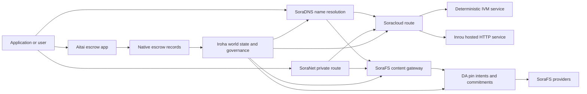

# SORA Nexus Үйлчилгээ {#sora-nexus-services}

SORA Nexus нь Iroha 3-ын эргэн тойронд апп руу чиглэсэн үйлчилгээний онгоцуудыг нэмдэг. Эдгээр үйлчилгээнүүд нь тусдаа блокчейн тэмдэглэлүүд биш юм. Тэд Iroha дэлхийн төлөв, Norito техникийн тунхаглал, засаглалын бичлэгүүд, болон Torii маршрут гэр бүлүүдээр баталгаажсан байдаг.

Боломжтой байдал нь зангилааны бүтэц ба сүлжээний профилээс хамаарна. Ашигла [`/openapi.json`](/mn/reference/torii-endpoints.md#app-and-sora-route-families) үйлдэл үүсгэгдсэн апп-ыг нээх API зорилтот зангилааны маршрутууд. Олон нийтэд зориулсан дотоод SoraFS CID Мөн сайн мэдэгдсэн маршрутууд тухайн үүсгэсэн баримт бичгийн гадна байрлуулсан тул байршуулалтыг шалгах үед эдгээр маршрутуудыг шууд судлаарай.

## Компонентын газрын зураг {#component-map}

|Өнгөт хэсэг|Үүрэг| Гол гадаргуу |
| ---------------------- | ------------------------------------------------------------------------------------------------------------------------------------------- | ---------------------------------------------------------------------------------------- |
| Soracloud              |Програм хангамжийн байршуулалт, зохион байгуулагдсан үйлчилгээ, хувийн загвар/гүйлгээний байдал, болон үйлчилгээний амьдралын мөчлөгийн удирдлага.| `/v1/soracloud/*`, `/api/*`, `iroha soracloud service ...` |
| Inrou | HTTP-ийн идэвхтэй давхарга шаарддаг үйлчилгээний хувилбаруудад зориулсан Soracloud-ийн байршуулсан HTTP гүйцэтгэх орчин. | Soracloud гүйцэтгэх орчны тохиргоо, хостын чадамжийн зарлал, replica-ийн гүйцэтгэх орчны төлөв |
| SoraNet                |Тооцоо, дамжуулагч тээвэр, хэлхээ, реле траффик, VPN, Холболтын сессүүд, стриминг чиглэлүүдийн нууцлал ба давхар давхарга.| `/v1/connect/*`, `/v1/vpn/*`, SoraNet чиглэл мэдээллийн мета өгөгдөл|
|Өгөгдөлд Хандах Боломж (DA)|Боломжийн нотолгоо, криптографийн амлалтын утга, ба Nexus гүйцэтгэлийн замууд, SoraFS техникийн танилцуулгууд, болон нотлох урсгалуудыг заасан ачааллын давхарга.| `/v1/da/*`, `FindDaPinIntent*`, `[nexus.da]` |
| SoraFS                 |Техникийн танилцуулга, CAR ачаа, наалдсан агуулга, гарцын таталт, авах чадварыг баталгаажуулах урсгалд зориулсан агуулга хаягаар хандсан хадгалах тор.| `/v1/sorafs/*`, `/sorafs/*`, `FindSorafsProviderOwner` |
| SoraDNS                |SORA-д байрлах үйлчилгээ ба агууламжийн хувьд тодорхойлогдсон нэршил ба шийдэгч баталгаажуулах давхарга.| `/v1/soradns/*`, `/soradns/*`, шийдвэрлэх лавлахуудын үйл явдлууд|
|Айтай|Программын түвшний фиат болон хөрөнгийн санхүүгийн гүйлгээний шийдвэрлэх коридор нь тусдаа блокчейн бүртгэлээр бус, нутгийн эскроу бүртгэлээр дэмжигдсэн.|`OpenAssetEscrow`, `FindAssetEscrow*`, `EscrowEventFilter`, Kotodama `escrow_*` суурилагдсан функцууд|



## Ердийн урсгалууд {#common-flows}

### Зочилсон Хуваагдсан Аппликейшн {#hosted-split-application}

Нэг жишээ холимог тэнхлэгийн програм бүх хэсгүүдийг хамтдаа ашигладаг:

1. Статик фронтэндийн нөлөөлөгч файлуудыг SoraFS-аар ороож, тогтоож тавьдаг.
2. Жишээлбэл, олон нийтийн хост `<app>.sora` нь SoraDNS-ээр дамжуулан бүртгэгдсэн байдаг.
3. Soracloud нь `/api/v1/search` эсвэл `/api/v1/stream` маршрутыг Inrou HTTP үйлчилгээ рүү чиглүүлдэг.
4. Soracloud замуудыг `/api/auth` ба `/api/v1/user` IVM тодорхойлогдсон гаргагчдад чиглүүлнэ.
5. Нууцлал шаардлагатай хэрэглэгчид SoraNet хэлхээгээр дамжуулан ижил агуулга эсвэл API маршрутад хүрч болно.

|Зам|Дэмжих хавтан|Яагаад|
| ----------------- | --------------------- | ------------------------------------------------- |
| `/`               | SoraFS статик агуулга |Дахин үйлдвэрлэж болох агуулгын үндэс ба үүдний кэшлэх|
| `/assets/*`       | SoraFS статик агуулга |Агуулгад суурилсан хөрөнгө ба техникийн шинжилгээний баталгаа|
| `/api/auth*`      | Soracloud IVM         |Дахин тоглуулах аюулгүй баталгаажуулалт ба түр санхүүгийн сорилтын төлөв|
| `/api/v1/user*`   | Soracloud IVM         |Удирдлагад мэдрэг төрийн хувирлууд|
| `/api/v1/search*` | Soracloud Inrou | Идэвхтэй HTTP үйлчилгээ, кэш, SSE эсвэл агрегаторын төлөв |

### Агуулга нийтлэх {#content-publication}

SoraFS хэвлэлт нь нэр нь тэднийг заагахаас өмнө тэсвэртэй бүтээлүүдийг үйлдвэрлэдэг:

1. Пэйлоад эсвэл директорыг бүтээ.
2. Үүнийг CAR архивт шахаж, хуваах төлөвлөгөө гарга.
3. Пин бодлого болон удирдлагын өгөгдөл бүхий Norito техникийн мэдэгдлийг боловсруулна уу.
4. Техникийн тайланг Torii-д илгээнэ үү.
5. Зорилтот профайл тодорхой нотолгоо шаардвал DA pin intent эсвэл хүртээмжийн амлалтыг бүртгэнэ.
6. Техникийн мэдэгдлийг SoraDNS нэр эсвэл Soracloud статик фронтэнд чиглүүлэлтэд холбох.

### Хувийн Fetch эсвэл Streaming чиглэл {#private-fetch-or-streaming-route}

SoraNet нь SoraFS эсвэл Soracloud-ын өмнө сууж болно:

1. Клиент нь нэр эсвэл техникийн тодорхойлолтыг шийддэг.
2. Хамгаалагчийн лавлагаа эсвэл маршрутын техник manifest нь орох ба гарах релэйг сонгодог.
3. Тээвэрлэг мэдээллийг нэмж боловсруулаад SoraNet хэлхээгээр дамжуулна.
4. Гарах холбоос нь SoraFS гарц, Torii урсгал эсвэл Soracloud чиглэлийн хүрдэг.

## Өвтгөдсөн {#aitai}

Aitai нь зах зээлийн хэв загвартай санхүүгийн гүйлгээний төлбөр тооцоог зохицуулах SORA апп коридор бөгөөд худалдан авагч ба худалдагч нь off-chain төлбөрийг зохицуулдаг Iroha сүлжээнд байгаа хөрөнгийн хадгалалтыг хянадаг. Шинэ тоон хөрөнгийн хадгалалтын урсгалд гэрээнд эзэмшигдэж буй хадгаламжийн дансны оронд уугуул зуучлалын зааврын гэр бүлийг ашиглах хэрэгтэй.

Native escrow нь хадгалалтыг блокчейн бүртгэл дээр хийдэг. Худалдагч `OpenAssetEscrow` ашиглан санал нээж, худалдан авагч хүлээн авч, off-chain төлбөрийг `AcceptAssetEscrow` ба `MarkEscrowPaymentSent` ашиглан тэмдэглэдэг, мөн худалдаалагч `ReleaseAssetEscrow`-оор чөлөөлдөг эсвэл төлбөр тэмдэглэгдэхээс өмнө цуцалдаг. Хэрэв худалдан авагч ба худалдаалагч санал нийлэхгүй бол аль аль тал маргаан нээж, `CanResolveEscrowDispute`-той шийдвэрлэгч түгжигдсэн дүнг хувааж болно.

Бүтэн амьдралын мөчлөгийг, ерөнхий хөрөнгийн түгжээ, нэрээ нууцалсан хадгаламж, асуулт, үйл явдал, болон Rust жишээг харахын тулд [Уугуул хөрөнгийн эскроу](/mn/blockchain/escrow.md) үзнэ үү.

|Айтай гадаргуу|Үүнийг ашиглаарай|
| ------------------------------------------------------------------------------------------------------------------------------------------------------------- | ----------------------------------------------------------------------------------------- |
| `OpenAssetEscrow`, `AcceptAssetEscrow`, `MarkEscrowPaymentSent`, `ReleaseAssetEscrow`, `CancelAssetEscrow`                                                    | Ил тод тоон хөрөнгийн санал, үүнд XOR-ээр нэрлэгдсэн санхүүгийн гүйлгээний төлбөрийн урсгалууд орно.|
| `OpenAnonymousAssetEscrow`, `AcceptAnonymousAssetEscrow`, `MarkAnonymousEscrowPaymentSent`, `ReleaseAnonymousAssetEscrow`, `CancelAnonymousAssetEscrow`       |Хамгаалагдсан саналууд нь санхүүжүүлэлт ба хаалтын хөдөлгөөнд нотлох баримтын хавсралтуудыг ашигладаг.|
| `OpenEscrowDispute`, `ResolveEscrowDispute`, `OpenAnonymousEscrowDispute`, `ResolveAnonymousEscrowDispute`|Маргааны оролт ба шүүхийн хэв маягийн шийдвэрлэл.|
| `FindAssetEscrowById`, `FindAssetEscrowsBySeller`, `FindAssetEscrowsByBuyer`, `FindAssetEscrowsByStatus`|Программын төлөв байдалын хуудсууд, нийлүүлэлтийн ажлууд, дэмжлэгийн хэрэгслүүд.|
| `EscrowEventFilter` |Эскроу ID, худалдагч, худалдан авагч, төлөв эсвэл үйл явдлын төрөлөөр ил тод эскроу захиалгуудын амьд байдлыг харуулна.|
| Kotodama `escrow_open_offer`, `escrow_accept`, `escrow_mark_payment_sent`, `escrow_release`, `escrow_cancel`, `escrow_open_dispute`, `escrow_resolve_dispute` | Kotodama гэрээ нь V1 хадгаламжийн системийн дуудлагуудаар дэмжигддэг. |

Олон нийтийн Taira эсвэл Minamoto хэрэглээнд зориулан, гадаад сүлжээний төлбөрийн суваг болон ямар нэгэн дэмжлэг эсвэл шүүхийн ажлын урсгалыг програмын бодлого гэж үзнэ. Iroha нь бичнэ хадгалах төлөв, амьдралын мөчлөгийн үйл явдлууд, нотлох баримтын криптографын хэшүүд, болон эцсийн хөрөнгийн шилжүүлэг; энэ нь бие даан бэлэн мөнгөний санхүүгийн гүйлгээг баталгаажуулдаггүй.

## Зорилтот занг шалгах {#check-a-target-node}

Энэ хуудсаас жишээ ашиглахын өмнө, та чиглүүлж буй зангилаанд чиглэлийн гэр бүл байдаг эсэхийг баталгаажуулна уу:

```bash
export TORII_URL=https://taira.sora.org

curl -fsS "$TORII_URL/openapi.json" \
  | jq '.paths | keys[] | select(test("^/v1/(soracloud|sorafs|soradns|connect|vpn|da)/"))'

curl -fsS -H 'Accept: application/json' "$TORII_URL/status" | jq .
```

`/openapi.json` нь ганц протокол-стандарт OpenAPI API төгсгөлийн цэг юм. Нарийн замын боломж нь бүтээцийн онцлог болон сүлжээний тохиргооноос хамаарна. Энэхүү баримт бичиг нь нийтийн орон нутгийн SoraFS CID болон сайн мэддэг маршрутуудыг жагсаагаагүй; эдгээр API төгсгөлийг доор дурдсан ёсоор шууд шалгаарай.

### Taira Зөвхөн унших зориулалттай утаа шалгалтууд {#taira-read-only-smoke-checks}

Олон нийтийн Taira API төгсгөл нь унших талын шалгалтуудад хэрэгтэй боловч, зөвшөөрөгдсөн данс ажиллуулж, олон нийтийн туршилтын сүлжээний төлөвийг өөрчлөхөөр санаархахгүй бол үүнийг өөрчлөлт оруулах жишээлэлтэнд битгий хэрэглэ.

```bash
export TORII_URL=https://taira.sora.org

curl -fsS -H 'Accept: application/json' "$TORII_URL/status" \
  | jq '{version: .build.version, peers, blocks, lanes: (.teu_lane_commit | length)}'

curl -fsS "$TORII_URL/v1/vpn/profile" \
  | jq '{available, relay_endpoint, supported_exit_classes}'

curl -fsS "$TORII_URL/v1/sorafs/storage/peers?limit=4" \
  | jq '{gateway_base_url, pin_torii_urls}'

curl -fsS -H 'Accept: application/json' "$TORII_URL/v1/soracloud/status" \
  | jq '.control_plane | {service_count, services: [.services[] | {service_name, current_version}]}'
```

Taira нь OpenAPI замын газрын зурагт жагсаагдаагүй байрлуулалтын тусгай хяналтын талын чиглэлийн маршрутуудыг илчилж болзошгүй. `/openapi.json`-ыг өөрт агуулагдах маршрутуудын үүсгэсэн гэрээ гэж үзээд, тэдгээрийг баримтжуулахын өмнө байрлуулалтын тусгай болон нийтийн локал SoraFS маршрутуудыг шууд баталгаажуул.

## Soracloud {#soracloud}

Soracloud бол SORA програмын хяналтын тэнхим юм. Энэ нь байрлуулалтын багц, үйлчилгээний шинэчилсэн хувилбарууд, чиглүүлэлт, тараалтын байдал, эрх бүхий тохиргооны бүртгэлүүд, шифрлэгдсэн үйлчилгээний нууцууд, загварын бүртгэлийн бичлэгүүд, хувийн дундчилсан хяналтын сессүүд, програм хангамжийн гүйцэтгэлийн орчны протоколын үр дүнгийн бичлэгүүдийг хянадаг.

Soracloud нь хоёр гүйцэтгэх тавцан ашигладаг:

|Гүйцэтгэлийн тэнхлэг|программ хангамжийн гүйцэтгэх орчин|Үүнийг ашиглана уу|
| ---------------------- | ------- | -------------------------------------------------------------------------------------------- |
| `DeterministicService` | `Ivm`   |Нэвтрэлт, хуримтлалын төлөв, батлагдсан уншилтууд, захиалгатай шуудангийн удирдлагууд, удирдлагад нөлөөтэй өөрчлөлтүүд|
| `HttpService`          | `Inrou` |Амьд HTTP APIs, цуглуулагч ихтэй ажил, кэштэй дэмжигдсэн үйлчилгээ, SSE, браузерын тусламжтай урсгалууд|

Хянах өнцөг эрх мэдэлтэй. Хуваарилах, шинэчлэх, буцалт хийх, тохиргоо, нууц, загвар, статус командыг Torii дээр дамжуулж, эцсийн дэлхийн төлвийг уншдаг; тэд тусдаа CLI-төхөөрөмжийн локаль хуурмаг дээр найдах шаардлагагүй. Нийтийн чиглүүлэлт нь хамгийн урт урьдчилсан тусгайлсан хэсгийг үндэслэдэг тул нэг бүртгэлтэй хост нь хостын HTTP чиглэлүүд болон тодорхой API чиглэлүүдийн хооронд траффикийг хувааж чадна.

### сарнисан аппын эхлүүлэх бүтэц үүсгэлээ {#scaffold-a-split-app}

Split-app загвар нь тогтмол frontend болон нэг зочилсон live API ба нэг тодорхойлогдсон vault/API үйлчилгээ үүсгэдэг:

```bash
iroha soracloud app init \
  --template split-app \
  --app-name solswap_indexer \
  --app-version 0.1.0 \
  --public-host solswap-indexer.sora \
  --output-dir ./apps/solswap-indexer

iroha soracloud app plan \
  --manifest ./apps/solswap-indexer/app_manifest.json

iroha soracloud app doctor \
  --manifest ./apps/solswap-indexer/app_manifest.json
```

`plan` маршрутын салалт, хүүхдийн үйлчилгээний техникийн жагсаалт, ажлын орчны скрипт замууд болон хүлээгдэж буй фронтенд нийтлэлийн горимыг хэвлэнэ. `doctor` Torii-г оролцуулахын өмнө орон нутгийн хувилбарын гэрээг баталгаажуулна.

### Программын төлөвийг байрлуулж, шалгах {#deploy-and-inspect-app-state}

Гаралтыг дахин турших бүрт нэг ирээдүйн SoraFS хадгалах үеийг дахин ашигла. Учир нь split-app загвар нь Inrou үйлчилгээг агуулдаг тул онлайн өөрчлөлтийн өмнө сонгосон офлайн нийлүүлэгч хадгалах газарт түүний яг ямар бүтээлийг байгаа эсэхийг шалга.

```bash
export SORACLOUD_TORII_URL=https://<soracloud-enabled-torii>
export SORAFS_RETENTION_EPOCH=<future-unix-seconds>

iroha soracloud app preseed \
  --manifest ./apps/solswap-indexer/app_manifest.json \
  --sorafs-retention-epoch "$SORAFS_RETENTION_EPOCH" \
  --inrou-preseed-target <validator-account,peer-id,absolute-store-path> \
  --inrou-preseed-max-capacity-bytes <bytes> \
  --inrou-preseed-helper /absolute/path/to/sorafs-node \
  --inrou-preseed-helper-sha256 <lowercase-sha256> \
  --receipt-out /absolute/path/to/solswap-inrou-preseed.json

iroha soracloud app release \
  --manifest ./apps/solswap-indexer/app_manifest.json \
  --sorafs-retention-epoch "$SORAFS_RETENTION_EPOCH" \
  --inrou-preseed-receipt /absolute/path/to/solswap-inrou-preseed.json \
  --torii-url "$SORACLOUD_TORII_URL"

iroha soracloud app status \
  --manifest ./apps/solswap-indexer/app_manifest.json \
  --torii-url "$SORACLOUD_TORII_URL"
```

Түгээлийн бодлогын шаардлагатай бүх үйлчилгээ үзүүлэгч дэлгүүрийн хувьд `--inrou-preseed-target`-ыг давтана. `release` нь техникийн гарын авлагуудыг бүтээж, синхрончилж, аппликешн эмчийг ажиллуулна, нэг протокол-стандарт аппликейшн-инфраструктурын мутацийг илгээж, эрх бүхий статусыг тааруулж, зарласан амьд зорилтуудыг баталгаажуулдаг. Апп нь Inrou бүтээлүүдийг агуулж буй үед preseed протоколын үр дүнгийн бичлэг нь сонголтгүй байна.

Өмнө нь байршуулсан үйлчилгээний хувьд үйлчилгээний цар хүрээтэй командуудыг ашиглана уу:

```bash
iroha soracloud service status \
  --service-name solswap_indexer_live \
  --torii-url "$SORACLOUD_TORII_URL"

iroha soracloud service rollback \
  --service-name solswap_indexer_live \
  --target-version 0.1.0 \
  --torii-url "$SORACLOUD_TORII_URL"
```

### Тохиргоо ба нууц материал {#config-and-secret-material}

Soracloud тохиргоо ба нууц оруулгууд нь эрх бүхий суулгалтын төлөвийн хэсэг юм. Шаардлагатай тохиргоо эсвэл нууц холбоосууд байхгүй эсвэл идэвхтэй техник хэрэгслийн баримт бичгүүдтэй нийцэхгүй бол суулгах, шинэчлэх, буцаах ажиллагаа хаалттай алдаа өгдөг.

```bash
iroha soracloud service config-set \
  --service-name solswap_indexer_live \
  --config-name indexer/public_config \
  --value-file ./config/public-config.json \
  --torii-url "$SORACLOUD_TORII_URL"

iroha soracloud service secret-set \
  --service-name solswap_indexer_live \
  --secret-name indexer/api_key \
  --secret-file ./secrets/api-key.envelope.json \
  --torii-url "$SORACLOUD_TORII_URL"
```

Таны профайлд шаардлагатай нарийн нэвтрэх тэмдэглэгээг олоход CLI тусламжийг ашигла.

```bash
iroha soracloud service config-set --help
iroha soracloud service secret-set --help
```

## Inrou {#inrou}

Inrou нь Soracloud ашигладаг зохион байгуулагдсан HTTP програм хангамж гүйцэтгэх орчин юм. Iroha зангилаа нь оруулсан Soracloud програм хангамж гүйцэтгэх орчныг ашиглан Soracloud-ийг төсөөлдөг орон нутгийн материалжуулалтын төлөвлөгөөнд шилжүүлж, хатуулагдсан үйлчилгээний хуулбаруудыг давталтын үйлчилгээ болгон ажиллуулж, хуулбарын програм хангамжийн гүйцэтгэлийн орчны байдлыг эрх бүхий загварт буцаан мэдээлнэ.

Иж бүрэн ажиллах шаардлагатай HTTP гадаргуутай ачаалалд Inrou-г ашиглана уу, жишээлбэл их цуглуулагчтай APIs, SSE урсгалууд, кэшээр дэмжигдсэн удирдлагууд, эсвэл хөтөчөөр дэмжигдсэн үйлчилгээ.

### програм хангамжийн гүйцэтгэх орчны шаардлагууд {#runtime-requirements}

- Контейнерын техникийн манифестын програм хангамжийн гүйцэтгэлийн орчин нь `Inrou` байх ёстой.
- Үйлчилгээний техникийн манифест гүйцэтгэх тэнхим `HttpService` байх ёстой.
- `HttpService + Inrou` зөвхөн нэг `PersistentRootLeaseVolume`-г `/`-д суурилуулсан байх ёстой.
- Давхарласан Inrou үйлчилгээ нь өөрчлөгдөж болох нийтлэг төлөвийг хадгалах үед нийтлэг үйлчилгээ эсвэл нууц түрээсийн санг хэрэгтэй болдог.
- Үйлдвэрлэлийн хостингийн зангилаанууд зөвхөн прокси болж ажиллахын оронд бодит Inrou хүчин чадлаа сурталчлах ёстой.

### техникийн манифестийн хэсэг {#manifest-fragment}

Доорх жишээ нь хоёр техник гарын авлагын хэлбэрийг харуулж байна. Энэ нь фрагмент бөгөөд бүрэн байршуулалтын багц биш юм.

```jsonc
// container_manifest.json
{
  "schema_version": 1,
  "runtime": { "runtime": "Inrou", "value": null },
  "bundle_path": "/bundles/solswap-indexer.inrou",
  "entrypoint": "/app/bin/launch-indexer.sh",
  "args": [],
  "env": {
    "RUST_LOG": "info",
  },
  "inrou": {
    "schema_version": 1,
    "guest_os": { "guest_os": "DebianSlim", "value": null },
    "guest_images": {
      "x86_64": {
        "kernel_image_path": "/inrou/x86_64/vmlinux",
        "rootfs_image_path": "/inrou/x86_64/rootfs.ext4",
        "initrd_image_path": null,
      },
      "aarch64": {
        "kernel_image_path": "/inrou/aarch64/vmlinux",
        "rootfs_image_path": "/inrou/aarch64/rootfs.ext4",
        "initrd_image_path": null,
      },
    },
  },
  "lifecycle": {
    "start_grace_secs": 60,
    "stop_grace_secs": 30,
    "healthcheck_path": "/api/indexer/v1/health",
  },
}
```

```jsonc
// service_manifest.json
{
  "schema_version": 1,
  "service_name": "solswap_indexer_live",
  "service_version": "0.1.0",
  "execution_plane": { "execution_plane": "HttpService", "value": null },
  "replicas": 2,
  "route": {
    "host": "solswap-indexer.sora",
    "path_prefix": "/api/v1/search",
    "service_port": 8080,
    "visibility": { "visibility": "Public", "value": null },
    "tls_mode": { "tls": "Required", "value": null },
  },
  "lease_volumes": [
    {
      "volume_name": "root_disk",
      "kind": {
        "lease_volume": "PersistentRootLeaseVolume",
        "value": null,
      },
      "storage_class": { "storage_class": "Warm", "value": null },
      "mount_path": "/",
      "max_total_bytes": 8589934592,
    },
    {
      "volume_name": "index_state",
      "kind": { "lease_volume": "ServiceLeaseVolume", "value": null },
      "storage_class": { "storage_class": "Warm", "value": null },
      "mount_path": "/var/lib/solswap-indexer",
      "max_total_bytes": 1073741824,
    },
  ],
}
```

Програм хангамжийн гүйцэтгэх орчинд, холбогдсон бүх түрээсийн багтаамжийг багтаамжийн нэрээс үүдэлтэй орчны хувьсагчуудаар дамжуулан ил болгож өгдөг:

```text
SORACLOUD_LEASE_VOLUME_ROOT_DISK_DIR
SORACLOUD_LEASE_VOLUME_ROOT_DISK_MOUNT_PATH
SORACLOUD_LEASE_VOLUME_INDEX_STATE_DIR
SORACLOUD_LEASE_VOLUME_INDEX_STATE_MOUNT_PATH
```

## SoraNet {#soranet}

SoraNet нь нууцлал ба тээврийн давхарга юм. Энэ нь зорилтот гарц эсвэл үйлчилгээтэй шууд холбогдож болохгүй тээвэрлэлтэд дамжуулах замыг өгдөг. Тээврийн загвар нь оролт, дунд болон гарах дамжуулагчийн үүргийг ашигладаг, QUIC тээвэрлэлт, дуу чимээ дээр суурилсан холимог гараа өгөх арга, чадварын тохиролцоо, дамжуулагчийн лавлах мета өгөгдөл, болон тогтмол хэмжээтэй дүүргэлттэй эсүүдийг ашигладаг.

Nexus суулгалтуудад, SoraNet нь агуулга таталт, шлюзийн траффик, VPN эсвэл Connect сессүүдийг болон Norito стрийминг маршрутуудыг дамжуулах боломжтой. Тушаалын нэрс нь `norito-stream`-ыг дэмждэг релейүүдийг тэмдэглэх боломжтой, энэ нь клиентүүдэд Torii RPC эсвэл стрийминг траффикт тохирсон маршрутыг илүүд үзэх боломжийг олгодог.

### Өгөдөл дамжуулах тохиргоо {#streaming-configuration}

Nexus профайл нь урсгал чиглэлийн хувьд SoraNet нийлүүлэлтийг идэвхжүүлдэг:

```toml
[streaming]
feature_bits = 0b11

[streaming.soranet]
enabled = true
exit_multiaddr = "/dns/torii/udp/9443/quic"
padding_budget_ms = 25
access_kind = "authenticated"
provision_spool_dir = "./storage/streaming/soranet_routes"
provision_spool_max_bytes = 0
provision_window_segments = 4
provision_queue_capacity = 256
```

Харагчийн нэвтрэлт шаарддаггүй агуулгын маршрутуудыг ашиглахад `access_kind = "read-only"`-ыг ашиглана уу. Гарах дамжуулагч нь Torii эсвэл зочлох үйлчилгээ рүү холбохоос өмнө тасалбар эсвэл харагчийн идентификийг шаарддаг бол `authenticated`-ийг ашиглана уу.

### SoraNet-Мэдэрсэн SoraFS Өгөх {#soranet-aware-sorafs-fetch}

Тэр SoraFS аваад ирэх CLI ороны прокси техникийн тэмдэглэл дамжуулах ба ээлжинд оруулах боломжтой SoraNet хөтчийн өргөтгөлүүдийн маршрут метадан SDK адаптерууд. Оркестратор JSON тодорхойлох ёстой `local_proxy` хамт `"emit_browser_manifest": true`, мөн CLI бүтээх ёстой `local-quic-proxy` туслах. Нэвтрэх Taira,  нийтэд зориулсан тестнет үндсэн дээр батлагдсан үйлчилгээ үзүүлэгчийн каталогийг шалгах, дараа нь тухайн ханган нийлүүлэгчид олгогдсон хамгаалагдсан ханган нийлүүлэгчийн tuple-г бөглөнө:

```bash
export TAIRA_ROOT=https://taira.sora.org
curl -fsS "$TAIRA_ROOT/v1/sorafs/providers?limit=20" | jq '.providers'

: "${TAIRA_SORAFS_PROVIDER_ID:?set the admitted provider ID from Taira discovery}"
: "${TAIRA_SORAFS_GATEWAY_KEY:?set the provider gateway key}"
: "${TAIRA_SORAFS_PROVIDER_URL:?set the advertised provider base URL}"
: "${TAIRA_SORAFS_STREAM_TOKEN_FILE:?set the issued stream-token file}"

cargo run -p sorafs_orchestrator --features=local-quic-proxy --bin=sorafs_cli -- \
  fetch \
  --plan=artifacts/payload_plan.json \
  --manifest-id=<manifest-digest-hex> \
  --orchestrator-config=artifacts/orchestrator.json \
  --provider=name=taira,provider-id="$TAIRA_SORAFS_PROVIDER_ID",gateway-key="$TAIRA_SORAFS_GATEWAY_KEY",base-url="$TAIRA_SORAFS_PROVIDER_URL",stream-token="$(cat "$TAIRA_SORAFS_STREAM_TOKEN_FILE")" \
  --output=artifacts/payload.bin \
  --json-out=artifacts/fetch_summary.json \
  --local-proxy-manifest-out=artifacts/proxy_manifest.json \
  --local-proxy-mode=bridge \
  --local-proxy-norito-spool=storage/streaming/soranet_routes \
  --local-proxy-kaigi-spool=storage/streaming/soranet_routes \
  --local-proxy-kaigi-policy=authenticated \
  --max-peers=2 \
  --retry-budget=4
```

Нийтлэл бүртгэлийн үйлчилгээ үзүүлэгчийн тайлан, хэсэг протоколын үр дүнгийн бүртгэлүүд, локал прокси метадата, болон татаж авахад хэрэглэгдсэн үр дүнтэй маршрутын тохиргоонууд.

### Дамжуулгын Урамшууллын Баталгаажуулагчийн Жагсаалт {#relay-incentive-verifier-roster}

Давтамж урамшууллын хэрэглээ нь амжилтгүй хаалттай байна. Хэрэв `incentives.enable` үнэн бол, `incentives.trusted_verifier_ids` нь дор хаяж нэг протокол-стандарт дансны ID агуулсан байх ёстой. Бүртгэл нь 64-аас хэтрэх ёсгүй. орлуулгууд, урамшууллыг идэвхгүй болгосон ч гэсэн. Программ хангамжийн гүйцэтгэх орчин үүнийг тодорхой дараалалтай багцаар хадгалж, дамжуулгын эхлүүлэх үед хүчинтэй бус бүртгэлийн геометрийг татгалздаг.

Тус бүр `RelayBandwidthProofV1` нь тогтсон хүрээ/хуваарилалтын төсвийн дагуу тайлагнаж, бүх хүрээг хэрэглэж дуусгах ёстой. Баталгааны шалгагчийн данс нь тохируулах жагсаалтад байх ёстой бөгөөд `RelayBandwidthProofV1::verify_signature()` амжилттай болох ёстой, үүний дараа л дамжуулагч нь гүйцэтгэлийн хуримтлагчийг түгжих эсвэл өөрчлөх боломжтой. Итгэлийн бус криптографийн гарын үсэгч эсвэл гарын үсэг хүчин төгөлдөр бус/зөрчигдсөн баримт нотолгоо нь хэмжилтэнд хувь нэмэр оруулахгүй бөгөөд урамшууллын зурган таталтыг үйлдвэрлэж чадахгүй.

## Өгөгдөлд Хандах Боломж (DA) {#data-availability-da}

DA нь дэлхийн төлөвт шууд хадгалахад хэт том, нууцлалын хувьд хэт эмзэг эсвэл үйлчилгээнд хэт онцгой ачааллын хүртээмжийг нотлох давхарга юм. Энэ нь эцэслэгдсэн амлалт болон сэргээх хүсэлтийг бүртгэснээр баталгаажуулагч, gateway үйлчилгээ үзүүлэгч болон хэрэглэгчдэд ямар байт амлагдсан, ямар бодлого мөрдөгдсөн, ямар нотолгоо ажиглагдсан талаар нэгдсэн ойлголт өгнө.

DA нь Kura эсвэл SoraFS-ийг орлуулдаггүй:

- Kura эцэслэн батлагдсан блокийн урсгал болон консенсус сэргээх өгөгдлийг хадгалдаг.
- SoraFS нь агуулгаар хаягласан байт, CAR ачаалал болон манифестыг хадгалж, түгээнэ.
- DA криптографийн амлалтын утгууд, баталгааны бодлогын баримтууд, баталгааны нээлтүүд, мөн тэдгээр байтуудыг хуваарилах, аудит хийх, блокчэйн бүртгэлийн төлөвт холбоход ашиглагддаг пин санаануудыг бүртгэдэг.

Програм эсвэл Nexus гүйцэтгэлийн зурвас блокчэйн дансанд харагдахуйц амлалт шаарддаг бөгөөд офф-чейн мэдээллийг сэргээж болох хэвээр байх ёстой тохиолдолд DA-ыг ашиглана уу. Ердийн жишээнүүдэд санхүүгийн гүйлгээ шийдвэрлэх урсгалын гүйцэтгэлийн зурвасын ачаа нууцлалын баталгааны утгууд, нийтлэгдсэн контентод зориулсан SoraFS PIN санаанууд орно, дараа нь баталгаажуулалт хийхээр хадгалах ёстой нотлох баримтын багцууд, мөн олон нийтэд ил байх төлөв нь бүрэн өгөгдлийг биш криптографийн товлосон утга байх ёстой хэрэглээний объектууд.

### Амьдралын мөчлөг {#lifecycle}

|Талбай|Юу бичигдсэн бэ|
| ---------- | ----------------------------------------------------------------------------------------------------------------------------------------------------- |
|Өрнөл|Тасалбар, техникийн гарын авлагын лавлагаа, овог нэр, зам/эпох/дарааллын лавлагаа, хадгалах бодлого, эсвэл давталтын зорилго.|
| Амлалт | Манифест, эгнээний ачаалал, нотолгооны багц эсвэл агуулгын үндсийг бүртгэлд харагдах бичлэгтэй холбодог хураангуйн материал. |
|Баримт|Боломжийн санал, нотлох материал гаргах, үйлчилгээ үзүүлэгчийн баталгаа, эсвэл зорилтот сүлжээ хүлээн зөвшөөрсөн бусад профайл тодорхой нотолгоо.|
|Асуулт| `FindDaPinIntentByTicket`, `FindDaPinIntentByManifest`, `FindDaPinIntentByAlias`, эсвэл `FindDaPinIntentByLaneEpochSequence` гэсэн хэсгүүдийг дамжуулан Pin-зориулалт хайлт.|

DA-д тулгуурласан нийтлэлийн ердийн урсгал:

1. WSV-ээс гадуур ачааллыг үүсгэх эсвэл хүлээн авна. Жишээлбэл SoraFS CAR файл эсвэл Nexus гүйцэтгэлийн эгнээний ачаалал байж болно.
2. Ачааллын хэшийг тооцоолж, Norito манифест эсвэл route-д зориулсан амлалтын бүртгэлээр тодорхойлно.
3. Тухайн route-ийн бүлэг идэвхтэй бол манифест, pin intent эсвэл амлалтыг `/v1/da/*`-аар, эсвэл сүлжээний гарын үсэгтэй гүйлгээний замаар илгээнэ.
4. Идэвхтэй нотолгооны бодлогод шаардсан баримтыг баталгаажуулагчид эсвэл хүртээмжийн үйлчилгээ үзүүлэгчдээр цуглуулна.
5. Ачааллаас хамаарах alias, тооцоо нийлэх нотолгоо эсвэл gateway route-ийг идэвхжүүлэхээсээ өмнө үүссэн pin intent эсвэл амлалтыг асуулгаар шалгана.

### Алгоритмын загвар {#algorithmic-model}

DA нь ачааллыг гарын үсэгтэй, replay халдлагаас хамгаалсан, блокоор индексжүүлсэн амлалт болгон хөрвүүлнэ. Алгоритмууд нь детерминистик тул баталгаажуулагч болон gateway ижил байтаас ижил хураангуйг дахин тооцоолж чадна.

1. **Илгээсэн ачааллыг каноник хэлбэрт оруулах.** Torii нь `(lane_id, epoch, sequence)`, ачааллын байт, шахалтын мета өгөгдөл, chunk-ийн хэмжээ, устгалын профайл, хадгалалтын бодлого болон илгээгчийн гарын үсэгтэй ingest хүсэлтийг хүлээн авна. Зангилаа шаардлагатай үед gzip, deflate эсвэл Zstandard ачааллыг задлаад, каноник байтын урт `total_size`-тай тэнцүү эсэхийг шалгана.
2. **Эгнээ ба chunk-ийн параметрийг шалгах.** Эгнээ нь Nexus-ийн эгнээний каталогт байх ёстой. `chunk_size` нь тэг биш хоёрын зэрэг, дор хаяж хоёр байт, тохируулсан дээд хэмжээнээс ихгүй байна. Устгалын профайл нь өгөгдлийн shard болон дор хаяж хоёр parity shard агуулна. Эгнээний каталог нь `merkle_sha256` эсвэл `kzg_bls12_381` нотолгооны схемийг сонгоно.
3. **Сүлжээний бодлогыг хэрэгжүүлэх.** Зангилаа blob-ийн ангилалд тохируулсан replication болон retention суурь бодлогыг мөрдүүлнэ. Нийтийн мета өгөгдөл ил текст хэвээр байна; зөвхөн удирдлагад зориулсан мета өгөгдлийг манифестад бичихээс өмнө зангилаанд тохируулсан удирдлагын мета өгөгдлийн түлхүүрээр шифрлэнэ.
4. **Chunk болгон хувааж амлалт тооцох.** Каноник ачааллыг `chunk_size`-аас гаргасан тогтмол хэмжээтэй профайлаар хуваана. Torii ачааллын хураангуй, сэргээгдэх байдлын нотолгооны модны үндэс болон chunk тус бүрийн амлалтыг тооцно. Өгөгдлийн chunk нь байтууд дээрээ тооцсон BLAKE3 амлалт агуулна.
5. **Erasure амлалтыг нэмэх.** Chunk-үүдийг `data_shards` хэмжээтэй stripe болгон бүлэглэнэ. Сүүлчийн stripe-д дутуу нүдийг parity тооцоход зориулан тэгээр дүүргэнэ. RS(16) parity нь мөр/глобал parity shard үүсгэнэ; сонголттой `row_parity_stripes` нь матриц дагуу багана хэлбэрийн stripe parity нэмнэ. Parity shard-ийн амлалт нь little-endian `u16` тэмдэгтүүдийн BLAKE3 хураангуй байна.
6. **Манифест байгуулах.** `DaManifestV1` нь эгнээ, epoch, blob-ийн ангилал, codec, ачааллын хураангуй, chunk-ийн үндэс ба хэмжээ, устгалын профайл, хадгалалтын бодлого, түрээсийн үнийн санал, chunk-ийн амлалтууд, сонголттой IPA амлалт, мета өгөгдөл болон гаргасан цагийг бүртгэнэ. Хадгалалтын тасалбар нь детерминистик: зангилаа эхлээд хоосон ticket-тэй манифестын загварын хэшийг тооцоод, уг fingerprint-ийг эцсийн `storage_ticket` болгон буцааж бичнэ.
7. **Replay зөрчлийг татгалзах.** Replay түлхүүр нь `(lane_id, epoch, sequence, manifest_fingerprint)`. Ижил fingerprint-тэй давхардал идемпотент. Хуучирсан sequence эсвэл өөр fingerprint-тэй ижил sequence-ийг татгалзана.
8. **Гарын үсэгтэй артефакт гаргах.** Torii PDP амлалтыг тооцож, `DaIngestReceipt`-д гарын үсэг зурж, `DaCommitmentRecord` байгуулна. Манифест, PDP амлалт, амлалтын бүртгэл ба хуваарь, pin intent, протоколын үр дүнгийн бүртгэлийн файл болон логийг spool артефакт болгон бичнэ. Протоколын үр дүнгийн бүртгэлийн cursor `(lane_id, epoch)` бүрт нэгэн жигд өснө.

Блок нь амлалтын бүртгэлүүдийг агуулна. Бүртгэл дараах зүйлсийг холбоно:

- эгнээ, epoch болон sequence
- дуудагчийн blob ID ба каноник манифестын хэш
- эгнээний нотолгооны схем
- chunk-ийн үндэс
- KZG эгнээнд зориулсан сонголттой KZG амлалт
- PDP/нотолгооны хураангуй
- хадгалалтын ангилал ба хадгалалтын тасалбар
- Torii DA хүлээн авсны гарын үсэг

Блок DA бичлэгүүдийг оруулахын өмнө, блок угсралтын зам багцыг шалгана:

- `(lane_id, epoch, sequence)` багцын дотор давтагдашгүй байх ёстой.
- техникийн манифестын криптографийн хэшууд нь тэг биш, багц дотор давтагдашгүй байх ёстой.
- Криптографийн баталгааны үнэ утгын баталгааны схемийг тохируулагдсан гүйцэтгэх эгнээний бодлоготой нийцүүлэх ёстой.
- Merkle эгнээ KZG амлалтыг татгалзана; KZG эгнээ тэгээс ялгаатай KZG амлалт шаардана.
- Пин зорилтуудыг каноникжуулж, эрэмбэлж, гүйцэтгэлтийн зам, техникийн мэдүүлгийн криптограф хэш, хадгалах тасалбар, эзэмшигчийн данс, болон нэршлийн зөрчил дүрмээр шүүх болно.

Блокын гарчиг нь DA баталгааны бодлогын криптографийн хэшүүд, криптографийн амлалтын утгууд, түгжээгийн зориулалтын утгуудыг хадгалдаг. Гишүүнчлэлийн баталгаа үүсгэхэд криптографийн амлалтын утгын багц нь мөн нэг протоколын стандартын криптографийн хэшүүд болох навч бүхий Меркле үндсийг ил болгодог. Norito-кодлогдсон `DaCommitmentRecord` утгууд. Эцэг зангилаанууд зүүн ба баруун хүүхдүүдийг нийлүүлсэн криптографийн хэшийг гаргадаг; гуйвшгүй навчис дараагийн давхаргад өөрчлөлтгүйгээр шилждэг.

### Өгүүллийн баталгаажуулалт {#proof-verification}

`/v1/da/commitments/prove` нь нэг криптографын амлалтын утгын баталгааг блок дотор гаргаж өгч чадна. Баталгаанд криптографын амлалтын утга, блокийн өндөр, багц доторхи индекс, багцын криптографын хэш, багцын урт, Меркелийн үндэс, болон эгч дүүгийн зам орсон байна. Шалгалт дараах зүйлсийг баталгаажуулна:

1. Нотлох багцын криптографийн хэш нь блокын гарын авлагын DA хатуулаг утгын криптографийн хэштэй нийцэж байна.
2. Нотлох блокийн өндөр иш татсан блокын толгойн өндөртэй таарч байна.
3. Индекс нь хязгаарт багтсан ба криптографийн амлалтын утга нь тухайн индекс дээрх багцын бичлэгтэй тэнцүү байна.
4. Гүйцэтгэх эгнээн баталгаажуулах бодлого нь криптографийн амлалт утгыг хүлээн авдаг.
5. Криптографийн амлалтын утгын навчнаас ах дүүгийн замыг эвхсэнээр өгөгдсөн үндсийг сэргээнэ.
6. Сэргээн босгосон уг язгуур багц язгууртай тэнцнэ.

Энэ нь тодорхой нэг нөөцийн криптографийн амлалтын утга тодорхой нэг блокийн өгөгдөлд орсон болохыг нотолж байна; энэ нь бүх хуулбар одоогоор онлайн байгаа гэдгийг нотлохгүй. Амьд сэргээж авах боломжийг SoraFS ханган нийлүүлэгчийн таталтууд, PDP/PoTR шалгалтууд, эсвэл хэрэглэгчийн тодорхой профайлд зориулсан боломжийн нотолгоогоор тусад нь шалгадаг.

### Өнцөг тохиролцоны харилцаа {#consensus-interaction}

Тохиролцоо ачааллын хүртээмж заавал байх ёстой, гэхдээ энэ нь хоёрдугаар эцсийн протокол биш юм. Удирдагч гарын үсэг зурсан `PayloadManifest`-ийг бүрэн `3f + 1` хороонд дамжуулна. Эхний бие болон RS16 хэсгийн давтамжийн зорилт нь А багт чиглэж, түүний `2f + 1` гишүүд нь удирдагч ба төлөөлөгчийн сүүлээс бүрдэнэ. Хязгаарлагдмал ижил үзэл бодлын дахин дамжуулалт нь бие болон хэсгийн үйлчилгээний хүрээг бүх хороо руу өргөтгөнө.

Техникийн илэрхийлэл эсвэл хэсэгчилсэн салангид хэсгүүдийн багц саналаа өгөхөд хангалтгүй. Бэлтгэхээс өмнө, бүх баталгаажуулагч нь хэсгүүдийг баталгаажуулж, бүрэн нэг протоколын стандарт биеийг сэргээх ёстой, түүний уртыг, үндсэн хэсэг болон биеийн криптографын хэшийг баталгаажуулж, тэр биеийг хадгалж, детерминист блокийг баталгаажуулах процессыг дуусгах. Баталгаажуулагч нь CommitQC програм эсвэл баталгаажсан сэргээн засварлах аргаар яг ижил биеийг хадгална.

Сүлжээний хамтрагч бичиг баримтын биеийг авахын өмнө сертификатыг мэдсэн тохиолдолд эхлээд сертификатын криптографийн гаргагчдаас баталгаажуулсан хэсгүүд эсвэл ганц протоколын стандарт биеийг хүсдэг, дараа нь сэргээн засах процессыг хөлдсөн хороо руу өргөжүүлдэг. Бүх хариулт нь яг өндөр контекст, санал болгох тойрог, техник manifest болон биеийн сэдэвтэй холбогдсон хэвээр байна. Тухайн блок нь зөвхөн орон нутгийн дахин бүтээсэн бие нь гэрчилгээнд нийцсэн үед л хэрэглэгддэг.

### Үйл ажиллагааны тэмдэглэл {#operator-notes}

Iroha 3 эв санааны илтгэлийн профайлуудад үргэлж техникийн гарын үсэг бүхий гарчиг болон RS16 ачааны тараалт, Prepare-ийн өмнөх бүрэн биеийн баталгаажуулалт, DA багцын баталгаажуулалт, хязгаарлагдмал сэргээх телеметри багтдаг. Талбарын зохион байгуулалт болон протоколын хязгаарууд гарын үсэг зурсан өндөр контекстэд хадгалагдсан; тэдгээрийг идэвхгүй болгох эсвэл дахин тодорхойлох боломжтой локал шилжүүлэг эсвэл хугацааны хязгаарын профайл байхгүй. Node-д орон нутгийн блок болон дарааллын хязгаарууд нь deployment-ийн гарын үсэг зурсан зохион байгуулалт болон ажлын ачаалалд тохирсон байх шаардлагатай.

Замын хайлтыг хийхийн тулд, үүний эхлэлд нодын OpenAPI баримт бичгээс эхэл:

```bash
curl -fsS "$TORII_URL/openapi.json" \
  | jq '.paths | keys[] | select(startswith("/v1/da/"))'
```

Одоогийн DA асуулгын нэрэнд [асуултын лавлагаа](/mn/reference/queries.md#nexus-data-availability-and-packages)-ийг ашиглаарай, мөн програмын түвшний `[nexus.da]` оруулалт, сорьцлолт, аудит, болон сэргээх хязгааруудын хувьд [сүлжээний хөршийн тохиргооны загвар](/mn/reference/peer-config/)-ийг ашиглах ба орон нутгийн Sumeragi блок болон эгнээн хязгааруудыг оруулна.

## SoraFS {#sorafs}

SoraFS нь төвлөрсөн бус агуулгаад хаягласан хадгалах бүтэц юм. Энэ нь битүүдийг тодорхойлогдсон хэсгүүд, CAR архивууд, мөн агуулгын үндсүүд, хэсгүүдийн профайл, тогтмол бодлогын дүрэм болон удирдлагын баталгаануудыг холбодог Norito техникийн мэдүүлгүүд болгон багцалдаг. Хадгалах үйлчилгээ үзүүлэгчид багтаамж, агуулгын хүртээмжийг сурталчилдаг бол гейтуэйүүд агуулгыг түгээхээс өмнө техникийн жагсаалт болон хэсэг тус бүрийн криптографийн баталгааны утгыг шалгадаг.

Ердийн SoraFS ашиглалт нь статик програмын хөрөнгүүд, баримт бичгийн бүтээлүүд, бүсийг оруулна багц, загвар эсвэл хиймэл бүтээлийн лавлагаа, болон удирдлагын нотлох баримтын багц. Тэд Iroha өгөгдлийн загвар ил гаргадаг SoraFS хаалга үүсгэх арга хэмжээ болон а [`FindSorafsProviderOwner`](/mn/reference/queries.md#nexus-data-availability-and-packages) үзүүлэгчийн эзэмшлийн шийдвэр гаргах талаар лавлагаа хийх.

### Taira Туршилтын сүлжээний профайл {#taira-testnet-profile}

Taira нь ганц протокол-стандарт олон нийтийн SoraFS туршилтын сүлжээ юм. Үүний шалгасан баталгаажуулагчийн профайл нь `fc56984b-2be7-431d-840e-21514d1883f0` сүлжээ болон `369` сүлжээ ялгааг ашигладаг. Доорх `NetworkId` нь одоогийн тогтоосон Taira блокчэйн үүсгэгчийн яг таг таних мэдээлэл юм. Taira дахин тохиргоо нь хэлхэлийн шошгыг хадгалахтайгаа зэрэгцэн криптографын хэшийг өөрчлөх боломжтой, тиймээс үүнийг одоогийн гарын үсэг зурсан байрлуулалтын профилаас шинэчилж, хэлхээнээс UUID хэрхэн үүсгэгдсэнийг хэзээ ч бүү ав. Taira-ын үр дүнтэй SoraFS тохиргоонууд нь:

- сүлжээний ID: `hash:82531CE8EAE8BFF6BEECA4698BFD13A3BC8BEC5F0EE0D23D428C97FC17AB0F3B#3E94`
- гарцын бааз URL: `https://taira.sora.org`
- пин Torii URLs: `https://taira-validator-1.sora.org`-аас `https://taira-validator-4.sora.org` хүртэл
- нээлтийн боломжууд: `torii_gateway`, `chunk_range_fetch`, ба `potr_mldsa`
- тусгаарлагдсан агуулгын гарал үүсэл: `https://{cid}.sorafs.taira.sora.org/{path}`
- нийтийн пин бодлого: зөвшөөрөлгүй ба төлбөр шаардлагатай, `require_council_signatures = false` -тэй

```toml
[sorafs.storage]
enabled = false
max_capacity_bytes = 13743895347

[sorafs.discovery]
discovery_enabled = true
known_capabilities = ["torii_gateway", "chunk_range_fetch", "potr_mldsa"]

[sorafs.discovery.admission]
envelopes_dir = "configs/soranexus/taira/sorafs_admission"
trusted_council_keys = ["REPLACE_WITH_TAIRA_SORAFS_COUNCIL_PUBLIC_KEY"]
signature_threshold = "REPLACE_WITH_TAIRA_SORAFS_COUNCIL_SIGNATURE_THRESHOLD"

[sorafs.discovery.publish]
gateway_base_url = "https://taira.sora.org"
pin_torii_urls = [
  "https://taira-validator-1.sora.org",
  "https://taira-validator-2.sora.org",
  "https://taira-validator-3.sora.org",
  "https://taira-validator-4.sora.org",
]

[sorafs.gateway]
require_manifest_envelope = true
enforce_admission = true
enforce_capabilities = true

[sorafs.gateway.untrusted_hosting]
enabled = true
path_gateway_redirect = true
redirect_html_only = true

[sorafs.gateway.untrusted_hosting.cid_host_suffixes]
live = "sorafs.sora.org"
taira = "sorafs.taira.sora.org"

[sorafs.repair]
enabled = false
claim_ttl_secs = 900
heartbeat_interval_secs = 60
max_attempts = 3
worker_concurrency = 4

[sorafs.gc]
enabled = false
interval_secs = 900
max_deletions_per_run = 500
retention_grace_secs = 86400

[gov.sorafs_pin_policy]
require_council_signatures = false
```

Гурван дээд түвшний гарцын утгууд нь өвлөгдсөн хаалт-амжилтгүй суурь утгууд юм; ишлэлд байгаа бусад бүх утгууд нь Taira-ын баталгаажуулсан профайлд тодорхой заасан байна. Үйлдүүлэгчийг нээх-оролтын байршуулалтыг гарын үсэг зурсан суурилуулалтын материалыг орлуулах ёстой. Үйлчлүүлсэн хүсэлт бүр нь техникийн мөрийн мэдээллийн савыг агуулж, үйлчилгээ үзүүлэгчийн оролтыг дамжин өнгөрч, зар сурталчилсан чадварыг ашиглах ёстой.

Taira баталгаажуулагчид SoraFS хадгалах, засварлах, хог цэвэрлэх боломжийг хаасан байна. Тэдний тохируулсан багтаамж баталгаажуулагчийн хэсэг хэвээр байна диск-тийн төсвийн шалгалт; энэ нь баталгаажуулагч нь санах ойн үйлчилгээ үзүүлэгч гэсэн үг биш юм. Туршилтын өмнө одоогийн тохируулагдсан гарц ба pin зорилгуудыг уншихын тулд `GET /v1/sorafs/storage/peers?limit=4`-г ашиглана уу.

Taira-ийн схемийн тохиргоо нь `live` ба `taira` CID-хостын эцсийн түлхүүрүүдийг аль алиныг нь хүлээн авдаг. Олон нийтийн тестнетийн техникийн бүртгэлүүд, гарал үүслийн шалгалтууд, хөтөчийн туршилтууд нь `sorafs.taira.sora.org`-ыг ашиглах ёстой бөгөөд ингэснээр тэдний гарал нь Taira-д ил тод холбогдсон байна; болсон `live` түлхүүрийг үйлдвэрлэлийн харагдах эх сурвалжийн дор тестнетийн агуулгыг нийтлэх санал болгосон гэж бүү ойлго. Бусад байрлуулалтууд өөрсдийн сүлжээний идентифкатор, удирдлагын түлхүүрүүд, нийлүүлэгчийн нэвтрэх материал, pin API төгсгөлүүд болон багтаамж/засварын бодлогыг ашиглах ёстой.

### Нийтийн Орон нутгийн CID ба Сайтын Үүд {#public-local-cid-and-site-gateways}

Бүх SoraFS-ийг идэвхжүүлсэн Torii зангилаа эдгээр нэргүй нийтийн маршрутуудыг санаачлаггүй апп API баригдаагүй үед ч холбодог:

|Арга болон API төгсгөл|Зорилго|
| ---------------------------------- | -------------------------------------------------------------------- |
| `GET /.well-known/sorafs/manifest` |Нэг протокол-стандарт хүсэлт хостоор сонгогдсон техникийн тодорхойлолтыг буцаана|
| `GET /v1/sorafs/cid/{cid}`         |Нэг CID-ийн хувьд хязгаарлагдмал локал техникийн манифестын мета өгөгдөл болон файлын бичлэгийг буцаана|
| `GET /sorafs/cid/{cid}`            |Нэг локал агуулга хаягласан сайтын үндэс баримтыг өгөгдүүлнэ|
| `GET /sorafs/cid/{cid}/{*path}`    |Тухайн CID доор нэг стандартад нийцсэн зам эсвэл нэг хязгаарлагдмал байт мужийг үйлчлэх|

Эдгээр маршрутууд хэзээ ч `x-sorafs-stream-token` эсвэл `x-sorafs-token-id`-ийг хүлээн зөвшөөрдөггүй. Аль нэг толгойн байдал нь буруу хүсэлт юм. Нэг протокол-стандартын техникийн жагсаалт аль хэдийн тухайн товчооны эрх бүхий локалд байгаа Дэлгүүр нь нийтийн унших чадвар юм; кэш алдагдвал алсад байрлах нийлүүлэгчийг сэргээхийг зөвшөөрдөггүй. Хамгаалагдсан нийлүүлэгч CAR болон хэсэг маршрутууд нь тусдаа баталгаажсан протоколын гадаргуу хэвээр байдаг.

Тооцооллыг уншихын өмнө, Torii орон нутгийн техник manifest-ийн нэг протокол-стандартад нийцсэн кодлол, утгын хязгаарлалт, криптографийн хураангуй утга, ба root CID-ийг баталгаажуулдаг. Дараа нь техникийн танилцуулга, CID, ба үйлчилгээ үзүүлэгчийн хувьд эрх бүхий орон нутгийн үйлчилгээ үзүүлэгчийн үнэмлэх, захиргааны зөвшөөрлөө болон дагаж мөрдөгдөх ёстой нийцлийг шаарддаг. Гейтвэйний түвшин/хоригийн бодлого нь үр дүнтэй үйлчлүүлэгчийн хаягийг ашиглаж, зөвшөөрөгдсөн итгэж болох проксиудаар дамжуулсан хаягийг л хүндэтгэнэ. Бодлого, нийцэл, танилт эсвэл орох нөхцөл дутуу бол хаагдсан гэж үзнэ.

Нэг хүсэлт нь эхнээс нь төгсгөлийн олон нийтийн гарцын зөвшөөрөлтэй байдаг; процесс даяар хязгаар нь зэрэгцэн 64 уншлага бөгөөд илүүдэл хүсэлтүүд `503 Service Unavailable` ба `Retry-After: 1`-ийг буцаана. техникийн манифестийн хариу 16-аар хязгаарлагддаг MiB, файл жагсаалтын өгөгдлүүд анхдагчаар 50 бүртгэлтэй бөгөөд хамгийн ихдээ 500 буцаана, бүрэн файл эсвэл ганц байт хоорондын хүрээ 8-аар хязгаарлагддаг MiB. Асуулгын задлал нь бүтэцээс хамаарна. Тээвэрлэлтийн `app_api` хувилбар нь тайлагдсан 32-битийн тэмдэглэгдээгүй `limit`-г хүлээн авч, бусад хайлтын түлхүүрүүдийг үл ойшоож, хамгийн сүүлд давтагдсан `limit`-г эрхэмлэж, утгыг `1..=500`-д шахдаг. `app_api`-гүй онцлог багатай хувилбар нь зөвхөн нэг протокол-стандарт `limit=1..500` хосыг хүлээн авч, мэдэгдэхгүй, давтагдсан, хувилбарласан эсвэл нэг бус протокол-стандарт хэлбэрүүдийг татгалздаг. Бүх хувилбарууд дээр ажиллах боломжтой үйлдэл хийхийн тулд яг нэг `limit=<1..500>` хосыг илгээнэ үү. CIDs, хостууд, замууд, болон range толгой нь аль алинд нь нэг протокол стандартад нийцсэн ба ганц утгатай хэвээр байна. Идэвхтэй HTML, CSS, JavaScript, SVG, XML, PDF эсвэл Wasm агуулгыг зөвхөн тохируулсан CID-аас гаралтай тусгаарлагдсан эх сурвалжаас (эсвэл тийш чиглүүлсэн) үйлчилдэг бөгөөд ингэснээр хуваалцсан зам-хаалга эх сурвалж итгэхгүй агуулгыг гүйцэтгэхээс сэргийлдэг.

### Савлах, Барих, Ба Илгээх {#pack-build-and-submit}

Дараах мутацийн жишээ нь одоогийн наасан Taira `NetworkId`, наалт API төгсгөл цэг, дууриамал давхар, болон засаглалын бодлогыг ашиглана. Санхүүжүүлсэн зүйлийг ашигла. тестнет данс ба зөвхөн эзэнд зориулсан хэрэглэсэн түлхүүр файлыг. Taira зөвлөлөөс гарын үсэггүй зөвшөөрлөөр pins-г хүлээн авдаг ч, засаглагдсан хураамжийг авч хэвээр байдаг.

```bash
cargo run -p sorafs_orchestrator --bin sorafs_cli -- \
  car pack \
  --input=./dist \
  --car-out=artifacts/site.car \
  --plan-out=artifacts/site.chunk-plan.json \
  --summary-out=artifacts/site.car-summary.json

: "${TAIRA_AUTHORITY:?set a funded Taira I105 account}"
export TAIRA_NETWORK_ID='hash:82531CE8EAE8BFF6BEECA4698BFD13A3BC8BEC5F0EE0D23D428C97FC17AB0F3B#3E94'
export TAIRA_PIN_TORII_URL=https://taira-validator-1.sora.org
export TAIRA_PRIVATE_KEY_FILE="${TAIRA_PRIVATE_KEY_FILE:-./secrets/taira-authority.ed25519}"
export TAIRA_RETENTION_EPOCH=$(( $(date -u +%s) + 86400 ))

cargo run -p sorafs_orchestrator --bin sorafs_cli -- \
  manifest build \
  --summary=artifacts/site.car-summary.json \
  --manifest-out=artifacts/site.manifest.to \
  --manifest-json-out=artifacts/site.manifest.json \
  --pin-min-replicas=1 \
  --pin-storage-class=warm \
  --pin-retention-epoch="$TAIRA_RETENTION_EPOCH"

cargo run -p sorafs_orchestrator --bin sorafs_cli -- \
  manifest submit \
  --manifest=artifacts/site.manifest.to \
  --chunk-plan=artifacts/site.chunk-plan.json \
  --torii-url="$TAIRA_PIN_TORII_URL" \
  --network-id="$TAIRA_NETWORK_ID" \
  --authority="$TAIRA_AUTHORITY" \
  --private-key-file="$TAIRA_PRIVATE_KEY_FILE" \
  --summary-out=artifacts/site.manifest.submit.json \
  --response-out=artifacts/site.manifest.submit.body
```

`manifest submit` нь `/v1/sorafs/pin/register`-ыг шаарддаг. Хэрэв зорилтот товчлуур үүнийг чиглүүлдэггүй бол команд амжилтгүй болно; анхны хувилбарын CLI нь ерөнхий `/transaction` API төгсгөлийн цэг рүү буцдаггүй.

### Шалгах ба авах {#verify-and-fetch}

Хамгаалагдсан fetch tuple нь үйлчилгээ үзүүлэгчид тусгай юм. Үүний үйлчилгээ үзүүлэгчийн ID болон зарласан үндсэн URL-ийг Taira-ын үйлчилгээ үзүүлэгчийн каталогоос авч, тэр үйлчилгээ үзүүлэгчээр дамжуулан гарцын түлхүүр болон урсгалын токеныг авна уу оролтын урсгал. Эдгээр утгууд нь шалгагч хадгалалтын тохиргоо биш юм. Шалгалтанд орсон Taira шалгагчид оруулсан хадгалалт идэвхгүй болсон тул шалгагч пин URL-г үйлчилгээ үзүүлэгч URL-ээр солих хэрэггүй.

```bash
export TAIRA_ROOT=https://taira.sora.org
curl -fsS "$TAIRA_ROOT/v1/sorafs/providers?limit=20" | jq '.providers'

: "${TAIRA_SORAFS_PROVIDER_ID:?set the admitted provider ID from Taira discovery}"
: "${TAIRA_SORAFS_GATEWAY_KEY:?set the provider gateway key}"
: "${TAIRA_SORAFS_PROVIDER_URL:?set the advertised provider base URL}"
: "${TAIRA_SORAFS_STREAM_TOKEN_FILE:?set the issued stream-token file}"

cargo run -p sorafs_orchestrator --bin sorafs_cli -- \
  proof verify \
  --manifest=artifacts/site.manifest.to \
  --car=artifacts/site.car \
  --chunk-plan=artifacts/site.chunk-plan.json \
  --summary-out=artifacts/site.verify.json

cargo run -p sorafs_orchestrator --bin sorafs_cli -- \
  fetch \
  --plan=artifacts/site.chunk-plan.json \
  --manifest-id=<manifest-digest-hex> \
  --provider=name=taira,provider-id="$TAIRA_SORAFS_PROVIDER_ID",gateway-key="$TAIRA_SORAFS_GATEWAY_KEY",base-url="$TAIRA_SORAFS_PROVIDER_URL",stream-token="$(cat "$TAIRA_SORAFS_STREAM_TOKEN_FILE")" \
  --output=artifacts/site.fetch.tar \
  --json-out=artifacts/site.fetch.json
```

### Сэргээх чадварын баталгааны шалгалтууд {#proof-of-retrievability-checks}

Операторууд баталгаажуулах чадварын үр дүнг шалгаж, экспортлож, тайлагналж болно. Сорилтуудыг сүлжээний баталгааны програм хангамжийн боловсруулалтын урсгалын дагуу төлөвлөж; CLI тэдгээрийн үр дүнг харуулна.

```bash
cargo run -p sorafs_orchestrator --bin sorafs_cli -- \
  por status \
  --torii-url="$TAIRA_PIN_TORII_URL" \
  --manifest=<manifest-digest-hex> \
  --status=failed \
  --limit=20

cargo run -p sorafs_orchestrator --bin sorafs_cli -- \
  por report \
  --torii-url="$TAIRA_PIN_TORII_URL" \
  --week=<YYYY-Www> \
  --format=json
```

## SoraDNS {#soradns}

SoraDNS нь SORA үйлчилгээ ба агуулгын тодорхой нэрийг өгөх давхарга юм. Энэ нь нэрсийг стандартчилаж, Iroha-д шийдвэрлэх лавлах шинэчлэлтийг баталгаажуулдаг. мөн гарын үсэг зурсан бүс буюу шийдэгчийн багцыг SoraFS дамжуулан түгээдэг. Шийдэгчид ба шлюзүүд нээлтийн мэдээллийн найдвартай байдлыг итгэж мөрдөхөөс өмнө шийдэгчийн баталгаажуулалтын баримт бичгийг шалгадаг.

Вэб хөтчөөр хандалт хийхэд, SoraDNS хаалганы хостуудыг бүртгэгдсэн FQDN-аас авдаг. Бүртгэгдсэн нэрийн хост нь ганц протокол стандартын програмын гарал үүсэл хэвээр үлддэг бол, байршуулсан хаалганы профайлууд тухайн гарал үүсэлд зориулсан вэб хөтчийн болон Torii нөөц замуудыг ил болгодог.

### Өргөтгөлийн хэлбэрүүд {#host-forms}

|Форм|Жишээ|Зорилго|
| ---------------------- | ---------------------------------------------- | --------------------------------------------------------- |
|Өөрийгөө үнэлэх зангийн үүсэл| `https://<fqdn>/<path>`                        |техникийн тайлбар ба гаргах тэмдэглэлд бүртгэлтэй ганц протокол-стандарт апп URL|
| Taira хөтчийн гарц | `https://<fqdn>.mon.taira.sora.net/<path>`     |Идэвхтэй нэрийн хувилбарын нийтийн хөтөчийн үүд|
| Torii нөөц зам | `https://taira.sora.org/soradns/<fqdn>/<path>` | Torii идэвхтэй овог нэрийн хувьд алдааг олж засах ба нөөц чиглүүлэх маршрут|
|нэг протокол-стандарт криптографийн хэш дамжуулах сувгийн үүд| `<base32(blake3(name))>.gw.sora.id`            |Тодорхойлогдсон гарцын танигдац ба GAR баталгаажуулалт|

`/soradns/<alias>/...` нөөц хувилбар нь илүү их таалагддаг олон нийтийн URL биш юм. Хэрэгслийн тоноглол, аппликейшны техникийн тайлангууд болон frontend тохиргоо нь vanity host-ыг өөрөө ашиглахыг илүүд үзэх ёстой. Хэрэв Taira-нд нэрийн хувилбар идэвхгүй байвал, браузерийн хаалт эсвэл нөөц зам нь програмын маршрутыг эхлүүлэхээс өмнө `404`-г буцааж эсвэл TLS-ээр амжилтгүй болох боломжтой.

### Шуурхай Холбогддог Үйлдүүлэгч Компьютерүүдийг Гаргаж авах {#derive-gateway-hosts}

```ts
import {
  deriveSoradnsGatewayHosts,
  hostPatternsCoverDerivedHosts,
} from '@iroha/iroha-js'

const derived = deriveSoradnsGatewayHosts('docs.sora')
console.log(derived.canonicalHost)
console.log(derived.prettyHost)

const taira = deriveSoradnsGatewayHosts('solswap-indexer.sora', {
  prettySuffix: 'mon.taira.sora.net',
})
console.log(taira.prettyHost)

const patterns = [
  derived.canonicalHost,
  derived.canonicalWildcard,
  derived.prettyHost,
]
console.log(hostPatternsCoverDerivedHosts(patterns, derived))
```

GAR ачаалал нь каноник хэш хост, каноник wildcard болон сонгосон уншихад хялбар хостыг хамрах ёстой.

### Резолверийн лавлахын цаг хугацааны цэгийн өгөгдлийн хөтөлбөрийг татуулна уу {#fetch-a-resolver-directory-snapshot}

```bash
curl -i "$TORII_URL/v1/soradns/directory/latest"

soradns_resolver directory fetch \
  --record-url "$TORII_URL/v1/soradns/directory/latest" \
  --directory-url https://gateway.example.org/soradns/directory/latest.car \
  --output ./state/soradns-directory

soradns_resolver rad verify \
  --rad ./state/soradns-directory/rad/resolver-a.norito
```

Гэйтвейүүд резолверын баталгааны баримт бичиг нь дутагдалтай, хүчин төгөлдөр бус, гарын үсэггүй эсвэл хамгийн сүүлийн директори Меркле үндсэн дээр холбогдоогүй резолверуудыг татгалзах ёстой. Хэрэв сүлжээнд ямар ч резолверын директор нийтлэгдээгүй бол, `/v1/soradns/directory/latest` маршрут идэвхжсэн байсан ч `404` буцаах боломжтой.

### Олон нийтийн DNS төлөөлөгчид {#public-dns-delegation}

SoraDNS хостын гарал нь энгийн интернет DNS төлөөллийг солихгүй. Хэрэв олон нийтийн DNS нэр SoraDNS гарц руу заах ёстой бол:

- дэд домайнуудад, сонгосон гоё хостод CNAME-ыг нийтэл
- Оркуу нэрэнд зориулж, үүдний олон хаяг IPs руу ALIAS/ANAME эсвэл A/AAAA бичлэг ашиглана уу
- GAR шалгалтад зориулж каноник хэш хостыг SoraDNS gateway домэйны дор хадгалах

## FHE ба UAID {#fhe-and-uaid}

FHE-тай холбоотой гадаргууг Nexus үйлчилгээний хүрээнд ашиглах боломжтой:

- `iroha_crypto::fhe_bfv` нь скаляр шифрт текстийг үнэлэхэд тодорхой BFV дэмжлэгийг хэрэгжүүлдэг. Танихын шийдвэрлэлтэд `BfvIdentifierPublicParameters` ба `BfvIdentifierCiphertext` ашиглагддаг бөгөөд энд 0-р слот нь оруулсан байтын уртыг хадгалж, үүний дараагийн слотууд тус бүр нэг шифрлэгдсэн байтыг хадгалдаг.
- Soracloud төлөв ба ажлын схем нь FHE шифрлэгдсэн ачааллуудыг захиргаагаар удирддаг параметрийн багц, гүйцэтгэх бодлого, шифртэгдсэн криптографын баталгааны утгууд, асуулгын өгөгдлийн сав, ил тод байдал хүсэлтүүдийг ашиглан моделчилдөг.

BFV таних зам нь нууцлал хамгаалсан бүртгэлд ашиглагдана. Клиент Torii шийдлэгч рүү шифрлэгдсэн таних мэдээллийг илгээж болно. Шийдлэгч үүнийг дотор нь үнэлнэ идэвхтэй таних бодлого, `OpaqueAccountId` үүсгэдэг бөгөөд протоколын үр дүнгийн бичлэгийг гаргадаг. `ClaimIdentifier` нь дараа нь тухайн протоколын үр дүнгийн бичлэгийг зорилтот дансанд хавсаргасан UAID-д холбодог.

UAID нь энэ урсгалын таних мэдээлэл болон чадамжийн тулгуур юм. Өгөгдлийн загварт `UniversalAccountId` нь хэш дээр суурилж, `uaid:<hash>` хэлбэрээр харагдана. Парсерууд `uaid:<hash>` эсвэл түүхий 64 оронтой арван зургаатын хураангуйг хүлээн авна. `Account` ба `NewAccount` нь сонголттой `uaid` ба `opaque_ids` талбартай. Гүйцэтгэх орчны бүртгэл нь нэг UAID-г зөвхөн нэг данстай холбож, давхардсан эсвэл зөрчилтэй далд танигчийг татгалзах бөгөөд UAID-гүй далд танигчийг мөн зөвшөөрөхгүй. UAID ба дансны холболт өөрчлөгдвөл гүйцэтгэх орчин тухайн UAID-д хамаарах Орон зайн лавлахын датаспейсийн холболтыг дахин байгуулна.

Сансрын лавлах техникийн үзүүлэлтүүд нь чадваруудыг UAID-д хавсаргана. `AssetPermissionManifest` нь UAID, өгөгдлийн орон зай, идэвхжүүлэх болон сонголттой дуусах хугацааг нэрлэдэг бөгөөд өгөгдлийн орон зай, програм, арга, хөрөнгө, болон AMX үүрэг бүрт чиглэсэн зөвшөөрөх/татаах дараалсан бүртгэлүүдийг агуулдаг. Үнэлгээ нь татгалзах-хожих: хамгийн эхний таарч байгаа татгалзах нь хүсэлтийг няцаадаг, эсвэл хамгийн сүүлд таарч байгаа зөвшөөрөх нэр дэвшигч нь ямар нэг хэмжээний хязгаарлагдлын эсрэг шалгагддаг. Эдгээр техникийн тайлангуудыг нийтлэх, хүчинтэй хугацаа дуусгах, цуцлахыг `CanPublishSpaceDirectoryManifest` хамгаалдаг.

Soracloud FHE мужийн хувьд хэрэгжүүлсэн схемүүд нь:

|Схем|Юуг хянадаг вэ|
| ----------------------------------------- | --------------------------------------------------------------------------------------------------------------------------- |
| `SoraStateBindingV1` `FheCiphertext`-тай |Төрийн түлхүүрийн урд байрлах утгуудыг FHE шифр текстүүд гэж зарлана.|
| `FheParamSetV1`                           |Схемийн нэр, арын хэсэг, модульын гинжин холбоо, олон гишүүний зэрэг, тасалгааны тоо, аюулгүй байдлын зорилт, амьдралын мөчлөг, параметрийн криптографын хураангуй утгыг нэрлэх.|
| `FheExecutionPolicyV1`                    |Криптотекстийн хэмжээ, түүхий текстийн хэмжээ, оруулах/гарах тоо, үржүүлгийн гүн, эргүүлэлт, буутстрап, ба тойруулгын горимыг хязгаарлана.|
| `FheGovernanceBundleV1`                   |Хосууд нэг параметрийн багцыг оруулах баталгаажуулалтын нэг гүйцэтгэлийн бодлогоор хослуулдаг.|
| `FheJobSpecV1`                            |Тодорхойлогдсон `Add`, `Multiply`, `RotateLeft`, эсвэл `Bootstrap` ажлыг шифрлэгдсэн төлөвийн түлхүүрүүд болон криптографийн амлалтын утгууд дээр тайлбарлана.|
| `CiphertextQuerySpecV1`                   |Үйлчилгээ, холбоос, түлхүүрийн урд хэсэг, үр дүнгийн хязгаар, мета мэдээллийн түвшин, мөн сонголтын баталгааны нотолгоогоор зөвхөн нууцлалын текстийг асууж болно.|
| `DecryptionRequestV1`                     |Нууц кодлогдсон нэг криптограф баталгааны утгыг задлах зөвшөөрлийг задлах эрхийн бодлогын дагуу хүсдэг.|

`FheJobSpecV1::validate_for_execution` ажил, гүйцэтгэлийн бодлого, параметрийн багцыг оруулахын өмнө тохирч байгаа эсэхийг шалгадаг. Мөн үйлдлийн тусгай дүрмийг хэрэгжүүлдэг: нэмэх ба үржүүлэхэд хамгийн багадаа хоёр оролт хэрэгтэй, Эргүүлэх ба буутстрап хийхэд яг нэг оролт хэрэгтэй бөгөөд хүссэн гүн, эргүүлэх тоо, буутстрап тоо, оролтын тоо, ачааллын байт, ба тодорхойлолтос гарах хэмжээ нь бодлогын хязгаартай нийцэж байх ёстой. Шифртэй текстийн лавлагааны үр дүнд ил текстийн мөрүүд буцаж ирж болохгүй.

UAID нь шифртекст ч биш, FHE бодлого өөрөө ч биш. Энэ нь данс, далд танигчийн шаардлага болон үйлчилгээ эсвэл датаспейсийн урсгалыг зөвшөөрөх Орон зайн лавлахын холболтыг олоход ашигладаг дансны тогтвортой чадамжийн тулгуур юм. FHE схемүүд нь шифрлэгдсэн ачааллыг хүлээн авах ба гүйцэтгэх үйл явцыг параметрийн багц, гүйцэтгэлийн бодлого, шифртекстийн амлалт болон шифр тайлах эрх олгох үндсэн бодлогоор тусад нь зохицуулна.

Холбогдох Torii гадаргуу нь дараах орно:

- `/v1/identifier-policies`
- `/v1/identifiers/resolve`
- `/v1/accounts/{account_id}/identifiers/claim-receipt`
- `/v1/identifiers/receipts/{receipt_hash}`
- `/v1/accounts/{uaid}/portfolio`
- `/v1/space-directory/uaids/{uaid}`
- `/v1/space-directory/uaids/{uaid}/manifests`
- `/v1/soracloud/fhe/job/run`
- `/v1/soracloud/ciphertext/query`
- `/v1/soracloud/decrypt/request`

Олон нийтийн мета өгөгдлийн хил хязгаар схемд тодорхой заагдсан: UAID холбох зурвасууд, тунгалаг бус тодорхойлогч бичлэгүүд, техникийн жагсаалтын амьдралын мөчлөг, төлөв- түлхүүр криптографийн үүсэлтүүд, шифрлэсэн текстийн хэмжээ, шифрлэсэн текстийн криптографийн баталгааны утгууд, дүрмийн нэр, параметрийн багцын хувилбарууд, ажлын үйлдлүүд, гарлын төлөвийн түлхүүрүүд, илчлэлтийн хүсэлтийн мета өгөгдөл харагдах боломжтой. Тодорхойлогчийн энгийн текст, шифрлэгдсэн төлөв, загварын оролт болон гаралт, мөн FHE нууц түлхүүрүүд эдгээр нийтийн лавлагаанд хамаарахгүй.

## Үйл ажиллагааны шалгалтын жагсаалт {#operational-checklist}

- Тушаалсан үйлчилгээний гэр бүлүүдийг зорилтот Torii зангилаанд `/openapi.json` тай баталгаажуулж, олон нийтийн локал SoraFS CID болон сайн мэдэгдсэн чиглэлийг шууд шалгана уу.
- Soracloud байршуулалтын манифест, SoraFS манифест, SoraDNS шийдлэгчийн лавлахын бүртгэл, SoraNet дамжуулагчийн лавлахын бүртгэл болон DA pin intent эсвэл хүртээмжийн амлалтыг засаглалын хувьд эмзэг артефакт гэж үзнэ.
- Нэг сүлжээнд байгаа баталгаажуулагч бүрт нэг ижил SORA Nexus профайлыг тогтмол ашиглаарай.
- Түр зуурын зангилаа-дотоод замд найдалгүй, Inrou root болон хуваалцсан түрээсийн volume-ийг манифестад хадгалах.
- Агуулгын орлуулагчийг сурталчлахаас өмнө SoraFS нотлох баримтын шалгалтыг ашиглана уу.
- SoraNet handshake-ийн алдаа, Sumeragi body-ийн төлөв ба дутуу ачааллыг нөхөн сэргээх явц, SoraFS gateway-ийн татгалзалт, SoraDNS RAD-ийн шинэ байдал болон Soracloud нэвтрүүлэлтийн эрүүл төлөвийг хянана.
- Олон нийтийн тестнет ашиглахын тулд Taira профайлыг ашиглаж, [SORA Nexus өгөгдлийн сангуудтай холбогдох](/mn/get-started/sora-nexus-dataspaces.md)-оор эхлэнэ үү.

Мөн үзэх:

- [Torii API төгсгөлийн цэгүүд](/mn/reference/torii-endpoints.md)
- [Өгөгдлийн үйл явдлын шүүлтүүрүүд](/mn/blockchain/filters.md#data-event-filters)
- [Асуулгын лавлагаа](/mn/reference/queries.md#nexus-data-availability-and-packages)
- [зөвхөн нэг протокол-стандарт Taira баталгаажуулагчийн тохиргоо тодорхойлох эх кодын хувилбар дээр](https://github.com/hyperledger-iroha/iroha/blob/0010c5a70039eac101a4846499ba9ceaf43eb65c/configs/soranexus/taira/config.toml)
