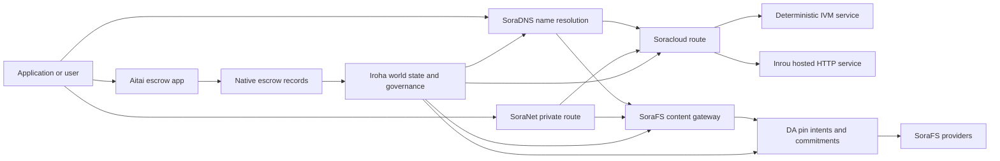

# SORA Nexus Үйлчилгээ {#sora-nexus-services}

SORA Nexus цахим хувилбарыг чиглэсэн үйлчилгээний нисэх онгоцыг нэмнэ Iroha 3. Эдгээр үйлчилгээ
Тэд тусдаа бүртгэгддэггүй, тэдгээр нь Iroha Дэлхийн улс, Norito
манфист, удирдлагын бүртгэл, Torii Замын гэр бүл.

Хөдөлмөрийн хэрэгслийг нь түймэрний бүтэц, сүлжээний профилээс хамаарна.
[`/openapi`](/mn/reference/torii-endpoints.md#app-and-sora-route-families) цаашид
зорилтот түймрийг зөвшөөрөгдсөн замын эрх бүхий жагсаалт гэж үздэг.

## Компонент газрын зураг {#component-map}

| Үндсэн хэсэг              | Хөдөлмөр                                                                                                                                        | Үндсэн талбай                                                                            |
| ---------------------- | ------------------------------------------------------------------------------------------------------------------------------------------- | ---------------------------------------------------------------------------------------- |
| Soracloud              | Хэрэглээний хэрэгжилт, хостинг үйлчилгээ, хувийн загвар / гүйлгээний цаг үеийн байдал, үйлчилгээний амьдралын мөрийг хянах.                                        | `/v1/soracloud/*`, `/api/*`, `iroha app soracloud ...`                                   |
| Инру                  | Soracloud зочид буудал HTTP цахилгаан үйлчилгээний шинэчлэл хийх цаг хугацаа HTTP Авиа.                                                            | Soracloud Хөдөлмөрийн цаг хугацааны тохируулалт, хостийн чадварын зар сурталчилгаа                 |
| SoraNet                | Ширээний хувийн хэвшил, тээврийн давхарчлал, эфир хөдөлгөөн, VPN, Сэтгэгдэл, сурталчилгааны чиглэлүүдийг холбоно.                                     | `/v1/connect/*`, `/v1/vpn/*`, SoraNet Замын метадэтгэл                                     |
| Мэдээллийн хангамж (DA) | Хэрэглэгчийн ачааллын талаарх бэлэн байдлын гэрэл баримт, үүрэг гүйцэтгэл, нөөцтэй зорилгоны давхар Nexus зам, SoraFS Энэ нь илтгэгдэж, нотолгоо урсдаг. | `/v1/da/*`, `FindDaPinIntent*`, `[sumeragi.da]`                                          |
| SoraFS                 | Манифестүүдийн хадгаламжтай хувцас, CAR нөөц ачаалл, хэвлэгдсэн агуулга, галт тэрэгний хувилбар болон нөхөн сэргээх боломжийн баталгааны урсгал.           | `/v1/sorafs/*`, `/sorafs/*`, `FindSorafsProviderOwner`                                   |
| SoraDNS                | Үргэлжүүлэгчний нэрэмжит болон шийдвэрлэх-аттестацийн шатаг SORA-Хэрэглэгдсэн үйлчилгээ, агуулга.                                                   | `/v1/soradns/*`, `/soradns/*`, Resolver directory үйл явдлууд                                 |
| Атай                  | Хэрэглээний түвшинд буй фиат болон хөрөнгийн зохицуулалтын коридор нь тусгай номын сан биш, дотоодын хадгаламжийн бүртгэлээр дэмжлэг үзүүлдэг.                                     | `OpenAssetEscrow`, `FindAssetEscrow*`, `EscrowEventFilter`, Kotodama `escrow_*` барилга |



## Нийтлэг урсгал {#common-flows}

### Хостинг Split хэрэгсэл {#hosted-split-application}

Тухайн төрлийн халуун тайзны апп нь бүх хэсгийг хамтдаа ашигладаг:

1. Статикийн фронтэнд активүүд багтаж, дутагдана SoraFS.
2. Жишээ нь, олон нийтийн зочид `<app>.sora`, бүртгэгдсэн
   SoraDNS.
3. Soracloud замыг `/api/v1/search` эсвэл `/api/v1/stream` Inrou руу HTTP
   Хөдөлмөрийн үйлчилгээ.
4. Soracloud замыг `/api/auth` болон `/api/v1/user` тодорхойлолт IVM
   Хөдөлмөрийн ажилчид.
5. Хувийн байдлыг шаарддаг үйлчлүүлэгчид ижил контент эсвэл API зам
   а SoraNet Захиргааны эргэлт.

| Зам              | Хөдөөний нисэх онгоц         | Яагаад?                                               |
| ----------------- | --------------------- | ------------------------------------------------- |
| `/`               | SoraFS Статикийн агууламж | Өргөдөх боломжтой агуулгын түлхний болон галт замын хадгаламж     |
| `/assets/*`       | SoraFS Статикийн агууламж | Үүнд зориулсан хөрөнгө, илтгэл баримт      |
| `/api/auth*`      | Soracloud IVM         | Өргөдлийн аюулгүй авт, мөнгөн тэмдэгтийн бэрхшээл       |
| `/api/v1/user*`   | Soracloud IVM         | Засаг захиргааны хувьд эмзэг байдлын өөрчлөлт              |
| `/api/v1/search*` | Soracloud Инру       | Амьдрал HTTP үйлчилгээ, хадгаламж, SSE, эсвэл цуглуулчийн улс |

### Агуулга хэвлэл {#content-publication}

SoraFS нийтлэл нь нэр нь тэдгээрийг заахаас өмнө тогтвортой артефактыг бүтээдэг:

1. Хөдөлмөрийн ачаалал эсвэл захиалгыг бүтээх.
2. Энэ нь ... CAR Архив болон хэсэг төлөвлөгөө.
3. Хөгжлийн Norito Пин бодлого, удирдлагын мэдээллээр тэмдэглэгдэж байна.
4. Өргөдлийн жагсаалтыг Torii.
5. A-ыг бүртгүүлэх DA зорилтот зорилго, бэлэн байдлын үүрэг
   Профиль нь тодорхой баримтыг шаарддаг.
6. Манифест нь SoraDNS нэр эсвэл Soracloud Цаашид шилжих зам.

### Хувь хүний тээвэрлэлт эсвэл урсгалын зам {#private-fetch-or-streaming-route}

SoraNet өмнө нь сууж болно SoraFS эсвэл Soracloud:

1. Хэрэглэгчийн нэр эсвэл манфист шийддэг.
2. Хяналтын захиалга эсвэл замын жагсаалт нь нэвтрэх болон гарах релесийг сонгодог.
3. Тээврийн хэрэгсэл багаж, SoraNet Захиргааны эргэлт.
4. Урьдчилгааны шилжилт нь SoraFS хаалга, Torii урсгал, эсвэл Soracloud
   Замын дагуу.

## Атай {#aitai}

Атай нь SORA зах зээлийн загварын зохицуулалтын
худалдан авагч болон борлуулагч нь зах зээлийн гадаад төлбөрийг зохицуулдаг бөгөөд Iroha Хөдөлмөрийн
Хөрөнгийн хөрөнгө хадгаламж.
шинэ санхүүгийн хөрөнгийн хяналтын тухай гэрээний өмчит хадгаламжийн дансны оронд
урсгал.

Тухайн захиргаа нь захиалгыг номонд хадгалдаг. Худалцуулагч
`OpenAssetEscrow`, худалдан авагч нь зах зээлийн гадаад төлбөрийг хүлээн зөвшөөрч, тэмдэглэж байна
`AcceptAssetEscrow` болон `MarkEscrowPaymentSent`, Худалцуулагч
хамтран `ReleaseAssetEscrow` эсвэл төлбөрийг тэмдэглэхээс өмнө цуцлах.
худалдагч санал нийлэхгүй бол аль алинд нь маргааныг нээж, шийдвэрлэх боломжтой
`CanResolveEscrowDispute` хаалттай хэмжээг хувааж болно.

Амьдралын бүх шатны турш, нийтлэг хөрөнгийн нууцлал, нэргүй хадгаламж, асуултууд,
үйл явдлууд, Rust жишээ, үзнэ үү
[Үндэсний хөрөнгийн хяналт](/mn/blockchain/escrow.md).

| Атайгийн давхар                                                                                                                                                 | Үүнийг ашиглах                                                                                |
| ------------------------------------------------------------------------------------------------------------------------------------------------------------- | ----------------------------------------------------------------------------------------- |
| `OpenAssetEscrow`, `AcceptAssetEscrow`, `MarkEscrowPaymentSent`, `ReleaseAssetEscrow`, `CancelAssetEscrow`                                                    | Өргөдлийн санхүүгийн хөрөнгөний нээлттэй санал, тэр дундаа XOR- нэрлэгдэж буй орлогын урсгал.             |
| `OpenAnonymousAssetEscrow`, `AcceptAnonymousAssetEscrow`, `MarkAnonymousEscrowPaymentSent`, `ReleaseAnonymousAssetEscrow`, `CancelAnonymousAssetEscrow`       | Санхүүжилт болон хаацтын хөдөлгөөнийг нотолгооны хавсралтаар гүйцэтгэсэн хамгаалалттай санал. |
| `OpenEscrowDispute`, `ResolveEscrowDispute`, `OpenAnonymousEscrowDispute`, `ResolveAnonymousEscrowDispute`                                                    | Шүүхийн хэлбэрээр маргааныг шийдвэрлэх.                                                 |
| `FindAssetEscrowById`, `FindAssetEscrowsBySeller`, `FindAssetEscrowsByBuyer`, `FindAssetEscrowsByStatus`                                                      | Хэрэглэлийн байдлын хуудсууд, тохируулалтын ажил, дэмжлэг үзүүлэх хэрэгсэл.                               |
| `EscrowEventFilter`                                                                                                                                           | Хөдөлмөрийн төлөөлөгч, худалдагч, худалдан авагч, нөхцөл байдал эсвэл үйл явцын төрөлд бүртгэгдсэн транспарент төлөөлөгчийн жижиг төлбөр. |
| Kotodama `escrow_open_offer`, `escrow_accept`, `escrow_mark_payment_sent`, `escrow_release`, `escrow_cancel`, `escrow_open_dispute`, `escrow_resolve_dispute` | Kotodama гэрээний дуудлага V1 Хөрөнгө оруулалт хийх.                                 |

Нийтийн зориулалттай Taira эсвэл Minamoto хэрэглээ, зах зээлээс гадуур төлбөрийн замыг боловсруулах;
Хэрэглэлийн бодлогын хувьд аливаа дэмжлэг болон шүүхийн ажлын урсгал. Iroha бүртгэл
хадгаламжийн байдал, амьдралын мөрийн үйл явдлууд, нотлох баримтын хэшүүд, хөрөнгөний эцсийн хөдөлгөөн;
энэ нь өөрөө төлбөр тооцоог баталгаажуулахгүй.

## Зорилгоны сүлжээг шалгана {#check-a-target-node}

Энэ хуудасны жишээг ашиглахаасаа өмнө маршрутын гэр бүлд оршин тогтнож байгаа эсэхийг баталгаажуул
Та зорилтот цэг дээр:

```bash
export TORII_URL=https://taira.sora.org

curl -fsS "$TORII_URL/openapi.json" \
  | jq '.paths | keys[] | select(test("^/v1/(soracloud|sorafs|soradns|connect|vpn|da)/"))'

curl -fsS "$TORII_URL/status" | jq .
```

Хэрэв `/openapi.json` Profile-ээс илрээгүй бол туршиж үзээрэй. `/openapi`. Тухайн
Замын хангамж нь барилгын шинж чанар, сүлжээний конфигурацыгсаа хамаарна.

### Taira Зөвхөн уншигчдын цахилгаан тамхины шалгалт {#taira-read-only-smoke-checks}

Олон нийт Taira төгсгөлийн цэг нь уншигч талын шалгалтын хувьд ашигтай боловч үүнийг ашиглахгүй
та зөвшөөрөлтэй дансыг ашиглаж байгаа бол өөрчлөгч жишээ
Амьдралын орчинг өөрчлөх зорилготой.

```bash
export TORII_URL=https://taira.sora.org

curl -fsS "$TORII_URL/status" \
  | jq '{version: .build.version, peers, blocks, lanes: (.teu_lane_commit | length)}'

curl -fsS "$TORII_URL/v1/connect/status" | jq '{enabled, sessions_active}'

curl -fsS "$TORII_URL/v1/vpn/profile" \
  | jq '{available, relay_endpoint, supported_exit_classes}'

curl -fsS "$TORII_URL/v1/sorafs/storage/state" \
  | jq '{bytes_capacity, bytes_used, pin_queue_depth, por_inflight}'

curl -fsS -H 'Accept: application/json' "$TORII_URL/v1/soracloud/status" \
  | jq '.control_plane | {service_count, services: [.services[] | {service_name, current_version}]}'
```

Taira Хөдөлмөрийн хувьд тодорхойгүй хяналтын нисэх онгоцны замыг илрүүлж болно
" OpenAPI Замын зураг. `/openapi` үйлдвэрлэгдэж буй үндсэн
API гэрээ байгуулах, дараа нь нэвтрүүлгийн тухайн чиглэлийг шууд батлах
Үүнийг амьд бичгээр бичиж байна.

## Soracloud {#soracloud}

Soracloud Энэ бол SORA Хэрэглээний хяналтын тайван.
бандл, үйлчилгээний шинэчлэл, чиглэл, хэрэглээний байдал, бүрэн эрхтэй конфигурац
бүртгэл, нууцлагдсан үйлчилгээний нууцыг, загварын бүртгэлийн бүртгэл, хувийн
Үр дүн шинжилгээний хуралдаанууд, гүйлтийн цагийн хүлээн авах.

Soracloud хоёр гүйцэтгэх төвийг ашигладаг:

| Тухайн цаазын нисэх онгоц        | Хөгжлийн цаг | Үүнийг ашиглах                                                                                   |
| ---------------------- | ------- | -------------------------------------------------------------------------------------------- |
| `DeterministicService` | `Ivm`   | Автор, хаврын байдал, баталгаажуулсан уншилт, захиалсан цахим хайрцаг хэрэглэгчид, засаглалтай холбоотой шилжилт |
| `HttpService`          | `Inrou` | Амьдрал HTTP APIs, цуглуулчийн ачаалалтай ажил, нууцлалын дэмжлэгтэй үйлчилгээ, SSE, хөтөчээр дэмжлэг үзүүлэх урсгал     |

Хөдөлмөрийн удирдлага нь бүрэн эрхтэй.
нууц, загвар, байдлын команд Torii болон уншсан
Дэлхийн улс төр; тэд тусгаар тогтносон CLI-Орон нутгийн үзэсгэлэн.
Маршрутлал нь хамгийн урт префикс дээр суурилсан тул нэг бүртгэлтэй хост замыг хувааж болно
зочид буудлын HTTP замыг болон тодорхойлолт API Залуудыг.

### Дээр нь хуваагдсан хэрэглэлийг тавих {#scaffold-a-split-app}

Хөгжлийн хэсгүүдийн загвар нь статик фронтэнд болон нэг амьд хостинг бий болгодог API
болон нэг тодорхойлох цогцолбор/API үйлчилгээ:

```bash
iroha app soracloud app init \
  --template split-app \
  --app-name solswap_indexer \
  --app-version 0.1.0 \
  --public-host solswap-indexer.sora \
  --output-dir ./apps/solswap-indexer

iroha app soracloud app local-plan \
  --manifest ./apps/solswap-indexer/app_manifest.json

iroha app soracloud app doctor \
  --manifest ./apps/solswap-indexer/app_manifest.json
```

`local-plan` Замын хуваалт, хүүхдийн үйлчилгээний манфист, ажлын байр хэвлэх
бичгийн замыг, урьдчилан төлөвлөсөн хэвлэлийн хэвлэлийн хэлбэр. `doctor`
та оролцдог өмнө орон нутгийн чөлөөлөх гэрээг баталгаажуулна Torii.

### Хэрэглээний байдлыг ашиглах, шалгах {#deploy-and-inspect-app-state}

```bash
export SORACLOUD_TORII_URL=https://<soracloud-enabled-torii>

iroha app soracloud app deploy \
  --manifest ./apps/solswap-indexer/app_manifest.json \
  --torii-url "$SORACLOUD_TORII_URL"

iroha app soracloud app status \
  --manifest ./apps/solswap-indexer/app_manifest.json \
  --torii-url "$SORACLOUD_TORII_URL"
```

Урьдчилсан үйлчилгээний хувьд үйлчилгээний хүрээний командыг ашиглах:

```bash
iroha app soracloud status \
  --service-name solswap_indexer_live \
  --torii-url "$SORACLOUD_TORII_URL"

iroha app soracloud rollback \
  --service-name solswap_indexer_live \
  --target-version 0.1.0 \
  --torii-url "$SORACLOUD_TORII_URL"
```

### Сэтгэлэгт болон нууцлаг материал {#config-and-secret-material}

Soracloud Config болон нууц бүртгэл нь эрх мэдлийн хэрэглээний нэг хэсэг юм
Урьдчилгаа, шинэчлэл, хөөцөлдөх нь шаардлагатай үед хаагдахгүй
нууц холболт байхгүй эсвэл идэвхтэй шинж тэмдэгтэй нийцэхгүй байна.

```bash
iroha app soracloud config-set \
  --service-name solswap_indexer_live \
  --config-name indexer/public_config \
  --value-file ./config/public-config.json \
  --torii-url "$SORACLOUD_TORII_URL"

iroha app soracloud secret-set \
  --service-name solswap_indexer_live \
  --secret-name indexer/api_key \
  --secret-file ./secrets/api-key.envelope.json \
  --torii-url "$SORACLOUD_TORII_URL"
```

Хөдөлмөрийн CLI таны профилийнхээ шаардлагыг тодорхойлох баримтын даалгавар:

```bash
iroha app soracloud config-set --help
iroha app soracloud secret-set --help
```

## Инру {#inrou}

Инру нь зочид буудал HTTP хэрэглэгддэг гүйлтийн хугацаа Soracloud. Хөдөлмөр Iroha сэлбэг
оргилсан Soracloud Хөдөлмөрийн хугацааны төсөл хүлээн авсан Soracloud орон нутгийн
материализацийн төлөвлөгөө, хуваарилсан хостинг үйлчилгээний хувилбаруудыг буцалтгүй байдлаар эхлүүлж
үйлчилгээ, тайлан дурдах цагаар
загвар.

Амьдрах шаардлагатай ажлын ачаалал дээр Inrou-ийг ашигла HTTP гадаргуу,
цуглуулгач хүнд APIs, SSE урсгал, хажуугаар хамгаалалттай хяналтын хэрэгсэл, эсвэл
Бrowser-ийн тусламжтайгаар үйл ажиллагаа явуулдаг үйлчилгээ.

### Хөдөлмөрийн цаг хугацааны шаардлага {#runtime-requirements}

- Контейнерийн тайлангийн гүйцэтгэх цаг нь `Inrou`.
- Хөдөлмөрийн тайлан гүйцэтгэх нисэх онгоц `HttpService`.
- `HttpService + Inrou` яг нэг зүйлийг шаарддаг `PersistentRootLeaseVolume`
  цаашид `/`.
- Inrou-ийн сэргээгдэх үйлчилгээний хувьд хамтарсан үйлчилгээ эсвэл нууцлан орлогын гэрээ шаардлагатай
  хадгаламжлах үед тэдгээрийн өөрчлөлтөтэй хуваалцсан байдал хадгалагдана.
- Үйлдвэрлэлийн хостинг түймөрүүд нь Inrou-ийн бодит хүчин чадал
  Зөвхөн төлөөлөгчөөр ажилладаг.

### Өргөдлийн хэсэг {#manifest-fragment}

Дараах жишээ нь хоёр илрэлтийн хэлбэрийг харуулж байна.
Энэ нь бүрэн ашиглалтын багц биш юм.

```jsonc
// container_manifest.json
{
  "schema_version": 1,
  "runtime": { "runtime": "Inrou", "value": null },
  "bundle_path": "/bundles/solswap-indexer.inrou",
  "entrypoint": "/app/bin/launch-indexer.sh",
  "args": [],
  "env": {
    "RUST_LOG": "info",
  },
  "inrou": {
    "schema_version": 1,
    "guest_os": { "guest_os": "DebianSlim", "value": null },
    "guest_images": {
      "x86_64": {
        "kernel_image_path": "/inrou/x86_64/vmlinux",
        "rootfs_image_path": "/inrou/x86_64/rootfs.ext4",
        "initrd_image_path": null,
      },
      "aarch64": {
        "kernel_image_path": "/inrou/aarch64/vmlinux",
        "rootfs_image_path": "/inrou/aarch64/rootfs.ext4",
        "initrd_image_path": null,
      },
    },
  },
  "lifecycle": {
    "start_grace_secs": 60,
    "stop_grace_secs": 30,
    "healthcheck_path": "/api/indexer/v1/health",
  },
}
```

```jsonc
// service_manifest.json
{
  "schema_version": 1,
  "service_name": "solswap_indexer_live",
  "service_version": "0.1.0",
  "execution_plane": { "execution_plane": "HttpService", "value": null },
  "replicas": 2,
  "route": {
    "host": "solswap-indexer.sora",
    "path_prefix": "/api/v1/search",
    "service_port": 8080,
    "visibility": { "visibility": "Public", "value": null },
    "tls_mode": { "tls": "Required", "value": null },
  },
  "lease_volumes": [
    {
      "volume_name": "root_disk",
      "kind": {
        "lease_volume": "PersistentRootLeaseVolume",
        "value": null,
      },
      "storage_class": { "storage_class": "Warm", "value": null },
      "mount_path": "/",
      "max_total_bytes": 8589934592,
    },
    {
      "volume_name": "index_state",
      "kind": { "lease_volume": "ServiceLeaseVolume", "value": null },
      "storage_class": { "storage_class": "Warm", "value": null },
      "mount_path": "/var/lib/solswap-indexer",
      "max_total_bytes": 1073741824,
    },
  ],
}
```

Хөдөлмөрийн цагийн үед байршуулсан аренданы хэмжээ нь байгаль орчинд дамжуулан илэрдэг
Томоогийн нэрнээс үүдэлтэй хувьчлал:

```text
SORACLOUD_LEASE_VOLUME_ROOT_DISK_DIR
SORACLOUD_LEASE_VOLUME_ROOT_DISK_MOUNT_PATH
SORACLOUD_LEASE_VOLUME_INDEX_STATE_DIR
SORACLOUD_LEASE_VOLUME_INDEX_STATE_MOUNT_PATH
```

## SoraNet {#soranet}

SoraNet Энэ нь хувийн хэвшил, тээврийн давхаргыг бүрдүүлж байна.
Зохиоллын чиглэлүүд нь зорилтот галт тэрэгтэй шууд холбогдсон байх ёсгүй
тээврийн загварын хувьд орох, дунд болон гарах релейн үүрэг ашигладаг.
QUIC тээврийн хэрэгсэл, дуу чимэг дээр суурилсан хибрид гарын үсэг нь, чадварын хэлэлцээр,
Relay directory metadata, тогтсон хэмжээний өргөн эдэлбэр.

Үүнд Nexus нэвтрүүлэг, SoraNet агуулга, галт тэрэгний замын хөдөлгөөнийг тээвэрлэх боломжтой
VPN эсвэл Connect-ийн үеэр, Norito Тодруулгын бүртгэл нь
маркийн дамжуулалт нь энэ дэмжлэг `norito-stream`, Энэ нь үйлчлүүлэгчид чиглэлээр явахыг хүснэ
зориулагдсан Torii RPC эсвэл замын урсгалыг дамжуулах.

### Хэвлэлийн урсгалын тохируулалт {#streaming-configuration}

Хөдөлмөрийн Nexus Profile-ийг хангах SoraNet дамжуулах замын хангамж:

```toml
[streaming]
feature_bits = 0b11

[streaming.soranet]
enabled = true
exit_multiaddr = "/dns/torii/udp/9443/quic"
padding_budget_ms = 25
access_kind = "authenticated"
provision_spool_dir = "./storage/streaming/soranet_routes"
provision_spool_max_bytes = 0
provision_window_segments = 4
provision_queue_capacity = 256
```

Хэрэглээ `access_kind = "read-only"` хэрэгцээний чиглэлийн хувьд
үзэгчний баталгаажуулалт. `authenticated` гарах ээлжинд хэрэглэх ёстой үед
тавилга, үзэгчдийн тодруулгыг Torii эсвэл үйл ажиллагаа явуулдаг үйлчилгээ.

### SoraNet-Бүх мэдлэгтэй SoraFS Та нар авна. {#soranet-aware-sorafs-fetch}

Хөдөлмөрийн SoraFS аваад авна CLI орон нутгийн төлөөлөгчийн манфист болон сүлжээг гаргах боломжтой SoraNet
браузерны өргөтгөлийн чиглэлийн метадэтгэл, эсвэл SDK адаптер:

```bash
sorafs_cli fetch \
  --plan artifacts/payload_plan.json \
  --manifest-id 7bb2...9d31 \
  --provider name=alpha,provider-id=9f5c...73aa,base-url=https://gw-alpha.example.org/,stream-token="$(cat alpha.token)" \
  --output artifacts/payload.bin \
  --json-out artifacts/fetch_summary.json \
  --local-proxy-manifest-out artifacts/proxy_manifest.json \
  --local-proxy-mode bridge \
  --local-proxy-norito-spool storage/streaming/soranet_routes \
  --local-proxy-kaigi-spool storage/streaming/soranet_routes \
  --local-proxy-kaigi-policy authenticated \
  --max-peers=2 \
  --retry-budget=4
```

Тодруулгын мэдээллийн нийлүүлэгч мэдээлэл, хувилбар хүлээн авах мэдээ, орон нутгийн төлөөлөгчийн метабараа,
болон авахад хэрэглэгддэг үр дүнтэй замын тохируулалт.

## Мэдээллийн хангамж (DA) {#data-availability-da}

DA хэт том ачааллын хэрэгцээнд бэлэн байдлын баталгааны шатахуун
хувийн хэвшлийн хувьд эмзэг, эсвэл дэлхийд шууд байршуулахын тулд хэтэрхий үйлчилгээний онцлог
Энэ нь тодорхойлолт хариуцлага болон эргүүлэн авах үүрэг
баталгаажуулагч, галт тэрэг болон үйлчлүүлэгч нь ямар байт амласан талаар тохиролцож болно
ямар бодлого хэрэгжиж байгаа, ямар баримтлал ажиглагдаж байна.

DA орлуулахгүй Kura эсвэл SoraFS:

- Kura Блок урсгалын эцэслэн боловсруулсан болон тохиролцооны сэргээлтийн өгөгдлийг хадгалах.
- SoraFS агуулгатай байт хадгалж, үйлчилж байна CAR хэрэглэгдэх ачаалл,
  Нүүр хуудас
- DA Зохиоллын үүрэг, баталгааны бодлого, баталгааын нээлттэй байдал, шилжилтийн зорилтыг бүртгүүлэх
  Эдгээр байтсыг хуваарилж, хяналт шалгаж, номын сан руу холбох боломжтой
  Улс.

Хэрэглээ DA хүсэлт гаргасан тохиолдолд, Nexus Lane нь номонд харагдаж буй амлалт хэрэгтэй
Захиргааны зах зээлээс гадуурх мэдээлэл эргүүлэн авах боломжтой хэвээр байна
Арилжааны урсгалын хэрэглээний ачаалал, SoraFS хэвлэгдэх зорилго
Цаашид шалгахын тулд хадгалах ёстой баримтын багц,
хэрэглээний артефакт нь олон нийтийн байдал нь
Бүх хэрэглээний ачаа.

### Амьдралын мөчлөг {#lifecycle}

| Үргэлж      | Тодруулсан зүйл                                                                                                                                      |
| ---------- | ----------------------------------------------------------------------------------------------------------------------------------------------------- |
| Дашрамд     | Билет, ил тод сэлбэг, нууц үсэг, замын / эпохины / дараалалтын сэлбэлэг, хадгалах бодлого, эсвэл нөхөн сэргээх зорилт.                                          |
| Үүнд үүрэг гүйцэтгэх | Манифест, замын ачаалал, баталгааны багц, эсвэл агуулгын үндэсний жагсаалтыг номонд харагдаж буй бүртгэлтэй холбосон материал боловсруулах.                                    |
| Гэрэл баримт   | Хөдөлмөрийн хэрэгслийн талаарх санал, баталгааны нээлттэй мэдээлэл, үйлчилгээний үзүүлэгчдийн гэрчилгээ болон зорилтот сүлжээ хүлээн зөвшөөрсөн бусад хувилбарын тодорхой баримт.                         |
| Судалгаа      | Нөхөрлөгийн зорилгоор шалгалт `FindDaPinIntentByTicket`, `FindDaPinIntentByManifest`, `FindDaPinIntentByAlias`, эсвэл `FindDaPinIntentByLaneEpochSequence`. |

Үүнтэй холбоотой DA-дэтгэмжлэгдсэн хэвлэлийн урсгал нь:

1. Хөдөлмөрийн ачааг WSV, Жишээ нь: SoraFS CAR
   баримт бичиг эсвэл Nexus Замын хэрэглээний ачаа.
2. Хаш болон ашиг ачааг тодорхойлох Norito нэвтрүүлэг эсвэл чиглэлийн тодорхой
   Зохиоллын бүртгэл.
3. Өргөдлийн тэмдэг, нэрийн зорилго эсвэл үүрэг гүйцэтгэгчээр дамжуулан `/v1/da/*` хэзээ
   энэ маршрутын гэр бүлийг ашиглах боломжтой, эсвэл сүлжээний гарын үсэг зурсан
   гүйлгээний зам.
4. Зөвлөнчлэгч, ашиглах боломжийг олгогч байгууллагууд шаардлагатай баримтыг цуглуулна.
   Ажилтай батлах бодлогын дагуу.
5. Үүнээс үүдэлтэй нэрийн зорилго эсвэл үүрэг гүйцэтгэх талаар асууж,
   нэвтрүүлгийн баталгаа, эсвэл хэрэглэгчийн ачааас хамаардаг галт тэрэгний зам.

### Алгоритмын загвар {#algorithmic-model}

DA хэрэглэгчийн ачааг гарын үсэг зурсан, дахин тоглож хамгаалалттай, блок-индексирсэн үүрэг болгодог.
чухал алгоритмүүд нь тодорхойлогч тул баталгаажуулагч, галт тэрэг
Үүнтэй ижил байт-үүдээс ижил хоолоо шинээр тооцоолж байна.

1. **Нэвтрүүлсэн ачааг санхүүжүүлнэ.** Torii хэрэглэх хүсэлтээ хүлээн авна
   `(lane_id, epoch, sequence)`, ашиг шилжилтийн байт, товчлолт метадэтгэл, хэсэг
   хэмжээ, арилгах хувилбар, хадгалах бодлого, өргөн мэдүүлэгчний гарын үсэг.
   gzip, deflate эсвэл Zstandard ашиг ачааг хүсэлтэд татан буулгаж, дараа нь
   Каноникийн байт урт нь тэгш гэдгийг баталгаажуулна `total_size`.
2. **Захиргааны замын болон хэсгүүдийн параметрүүдийг баталгаажуулах.** Замын хөдөлгөөн Nexus
   Замын жагсаалт. `chunk_size` 0-ос өөр хүчин чадалтай 2 байх ёстой, хамгийн багадаа 2
   Байт, хамгийн их хэмжээний тохируулсан үзүүлэлтээс хэтрэхгүй.
   Мэдээллийн хэсгийг болон хамгийн багадаа хоёр тэнцвэрлэлийн хэсгээс үзнэ.
   ногдох тогтолцоо `merkle_sha256` эсвэл `kzg_bls12_381`.
3. **Тээврийн бодлогыг хэрэгжүүлнэ.** Үргэлт нь конфигурируулсан дугуйланг тавиад,
   Блоб класын хадгаламжийн эхлэлийн үзүүлэлт. Олон нийтийн метадэтгэг нь энгийн текстээр үлдэх ёстой;
   Зөвхөн засаглалтай метабараа нь сүлжээний тохируулсан засаглалаар шифрлэгддэг
   Мэдээлэл тэмдэгт бичигдэхээс өмнө метадангийн гол.
4. **Хөгжил, үүрэг гүйцэтгэх.** Каноникийн хэрэглээний ачаа нь тогтмол хэмжээний
   Үргэлт `chunk_size`. Torii нөөц ачааны хийнэгийг тооцоолон,
   Мэдээллийн хувилбар
   тээвэрлэх BLAKE3 Байт-аас илүү үүрэг гүйцэтгэнэ.
5. **Татаж авах үүргээ нэмнэ.** Хөдөлгөөнд оролцогчдын
   `data_shards`. Хамгийн сүүлчийн шугам дахь алдагдалтай эсүүд нь тэнцвэрлэхийн тулд нуруугаар дүүрэн байна
   тооцоо. RS(16) тэгш байдал нь шугам / дэлхийн тэгш байдлын хэсгийг бий болгодог; сонголт
   `row_parity_stripes` матрицаар түвшний хэв маягийн шугам тэнцэх байдлыг нэмнэ.
   Бага хэмжээний хуваарийн үүрэг гүйцэтгэгч BLAKE3 Жижиг андианы хоолой `u16` Үндсэн тэмдэг.
6. **Энэ жагсаалтыг байлгаарай.** `DaManifestV1` замын, эпохи, цөцгийн ангиллын бүртгэл,
   Codec, ашиг шилгээний хоолой, буурсан чулуун, буурсны хэмжээ, татаж авах профиль, хадгалах
   бодлого, орон сууцны үнийн дүн, хувь нэмэр, сонголттой IPA үүрэг гүйцэтгэгч, метадэтгэл,
   хадгаламжийн билет нь тодорхойлтой: түймэр хамгийн түрүүнд
   нэвтрүүлэгний хувилбар нь бохирдсан тавилгатай
   эцсийн `storage_ticket`.
7. **Урьдчилсан тоглоомын зөрчлийг үгүйсгэнэ.** Урьдчилгааны гол нь
   `(lane_id, epoch, sequence, manifest_fingerprint)`. Нүүр хуудас
   Энэ нь ижил арьстны эзэнтэд нөлөөгүй.
   өөр арьсны гарааны илрүүлгийг үгүйсгэнэ.
8. **Хөдөлгөөнд гарын үсэг зурсан артефактыг гарга.** Torii а тооцоо PDP үүрэг даалгавар, гэрээ
   `DaIngestReceipt`, a-г бий болгодог `DaCommitmentRecord`, болон сэлэнгийн артефактыг бичиж байна
   Өргөдлийн тухай, PDP үүрэг гүйцэтгэх, үүрэг гүйцетгэх бүртгэл, үүргийн хуваарь
   Пин, хүлээн авах файл, хүлээн авах бүртгэл.
   нэг удаагийн `(lane_id, epoch)`.

Хөдөлмөрийн тэмдэгт нь блокийн үүрэг гүйцэтгэдэг.

- Зам, цаг үе, дараалал
- дуудлага ID болон хашиг
- замын даатгалын систем
- хонгис чулуу
- сонголттой KZG үүрэг гүйцэтгэх KZG замыг
- PDP/бичлэлийн хоолой
- хадгалах анги, хадгалах тавилга
- Torii DA хүлээн зөвшөөрөгдлийн гарын үсэг

Блок бүрдэхээс өмнө DA бүртгэл, блок хуримтлалын замаар буудлыг баталгаажуулдаг:

- `(lane_id, epoch, sequence)` Энэ нь цогцолборын дотор онцлог байх ёстой.
- Хашиг нь нуруу биш, цорын ганц байх ёстой.
- Хөдөлмөрийн баталгааны хөтөлбөр нь конфигуруулсан замын бодлогын дагуу байх ёстой.
- Merkle замын буудлыг татгалзаж байна KZG үүрэг гүйцэтгэх; KZG замын хөдөлгөөнд 0-ны дугааргүй байх шаардлагатай KZG
  Үргэлж.
- Пинний зорилго нь гарын замын дагуу хаш,
  хадгаламжийн билет, эзэмшигчдийн данс, цогцолборын дүрэм.

Блок толгой нь хэшийг хадгалдаг DA баталгааны бодлого, үүрэг даалгавар, шилжилт
гишүүнчлэл батлахын тулд үүрэг гүйцэтгэх багц нь мөн Merkle
гарал, түүний булан нь каноникийн хаши Norito- кодлогдсон
`DaCommitmentRecord` Эцэг эх цэгүүд нь зүүн болон
зөв хүүхдүүд; үл хөдлөх хөрөнгийг өөрчлөхгүй дараагийн давхар руу шилжүүлнэ.

### Дашрамд шалгах {#proof-verification}

`/v1/da/commitments/prove` блок дотор нэг үүрэг гүйцэтгэгчтэй холбоотой баримт бичгийг гаргаж болно.
Дашрамд үүрэг гүйцэтгэх, блок өндөр, банд дахь индекс, бандл байдаг
Хаш, бандлын урт, Merkle түлх, ах дүү замыг шалгах:

1. Дашрамдсан бандл хэши нь блоктын цэглэлийн тэргүүтэй нийцдэг DA Зохиоллын хаш.
2. Дашрамдсан блок өндөр нь дурдсан блок толгойтой нийцдэг.
3. Энэ индекс нь хязгаартай бөгөөд үүрэг гүйцэтгэгч нь тухайн
   индекс.
4. Захиргааны замын батлан хамгаалах бодлого энэ үүргийг хүлээн зөвшөөрдөг.
5. Тус үүрэг гүйцэтгэгчээс ах дүүсийн замыг татан буулгах нь нийлүүлсэн
   гаралтай.
6. Шинэ бүтээн байгуулалт хийгдсэн гарал нь баглагын гаралтай.

Энэ нь тодорхой хэрэглээний
Block payload; энэ нь бүх дублийн одоо цахим байна гэдгийг баталгаажуулахгүй.
сэргээх чадвар нь тусдаа шалгагдана SoraFS нийлүүлэгчийн аварга, PDP/PoTR
хяналт шалгалт, эсвэл профилийн хувьд тодорхой хангагдах байдлын гэрчилгээ.

### Эдийн засгийн харилцан ойлголцол {#consensus-interaction}

DA . Sumeragi найдвартай дамжуулалт (RBC), гэхдээ энэ нь
Хоёр дахь эцсийн протокол. RBC санал болгож буй ашигтай ачааг тараах, нөхөн сэргээх:
санал болгож буй нь хэлэлцүүлгийг зарлаж, `(height, view, payload_hash)`, өрсөлдөгчид
арилжааны хэсгүүд, `READY`/`DELIVER` нэвтрүүлэгчийн хангалттай хэмжээтэй эсэхийг шалгаж байна
Энэ нь мөн адил хэрэглээний ачааллыг ажиглав.

Үүнд Iroha 3, "хэмтлэгчийн нэгдмэл" нь:

- орон нутгийн хэвтэж буй блок хэшийг хүлээгдсэн ашиг ачаалал хэшигээр хийнэ, эсвэл
- RBC блок хэши, өндөр, үзлэг,
  Хэрэглэгчийн ачаалл.

Хэрэв аливаа нөхцөл нь хүчин төгөлдөр биш бол хамтарсан бүртгэл `missing_local_data`, үргэлж хичээж байна
нөөц ачааг дамжуулан эргүүлэн авах RBC эсвэл block sync, DA хаалга
Цагдаагийн байгууллагын үйл ажиллагааны үеэр DA сигнал нь
төгсгөлд зориулсан зөвлөгөө: аливаа блок нь хүлээлгэн өгөх гэрчилгээний мөн
нийцсэн орон нутгийн хэрэглээний ачаа, тусгай DA Хөгжлийн хяналтын баримт бичиг.

DA Цаг хугацаа сэргээлтийн цонхны өргөтгөх. DA УИХ-ын дэд хуралдаан
Нөхөнтөгч блок болон үүрэг гүйцэтгэх цаг хугацааны тухай, дараа нь
`sumeragi.advanced.da.quorum_timeout_multiplier`. Хөдөлмөрийн хэрэгслийн хугацаа:
`max(quorum_timeout, availability_timeout_floor_ms) * availability_timeout_multiplier`.
Энэ ашиглалтын хугацаа дуусч, түймэр ашигтай ачааг сэргээхэд дэмжлэг үзүүлдэг
түр хугацааны өөрчлөлтөөс урьдчилан сэргийлэх; энэ хугацаа дууснаас хойш хэвийн нөхөн сэргээлт,
үзэл бодлоо өөрчлөх замыг үргэлжлүүлэх боломжтой.

### Үйлчлүүлэгчдийн тэмдэглэл {#operator-notes}

Iroha 3 санал нэгдлийн хувилбар нь RBC-элэг ачааны түгээмэл дэмжиж, илтгэл
хамгаалагчид, DA Бандлийн баталгаажуулалт, сэргээлтийн телеметри.
загварын илтгэл `[sumeragi.da]` Хөдөлмөр эрхлэхэд хязгаарлалт
бөмбөг, нэмэлт `[sumeragi.advanced.da]` Урьдчилгааны хугацааг хөөцөлдөж,
Энэ тохируулгыг нэг хэсэгт
сүлжээний хувилбар.

Замын нээлт хийхэд, түймрийн OpenAPI баримт бичиг:

```bash
curl -fsS "$TORII_URL/openapi.json" \
  | jq '.paths | keys[] | select(startswith("/v1/da/"))'
```

Хөдөлмөрийн
[хайлтын дуудлага](/mn/reference/queries.md#nexus-data-availability-and-packages)
одоогийн DA асуултын нэр,
[дундаж хувилбар](/mn/reference/peer-config/) орон нутгийн
`[sumeragi.da]` Таны бүтээн байгуулалтаар илэрсэн бөмбөгүүд.

## SoraFS {#sorafs}

SoraFS Энэ нь төвлөрсөн хэрэглээний хаягаар хадгалах угаа.
Байт нь тодорхойлох хэсэгт хуваагдаж, CAR архив, Norito Энэ нь илтгэнэ
агуулгын түлх, буурсан хувилбар, пин бодлого, удирдлагаг холбоно
Гэрчилгээ: хадгаламжийн үйлчилгээ үзүүлэгчид хүчин чадал, агуулгыг зарлаж байна
нэвтрүүлэгүүд нь өмнө нь манфист болон хэсэгчлэн хүлээсэн үүргээ баталгаажуулдаг
агуулгыг хангадаг.

Үүнтэй холбоотой SoraFS ашиглалтанд статикийн хэрэглээний эд хөрөнгө, баримт бичлэг ордог
бүтээн байгуулалт, бүс нутгийн багц, загвар эсвэл артефактын сүлжээ, засаглалын баримт
Хөгжил. Iroha Мэдээллийн загварын илрэл SoraFS нэвтрүүлгийн үйл явц болон
[`FindSorafsProviderOwner`](/mn/reference/queries.md#nexus-data-availability-and-packages)
үйлчилгээ үзүүлэгчний эзэмшилдээ шийдэх хүсэлт.

### Хөгжүүл, илрүүл, гарын үсэг зурж, өргөн мэдүүл {#pack-manifest-sign-and-submit}

```bash
cargo run -p sorafs_car --features cli --bin sorafs_cli -- \
  car pack \
  --input ./dist \
  --car-out artifacts/site.car \
  --plan-out artifacts/site.chunk-plan.json \
  --summary-out artifacts/site.car-summary.json

cargo run -p sorafs_car --features cli --bin sorafs_cli -- \
  manifest build \
  --summary artifacts/site.car-summary.json \
  --manifest-out artifacts/site.manifest.to \
  --manifest-json-out artifacts/site.manifest.json \
  --pin-min-replicas=3 \
  --pin-storage-class=warm \
  --pin-retention-epoch=42

SIGSTORE_ID_TOKEN=$(oidc-client fetch-token) \
cargo run -p sorafs_car --features cli --bin sorafs_cli -- \
  manifest sign \
  --manifest artifacts/site.manifest.to \
  --bundle-out artifacts/site.manifest.bundle.json \
  --signature-out artifacts/site.manifest.sig

cargo run -p sorafs_car --features cli --bin sorafs_cli -- \
  manifest submit \
  --manifest artifacts/site.manifest.to \
  --chunk-plan artifacts/site.chunk-plan.json \
  --torii-url "$TORII_URL" \
  --resolve-submitted-epoch=true \
  --authority=<i105-account-id> \
  --private-key-file ./secrets/authority.ed25519 \
  --summary-out artifacts/site.manifest.submit.json \
  --response-out artifacts/site.manifest.submit.body
```

Хэрэв `/v1/sorafs/pin/register` зорилтот цэг дээр чиглэгддэггүй, CLI угаах
гарын үсэг зурсан `/transaction` Хэвлэл мэдээлэл, мэдээллийн хэрэгсэл
Газрын тоног төхөөрөмжийн байдал.

### Хяналт шалгаж, авна {#verify-and-fetch}

```bash
cargo run -p sorafs_car --features cli --bin sorafs_cli -- \
  proof verify \
  --manifest artifacts/site.manifest.to \
  --car artifacts/site.car \
  --chunk-plan artifacts/site.chunk-plan.json \
  --summary-out artifacts/site.verify.json

sorafs_cli fetch \
  --plan artifacts/site.chunk-plan.json \
  --manifest-id <manifest-digest-hex> \
  --provider name=primary,provider-id=<provider-id-hex>,base-url=https://gateway.example.org/,stream-token="$(cat provider.token)" \
  --output artifacts/site.fetch.tar \
  --json-out artifacts/site.fetch.json
```

### Худалдан авах чадлын баталгааны шалгалт {#proof-of-retrievability-checks}

Үйлчлүүлэгчид хадгаламжийн үйлчилгээ үзүүлэгчдэд зориулсан шалгалтыг хийж, баталгаажуулж болно:

```bash
sorafs_cli por status \
  --torii-url "$TORII_URL" \
  --manifest <manifest-digest-hex> \
  --status=failed \
  --limit=20

sorafs_cli por trigger \
  --torii-url "$TORII_URL" \
  --manifest <manifest-digest-hex> \
  --provider <provider-id-hex> \
  --reason=latency_probe \
  --samples=48 \
  --auth-token artifacts/challenge_token.to
```

## SoraDNS {#soradns}

SoraDNS нь тодорхойлох нэрлэх шатаг SORA үйлчилгээ, агуулга.
нэрүүдийг хэвийн болгох, жагсаалтын захиалгын шинэчлэлийг anchor Iroha, болон
гарын үсэг зурсан бүс эсвэл шийдвэрлэх бандлүүдийг дамжуулан хуваарилдаг SoraFS. Үргэлжүүлэгч,
нэвтрүүлэгүүд илрүүлэхэд итгэхээс өмнө шийдвэрийн баталгаажуулах баримтыг шалгана
Мета мэдээлэл.

Бrowser-ийн нэвтрүүлэг, SoraDNS нэвтрүүлэгний гавьяачийг бүртгэлтэй FQDN.
бүртгэгдсэн харамсалтай орчин нь ариутгалын санхүүгийн эх үүсвэр хэвээр үлдэж,
нэвтрүүлэгний профилүүд нь хөтөч болон Torii Энэ чиглэлийн эргэлтийн замыг
эх үүсвэр.

### Үйлчлүүлэгч хэлбэр {#host-forms}

| Үргэлт | Жишээлбэл | Зорилго |
| --- | --- | --- |
| Төгсгөлтийн эх үүсвэр | `https://<fqdn>/<path>` | Canonical апп URL Манифест болон чөлөөлөх тэмдэглэлд бүртгэгдсэн |
| Taira Бrowser gateway | `https://<fqdn>.mon.taira.sora.net/<path>` | Ажилтай нууцлавын олон нийтийн хөтөч даргыг |
| Torii эргэлтийн зам | `https://taira.sora.org/soradns/<fqdn>/<path>` | Torii Active alias-ийн debug болон fallback маршрут |
| Canonical hash gateway | `<base32(blake3(name))>.gw.sora.id` | Үндсэн дүрмийн хаалганы тодорхойлолт, GAR шалгалт |

Хөдөлмөрийн `/soradns/<alias>/...` Үргэлзэх нь олон нийтийн дуртай зүйл биш URL.
Тоног төхөөрөмж, аппликейшнүүдийн манфист болон фронтэнд конфигурацыг нь маргааллыг сайтар сонгох ёстой
Хэрэв нууц үсэг нь Taira, браузерын хаалга эсвэл
Хөгжүүлэх зам эргэж ирнэ `404` эсвэл алдаатай TLS Хэрэглээний чиглэлийн өмнө
эхлэнэ.

### Газар замын хажууд {#derive-gateway-hosts}

```ts
import {
  deriveSoradnsGatewayHosts,
  hostPatternsCoverDerivedHosts,
} from '@iroha/iroha-js'

const derived = deriveSoradnsGatewayHosts('docs.sora')
console.log(derived.canonicalHost)
console.log(derived.prettyHost)

const taira = deriveSoradnsGatewayHosts('solswap-indexer.sora', {
  prettySuffix: 'mon.taira.sora.net',
})
console.log(taira.prettyHost)

const patterns = [
  derived.canonicalHost,
  derived.canonicalWildcard,
  derived.prettyHost,
]
console.log(hostPatternsCoverDerivedHosts(patterns, derived))
```

GAR Хөдөлмөрийн ачаалал нь хаш хостинг, хаш картг хамрах ёстой.
болон сонгогдсон сайхан зочид.

### Резольверт Directory-ийн хүйтэн зураг ав {#fetch-a-resolver-directory-snapshot}

```bash
curl -i "$TORII_URL/v1/soradns/directory/latest"

soradns_resolver directory fetch \
  --record-url "$TORII_URL/v1/soradns/directory/latest" \
  --directory-url https://gateway.example.org/soradns/directory/latest.car \
  --output ./state/soradns-directory

soradns_resolver rad verify \
  --rad ./state/soradns-directory/rad/resolver-a.norito
```

Gateways нь Resolver-ийн баталгаажуулалтын баримт бичгийг
Merkle-ийн хамгийн сүүлд гарсан жагсаалтад байхгүй, хугацаа дууссан, гарын үсэг зураагүй эсвэл анкерлэгдсэнгүй
Root. Resolver-ийн захиалг хэвлэгдээгүй сүлжээ дээр,
`/v1/soradns/directory/latest` эргэн ирнэ `404` Хэдийгээр замыг нь
ашиглах боломжтой.

### Олон нийт DNS Төлөөлөгч {#public-dns-delegation}

SoraDNS хост дэрэвэци нь энгийн интернэтийг залгамждаггүй DNS УИХ-ын гишүүн.
Иргэдийн дунд DNS нэр нь a SoraDNS хаалга:

- дэд доменийн хувьд CNAME Сонгон шалгагдсан сайхан зочид буудалд
- Үндсэн нэрсийн хувьд ашиглах ALIAS/ANAME эсвэл A/AAAA нэвтрүүлэгт бүртгэл
  IPs
- Canonical hash хостийг SoraDNS Gateway домен GAR
  шалгалт

## FHE болон UAID {#fhe-and-uaid}

FHE-сэргэлттэй газар, Nexus үйлчилгээ нь:

- `iroha_crypto::fhe_bfv` тодорхойлолт BFV scalar-ийн дэмжлэг
  шифр бичгийн үнэлгээ
  `BfvIdentifierPublicParameters` болон `BfvIdentifierCiphertext`, хаашаа
  0 нь өгөгдлийн байтын урт хадгалдаг бөгөөд дараагийн мөчид нэг шифрлэгдсэн байтыг хадгалах
  Нэг бүр.
- Soracloud Төрийн болон ажлын байрны схемын загвар FHE шифр бичгийн ажлын ачаалл
  засаглалын удирдлагатай параметрүүдийн багц, гүйцэтгэх бодлого, шифр бичгийн текст
  Зохиол, асуултын хуудас, илтгэл хүсэлт.

Хөдөлмөрийн BFV Зохиоллын нууцыг хадгалах бүртгэлд тодорхойлох замыг ашигладаг.
шифрлэгдсэн идентификаторыг Torii Хөдөлмөрийн шийдвэрлэгч.
үйл ажиллагааны тодорхойлогч бодлогын хүрээнд үнэлдэг,
`OpaqueAccountId`, Мөн хүлээн зөвшөөрөгдлийг гаргадаг. `ClaimIdentifier` дараа нь үүнийг байлгана
төлбөрийг UAID зорилтот дансанд холбогдсон.

Хөдөлмөрийн UAID Энэ урсгалыг тойрсон танин мэдэхүйн болон чадварын
Мэдээллийн загвар, `UniversalAccountId` хэшээр дэмжлэг үзүүлж,
`uaid:<hash>`. Энэ нь аль алиныг ч хүлээн зөвшөөрдөг. `uaid:<hash>` эсвэл түүхий эд 64-hex
Хөгжил. `Account` болон `NewAccount` сонголттой `uaid` болон `opaque_ids`
Хөдөлмөрийн цагийн бүртгэл нь нэгээс нэг UAID-хууль бүртгэлийн индекс
дуплиат эсвэл зөрчигдсөн ил тод тодорхойлогчдыг үгүйсгүүлж, ил тод
нөөцгүй тодруулгыг UAID. Хэзээ ч UAID Санхүүжилтийн үүрэг бүхий өөрчлөлт,
Runtime Space Directory-ийн мэдээллийн орон тооны холболт UAID.

Space Directory-ийн нэвтрүүлэг UAID. Хөдөлмөр
`AssetPermissionManifest` нэрүүд UAID, мэдээллийн орон зай, идэвхжилт,
сонголттой дуусгалын хугацаа, мэдээллийн орон зайд бүртгэгдсэн зөвшөөрөл / татгалзсан өгөгдөл;
хөтөлбөр, арга зүй, хөрөнгө, AMX Хэтгэлгээ нь үгүйсгэгч үр дүн:
нийлүүлэх эсэргүүцэл хүсэлтг татгалзаж, үгүйсгэхгүй бол хамгийн сүүлд тохируулсан зөвшөөрөл
нэр дэвшигч ямар ч хэмжээний хязгаартай шалгагдана.
Эдгээр тэмдэглэлийг цуцлах нь `CanPublishSpaceDirectoryManifest`.

Үүнд Soracloud FHE хэрэгжүүлсэн хөтөлбөрүүд нь:

| Схема                                    | Энэ нь юуг удирдаж байна вэ                                                                                                            |
| ----------------------------------------- | --------------------------------------------------------------------------------------------------------------------------- |
| `SoraStateBindingV1` хамтран `FheCiphertext` | Төрийн товчлолтын префиксийн доорх үнэ цэнэ нь FHE шифр бичлэг.                                                          |
| `FheParamSetV1`                           | Схемын нэр, задний төгсгөл, модулийн сүлжээ, олон талт дарааллын зэрэглэл, мөрийн дугаарлал, аюулгүй байдлын зорилт, амьдралын дасгал, параметр шинжилгээ.  |
| `FheExecutionPolicyV1`                    | Шифр бичгийн хэмжээ, энгийн текстний хэмжээ, орж/ гарч байгаа тоо, үржихүйн гүнзгий байдал, эргэлт, буутстрапс, хүргэх хэлбэрг хязгаарладаг. |
| `FheGovernanceBundleV1`                   | Одоогоор хүлээн зөвшөөрөгдлийн баталгаажуулалт хийх нэг параметр, нэг гүйцэтгэх бодлогыг тохируулж байна.                                               |
| `FheJobSpecV1`                            | Үргэлжүүлэгний тодорхойлолт `Add`, `Multiply`, `RotateLeft`, эсвэл `Bootstrap` Шифр бичгийн төрийн товч, үүрэг гүйцэтгэх асуудлаар ажиллах.    |
| `CiphertextQuerySpecV1`                   | Хэрэглэгт зөвхөн шифр бичгийн талаарх асуултууд нь үйлчилгээ, холболт, түлхүүр префикс, үр дүнгийн хязгаар, метадангийн түвшин, сонголттой халуун бүртгэлийн баталгаа.  |
| `DecryptionRequestV1`                     | Хэвлэл мэдээллийн хэрэгсэл, шифрлэх эрх мэдлийн бодлогын хүрээнд нэг шифрийн бичгийн үүрэг гүйцэтгэгчдээс илрүүлэхийг хүснэ.                                      |

`FheJobSpecV1::validate_for_execution` ажил, гүйцэтгэх
Энэ нь ч гэсэн хэрэгцээ
үйл ажиллагааны хувьд тодорхой дүрэм: нэмж, дахин нэмэгдүүлэхэд дор хаяж хоёр өгөгдлийн хэрэгцээ хэрэгтэй, эргэлт
болон bootstrap яг нэг өгөгдлийг шаардагдах гүнзгий, эргэлтийн тоо,
bootstrap тоо, өгөгдлийн тоо, ашиг ачаалал байт болон тодорхой хэмжээний гарааны хэмжээ
шифр бичгийн хайлтын үр дүнг буцааж болохгүй
энгийн бичгийн шугам.

UAID Энэ нь шифр бичиг биш FHE Энэ нь тогтвортой
Хэтгэлээ олж авахын тулд хэрэглэгддэг дансны хүчин чадал, ил тод тодорхойлогч
үйлчилгээ эсвэл өгөгдлийн орон зайг зөвшөөрдөг Space Directory-ийн шаардлагууд
урсгал. FHE Ширээлэгдсэн ашиг ачааны хүлээн авах, гүйцэтгэх ажлыг зохицуулдаг
Параметр хуримтлагууд, гүйцэтгэх бодлого, шифрлэлтийн текстээр тусдаа
үүрэг гүйцэтгэгч, шифрлэх эрх мэдлийн бодлого.

Үүнд холбогдох Torii гадаргуудыг:

- `/v1/identifier-policies`
- `/v1/identifiers/resolve`
- `/v1/accounts/{account_id}/identifiers/claim-receipt`
- `/v1/identifiers/receipts/{receipt_hash}`
- `/v1/accounts/{uaid}/portfolio`
- `/v1/space-directory/uaids/{uaid}`
- `/v1/space-directory/uaids/{uaid}/manifests`
- `/v1/soracloud/model/run-private`
- `/v1/soracloud/model/run-private/finalize`
- `/v1/soracloud/model/decrypt-output`

Олон нийтийн метадангийн хязгаар нь схемаас тодорхой: UAID хамаарал,
ил тод тодорхойлогч бүртгэл, амьдралын мөрийн тэмдэг, төрийн ач холбогдол бүхий түвшин
шифр бичгийн хэмжээ, шифр бичгээний үүрэг, бодлогын нэр, параметр-сэт
хувилбар, ажлын үйл ажиллагаа, гаргах байдлын түлхүүр, илрүүлэх хүсэлт
Мэдээлэл нь харагдана.
нэвтрүүлэг, үр дүн; FHE нууц товч нь энэ олон нийтийн хайлтын гадна байдаг
Хөгжил.

## Үйл ажиллагааны шалгалтын жагсаалт {#operational-checklist}

- Хөдөлмөрийн үйлчилгээний гэр бүл `/openapi` зорилт дээр Torii
  Үргэлж.
- Эмчилгээ Soracloud нэвтрүүлэгний манфист, SoraFS нэвтрүүлэг SoraDNS шийдвэрлэгч
  бүртгэлийн баримт, SoraNet дамжуулалт бүртгэлийн баримт, DA нэвтрүүлгийн зорилго эсвэл
  удирдлагатай холбоотой мэдрэмжтэй артефакт болгон ашиглах боломжийн үүрэг гүйцэтгэнэ.
- Үүнтэй ижил хэрэглэж болно SORA Nexus нэг л баталгаажуулагчдын хооронд тогтмол
  Хүлжээ.
- Inrou-ийн түлхүүр болон хуваалцсан орлогын хэмжээг манфист дээр хадгалахын оронд
  нөөц орон нутгийн түймэрний чиглэлээр.
- Хэрэглээ SoraFS агуулгын нууц нэрсийг сурталчлахын өмнө баталгаажуулах.
- Хяналт шалгаруулах SoraNet гарын үсэг хөөх алдаа, DA Хөдөлмөрийн хэрэгслийн тохиргоо,
  SoraFS галт тэрэгний татгалз, SoraDNS RAD шинэлэг байдал, Soracloud нэвтрүүлэг
  Эрүүл мэнд.
- Нийтийн зориулалттай Taira эсвэл Minamoto хэрэглээ:
  [Сэргэлт SORA Nexus мэдээллийн орон тоо](/mn/get-started/sora-nexus-dataspaces.md).

Дараахь мэдээллийг үзнэ үү:

- [Torii эцсийн цэг](/mn/reference/torii-endpoints.md)
- [Мэдээллийн үйл явдлын филтр](/mn/blockchain/filters.md#data-event-filters)
- [Судалгааны сэнс](/mn/reference/queries.md#nexus-data-availability-and-packages)
