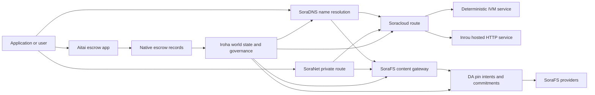

# SORA Nexus Үйлчилгээ {#sora-nexus-services}

SORA Nexus хэрэглээнд чиглэсэн үйлчилгээний нисэх онгоцыг нэмнэ Iroha 3. Эдгээр үйлчилгээ нь бие даасан номын сан биш, тэдгээр нь Iroha Дэлхийн улс, Norito манфист, удирдлагын баримт бичиг, Torii Ширээний гэр бүл.

Хэрэглээ нь түймрийн бүтээн байгуулалт болон сүлжээний хувилбараас хамаарна. [`/openapi`](/mn/reference/torii-endpoints.md#app-and-sora-route-families)-ийг зорилтын түймэр дээр ашиглаж, зөвшөөрөлтэй замын эрх бүхий жагсаалт болох болно.

## Компонент газрын зураг {#component-map}

|Компонент |Ажлын үүрэг |Гол талбай .|
| ---------------------- | ------------------------------------------------------------------------------------------------------------------------------------------- | ---------------------------------------------------------------------------------------- |
|Soracloud |Хэрэглээний хэрэгжилт, хостинг үйлчилгээ, хувийн загвар / гүйлгээний цаг үеийн байдал, үйлчилгээний амьдралын мөрийг хянах. |`/v1/soracloud/`, `/api/`, `iroha app soracloud ...`|
|Дотооддоо|Soracloud нь амьд HTTP нисэх онгоц шаардлагатай үйлчилгээний шинэчлэлийн үйл ажиллагаанд HTTP гүйцэтгэх хугацааг хүлээн авч байна. |Soracloud гүйлгээний цаг тохируулалт, хөтөч боломжийн зар сурталчилгаа, дүрсэлтийн гүйлгээны цаг байдлын .|
|SoraNet |Ширээ, ээлжит хөдөлгөөн, VPN, Холбооны үе шат, урсгалын чиглэлийн нууцлал, тээврийн орчин. |`/v1/connect/`, `/v1/vpn/`, SoraNet замын метадэтгэлэг |
|Мэдээллийн хангамж (DA) |Nexus замын, SoraFS тайлбарын болон баталгааны урсгалын дагуу дурдсан хэрэглээний ачааллын хангамжтай байдлын гэрэл баримт, үүрэг гүйцэтгэл, нэвтрүүлгийн зориулалтын шадар. |`/v1/da/`, `FindDaPinIntent`, `[sumeragi.da]`|
|SoraFS |Манифес, CAR нөөцийн ачаалл, тавигдсан агуулга, галт тэрэгний хуримтлагууд болон нөхөн сэргээх чадлын баталгааны урсгалыг хадгалах контентын хаягдалтай угаа. |`/v1/sorafs/`, `/sorafs/`, `FindSorafsProviderOwner`|
|SoraDNS |SORA -д байршуулсан үйлчилгээ, агуулгын тодорхойлох нэрэмжит болон шийдвэрлэх-аттестацийн шатаг. |`/v1/soradns/`, `/soradns/`, Resolver directory үйл явдлууд |
|Атай |Хэрэглээний түвшинд буй фиат болон хөрөнгийн зохицуулалтын коридор нь тусгай номын сангаас биш, дотоод хадгаламжийн бүртгэлээр дэмжлэг үзүүлж байна. |`OpenAssetEscrow`, `FindAssetEscrow*`,`EscrowEventFilter`, Kotodama `escrow_*` барилга байгууламж |



## Урьдчилсан урсгал {#common-flows}

### Хостын хуваарилсан хэрэглээ {#hosted-split-application}

Тухайн төрлийн халуун тайзны апп нь бүх хэсгийг хамтдаа ашигладаг:

1. Статикийн фронтэнд хөрөнгийг SoraFS -ээр багтаж, түймжилж байна.
2. Тухайлбал, `<app>.sora` олон нийтийн хөтлөгч нь SoraDNS хаягаар бүртгэгдсэн байна.
3. Soracloud замыг `/api/v1/search` эсвэл `/api/v1/stream` нь Inrou HTTP үйлчилгээний чиглэлд.
4. Soracloud замыг `/api/auth` болон `/api/v1/user` нь тодорхойлсон IVM хяналтын хэрэглэгчдэд зориулагдсан.
5. Хувийн байдлыг хангах шаардлагатай үйлчлүүлэгчид ижил агуулга эсвэл API замыг SoraNet тойроггоор хүргэж болно.

|Даяар |Хөдөөний нисэх онгоц .|Яагаад?|
| ----------------- | --------------------- | ------------------------------------------------- |
| `/`               |SoraFS статийн агууламж |Өрсөх боломжтой агуулгын түлхний болон хаалганы хэсгийг хадгалах |
|`/assets/*` |SoraFS статийн агууламж |Зохиоллын чиглэлээр захиалсан хөрөнгө, ил тод баримт |
|`/api/auth*` |Soracloud IVM|Өргөдлийн аюулгүй зохиол , мөн санхүүгийн асуудал |
|`/api/v1/user*` |Soracloud IVM|Засаг захиргааны хувьд эмзэг байдлын өөрчлөлт . |
|`/api/v1/search*` |Soracloud Энэтхэгийн .|Амьдрал HTTP үйлчилгээ, хадгаламж, SSE эсвэл цуглуулгачийн байдал |

### Зохиоллын хэвлэл {#content-publication}

SoraFS хэвлэл нь нэр нь тэдгээрийг заахаас өмнө удаан эдэлгээтэй артефактыг гаргадаг:

1. Хөдөлмөрийн ачаалал эсвэл захиалгыг бүтээх.
2. Энэ нь CAR архив болон хэсэг төлөвлөгөөт багтаж.
3. Norito нэвтрүүлэгний бодлого, удирдлагын мэдээллийг бүрдүүлэх.
4. Номын жагсаалтыг Torii албан тушаалд хүргүүлнэ.
5. DA нэрийн зорилго эсвэл бэлэн байдлын үүрэг гүйцэтгэх тухай баримт бичнэ, хэрэв зорилтын хувилбар тодорхой баталгаа шаарддаг бол.
6. Манифест нь SoraDNS нэртэй эсвэл Soracloud статикийн дэргэдэх чиглэлтэй холбох.

### Шаардлагатай тээвэрлэлт эсвэл урсгалын зам {#private-fetch-or-streaming-route}

SoraNet нь SoraFS эсвэл Soracloud -ийн өмнө сууж болно:

1. Хэрэглэгчид нэр эсвэл тэмдэгтийг шийддэг.
2. Хяналтын захиалга эсвэл замын жагсаалт нь нэвтрэх болон гарах релесийг сонгодог.
3. Зам тээврийн хөдөлгөөн багаж, SoraNet тойрогт дамжуулагдана.
4. Гадаад явгын ээлж SoraFS хаалга, Torii урсгал, эсвэл Soracloud замыг хүрнэ.

## Атай {#aitai}

Aitai нь SORA зах зээлийн загварын зохицуулалтын хэрэгслийн коридор бөгөөд худалдан авагч, борлуулагч гадаад зангилааны төлбөрийг зохицуулдаг бол Iroha нь гадаад зангийн хөрөнгийн хяналтыг удирдаж байна. Шинэ санхүүгийн хөрөнгийн хадгаламжийн урсгалд гэрээний өмчит хадгаламжны дансны эзэмшилтээс өөрөөр эх үүсвэрт оршин тогтносон хадгаламжны заалыг ашиглах хэрэгтэй.

Үндэсний хадгаламж нь номонд хадгаламжийг хадгалж байдаг. Худаллагч `OpenAssetEscrow` -ээр санал нээж, худалдан авагч `AcceptAssetEscrow` болон `MarkEscrowPaymentSent` -ээр зах зээлийн гадаад төлбөрийг хүлээн авч, тэмдэглэдэг бөгөөд худалдагчид төлбөрийг тэмдэглэхээс өмнө `ReleaseAssetEscrow` -ээр чөлөөлдөг эсвэл цуцлах юм. Хэрэв худалдан авагч болон борлуулагч санал нийлэхгүй бол аль алинд нь маргаан нээх боломжтой бөгөөд `CanResolveEscrowDispute`-ийн шийдвэрлэгч нь хаалттай хэмжээг хувааж болно.

Бүх амьдралын мөчлөг, нийтлэг хөрөнгийн нууцлал, үл мэдэгдэх хадгаламж, асуултууд, үйл явдлууд болон Rust -ийн жишээг үзнэ үү [Үндэсний хөрөнгийн хадгаламжийн ](/mn/blockchain/escrow.md).

|Атай дагуул |Үүнийг ашиглаарай.|
| ------------------------------------------------------------------------------------------------------------------------------------------------------------- | ----------------------------------------------------------------------------------------- |
| `OpenAssetEscrow`, `AcceptAssetEscrow`, `MarkEscrowPaymentSent`, `ReleaseAssetEscrow`, `CancelAssetEscrow`                                                    |XOR -ийн төлбөрийн урсгал зэрэг ил тод санхүүгийн хөрөнгийн санал. |
| `OpenAnonymousAssetEscrow`, `AcceptAnonymousAssetEscrow`, `MarkAnonymousEscrowPaymentSent`, `ReleaseAnonymousAssetEscrow`, `CancelAnonymousAssetEscrow`       |Санхүүжилт болон хаалтын хөдөлгөөнийг нотолгооны хавсралтаар гүйцэтгэх хамгаалалттай санал. |
|`OpenEscrowDispute`, `ResolveEscrowDispute`, `OpenAnonymousEscrowDispute`, `ResolveAnonymousEscrowDispute`|Шүүх хуралдаанаар маргааныг шийдвэрлэх. |
|`FindAssetEscrowById`, `FindAssetEscrowsBySeller`, `FindAssetEscrowsByBuyer`, `FindAssetEscrowsByStatus`|Хэрэглэлийн байдлын хуудсууд, тохируулалтын ажлын байр болон дэмжлэг үзүүлэх хэрэгсэл. |
|`EscrowEventFilter` |Хөдөлмөрийн төлөөлөгч, худалдагч, худалдан авагч, нөхцөл байдал эсвэл үйл явдлын төрөлгээр шууд ил тод бүртгэлтэй. |
| Kotodama `escrow_open_offer`, `escrow_accept`, `escrow_mark_payment_sent`, `escrow_release`, `escrow_cancel`, `escrow_open_dispute`, `escrow_resolve_dispute` |Kotodama гэрээний дуудлага нь V1 хадгаламжийн системээр баталгаажуулсан. |

Олон нийтийн Taira эсвэл Minamoto ашиглахын тулд гадаад төлбөрийн шугам болон аливаа дэмжлэг, шүүх ажлын урсгалыг өргөдлийн бодлогын хувьд авч үзээрэй. Iroha хадгаламжийн байдал, амьдралын мөрийн үйл явдлууд, нотолгоо хэшүүд, эцсийн хөрөнгийн хөдөлгөөнийг бүртгэдэг; энэ нь фиат тооцоог өөрөө баталгаажуулахгүй.

## Зорилгоны сүлжээг шалгана {#check-a-target-node}

Энэ хуудасны жишээг ашиглахаасаа өмнө чиглэлийн гэр бүл нь та зорилтот цэг дээр байдаг эсэхийг баталгаажуул:

```bash
export TORII_URL=https://taira.sora.org

curl -fsS "$TORII_URL/openapi.json" \
  | jq '.paths | keys[] | select(test("^/v1/(soracloud|sorafs|soradns|connect|vpn|da)/"))'

curl -fsS "$TORII_URL/status" | jq .
```

Хэрэв `/openapi.json` нь профилээс илрээгүй бол `/openapi`-ийг туршиж үзээрэй. Тухайн чиглэлийн бэлэн байдал барилга байгууламжийн шинж чанар, сүлжээний конфигурацынд хамаарна.

### Taira Зөвхөн уншигчдын цахилгаан тамхины шалгалт {#taira-read-only-smoke-checks}

Олон нийтийн Taira төгсгөл нь уншигч талын шалгалт хийхэд ашигтай боловч таны зөвшөөрөлтэй дансыг ажиллуулж, амьд байдлыг өөрчлөх бодолгүй бол өөрчилсөн үлгэр жишээний хувьд ашиглаарай.

```bash
export TORII_URL=https://taira.sora.org

curl -fsS "$TORII_URL/status" \
  | jq '{version: .build.version, peers, blocks, lanes: (.teu_lane_commit | length)}'

curl -fsS "$TORII_URL/v1/connect/status" | jq '{enabled, sessions_active}'

curl -fsS "$TORII_URL/v1/vpn/profile" \
  | jq '{available, relay_endpoint, supported_exit_classes}'

curl -fsS "$TORII_URL/v1/sorafs/storage/state" \
  | jq '{bytes_capacity, bytes_used, pin_queue_depth, por_inflight}'

curl -fsS -H 'Accept: application/json' "$TORII_URL/v1/soracloud/status" \
  | jq '.control_plane | {service_count, services: [.services[] | {service_name, current_version}]}'
```

Taira нь нэвтрүүлэгт зориулсан хяналтын төслийн чиглэлийг нэвтрүүлэхэд тусгайлан суулгах боломжтой бөгөөд энэ чиглэл нь OpenAPI зам газрын зураг дээр жагсаалдаггүй. `/openapi` -ийг үндсэн үүсгэсэн API гэрээ гэж үзээрэй, дараа нь нэвтэрүүлэгт холбогдох ямар нэгэн чиглэлийг шууд баталгаажуулахын өмнө үүнийг амьд бичиж өгөөч.

## Soracloud {#soracloud}

Soracloud нь SORA хэрэгслийн хяналтын хавсралт юм. Энэ нь нэвтрүүлгийн бандл, үйлчилгээний шинэчлэл, замын хөдөлгөөн, өргөн мэдүүлэх байдал, эрх бүхий конфигурацийн бүртгэл, нууцлагдсан үйлчилгээний нууцыг, загварын регистрийн тэмдэглэл, хувийн дүгнэлт хийх үе шат, гүйлгээний цагийг хүлээн авдаг байна.

Soracloud нь хоёр гүйцэтгэх төвийг ашигладаг:

|Хөдөлмөрийн нисэх онгоц .|Хөдөлмөрийн цаг|Үүнийг ашиглаарай.|
| ---------------------- | ------- | -------------------------------------------------------------------------------------------- |
|`DeterministicService` |`Ivm` |Зохиолч, хадгаламжийн орчин, баталгаажсан уншилт, захиалгын хайрцаг хэрэглэгч, засаглалтай холбоотой шилжилт |
|`HttpService` |`Inrou` |Амьдрал HTTP APIs, цуглуулчийн ачаалалтай ажил, хажуугаар дэмжиж буй үйлчилгээ, SSE, хөтөчээр дэмжлэг үзүүлэх урсгал |

Хяналтын талбай нь эрх мэдэлтэй. Хөдөлгөөн, шинэчлэл, эргэлт, тохируулалт, нууц, загвар, байдлын команд Torii -ийн дамжуулан ирүүлнэ, дэлхийн нөхцөл байдлыг уншдаг; тэд тусгай CLI -гийн орон нутгийн үзэгдэлд тавигдахгүй байна. Олон нийтийн чиглэл нь хамгийн урт префикс дээр суурилсан тул нэг бүртгэгдсэн хөтөч замыг HTTP хостинг шугам болон API тодорхойлсон шугам хооронд хувааж болно.

### Дээрх хэрэглээг тавих {#scaffold-a-split-app}

Хөдөлмөрийн хуваарилалтын загвар нь статик фронтэнд болон API хостын амьд үйлчилгээ, API дэглэмчилсэн хавтан / үйлчилгээг бий болгодог:

```bash
iroha app soracloud app init \
  --template split-app \
  --app-name solswap_indexer \
  --app-version 0.1.0 \
  --public-host solswap-indexer.sora \
  --output-dir ./apps/solswap-indexer

iroha app soracloud app local-plan \
  --manifest ./apps/solswap-indexer/app_manifest.json

iroha app soracloud app doctor \
  --manifest ./apps/solswap-indexer/app_manifest.json
```

`local-plan` нь замын хуваалт, хүүхдийн үйлчилгээний манифест, ажлын байрны скриптийн зам, урьдчилан төлөвлөсөн фронтэнд хэвлэлийн хэлбэрг хэвлэнэ. `doctor` нь та Torii-ийг оролцуулахын өмнө орон нутгийн худалдааны гэрээг баталгаажуулна.

### Хөдөлмөрийн хэрэгслийн байдлыг ашиглах, шалгах {#deploy-and-inspect-app-state}

```bash
export SORACLOUD_TORII_URL=https://<soracloud-enabled-torii>

iroha app soracloud app deploy \
  --manifest ./apps/solswap-indexer/app_manifest.json \
  --torii-url "$SORACLOUD_TORII_URL"

iroha app soracloud app status \
  --manifest ./apps/solswap-indexer/app_manifest.json \
  --torii-url "$SORACLOUD_TORII_URL"
```

Урьдчилсан үйлчилгээний хувьд үйл ажиллагааны хэмжээнд зориулсан командыг ашиглах:

```bash
iroha app soracloud status \
  --service-name solswap_indexer_live \
  --torii-url "$SORACLOUD_TORII_URL"

iroha app soracloud rollback \
  --service-name solswap_indexer_live \
  --target-version 0.1.0 \
  --torii-url "$SORACLOUD_TORII_URL"
```

### Нээлттэй болон нууцлаг материал {#config-and-secret-material}

Soracloud конфигурац болон нууц товчлолт нь албан ёсны ашиглалтын байдлын нэг хэсэг юм. Оюулгах, шинэчлэл хийх, эргэн шилжүүлэх шаардлагатай конфигурацыг эсвэл нууц товчоо байхгүй бол хаагдахгүй эсвэл идэвхтэй манифестүүдтэй нийцэхгүй үед хаагдаагүй байна.

```bash
iroha app soracloud config-set \
  --service-name solswap_indexer_live \
  --config-name indexer/public_config \
  --value-file ./config/public-config.json \
  --torii-url "$SORACLOUD_TORII_URL"

iroha app soracloud secret-set \
  --service-name solswap_indexer_live \
  --secret-name indexer/api_key \
  --secret-file ./secrets/api-key.envelope.json \
  --torii-url "$SORACLOUD_TORII_URL"
```

CLI -ийн тусламжтайгаар таны хувилбар шаарддаг үнэн зөв итгэлийг илрүүлэх:

```bash
iroha app soracloud config-set --help
iroha app soracloud secret-set --help
```

## Үргэлж {#inrou}

Inrou нь Soracloud ашигладаг хостинг HTTP гүйлгээний цаг хугацаа юм. Iroha түймэр нь Soracloud гүйлтийн цаг үеийн төслүүдийг орон нутгийн материализацийн төлөвлөгөөнд хүлээн зөвшөөрөгдсөн Soracloud нөхцөлтэй, хуваалцагдсан хостинг үйлчилгээний хувилбарыг буулгын үйлчилгээнд зориулан эхлүүлж байна, Энэ нь цахилгаан хэрэгслийн гүйцэтгэх цаг хугацааны төлөвлөгөөг баталгаатай загварт буцааж өгөөч.

APIs, SSE урсгалууд, хоолойд дэмжлэг үзүүлж буй хяналтын хэрэгсэл, эсвэл браузерээр туслах үйлчилгээ зэрэг амьд HTTP гадаргуудыг шаардагдсан ажлын ачааллын хувьд Inrou-ийг ашиглах.

### Хөдөлмөрийн цаг хугацааны шаардлага {#runtime-requirements}

- Контейнерийн тайлангийн гүйцэтгэх цаг нь `Inrou` байх ёстой.
- Үйлчилгээний тайлан гүйцэтгэх төвийг `HttpService` байх ёстой.
- `HttpService + Inrou` нь яг нэг `PersistentRootLeaseVolume`-ийг `/` дээр суурилуулж байх ёстой.
- Inrou-ийн сэргээгдэх үйлчилгээ нь өөрчлөх хуваарилсан байдлаа хадгалж байх үедээ хамтран үйлчлэх үйлчилгээ эсвэл нууцтай лизингийн агууламж шаарддаг.
- Үйлдвэрлэлийн хостинг цэгүүд зөвхөн төлөөлөгчөөр үйл ажиллагаа явуулахын оронд ИНРУ-ийн бодит чадавхийг зарлаж байх ёстой.

### Өргөдлийн хэсэг {#manifest-fragment}

Доорх жишээ нь хоёр манифестийн хэлбэрийг харуулж байна. Энэ нь бүрэн ашиглалтын цогц биш хэсэг юм.

```jsonc
// container_manifest.json
{
  "schema_version": 1,
  "runtime": { "runtime": "Inrou", "value": null },
  "bundle_path": "/bundles/solswap-indexer.inrou",
  "entrypoint": "/app/bin/launch-indexer.sh",
  "args": [],
  "env": {
    "RUST_LOG": "info",
  },
  "inrou": {
    "schema_version": 1,
    "guest_os": { "guest_os": "DebianSlim", "value": null },
    "guest_images": {
      "x86_64": {
        "kernel_image_path": "/inrou/x86_64/vmlinux",
        "rootfs_image_path": "/inrou/x86_64/rootfs.ext4",
        "initrd_image_path": null,
      },
      "aarch64": {
        "kernel_image_path": "/inrou/aarch64/vmlinux",
        "rootfs_image_path": "/inrou/aarch64/rootfs.ext4",
        "initrd_image_path": null,
      },
    },
  },
  "lifecycle": {
    "start_grace_secs": 60,
    "stop_grace_secs": 30,
    "healthcheck_path": "/api/indexer/v1/health",
  },
}
```

```jsonc
// service_manifest.json
{
  "schema_version": 1,
  "service_name": "solswap_indexer_live",
  "service_version": "0.1.0",
  "execution_plane": { "execution_plane": "HttpService", "value": null },
  "replicas": 2,
  "route": {
    "host": "solswap-indexer.sora",
    "path_prefix": "/api/v1/search",
    "service_port": 8080,
    "visibility": { "visibility": "Public", "value": null },
    "tls_mode": { "tls": "Required", "value": null },
  },
  "lease_volumes": [
    {
      "volume_name": "root_disk",
      "kind": {
        "lease_volume": "PersistentRootLeaseVolume",
        "value": null,
      },
      "storage_class": { "storage_class": "Warm", "value": null },
      "mount_path": "/",
      "max_total_bytes": 8589934592,
    },
    {
      "volume_name": "index_state",
      "kind": { "lease_volume": "ServiceLeaseVolume", "value": null },
      "storage_class": { "storage_class": "Warm", "value": null },
      "mount_path": "/var/lib/solswap-indexer",
      "max_total_bytes": 1073741824,
    },
  ],
}
```

Хөдөлмөрийн хэрэгслийн үйл ажиллагааны явцад бүртгэгдсэн лизингийн хэмжээ нь хэмжээний нэрээс үүдэлтэй байгаль орчны өөрчлөлтүүдийг ашиглан илэрч байна.

```text
SORACLOUD_LEASE_VOLUME_ROOT_DISK_DIR
SORACLOUD_LEASE_VOLUME_ROOT_DISK_MOUNT_PATH
SORACLOUD_LEASE_VOLUME_INDEX_STATE_DIR
SORACLOUD_LEASE_VOLUME_INDEX_STATE_MOUNT_PATH
```

## SoraNet {#soranet}

SoraNet нь хувийн хэвшил, тээврийн давхарчлал юм. Энэ нь зорилтот хаалга эсвэл үйлчилгээтэй шууд холбохгүй хөдөлгөөний ээлжит замыг бүрдүүлж байна. Тээврийн загвар нь нэвтрүүлэг, дундаж болон гарах релейн үүрэг, QUIC тээврийн хэрэгсэл, дуу хоолой дээр суурилсан гибрид гарцаажуулалт, хүчин чадлын хэлэлцээр, релейн захиалгын метабараа мэдээлэл, тогтмол хэмжээний өрөөсөн элемент ашигладаг.

Үүнд Nexus нэвтрүүлэг, SoraNet нэвтрүүлэг, галт тэрэгний хөдөлгөөнийг тээвэрлэх боломжтой, VPN эсвэл Connect цуврал, Norito нэвтрүүлгийн чиглэлүүд. Тодруулгын бүртгэл нь дэмжлэг үзүүлэх релеүүдийг тэмдэглэж болно `norito-stream`, Энэ нь үйлчлүүлэгчдэд тохиромжтой замыг сонгохыг зөвшөөрдөг Torii RPC эсвэл замын хөдөлгөөнийг дамжуулах.

### Агаарын урсгалын тохируулалт {#streaming-configuration}

Nexus хувилбар нь SoraNet урсгалын замыг хангах боломжийг олгож байна:

```toml
[streaming]
feature_bits = 0b11

[streaming.soranet]
enabled = true
exit_multiaddr = "/dns/torii/udp/9443/quic"
padding_budget_ms = 25
access_kind = "authenticated"
provision_spool_dir = "./storage/streaming/soranet_routes"
provision_spool_max_bytes = 0
provision_window_segments = 4
provision_queue_capacity = 256
```

Үзэгчний баталгаажуулалтыг шаардахгүй контентын замын хувьд `access_kind = "read-only"` ашиглах. Хөдөлмөрийн төлөөлөгч нь Torii эсвэл хостинг үйлчилгээг хүргэхээс өмнө тавилга, үзэгчний тодруулгыг хэрэгжүүлэх ёстой үед `authenticated`-ийг ашиглана.

### SoraNet-Засга SoraFS Тэмүүлнэ {#soranet-aware-sorafs-fetch}

SoraFS авагч CLI нь орон нутгийн прокси манифст гаргаж, браузерын өргөтгөлийн болон SDK адаптерын чиглэлийн SoraNet метабараа өгөгдлийг гаргах боломжтой:

```bash
sorafs_cli fetch \
  --plan artifacts/payload_plan.json \
  --manifest-id 7bb2...9d31 \
  --provider name=alpha,provider-id=9f5c...73aa,base-url=https://gw-alpha.example.org/,stream-token="$(cat alpha.token)" \
  --output artifacts/payload.bin \
  --json-out artifacts/fetch_summary.json \
  --local-proxy-manifest-out artifacts/proxy_manifest.json \
  --local-proxy-mode bridge \
  --local-proxy-norito-spool storage/streaming/soranet_routes \
  --local-proxy-kaigi-spool storage/streaming/soranet_routes \
  --local-proxy-kaigi-policy authenticated \
  --max-peers=2 \
  --retry-budget=4
```

Жишээлбэл, дүгнэлт бичгийн нийлүүлэгч мэдээллүүд, хуримтлагдсан хүлээн зөвшөөрөл, орон нутгийн төлөөлөгчийн метабараа мэдээлэл, татаж авахын тулд ашигласан үр дүнтэй чиглэлийн тохируулалт.

## Мэдээллийн хангамж (DA) {#data-availability-da}

DA нь дэлхийд шууд байршуулахэд хэт том, хувийн хэвшлийн хувьд хэт эмзэг эсвэл үйлчилгээний хувьд хэтэрхий онцгой ач холбогдолтой ашиг ачааллын хангамжийн баталгааны шадар юм. Энэ нь тодорхойлолт хариуцлага, сэргээлтийн үүргийг бүртгүүлж байгаа тул баталгаажуулагчид, шлюзүүд болон үйлчлүүлэгчид ямар байт амласан тухай, ямар бодлого хэрэгжиж буй талаар, ямар баримтлал ажиглагдсан талаар тохирох боломжтой.

DA нь Kura эсвэл SoraFS-ийг залгаагүй:

- Kura нь эцсийн блок урсгалын болон тохиролцооны нөхөн сэргээлтийн мэдээллийг хадгалдаг.
- SoraFS нэвтрүүлэгт чиглэсэн байтыг, CAR ашиг ачааллыг хадгалах, үйлчлэх.
- DA нь тухайн байтыг хуваарилж, хяналт шалгалт хийж, номын сүлжээний төлөвлөгөөнд холбохыг зөвшөөрөх үүрэг, баталгааны бодлого, баталгааын нээлттэй нээлт, шилжилтийн зорилгыг бүртгэж байна.

Хэрэглээ DA хүсэлт, эсвэл Nexus Lane нь зах зээлийн бус өгөгдлийг эргүүлэн авах боломжтой хэвээр үлдэх тухай номонд харагдаж буй гэрчилгээ хэрэгтэй. Нийт тохиолдлын жишээ нь зардлын урсгалд зориулсан хэрэглэгдэх ачаалал үүрэг гүйцэтгэгч, SoraFS хэвлэгдсэн агуулга, дараагийн хяналт шалгалтын тулд хадгалах ёстой баталгааны багц, болон олон нийтийн байдал нь бүрэн хэрэглээний ачааллын орчмын оронд дасан зохицуулалт байх ёстой ашиглалтын артефактууд.

### Амьдралын мөчлөл {#lifecycle}

|Сэдж .|Хэвлэлд бүртгэгдсэн зүйл|
| ---------- | ----------------------------------------------------------------------------------------------------------------------------------------------------- |
|Дашрамд .|Билет, илтгэлийн сүлжээн, нууц үсэг, замын / эпохины / дараалалтын сүлжээнд, хадгалах бодлого, эсвэл дубликацийн зорилт. |
|Үүнд үүрэг гүйцэтгэх|Манифест, замын ачаалал, баталгааны багц, эсвэл агуулгын суурь нь номонд харагдаж буй бүртгэлтэй холбодог материалыг дэглэх. |
|Дашрамд|Хэрэглээний санал, баталгааны нээлттэй байршил, нийлүүлэгчдийн гэрчилгээ, эсвэл зорилтот сүлжээ хүлээн зөвшөөрсөн бусад хувилбарын тодорхой баримтлал. |
|Судалгаа |`FindDaPinIntentByTicket`, `FindDaPinIntentByManifest`, `FindDaPinIntentByAlias` эсвэл `FindDaPinIntentByLaneEpochSequence`-ийн дагуу нэвтрүүлгийн зорилготой хайгуудыг хийх. |

DA -ийн дэмжлэгтэй нийтлэлийн урсгал нь:

1. WSV дэргэдэх хэрэглээний ачаалал, жишээ нь SoraFS CAR файл эсвэл Nexus замын ашиг ачааллыг бүтээх эсвэл хүлээн авах.
2. Norito тайлан болон маршрутын тухайн үүрэг гүйцэтгэх бүртгэлд ашигтай ачааллыг тодорхойлох.
3. Тус чиглэлийн гэр бүлийг ашиглах боломжтой бол `/v1/da/*` буюу сүлжээний гарын үсэг зурсан гүйлгээний замыг дамжуулан manifest, pin intention эсвэл commitment-ийг өргөн мэдээрэй.
4. Ажилтай нотлох бодлогын дагуу шаардлагыг баталгаажуулагч, ашиглах боломжтой байдлын үйлчилгээ үзүүлэгчид цуглуулж өгөх ёстой.
5. Үүнээс үүдэлтэй нэрийн зорилго эсвэл үүрэг гүйцэтгэгчдийг ашигтай ачаалал дээр хамаарах аливаа нууц үсэг, төлбөр тооцооны баталгаа эсвэл галт замын чиглэлээр сурталчлахын өмнө асууж үзээрэй.

### Алгоритмын загвар {#algorithmic-model}

DA нөөц ачааг гарын үсэг зурсан, дахин тоглож хамгаалалттай, блок-индексирсэн үүрэг болгодог. чухал алгоритмүүд нь тодорхойлогч тул баталгаажуулагчид болон шлюзүүд ижил бийтээс ижил дигестийг дахин тооцох боломжтой юм.

1. Torii нь `(lane_id, epoch, sequence)`, хэрэглээний ачааллын байт, хатуулалтын метадэтгэл, хэсгийн хэмжээ, татаж авах профил, хадгалах бодлого, өргөн мэдүүлэгчний гарын үсэг бүхий хэрэглээний хүсэлтийг хүлээн авдаг. Энэ түймэр нь хүсэлтэд gzip, deflate, эсвэл Zstandard ашиг ачааллыг буулгадаг бөгөөд дараа нь каноникийн байт урт нь `total_size` -тэй тэнцэх эсэхийг баталгаажуулна.
2. Nexus замын жагсаалтад байх ёстой. `chunk_size` нь хоёр, хамгийн багадаа хоёр байт, болон тохируулсан дээд түвшинээс хэтрэхгүй нөлөөгүй хүчин чадалтай байх ёстой. Татаж авах профил нь өгөгдлийн хэсгүүд, хамгийн багадээ хоёр тэнцэх хэсгийг бүрдүүлдэг байх хэрэгтэй. Замын жагсаалтад `merkle_sha256` эсвэл `kzg_bls12_381` гэсэн баталгаажуулалтын схемыг сонгоно.
3. Түлжээний бодлогыг хэрэгжүүлнэ. Тус түймэр нь Блоб класын конфигуруулсан дугуйлалт, хадгалах үндсэн чиглэлийг дагаж өгдөг. Олон нийтийн метадэтг текст хэвээр үлдэх ёстой; зөвхөн засаглалын метадэтгийг маннифест бичигдээс өмнө түймрийн тохируулсан засаглалтын метадэтгийн товчтой кодлуулж байна.
4. Canonical нөөц ачаалал нь тогтмол хэмжээний профиль `chunk_size`. Torii нөөц ачаалал, нөхөн сэргээх чадлын гэрчилгээний модны гарал, бүрэлдэхүүний үүрэг гүйцэтгэгчдийг тооцоолдог. BLAKE3 Байт дээр үүрэг гүйцэтгэгч.
5. Хажуулалтын үүргээ нэмнэ. Хөдөлгөөн нь `data_shards` -ийн шугамд хуваагддаг. эцсийн шугам дахь алдагдалтай нуруу нь тэнцвэрлэлийн тооцоо хийхэд нөлөөтэй юм. RS(16) тэнцвэрлэл нь шугам / дэлхийн тэнцвэрлэг хэсгийг бий болгодог; сонголттой `row_parity_stripes` нь матрицын түвшний хэв маягийн шугамны тэнцвэрт нэмэх болно . Паритын хэсгийн үүрэг гүйцэтгэгч нь BLAKE3 жижиг андиан `u16` тэмдэгтүүд юм.
6. `DaManifestV1` нь замын хөдөлгөөн, эпохи, цөцгийн ангилал, кодек, хэрэглэгчийн ачаалал, хэсгийн гарал, хэсгийн хэмжээ, арилгах хувилбар, хадгалах бодлого, орлогын үнийн дүн, хэсгийн үүрэг гүйцэтгэл, сонголттой IPA үүрэг, мета мэдээлэл, гаргах цаг хугацааг бүртгэж байна. Тавитын хувилбар нь тодорхойлогч: түймэр хамгийн түрүүнд хол хувилбартай манифестийн загварыг хашж, дараа нь энэ аргыг эцсийн `storage_ticket` хэлбэрээр эргүүлнэ.
7. Урьдчилсан тоглоомын зөрчлөөс татгалзах. Урьдчилгааны товч нь `(lane_id, epoch, sequence, manifest_fingerprint)`. Тухайн цацны эзтэй дубликат нь үл нөлөөтэй юм. Үргэлжсэн цуврал эсвэл янз бүрийн гарын үсэгтэй ижил цуврал үгүйсгэгддэг.
8. Гарын үсэг зурсан артефактыг гарга. Torii нь PDP үүрэг даалгаврыг тооцож, `DaIngestReceipt` -ийг гарын үсэг зураад, `DaCommitmentRecord` -ийг барьж, PDP үүрэг даалгаа, үүрэг гүйцэтгэх бүртгэл, үүрэг дагалтын хуваарь, PIN-ийн зорилго, хүлээн авах файл, хүлээн авах товчлогын бүрэлдэхүүн хэсгийг бичиж байна. Тэтгэлэгний курсор нь `(lane_id, epoch)`-д нэг хүйцтэй явагддаг.

Зохиоллын бүртгэл нь блокууд барьж байдаг.

- Зураг, цаг үе, дараалал
- caller blob ID болон canonical manifest hash
- замын даатгалын тогтолцоо
- мөрийн чулуун
- KZG замын хувьд сонголттой KZG үүрэг гүйцэтгэх
- PDP/бичлэлийн хоолой
- хадгалах анги, хадгалах тавилга
- Torii DA баталгааны гарын үсэг

Блок DA бүртгэлийг бүрдүүлэхээс өмнө, блок хуримтлалын замаар багтлыг баталгаажуулна:

- `(lane_id, epoch, sequence)` нь цогцолбор дотор өвөрмөц байх ёстой.
- Өргөдлийн хэшүүд нь нөлөөгүй, цогцолбор дотор онцлог байх ёстой.
- Хөдөлмөрийн баталгааны хөтөлбөр нь тохируулсан замын бодлогын дагуу байх ёстой.
- Merkle шугам KZG үүрэг гүйцэтгэгчдийг татгалзаж, KZG шугам нь нөлөөгөөр бус KZG үүргийг шаарддаг байна.
- Пин нээлт нь замын дагуу, манифст хэшээр, хадгаламжийн тавилга, эзэмшигчдын данс болон цогцолборын дүрмийн дагуу ангилагдаж, ангилагдана.

Block header нь хэшийг хадгалдаг DA гишүүнчлэлийн баримтлал, үүрэг гүйцэтгэгч, Зохиоллын багц нь мөн Merkle түлсийг илрүүлж байгаа бөгөөд хөрс нь Canonical-ийн хэшүүд Norito- кодлогдсон `DaCommitmentRecord` Эцэг эх цэгүүд нь зүүн болон баруун хүүхдийн холбогдлыг хашж, ховор буланг өөрчлөхгүй дараагийн давхарт шилжүүлнэ.

### Дашрамд шалгах {#proof-verification}

`/v1/da/commitments/prove` нь блок дахь нэг үүрэг гүйцэтгэгчний баталгаа гаргаж болно. Энэ баталгаат үүрэг, блок өндөр, банд дахь индекс, бандл хэш, бандлийн урт, Merkle түлх, ах дүүс зам байдаг:

1. Дашрамдсан бандл хэши нь блок толгойны DA үүрэг гүйцэтгэх хэшитэй нийцнэ.
2. Дашрамдлын блок өндөр нь дурдсан блок толгойтой нийцдэг.
3. Энэ индекс нь хязгаарлагдмал бөгөөд үүрэг гүйцэтгэгч нь тухайн индекст багц бүртгэлтэй тэнцүү байна.
4. Замын хөдөлгөөнөөс урьдчилан сэргийлэх бодлого нь гэрээнд нийцдэг.
5. Гэр бүлийн замыг үүрэг даалгаврын хавсралтаас буулгах нь хүрээлэн буй ургамлыг сэргээнэ.
6. Шинэ бүтээн байгуулалт хийсэн чулуун нь бөмбөгийн чулуунтай тэнцүү байна.

Энэ нь тухайн блок-ийн ашигтай ачаалалд тодорхой хүртээмжтэй байдлын үүрэг гүйцэтгэгч багтаж байсан гэдгийг баталдаг; энэ нь одоогийн байдлаар бүх хувилбар нь онлайн байдаг эсэхийг баталдаггүй. Амьдрал авах чадвар нь SoraFS нийлүүлэгчээс олох, PDP/PoTR шалгалт эсвэл профилийн онцгой хүртээмжтэй байдлын гэрчилгээгээр тусдаа шалгагдана.

### Үндсэн ойлголттой харилцан үйлчлэл {#consensus-interaction}

DA нь найдвартай нэвтрүүлэг (RBC) дамжуулан Sumeragi-д холбогддог боловч энэ нь хоёр дахь эцсийн протокол биш юм. RBC санал хураалтыг түгээж, нөхөн сэргээдэг: санал болгогч `(height, view, payload_hash)`, өрсөлдөгчдийн солилцооны хэсгүүд, `READY`/`DELIVER` сигналуудыг цуглуулж, хангалттай баталгаажуулагчид ижил ашигтай ачааллыг ажиглаж байгаа эсэхийг шалгаж байна.

Iroha 3 хэмжээнд ижил төстэй хүн нь дараах тохиолдолд хүлээлттэй блок ашиглалтын ачаатай гэж үздэг:

- орон нутгийн хүлээлттэй блок хэшийг хүлээгдсэн ашиг ачаалал хэшигээр хийнэ, эсвэл
- RBC нь блок хэши, өндөр, дүрс, ашиг ачааллын хэшигтэй нийцсэн хэрэглээний ачааллыг сэргээжээ.

Хэрэв аливаа нөхцөл нь хүчин төгөлдөр биш бол дундаж тэмдэглэл `missing_local_data`, RBC эсвэл блок синхрон дамжуулан ашиг шимтгэлийг сэргээхийг үргэлжлүүлэн хичээдэг бөгөөд DA даргыг байдал, телеметрийн талаар мэдээлэх болно. Одоогийн хэрэгжилтэд эдгээр DA сигналууд эцсийн зорилгоор зөвлөж байна: блок нь хэдийгээр тусгай зөвшөөрлийн гэрчилгээ болон нийцсэн орон нутгийн ашигтай ачаалал дээр тулгуурлана, харин бие даасан DA кворум гэрчилгээээс биш.

DA Цаг хугацаа нь сэргээлтийн ширээг өргөжүүлнэ. DA Quorum timeout нь тохируулсан блок болон commit timings-ээс үүдэлтэй бөгөөд дараа нь `sumeragi.advanced.da.quorum_timeout_multiplier`. Урьдчилсан цаг хугацаа нь: `max(quorum_timeout, availability_timeout_floor_ms) * availability_timeout_multiplier`. Тухайн бэлэн байдлын хугацаа дууснаар түймэр нь ашиг ачаалал нөхөн сэргээхэд дэмжлэг үзүүлж, урьдчилан сэргийлэх цаг хугацааны шинэчлэлээс зайлсхийнэ. Энэ хугацаа дууснаас хойш хэвийн сэргээлт болон үзэл бодлоо өөрчлөх замыг үргэлжлүүлэх боломжтой.

### Үйлчлүүлэгчдийн тэмдэглэл {#operator-notes}

Iroha 3 тохиролцооны хувилбарууд нь RBC-ийн дэмжлэгтэй ашиг ачааллын түгээлт, манифст хамгаалалт, DA бандлийн баталгаажуулалт, нөхөн сэргээлтийн телеметри зэрэг юм. Хөгжлийн загварын хувьд `[sumeragi.da]` нэг бүрэлдэхүүнд үүрэг гүйцэтгэгчдийн хязгаарлал болон нотлох нээлттэй байршил; нэмж `[sumeragi.advanced.da]` цаг хугацааны хувилбаруудыг quorum болон хүртээмжийн заншлын хувьд. Эдгээр тохируулгыг нэг сүлжээний профилд баталгаажуулагчдын хооронд нийцүүлэн байлгаарай.

Замын илрэлтийн тулд түймрийн OpenAPI баримт бичигээс эхлээд:

```bash
curl -fsS "$TORII_URL/openapi.json" \
  | jq '.paths | keys[] | select(startswith("/v1/da/"))'
```

Үргэлж [хайлтын дуудлага](/mn/reference/queries.md#nexus-data-availability-and-packages) цахилгаан DA асуултын нэр, [дундаж хувилбарын загвар](/mn/reference/peer-config/) орон нутгийн `[sumeragi.da]` Таны бүтээн байгуулалтаар илэрсэн бөмбөг.

## SoraFS {#sorafs}

SoraFS нь төвлөрсөн агуулга-адреслэгдсэн хадгаламжийн салбар юм. Энэ нь байтыг тодорхойлолттай хэсэгт, CAR архив болон Norito нэвтрүүлэгээр багтааж, агуулгын түлсийг холбодог, хэсгийн хувилбарууд, пин бодлого, засаглалын баталгаажуулалтын . Хөдөлмөрийн хадгалах үйлчилгээ үзүүлэгчид агууламжийн хүчин чадал, хэрэглээний хүртээмжийг сурталчилгаа хийдэг бол нэвтрүүлэгүүд нь агуулгыг хүргэхээс өмнө манифест болон хэсгүүдийн үүргийг баталгаажуулдаг.

SoraFS-ийн түгээмэл хэрэглээ нь статикийн аппликейшн актив, баримт бичгийн бүтээн байгуулалт, зоны багц, загвар эсвэл артефактын сүлжээ, засаг захиргааны гэрчилгээний багц юм. Iroha мэдээллийн загварын хувьд SoraFS дархан шатны үйл явдлууд болон [`FindSorafsProviderOwner`](/mn/reference/queries.md#nexus-data-availability-and-packages) хангамж эзэмшигчдийн шийдвэрлэхийн хайлтыг илрүүлж байна.

### Нөхөрлөж, илгээж, гарын үсэг зурж, хүргүүлнэ {#pack-manifest-sign-and-submit}

```bash
cargo run -p sorafs_car --features cli --bin sorafs_cli -- \
  car pack \
  --input ./dist \
  --car-out artifacts/site.car \
  --plan-out artifacts/site.chunk-plan.json \
  --summary-out artifacts/site.car-summary.json

cargo run -p sorafs_car --features cli --bin sorafs_cli -- \
  manifest build \
  --summary artifacts/site.car-summary.json \
  --manifest-out artifacts/site.manifest.to \
  --manifest-json-out artifacts/site.manifest.json \
  --pin-min-replicas=3 \
  --pin-storage-class=warm \
  --pin-retention-epoch=42

SIGSTORE_ID_TOKEN=$(oidc-client fetch-token) \
cargo run -p sorafs_car --features cli --bin sorafs_cli -- \
  manifest sign \
  --manifest artifacts/site.manifest.to \
  --bundle-out artifacts/site.manifest.bundle.json \
  --signature-out artifacts/site.manifest.sig

cargo run -p sorafs_car --features cli --bin sorafs_cli -- \
  manifest submit \
  --manifest artifacts/site.manifest.to \
  --chunk-plan artifacts/site.chunk-plan.json \
  --torii-url "$TORII_URL" \
  --resolve-submitted-epoch=true \
  --authority=<i105-account-id> \
  --private-key-file ./secrets/authority.ed25519 \
  --summary-out artifacts/site.manifest.submit.json \
  --response-out artifacts/site.manifest.submit.body
```

Хэрэв `/v1/sorafs/pin/register` нь зорилтот түймэр дээр чиглэгдэхгүй бол CLI нь гарын үсэг зурсан `/transaction` өргөн мэдүүлэг рүү буцаж ирж, терминалын урсгалын байдлыг хүлээх болно.

### Хяналт шалгаж, авна {#verify-and-fetch}

```bash
cargo run -p sorafs_car --features cli --bin sorafs_cli -- \
  proof verify \
  --manifest artifacts/site.manifest.to \
  --car artifacts/site.car \
  --chunk-plan artifacts/site.chunk-plan.json \
  --summary-out artifacts/site.verify.json

sorafs_cli fetch \
  --plan artifacts/site.chunk-plan.json \
  --manifest-id <manifest-digest-hex> \
  --provider name=primary,provider-id=<provider-id-hex>,base-url=https://gateway.example.org/,stream-token="$(cat provider.token)" \
  --output artifacts/site.fetch.tar \
  --json-out artifacts/site.fetch.json
```

### Худалдан авах чадлын баталгааны шалгалт {#proof-of-retrievability-checks}

Үйлчлүүлэгчид хадгаламжийн үйлчилгээ үзүүлэгчдэд зориулсан хяналт шалгалтыг хийж, эхлүүлэх боломжтой:

```bash
sorafs_cli por status \
  --torii-url "$TORII_URL" \
  --manifest <manifest-digest-hex> \
  --status=failed \
  --limit=20

sorafs_cli por trigger \
  --torii-url "$TORII_URL" \
  --manifest <manifest-digest-hex> \
  --provider <provider-id-hex> \
  --reason=latency_probe \
  --samples=48 \
  --auth-token artifacts/challenge_token.to
```

## SoraDNS {#soradns}

SoraDNS нь SORA үйлчилгээний болон агуулгын тодорхойлох нэрлэх шатаг юм. Энэ нь нэрүүдийг хэвийн болгож, Iroha-д шийдвэрчигч нарийн бичгийн шинэчлэлийг хангаж, гарын үсэг зурсан бүс эсвэл шийдвэрчигч багтлуудыг SoraFS -ийн дамжуулан хуваарилдаг. Хөдөлмөрийн шийдвэрийн болон галт тэрэгний нэвтрүүлэгүүд нь илрэлтийн метадэтгэлийг итгэхээс өмнө шийдвэрлэлийн баталгаажуулалтын баримт бичгийг шалгаж байна.

Бrowser-ийн нэвтрүүлэг, SoraDNS нэвтрүүлэгний хажууд нь бүртгэлтэй FQDN. бүртгэгдсэн харамсалтай хост нь хуулийн хэрэгслийн эх үүсвэр хэвээр үлдэж байгаа бол ашигласан галт тэрэгний профилүүд хөтөч болон Torii Энэ эх үүсвэрийн эргэлтийн чиглэл.

### Үйлчилгээний хэлбэр {#host-forms}

|Үргэлт |Жишээ нь:|Зорилго|
| --- | --- | --- |
|Төгсгүйн эх үүсвэр |`https://<fqdn>/<path>` |Каноникийн апп URL нэвтрүүлэг болон мэдээллийн тэмдэглэлт бүртгэгдсэн |
|Taira браузерын хаалга |`https://<fqdn>.mon.taira.sora.net/<path>` |Ажилтай нууцлавын нэвтрүүлэг . |
|Torii унадаг замыг |`https://taira.sora.org/soradns/<fqdn>/<path>` |Torii идэвхтэй нууц товчлогын алдаа, эргэлтийн замыг .|
|Canonical hash gateway |`<base32(blake3(name))>.gw.sora.id` |Үргэлтийн хаалганы тодорхойлолт болон GAR баталгаажуулалт |

`/soradns/<alias>/...` дутагдал нь олон нийтийн сонголт биш URL. Үйлдвэрийн хэрэгсэл, апп-ийн манифест болон фронтэнд конфигурацын хувьд үзэсгэлэнт хостинг өөрөө илүү таалагдах ёстой. Хэрэв Taira дээр нууц нэр идэвхтэй биш бол браузерын галт тэрэг эсвэл дутагдалын зам нь хэрэгслийн чиглүүлэх ажил эхлэхээс өмнө `404`-ийг буцааж, TLS-ийн алдааг үүсгэж болно.

### Дорнодын хаалганы хосууд {#derive-gateway-hosts}

```ts
import {
  deriveSoradnsGatewayHosts,
  hostPatternsCoverDerivedHosts,
} from '@iroha/iroha-js'

const derived = deriveSoradnsGatewayHosts('docs.sora')
console.log(derived.canonicalHost)
console.log(derived.prettyHost)

const taira = deriveSoradnsGatewayHosts('solswap-indexer.sora', {
  prettySuffix: 'mon.taira.sora.net',
})
console.log(taira.prettyHost)

const patterns = [
  derived.canonicalHost,
  derived.canonicalWildcard,
  derived.prettyHost,
]
console.log(hostPatternsCoverDerivedHosts(patterns, derived))
```

GAR нөөц ачаалал нь Canonical hash хост, Canonical Wildcard, болон сонгогдсон гоо сайхны хост хамарна.

### Resolver Directory-ийн хүйтэн зураг аваарай {#fetch-a-resolver-directory-snapshot}

```bash
curl -i "$TORII_URL/v1/soradns/directory/latest"

soradns_resolver directory fetch \
  --record-url "$TORII_URL/v1/soradns/directory/latest" \
  --directory-url https://gateway.example.org/soradns/directory/latest.car \
  --output ./state/soradns-directory

soradns_resolver rad verify \
  --rad ./state/soradns-directory/rad/resolver-a.norito
```

Gateways нь шийдвэрлэхчийн баталгааны баримт байхгүй, хугацаа дууссан, гарын үсэг зураагүй шийдвэрийг үгүйсгэх ёстой. эсвэл Merkle root-ийн хамгийн сүүлийн сүлжээнд анкерлэгдсэнгүй байна. `/v1/soradns/directory/latest` эргэж ирнэ `404` Хэдийгээр замыг ашиглаж байгаа ч.

### Нийтийн DNS төлөөлөгч {#public-dns-delegation}

SoraDNS гарын үсэг нь энгийн интернэтийг залгамжлахгүй DNS Ерөнхийлөгч Ц.Элбэгдорж: DNS нэр нь a SoraDNS хаалга:

- дэд доменийн хувьд CNAME -ийг сонгосон сайхан хост руу хэвлүүлэх
- Үндсэн нэрлэлийн хувьд ALIAS/ANAME эсвэл A/AAAA бүртгэлийг IPs нэвтрүүлэгний ямар ч хаягаар ашиглана.
- GAR шалгалт хийхэд SoraDNS гацрын доменийн дэргэд хаш хостийг хадгалах

## FHE болон UAID {#fhe-and-uaid}

FHE тэй холбоотой, Nexus үйлчилгээний хүртээмжтэй талбайд дараах зүйлүүд байдаг:

- `iroha_crypto::fhe_bfv` нь scalar ciphertext-ийн үнэлгээний хувьд deterministic BFV дэмжлэгийг хэрэгжүүлнэ. Түнзөгч тогтоол нь `BfvIdentifierPublicParameters` болон `BfvIdentifierCiphertext` -ийг ашигладаг бөгөөд 0 дугаар хэсэг нь өгөгдлийн байтын урт, дараагийн дугаарт нэг шифрлэгдсэн байтыг хадгалдаг байна.
- Soracloud төрийн болон ажлын байрны төлөвлөгөөний загвар FHE хяналтын удирдлагаар удирдах параметрын багц, гүйцэтгэх бодлого, хяналт бичиг үүрэг хүлээлт, хайлтын хуудас, илрүүлэх хүсэлт бүхий шифр бичгийн ажил ачааллууд.

BFV тодруулгын замыг хувийн хэвшлийн нууцлалыг хадгалах бүртгэлд ашигладаг. Клиент Torii шийдэлд шифрлэгдсэн тодруулгыг өргөн мэдүүлнэ. Тус шийдвэрлэгч үүнийг идэвхтэй тодруулгийн бодлогын дагуу үнэлдэг, `OpaqueAccountId` -ийг гаргаж, хүлээн зөвшөөрөл гаргана. `ClaimIdentifier` нь дараа нь тухайн квитантыг зорилтот дансанд хавсралтын UAID бүртгэлтэй холбоно.

Үндсэн хуулийн UAID Энэ урсгалын эргэн тойронд тодорхойлолт, чадварын анкер байдаг. `UniversalAccountId` хэшээр дэмжлэг үзүүлж, `uaid:<hash>`. Пассижчид аль нь ч хүлээн зөвшөөрдөг `uaid:<hash>` эсвэл 64 хекс-ийн түүхий эд. `Account` болон `NewAccount` сонголттой `uaid` болон `opaque_ids` Хөдөлмөрийн цаг хугацааны бүртгэл нь нэгээс нэг UAID-сэтгэлэгт бүртгэлийн индекс, дубликат эсвэл зөрчигдсөн ил тод тодорхойлогчдыг үгүйсгэхгүй, UAID. Хэзээ ч UAID бүртгэлийн холболт өөрчлөлт, гүйлгээний цагийн Space Directory өгөгдлийн бүс нутгийн холболт дахин бүтээнэ UAID.

Space Directory UAID-д холбох боломжийг илэрхийлдэг. `AssetPermissionManifest` нь UAID, өгөгдөлний орон зай, идэвхжилтийн болон сонголттой дуусгалын үеийг нэрлэдэг бөгөөд мэдээллийн орон зай, хөтөлбөр, арга хэмжээ, хөрөнгө, AMX үүрэгт хуваарилсан зөвшөөрөл/зөрөөлтийн дуудлагаг заадаг. Хэтгэл нь татгалзсан үр дүн: анхны тохируулалтын үгүйсгэгч хүсэлтээ татгалзаж, бусад тохиолдолд хамгийн сүүлийн тохируулалтыг зөвшөөрөх нэр дэвшигч ямар ч хэмжээний хязгаартайгаар шалгагдана. Эдгээр тэмдэглэлийг хэвлүүлэх, дуусгавар болох болон цуцлах нь `CanPublishSpaceDirectoryManifest` -ийн хамгаалалттай.

Soracloud FHE улсын хувьд хэрэгжүүлсэн хөтөлбөрүүд нь:

|Схема |Энэ нь юуг удирдаж байна вэ?|
| ----------------------------------------- | --------------------------------------------------------------------------------------------------------------------------- |
|`SoraStateBindingV1` нь `FheCiphertext`|Үндэсний түлхэгийн префиксийн доорх үнэ цэнэ нь FHE шифрлэлийн текст гэж мэдэгддэг. |
|`FheParamSetV1` |Схемын нэр, хяналтын төгсгөл, модулийн сүлжээ, полиномийн түвшин, шуурхайн тоо, аюулгүй байдлын зорилт, амьдралын мөчлөг, параметрний хоолой. |
|`FheExecutionPolicyV1` |Шифр бичгийн хэмжээ, энгийн текстний хэмжээ, орох / гарах тоо, үржихүйн гүнзгий байдал, эргэлт, буутстрапс, хүргэх хэлбэр. |
|`FheGovernanceBundleV1` |Одоогоо хүлээн зөвшөөрөх баталгаажуулах нэг үйлдлийн бодлоготой тохируулсан нэг параметр. |
|`FheJobSpecV1` |`Add`, `Multiply`, `RotateLeft` эсвэл `Bootstrap` шифр бичгийн төрийн ач холбогдол болон үүрэг гүйцэтгэгчдийг тодорхойлдог. |
|`CiphertextQuerySpecV1` |Судалгаа нь зөвхөн шифрчилсэн бичгийн дагуу үйлчилгээ, холболт, түлхүүр префикс, үр дүнний хязгаар, метадэтгэлийн түвшин, сонголттой халуулгын баталгаа. |
|`DecryptionRequestV1` |Шифрлэх эрх мэдлийн бодлогын хүрээнд нэг шифрийн бичгийн үүрэг гүйцэтгэгчдээс илрүүлэх хүсэлт гаргана. |

`FheJobSpecV1::validate_for_execution` нь ажил, гүйцэтгэх бодлого болон параметрын багц хүлээн зөвшөөрөгдэхээс өмнө тохиромжтой эсэхийг шалгадаг. Энэ нь мөн үйл ажиллагааны тодорхой дүрэмүүдийг хэрэгжүүлнэ: нэмж дахин нэмэгдүүлэхэд дор хаяж хоёр орж ирсэн хэрэгцээ хэрэгтэй, эргэлт хийх ба буутстрап хийхэд яг нэг орж ирсэн хэрэгцээнд хандах шаардлагатай бөгөөд шаардсан гүнзгий байдал, эргэлтийн тоо, буутстрэйп тоо, оруулж буй тоо, нөөц ачаалал байт, тодорхой хэмжээний өгөгдлийн хэмжээ нь бодлогын хязгаартай байх ёстой. Ciphertext асуултын үр дүн нь энгийн текст шугамыг буцааж болохгүй

UAID нь шифрчилсэн текст биш бөгөөд FHE бодлогын өөрөө биш юм. Энэ бол бүртгэл, ил тод тодорхойлогч шаардлагыг олох, үйлчилгээ эсвэл мэдээллийн орон зайн урсгалыг зөвшөөрөх Space Directory-ийн холболт ашигладаг тогтвортой дансны боломжийн анкер юм. FHE хөтөлбөрүүд нь параметрын багц, гүйцэтгэх бодлого, шифрлэлийн текстний үүрэг гүйцэтгэл болон уншигчдын захиргааны бодлогын дагуу нууцалт хэрэглээний ачааллын хүлээн авах болон гүйцэтгэлийг тусдаа зохицуулна.

Үүнд холбогдох Torii гадаргуудын дотор:

- `/v1/identifier-policies`
- `/v1/identifiers/resolve`
- `/v1/accounts/{account_id}/identifiers/claim-receipt`
- `/v1/identifiers/receipts/{receipt_hash}`
- `/v1/accounts/{uaid}/portfolio`
- `/v1/space-directory/uaids/{uaid}`
- `/v1/space-directory/uaids/{uaid}/manifests`
- `/v1/soracloud/model/run-private`
- `/v1/soracloud/model/run-private/finalize`
- `/v1/soracloud/model/decrypt-output`

Олон нийтийн мета өгөгдлийн хязгаар нь UAID холболт, ил тод тодорхойлогчийн тэмдэглэлүүд, нээлттэй амьдралын мөчлөл, төрийн ач холбогдол бүхий дасгалжуулалт, шифрлэгийн текстний хэмжээ, нууцлалын текстний үүрэг гүйцэтгэл, бодлогын нэр, параметр-сэтийн хувилбар, ажлын үйл ажиллагаа, гарааны байдлын товчлол, Мэдээлэл илрүүлэх хүсэлтийн метадэтгэл нь харагдаж болно. Танилцуулагч товч бичиг, уншилтгүй байдал, загварын өгөгдөл болон гаргах зүйлүүд, FHE нууц товч нь энэ олон нийтийн хайлтын бүртгэлийн гадна байдаг.

## Үйл ажиллагааны шалгалтын жагсаалт {#operational-checklist}

- `/openapi` нь зорилтот Torii түймэр дээр үйл ажиллагаа явуулж буй үйлчилгээний гэр бүлүүдийг баталгаажуулах.
- Хөдөлмөр Soracloud нэвтрүүлгийн илтгэл, SoraFS нэвтрүүлэг, SoraDNS Resolver-ийн захиалгын бүртгэл, SoraNet сурталчилгааны захиргааны бүртгэл, DA удирдлагатай холбоотой мэдрэмжтэй артефакт гэж үзүүлэх зорилго, бэлэн байдлын үүрэг гүйцэтгэгч.
- Нэг сүлжээнд ижил SORA Nexus хувилбарыг баталгаажуулагчдын хооронд тогтмол хэрэглэж болно.
- Inrou root болон хуваалцсан лизингийн хэмжээг ad hoc node-local paths дээр тулгуурлан бус манифест хадгалах.
- Үндсэн нууц нэрсийг сурталчлахын өмнө SoraFS нотлох баталгааг ашиглах.
- Хяналт шалгаруулах SoraNet гарын үсэг хөөх алдаа, DA Хөдөлмөр эрхлэх хугацаа, SoraFS нэвтрүүлэгний татгалз, SoraDNS RAD шинэлэг байдал, Soracloud Эрүүл мэндийн үйл ажиллагаа явуулах.
- Олон нийтийн Taira эсвэл Minamoto ашиглалтын тулд [тай эхлээд SORA Nexus мэдээллийн газарт холбогдох ](/mn/get-started/sora-nexus-dataspaces.md) .

Дараахь зүйлийг үзнэ үү:

- [Torii эцсийн цэгүүд](/mn/reference/torii-endpoints.md)
- [Мэдээллийн үйл явдлын филтрүүд](/mn/blockchain/filters.md#data-event-filters)
- [Судалгааны сэнс ](/mn/reference/queries.md#nexus-data-availability-and-packages)
