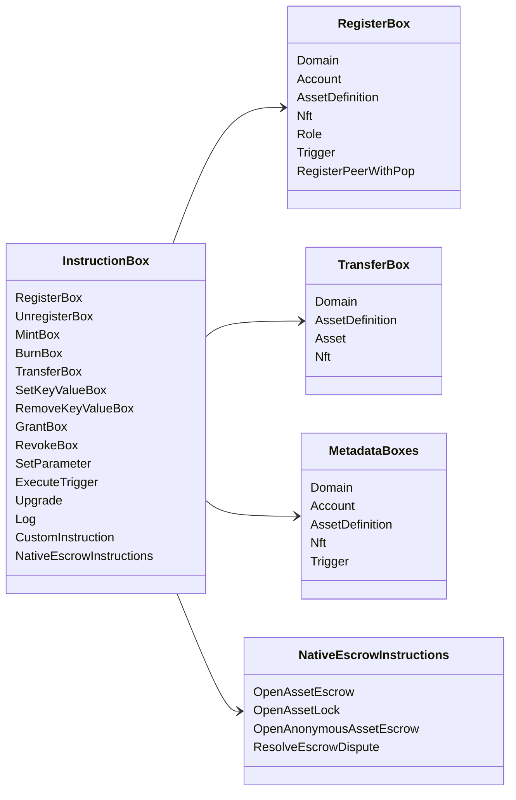

# Iroha Зааврын үйлдлүүд {#iroha-special-instructions}

Одоогийн өгөгдлийн загвар нь эдгээр урьдчилан байршуулсан зааврын гэр бүлүүдийг харуулж байна:

|Заавар|Өөр хувилбарууд|
| --- | --- |
| [`RegisterBox`](/mn/blockchain/instructions.md#un-register) | `Domain`, `Account`, `AssetDefinition`, `Nft`, `Role`, `Trigger`, `RegisterPeerWithPop` |
| [`UnregisterBox`](/mn/blockchain/instructions.md#un-register) | `Peer`, `Domain`, `Account`, `AssetDefinition`, `Nft`, `Role`, `Trigger` |
| [`MintBox`](/mn/blockchain/instructions.md#mint-burn) |тооцоолол `Asset`, давтамж үүсгэгч|
| [`BurnBox`](/mn/blockchain/instructions.md#mint-burn) |тооцоолол `Asset`, давтамж үүсгэгч|
| [`TransferBox`](/mn/blockchain/instructions.md#transfer) | `Domain`, `AssetDefinition`, тоон `Asset`, `Nft` |
| [`SetKeyValueBox`](/mn/blockchain/instructions.md#setkeyvalue-removekeyvalue) | `Domain`, `Account`, `AssetDefinition`, `Nft`, `Trigger` метадата |
| [`RemoveKeyValueBox`](/mn/blockchain/instructions.md#setkeyvalue-removekeyvalue) | `Domain`, `Account`, `AssetDefinition`, `Nft`, `Trigger` метадата |
| [`GrantBox`](/mn/blockchain/instructions.md#grant-revoke) | `Permission` (`Grant<Permission, Account>`), `Role` (`Grant<RoleId, Account>`), `RolePermission` (`Grant<Permission, Role>`) |
| [`RevokeBox`](/mn/blockchain/instructions.md#grant-revoke) | `Permission` (`Revoke<Permission, Account>`), `Role` (`Revoke<RoleId, Account>`), `RolePermission` (`Revoke<Permission, Role>`) |
| [`SetParameter`](/mn/blockchain/instructions.md#setparameter) |сүлжээний параметрийн шинэчлэлт|
| [`ExecuteTrigger`](/mn/blockchain/instructions.md#executetrigger) |гүйцэтгэх ажиллагааг эхлүүлэх|
| [`Upgrade`](/mn/blockchain/instructions.md#other-instructions) |гүйцэтгэгчийг шинэчлэх|
| [`Log`](/mn/blockchain/instructions.md#other-instructions) |гүйцэтгэгчийн бүртгэлийн бичлэг|
| [`CustomInstruction`](/mn/blockchain/instructions.md#other-instructions) |гүйцэтгэгч-онцлог JSON ачаа|
| [Уугуул хөрөнгийн итгэмжлэл](/mn/blockchain/escrow.md) | `OpenAssetEscrow`, `AcceptAssetEscrow`, `MarkEscrowPaymentSent`, `ReleaseAssetEscrow`, `CancelAssetEscrow`, `OpenEscrowDispute`, `ResolveEscrowDispute` |
| [Ерөнхий хөрөнгийн түгжээнүүд](/mn/blockchain/escrow.md#generic-asset-locks) | `OpenAssetLock`, `DrawdownAssetLock`, `CancelAssetLock`, `ExpireAssetLock` |
| [Нэргүй хөрөнгийн итгэмжлэл](/mn/blockchain/escrow.md#anonymous-escrow) | `OpenAnonymousAssetEscrow`, `AcceptAnonymousAssetEscrow`, `MarkAnonymousEscrowPaymentSent`, `ReleaseAnonymousAssetEscrow`, `CancelAnonymousAssetEscrow`, `OpenAnonymousEscrowDispute`, `ResolveAnonymousEscrowDispute` |
| [Атомын хувийн санхүүгийн гүйлгээний тохиролцоо](/mn/blockchain/instructions.md#atomic-private-settlement) | `ActivatePrivateSettlementPoolV1`, `RotatePrivateSettlementPoolPolicyV1`, `FinalizeAtomicPrivateSettlementV1`, `AbortAtomicPrivateSettlementV1` |

Нэмэлт Iroha 3 модуль нь зааврын бүртгэлээр дамжуулан тодорхой домэйны зааврын төрлийг бүртгүүлэх боломжтой. Node-authoritative схем болон үүнийг барьж авсан командын талаар [Өгөгдлийн загварын схем](./data-model-schema.md)-ыг үзнэ үү.

::: details Диаграм: Гол зааврын бүлгүүд

:::
