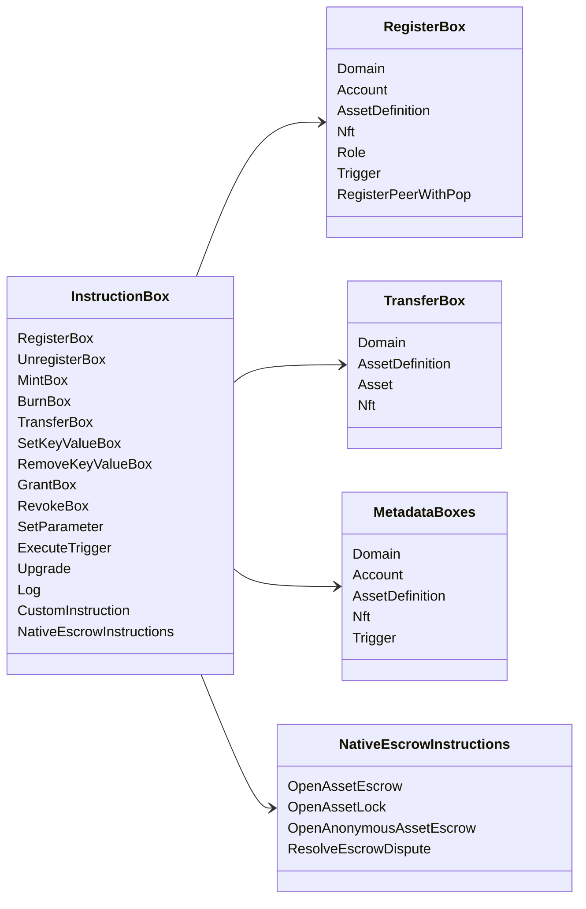

# Iroha Тодруулбал: {#iroha-special-instructions}

Одоогийн мэдээллийн загвар нь эдгээр багтанасан сургалтын гэр бүлүүдийг илрүүлж байна:

| Судалгаа | Үргэлт |
| --- | --- |
| [`RegisterBox`](/mn/blockchain/instructions.md#un-register) | `Domain`, `Account`, `AssetDefinition`, `Nft`, `Role`, `Trigger`, `RegisterPeerWithPop` |
| [`UnregisterBox`](/mn/blockchain/instructions.md#un-register) | `Peer`, `Domain`, `Account`, `AssetDefinition`, `Nft`, `Role`, `Trigger` |
| [`MintBox`](/mn/blockchain/instructions.md#mint-burn) | тооны `Asset`, эргэлт үүсгэх |
| [`BurnBox`](/mn/blockchain/instructions.md#mint-burn) | тооны `Asset`, эргэлт үүсгэх |
| [`TransferBox`](/mn/blockchain/instructions.md#transfer) | `Domain`, `AssetDefinition`, тооны `Asset`, `Nft` |
| [`SetKeyValueBox`](/mn/blockchain/instructions.md#setkeyvalue-removekeyvalue) | `Domain`, `Account`, `AssetDefinition`, `Nft`, `Trigger` металл мэдээлэл |
| [`RemoveKeyValueBox`](/mn/blockchain/instructions.md#setkeyvalue-removekeyvalue) | `Domain`, `Account`, `AssetDefinition`, `Nft`, `Trigger` металл мэдээлэл |
| [`GrantBox`](/mn/blockchain/instructions.md#grant-revoke) | бүртгэлийн зөвшөөрөл, үүрэг гүйцэтгэх зөвшөөрөл |
| [`RevokeBox`](/mn/blockchain/instructions.md#grant-revoke) | Эдгээрийн зөвшөөрөл, Эдгээлийн зөвшөөрөл |
| [`SetParameter`](/mn/blockchain/instructions.md#setparameter) | зангилын параметр шинэчлэл |
| [`ExecuteTrigger`](/mn/blockchain/instructions.md#executetrigger) | цахилгаан үйлдэл |
| [`Upgrade`](/mn/blockchain/instructions.md#other-instructions) | гүйцэтгэгч шинэчлэл |
| [`Log`](/mn/blockchain/instructions.md#other-instructions) | гүйцэтгэгч бүртгэлийн бүртгэл |
| [`CustomInstruction`](/mn/blockchain/instructions.md#other-instructions) | гүйцэтгэгчд зориулсан JSON хэрэглээний ачаалл |
| [Үндэсний хөрөнгийн халамж](/mn/blockchain/escrow.md) | `OpenAssetEscrow`, `AcceptAssetEscrow`, `MarkEscrowPaymentSent`, `ReleaseAssetEscrow`, `CancelAssetEscrow`, `OpenEscrowDispute`, `ResolveEscrowDispute` |
| [Үндэсний активын буцаан](/mn/blockchain/escrow.md#generic-asset-locks) | `OpenAssetLock`, `DrawdownAssetLock`, `CancelAssetLock`, `ExpireAssetLock` |
| [Ашиглалгүй хөрөнгийн хадгаламж](/mn/blockchain/escrow.md#anonymous-escrow) | `OpenAnonymousAssetEscrow`, `AcceptAnonymousAssetEscrow`, `MarkAnonymousEscrowPaymentSent`, `ReleaseAnonymousAssetEscrow`, `CancelAnonymousAssetEscrow`, `OpenAnonymousEscrowDispute`, `ResolveAnonymousEscrowDispute` |

Үндэсний Iroha 3 модульүүд доменийн тухайн чиглэлийн сургалтын төрөлүүдийг бүртгэж болно
Сургалтын бүртгэлээс үүссэн схемын түвшний жагсаалт
одоогийн эх үүсвэр, үзнэ үү [Мэдээллийн загварын схема](./data-model-schema.md).

::: details Хүрэл зураг: Нийслэлийн үндсэн сургалт

:::
