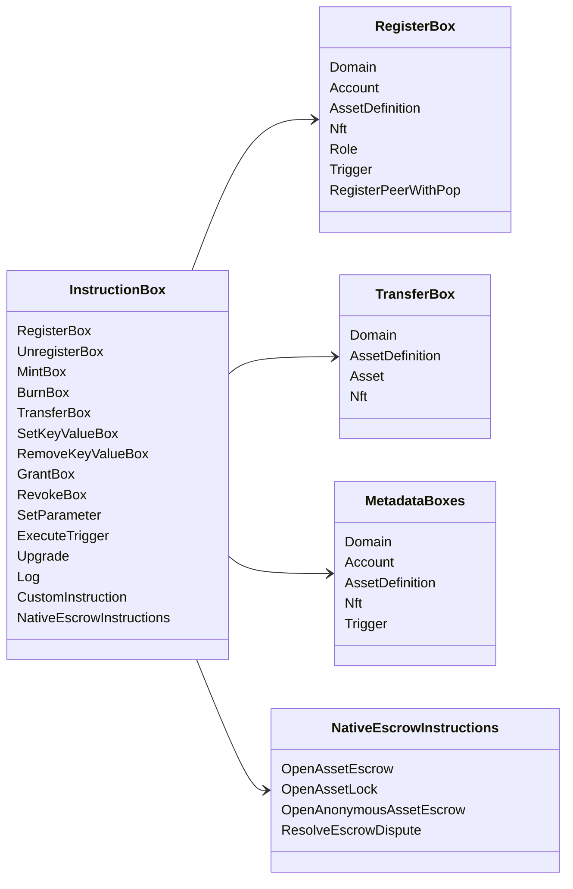

# Iroha Ардчилсан заавар {#iroha-special-instructions}

Одоогийн өгөгдлийн загвар нь эдгээр багтанасан сургалтын гэр бүлүүдийг илрүүлж байна:

|Сургалтын |Үндэсний |
| --- | --- |
| [`RegisterBox`](/mn/blockchain/instructions.md#un-register) | `Domain`, `Account`, `AssetDefinition`, `Nft`, `Role`, `Trigger`, `RegisterPeerWithPop` |
| [`UnregisterBox`](/mn/blockchain/instructions.md#un-register) | `Peer`, `Domain`, `Account`, `AssetDefinition`, `Nft`, `Role`, `Trigger` |
| [`MintBox`](/mn/blockchain/instructions.md#mint-burn) |тооны `Asset`, сэргээлт үүсгэнэ |
| [`BurnBox`](/mn/blockchain/instructions.md#mint-burn) |тооны `Asset`, сэргээлт үүсгэнэ |
| [`TransferBox`](/mn/blockchain/instructions.md#transfer) |`Domain`, `AssetDefinition`, тооны `Asset`, `Nft` |
| [`SetKeyValueBox`](/mn/blockchain/instructions.md#setkeyvalue-removekeyvalue) | `Domain`, `Account`, `AssetDefinition`, `Nft`, `Trigger` металл мэдээлэл |
| [`RemoveKeyValueBox`](/mn/blockchain/instructions.md#setkeyvalue-removekeyvalue) | `Domain`, `Account`, `AssetDefinition`, `Nft`, `Trigger` металл мэдээлэл |
| [`GrantBox`](/mn/blockchain/instructions.md#grant-revoke) |зохицуулах зөвшөөрөл, зохицуулах үүрэг, зохицуулалтын эрх|
| [`RevokeBox`](/mn/blockchain/instructions.md#grant-revoke) |Санхүүжилтийн зөвшөөрөл, санхүүжилтийн үүрэг, үүргийн зөвшөөрөл |
| [`SetParameter`](/mn/blockchain/instructions.md#setparameter) |сүлжээний параметр шинэчлэл |
| [`ExecuteTrigger`](/mn/blockchain/instructions.md#executetrigger) |гүйцэтгэх үйл ажиллагааг эхлүүлэх|
| [`Upgrade`](/mn/blockchain/instructions.md#other-instructions) |гүйцэтгэгчийн шинэчлэл |
| [`Log`](/mn/blockchain/instructions.md#other-instructions) |гүйцэтгэгч номын бүртгэл |
| [`CustomInstruction`](/mn/blockchain/instructions.md#other-instructions) |гүйцэтгэгчд зориулсан JSON ашиг ачаалл |
| [Үндэсний хөрөнгийн баталгаа ](/mn/blockchain/escrow.md) | `OpenAssetEscrow`, `AcceptAssetEscrow`, `MarkEscrowPaymentSent`, `ReleaseAssetEscrow`, `CancelAssetEscrow`, `OpenEscrowDispute`, `ResolveEscrowDispute` |
| [Үндэсний хөрөнгийн буудлууд](/mn/blockchain/escrow.md#generic-asset-locks) |`OpenAssetLock`, `DrawdownAssetLock`, `CancelAssetLock`, `ExpireAssetLock`|
| [Нэгдсэн хөрөнгийн хадгаламж](/mn/blockchain/escrow.md#anonymous-escrow) | `OpenAnonymousAssetEscrow`, `AcceptAnonymousAssetEscrow`, `MarkAnonymousEscrowPaymentSent`, `ReleaseAnonymousAssetEscrow`, `CancelAnonymousAssetEscrow`, `OpenAnonymousEscrowDispute`, `ResolveAnonymousEscrowDispute` |

Үндэсний Iroha 3 модульүүд нь доменийн тодорхой заалын төрөлүүдийг заалын регистрийн дамжуулан бүртгэж болно. Одоогийн эх үүсвэрийн модгаас бий болсон схемын түвшинтэй жагсаалтыг үзнэ үү [Датвалтын загварын схема](./data-model-schema.md).

::: details Хүрэл зураг: Нийслэлийн үндсэн сургалт

:::
