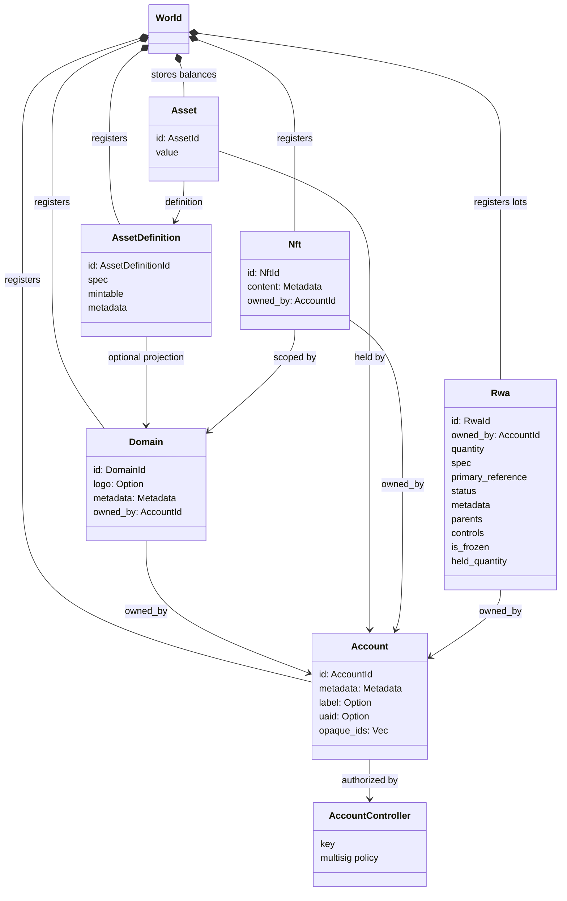
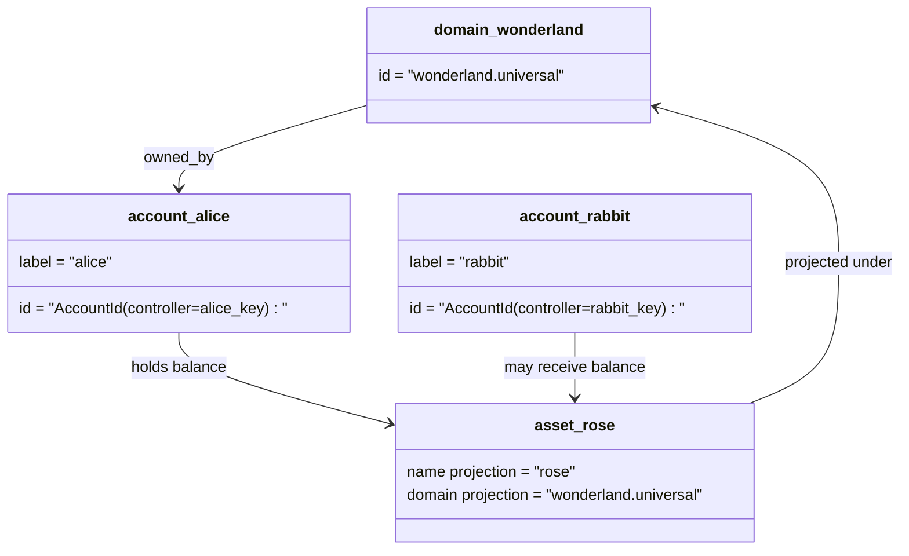

# ဒေတာပုံစံ {#data-model}

Iroha စတိုးဆိုင်များ ledger ပြည်နယ် `World`. ၎င်းရဲ့ ပထမဆုံးထုတ်ဝေမှု ဒေတာပုံစံက အသုံးပြုတဲ့
အောက်ပါ တရားဝင်အမည်များနှင့် အဖွဲ့အစည်းများ:

- Domain တွေဟာ Data Space ကောလဂန်ဖြစ်တယ် ဥပမာ `payments.universal`
- အကောင့်တွေဟာ ကန်အွန်နဲ့ ဒိုမင်မရှိဘူး။ ID ရယူထားသည်
  အကောင့်ထိန်းချုပ်သူ
- asset definitions တွေဟာ domain/name projection ကို ထိန်းထားနိုင်ပေမဲ့ သူတို့ရဲ့ canonical
  စာသားလိပ်စာက မရှင်းလင်းတဲ့ Base58 ID ဖြစ်ပါတယ်
- အရင်းအမြစ်များသည် သီးခြားအရင်းအမြစ် သတ်မှတ်ချက်အတွက်စာရင်းတွင် ထိန်းသိမ်းထားသော ငွေကြေးကျန်ရစ်မှုဖြစ်သည်
- NFTs ဒိုမင်အရည်အချင်းရှိတဲ့ သီးသန့်ပိုင်ဆိုင်တဲ့ မှတ်တမ်းတွေပါ။ IDs မီတာဒေတာ
  အကြောင်းအရာ
- RWAs ထုတ်ကုန်များ -ID ငွေကြေးပမာဏအပြင် ပိုင်ဆိုင်မှုများကို ကိုယ်စားပြုသော အစုများ
  ပိုင်ရှင်၊ အရေအတွက်၊ ဖြစ်စဉ်၊ မက်တာဒေတာများ၊ သိမ်းဆည်းထားခြင်း၊ အေးဆေးခြင်းနှင့် သက်တမ်း စက်ဝန်း
  ထိန်းချုပ်မှု

## ဥပမာ {#example}

တစ်ကြိမ်မှာ Iroha 3 ကွန်ရက်၊ `wonderland.universal` အထဲမှာ domain တစ်ခုဖြစ်ပါတယ်
`universal` datapace. ဒီဥပမာက Canonical accounts တွေကို ထိန်းချုပ်ထားပါတယ်
Key သို့မဟုတ် Policy များဖြင့် domainless အဖြစ် ကုဒ်သွင်းထားသည် I105 အကောင့် IDs. ဖတ်လို့ရတဲ့
အမည်များ `alice@wonderland.universal` ဒီစာရင်းတွေကို သီးခြားအမည်တပ်ထားပြီး
IDs. စီမံကိန်းအရ အရင်းအမြစ် သတ်မှတ်ချက်ကို ဒိုမင်တစ်ခုကနေ တည်ဆောက်နိုင်ပြီး
အမည်များ `rose` အထဲမှာ `wonderland.universal`, Canonical asset ကို
ကြိုးပေါ်တွင် အသုံးပြုသော အဓိပ္ပါယ်ဖွင့်ဆိုချက်လိပ်စာသည် Base58 လိပ်စာ ဖြစ်ပါသည်။

## အမည်မဖော်လိုသူများ {#aliases}

အမည်မဖော်လိုသူတွေဟာ လူနဲ့ မျက်နှာချင်းဆိုင်တဲ့ နာမည်တွေဖြစ်ပြီး Canonical Ledger ID တွေကို အလွှာလိုက်ပါတယ်။
အသုံးဝင်ပါတယ် API, CLI, ပိုက်ဆံအိတ်နဲ့ Explorer နယ်နိမိတ်တွေ, ဒါပေမဲ့ Canonical
IDs ကျဉ်းမြောင်းတဲ့ စာရင်းအင်းကွင်းတွေမှာ သိမ်းထားတဲ့ တည်ငြိမ်တဲ့ အိုင်ဒီဖိုင်တွေ ဆက်ရှိနေပါသေးတယ်။

| ရည်မှန်းချက်         | Canonical ရည်မှန်းချက်                                    | Alias စာလုံးသား                                          | နောက်ခံပုံစံ                                                                 |
| -------------- | --------------------------------------------------- | ------------------------------------------------------ | ----------------------------------------------------------------------------- |
| အသုံးပြုသူ အကောင့်   | နယ်ပယ်မဲ့ `AccountId` ကိုဒ်သွင်းထားသည် I105 လိပ်စာ   | `name@domain.dataspace` ဒါမှမဟုတ် `name@dataspace`            | `AccountAlias`; အဓိက အမည်မဖော်လိုတာက `Account.label`, အပိုအမည်များက ချိတ်ဆက်မှု  |
| အရင်းအမြစ် သတ်မှတ်ချက် | တရားဝင် `AssetDefinitionId` Base58 လိပ်စာ     | `name#domain.dataspace` ဒါမှမဟုတ် `name#dataspace`            | `AssetDefinitionAlias` အရင်းအမြစ် သတ်မှတ်ချက်နှင့် ချိတ်ဆက်ထားသည်                           |
| စာချုပ်       | Canonical Bech32m `ContractAddress`                 | `name::domain.dataspace` ဒါမှမဟုတ် `name::dataspace`          | `ContractAlias` တပ်ဆင်ထားသော စာချုပ်လိပ်စာနှင့် ချိတ်ဆက်ထားသည်                          |
| ဒိုမင်နာမည်    | `DomainId` အထဲမှာ `domain.dataspace` ပုံစံ               | `domain.dataspace`                                    | SNS `domain` နာမည်နေရာ မှတ်တမ်း                                                 |
| ဒေတာနေရာအမည် | အရေအတွက် `DataSpaceId` တက်ကြွတဲ့ Nexus စာရင်းအင်း | ဒေတာနေရာ အမည်များ `universal`, `paynet`, ဒါမှမဟုတ် `zk` | SNS `dataspace` namespace မှတ်တမ်း + active data space ကက်သလဂ်            |

Account aliases တွေက user face account နာမည်တွေပါ
Re-eying because the alias points at the active account ကို အမည်မဖော်လိုလို့ ID ကမ္ဘာ့နိုင်ငံမှတစ်ဆင့်
အညွှန်းကိန်းများနှင့် စာရင်းမှတ်တမ်းများကို အသုံးပြုခြင်း `SetPrimaryAccountAlias` အတွက်
အကောင့်ရဲ့ အဓိက တံဆိပ်၊ `SetAccountAliasBinding` အခြေခံပညာမဟုတ်တဲ့ နောက်ထပ်အတွက်
အမည်မဖော်လိုသူတွေ၊ `FindAccountByAlias` ဒါမှမဟုတ် `FindAliasesByAccountId` စာဖတ်သူတွေ အတွက်ပါ။
Account aliases တွေအတွက် ပုံမှန်အားဖြင့် Active SNS ရယူထားသော စာရင်းအင်းငှား
နှင့်အတူ `AcquireAccountAliasLease` ပြန်လည်ပြုပြင်ခြင်း `RenewAccountAliasLease`.

Asset aliases name asset definitions များ၊ တစ်ဦးချင်းစာရင်းကျန်ငွေများ မဟုတ်ပါ။
aliases နဲ့ contractual aliases တွေဟာ စာဖတ်လို့ရတဲ့ နာမည်တစ်ခုကနေ
လက်ရှိ Canonical Target ကို Asset aliases တွေကို `SetAssetDefinitionAlias`;
alias name segment က asset definition display name နဲ့ ကိုက်ညီဖို့လိုတယ် ဒါမှမဟုတ်
Projected Definition Name: Contract aliases ကို `SetContractAlias`;
alias data space က contract address မှာ encoded လုပ်ထားတဲ့ data space နဲ့ ကိုက်ညီဖို့လိုပါတယ်။
နှစ်ခုစလုံးက သယ်ဆောင်နိုင်ပါတယ် `lease_expiry_ms`; သက်တမ်းကုန်ဆုံးပြီးနောက်မှာ ပြန်လည်ဖြေရှင်းခြင်းကို ရပ်တန့်စေပါတယ်။
ကျေးဇူးတရား ပြတင်းပေါက် ကုန်သွားပြီး ကမ္ဘာ့နိုင်ငံ စာရင်းတွေကနေ ဖယ်ရှားခံရတဲ့အခါမှာပါ။

ဒိုမင်များမှာ သီးခြားဒိုမင်မရှိပါ။ `DomainAlias` object ကို domain ID တစ်ခုက
ဒေတာနေရာအတွက် အရည်အချင်းရှိပြီးသား နာမည်တစ်ခု `payments.universal`. SNS ခြေရာများ
ဒိုမင်အမည်များအတွက် လိုင်စင်ပိုင်ဆိုင်မှု `domain` namespace နဲ့ data space အတွက်
အမည်မဖော်လိုသူများ `dataspace` နာမည်နေရာ။ ကန့်သတ်ထားသော `universal` ဒေတာနေရာ အမည်များ
သတ်မှတ်ထားဖို့လိုတယ်။

## ဆက်စပ်သော စာရွက်စာတမ်းများ {#related-docs}

| အကြောင်းအရာ                                  | ဘယ်ကို သွားရမလဲ                                 |
| -------------------------------------- | ------------------------------------------- |
| ဒိုမင်များ                                | [ဒိုမင်များ](/my/blockchain/domains.md)           |
| စာရင်းများ                               | [စာရင်းများ](/my/blockchain/accounts.md)         |
| အရင်းအမြစ်များ                                 | [အရင်းအမြစ်များ](/my/blockchain/assets.md)             |
| NFTs                                   | [NFTs](/my/blockchain/nfts.md)                 |
| လက်တွေ့ကမ္ဘာက အရင်းအမြစ်များ                      | [လက်တွေ့ကမ္ဘာဆိုင်ရာ အရင်းအမြစ်များ](/my/blockchain/rwas.md)    |
| မီတာဒေတာ                               | [မီတာဒေတာ](/my/blockchain/metadata.md)         |
| မှတ်ပုံတင်ခြင်းနှင့် လွှဲပြောင်းခြင်းဆိုင်ရာ ညွှန်ကြားချက်များ | [ညွှန်ကြားချက်များ](/my/blockchain/instructions.md) |
| Runtime ခွင့်ပြုချက်များ                    | [ခွင့်ပြုချက်များ](/my/blockchain/permissions.md)   |
| အမည်ပေးခြင်းဆိုင်ရာ စည်းမျဉ်းများ                           | [အမည်ပေးခြင်းဆိုင်ရာ စည်းမျဉ်းများ](/my/reference/naming.md)        |
